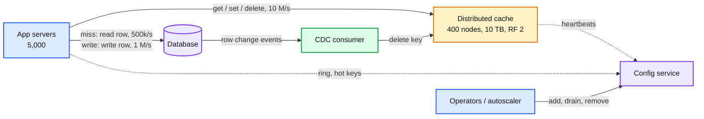
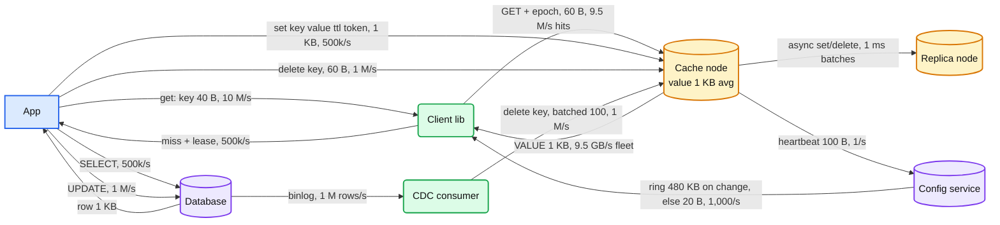
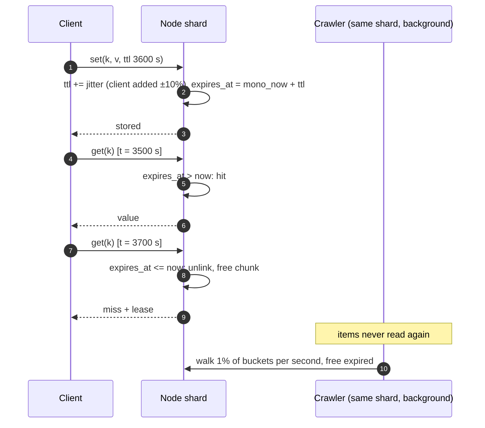
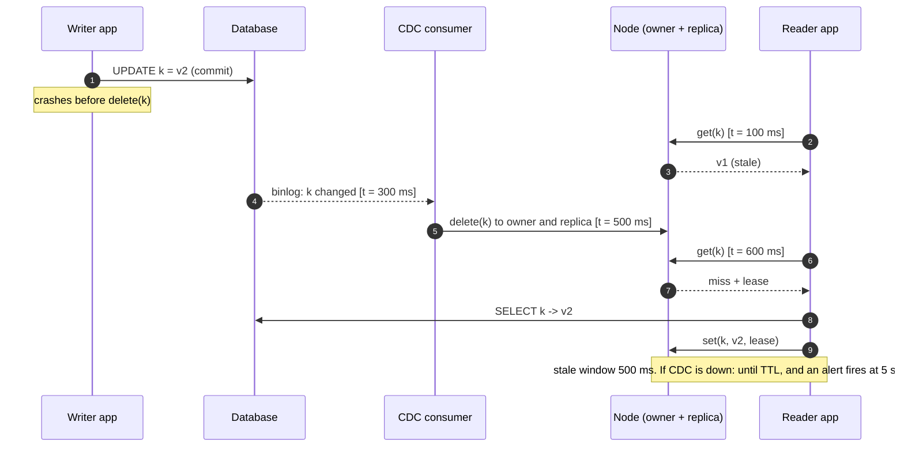
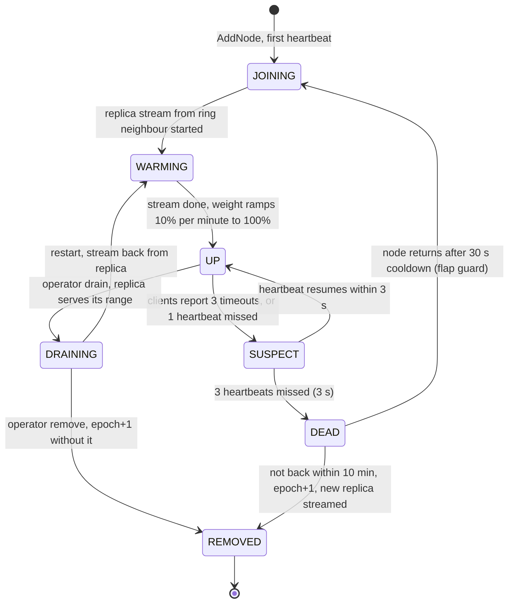
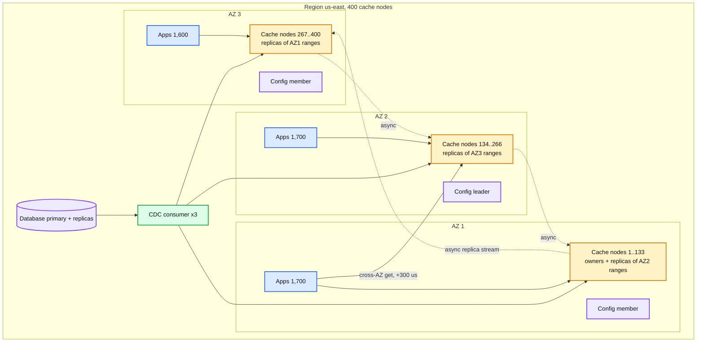
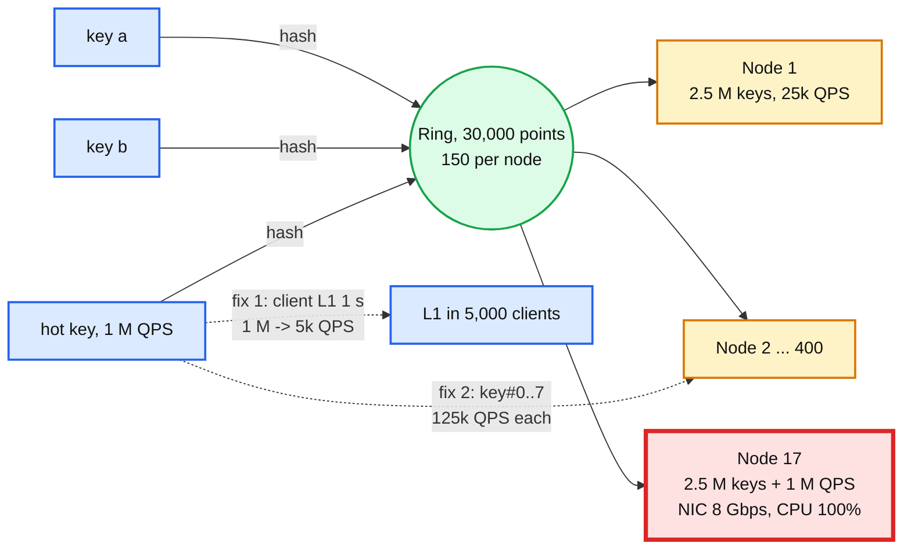
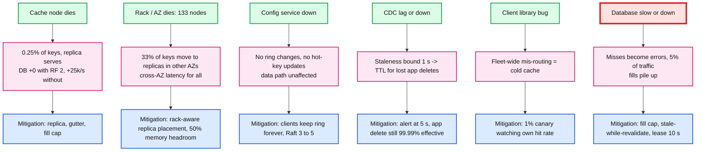
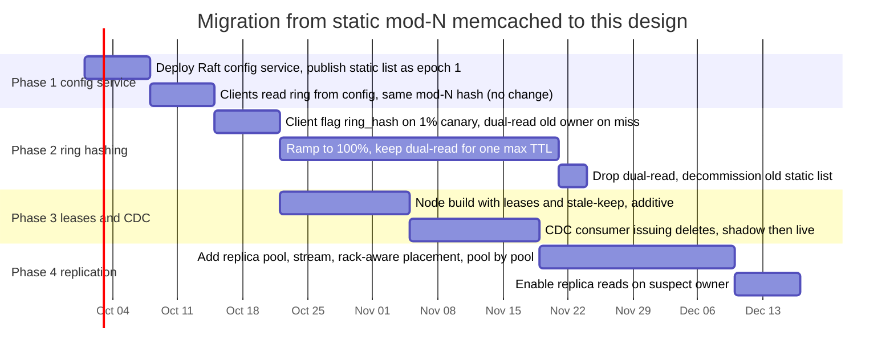

# Diagrams: distributed cache

The D1 to D12 set from `hld/CLAUDE.md` §4. Diagrams already embedded in [`solution.md`](solution.md) are listed with a pointer, not pasted twice.

| # | Diagram | Where |
|---|---|---|
| D1 | Context | below |
| D2 | Data flow | below |
| D3 | Component architecture (final design) | `solution.md` §6 |
| D4 | Happy path per FR | FR1 get hit: §6 Flow 1. FR1 miss + lease: §5.3. FR2 TTL: below. FR3 add node: §6 Flow 5. FR4 node death: §5.4 |
| D5 | Failure paths | Node death: §5.4. Config leader death: §10.4. Slow DB: §10.4. Lost delete: below |
| D6 | Decision flow (client per get) | `solution.md` §5.1 |
| D7 | Entity relationship | `solution.md` §3.3 |
| D8 | State machine (node lifecycle) | below |
| D9 | Deployment / topology | below |
| D10 | Scaling / partitioning (the ring, the hot key) | below |
| D11 | Failure mode map | below |
| D12 | Rollout / migration | below |

---

## D1. Context (zoom-out)

## D2. Data flow (DFD)

## D4 (FR2). TTL: set, lazy expiry, crawler

## D5 (fourth). Lost delete: app crashes between DB write and cache delete

## D8. Node lifecycle

## D9. Deployment / topology

Apps read from whichever AZ owns the key (two thirds of reads cross an AZ, about 300 us extra). Netflix's alternative is a full copy per AZ with AZ-local reads, at 3x memory. We take the latency; a Google L6 interviewer may push for the Netflix layout when the AZ link is the bottleneck.

## D10. Scaling / partitioning: the ring and the hot key

## D11. Failure mode map

## D12. Rollout / migration from "memcached with mod N in app config"

Rollback points: phase 1 (clients fall back to the static list), phase 2 (flag off, old owners still warm), phase 3 (node build without leases still speaks the protocol; CDC consumer can be stopped, app deletes continue), phase 4 (replica reads off, replicas idle).
