# HLD: Distributed cache from scratch

> One-line answer: a smart client library routes every key to one of about 200 cache nodes by consistent hashing (150 virtual nodes each) over a membership view that a small strongly consistent config service publishes with an epoch; each node is a shared-nothing in-memory hash table with slab memory, W-TinyLFU eviction, and lazy plus crawler TTL expiry; the DB is the source of truth and the cache is filled on miss (cache-aside), invalidated by delete-on-write with a CDC backstop; hot keys are absorbed by a 1 s client-side L1 and key replication; expiry stampedes are stopped by per-key leases; a dead node's keys miss to the DB for at most 30 s, bounded by a gutter pool; an optional async replica per shard turns the cache into a tier the DB can survive losing.

Sources: the Databricks and Google prompts as reported, and the public Hello Interview breakdown (1 TB, 100k QPS, <10 ms; deep dives on availability, even distribution, read-hot and write-hot keys) which this note scales up 100x (see [`research/interview-framing-survey.md`](research/interview-framing-survey.md)), Facebook's "Scaling Memcache" (NSDI 2013), the Redis Cluster spec, and the Memcached wiki (see [`research/real-world-architectures-survey.md`](research/real-world-architectures-survey.md)). Written flow-first: §4 builds one diagram one functional requirement at a time, §5 breaks and mutates that design one non-functional requirement at a time, §6 shows the final design and the five core flows to rehearse. Reusable blocks: [`../../concepts/caching-patterns.md`](../../concepts/caching-patterns.md), [`../../concepts/sharding.md`](../../concepts/sharding.md), [`../../concepts/replication-and-quorums.md`](../../concepts/replication-and-quorums.md), [`../../concepts/stream-sketches.md`](../../concepts/stream-sketches.md), [`../../concepts/gossip-protocol.md`](../../concepts/gossip-protocol.md).

---

## 1. Understanding the problem

Restate before designing. A cache is a **lossy, bounded, in-memory copy** of data that lives somewhere else. Three things follow and shape every decision: (1) losing data in the cache is not data loss, only latency; (2) the cache's real customer is the database, whose load equals `(1 - hit rate) × traffic`; (3) the cache is never authoritative, so every value carries a staleness bound. Say all three in the first minute.

### 1.1 Functional requirements

Core:
1. **`get` / `set` / `delete` / `mget`.** Keys up to 250 B, values up to 1 MB, batches of up to 100 keys. `set` takes a TTL.
2. **TTL expiry.** No item outlives its TTL (default 1 h, max 30 d). An expired item is never served.
3. **Scale out and in.** Adding or removing a node moves about `1/N` of the keys, not all of them, and the client finds the new owner without a restart.
4. **Survive node failure.** A dead node costs a bounded number of extra DB reads and the cache heals with no operator action.

Below the line (say it out loud):
- Durability and persistence. A restart is a cold cache. §5.4 covers warming, not recovery.
- Data structures beyond bytes (lists, sorted sets, streams). Redis sells these; they change the node design. Out.
- Multi-key transactions. Single-key `cas` (compare-and-swap on a version) is the most we offer.
- Strong consistency with the DB. We bound staleness in seconds (§5.5), we do not promise zero.

### 1.2 Non-functional requirements

Ask for scale first: 10 M reads/s, 1 M writes/s, 1 B keys, 10 TB. Then:

| Dimension | Target | Why it matters |
|---|---|---|
| Latency | `get` p50 200 us, p99 1 ms in-DC at the client. `mget` 100 keys p99 2 ms | The app calls the cache 5 to 20 times per request. At 1 ms p99 each, 10 sequential calls already cost 10 ms of budget |
| Hit rate | >= 95% steady state, >= 90% during any single failure | The DB sees `(1 - hit) × 10 M`. 95% is 500k QPS. 90% is 1 M. The DB is sized for 1 M, so 90% is the floor |
| Availability | Cache reads 99.99%. One node loss adds <= 1% of DB capacity. Ten node losses (5%) must still not take the DB down | Cache availability is really DB overload protection |
| Consistency | Eventual, bounded: a value is at most `TTL` old, and at most 1 s old after the write that changed it (in region). Writer sees its own write in region | Product needs "I edited my profile and see it". Everyone else can be 1 s behind |
| Memory | <= 100 B overhead per key. Node at 80% of RAM, never swapping | 1 B keys × 100 B = 100 GB of overhead, 1% of the fleet. Swap turns a 200 us cache into a 10 ms one |
| Scale | 10 M reads/s, 1 M writes/s, 10 TB, 5,000 app servers | Node count comes from memory, not QPS (§2) |
| Operations | Add 10% capacity with no visible hit-rate dip; rolling restart with no page | A cache that must be drained by hand is not a cache the org will run |

---

## 2. Back-of-envelope

Show the math. Only the numbers that change the design.

**Node count comes from memory, not from QPS.** 10 TB of values, plus overhead: 1 B keys × (key 40 B + item header 56 B + slab waste ~8%) is about 1 TB. Working set 11 TB. A node with 128 GB RAM, 80% usable, holds 100 GB. `11 TB / 100 GB = 110` nodes. Round to **200 nodes** for a 45% headroom so a 10% node loss still fits. Each node then serves `10 M / 200 = 50k reads/s` and `5k writes/s`, which is 5% of what one memcached node does (about 1 M ops/s with 8 threads). So the fleet is memory-bound and CPU-idle. That is normal, and it means hot keys, not average load, set the per-node ceiling (§5.3).

**Bandwidth.** `10 M/s × 1 KB = 10 GB/s = 80 Gbps` across the fleet, 400 Mbps per node on a 25 Gbps NIC. A 1 MB value at 50k QPS would be 400 Gbps on one node. That is why large values get their own pool and their own limits (§5.1).

**DB load from misses.** At 95% hit: 500k reads/s reach the DB. Lose one of 200 nodes: its 0.5% of keys miss until refilled, adding at most `0.005 × 10 M = 50k reads/s`, which is 10% more DB load, fine. Lose 20 nodes: `+1 M reads/s`, three times the DB budget, so the DB dies. This one number decides whether we replicate (§5.4). Refill takes about `keys per node / fill rate = 5 M keys / 50k per s = 100 s` to get back to 90% of the node's hit rate, so "bounded" means "about 100 s of `+50k` per node lost".

**Connections.** 5,000 app servers × 200 nodes = 1 M TCP connections fleet-wide, 5,000 per node. Memcached handles it (it is epoll, about 1 KB of kernel memory each, so 5 MB per node). At 50,000 app servers it would be 250k per node and 10 M fleet-wide, which is when a proxy tier (mcrouter) earns its keep (§5.1).

**Hot key.** One key at 1 M QPS on one node with 1 KB values: 8 Gbps and 1 M ops/s, the whole node's throughput and a third of its NIC. Any single key above about 100k QPS needs to be spread (§5.3). The detector runs in the client, so its budget is `50k keys tracked × 16 B = 800 KB` per app server.

**Stampede.** A hot key with 100k QPS expires. In the 2 ms it takes one DB read to come back, 200 requests have missed. Without a lease all 200 go to the DB for the same row. With a lease 1 goes. Multiply by 1,000 hot keys expiring in the same minute and this is the difference between the DB living and dying.

**Membership churn.** 200 nodes, one hardware failure per node per year, gives one membership change every 2 days. Deploys add one per day. The ring changes about once a day; it is a slow-path event and can be strongly consistent through a config service (§4.3).

**Staleness after a write.** Delete-on-write from the app reaches the cache in one RTT (200 us). The CDC backstop from the DB binlog lands in about 500 ms. So the honest bound is 1 s in region, `TTL` if both invalidation paths fail.

---

## 3. The set-up

### 3.1 Core entities

- **Item**: `key, value, flags, expires_at, cas_version, size`. Lives on exactly one node (two with replication).
- **Node**: `node_id, host:port, memory_bytes, state (joining, up, draining, dead), shards`.
- **Ring**: the membership view: `epoch, [(hash_point, node_id)] × 150 per node`. Published by the config service, cached by every client.
- **Pool**: a named set of nodes with its own ring and limits (default pool, large-value pool, gutter pool).
- **Lease**: a per-key token handed to one client on a miss, valid for 10 s, so only that client fills the key.
- **Invalidation event**: `(key, version, ts)` produced by the app on write and by CDC from the DB log.

### 3.2 API

Client library API (what the app sees). Protocol is binary, length-prefixed, pipelined on one connection.

| Call | Request | Response | Notes |
|---|---|---|---|
| `get(key)` | `key` | `value, flags, cas` or `miss` or `miss + lease_token` | Lease only issued once per key per 10 s (§5.3) |
| `mget(keys)` | up to 100 keys | map of hits | Client groups keys by node, fans out, merges. Missing keys are misses, never errors |
| `set(key, value, ttl, [cas], [lease_token])` | value <= 1 MB, ttl <= 30 d | `stored`, `not_stored`, `exists` | With `cas`, stores only if version matches. With `lease_token`, stores only if the token is still valid (stale-set guard) |
| `delete(key)` | `key` | `deleted` or `not_found` | Idempotent. Also invalidates any lease on the key |
| `add(key, value, ttl)` | | `stored` or `exists` | Store only if absent. Used for locks and negative cache entries |
| `touch(key, ttl)` | | | Extend TTL without re-sending the value |

Internal (node to config service, client to config service):

| RPC | Direction | Payload |
|---|---|---|
| `GetRing(pool, known_epoch)` | client to config, on startup and every 5 s | `epoch, nodes[], points[]` or `unchanged` |
| `Heartbeat(node_id, epoch, used_bytes, ops)` | node to config, every 1 s | `ack` or `you_are_removed` |
| `ReportFailure(node_id, epoch)` | client to config, after 3 consecutive timeouts to a node | `ack` |

### 3.3 Data model

There is no database schema. The data model is the in-memory layout on a node plus the ring in the config service. Both matter because the interviewer asks about per-key overhead and about who owns the map.

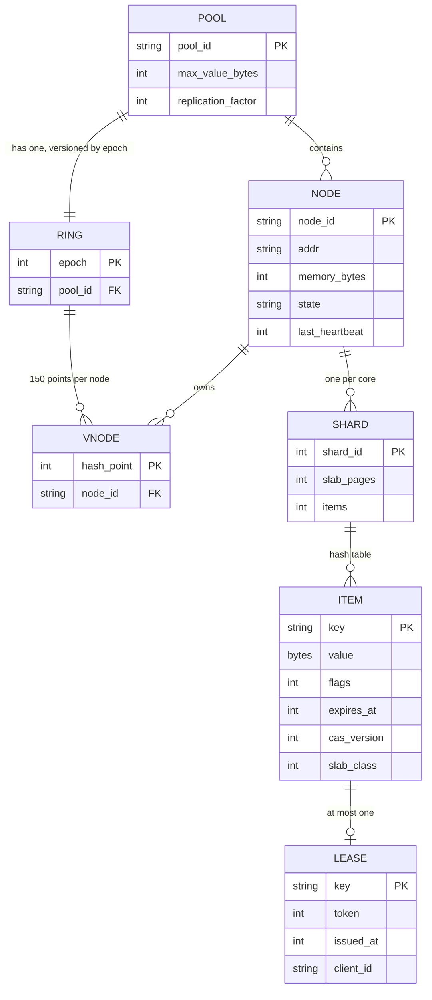

Access patterns that justify it: a `get` is one hash on the client to pick the node (binary search over 30,000 ring points, about 15 comparisons), then one hash on the node to pick the shard and the bucket. The ring is read by every client on every request from local memory and written about once a day, so it is the textbook case for "cache the config, watch for changes". `expires_at` is absolute (node monotonic clock plus TTL at set time) so a clock jump cannot resurrect or mass-expire items. `cas_version` is a per-node 64-bit counter, not a global one; it only has to be unique per key per node lifetime.

---

## 4. High-level design

One subsection per functional requirement. Each one traces input to output through the boxes, adds the boxes it needs to a single diagram, and ends with what is still missing (which a deep dive in §5 fixes). The design at the end of §4 is deliberately the simple version.

### 4.1 `get` / `set` / `delete` / `mget`: the app reads through the cache

**Flow (simple version, `get` miss then fill):**

1. The app calls `cache.get("user:42")` on the client library (in-process, one per app server).
2. The client hashes the key (`xxhash64`) and picks a node. Simple version: `node = hash mod N` over a static list in config.
3. The client sends `GET user:42` on a pooled TCP connection to that node. Requests are pipelined: many in flight per connection, responses come back in order.
4. On the node, one of 8 shard threads owns the connection. It hashes the key to a bucket in its hash table. Hit: copy the value onto the socket. Miss: reply `miss`. No locks: each shard owns its table, its slab pages, and its connections.
5. Miss: the app reads the DB (`SELECT ... WHERE id = 42`), then calls `cache.set("user:42", row, ttl = 1 h)`.
6. The node allocates a slab chunk of the right size class, copies the value in, links the item into the bucket chain and the eviction list. If memory is full, it evicts first (§5.2).
7. Later `get`s hit until the item expires, is evicted, or is deleted.

**Write path (`update user 42`)**: the app writes the DB, then `cache.delete("user:42")`. The next reader misses and refills. This is cache-aside with delete-on-write. We do not `set` the new value from the writer, because two writers racing can leave the older value in the cache (the race is in [`../../concepts/caching-patterns.md`](../../concepts/caching-patterns.md) §3.1); a delete is always safe, and it costs one extra miss.

**`mget`**: the client groups the 100 keys by node, sends one pipelined request per node in parallel, and merges. Missing keys are returned as misses, never as an error; the app decides what to fetch from the DB.

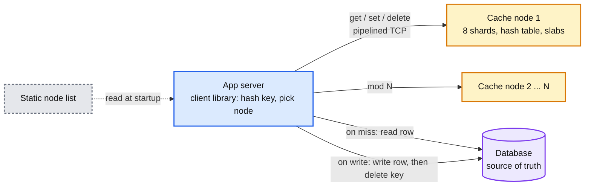

Data model so far: `item {key, value, flags, expires_at, cas_version}` in a per-shard hash table; a static `nodes[]` list.

**What is still missing:** `mod N` means adding one node remaps `N/(N+1)` of the keys (91% at N = 10, 99.5% at N = 200), which is a full cold cache and a DB outage. §4.3. Also: nothing bounds a value's staleness after a failed delete, nothing stops 200 clients from filling the same key at once, and a 1 MB value shares a connection with 1 KB ones. §5.

### 4.2 TTL: no item outlives its expiry

**Flow:**

1. `set(key, value, ttl = 3600)`: the node stores `expires_at = now_mono + 3600 s` using its monotonic clock, not wall time. A clock step (NTP correction, VM migration) cannot expire everything at once or resurrect the dead.
2. **Lazy expiry on read.** Every `get` compares `expires_at` to `now`. Expired: unlink, free the chunk, reply `miss`. This costs nothing extra and catches every item that is ever read again.
3. **Crawler for the rest.** Items that expire and are never read again would sit in memory until eviction reaches them. A background crawler per shard walks the hash table at a bounded rate (say 1% of items per second, so a full pass every 100 s) and frees expired items. It reclaims memory for the live working set; it is not what makes TTL correct.
4. **Jitter.** The client adds `±10%` random jitter to every TTL so 1 M items written in the same minute (a deploy, a cache warm) do not expire in the same minute. Without it, TTL creates its own stampede.

Data model so far: `expires_at` (absolute, monotonic). Crawler position per shard.

**What is still missing:** the moment a hot item expires, every reader misses at once and all of them go to the DB. §5.3 (leases, and refreshing before expiry).

### 4.3 Scale out and in: adding a node moves 1/N of the keys

**What replaces `mod N`: consistent hashing with virtual nodes.** Hash each node to 150 points on a 64-bit ring. A key belongs to the first node point clockwise from `hash(key)`. Adding a node claims 150 points and takes about `1/N` of the keys from its neighbours, spread across all of them; removing one gives its `1/N` back to its neighbours. With 150 points per node the load spread is within about ±10% of the mean; with 1 point it would be ±50%. The runnable comparison of mod-N vs ring is in [`../../concepts/sharding.md`](../../concepts/sharding.md) §3.

**Who owns the ring: a config service, not gossip.** The ring changes about once a day (§2), so it is a slow-path fact. Put it in a small strongly consistent store (etcd, ZooKeeper, or 3 nodes of Raft: [`../../concepts/raft.md`](../../concepts/raft.md)) with an **epoch** that increments on every change. Every client caches the ring and polls `GetRing(known_epoch)` every 5 s (or watches). Every request the client sends carries the epoch; a node that sees a stale epoch answers `MOVED epoch` so the client refreshes immediately. Gossip would work for membership (Redis Cluster does it) but gives no single answer to "who owns key k right now", and two clients disagreeing on the owner means the same key filled in two places and invalidated in one. Rule from [`../../concepts/gossip-protocol.md`](../../concepts/gossip-protocol.md): gossip for liveness, never for ownership.

**Flow: `add node 201`**

1. Operator (or autoscaler) calls the config service: `AddNode(201, addr, weight)`. The service writes the new ring with `epoch + 1` in one transaction.
2. Node 201 starts empty, heartbeats, and is marked `joining`.
3. Clients pick up the new ring within 5 s. From then on `1/201` of keys route to node 201 and miss.
4. Those misses refill from the DB at the normal miss rate: `0.5% × 10 M = 50k reads/s` extra for about 100 s. Same shape as a single node loss, so the DB budget in §1.2 already covers it. Adding 20 nodes at once is 20 node losses at once; do it 2 at a time, 2 minutes apart (§5.6 makes this gentler).
5. The keys that moved still sit on the old owners until evicted or expired. That is fine: nobody asks the old owner any more, and if the ring rolls back they are still warm.

**Flow: `remove node 17` (planned)**: `epoch + 1` with node 17 marked `draining`. Clients route its keys to the new owners, which miss and refill. After 2 minutes node 17 sees no traffic and is shut down. No data is copied: a cache node's data is reproducible from the DB, and copying 100 GB across the network to save 100 s of misses is not worth the mechanism.

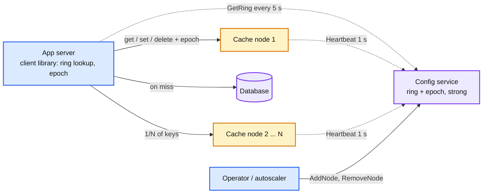

Data model so far: `ring {epoch, points[]}`, `node.state`, `node.last_heartbeat`. Requests carry `epoch`.

**What is still missing:** what the client does when a node stops answering, and how much the DB pays. §4.4.

### 4.4 Survive node failure: bounded DB cost, no operator

**Flow: node 17 dies (kernel panic)**

1. Requests to node 17 time out. Client timeout for a `get` is 20 ms (20x the p99), so within 20 ms every in-flight request to node 17 has failed.
2. The client treats the timeout as a **miss**, not an error. The app reads the DB and continues. The user sees a slower request, not a failure. A cache client that throws on node failure has turned a cache into a dependency.
3. After 3 consecutive timeouts the client marks node 17 `suspect` locally: for the next 10 s it sends nothing there and treats all of its keys as misses. It also calls `ReportFailure(17, epoch)`. Every client does this independently, so within about 100 ms of the crash no client is waiting on node 17.
4. The config service sees heartbeats stop (3 missed, 3 s) plus failure reports from many clients, marks node 17 `dead`, and publishes `epoch + 1` with node 17 removed. Clients pick it up within 5 s and route its keys to the ring neighbours, which miss and refill.
5. Cost to the DB: node 17's 0.5% of keys miss from `t = 0` until refilled, about `+50k reads/s` decaying over 100 s. That is the budget in §1.2.
6. Node 17 comes back (reboot, 2 minutes). It heartbeats, the config service re-adds it at `epoch + 2`, and its keys route back to it, cold, for another 100 s of refill. The keys the neighbours warmed are now orphaned and expire or evict. This double cold-start is the price of not copying data, and it is why we wait 30 s before re-adding a node that flapped.

Why not have the client rehash to the next node on the ring immediately, without waiting for the config service? It can and does (step 3 treats the node as absent, which is the same lookup). The config service publication is what makes every client agree, so that a `delete` and a later `get` for the same key land on the same node. During the 5 s window they may not, and that is one of the two consistency holes we accept (§5.5).

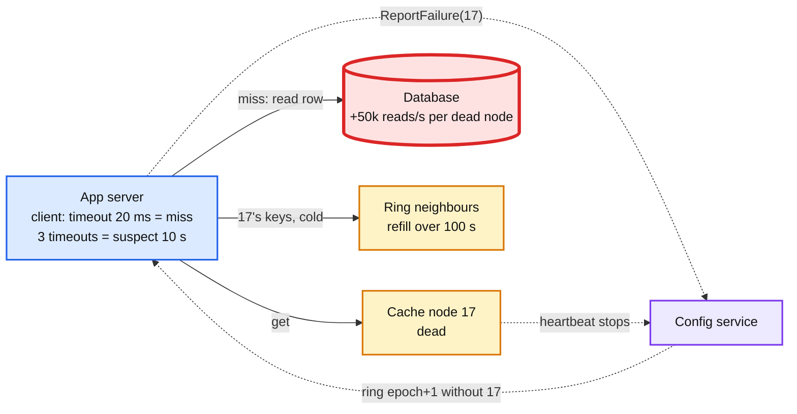

Data model so far: client-local `suspect[node] until ts`; config service `node.state = dead`, failure report counts.

End of §4. We have a correct but naive design: routing is right, TTL is right, membership is right, and a single node loss is bounded. It falls over on: 20 node losses (DB dies), one hot key (one node dies), one hot key expiring (DB dies), large values (p99 dies), and a delete that races a fill (stale forever). §5 takes these in order of what an interviewer asks first.

---

## 5. Deep dives

One per non-functional requirement. Each one names what breaks in the §4 design with a number, fixes it, and lists what changed in the API, the data model, and the diagram.

### 5.1 "p99 1 ms at the client": the request path

**What breaks.** Walk one `get`: client hash (100 ns), ring lookup (15 comparisons, 100 ns), syscall to write (5 us), network (in-DC RTT 100 to 200 us), node parse plus hash lookup plus memcpy (2 us), syscall to read (5 us). About 250 us if nothing is queued. Three things push p99 past 1 ms in the §4 design:

1. **Head-of-line blocking on a shared connection.** Responses on one pipelined connection come back in order. A 1 MB value takes `1 MB / 25 Gbps = 320 us` of wire time and 1 MB of memcpy, and every 1 KB `get` queued behind it waits. Ten such values per second per connection is enough to put 1% of requests over 1 ms.
2. **`mget` incast.** A 100-key `mget` fans out to about 80 nodes, which all answer within the same 200 us. 80 × 1 KB replies arrive at one client NIC queue at once; with 1,000 concurrent `mget`s per app server that is a burst that overflows the ToR switch buffer, drops packets, and TCP retransmits after 200 ms (the minimum RTO). Facebook measured this and fixed it with a sliding window on outstanding requests.
3. **Connection count.** 5,000 app servers × 200 nodes is 1 M connections, 5,000 per node, which is fine. But every new app server opens 200 connections, and a deploy that restarts 5,000 app servers in 5 minutes opens 1 M connections in 5 minutes, 3,300 per second per node. Accept-queue overflow is a p99 event.

**Fix.**
- **Separate pool for large values.** Values above 64 KB go to the `large` pool (its own ring, its own connections, `max_value 1 MB`). The client picks the pool by value size on `set` and remembers it in `flags` on the key's small-pool entry (a 16 B pointer item). Small `get`s never queue behind a large one. Values above 1 MB are rejected; the app chunks them or does not cache them.
- **Sliding window per client per node.** At most `W` outstanding requests per connection, `W` adapts like TCP's congestion window: grow on success, halve on timeout. Facebook's figure is that too small a window costs latency (requests wait in the client) and too large costs incast; the sweet spot is found by measurement, not set by hand.
- **Connection warm-up and reuse.** Connections are opened at app start with a jittered ramp (200 connections over 10 s), kept forever, and multiplexed. Two connections per node per app server, not one, so a slow reply on one does not block the other.
- **UDP for `get`, TCP for everything else** is what Facebook did to cut connection state and syscalls. We do not, because the 0.25% drop rate they saw becomes miss traffic and modern kernels and NICs have closed most of the gap. Say it as an option, not a default.

**Push back on the textbook answer.** "Put a proxy (mcrouter, twemproxy) in front." A proxy cuts connections from `apps × nodes` to `apps + nodes`, centralises routing, and lets the cache team change the ring without redeploying apps. It also adds one hop (100 to 200 us, half the p50 budget), a second thing to scale, and a second failure domain. At 5,000 app servers the smart client wins on latency and simplicity; at 50,000, or when 6 languages need the client, the proxy wins. We start with the smart client and keep the wire protocol proxy-compatible so the switch is a config change. [`deep-dives/client-and-network-path.md`](deep-dives/client-and-network-path.md).

**What changed:** two pools (`default`, `large`) each with a ring; `flags` on the item points at the large pool; per-connection sliding window in the client. Diagram: a `large` pool box beside the default pool.

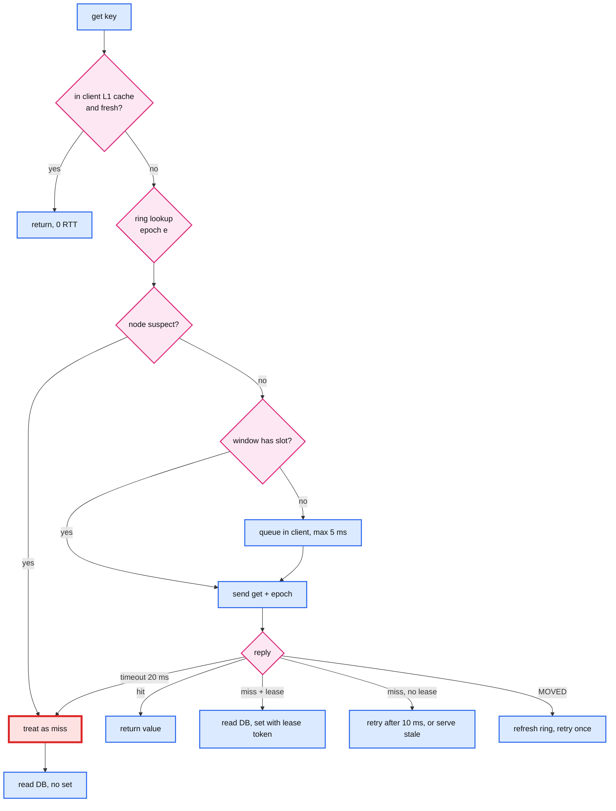

### 5.2 "95% hit rate in 100 GB per node": eviction and memory layout

**What breaks.** The §4 node "evicts first" when full. Three ways to do that wrong:

1. **Exact LRU with a doubly linked list.** Every `get` moves the item to the head: two pointer writes on a shared list, under a lock if the shard has more than one thread, and 16 B of `prev/next` per item. At 50k ops/s per node it is affordable; the problem is not CPU, it is that LRU is the wrong policy for a scan or a one-hit-wonder-heavy workload. Twitter's trace study found most cache clusters are read-heavy with many one-hit keys; those evict useful items under LRU.
2. **Per-key overhead.** A naive item: 8 B `prev`, 8 B `next`, 8 B hash chain, 8 B `expires_at`, 8 B `cas`, 4 B flags and lengths, key up to 250 B, and `malloc` rounding. 100 B of overhead on a 1 KB value is 10%; on a 100 B value it is 100%. Memcached's item header is 48 to 56 B for this reason.
3. **Fragmentation.** `malloc` per value over days of churn fragments the heap; Redis reports a `mem_fragmentation_ratio` and has an active defragmenter because of it. A node that is 100 GB "used" and 130 GB RSS swaps and dies.

**Fix: slab allocation, a sampled or sketch-based policy, and one header layout.**
- **Slab classes.** Memory is carved into 1 MB pages; each page belongs to one size class; classes grow by a factor of 1.25 (96 B, 120 B, 150 B, ... up to 1 MB). An item goes in the smallest class that fits, so waste is under 25% worst case and about 8% on a real distribution. Freed chunks go back to the class free list, so there is no heap fragmentation, ever. The trap is **calcification**: the class mix is frozen at whatever the first hours of traffic looked like. Fix with a slab rebalancer that moves empty pages between classes when one class evicts far more than another (memcached's `slab_automove`).
- **Policy: W-TinyLFU.** A small admission window (1% of the cache, plain LRU) catches bursts; the main region (99%, segmented LRU: 20% protected, 80% probation) admits an item only if a count-min sketch says it has been seen more often than the item it would evict. The sketch costs 4 bits per counter, about 8 bits per cache entry, and halves all counters every `10 × capacity` events so it forgets. On the database, search, and OLTP traces in the TinyLFU paper it beats LRU by several points of hit rate wherever there is a one-hit-wonder tail. It is not free of failure modes: the S3-FIFO study over 6,594 production traces found TinyLFU worse than plain FIFO on almost 20% of them. **S3-FIFO** (three FIFO queues, small 10% / main 90% / ghost, new objects that are hit while in the small queue get promoted, the rest are evicted early) cuts miss ratio vs FIFO by more than 32% on the top 10% of traces and 14% on average, with no per-access pointer writes and no policy that fails on a trace class. Pick S3-FIFO if the workload is unknown or the node is CPU-bound; pick W-TinyLFU when the traces are known to be frequency-skewed. Either is a 5 to 15 point hit-rate gain over LRU on our kind of workload, and either is a defensible answer as long as the number comes with it. Numbers and the trade in [`deep-dives/eviction-and-memory-layout.md`](deep-dives/eviction-and-memory-layout.md).
- **Header.** `next_in_bucket (4 B index), lru_prev/next (4 B indexes into the slab, not pointers), expires_at (4 B, seconds relative to node start), cas (8 B), flags (4 B), key_len (1 B), value_len (4 B), slab_class (1 B)` is 34 B. With the key inline and 8 B alignment, overhead is about 40 B plus key. Under the 100 B target for any key up to 60 B.

**Push back on the textbook answer.** "Use LRU" is a fine answer for the coding round (LeetCode 146) and a below-Staff answer here. Say what LRU gets wrong (scans, one-hit wonders), name the sketch-based policy, and give the number (about 10 points of hit rate, which at 10 M QPS is 1 M fewer DB reads per second). Redis's own answer is "approximate LRU by sampling 5 keys" because a true list costs memory and the approximation is within a few percent; that is the honest engineering trade, and it is worth saying that Redis chose it.

**What changed:** node memory is slab pages per class with a rebalancer; the eviction structure is W-TinyLFU (sketch + window + SLRU); item header is 34 B. API unchanged. Diagram: inside the node box, `slab classes` and `sketch + SLRU`.

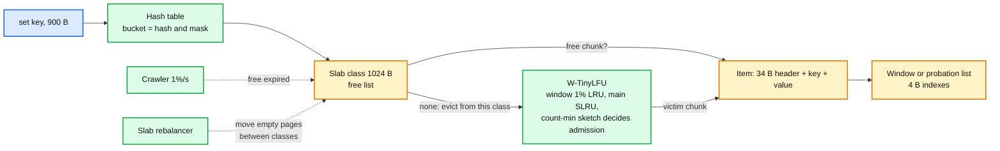

### 5.3 "One key at 1 M QPS, and its expiry": hot keys and stampedes

**What breaks.** Two different failures with two different fixes.

- **Hot key.** Consistent hashing spreads keys, not requests. One key at 1 M QPS is on one node, whose ceiling is about 1 M ops/s in total; every other key on that node (5 M of them, 0.5% of the fleet) now sees the p99 of a saturated node. The 8 Gbps of replies for that key is a third of its NIC. Sharding cannot help: the unit of placement is the key.
- **Stampede on expiry or invalidation.** A key at 100k QPS expires. During the 2 ms DB read, 200 requests miss and all 200 go to the DB for the same row, then all 200 `set` it. Now scale to the 1,000 hottest keys expiring within the same minute after a deploy warmed them together: 200k redundant DB reads. Facebook's name for this is thundering herd, and their fix is the lease.

**Fix, hot keys: detect in the client, absorb in the client, spread on the ring.**
- **Detection.** Every client keeps a count-min sketch plus a top-100 heap over the keys it requested in the last 10 s ([`../../concepts/stream-sketches.md`](../../concepts/stream-sketches.md)). Memory: 800 KB. A key above 1,000 QPS on one app server (which is 5 M QPS fleet-wide) is hot. Clients also report their top-10 to the config service every 10 s, so the fleet-wide list exists for dashboards and for the next step.
- **Client L1.** A hot key is cached in the app server's memory for 1 s (bounded staleness, §5.5, gets 1 s worse for exactly these keys). 5,000 app servers each read the key once per second: the cache node sees 5k QPS instead of 1 M. This alone solves most hot keys, and it costs nothing on the server.
- **Key replication on the ring.** For keys that must be fresher than 1 s, the client writes the value under `key#0 .. key#R-1` (R = 8), reads a random suffix, and deletes all R on invalidation. The hot key is now on 8 nodes at 125k QPS each. `R` is per key, set by the detector, and published with the hot-key list so every client agrees on `R` (otherwise a reader picks `#5` that no writer filled).

**Fix, stampedes: leases.**
- On a miss the node hands the first client a **lease token** for the key (64-bit, stored with the key's tombstone, valid 10 s). Other clients that miss within those 10 s get `miss, no lease`: they wait 10 ms and retry (by then the first client has filled), or serve a stale value if the node still holds one (**stale-while-revalidate**: a deleted item is kept as `stale` for 10 s instead of being freed).
- The filling client does `set(key, value, lease_token)`. The node stores it only if the token is still the current one. That is the same mechanism that kills the stale-set race in §5.5.
- One lease per key per 10 s bounds the DB to one read per hot key per 10 s, no matter how many clients miss.
- For keys we know are hot, do not wait for expiry at all: **probabilistic early refresh**. A reader whose `get` returns an item with `expires_at - now < beta × fetch_time × ln(1/rand)` refreshes it itself, so one reader refills a little before expiry and nobody misses. `beta = 1` is the published default.

**Write-hot keys** (a view counter incremented 1 M times/s) are the variant Hello Interview lists separately, and neither L1 nor replication helps, because every write must land. Three moves: (a) **aggregate in the client**: each app server sums increments locally and flushes `incr(key, n)` every 100 ms, cutting 1 M writes/s to `5,000 servers × 10/s = 50k/s`; (b) **shard the counter**: write to `key#rand(16)` and `mget` all 16 on read, so the writes spread over 16 nodes; (c) if the value must be exact and read-after-write, it is not a cache problem, it belongs in the DB with a single-writer batch (see [`../payments-ledger/`](../payments-ledger/) hot accounts). Say which of the three the interviewer's key needs.

**Push back on the textbook answer.** "Use a distributed lock on miss" is the lease with worse ergonomics: a lock must be released, times out on client death, and adds a round trip. A lease is a lock that lives with the key on the node that already owns it, expires on its own, and is granted in the reply to the miss. Say "lease", say 10 s, and say what a non-leased client does (wait or stale).

**What changed:** `get` returns `lease_token` on a miss; `set` accepts it; the node keeps deleted items as `stale` for 10 s; the client has a sketch, a 1 s L1, and a hot-key list with per-key `R`; the config service aggregates hot-key reports. Diagram: an `L1` box inside the client and `key#0..7` on multiple nodes. [`deep-dives/hot-keys-and-stampedes.md`](deep-dives/hot-keys-and-stampedes.md).

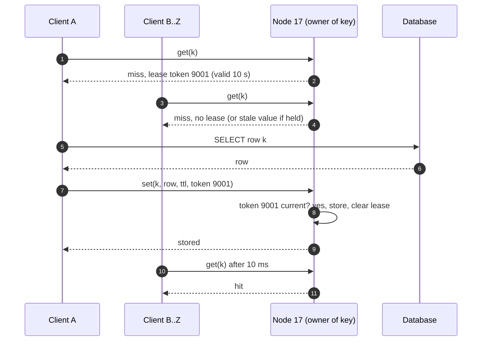

### 5.4 "A node loss costs <= 1% of DB capacity, 10% of nodes lost does not kill the DB": protecting the DB

**What breaks.** §2 did the math: one node down is `+50k` reads/s for 100 s, fine; 20 nodes down (a rack, a bad deploy, a network partition) is `+1 M` reads/s, three times the DB budget. The DB falls over, which makes every request slow, which makes the app servers pile up connections, which takes the site down. The cache was supposed to protect the DB and instead became the way to kill it. This is the failure an interviewer at Google or Databricks wants named.

**Fix, in three layers, cheapest first.**

1. **Gutter pool (what Facebook does).** A small pool, 1% of the fleet (2 nodes here), that takes the keys of dead nodes. When a client's request to node 17 times out, it retries on the gutter pool with the same key; a miss there is filled from the DB with a **short TTL** (10 s). The gutter absorbs the repeated reads for a dead node's hottest keys, so the DB sees each hot key once per 10 s instead of 50k times per second. Facebook's numbers: the gutter converts 10% to 25% of failed requests into hits on a normal day, and when a whole server fails the gutter's hit rate passes 35% within 4 minutes and often reaches 50%. It costs 2 nodes and no replication.
2. **Load shedding at the client.** The client tracks the DB fill rate it is generating and caps it (`max_fills_per_sec` per app server, say 100 per server, 500k fleet-wide). Above the cap, a miss returns `miss, do not fill` and the app degrades (serves a default, a stale L1 value, or a 503 for the least important calls). The DB is never asked for more than its budget, whatever the cache does. Related: [`../../concepts/rate-limiting-and-load-shedding.md`](../../concepts/rate-limiting-and-load-shedding.md).
3. **Replication, decided by arithmetic.** With one async replica per shard (RF = 2, 400 nodes, 2x the memory bill), a dead node's keys are served by its replica at full hit rate; the DB sees nothing. Whether to pay for it depends on one line: `cost of 2x memory` vs `cost of the DB being able to absorb the largest correlated cache loss you will ever have`. For a 10 TB cache on 128 GB nodes, 200 extra nodes is about $1 M/year; sizing a DB fleet to absorb 3x its load on a bad day costs more, so we replicate. For a 100 GB cache, we would not. The interviewer wants the arithmetic, not the answer.

**How replication works when we do it.** The owner node forwards every `set` and `delete` to the replica asynchronously (a per-shard queue, batched every 1 ms, no ack waited on). Reads go to the owner; the replica serves reads only when the owner is `suspect` or `dead`. The window of loss is one batch: a `set` acknowledged 1 ms before the owner died may be missing on the replica, which is a miss, not corruption. A `delete` lost the same way is worse (stale value on the replica), so deletes are sent to **both** nodes by the client directly, and the CDC backstop (§5.5) covers the rest. We never do quorum reads or writes: a quorum buys you "no lost acknowledged write", and a cache has no acknowledged writes worth that latency. [`../../concepts/replication-and-quorums.md`](../../concepts/replication-and-quorums.md) has the general rule.

**Cold start.** A node that boots empty is a 100 s miss storm for its 0.5% of keys, whether it is new, restarted, or a replica catching up. Two mitigations: (a) **replica warm-up**: a new replica streams the owner's items (100 GB at 10 Gbps is 80 s) before it is eligible to serve; (b) **staged ring weight**: a new owner enters the ring with 10% of its points and grows to 100% over 5 minutes, so its miss rate is spread. Neither is needed for a replaced node when RF = 2, because the replica keeps serving. Facebook's version for a whole cold cluster is to read from a warm cluster's cache on miss, with a 2 s hold-off on deletes to avoid races.

**Push back on the textbook answer.** "The DB must survive the cache being gone" is the right principle and, at 10 M QPS with a 95% hit rate, is arithmetically false: no DB at 20x its normal load survives. The honest Staff answer is: the DB survives any *single* failure without replication, survives *correlated* failure only with replication or shedding, and we pick which by cost.

**What changed:** `gutter` pool (2 nodes, TTL 10 s) in the client's fallback path; `max_fills_per_sec` in the client; RF = 2 per pool with owner-to-replica async forwarding; `delete` fans out to both; new node states `warming` and `weight`. Diagram: replica per node, gutter box, shed counter in client. [`deep-dives/replication-and-node-failure.md`](deep-dives/replication-and-node-failure.md).

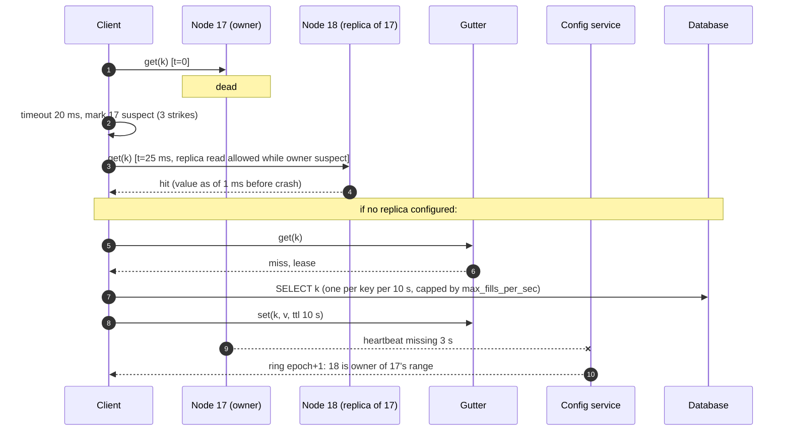

### 5.5 "At most 1 s stale after a write, read-your-writes in region": invalidation and consistency

**What breaks.** Three holes in the §4 design, each with a number.

1. **The stale-set race.** Client A misses `k`, reads the DB (v1). Client B writes v2 to the DB and deletes `k` from the cache. Client A, slow, now `set(k, v1)`. The cache holds v1 until TTL: **1 h stale** from a race that takes 2 ms to trigger and happens thousands of times a day at 1 M writes/s.
2. **Lost delete.** The app writes the DB, then the `delete` times out (node suspect, network blip, app crashed between the two calls). Stale until TTL. With 1 M writes/s and a 0.01% failure rate, that is 100 stale keys per second.
3. **Two owners during a ring change.** Between epoch `e` and `e + 1` (up to 5 s) client A still routes `k` to node 17 and client B to node 18. B's delete hits 18; A's next read hits 17 and gets the old value. Stale for up to 5 s, then the ring converges and 17's copy is orphaned.

**Fix.**
- **Leases kill the stale set.** From §5.3: the `set` that fills a miss carries the lease token; a `delete` in between invalidates the token; the node rejects the late `set`. Hole 1 closes completely, at the cost of one extra miss for the racing reader.
- **CDC backstop kills the lost delete.** A consumer tails the DB's change log (binlog, WAL, or a change stream: [`../../concepts/stream-processing.md`](../../concepts/stream-processing.md) §CDC) and issues `delete(k)` for every row change, keyed by the same key derivation the app uses. It lands about 500 ms after commit. Facebook runs this as mcsqueal; Uber's CacheFront does the same from Docstore's CDC. The app-side delete is still sent because it is 200 us instead of 500 ms; the CDC delete is the guarantee. Together: **staleness after a write <= 1 s** unless the CDC pipeline is down, in which case an alert fires and the bound degrades to TTL.
- **Versioned set for the ones that need it.** For keys where even 1 s hurts (a balance, a permission), the row carries a version; the app does `set(k, v2, cas = version)` after the write and the node stores only if the version is higher than what it holds. Ordering is then by DB version, not by arrival, and the race in hole 1 cannot reorder. Costs a version column and a `set` on the write path.
- **Ring-change window.** Accept it. 5 s of possible staleness once a day per 0.5% of keys. To close it we would need every client to refresh the ring synchronously before the change takes effect (a two-phase membership change), which is a lot of mechanism for a cache. Say the number and move on.
- **Read-your-writes in region.** The writer's client puts the new value in its own L1 for 1 s after a write (or bypasses cache for that key for 1 s). That covers "I edited my profile and see it". Cross-region is §10.11: the write goes to the primary region's DB; a **remote marker** is set in the local region's cache saying "k is being updated remotely, read from the primary DB for the next few seconds"; without it the local replica DB lag (100s of ms) would show the old row.

**Push back on the textbook answer.** "Write-through: the app sets the new value on every write, so the cache is never stale." It is stale the moment two writers race (v1's `set` can land after v2's), it caches values nobody reads (1 M writes/s of them), and it puts the cache on the write path so a slow cache slows every write. Delete-on-write plus CDC is less elegant and more correct.

**Consistency model, stated:** the cache is **eventually consistent with the DB, staleness bounded by 1 s in region** (app delete + CDC), **`TTL` in the worst case**, and **read-your-writes for the writer in region for 1 s** via L1. Nothing in the cache is ever the source of truth. The two accepted holes: the ring-change window (5 s, once a day, 0.5% of keys) and the async replica losing a `set` in its last 1 ms (a miss, not a stale read).

**What changed:** `set` with `lease_token` is rejected if a `delete` intervened; a CDC consumer issues deletes; `set` with `cas = row version` for versioned keys; writer L1 for 1 s; remote markers for multi-region. Diagram: `CDC consumer` box between DB and cache nodes. [`deep-dives/invalidation-and-consistency.md`](deep-dives/invalidation-and-consistency.md).

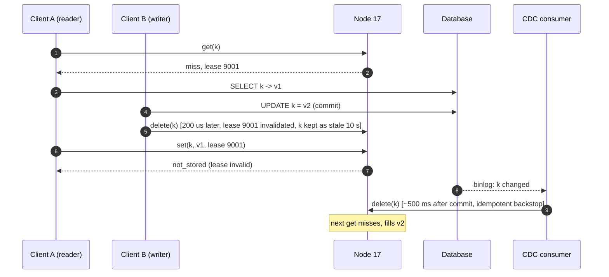

### 5.6 "Add 10% capacity with no visible hit-rate dip, restart with no page": operations

**What breaks.** §4.3 adds a node cold: `+50k` DB reads/s for 100 s per node. Adding 20 nodes at once is the same as losing 20, which §5.4 said kills the DB. A rolling restart of 200 nodes at one per minute is 200 cold starts in 200 minutes, a 3-hour tail of elevated DB load and a visible hit-rate dip for the whole window.

**Fix.**
- **Restart is not a cold start with RF = 2.** Mark the node `draining` (epoch + 1 does nothing to the ring: the replica becomes the read target for its range), restart it, let it stream its range back from the replica (80 s), mark it `up`. Hit rate never moves. Without replication, restart with a **snapshot**: a node writes its items to local disk on `SIGTERM` (100 GB at 2 GB/s is 50 s) and reloads on start, dropping anything past its `expires_at`. The snapshot is not durability, it is warm-up.
- **Staged weight on add.** A new node enters the ring at 10% of its 150 points and gains 15 points a minute. Its miss storm is spread over 10 minutes and peaks at 5k reads/s instead of 50k. Ten new nodes added together peak at 50k, one node's worth.
- **Warm from the old owner.** Better than the DB: when a node misses on a key whose ring position it acquired in the last 10 minutes, the client can fetch it from the previous owner (still warm, its items are orphaned but present) and `set` it locally. The old owner is in the previous epoch's ring, which the client keeps for 10 minutes. A cache-to-cache fill is 200 us; a DB fill is 2 ms and DB capacity.
- **Deploy order.** Config service last (it is on no hot path, but a bad build there is fleet-wide), nodes by ring position not by rack (so two adjacent ring ranges are never draining together), clients with a 1% canary that watches its own hit rate and p99.

**What changed:** node states `draining, warming`; per-node ring `weight` in the config service; clients keep the previous ring for 10 minutes; snapshot on SIGTERM. [`deep-dives/key-placement-and-membership.md`](deep-dives/key-placement-and-membership.md).

---

## 6. Final design and the five core flows

Everything from §5 composed. Under 15 nodes; zoom-ins in [`diagrams.md`](diagrams.md).

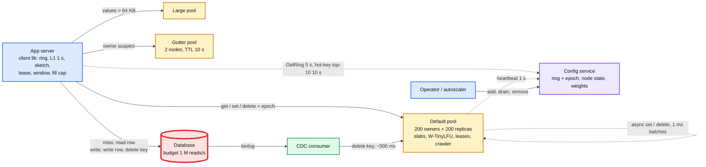

The five flows below are the ones to be able to say from memory. Each is the final design, not the §4 version.

### Flow 1: `get` hit (per request, about 250 us)

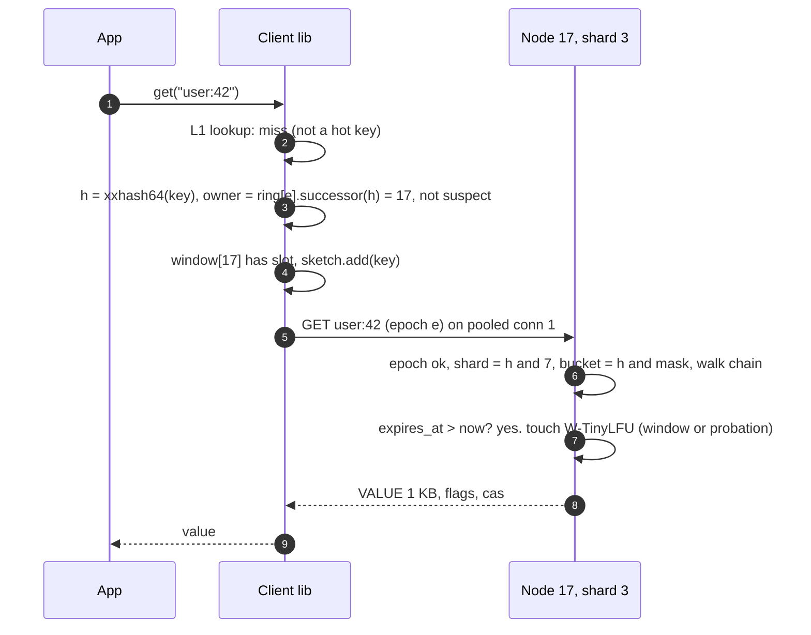

### Flow 2: `get` miss with lease and fill (about 2.5 ms, one DB read per key per 10 s)

Shown in §5.3. Summary: `miss + lease` to the first client, `miss, no lease` (or `stale`) to the rest within 10 s; the first client reads the DB and `set`s with the token; the node stores only if no `delete` invalidated the token in between; late clients retry after 10 ms and hit.

### Flow 3: write (DB then delete, two invalidations, bounded 1 s)

Shown in §5.5. Summary: app writes the row, then `delete(key)` to the owner and the replica directly (200 us); the CDC consumer sees the binlog and `delete`s again about 500 ms later (idempotent backstop); the deleted item stays as `stale` for 10 s to serve non-lease-holders during the refill; the writer's L1 holds the new value for 1 s for read-your-writes.

### Flow 4: node dies (client 20 ms, config 3 s, ring 5 s, DB never)

Shown in §5.4. Summary: timeouts are misses; 3 strikes marks the node suspect for 10 s and reads go to the replica (or the gutter with 10 s TTL when there is no replica); heartbeats stop, the config service publishes `epoch + 1` after 3 s, clients converge within 5 s; the replica is promoted to owner and a new replica is streamed from it over 80 s. The DB sees at most `max_fills_per_sec` from the gutter path.

### Flow 5: add a node (ring change, no miss storm)

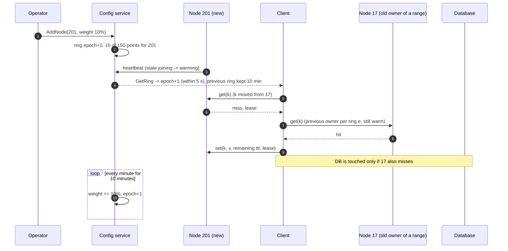

---

## 7. Trade-offs

| Decision | Option A | Option B | Chose | Why |
|---|---|---|---|---|
| Who routes | Smart client library in every app | Proxy tier (mcrouter, Envoy) | Client, proxy-compatible protocol | One less hop (100 to 200 us of a 1 ms budget) and one less tier at 5,000 app servers. Switch to a proxy at 50k app servers or 6 client languages |
| Who owns the ring | Gossip between nodes (Redis Cluster) | Config service with epoch (etcd / ZK) | Config service | Ring changes once a day; ownership must be one answer, not a converging one. Gossip stays for nothing here |
| Placement | mod N | Consistent hashing, 150 vnodes | Ring | mod N moves 99.5% of keys on a change; ring moves 0.5%. Vnodes bring imbalance from ±50% to ±10% |
| Replication | None (Facebook style, gutter only) | RF = 2 async | RF = 2 | The arithmetic: 20 node losses without replicas is 3x the DB budget; 200 extra nodes cost less than a DB that can absorb that. For a 100 GB cache we would choose none |
| Replica semantics | Quorum reads and writes | Async, replica serves reads only when owner is suspect | Async | A cache has nothing worth a quorum's latency. Loss window is 1 ms of sets, which are misses |
| Eviction | Exact LRU list | W-TinyLFU or S3-FIFO with slab classes | Sketch-based | 5 to 15 points of hit rate on one-hit-wonder traces at 8 bits per entry of sketch. LRU is the coding-round answer |
| Write path | Write-through (`set` new value) | Delete-on-write + CDC backstop | Delete + CDC | Write-through is stale under racing writers and caches 1 M writes/s nobody reads. Delete is always safe; CDC makes it guaranteed |
| Stampede | Distributed lock on miss | Lease in the miss reply, 10 s, stale-while-revalidate | Lease | Same guarantee, no release, no extra RTT, and it also fixes the stale-set race |
| Hot keys | Server-side replication only | Client L1 (1 s) first, key suffix replication second | Both, L1 first | L1 costs nothing and cuts 1 M QPS to 5k; replication is for keys that cannot be 1 s stale |
| Node add/restart | Cold, refill from DB | Staged weight + warm from old owner + replica stream | Staged | Turns 20 node-losses' worth of DB load into one node's worth spread over 10 minutes |
| Consistency claim | "Strongly consistent cache" | Bounded staleness (1 s in region, TTL worst case) with two named holes | Bounded | The first is a lie a Staff interviewer will catch. The second is what Facebook and Uber ship |
| What we refused to build | Persistence, data structures, multi-key transactions, quorum replication, two-phase ring changes | | | Each is a real product (Redis, DynamoDB) and none is needed for "a cache in front of a DB" |

Consistency model, stated once: **eventual, staleness bounded by 1 s in region and `TTL` in the worst case; read-your-writes for the writer for 1 s via L1**. The ring is **strong** (config service). Replication is **async**. The two accepted holes are the 5 s ring-change window and the replica's last 1 ms of sets.

---

## 8. Staff-level notes

- **Simplest thing that meets the requirement.** A cache node is a hash table with a slab allocator and an eviction list. All the distributed-systems work lives in the client (routing, L1, leases, shedding) and in one small config service. No consensus on the data path, no quorum, no replication log. We refused persistence, data structures, transactions, and two-phase membership. Replication is the one thing we added beyond Facebook's design, and we added it because of a division, not a principle.
- **Failure modes and blast radius.** Node down: 0.5% of keys, served by the replica, DB unaffected. Rack down (20 nodes): 10% of keys, replicas on other racks serve them (replica placement is rack-aware). Config service down: no ring changes, no hot-key list updates, zero data-path impact for as long as the clients' cached ring is valid (forever, by design). CDC down: staleness bound degrades from 1 s to TTL; alert. Gutter down: the no-replica fallback is gone, fill cap is the last line. DB down: cache serves hits (95%) and every miss is an error; the cache is why the site is 95% up instead of 0%. Largest blast radius: a client library bug that mis-hashes keys, which is a fleet-wide cold cache; that is why the client canary watches its own hit rate.
- **Migration.** From "one big Redis" or "memcached with mod N in app config": phase 1, deploy the config service and publish the current static list as epoch 1 with the same hash, no behaviour change; phase 2, switch the client to ring hashing with dual-read (ring owner first, old mod-N owner second) for one TTL, then drop dual-read; phase 3, enable leases and CDC (both are additive); phase 4, add replicas pool by pool. Rollback at each phase is a client config flag; the old cluster stays warm through phase 2 because nothing deletes from it.
- **Operability.** SLO: 99.9% of `get`s under 1 ms and hit rate >= 95% (5-minute windows). Pages at 3am: hit rate below 90% for 5 minutes (DB at risk), DB fill rate above 80% of `max_fills` fleet-wide, any node above 90% memory or swapping, CDC lag above 5 s (staleness bound broken), more than 2% of nodes suspect (correlated failure). Dashboards: hit rate by pool, p50/p99 by pool, fills/s vs cap, evictions/s by slab class, lease waits/s, hot-key top-10, ring epoch age per client.
- **Cost.** 400 nodes × 128 GB is the bill; at about $2,500/node/year that is $1 M/year, half of it replication. The DB it protects would need 20x its capacity to live without the cache. Engineering: one team owns nodes and config service; the client library is owned by the same team but versioned with the app platform; CDC is shared with whoever owns the DB's change stream. The wire protocol is the contract.
- **Explicit trade-off.** RF = 2 doubles the memory bill to make correlated cache loss a non-event for the DB. Below about 1 TB, or with a DB that has 3x headroom, we would not pay it. Say the exchange rate.

---

## 9. What is expected at each level

**Mid (80/20 breadth/depth).** Draws app, a cache cluster, a DB. Says cache-aside, TTL, LRU, "consistent hashing so adding a node doesn't move everything". Puts Redis in the box. May not say what happens when a node dies beyond "requests go to the DB". Passes if the diagram is clean, the API is stated, and there are some numbers.

**Senior (60/40).** Separates the client library from the nodes, explains vnodes and the 1/N number, picks a config service or gossip for membership and says why, explains delete-on-write and the stale-set race, handles hot keys with a local cache or key replication, and names the thundering herd with a lock or lease. Goes deep on one of: eviction internals, replication trade-off, failure detection.

**Staff+ (40/60).** Everything above, plus: node count comes from memory not QPS (and what that implies for hot keys), the DB-load arithmetic that decides replication, leases as the single mechanism for both stampedes and stale sets, CDC as the invalidation guarantee with a stated staleness bound and two named holes, gutter and fill caps as DB protection, staged ring weight and warm-from-old-owner for zero-dip scale-out, slab classes and sketch-based eviction with the hit-rate delta, the client-vs-proxy break-even, and the migration in four phases with a flag per phase. Says out loud what is not built and what a "strongly consistent cache" would cost.

---

## 10. Nitty-gritty (past interview scope)

### 10.1 Internals of each chosen technology

**Node hash table.** Open hashing with chained buckets, `2^k` buckets, load factor kept at 1.5 by incremental rehash: when items exceed `1.5 × buckets`, allocate a table twice the size and move one bucket per operation (Redis's `dictRehash` style), so no single request pays for a 5 M-item rehash. Chains hold 4 B slab indexes, not pointers, halving header size and making the table relocatable in a snapshot. Per-shard, so no locking: a connection is pinned to a shard by `hash(key) & 7` on the client side (the client opens one connection per shard, so the node never has to hand a request across threads). Memcached instead uses a striped-lock global table; Facebook's paper shows fine-grained locking tripled its hit throughput from 600k to 1.8 M items/s per server, which is where our per-shard design starts.

**Slab allocator.** 1 MB pages assigned to size classes growing by 1.25 (96, 120, 152, ... , 512 KB; larger values are chained across 512 KB chunks, which is exactly memcached's `slab_chunk_size_max = page / 2`). Each class has a free list; `set` pops, eviction pushes. A page belongs to one class until the rebalancer moves it (only when empty). Waste per item is `chunk - item` (average 8 to 10%). No `malloc` after startup on the data path.

**W-TinyLFU.** Window: 1% of capacity, LRU. Main: 99%, SLRU with 20% probation / 80% protected. Admission: on window eviction, compare `sketch[candidate]` vs `sketch[main victim]`; admit if higher. Sketch: count-min, 4 rows, 4-bit counters, `10 × capacity` samples, then halve everything (the "reset" that gives it a decay). A doorkeeper Bloom filter in front of the sketch stops one-hit wonders from occupying counters at all. Memory: about 8 bits per entry, 5 MB for 5 M items. [`deep-dives/eviction-and-memory-layout.md`](deep-dives/eviction-and-memory-layout.md).

**Consistent hash ring.** 200 nodes × 150 points = 30,000 `(u64 hash, node)` pairs sorted by hash, 480 KB. Lookup is a binary search (15 steps) for the first point >= `hash(key)`, wrapping at the end. Replica = next distinct node clockwise (skipping the owner's own points and anything in the owner's rack). The ring is immutable per epoch; a new epoch is a new array, swapped atomically in the client. [`deep-dives/key-placement-and-membership.md`](deep-dives/key-placement-and-membership.md).

**Config service.** 3 to 5 nodes of Raft ([`../../concepts/raft.md`](../../concepts/raft.md)), holding `nodes[]`, `ring epoch`, `weights`, `hot_keys[]`. Reads are served by any member from its local state with the epoch; writes go through the leader. Clients poll with `known_epoch` and get `unchanged` 99.99% of the time. It is never on the data path, so its availability target is 99.9%, not 99.99%.

**Lease.** On a miss the node writes a 24 B lease record into the bucket (a tombstone item with `token, issued_at, client`), returns the token, and refuses a second token for 10 s. `set` with token: stored if the tombstone's token matches, else `not_stored`. `delete`: replaces any item or tombstone with a `stale` copy of the old value (if one exists) for 10 s and bumps the token. `get` on a `stale` item without a lease returns the stale value with a `stale` flag (the client decides whether to use it).

**Client library.** Ring (epoch, previous epoch for 10 min), per-node state (`suspect_until`, window size, 2 connections per shard), L1 (`LinkedHashMap`, 10k entries, 1 s TTL, only for keys the sketch flags), count-min sketch + top-100 heap over a 10 s window, fill-rate limiter (token bucket, 100/s), pool selector by size. Requests are pipelined; responses matched by sequence number.

### 10.2 Configuration knobs that matter

| Component | Knob | Value | Why |
|---|---|---|---|
| Node | `item_size_max` | 1 MB (default pool 64 KB, large pool 1 MB) | Bounds head-of-line blocking per pool |
| Node | slab growth factor | 1.25 | Memcached default; waste under 25% worst case, ~8% typical |
| Node | memory limit | 80% of RAM | Kernel, connection buffers, and snapshot buffer need the rest; swap is death |
| Node | crawler rate | 1% of items per second | Full pass every 100 s; reclaims expired-but-unread memory |
| Node | lease TTL | 10 s | Facebook's number. Long enough for any DB read, short enough that a dead lease holder costs one refill delay |
| Node | stale-keep after delete | 10 s | Equal to lease TTL so non-holders always have something to serve |
| Node | replica batch | 1 ms or 64 KB | Loss window on owner death is one batch |
| Client | `get` timeout | 20 ms | 20x p99. Lower produces false suspects on GC pauses; higher hides a dead node for too long |
| Client | suspect after / for | 3 consecutive timeouts / 10 s | One timeout is noise; three in a row is a node |
| Client | window size | adaptive, 16 to 256 | Sliding window per connection, TCP-style |
| Client | L1 TTL | 1 s | The staleness we accept for hot keys |
| Client | `max_fills_per_sec` | 100 per app server (500k fleet) | Half the DB budget, leaving room for organic misses |
| Client | TTL jitter | ±10% | Breaks synchronised expiry |
| Config | heartbeat / dead after | 1 s / 3 missed | 3 s detection; clients have already stopped sending by then |
| Config | ring poll | 5 s (or watch) | Convergence window for the two-owners hole |
| Config | new node weight ramp | 10% per minute | Spreads the miss storm over 10 minutes |
| CDC | consumer lag alert | 5 s | The staleness bound is 1 s; 5 s is "the bound is broken" |

### 10.3 Capacity math per component

| Component | Per unit | Fleet | Limit and headroom |
|---|---|---|---|
| Node memory | With 200 nodes and RF = 2: 5 M owned items (55 GB) + 5 GB overhead + 55 GB of replica data = 115 GB of 128 GB | 200 nodes | Too tight: no room for a node loss. Pick 400 × 128 GB: each node owns 2.5 M items and replicates 2.5 M, 60 GB used, 50% headroom |
| Node ops | 25k reads/s + 2.5k writes/s + 2.5k replica writes/s | 10 M + 1 M + 1 M | Ceiling about 1 M ops/s per node: 3% used. Hot keys are the only way to hit it |
| Node NIC | 200 Mbps average, 8 Gbps for a 1 M QPS hot key | 80 Gbps | 25 Gbps NIC; a hot key is the only risk |
| Connections per node | 5,000 app servers × 2 per shard × 8 shards = 80k | 32 M | Too many. Fix: one connection per node per app server, shard picked server-side by a 1-word dispatch; 5,000 per node, 2 M fleet. Or the proxy |
| Client L1 | 10k entries × 1 KB = 10 MB | 5,000 × 10 MB | Trivial |
| Client sketch | 4 × 65,536 × 4 bits = 128 KB + heap | | Trivial |
| Ring | 30,000 points × 16 B = 480 KB, two epochs | | Trivial |
| Config service | 400 heartbeats/s + 1,000 ring polls/s (5,000 clients / 5 s) + 500 hot-key reports/s | | A Raft group does 10k writes/s; reads are local. 10% used |
| DB fills | 500k/s organic at 95% hit, capped at 500k/s more | 1 M/s budget | The cap is the DB's guarantee |
| CDC | 1 M row changes/s in, 1 M deletes/s out, batched 100 per RPC | 2,500 deletes/s per node across 400 nodes | One consumer per DB shard; 25 RPC/s per node. Fine |

The component closest to its limit is **node memory under RF = 2**, which is why the fleet is 400 nodes not 200, and the second is **connection count**, which is the first argument for a proxy.

### 10.4 Failure timeline

Node death is in §5.4 (Flow 4). The other two that matter:

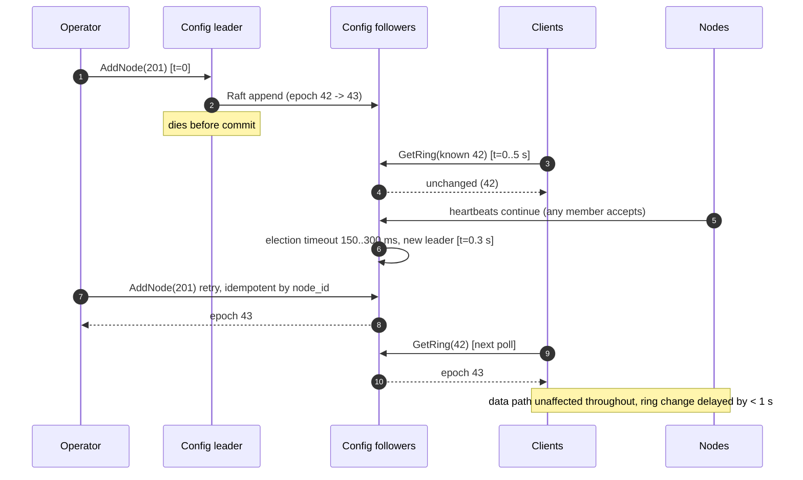

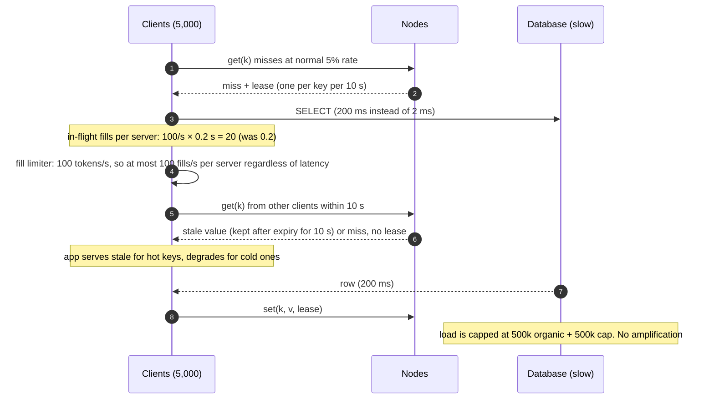

### 10.5 Exactly-once and idempotency end to end

There is no exactly-once problem in a cache, and saying so is the right answer. `set` is idempotent (same value, same result). `delete` is idempotent. `add` and `cas` are conditional and therefore safe to retry (a retry after a lost reply returns `exists` or `not_stored`, and the client treats both as success). The two non-idempotent calls are `incr` / `decr`, which we expose only for counters and document as "at least once under retry"; an app that needs exact counters batches locally and reconciles from the DB. Duplicates can enter at: client retry after timeout (harmless for all but `incr`), CDC replay after consumer restart (deletes, harmless), replica stream replay (sets with the same `cas`, harmless). The dedup key where it matters is `lease_token` on `set`: a duplicate `set` with a consumed token is rejected, which is the property we need.

### 10.6 Consistency model per edge

| Edge (final diagram) | Model | Where it changes |
|---|---|---|
| App to owner node `get` | Read-your-writes only within the writer's L1 window (1 s); otherwise eventual, bounded 1 s after write | Becomes `TTL`-bounded if CDC is down |
| App to DB (miss) | Strong (DB's own model) | |
| App to owner `delete` | Fire-and-forget, at-least-once with CDC | |
| DB to CDC to node | Eventual, ~500 ms, at-least-once | |
| Owner to replica | Async, eventual, 1 ms batches; lost on owner death | Replica reads are only taken while owner is suspect |
| Client to config service | Strong (linearizable reads from leader, or bounded-stale from follower with epoch) | Clients apply epochs monotonically |
| Config service to nodes (state) | Eventual via heartbeat replies, 1 s | |
| Client L1 | Stale up to 1 s | Only hot keys, only reads |
| Gutter | TTL 10 s, no invalidation | Only while an owner is suspect |

### 10.7 Alternatives rejected

| Alternative | Why it looked attractive | Why rejected |
|---|---|---|
| Redis Cluster as-is | Off the shelf, gossip membership, server-side `MOVED` redirects, replicas, failover | Data structures and persistence we do not need; gossip failure detection at 15 s default `cluster-node-timeout`; 16,384 fixed slots is a fine ring but the single-threaded node caps at about 200k ops/s per shard, so a hot key melts a shard 5x sooner. Good answer for a 100 GB cache |
| Memcached + mcrouter, no replication | Facebook's design, proven at billions of QPS | Their DB can absorb a gutter's worth of misses at their replication and sharding scale; ours cannot absorb 20 node losses. Same design plus RF = 2 is what we chose |
| Quorum replication (R + W > N) | No lost acknowledged writes | Nothing in a cache is worth a quorum's latency; a lost `set` is a miss. Adds 2 RTT to every write |
| Write-through | "Cache is never stale" | Stale under racing writers, caches unread data, cache on the write path |
| Write-behind | Absorbs write bursts | Turns the cache into the source of truth for a window; a node death loses writes. Out of scope by FR |
| Gossip for the ring | No config service to run | Ownership must be one answer; gossip converges. Config service is 3 small nodes |
| Jump consistent hash | No ring memory, O(log N) | Only supports adding and removing at the end of the node list; a mid-list node death remaps more than 1/N |
| Two-phase ring change | Closes the 5 s two-owner hole | Every client must ack before the epoch flips; a slow client blocks the fleet. Not worth it for 0.5% of keys, 5 s, once a day |
| Exact LRU list | Simple, O(1), the coding-round answer | Loses 5 to 15 points of hit rate to sketch-based policies on our traces; 16 B of pointers per item |
| Distributed lock on miss | Familiar | A lease is the same guarantee with no release and no extra RTT |
| UDP for gets | Fewer connections, fewer syscalls (Facebook) | 0.25% drops become misses; modern kernels closed most of the gap; ops cost of a second transport |
| Flash tier (memcached extstore) | 10x cheaper per GB | Adds 100 us to a miss-to-flash; worth it at 100 TB, not 10 TB. §10.11 |

### 10.8 How the big companies do it

- **Facebook (NSDI 2013).** Memcached with client-side routing via mcrouter, no server-side replication inside a cluster, leases (one token per key per 10 s) for stale sets and thundering herds, a gutter pool of ~1% of servers for failed nodes (converts 10 to 25% of failures into hits daily, over 35% within 4 minutes of a full server failure), UDP for gets (0.25% dropped at peak, treated as misses that skip the set), mcsqueal for invalidation from the MySQL commit log, regional pools and cold-cluster warmup with a 2 s delete hold-off, and remote markers for cross-region read-your-writes. Our design is this plus RF = 2 and a config service instead of static pools.
- **Redis Cluster.** 16,384 slots by CRC16, gossip membership on port + 10,000, `MOVED` / `ASK` redirects so any node can route, async replication with optional `WAIT`, failover by majority of masters after `cluster-node-timeout` (15 s default), sampled LRU/LFU with 5 samples. Server-side routing instead of a smart client; gossip instead of a config service. Fine up to about 1,000 nodes.
- **Netflix EVCache.** Memcached nodes, replication done by the **client** writing to every AZ's copy and reading from the local AZ, so an AZ loss is served from another AZ with no server-side replication protocol. Same effect as our RF = 2, with the replication logic in the client instead of the node.
- **Twitter (OSDI 2020, Segcache NSDI 2021).** A study of hundreds of production cache clusters: many are write-heavy, TTLs are short and matter more than eviction policy, and FIFO is as good as LRU on most of them. Segcache groups items by TTL into segments so expiry is a segment free, not a per-item walk. The lesson we take: get TTL expiry right before arguing about LRU vs LFU.
- **Amazon DAX.** Write-through cache in front of DynamoDB with a 5-minute default TTL and eventual consistency, item cache plus query cache. The example of write-through being fine when the cache owns the write path and a single writer per item is the norm.
- **Uber CacheFront (2024).** Redis in front of Docstore with invalidation driven from the DB's CDC stream (the same shape as mcsqueal), plus explicit staleness bounds. The modern confirmation that delete-on-write plus CDC is the invalidation answer.

### 10.9 Operational runbook

- **Dashboards (five).** Hit rate by pool (5-minute), `get` p50/p99 by pool, DB fills/s vs cap, evictions/s by slab class (calcification shows here), suspect-node count and ring epoch age per client (a client stuck on an old epoch is a bug).
- **Alerts.** Hit rate < 90% for 5 min: page (DB at risk). Fills > 80% of cap for 2 min: page. Any node memory > 90% or swap > 0: page. CDC lag > 5 s: page (staleness bound broken). Suspect nodes > 2%: page (correlated failure). Lease waits > 1% of gets: ticket (a hot-key stampede is being absorbed, check the top-10). Slab class with evictions 10x another: ticket (rebalancer stuck).
- **Rollout.** Config service first only when its schema changes, else last. Nodes: drain (replica serves), restart, warm from replica, undrain, one node per rack per 3 minutes, ring-neighbours never in the same batch. Clients: 1% canary for 30 min watching its own hit rate and p99 against the fleet, then 10%, then all. A client build that mis-routes shows up as the canary's hit rate falling, not the fleet's, which is the point.
- **Rollback.** Client: flag flip to the previous ring hash or previous build; the old owners are still warm for one TTL. Node: redeploy previous build, replica has served throughout. Config service: Raft snapshot restore; clients keep their cached ring. CDC: replay from the last committed offset; extra deletes are harmless. Nothing needs a backfill, because nothing in the cache is the truth.

### 10.10 Security and abuse

- The cache is inside the trust boundary: mTLS between app and node, no public listener, no auth per key. A compromised app server can read any key, which is true of the DB too; the answer is app-level authorisation, not cache ACLs.
- Tenant isolation is by key namespace (`tenant:...` prefix enforced by the client) and by pool for tenants that need separate capacity. A noisy tenant's hot key is bounded by the same L1 and replication as anyone's; its fill rate is bounded by the per-server cap.
- Abuse vectors and bounds: a 10 MB value is rejected at the client (1 MB max, 64 KB in the default pool); a key longer than 250 B is rejected; a client that opens 10,000 connections is limited by the node's `max_connections` per source IP; a flood of `delete`s is idempotent and cheap; a flood of misses for random keys is bounded by the fill cap and by negative caching (`add(key, NULL, 10 s)` on DB not-found).
- Data at rest: RAM only, no snapshot unless the operator enables it, snapshot encrypted at rest with the node's key. GDPR delete: `delete(key)` fleet-wide plus TTL max 30 d bounds any orphan (previous owners after a ring change) to 30 days.

### 10.11 Evolution

- **10x (100 TB, 100 M QPS).** Memory is still the bill: 4,000 nodes at RF = 2. Two seams: (a) a flash tier per node (memcached extstore style: header in RAM, value on NVMe, 100 us extra on a hit), which cuts nodes 5x for the cold 80% of items; (b) the proxy tier, because 50,000 app servers × 4,000 nodes is not a connection count a smart client can hold. The ring, the leases, and the invalidation path do not change.
- **Multi-region.** Each region gets its own cache fleet and reads its local DB replica. Writes go to the primary region's DB. Invalidation: the primary's CDC stream fans out deletes to every region's cache (500 ms + cross-region RTT, about 600 ms). The hole: the local DB replica lags the primary by 100s of ms, so a reader in the secondary region who misses right after the delete fills the **old** row from the lagging replica. Facebook's fix is the **remote marker**: the writer sets `marker:k` in the local region's cache before writing to the primary; a reader who finds the marker reads from the primary DB instead of the local replica; the marker is cleared by the CDC delete. Staleness bound becomes 1 s + replica lag. Active-active writes are out; if forced, the cache stays eventual and the DB layer does the conflict resolution ([`../../concepts/crdt.md`](../../concepts/crdt.md) is the wrong tool for a cache of DB rows).
- **New requirement: data structures (lists, counters, sets).** The seam is the node's value type: an item becomes `(type, encoded payload)` and the node grows per-type commands, which is how Redis is built. Everything about routing, leases, and invalidation stays. The cost is that a `LPUSH` is no longer idempotent, and the replica stream becomes an operation log rather than a value stream.
- **New requirement: strong consistency for some keys.** Do not build it in the cache. Route those keys to the DB with a per-key read-through that verifies the DB version (`cas` on the row version) or skip the cache for them. A "strongly consistent cache" is a database with a worse durability story.
- **GDPR delete at scale.** `delete` is already fleet-wide by key. The orphan problem (previous owners after ring changes, replicas, gutter, L1) is bounded by the max TTL (30 d) and the gutter/L1 TTLs (10 s / 1 s). If the bound must be hours, cap TTL at hours for the affected namespace.

---

## 11. Follow-up questions to expect

Ranked by how often they come up. Each links to the edge case or deep dive that answers it.

1. **A node dies. What happens in the next 10 seconds, and what does the DB see?** Flow 4 in §6; [`edge-cases.md`](edge-cases.md) "node dies". Timeouts are misses, suspect after 3, replica serves, config removes at 3 s, ring converges at 5 s, DB sees zero extra load with RF = 2 or up to one fill per key per 10 s via gutter without.
2. **One key gets 1 M QPS. Which box melts?** §5.3. The owning node (1 M ops/s ceiling, 8 Gbps of replies). Client sketch detects, L1 absorbs to 5k QPS, key replication for keys that need < 1 s staleness. [`deep-dives/hot-keys-and-stampedes.md`](deep-dives/hot-keys-and-stampedes.md).
3. **How does a client find the node for a key, and what happens when you add one?** §4.3, Flow 5. Ring with 150 vnodes from a config service with an epoch; add moves 1/N; staged weight and warm-from-old-owner make it invisible. [`deep-dives/key-placement-and-membership.md`](deep-dives/key-placement-and-membership.md).
4. **Cache and DB disagree. For how long, and how do you shrink it?** §5.5. 1 s in region (app delete 200 us, CDC 500 ms), TTL worst case, two named holes. [`deep-dives/invalidation-and-consistency.md`](deep-dives/invalidation-and-consistency.md).
5. **A hot key expires. 10,000 requests miss. What hits the DB?** §5.3. One, because of the lease; the rest wait 10 ms or take the stale copy; hot keys refresh early with XFetch.
6. **How does eviction actually work? Why not a real LRU?** §5.2. Slab classes, W-TinyLFU or S3-FIFO, 34 B header, sampled LRU as the Redis compromise. [`deep-dives/eviction-and-memory-layout.md`](deep-dives/eviction-and-memory-layout.md).
7. **Replicate or not?** §5.4. The division: correlated loss × miss cost vs 2x memory. RF = 2 async here; none for a small cache. [`deep-dives/replication-and-node-failure.md`](deep-dives/replication-and-node-failure.md).
8. **Smart client or proxy?** §5.1. Client at 5,000 app servers (one less hop), proxy at 50,000 or 6 languages; protocol stays proxy-compatible. [`deep-dives/client-and-network-path.md`](deep-dives/client-and-network-path.md).
9. **A 10 MB value shows up.** §5.1. Rejected above 1 MB; above 64 KB goes to the large pool so it cannot block small gets.
10. **Multi-region?** §10.11. Per-region fleets, primary-region writes, CDC fan-out of deletes, remote markers for the replica-lag hole.
11. **How do you make p99 under 1 ms?** §5.1. Pooled pipelined connections, sliding window against incast, large-value pool, no locks on the node, 20 ms timeout as a miss.
12. **What pages at 3am?** §8, §10.9. Hit rate < 90%, fills > 80% of cap, node memory > 90%, CDC lag > 5 s, suspect > 2%.
13. **How does TTL expiry work at 1 B keys?** §4.2. Absolute monotonic `expires_at`, lazy on read, crawler at 1%/s, TTL jitter ±10%.
14. **Implement LRU in O(1).** The coding companion: hash map plus doubly linked list; LFU (LeetCode 460) with frequency buckets. Then say why the server does not use it (§5.2).
