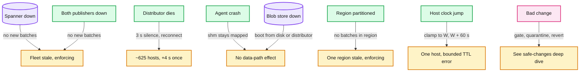
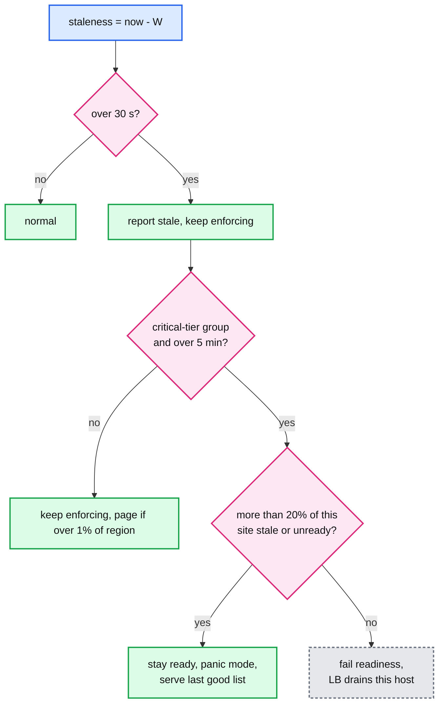
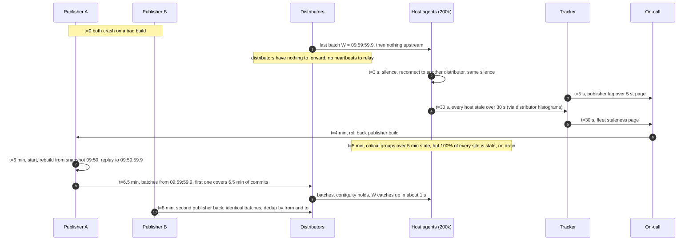

# Deep dive: failure modes and fail-static

> One-line answer: the data plane never waits on the control plane: a host keeps enforcing its last good list through any failure upstream of it (fail-static), boots from its own local-disk copy before it asks the network, and turns staleness into a health signal only for critical groups and only while fewer than 20% of its site is stale; every failure therefore shows up as **staleness** (measured as `now - W` and paged at 30 s), never as a wrong answer or a dropped request, and the one failure that can produce wrong answers, a bad change, is handled by [`safe-changes-and-blast-radius.md`](safe-changes-and-blast-radius.md).

Zoom-in on [`../solution.md`](../solution.md) §5.4 and §10.4. Reusable blocks: [`../../../concepts/leases-fencing-clocks.md`](../../../concepts/leases-fencing-clocks.md) (clocks, why wall time lies), [`../../../concepts/rate-limiting-and-load-shedding.md`](../../../concepts/rate-limiting-and-load-shedding.md) (admission control, jittered retry), [`../../../concepts/replication-and-quorums.md`](../../../concepts/replication-and-quorums.md) (what a multi-region store survives). Siblings: [`watermarks-and-consistency-window.md`](watermarks-and-consistency-window.md), [`propagation-and-fan-out.md`](propagation-and-fan-out.md).

---

## 1. The rule: only two things may change a host's list

A host's enforced list changes only when (a) it applies a contiguous, validated batch, or (b) it loads a verified snapshot or local copy. Nothing else: not a timeout, not a lost connection, not a failed health check, not a restart of the agent. So every upstream failure has the same symptom on the host, the watermark stops moving, and the same response, keep enforcing. That is what "fail-static" means precisely. It is a property of the apply path, not a feature bolted on.

---

## 2. Component by component

| Component | What fails | Detected by, and how fast | What hosts do | Blast radius | Recovery |
|---|---|---|---|---|---|
| Spanner | One region lost | Store latency, publisher read errors, seconds | Nothing; the multi-region config keeps quorum and publishers keep cutting batches after a stall of seconds | Writes and freshness pause for seconds | Automatic leader moves |
| Spanner | Whole database unavailable | Publisher lag alert at 5 s | Fail-static; staleness climbs on every host at once | No new changes anywhere; enforcement unchanged | Page. Publishers resume from their last `b` |
| Publisher | One of two dies | Distributors see one upstream stream end | Nothing: the other publisher's batches are identical | None | Restart; it rebuilds from the latest snapshot and replays |
| Publisher | Both die, or both wedge on a bug | Publisher lag at 5 s; fleet staleness at 30 s | Fail-static | As above | §4 below |
| Distributor | Process or machine dies | Hosts: 3 s with no batch or heartbeat | Reconnect to another distributor in the site with `from = W`, replay from its 60-minute buffer | ~625 hosts, about 4 s extra staleness, once | Automatic |
| Distributor | Slow, not dead (GC, NIC saturation) | Host staleness creeps; per-subscriber send queue fills | Distributor drops a subscriber past 30 s of queued batches; host reconnects elsewhere | Hosts on that distributor, seconds | Automatic; ticket on egress over 70% |
| Host agent | Crash or upgrade | Local supervisor; proxies do not notice | Shared memory stays mapped; lookups continue on the last state | None on the data path | Restart reads `W` from the shared header and resubscribes |
| Blob store | Unavailable | Snapshot download errors | Boots use local disk, then distributors' cached snapshots | Only hosts with no local copy and no distributor snapshot | Automatic |
| Propagation tracker | Down | Its own health check | Nothing | Operators lose `GetPropagation` and staleness dashboards | Restart; distributors resend histograms every second |
| Denylist API | Down or erroring | Write error rate | Nothing | No new changes; detectors queue and retry with `request_id` | Page if over 5 minutes |
| Feed importer | Feed returns truncated or empty data | Shrink over 20% in one fetch | Nothing; the importer refuses to remove | None | Page the feed owner |
| Clocks | A host clock jumps | Agent compares `now` with batch `to` (expected 0.6 to 1 s behind) | Past 5 s of disagreement: alert, clamp expiry `now` to `[W, W + 60 s]` | That host's TTL decisions, bounded by the clamp | Fix NTP |
| Network | A region partitioned from the rest | Region-wide staleness | Fail-static; PoP distributors homed there switch to their second region | That region's changes pause | Automatic on heal; replay or snapshot |

---

## 3. Fail-open, fail-closed, fail-static: per tier, not per system

| Group tier | Example groups | When the list cannot refresh | When a filter confirm is unreachable (§5.6 groups) | When the kill switch fires |
|---|---|---|---|---|
| `standard` | Abuse IPs, spam accounts, DDoS drop lists | Fail-static indefinitely, page at 30 s | Allow (the list is a heuristic) | Fail-open for that group |
| `critical` | Revoked API keys and tokens, compromised accounts | Fail-static, and past 5 min the host fails readiness unless the site panic threshold is crossed | Deny (a revoked credential must not work) | Fail-open for that group, two approvers |
| `legal` | Government-mandated blocks | Fail-static indefinitely | Not used for this tier | Fail-open requires legal sign-off |

Nobody gets fail-closed on staleness. Denying every request because the list is 5 minutes old turns a control-plane outage into a global outage. The Google Cloud 12 June 2025 report ends in the same place: after a crash loop took Service Control down everywhere (red button within 40 minutes, about 2 h 40 min in us-central1 because restarts lacked randomized backoff), the first remediation listed is to make the component fail open.

---

## 4. The readiness rule, worked three ways

**One host stale.** Its distributor stream is stuck behind a bad NIC. After 30 s it reports stale; at 5 min, for a critical group, fewer than 20% of the site is stale, so it fails readiness and the load balancer drains it. Capacity loss: one host of ~5,000. Correct outcome: a host that might still honour a revoked key stops serving.

**One site stale.** A PoP loses its uplink to both upstream regions. All ~330 hosts go stale together. At 5 minutes every host would fail readiness, but each sees that 100% of its site is stale, above the 20% threshold, so all stay ready in panic mode and serve the last good list. Correct outcome: users in that city keep being served by a list a few minutes old, instead of by nobody. The site's on-call gets a single page for the site, not 330 pages.

**Whole fleet stale.** Spanner or both publishers down. Every site is above 20%, so no host drains anywhere. Enforcement is identical to the moment the stream stopped. The pages are publisher lag (5 s) and fleet staleness (30 s). Writes queue at the API or fail; detectors retry with their `request_id`.

The threshold is Envoy's load-balancer panic idea (default 50%) applied to data: when most hosts are "unhealthy" for the same upstream reason, the health signal is measuring the upstream, not the host, and acting on it removes capacity for nothing. 20% is chosen lower than Envoy's 50% because draining is more expensive here: a drained front-end sheds real users, not one of many endpoints.

---

## 5. Booting: disk first, then distributor, then blob

| Source | When used | Cost | Freshness after load |
|---|---|---|---|
| Local disk copy | Written at every rebase (every 10 minutes); used if under 24 h old and its signature and checksum verify | No network. Map the file, verify, done in about 2 s | `W` of the last rebase, then replay minutes of batches from the distributor's 60-minute buffer, or snapshot if older than the buffer |
| Distributor's cached snapshot | No usable local copy, or local copy older than the buffer | 100 MB per group. At most 50 concurrent downloads per distributor, about 3 GB/s. The 51st gets retry-after with jitter | Snapshot boundary `T`, then replay from `T` |
| Blob store | Distributor refuses repeatedly, or has no copy | 100 MB from the blob store's own bandwidth | Same |

Readiness is `list loaded and W within 30 s of the distributor's head`. If no distributor is reachable for 2 minutes: a local copy under 24 h old lets the host go ready marked stale; otherwise the host stays unready, unless more than 20% of the site is in the same state, in which case any verified local copy of any age is used. A host with nothing at all never serves: an empty list is not a list.

A region restart without local copies would be `5,000 × 100 MB = 500 GB`; with local copies it is 5,000 catch-ups of a few minutes of batches, about 10 MB each. That single change is why the regional distributor, the component closest to its limit during a mass boot, stays under it.

---

## 6. Both publishers down, second by second

The first batch after recovery carries every change committed during the gap, cut into the normal 100 ms slices, so a host catches up by applying a few thousand small batches in a second. Nothing committed during the outage is lost: it was in Spanner, and the publisher reads by commit timestamp.

---

## 7. Clocks

`expires_at` is the one place a host's own clock decides an answer. A clock that is slow keeps expired entries denying (false denies); a clock that is fast frees entries early (an attacker unblocked early). chrony normally holds skew to milliseconds, and TTLs are minutes to hours, so the normal case needs nothing.

The agent sanity-checks anyway. Each batch's `to` is a commit timestamp from the store, and in steady state `now - to` is 0.6 to 1 s. If `now - to` falls below 0 or above 5 s plus the current staleness, the host's clock disagrees with the store's by more than 5 s. The agent then alerts and evaluates expiry with `now_eff = clamp(local_now, W, W + 60 s)`: never earlier than the last timestamp it knows is past, never more than 60 s beyond it. A host cut off for an hour with a broken clock therefore stops expiring entries after 60 s: it errs toward denying, bounded by how long it has been cut off, which the staleness page already covers.

---

## 8. What the on-call sees

| Case | First alert | Time to alert | What the dashboard shows |
|---|---|---|---|
| One distributor dies | None (self-heals); ticket if it flaps | | A 4 s spike in staleness for ~625 hosts |
| Both publishers down | Publisher lag over 5 s | 5 s | Fleet staleness climbing in lockstep |
| Spanner down | Publisher read errors, then publisher lag | 5 s | Same, plus API write errors |
| Region partitioned | Over 1% of a region stale for 2 min | about 2.5 min | One region red on the staleness heat map |
| Host clock jump | Clock-suspect alert (ticket, host-level) | next batch | One host |
| Truncated feed | Feed shrink over 20% | next fetch | Importer held, list unchanged |
| API down | Write error rate over 5% for 5 min | 5 min | Detector backlogs growing |
| Mass boot | Distributor egress over 70% (ticket) | seconds | Snapshot retry-after counts |

---

## 9. Numbers to say out loud

- Reconnect after 3 s of silence (heartbeat every 1 s). Distributor loss costs about 4 s once.
- Stale report at 30 s; page at over 1% of a region for 2 minutes; publisher lag page at 5 s.
- Critical-tier drain at 5 min stale, vetoed above 20% of the site stale or unready.
- Local-disk copy every 10 minutes, usable for 24 h. Distributor buffer 60 minutes. 50 concurrent snapshot downloads per distributor, about 3 GB/s.
- Region boot: 500 GB from snapshots versus about 10 MB of catch-up per host from local disk.
- Clock: alarm at 5 s disagreement with the store; clamp expiry to `[W, W + 60 s]`.
- Fail-static for staleness everywhere; deny on unconfirmed filter hits for credentials only; fail-open only by kill switch.
