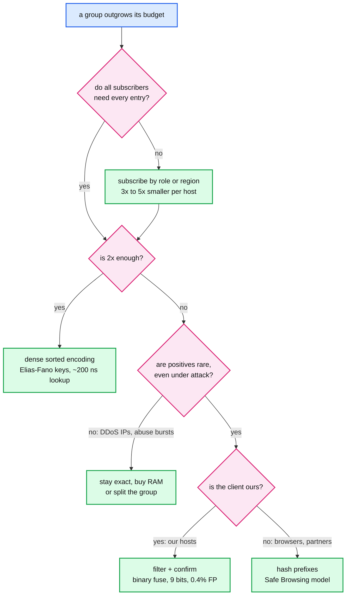
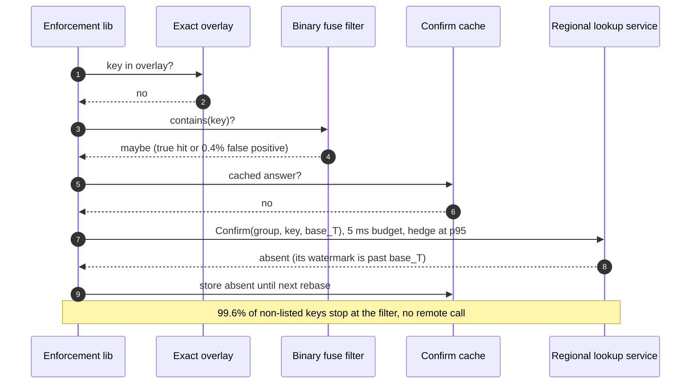
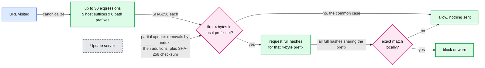

# Deep dive: list growth and tiering

> One-line answer: the base design keeps every group exact on every subscribing host, which costs 255 MB per host at 10 M entries and 2.5 GB at 100 M. When that stops paying, go down a ladder, cheapest first: subscribe by role (3x to 5x), dense sorted encodings (about 2x), then filter plus confirm for **long-tail** groups only (a binary fuse filter at about 9 bits per key and 0.4% false positives, a remote confirm on filter hits, and a confirm cache that the exact overlay keeps correct). Attack-driven groups stay exact forever, because under attack their positives are the traffic. For clients we do not own (browsers), ship hash prefixes the way Safe Browsing does, so the server never learns what the user looked up.

Reusable blocks: [`../../../concepts/bloom-filter.md`](../../../concepts/bloom-filter.md) (bits per key, the formula, a runnable filter), [`../../../concepts/sharding.md`](../../../concepts/sharding.md) (if the confirm service ever needs shards), [`../../../concepts/caching-patterns.md`](../../../concepts/caching-patterns.md) (negative caching). Design context: [`../solution.md`](../solution.md) §2 and §5.6. Siblings: [`local-lookup-and-memory-layout.md`](local-lookup-and-memory-layout.md) for the exact layout this replaces, [`propagation-and-fan-out.md`](propagation-and-fan-out.md) for what bigger snapshots do to boot.

---

## 1. The cost curve

Exact tables cost about 25 B per entry at 70% load (§2 of the solution). Everything else scales from that.

| Scale | Entries | Exact per host | Fleet RAM (200k hosts) | Snapshot (compressed) | Region boot (5,000 hosts, no local copy) |
|---|---|---|---|---|---|
| 1x (today) | 10 M | 255 MB | 51 TB | ~100 MB | 500 GB |
| 10x | 100 M | ~2.5 GB | ~500 TB | ~1 GB | 5 TB |
| 100x | 1 B | ~25 GB | ~5 PB | ~10 GB | 50 TB |

At 1x the list is 0.1% of a 256 GB host. At 10x it is 1%, and the snapshot makes a cold region boot ten times slower. At 100x it is 10% of every host's memory for a feature that denies well under 1% of requests. The interviewer's "it no longer fits" usually means 10x or 100x, and the answer depends on **which** groups grew.

## 2. The ladder

### 2.1 Subscribe by role (free)

Groups already declare `subscriber_roles`. Edge hosts load IP groups; API gateways load API-key groups; app front-ends load account groups; a jurisdiction group (`gov-feed-de`) loads only where it applies. The typical host drops to a quarter of the list. Cloudflare measured the same waste in Quicksilver: about 20% of the keyspace was in use in large data centers and about 1% in small ones, which is why Quicksilver v2 split servers into full replicas and caching proxies (https://blog.cloudflare.com/quicksilver-v2-evolution-of-a-globally-distributed-key-value-store-part-1/).

The seam: a key type can be needed in two roles (accounts at the app front-end and at the API gateway). Split the group, do not duplicate the subscription rule logic.

### 2.2 Dense sorted encodings (about 2x)

The open-addressing table pays for empty slots (30%) and padding. The base never changes between rebases, so it can be a sorted array instead:

- **Plain sorted array** of IPv4 keys: 4 B per key plus 5 B metadata in a parallel array, 9 B instead of 17 B. Lookup is a binary search: `log2(6 M) ≈ 23` dependent loads, several of them DRAM misses, about 200 to 400 ns. An Eytzinger (breadth-first) layout makes the top levels share cache lines and lets the CPU prefetch.
- **Elias-Fano** on the sorted keys: about `2 + log2(u / n)` bits per key. For 6 M IPv4 keys in a universe of `2^32`: `2 + log2(716) ≈ 11.5` bits, about 1.4 B per key. With 5 B of metadata that is about 6.4 B per entry, the solution's "5 to 8 B" and a bit under 3x smaller than the hash table. Lookup: find the bucket from the high bits (a select on a small bit vector), then scan a handful of low-bit entries. Around 200 ns.
- Metadata compresses too: `expires_at` as minutes since the base boundary fits in 2 B for any TTL under 45 days.

Cost: lookups get 2x to 4x slower, still well under 1 us. Rebase gets slower (sorting instead of hashing). Worth it at 10x; not enough at 100x.

### 2.3 Filter plus confirm (for long-tail groups only)

Replace a large group's base with an approximate-membership filter. A filter says "definitely not present" or "maybe present". Only "maybe" goes further.

| Filter | Bits per key | False positive rate | Updatable in place? | Source |
|---|---|---|---|---|
| Bloom | 9.6 | 1% | insert only | [`../../../concepts/bloom-filter.md`](../../../concepts/bloom-filter.md) |
| Bloom | about 11.5 | 0.4% | insert only | same formula: `1.44 × log2(1 / 0.004)` |
| Xor | 9.84 | about 0.39% (8-bit fingerprints) | no, rebuild | https://arxiv.org/pdf/1912.08258 |
| Binary fuse (3-wise / 4-wise) | about 9 / 8.6 | about 0.4% | no, rebuild | https://arxiv.org/pdf/2201.01174 |
| Cuckoo | about 10 to 11 at 1% | 1% | yes, insert and delete | https://arxiv.org/pdf/1912.08258 (comparison) |

At 100 M keys a binary fuse filter is `100 M × 9 bits = 113 MB` against 2.5 GB exact. That is the 20x.

The lookup path keeps the exact overlay in front:

**Why the confirm cache needs no TTL.** Every change after the host's base boundary `T` lands in the exact overlay, and the overlay is checked first. A cached "absent" cannot hide a later add (the add is in the overlay). A cached "present" cannot hide a later remove (the tombstone is in the overlay). The cache only goes stale when the overlay is trimmed at the next rebase, so it is cleared then. The one rule for the lookup service: answer only if its own watermark is at or past the host's `T`, otherwise it could miss something the host already trimmed from its overlay.

**Sizing the regional lookup service.** Upper bound of confirms: `100 M lookups/s × 0.4% = 400k/s` fleet-wide, if every lookup hit filter-mode groups (they will not). Across 30 regions that is about 13k/s per region plus true positives. The full group at 100 M entries is about 3 GB in memory; at 1 B it is about 30 GB. Both fit on one server, so the service is **replicated, not sharded**: 3 to 5 replicas per region across zones, each doing well over 100k lookups/s from memory. Sharding by key only pays past roughly 10 B entries or 1 M confirms/s in a region. Each replica is itself a host agent subscribed to the group, so it follows the same stream, watermark and checksum as everyone else.

**Filters are static, so decide how they refresh.** Xor and binary fuse filters cannot take an insert. A host in filter mode also does not hold the keys, so it cannot rebuild the filter itself. Three options:

| Option | Cost | Pick when |
|---|---|---|
| Publisher builds the filter at every 10-minute snapshot and hosts download it | `113 MB / 600 s ≈ 190 KB/s` per host, about 38 GB/s fleet-wide, about 70 MB/s per distributor | Churn is high and the network budget allows |
| Longer boundary for this group (hourly), exact overlay holds the hour | overlay grows to the group's hourly change count | Churn is low. A compromised-credential list changing 100/s is 360k per hour, under the 500k overlay cap |
| Cuckoo filter updated in place from the stream | about 10 to 11 bits per key at 1%, occasional rebuild when an insert fails at high load | Churn is high and downloads are not affordable |

Default: hourly boundary for slow long-tail groups, cuckoo for the rare fast one.

## 3. Why attack-driven groups stay exact

A filter makes negatives local and positives remote. That is the right shape only when positives are rare. For a DDoS IP group during an attack, **positives are the traffic**: 10 M attack requests/s would become 10 M confirm calls/s, the attack reflected into our own lookup service. And the `drop` path runs in XDP, which cannot make a remote call at all. So `edge-ip-drop` and any detector-fed abuse group stay exact and local at any size. If one grows too big, split it by region or shorten its TTLs; do not filter it.

## 4. When the confirm service is unreachable

The filter changed the failure model: something remote is now on the deny path for that group. Write the policy per group, before the outage:

| Group | Unconfirmed filter hit becomes | Why |
|---|---|---|
| Revoked credentials / API keys | DENY | A revoked key working is a security incident. Cost: 0.4% of that group's legitimate lookups wrongly denied for the outage |
| URL or domain reputation | ALLOW, with a warning interstitial where the product has one | A false block on 0.4% of the web is a product outage |
| Long-tail IP abuse (not attack-driven) | ALLOW | The same IPs will be caught by rate limits; a false deny is a user lost |

Plus fail-static: cached answers keep being served, and the overlay keeps working, so only filter hits on keys not seen since the last rebase are affected. The confirm call has a 5 ms budget and hedges to a second replica at its p95, so one slow replica never becomes the policy.

## 5. Clients we do not own: hash prefixes

For browsers (the Safe Browsing variant) the constraint is privacy, not memory: the server must not learn every URL a user visits.

- Most prefixes are 4 bytes; 4 to 32 are allowed (https://developers.google.com/safe-browsing/v4/local-databases).
- A URL expands to at most 30 host-suffix and path-prefix combinations, each hashed and checked (https://developers.google.com/safe-browsing/v4/urls-hashing).
- A prefix hit asks for every full hash with that prefix and compares locally. The server sees 4 bytes shared by many URLs, not the URL.
- After every update the client computes SHA-256 over its lexicographically sorted list and compares it with the server's checksum; on mismatch it clears the list and asks for a full update. That is the same idea as our state checksum in [`watermarks-and-consistency-window.md`](watermarks-and-consistency-window.md), and a reason to trust it.

The same shape fits a partner-facing API that wants to check "is this card or device on our fraud list" without us learning every card they process.

## 6. When the universe is known: filter cascades

CRLite (Mozilla) must answer "is this certificate revoked" exactly, with no confirm call, for every certificate in the web PKI. The trick: the set of all valid certificates is known from Certificate Transparency logs. Build a filter of the revoked set; run every known non-revoked certificate through it; build a second filter of the ones that falsely hit; run the revoked set through that; repeat until no false positives remain. For any certificate in the known universe the answer is exact.

The 2025 version uses clubcards, a partitioned two-level cascade of Ribbon filters: a 4 MB snapshot every 45 days, deltas every 12 hours, and an average of 300 kB of revocation data per user per day, replacing OCSP checks that blocked the TLS handshake for 100 ms at the median (https://hacks.mozilla.org/2025/08/crlite-fast-private-and-comprehensive-certificate-revocation-checking-in-firefox/). Chrome's CRLSets, a curated subset, cover about 1% of revocations.

Where it fits us: account ids are a closed universe (every account that exists), so an exact cascade over accounts is possible and would be a few bits per denied account. The catch is that accounts created after the build are outside the universe, so they need their own exact path (they are in the overlay if denied, and otherwise assumed clean until the next build). IP space is also enumerable but the second level would be enormous, so cascades do not help IPs.

## 7. What changes in the design

- `GROUP.storage = exact | dense | filter+confirm`, with `on_confirm_unreachable` and `boundary_interval` per group.
- Publishers build and sign filters (or dense arrays) at the group's boundary; snapshots for filter groups carry the filter, not the keys.
- A regional lookup service per filter group: 3 to 5 replicas per region, each a subscriber with its own watermark.
- Host agent: confirm cache per filter group, cleared at rebase; `check()` gains one possible remote call, only for filter-mode groups, only on a filter hit.
- Nothing changes in the stream, the version, the checksum, or the safety layers. The checksum still covers the full group, computed by the publisher and by the lookup-service replicas.

## 8. Numbers to say out loud

- Exact: about 25 B per entry. 255 MB per host at 10 M, 2.5 GB at 100 M, 25 GB at 1 B.
- Fleet RAM: 51 TB, 500 TB, 5 PB.
- Role subscription: 3x to 5x. Quicksilver v2: 20% of keys used in large data centers, 1% in small.
- Elias-Fano IPv4: about 11.5 bits per key, about 6.4 B per entry with metadata, about 200 ns lookup.
- Binary fuse: about 9 bits per key (8.6 four-wise), 0.4% false positives. 100 M keys in 113 MB. Bloom: 9.6 bits at 1%. Xor: 9.84 bits.
- Confirms: at most 400k/s fleet-wide, about 13k/s per region. Replicate the full group (3 GB at 100 M), do not shard.
- Attack groups stay exact: under attack the positives are the traffic.
- Safe Browsing: 4-byte prefixes, up to 30 expressions per URL, SHA-256 checksum of the sorted list.
- CRLite 2025: 4 MB snapshot every 45 days, 12-hour deltas, 300 kB per user per day.
