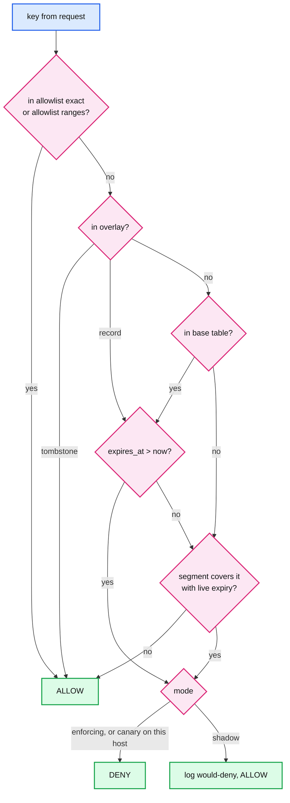
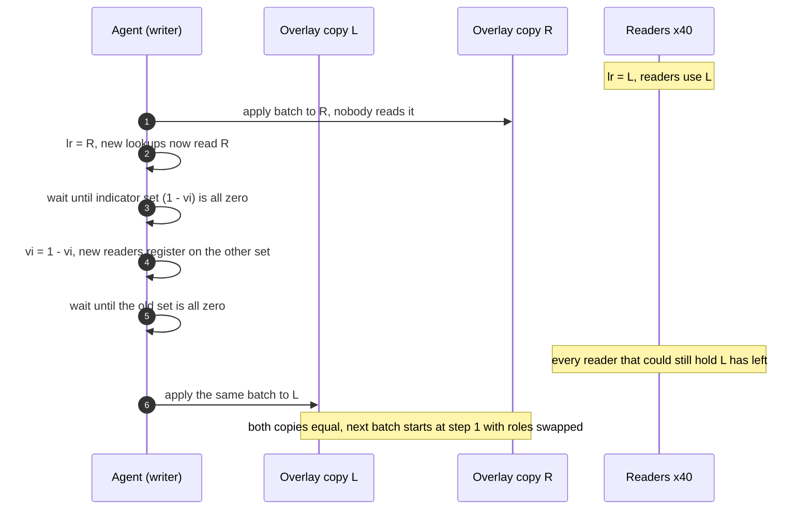

# Deep dive: local lookup and memory layout

> One-line answer: each host holds one copy of the list in shared memory, split into an immutable **base** (per-key-type open-addressing tables plus a flattened CIDR interval array, rebuilt every 10 minutes and re-mapped by generation) and a small **overlay** of changes since the base (two copies swapped with the left-right pattern, so the agent is the only writer and 40 proxy readers never block or retry). A lookup is allowlist, then overlay (a tombstone wins), then base, then CIDR: 3 to 6 memory probes, about 400 ns. Edge hosts also mirror `drop` entries into BPF maps so XDP kills attack packets at 24 Mpps per core before the kernel stack sees them.

Reusable blocks: [`../../../concepts/bloom-filter.md`](../../../concepts/bloom-filter.md) (why not a filter at this size), [`../../../concepts/skip-list.md`](../../../concepts/skip-list.md) (another lock-free-reader structure, for contrast). Design context: [`../solution.md`](../solution.md) §2 and §5.1. Siblings: [`list-growth-and-tiering.md`](list-growth-and-tiering.md) for when this layout stops fitting, [`watermarks-and-consistency-window.md`](watermarks-and-consistency-window.md) for the checksum the rebase verifies.

---

## 1. Record layouts and the memory bill

Store the real key. Pad each record to an alignment the CPU likes. Size every base table for a 70% load factor. The base is built once per 10 minutes and never grows, so size it exactly with a multiply-shift reduction instead of rounding up to a power of two (which could leave a table anywhere between 35% and 70% full).

| Table | Key | Metadata | Record | Entries | `entries × record / 0.7` |
|---|---|---|---|---|---|
| IPv4 exact | 4 B address | `expires_at` 4 B (seconds), flags 1 B | 12 B | 6 M | 103 MB |
| IPv6 exact | 16 B (/128, or /64 zero-padded with a flag bit) | 5 B | 24 B | 1.5 M | 51 MB |
| Account id | 8 B | 5 B | 16 B | 1.8 M | 41 MB |
| API key / token | 16 B SHA-256 prefix | 5 B | 24 B | 0.5 M | 17 MB |
| CIDR segments | 4 B or 16 B bounds | max expiry per mode, entry pointer | 12 B (v4), 40 B (v6) | 200k ranges | 8 MB |
| Overlay L + R | any | record or tombstone | 24 B | up to 500k | 35 MB |

Flags (1 B): 2 bits action (`deny`, `drop`), 2 bits mode (`shadow`, `canary`, `enforcing`), 1 bit tombstone, 1 bit "this IPv6 key is a /64", 2 bits spare. The entry's group, reason and actor are **not** on the host. The deny log carries `(group, key, W)` and support resolves the rest from the store at that time. That keeps the hot record small.

Two things push real usage above the table: the rebase briefly holds two bases (about 500 MB peak), and page tables. 255 MB in 4 KB pages is about 65k pages, far beyond the TLB (translation lookaside buffer), so almost every probe also misses the TLB. Back the tmpfs file with 2 MB huge pages (about 128 of them) and that second miss mostly disappears.

## 2. Why not a 64-bit hash as the key

The tempting layout: hash every key type to 64 bits and keep one table of 8 B hashes. Smaller and uniform. The arithmetic kills it.

- A lookup for a key that is **not** on the list matches some entry's hash with probability `n / 2^64 = 10^7 / 1.8 × 10^19 = 5.4 × 10^-13`.
- Nearly all 100 M lookups/s are for keys not on the list. So `100 M × 5.4 × 10^-13 = 5.4 × 10^-5` false matches per second.
- `× 86,400 s = 4.7` per day. About five real users a day denied with no entry that names them. Support cannot explain it and it is not reproducible.
- At 10x the list and 10x the traffic it is 470 a day.

With 128-bit hashes the rate drops to about `10^-20` per lookup, which is fine, but 16 B per key is no smaller than the exact keys for IPv4 and accounts. So: exact keys for fixed-size ids, a 16 B SHA-256 prefix only for API keys, where the raw secret must not be stored anyway.

## 3. Probe cost in cache misses

Most lookups are misses (the key is not denied), so the unsuccessful-search cost is the one that matters.

- Linear probing at load factor `a = 0.7` needs about `(1 + 1/(1 - a)^2) / 2 = 6.1` slots for a miss and `(1 + 1/(1 - a)) / 2 = 2.2` for a hit (Knuth's classic estimates).
- 6 slots of 12 B IPv4 records are 72 B: one or two adjacent 64 B cache lines, so **one DRAM miss** (about 80 to 100 ns) plus a prefetched neighbour. For 24 B IPv6 records, 144 B, two or three lines.
- A SIMD-grouped table (Swiss table style: a 16-byte control group of 1-byte hash tags scanned with one instruction) answers most misses from one cache line at any sane load factor. Worth it for the IPv6 and API-key tables.
- Per request: allowlist (small, in L2), overlay (35 MB, usually a miss in L3), base exact (one DRAM miss per key type), CIDR (about 18 binary-search steps, top levels cached). Two keys per request gives the solution's 300 to 500 ns.

## 4. CIDR ranges: flatten at build time

A hash table cannot answer "does any range contain this address". Build a sorted array of non-overlapping segments instead:

1. Turn every deny CIDR into an integer interval `[start, end]`.
2. Collect all `start` and `end + 1` points, sort them. Adjacent points bound **elementary segments**. 200k ranges give at most 400k segments.
3. For each segment, record the **maximum `expires_at` among covering enforcing entries** and the same for shadow entries, plus a pointer to the most specific covering entry (for the log). Storing the max expiry, not the most specific entry's expiry, is what keeps "an expired /24 inside a live /16" correct: any unexpired covering deny still denies.
4. Merge adjacent segments with identical records.

Lookup: one binary search for the last segment whose start is at or below the address, then compare against its end. About 18 steps for 200k ranges, 100 to 200 ns.

**Allowlist ranges are not subtracted.** They live in their own small interval array, checked first. That way the deny segments never need rebuilding when the allowlist changes, and a bug in segment building can never deny a protected range.

**Changes between rebases.** CIDR adds are rare (they go through the standard lane with 10 minutes of shadow and canary), so they sit in a short overlay list scanned linearly. A CIDR **remove** of a base range cannot be expressed as a tombstone on a segment, because the segment's max expiry may come from the removed entry. So a CIDR remove triggers an immediate rebuild of the segment array (about 20 ms for 200k ranges), swapped by generation like the base. A few per hour, so the cost is nothing.

**When to switch to a trie.** Binary search has `log2 n` dependent loads. At 2 M ranges that is 21 steps with the bottom 8 or so in DRAM, over 500 ns. Past about 1 M ranges, or if IPv6 ranges dominate, use a compressed multibit trie. Poptrie measured 174 to over 240 M lookups/s on one core with 500k to 800k route tables (https://conferences.sigcomm.org/sigcomm/2015/pdf/papers/p57.pdf): a few nanoseconds per lookup when warm.

## 5. Lookup precedence, with a worked example



Worked example. Base built at 10:00. Since then, batches added `203.0.113.7` (overlay record, expires 11:00) and removed `192.0.2.50` (overlay tombstone; it is still in the base). The base also holds `198.51.100.0/22` as a CIDR segment.

| Request IP at 10:05 | Allowlist | Overlay | Base | CIDR | Verdict |
|---|---|---|---|---|---|
| `10.1.2.3` (health checker) | hit | | | | ALLOW, never looks further |
| `203.0.113.7` | miss | record, live | not reached | | DENY |
| `192.0.2.50` | miss | tombstone | not reached (it is there, stale) | | ALLOW |
| `198.51.101.9` | miss | miss | miss | inside the /22 | DENY |
| `8.8.8.8` | miss | miss | miss | no segment | ALLOW |

The tombstone row is the reason the overlay is checked before the base: a remove must beat the stale base copy until the next rebase drops it.

## 6. Left-right: one writer, readers that never wait

Two copies of the overlay (L and R), an index `lr` saying which one readers use, a version index `vi`, and two sets of **read indicators**. Each reader (one proxy worker) owns one slot per set, padded to its own 64 B cache line, so readers never write a line another core writes.

Reader, every lookup: read `vi`, increment its own slot in indicator set `vi`, read `copies[lr]`, decrement the slot. No loop, no compare-and-swap, no retry: wait-free.

Writer (the agent), per batch:



Why two indicator sets and not one: a reader can read `lr = L`, be descheduled, and only then increment. With one indicator the writer could see zero, start writing L, and the late reader would walk a half-written map. The version toggle guarantees that any reader that saw the old `lr` registered on the indicator set the writer waits for.

**Compared with the alternatives:**

| Scheme | Reader cost | Writer cost | Fits the overlay? |
|---|---|---|---|
| Reader-writer lock | shared atomic on every lookup, blocks during writes | blocks readers for the whole batch | No: 2 ms stalls, cache-line ping-pong across 40 cores |
| Seqlock | read version, read, re-read, retry if changed | cheap | No: a reader can follow a pointer mid-rehash and crash, and busy writers cause retry storms. Fine for a small fixed-size record |
| RCU with copy-on-write | nothing on the read side | copy the whole 35 MB map per batch, wait a grace period | Too expensive 10 times a second. It is exactly what the **base** uses: a new file every 10 minutes, swapped by generation |
| Left-right | two writes to its own padded line | apply every op twice, wait for readers to drain | Yes: 2x a small map, 40k inserts/s at burst |

**The failure mode nobody mentions: a reader dies inside a read.** Its indicator stays non-zero and the writer waits forever, freezing updates on that host. Each slot stores the owning PID. If the writer waits more than 10 ms it checks `kill(pid, 0)` for the slots still set and clears the dead ones. The agent exports "writer wait time" as a metric; a host whose agent is stuck shows up as stale in [`watermarks-and-consistency-window.md`](watermarks-and-consistency-window.md), not as a silent problem.

A runnable sketch (Python, so the GIL hides the memory-ordering details a C version needs: the indicator increment must be a store the writer can see before the `lr` read, and the writer's flips need release/acquire ordering):

```python
import bisect, ipaddress, threading
TOMB = None  # overlay value: "removed since the base was built"

class LeftRight:
    """Two overlay copies. One writer. Readers never block and never retry."""
    def __init__(self, n_readers):
        self.copies = [{}, {}]
        self.lr = 0                                    # copy readers use
        self.vi = 0                                    # indicator new readers join
        self.ind = [[0] * n_readers, [0] * n_readers]  # one slot per reader (a padded line in C)
    def read(self, rid, fn):
        v = self.vi
        self.ind[v][rid] += 1                          # arrive: only this reader writes this slot
        try:
            return fn(self.copies[self.lr])
        finally:
            self.ind[v][rid] -= 1                      # depart
    def write(self, ops):                              # single writer: the host agent
        apply = lambda copy: copy.update(ops)
        apply(self.copies[1 - self.lr])                # 1. write the copy nobody reads
        self.lr = 1 - self.lr                          # 2. flip readers onto it
        prev, nxt = self.vi, 1 - self.vi
        while any(self.ind[nxt]): pass                 # 3. drain stragglers from two writes ago
        self.vi = nxt                                  # 4. new readers join the other indicator
        while any(self.ind[prev]): pass                # 5. drain readers that may hold the old copy
        apply(self.copies[1 - self.lr])                # 6. old copy is now unread: catch it up

class HostList:
    def __init__(self, base, cidrs, allow, n_readers):
        self.base, self.cidrs, self.allow = base, cidrs, allow  # base and cidrs immutable per snapshot
        self.starts = [s for s, _ in cidrs]            # sorted, non-overlapping intervals
        self.overlay = LeftRight(n_readers)
    def check(self, rid, ip, now):
        if ip in self.allow: return "ALLOW"            # 1. protected keys win
        hit = self.overlay.read(rid, lambda o: o.get(ip, "miss"))
        if hit is TOMB: return "ALLOW"                 # 2. tombstone: skip the base
        exp = hit if hit != "miss" else self.base.get(ip)  # 3. overlay record supersedes base
        if exp is not None and exp > now:
            return "DENY"
        x = int(ipaddress.ip_address(ip))              # 4. one binary search over ranges
        i = bisect.bisect_right(self.starts, x) - 1
        return "DENY" if i >= 0 and x <= self.cidrs[i][1] else "ALLOW"

if __name__ == "__main__":
    net = ipaddress.ip_network("198.51.100.0/22")
    h = HostList({"203.0.113.7": 2000}, [(int(net[0]), int(net[-1]))], {"10.1.2.3"}, 4)
    assert h.check(0, "203.0.113.7", 1000) == "DENY" and h.check(0, "198.51.101.9", 1000) == "DENY"
    stop = []
    readers = [threading.Thread(target=lambda r=r: [h.check(r, "203.0.113.7", 1000) for _ in iter(lambda: stop, [1])]) for r in range(4)]
    for t in readers: t.start()
    h.overlay.write([("192.0.2.1", 5000)])             # add
    h.overlay.write([("203.0.113.7", TOMB)])           # remove an entry that lives in the base
    stop.append(1)
    for t in readers: t.join()
    assert h.check(0, "192.0.2.1", 1000) == "DENY" and h.check(0, "203.0.113.7", 1000) == "ALLOW"
    assert h.check(0, "192.0.2.1", 6000) == "ALLOW" and h.check(0, "10.1.2.3", 1000) == "ALLOW"
    print("ok")
```

## 7. Rebase and generation re-map

Every 10 minutes (boundary `T`), or early when the overlay reaches 500k entries:

1. The agent merges base plus overlay entries with commit time at or before `T`, drops entries with `expires_at <= T`, and writes `base.<gen+1>` to tmpfs (1 to 2 s of one core, about 220 MB).
2. It computes the state checksum of the new base and compares it with the snapshot checksum the publisher attached to the batch ending at `T`. Mismatch: keep the old base, alert, fetch the published snapshot instead.
3. It writes `gen + 1` and the file name into the shared header.
4. Each reader notices the new generation on its next lookup (one atomic load of a line that changes every 10 minutes), opens the new file, maps it, and swaps its local pointer. **A rename or a new file never changes an existing mapping**; a reader that never re-maps would read the old base forever.
5. Each reader slot records the generation it now uses. When every live slot shows `gen + 1`, the agent trims the overlay of entries at or before `T` (a normal left-right write) and unlinks the old file. Order matters: switch the base first, then trim, so no entry is ever in neither.
6. The agent copies the new base and `W` to local disk for boot ([`failure-modes-and-fail-static.md`](failure-modes-and-fail-static.md)).

Why tmpfs and `mmap` rather than a heap per process: one physical copy, page-cache backed, shared by every process on the host; a proxy restart re-maps in microseconds instead of rebuilding 255 MB; the agent can crash and restart without any proxy noticing, because the file and header outlive it.

## 8. XDP: dropping attack packets before the stack

Only for `action = drop` entries, only IPs, only on edge hosts.

- The agent mirrors those entries into two kernel maps: a BPF hash map keyed by address (exact) and a BPF LPM trie map keyed by `(prefix length, address)` (ranges). Map sizes are fixed at creation, say 8 M exact and 500k ranges. An update past `max_entries` fails, and the agent treats that as a bounds violation (alert, keep the rest), never a crash.
- The XDP program parses Ethernet and IP headers, looks up the source address in both maps, and returns `XDP_DROP` on a hit. It runs in the driver's receive path before the kernel allocates a socket buffer.
- Expiry: the program does not compare wall-clock time. The agent runs a 1-second sweeper that deletes expired entries from the maps. A drop entry can outlive its expiry by up to a second at the edge; the proxy's own check has the exact expiry.
- Numbers from the XDP paper (https://raw.githubusercontent.com/xdp-project/xdp-paper/main/xdp-the-express-data-path.pdf): 24 Mpps dropped on a single core (41.6 ns per packet), scaling to 115 Mpps where the PCI bus limits it; the normal Linux stack manages 4.8 Mpps on one core in raw mode. So a 20 Mpps flood costs one core in XDP and five in the stack, and the proxy never sees it.
- `deny` stays in the proxy: a 403 page needs HTTP, and accounts and API keys only exist after TLS and parsing. Large range sets load slowly into LPM tries, so the agent may flatten wide ranges into exact /24 or /48 keys.

## 9. Numbers to say out loud

- 255 MB per host steady, about 500 MB during a rebase. 51 TB fleet-wide. One copy per host, not 40.
- Records: IPv4 12 B, IPv6 24 B, account 16 B, API key 24 B, at 70% load.
- 64-bit hash keys: `5.4 × 10^-13` per lookup, about 5 wrong denies a day at 100 M lookups/s.
- Linear probing at 70%: about 6 slots per miss, one DRAM miss for IPv4.
- CIDR: 200k ranges become at most 400k segments, 18 binary-search steps, 100 to 200 ns. Poptrie past about 1 M ranges: 174 to 240 M lookups/s per core.
- Precedence: allowlist, overlay (tombstone wins), base, CIDR. About 400 ns per request.
- Left-right: readers do two writes to their own padded line; writer applies twice; overlay 500k entries, 35 MB for both copies.
- Rebase every 10 minutes, 1 to 2 s of one core, checksum-verified, re-mapped by generation.
- XDP: 24 Mpps per core vs 4.8 Mpps for the Linux stack; drop entries only.
