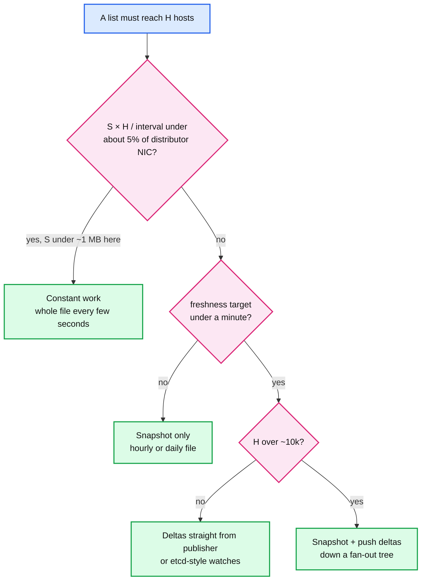
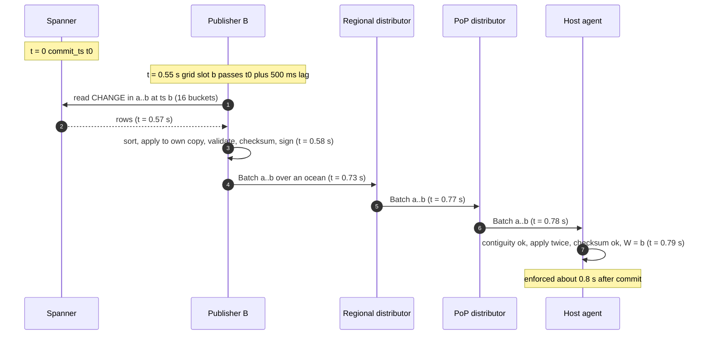
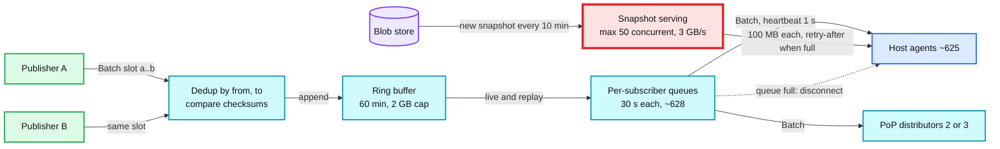

# Deep dive: propagation and fan-out

> One-line answer: ship a 100 MB snapshot once and then 32-byte changes forever, pushed down a three-level tree of dumb forwarders (2 publishers, 240 regional distributors, 300 PoP distributors, 200k host agents). The publishers need no leader because a batch is a pure function of the store read at a closed timestamp. Distributors buffer 60 minutes and never buffer for a slow host. Rate caps per lane bound what the stream can carry. Boots start from each host's own disk, so a mass restart is a catch-up, not a download storm. About 0.8 s commit to enforcement, 10 s p99 with room for one failover.

Reusable blocks: [`../../../concepts/gossip-protocol.md`](../../../concepts/gossip-protocol.md) (why not gossip), [`../../../concepts/etcd.md`](../../../concepts/etcd.md) and [`../../../concepts/zookeeper.md`](../../../concepts/zookeeper.md) (why not watches from every host), [`../../../popular_systems_deepdive/envoy/envoy-06-xds-control-plane.md`](../../../popular_systems_deepdive/envoy/envoy-06-xds-control-plane.md) (the same push shape for proxy config), [`../../../popular_systems_deepdive/kafka/kafka-05-consumer-rebalance.md`](../../../popular_systems_deepdive/kafka/kafka-05-consumer-rebalance.md) (what 200k consumers would cost). Solution context: [`../solution.md`](../solution.md) §4.3 and §5.2. Sibling: [`watermarks-and-consistency-window.md`](watermarks-and-consistency-window.md) covers what a host does with each batch.

---

## 1. Push, pull, or constant work: decide by arithmetic

Three ways to move a list to 200k hosts. The fleet cost of each is one line.

| Model | Fleet bytes per second | At our numbers | Freshness floor |
|---|---|---|---|
| Constant work: every host fetches the whole list every `I` seconds | `S × H / I` | `100 MB × 200k / 10 s = 2 TB/s` (20 TB per cycle) | `I` plus fetch time |
| Pull deltas: every host polls "changes since W" every `P` seconds | `H / P` requests plus the deltas | 200k req/s at `P = 1 s`, deltas 12.8 GB/s average | `P` plus one RTT |
| Push deltas with heartbeats | the deltas plus one heartbeat per host per second | 12.8 GB/s average, 128 GB/s burst | one hop per level |

Where constant work stops being the right answer. Spread over 540 distributors, constant work at `I = 10 s` costs `S × 200k / 10 / 540 = S × 37` per second per distributor.
- **S = 1 MB:** 37 MB/s per distributor. That is about what the delta stream costs on an average day (40 MB/s). Same bill, far simpler. Constant work wins.
- **S = 40 MB:** 1.5 GB/s per distributor, half of a 25 Gbps NIC, spent every second of every day. Possible, and 40x the delta stream.
- **S = 100 MB:** 3.7 GB/s per distributor, more than the NIC. Impossible.

So the crossover is about 1 MB, and it is a cost crossover, not a correctness one. Say it this way in the interview: "Constant work is what I would build for a 1 MB list. Ours is 100 MB."

Pull with a long poll is push in disguise: the host asks "anything after W?" and the server holds the request until there is. It keeps the same ordering and resume problems and adds one RTT per batch. We push on a long-lived gRPC stream and send a heartbeat batch every second, which gives pull's main virtue (the host always knows how current it is) without 200k polls a second.

---

## 2. The latency budget, hop by hop

| Hop | Typical | Bad day | What sets it |
|---|---|---|---|
| Commit until the closed timestamp passes it | 500 ms | 600 ms | The publisher reads at `now - 500 ms` so reads never wait on in-flight commits |
| Wait for the next 100 ms grid slot | 50 ms | 100 ms | Batch cut interval |
| Read 16 buckets at timestamp `b` | 20 ms | 50 ms | One read-only transaction, 16 short ranges |
| Apply, validate, checksum, sign at publisher | 5 ms | 20 ms | Same code as the host |
| Publisher to regional distributor | 5 to 150 ms | 200 ms | Same region vs across an ocean |
| Regional to PoP distributor | 5 to 50 ms | 80 ms | Only for PoP hosts |
| Distributor to host | under 1 ms | 5 ms | Same site |
| Host apply (twice, flip, reader grace) | 2 to 10 ms | 20 ms | [`local-lookup-and-memory-layout.md`](local-lookup-and-memory-layout.md) |
| **Total** | **~0.8 s** | **~1.2 s** | |
| One distributor failover on the path | +4 s | | 3 s of silence, then reconnect and replay |

The 10 s p99 SLO is not spent in the happy path. It is the room for one failover plus a GC pause or a TCP retransmit. The largest single term is the closed-timestamp lag. It is tunable, but it is the thing that makes the batch complete, so trim it only if the store's safe time demonstrably keeps up.

---

## 3. Why two publishers need no leader

A leader with a lease is the obvious design, and its failover (lease expiry plus election, 5 to 10 s) would eat the whole budget. The alternative works because of three properties.

1. **The input is fixed.** A Spanner read at timestamp `b` returns exactly the commits at or before `b`, and the same read gives the same rows whichever region runs it.
2. **The function is fixed.** Ops sorted by `(commit_ts, identity)`, applied with the same code, the same XOR checksum, the same validation. No wall clock, no random seed, no map iteration order in the output.
3. **The boundaries are fixed.** Slots sit on a global 100 ms grid. Each publisher emits exactly one batch per slot, empty or not, and never merges slots. A publisher that paused for 2 s catches up by emitting the 20 missed slots one by one, not one 2-second batch. So the two copies of slot `(a, b]` always have the same `from` and `to`, and distributors can deduplicate by that pair.

What can still break determinism, and the guard for each:

| Cause | Symptom | Guard |
|---|---|---|
| A publisher's clock is off by 50 ms | It emits slot `b` 50 ms later than the other | Nothing to guard: the grid, not the clock, names the slot. Late is not different |
| Code version skew during a publisher deploy (new sort key, new validation rule, new field) | Checksums differ for the same slot | Replay-test the new build on a day of `CHANGE` history against the old one and require byte-identical output. Anything that changes output ships behind a flag with an activation boundary (for example "format v2 from 10:40:00.0"), flipped only after both publishers run the new build |
| A bug that depends on input order within a slot | Rare mismatch under concurrent commits | The sort is total because `identity` breaks ties |
| One publisher reads a stale replica | Missing ops in its copy | Impossible for a read at an explicit timestamp: the replica waits until it is safe at `b` |

On a mismatch the distributor has already forwarded the first copy (it does not wait for both, which would add up to 150 ms). It pages, and it records which publisher agrees with the snapshot builder's independent checksum at the next 10-minute boundary. That is the tie-breaker. Hosts that took the wrong copy fail their checksum at that boundary and resync.

---

## 4. Tree sizing and egress

| Level | Count | Children per node | Average egress per node | Burst egress per node |
|---|---|---|---|---|
| Publisher | 2 (both active) | 240 regional distributors | `240 × 64 KB/s = 15 MB/s` | `240 × 640 KB/s = 154 MB/s = 1.2 Gbps` |
| Regional distributor | 240 (8 per region) | ~625 hosts plus 2 or 3 PoP distributors | `~628 × 64 KB/s = 40 MB/s` | `~628 × 640 KB/s = 402 MB/s = 3.2 Gbps` |
| PoP distributor | 300 (2 per PoP, each fed by two regions) | ~165 hosts | `165 × 64 KB/s = 10.6 MB/s` | `165 × 640 KB/s = 106 MB/s = 0.85 Gbps` |
| Host agent | 200k | none | acks only | acks only |

Why three levels and not two. Publishers straight to hosts would mean 100k streams per publisher and `200k × 640 KB/s = 128 GB/s` at burst from two machines. Why not four. A fourth level adds one hop of latency and one more failure to detect, and no node here is near its connection or NIC limit in steady state. Meta's Configerator uses the same three levels (leader, hundreds of observers, a proxy on every server) and measured about 4.5 s through the tree to hundreds of thousands of servers across continents, 14.5 s end to end including git. Cloudflare's Quicksilver uses three tiers and reported a p99 of 2.29 s to every machine worldwide at about 350 changes/s (2019).

Heartbeats cost almost nothing: 200k hosts × one empty batch per second is 200k messages per second fleet-wide, about 330 per distributor per second.

---

## 5. Inside a distributor

A distributor is a forwarder with three pieces of state per group.

- **A ring buffer of batches, 60 minutes deep.** Average `2k changes/s × 3,600 s × 32 B = 230 MB`, capped at 2 GB. A long burst shortens the window instead of growing memory. A host whose watermark has fallen off the end gets "too old" and goes to a snapshot.
- **The latest snapshot per group on local SSD**, fetched from the blob store when the snapshot builder publishes it, served to booting hosts under admission control (at most 50 concurrent downloads, the rest get retry-after with jitter).
- **One stream per subscriber with a bounded send queue**, about 30 s of batches. A host that cannot keep up (a GC storm, a saturated NIC, a wedged agent) is disconnected when its queue fills. It reconnects with its watermark and replays from the ring buffer. Buffering without bound for one slow host is how one bad host takes down a distributor serving 624 good ones.

---

## 6. Lanes bound the stream by construction

The stream can only carry what the API lets in, so the caps live at the API, per group.

| Lane | What goes in | Cap | Why |
|---|---|---|---|
| Emergency | narrow entries by trusted actors, every remove | none, but bounded by actor quotas (a default detector at 10k adds/min is 167/s; the DDoS detector may burst to 20k/s, narrow entries with TTL at most 1 h only) | Fighting a live attack and unblocking a customer must never queue |
| Standard | broad entries after the gate | 2k changes/s per group | Their mode changes (shadow, canary, enforcing) are also changes |
| Bulk | imports and feeds | 5k changes/s per group | A 1 M import takes 200 s, inside the 5-minute bulk SLO, and looks like any other burst on the wire |

Without the bulk cap, a 1 M-entry import committed at once is one 32 MB batch to every host in the same second: `200k × 32 MB = 6.4 TB` through the tree, and a 32 MB apply on every host at once.

---

## 7. Bootstrap without a storm

Order of preference for a booting agent:

1. **Its own disk.** The agent writes base plus watermark at every rebase. If that copy is under 60 minutes old, the boot is "map the base, replay the ring buffer". No snapshot download at all.
2. **The distributor's snapshot**, under admission control.
3. **The blob store directly**, if the distributor keeps answering retry-after.
4. **Peers in the rack**, only for lists above about 1 GB. Meta's PackageVessel moves configs larger than 1 MB by BitTorrent and reaches the fleet in under 4 minutes. At 100 MB we do not need it.

Worked example, one region of 5,000 hosts restarting. If 90% have a local copy under an hour old, 500 hosts download, about 63 per distributor: two admission rounds of about 1.7 s each (50 × 100 MB at 3 GB/s). If nobody has a local copy: 625 per distributor, 13 rounds, about 22 s of saturated NIC per distributor, while it also streams live batches. That second case is why the solution colors the regional distributor red, and why the local copy exists.

---

## 8. Why not Kafka, gossip, or watches from every host

- **Kafka with every host as a consumer.** A group's order lives in one partition, so all 200k hosts fetch from the one broker leading it: 128 GB/s at burst and 200k fetch sessions. Each host needs every message, so there is no consumer group to spread the work. You end up mirroring per region and adding relay consumers per site, which is the distributor tier with more moving parts. Kafka is a fine publisher-to-distributor log if you want durability there.
- **Gossip.** `log2(200k) ≈ 18` rounds, every message delivered several times, no ordering. Each host still needs gap repair from an authoritative source. Right for membership and liveness, wrong for an ordered stream.
- **etcd or ZooKeeper watches from every host.** Both are sized for control-plane state. etcd has a 2 GiB default quota, 8 GiB suggested maximum, 1.5 MiB per request and tens of thousands of writes per second at most. A watch whose revision was compacted is cancelled, and the client must list again. 200k clients relisting after one compaction is a self-inflicted storm. ZooKeeper keeps a session per client and znodes under 1 MB. Configerator had to put observers and proxies in front of Zeus (its ZooKeeper fork) for exactly this reason.

---

## 9. Numbers to say out loud

- Change on the wire 32 B. 64 KB/s per host average, 640 KB/s burst.
- Constant work at 100 MB is 20 TB per cycle, 2 TB/s at a 10 s cycle. Crossover about 1 MB.
- Tree: 2 publishers, 240 regional distributors (~625 hosts plus 2 or 3 PoP distributors each), 300 PoP distributors (~165 hosts each).
- Burst egress: publisher 1.2 Gbps, regional distributor 3.2 Gbps, PoP distributor 0.85 Gbps.
- Latency: 500 ms closed-timestamp lag, 100 ms grid, ~0.8 s total, +4 s per failover, 10 s p99 SLO.
- Distributor: 60-minute ring buffer (230 MB average, 2 GB cap), 30 s per-subscriber queue, 50 concurrent snapshot downloads.
- Lanes: emergency uncapped, standard 2k/s, bulk 5k/s per group. 1 M import in 200 s.
- References: Configerator 4.5 s through the tree, 14.5 s end to end. Quicksilver p99 2.29 s at ~350 changes/s, three tiers, about a week of history on secondary mains.
