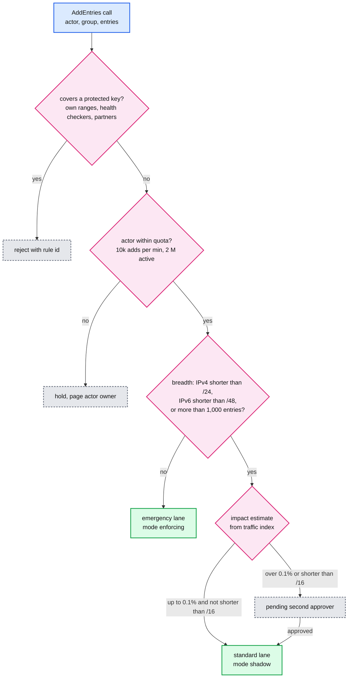
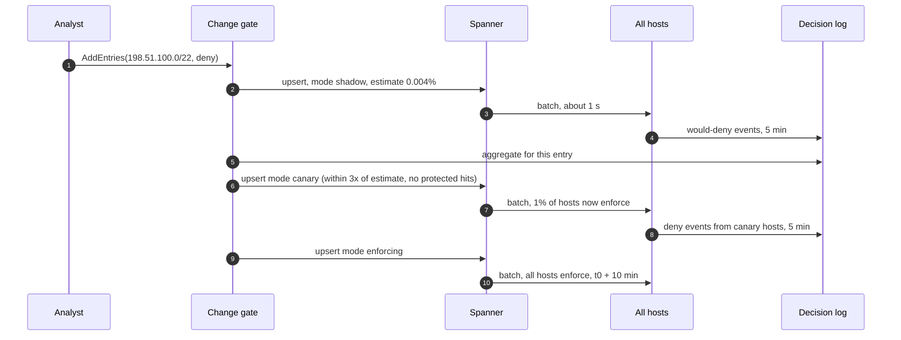
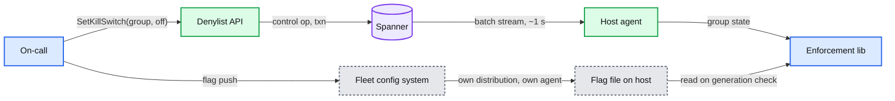

# Deep dive: safe changes and blast radius

> One-line answer: the path that makes a deny reach 200k hosts in about a second is also the path that can deny everyone in about a second, so every change is classified by **breadth** at the API (protected set, prefix length, entry count, impact estimate from a 1% traffic index, actor quota), narrow changes ship straight to `enforcing`, broad ones walk `shadow` then `canary` then `enforcing` as a field on the entry, the publisher and then every host re-validate each batch and quarantine anything that would deny a canary key, a per-group kill switch rides two independent channels, and undo is a forward revert that reaches 99% of hosts in about 2 s.

Zoom-in on [`../solution.md`](../solution.md) §5.5. Reusable blocks: [`../../../concepts/rate-limiting-and-load-shedding.md`](../../../concepts/rate-limiting-and-load-shedding.md) (quotas as token buckets), [`../../../concepts/mvcc-and-isolation.md`](../../../concepts/mvcc-and-isolation.md) (reads at a past timestamp), [`../../../concepts/stream-sketches.md`](../../../concepts/stream-sketches.md) (count tables for the traffic index). Sibling: [`failure-modes-and-fail-static.md`](failure-modes-and-fail-static.md), [`watermarks-and-consistency-window.md`](watermarks-and-consistency-window.md).

---

## 1. Four shapes of a bad change, and the layer that stops each

| Shape | Example | First layer that stops it | Backstop |
|---|---|---|---|
| Too broad | `0.0.0.0/0`, our own `10.0.0.0/8`, a /12 holding a carrier's NAT pool | Change gate: protected set rejects, breadth rules force the standard lane and a second approver | Shadow mode shows would-deny volume before any request is denied; host canary keys quarantine |
| Too many | A detector with a bad threshold adds 5 M accounts in 2 minutes | Actor quota: held at 10k adds/min, owner paged | Impact estimate on each call; deny-rate-vs-baseline page |
| Malformed | Valid signature, broken assumption: a batch past a size limit, a field the host does not expect | Publisher pre-validation with the host's own code | Every host: hard bounds, total parser, reject the batch whole and stay at `W` |
| Expensive | A rule that is valid but slow to evaluate | By construction: no regex, no wildcard. Every entry is one table probe or one interval search | Rebase time and lookup p99 are dashboards; a new key type ships behind a flag |

The order matters. The earlier layer is cheaper and more precise (it knows the actor and the intent). The later layer is dumber and assumes every earlier layer has a bug.

---

## 2. What the incidents teach, mapped to our layers

| Incident | What was pushed | How fast it spread | Why the consumer broke | Vendor's fix | Our layer that would have stopped it |
|---|---|---|---|---|---|
| Cloudflare, 2 Jul 2019 | A WAF rule with a catastrophically backtracking regex | Quicksilver, seconds to the whole network. Deployed 13:42, global WAF kill 14:07, traffic normal 14:09, 27 minutes of impact | CPU pinned at 100% by one regex | Staged rollouts of rules, a regex engine with bounded run time | No regex exists in our entry model (§1 of the table above) |
| Cloudflare, 18 Nov 2025 | A bot-management feature file, regenerated every few minutes and published to the whole network | Next refresh cycle, whole network. Core traffic down 11:20 to about 14:30 UTC, everything normal 17:06 | A permissions change doubled the rows; the file passed the 200-feature limit (about 60 in use) and the proxy's `unwrap()` panicked | Treat internal config files "like user-generated input", more kill switches | Host hard bounds reject the batch whole and keep the last good list. Publisher pre-validation rejects it first |
| Google Cloud, 12 Jun 2025 | Policy data with unintended blank fields, written to regional Spanner tables | "Replicated globally within seconds". 10:51 to 18:18 US/Pacific | New code path with no error handling and no feature flag hit a null pointer and crash-looped | Red button within 40 minutes; us-central1 about 2 h 40 min because restarts had no randomized backoff. Remediation: fail open, feature-flag critical paths | Total parser (a missing field is a rejected op, not a crash); new fields enabled by flag only after every agent understands them (§8) |
| CrowdStrike, Jul 2024 | Channel File 291 content with 21 input fields | Pushed to every sensor | The sensor supplied 20 inputs; out-of-bounds read in the kernel; 8.5 million Windows devices | Runtime bounds checks, staged deployment of template instances | Hard bounds on the host; content and code both staged by breadth |

Meta's Configerator paper found 16% of high-impact incidents over three months were configuration related. The common thread in all four rows: **the producer validated, the consumer trusted, and the push was global**. Our design breaks all three: the producer validates, the consumer re-validates, and breadth decides how global a change is on day one.

---

## 3. The change gate, step by step

Runs inside the Denylist API, in the request path of `AddEntries`. Removes skip it (a remove cannot deny anyone) and always take the emergency lane.

Details that matter out loud:
- **The protected set is data, not code.** A small group of its own (`protected`), owned by the platform team, with two-person changes. It holds our own address space, health checker ranges, the console's and on-call VPN ranges, payment and partner callback ranges, and internal service accounts. The same set is shipped to hosts as the signed canary-key list (§6), so the gate and the hosts agree on what must never be denied.
- **Coverage, not equality.** For a CIDR entry, "covers a protected key" means any protected address or range intersects it. That is a range-overlap query over a few thousand protected ranges: microseconds.
- **Breadth of an account entry.** Accounts have no prefix, so breadth is the count per call and the account's own weight: an entry for an account with more than 1 M followers, a verified business, or an enterprise tenant admin goes to the standard lane regardless of count.

---

## 4. The traffic index behind the impact estimate

**Built.** A streaming job samples 1% of successful requests at the front-ends (served, not already denied). For each sample it increments counters keyed by: IPv4 /24, IPv6 /48, account id, API key hash, all in one-minute buckets, kept for 24 h. At 50 M requests/s that is 500k samples/s. Counts per /24 and per /48 are bounded (about 16 M possible /24s, far fewer active); accounts and keys use a count-min sketch plus an exact table for the top 1 M.

**Queried.** For a /32: read its /24's count, scaled down by the fraction of that /24's samples that came from the address (the job keeps a small top-k per /24). For a range shorter than /24: sum the /24 counts it contains. A /16 is 256 reads, a /8 is 65,536 reads of an in-memory table, still milliseconds. For an account or key: one read. The estimate is `sampled count in the last hour × 100 / good requests in the last hour`, returned as a percentage with the top affected /24s or accounts.

**Honest limits.** The index is about 1 minute behind and blind to traffic that has not arrived yet (a customer who launches tomorrow). It is also blind to good traffic that is currently being denied, which is why removes are never estimated. Its job is to catch the order-of-magnitude mistake (a /12 that carries 2% of mobile traffic), not to be exact.

---

## 5. Shadow and canary: rollout as a field on the entry

**Shadow.** Every host that receives the entry evaluates it and, on a match, logs a would-deny event instead of denying: `(group, entry identity, key, host region, time)`. Sampled like real denies: every would-deny for accounts and keys, 1% for IPs, plus the first per key per minute. The gate aggregates these per entry every minute.

**Canary.** Hosts enforce the entry if `hash(host_id) mod 100 < 1`, shadow it otherwise. The hash is stable, so the same 1% of hosts are the canary for every entry, which keeps the population comparable over time and lets on-call look at one host set. Because load balancers spread users across hosts, 1% of hosts sees roughly 1% of each user's requests: a wrong deny shows up as errors for a sliver of traffic, not for a user's whole session.

**Auto-promotion.** After 5 minutes in each mode the gate compares observed would-deny (or deny) volume with the estimate. Promote if: observed is within 3x of the estimate, no protected or canary key appeared, and the 403 rate on canary hosts did not rise more than the estimate predicts. Hold otherwise and ticket the author with the numbers. A mode change is an ordinary upsert on the entry, so it propagates in about 1 s like everything else, and the stream stays identical on every host.

---

## 6. Actor quotas and host-side validation

**Quotas.** Each detector and feed has a token bucket for adds (`max_adds_per_min`, say 10k) and a cap on active entries it owns (say 2 M), stored in `ACTOR_QUOTA` and enforced in the API. Humans get a lower rate and no active cap. The one exception is the DDoS detector: it may burst to 20k adds/s, but only for narrow entries (a single IPv4 address, or IPv6 /64 or narrower) with a TTL of at most 1 hour, so its worst case is a burst of one-address denies that all expire within the hour. Past a quota the change is held, not dropped: the detector's owner sees the backlog and decides. Removes are never throttled.

**Host validation, in order.** Signature. Contiguity. Size: batch at most 16 MB, the group at most 2x its `max_entries`, key length exact per type, `prefix_len` legal. Parse: a total parser with bounded allocation, fuzzed in CI; an unknown field or a missing one rejects the op, never panics. Canary keys: after the ops are parsed, each deny op is checked against the signed canary-key list; one that would deny a canary key is **quarantined**.

**Quarantine semantics.** A quarantined op is stored in the overlay with a `quarantined` flag and included in the XOR checksum, so the host's state still matches the publisher's and contiguity continues. It is never enforced. The host reports the count on its ack; the tracker pages. A later remove of that entry clears it like any other. This is the difference from rejecting the batch: rejection stalls the host at `W` (everything after is blocked behind it), quarantine drops exactly the dangerous op and keeps the stream moving.

---

## 7. Kill switch on two channels, and forward revert

**Revert(group, actor, from_ts, to_ts).** Find the identities the actor changed in `(from_ts, to_ts]` from the change history (each `CHANGE` row needs the `actor` on it, indexed by `(actor, commit_ts)`: the `ENTRY.actor` field only holds the last writer). Then two Spanner snapshot reads of those entries, at `from_ts` and at `to_ts`. For each entry the actor touched in between: if it did not exist at `from_ts`, remove it; if it existed, restore its fields as of `from_ts`. Commit the result as one transaction with a `revert_id`, emergency lane. If a later actor changed the same entry after `to_ts`, the revert skips it and lists it for a human: never silently overwrite someone else's later change.

**Restore(group, to_time).** The diff between the group now and the group at `to_time`, committed the same way. Works for `to_time` within Spanner's version retention (up to 7 days). Beyond that, restore from the nearest snapshot file in the blob store.

**Code slow, data fast.** The agent, the library and the parser roll out over days, 1% of hosts, then a region, then the world. A new batch field is ignored by old agents and only switched on by a flag after every agent reports the version that understands it. Data takes the 1-second path. This is the split the Google Cloud and CrowdStrike reports both ask for.

---

## 8. How an interviewer attacks this

1. **"Your canary slows down blocking an attack."** Only for broad entries. A /32 or a single account ships enforcing in 1 s; the lane is chosen by breadth.
2. **"The gate has a bug."** The publisher runs the host's validation first; every host runs it again and quarantines. §10.4 of the solution walks exactly this.
3. **"The attacker is a /12."** Then the gate says 0.4% impact (or whatever the index says), needs a second approver, and shadow tells you in 5 minutes whether the estimate was right. Meanwhile edge rate limiting and XDP drop on narrower ranges hold the line.
4. **"A detector is compromised."** Quota caps it at 10k/min (the DDoS detector at 20k/s of one-address, 1-hour entries); its entries carry its actor id; `Revert(actor)` removes all of them in one change set.
5. **"The kill switch path is what broke."** Second channel. And the kill switch turns a group off, which is fail-open for that group only.
6. **"Someone removes the protected set."** Protected group changes need two people and are themselves shadowed: the gate refuses to shrink it by more than a handful of entries per day without a third approver.

---

## 9. Numbers to say out loud

- Emergency lane: /32 or /64-or-narrower, single account or key, every remove. Enforced on 99% in about 1 to 2 s.
- Standard lane: IPv4 shorter than /24, IPv6 shorter than /48, or over 1,000 entries per call. Shadow 5 min, canary 1% of hosts 5 min, then enforcing.
- Second approver: shorter than /16 or impact over 0.1% of last hour's good traffic.
- Traffic index: 1% sample, 500k samples/s, one-minute buckets, 24 h, about 1 minute behind.
- Detector quota: 10k adds/min, 2 M active. DDoS detector: 20k/s, narrow entries only, TTL at most 1 h. Removes never throttled.
- Host bounds: 16 MB per batch, group at most 2x `max_entries`. Quarantine keeps the checksum and the stream moving.
- Revert: one change set, about 2 s to 99%. Restore to any time within 7 days by Spanner timestamp read.
- Incidents: Cloudflare 2019, 27 minutes; Cloudflare 2025, 11:20 to about 14:30 UTC; Google Cloud 2025, 40 minutes to red button, about 2 h 40 min in us-central1; CrowdStrike 2024, 8.5 million devices. Configerator: 16% of high-impact incidents config related.
