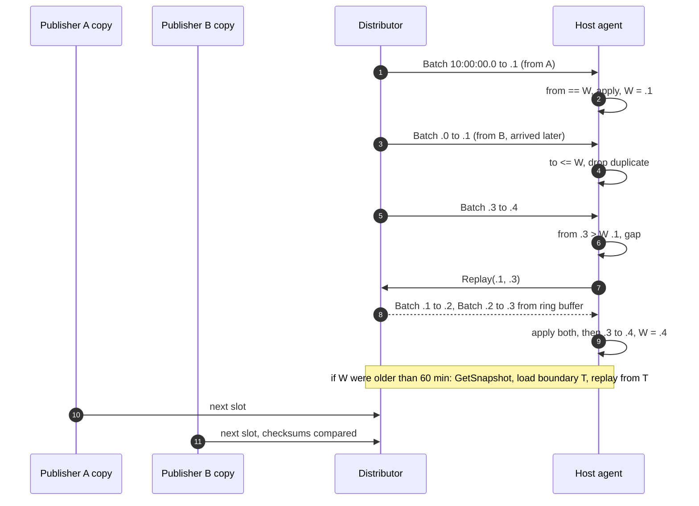
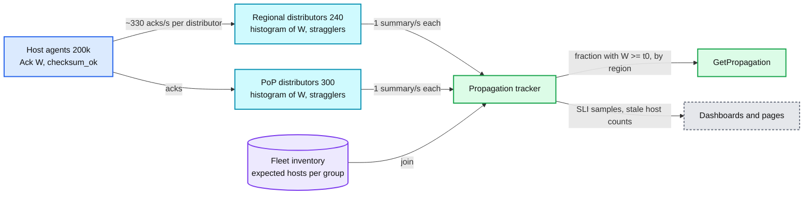
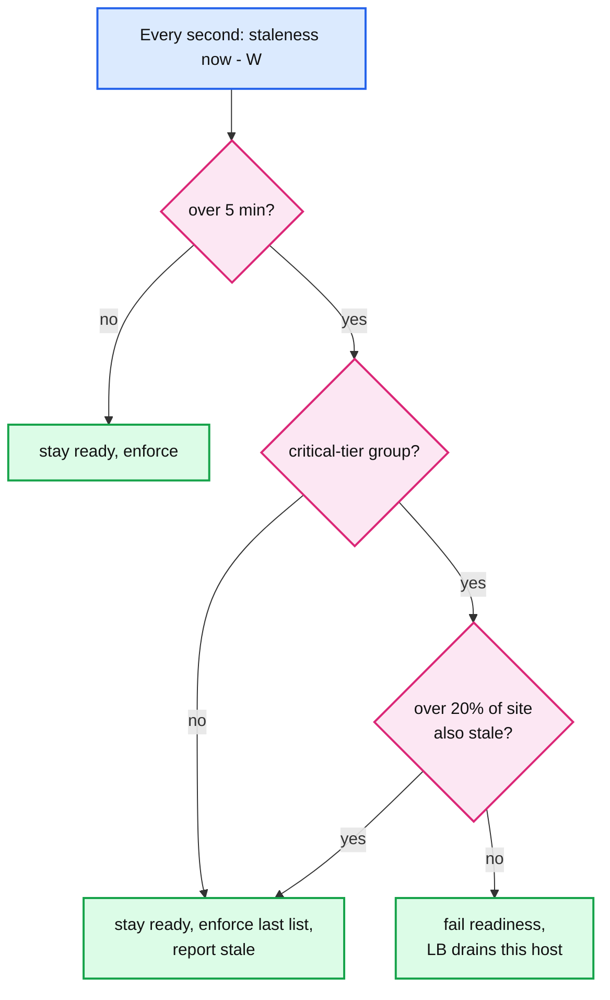

# Deep dive: watermarks and the consistency window

> One-line answer: a host's watermark `W` is the commit timestamp of the last batch it applied, so one number is both its version and its staleness (`now - W`). Heartbeat batches keep `W` moving when nothing changes, so silence means "cut off". A contiguity rule (`apply only if from == W`) gives each host a consistent prefix of the change log. An XOR state checksum in every batch catches a host that has the right `W` and the wrong list. Acks summarised at each distributor answer "how many hosts enforce commit t0" in about 1 s with 540 messages a second. A stale host keeps enforcing (fail-static). It is drained only when its staleness is its own problem, never when a whole site shares it.

Reusable blocks: [`../../../concepts/stream-processing.md`](../../../concepts/stream-processing.md) (watermarks in stream processing, the same idea), [`../../../concepts/etcd.md`](../../../concepts/etcd.md) (revisions, watch, compaction), [`../../../concepts/merkle-tree.md`](../../../concepts/merkle-tree.md) (what to use when a checksum mismatch must also say where), [`../../../popular_systems_deepdive/envoy/envoy-06-xds-control-plane.md`](../../../popular_systems_deepdive/envoy/envoy-06-xds-control-plane.md) (ACK and NACK of pushed config). Solution context: [`../solution.md`](../solution.md) §5.3. Sibling: [`propagation-and-fan-out.md`](propagation-and-fan-out.md) covers how batches get to the host.

---

## 1. One number for version and staleness

`W` for a host and a group means: every change committed at or before `W` is enforced here, and nothing committed after `W` is. It is a Spanner commit timestamp, so:

- **It orders.** Two hosts compare `W` directly. A change with commit timestamp `t0` is enforced on a host exactly when `W >= t0`.
- **It measures.** `now - W` is the host's staleness in seconds. A Kafka offset or an etcd revision orders just as well, but "offset 8,812,331" says nothing about time; you would need a second mapping from offset to time to page on "30 s behind". The commit timestamp is both.
- **It is complete.** The publisher cuts `(a, b]` by reading at timestamp `b`, and that read sees every commit at or before `b`. So `W = b` is a promise, not an estimate. Spanner change streams make the same promise with heartbeat records: a heartbeat at time `t` means every change at or before `t` has been returned for that partition, and the reader chooses the interval between 1 s and 5 minutes.

Normal staleness is about 0.6 to 1.5 s: the 500 ms closed-timestamp lag, up to 100 ms of grid, the tree, and up to 1 s of heartbeat spacing.

---

## 2. Heartbeats: telling "quiet" from "cut off"

The publisher emits one batch per 100 ms slot, empty or not. Distributors forward non-empty batches at once and coalesce runs of empty slots into one heartbeat batch per subscriber per second: `(W, latest]`, no ops, the unchanged checksum. So `W` advances at least once a second while the host is connected.

A host that sees nothing for 3 s (three missed heartbeats) reconnects to another distributor with `from = W`. Compare etcd: its watch progress notification, the same idea, is sent every 10 minutes by default. That is fine for a control plane that rarely changes and far too slow to page on.

---

## 3. The contiguity rule, every case

| Incoming batch vs `W` | Meaning | Action |
|---|---|---|
| `to <= W` | Duplicate: the other publisher's copy, or a replay after reconnect | Drop |
| `from == W` | Next in sequence | Validate, apply, check checksum, set `W = to`, ack |
| `from > W` | Gap: something between `W` and `from` never arrived | Ask the distributor for `(W, from]` from its 60-minute buffer. If it is older than that, load the latest snapshot `T` and replay from `T` |
| `from < W < to` | Overlap. Cannot happen on the fixed grid with per-subscriber coalescing | Protocol error: drop the stream, reconnect with `from = W` |
| bad signature | Tampered or corrupted | Reject, stay at `W`, reconnect elsewhere, alert |

This is the same shape as a Kubernetes watch. A client watches from a resource version. If that version has been compacted away, the watch fails with 410 Gone and the client lists everything again, then watches from the new version. etcd itself compacts nothing by default (`auto-compaction-retention` is `0`); the Kubernetes API server asks it to compact every 5 minutes. Our "compaction horizon" is the distributor's 60-minute buffer, and our "list" is the snapshot.



---

## 4. The XOR state checksum

**What is hashed.** For every stored entry, `h = H128(canonical bytes of group, key_type, key, prefix_len, action, mode, scope, expires_at)`. `C` is the XOR of `h` over all stored entries. `mode` is in the hash, so promoting an entry from `shadow` to `enforcing` changes `C`. Quarantine is not in the hash: it is a host-local decision about a stored entry, so a host that quarantines still agrees with the publisher on what is stored.

**How each event changes it.**
- Upsert of a new entry: `C ^= h(new)`.
- Upsert of an existing entry: `C ^= h(old) ^ h(new)`.
- Remove: `C ^= h(old)`.
- Expiry purge at snapshot boundary `T`: for every entry with `expires_at <= T`, `C ^= h(entry)`. The publisher and every host purge at the same `T`, because `T` is on the 10-minute grid, not read from a clock. The batch ending at `T` carries the post-purge `C`, which equals the snapshot builder's checksum for `T`.

**Why order independence matters.** `C` is a function of the set of stored entries, nothing else. So the snapshot builder can compute it from an unordered scan; a rebase can merge base and overlay in any order; and a host that reached the state by "snapshot at 10:00 plus replay" and one that reached it by "an hour of replay" hold the same `C`. Each op costs O(1), so checking it after every batch is free.

**Odds of missing a real divergence.** A random corruption leaves a 128-bit XOR unchanged with probability `2^-128 ≈ 3 × 10^-39`. The fleet checks `200k hosts × 10 batches/s × 86,400 s = 1.7 × 10^11` times a day. Expected misses: about `5 × 10^-28` per day.

**The one trap.** XOR is linear, so a bug that XORs the same record in twice makes it cancel and look absent. A bug inside the incremental code can hide itself. The fix is cheap: at every rebase the agent recomputes `C` from scratch over the new base (it is already touching every entry for 1 to 2 s) and compares it with the incremental value and the snapshot's. A sum modulo `2^128` instead of XOR avoids the cancellation too, at the same cost. Either way, the from-scratch recompute is what makes the incremental one trustworthy.

**It is not a security control.** The hash is unkeyed, so anyone who can alter a batch can recompute a matching `C`. Integrity against an attacker comes from the publisher's Ed25519 signature over the whole batch, `C` included. The checksum catches bugs; the signature catches people.

**Prior art.** Google Safe Browsing v4 clients compute SHA-256 over their lexicographically sorted local list after every update and compare it with the server's checksum. On mismatch they clear the list and request a full update. That is O(n) per update and fine for a browser. Ours is O(1) per op, with the O(n) paid once per rebase. If a mismatch must also say where the lists differ (to repair without a full snapshot), use a Merkle tree over key ranges instead: `log n` hash comparisons find the differing range.

---

## 5. Acks, summarised on the way up

- **Host to distributor.** `Ack(group, W, checksum_ok, quarantined)` on the existing stream, at most once a second. `200k` acks/s fleet-wide, about 330 per distributor per second.
- **Distributor summary.** Per group, a histogram of its own hosts' `W` in 100 ms buckets for the last 60 s and coarse buckets beyond (about 600 buckets, ~5 KB). Plus a list of stragglers: hosts older than 30 s, with `W` and `checksum_ok`. Regional and PoP distributors each report only their own directly attached hosts, so nothing is counted twice.
- **Distributor to tracker.** One summary per second: `540` messages/s, about 2.7 MB/s in total.
- **Expected set.** The tracker joins with the fleet inventory: every host in a serving state whose role subscribes to the group. A host that appears in no distributor's summary for 10 s is "unreporting" and counts as stale. Absence is never success.



---

## 6. The propagation SLI and `GetPropagation`

- **`GetPropagation(group, t0)`** sums, over all distributors' latest summaries, the hosts with `W >= t0`, and divides by the expected set. Per region too. It lags reality by about 1 s (one summary interval).
- **Freshness SLI.** For every emergency-lane commit and one sampled commit per minute otherwise, record `t99`: the first time the fraction reaches 99%. SLO: 99% of sampled commits have `t99 - t0 <= 10 s` over 28 days.
- **Staleness SLI.** Per host-minute, is `now - W < 30 s`? SLO: 99.9% of host-minutes.
- Two SLIs, because they fail differently. A slow publisher hurts every commit's `t99` but no host looks stale for long. One wedged rack hurts the staleness SLI and barely moves `t99`, since 99% is still reached.

---

## 7. What a stale host does, and the panic threshold

| Staleness `now - W` | Host behaviour | Alert |
|---|---|---|
| under 30 s | normal | none |
| 30 s to 5 min | keep enforcing the last good list; report stale | page if over 1% of a region's hosts for 2 minutes |
| over 5 min, group tier `critical` | fail readiness so the load balancer drains it, unless over 20% of the site is also stale | page |
| booting | not ready until loaded and within 30 s of the distributor's head (or its local-disk copy under the rules in [`failure-modes-and-fail-static.md`](failure-modes-and-fail-static.md)) | |

**Worked example: both publishers down.** Spanner has an outage at 10:00:00. No batches, no heartbeats. At 10:00:30 every host in the fleet crosses 30 s and the page fires. At 10:05:00 every host is 5 minutes stale on the critical revoked-credentials group. Without a threshold, every host fails readiness at once, the load balancers drain the entire fleet, and a store outage has become a global outage caused by the safety rule. With the threshold, each site sees 100% of its hosts stale, far above 20%, so nobody drains and every host serves a 5-minute-old list, which is almost exactly the current list.

**Same rule, one wedged agent.** One host's agent hangs. Its site has 5,000 hosts, so it is 0.02% of the site, below 20%. It is drained, its traffic moves to fresh neighbours, and the rule does exactly what it is for.

The idea is Envoy's load-balancer panic threshold (default 50%): when too many endpoints look unhealthy, the health signal is probably wrong, so ignore it. We use 20% of a site, lower than Envoy's 50%, because draining a fifth of a site is already a capacity event.



---

## 8. The consistency model, precisely

- **Store:** linearizable. Every change has a commit timestamp consistent with real-time order.
- **One host:** a consistent prefix of the change log. It may be behind, but it never has change `n + 1` without change `n` and never goes backwards. Every lookup sees the state exactly as of some `W`, never half a batch, because readers switch overlay copies only after the whole batch is applied ([`local-lookup-and-memory-layout.md`](local-lookup-and-memory-layout.md)).
- **Across hosts:** eventual, p99 within 10 s, alerted at 30 s. Two hosts can disagree for that long, and a user retrying against another front-end can see either answer.
- **Across groups:** no ordering. Each group has its own watermark. The publisher cuts all groups on the same grid, so their watermarks are usually equal, but nothing guarantees it. If "ban the account and revoke its keys" must land together, put both in one group.
- **The writer:** read-your-writes against the store (`Lookup`), and a measured fraction against the fleet (`GetPropagation`). Never "every host at the same instant", which would need a commit that waits on 200k hosts.

---

## 9. A runnable sketch of the apply loop

Contiguity plus the incremental checksum, 56 lines. Run with `python3`. The five calls print `applied`, `duplicate`, `gap: need 100..200`, `applied` (the heartbeat that fills the gap) and `applied, checksum MISMATCH`. The host ends at `W = 300` with `checksum_ok = False`, still serving.

```python
import hashlib

def h128(identity, fields):
    d = hashlib.blake2b(repr((identity, fields)).encode(), digest_size=16).digest()
    return int.from_bytes(d, "big")

class Agent:
    def __init__(self, snapshot, boundary_ts, checksum):
        self.state = dict(snapshot)          # identity -> fields
        self.W = boundary_ts                 # watermark: commit ts covered
        self.C = 0
        for k, v in self.state.items():
            self.C ^= h128(k, v)
        assert self.C == checksum, "snapshot checksum mismatch"
        self.checksum_ok = True

    def on_batch(self, frm, to, ops, checksum):
        if to <= self.W:
            return "duplicate"               # second publisher or replay
        if frm != self.W:
            return f"gap: need {self.W}..{frm}"  # ask distributor, else snapshot
        for op, ident, fields in ops:        # ops sorted by (commit_ts, identity)
            old = self.state.pop(ident, None)
            if old is not None:
                self.C ^= h128(ident, old)   # XOR out the old record
            if op == "upsert":
                self.state[ident] = fields
                self.C ^= h128(ident, fields)  # XOR in the new record
        self.W = to                          # advance even on mismatch
        if self.C != checksum:
            self.checksum_ok = False         # keep enforcing, resync at next snapshot
            return "applied, checksum MISMATCH"
        return "applied"

def publisher_checksum(state):
    c = 0
    for k, v in state.items():
        c ^= h128(k, v)
    return c

if __name__ == "__main__":
    base = {("ip", "203.0.113.7"): (3600, "drop")}
    a = Agent(base, 0, publisher_checksum(base))
    pub = dict(base)
    b1 = [("upsert", ("acct", 12345), (7200, "deny")), ("remove", ("ip", "203.0.113.7"), None)]
    for op, k, f in b1:
        pub.pop(k, None)
        if op == "upsert":
            pub[k] = f
    c1 = publisher_checksum(pub)
    print(a.on_batch(0, 100, b1, c1))            # applied
    print(a.on_batch(0, 100, b1, c1))            # duplicate
    print(a.on_batch(200, 300, [], c1))          # gap: need 100..200
    print(a.on_batch(100, 200, [], c1))          # applied (heartbeat)
    print(a.on_batch(200, 300, [("upsert", ("acct", 9), (60, "deny"))], c1))  # mismatch: publisher state differs
    print("W =", a.W, "checksum_ok =", a.checksum_ok)
```

---

## 10. Numbers to say out loud

- Normal staleness 0.6 to 1.5 s. Heartbeat 1 s, reconnect after 3 s of silence.
- Contiguity: apply only if `from == W`. Gap repair from a 60-minute buffer, else snapshot plus replay.
- Checksum: 128-bit XOR, O(1) per op, recomputed from scratch at each 10-minute rebase. Miss odds `2^-128`; about `5 × 10^-28` expected misses per day fleet-wide.
- Acks: 200k/s host to distributor, 540 summaries/s distributor to tracker, ~5 KB each. `GetPropagation` about 1 s behind.
- SLOs: 99% of sampled commits on 99% of hosts within 10 s; 99.9% of host-minutes under 30 s stale.
- Stale policy: 30 s report and page at 1% of a region; 5 min drains critical-tier hosts only below a 20% site panic threshold (Envoy's default is 50%).
- Kubernetes analogy: etcd compacts nothing by default, the API server compacts every 5 minutes, a compacted watch returns 410 Gone and the client relists.
