# Diagrams: distributed deny list

The D1 to D12 set from `hld/CLAUDE.md` §4. Diagrams already embedded in [`solution.md`](solution.md) are listed with a pointer, not pasted twice.

| # | Diagram | Where |
|---|---|---|
| D1 | Context | below |
| D2 | Data flow | below |
| D3 | Component architecture (final design) | `solution.md` §6 |
| D4 | Happy path per FR | FR1 check: §6 Flow 1. FR2 + FR3 emergency add and propagation: §6 Flow 2. Host boot: §6 Flow 4. FR4 explain and revert: below |
| D5 | Failure paths | Distributor death: §5.4. Spanner region loss: §10.4. Bad batch: §10.4. Gap older than the buffer: below. Truncated feed: below |
| D6 | Decision flow (host agent, per batch) | `solution.md` §5.3 |
| D7 | Entity relationship | `solution.md` §3.3 |
| D8 | State machines | Entry lifecycle: §5.5. Host readiness lifecycle: below |
| D9 | Deployment / topology | below |
| D10 | Scaling / partitioning | below |
| D11 | Failure mode map | below |
| D12 | Rollout / migration | below |

---

## D1. Context (zoom-out)

The deny list as one box: writers on the left, 200k enforcement hosts on the right, one store as the truth.

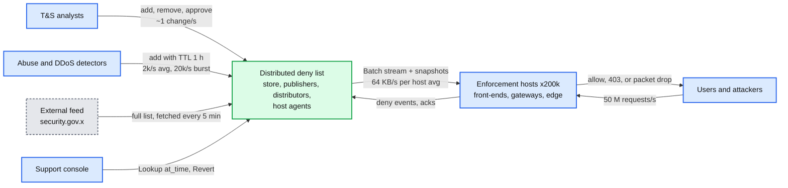

## D2. Data flow (DFD)

What moves where, with format, size and rate. Deltas dominate the steady state; snapshots dominate boots.

```mermaid
%% D2: data flow with sizes and rates. Stores are cylinders, processes are rounded boxes.
flowchart LR
    W(Writers) -->|"AddEntries, protobuf ~200 B/entry,<br/>2k/s avg, 20k/s burst"| API(Denylist API + gate)
    API -->|"impact query per broad entry, ~ms"| TI[(Traffic index<br/>1% sample, 500k samples/s in)]
    API -->|"ENTRY upsert + CHANGE row,<br/>~500 B + 200 B, 2k txn/s"| SP[(Spanner<br/>5 GB live, 35 GB/day CHANGE)]
    SP -->|"CHANGE rows a..b, 16 range reads,<br/>10 times/s"| PUB(Publishers x2)
    SP -->|"snapshot read at T,<br/>~400 MB every 10 min"| SB(Snapshot builder)
    SB -->|"signed file, ~100 MB zstd"| BL[(Blob store)]
    PUB -->|"Batch, 32 B/op, 2k ops/s avg,<br/>20k burst, signed"| DS(Distributors x540)
    DS -->|"Batch + 1 s heartbeat,<br/>64 KB/s avg, 640 KB/s burst per host"| AG(Host agent)
    BL -->|"snapshot ~100 MB, only at boot<br/>without a local copy"| AG
    AG -->|"shared memory, 255 MB per host"| LIB(Enforcement lib)
    LIB -->|"deny events: all account/key,<br/>1% of IP, ~50k/s"| DLG[(Decision log)]
    AG -->|"Ack W, at most 1/s"| DS
    DS -->|"watermark histograms, 540/s"| TR(Propagation tracker)

    class W client
    class API,PUB,SB,AG,TR service
    class TI,SP,BL,DLG store
    class DS queue
    class LIB client

    classDef client   fill:#dbeafe,stroke:#2563eb,stroke-width:2px,color:#111
    classDef service  fill:#dcfce7,stroke:#16a34a,stroke-width:2px,color:#111
    classDef store    fill:#ede9fe,stroke:#7c3aed,stroke-width:2px,color:#111
    classDef queue    fill:#cffafe,stroke:#0891b2,stroke-width:2px,color:#111
```

## D3. Component architecture

The final design, with the publisher pair in red. See `solution.md` §6.

## D4. Happy path: FR4 explain and revert

A wrongly blocked customer is explained from a timestamped read and unblocked by a forward revert in about 2 s.

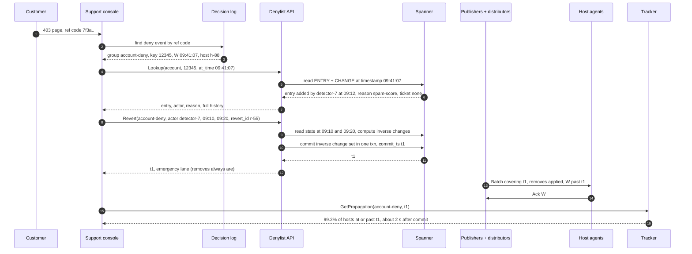

## D5. Failure paths

### D5a. A host's gap is older than the distributor's 60 minute buffer

The host cannot replay, so it rebuilds from the latest snapshot and replays from that boundary. It keeps enforcing throughout.

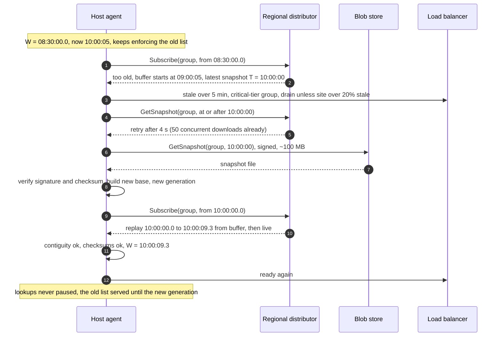

### D5b. The external feed comes back truncated

A partial download must not unblock the whole government list.

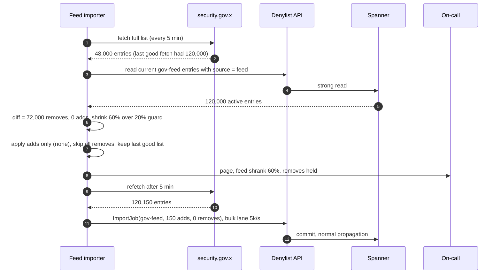

## D6. Decision flow

The host agent's per-batch decision (signature, duplicate, gap, bounds, canary keys, checksum). See `solution.md` §5.3.

## D7. Entity relationship

GROUP, ENTRY, CHANGE, APPROVAL, ACTOR_QUOTA, SNAPSHOT, HOST_STATE. See `solution.md` §3.3.

## D8. State machines

The entry lifecycle (shadow, canary, enforcing) is in `solution.md` §5.5. Below: the host's readiness lifecycle.

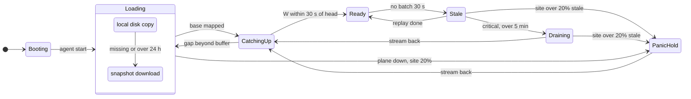

State meanings: `Ready` serves traffic with a fresh list. `Stale` serves traffic with the last good list (fail-static). `Draining` fails readiness so the load balancer moves traffic away. `PanicHold` serves traffic with whatever the host has, because draining a fifth of the site for the same upstream cause would remove capacity, not risk.

## D9. Deployment / topology

Where each piece runs. Only Spanner replication, the batch stream, snapshot downloads and ack histograms cross a region boundary.

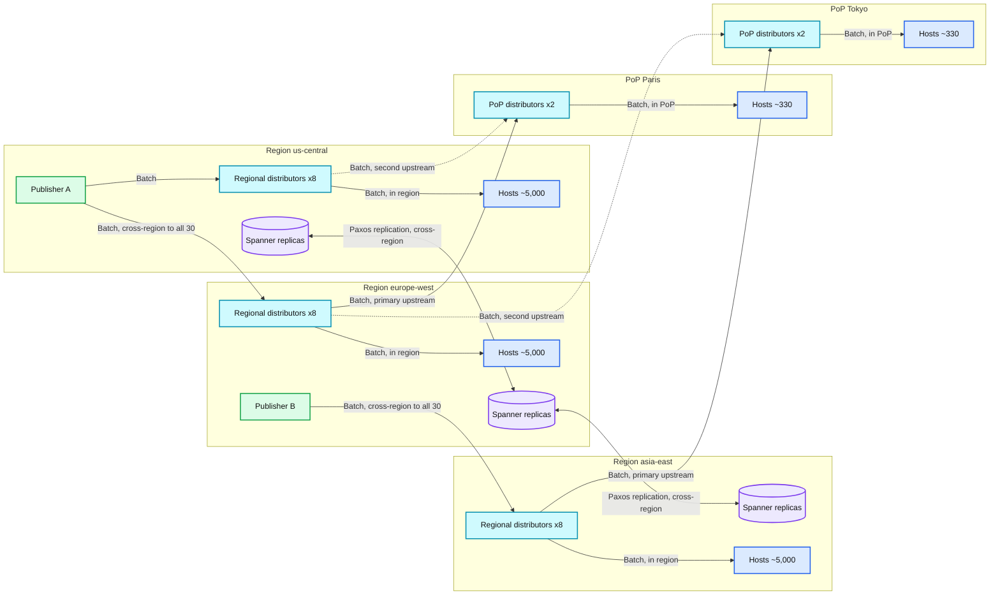

What crosses a region boundary: Spanner's own replication; publisher to regional distributor batch streams (each distributor subscribes to both publishers, so both A and B reach every region; two edges are drawn for readability); PoP distributors' upstream streams (two regions each); snapshot downloads from the multi-region blob store when a host has no local copy; and ack histograms to the tracker. Requests and lookups never cross a region boundary.

## D10. Scaling / partitioning

The unit of ordering is the group. Hosts subscribe by role. The regional distributor during a mass boot is what saturates first.

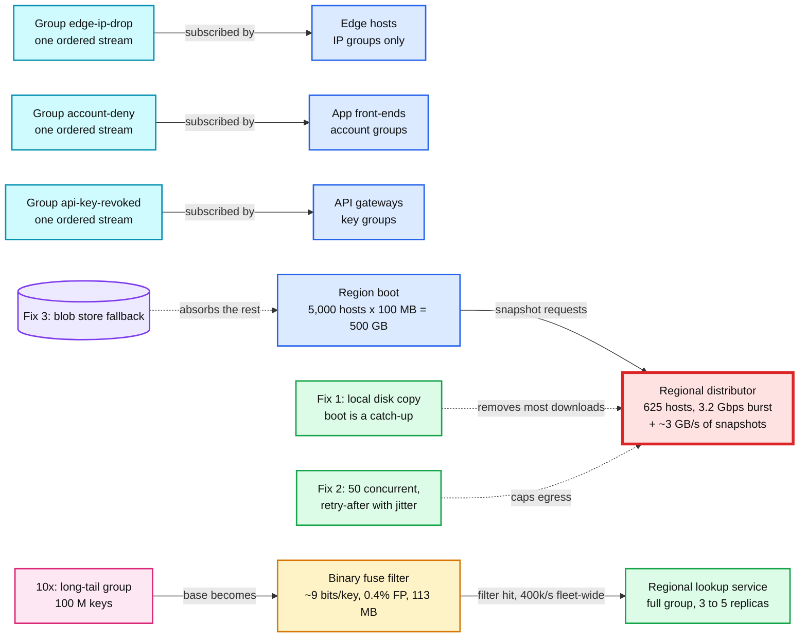

Attack-driven groups (DDoS IPs) never take the filter path: under attack their positives are the traffic, and a remote confirm would reflect the attack into the lookup service.

## D11. Failure mode map

Component, what fails, blast radius, mitigation. Split in two to stay under 15 nodes each.

### D11a. Distribution plane

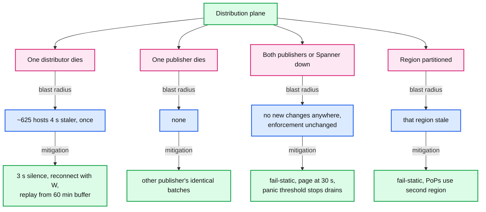

### D11b. Data, hosts and code

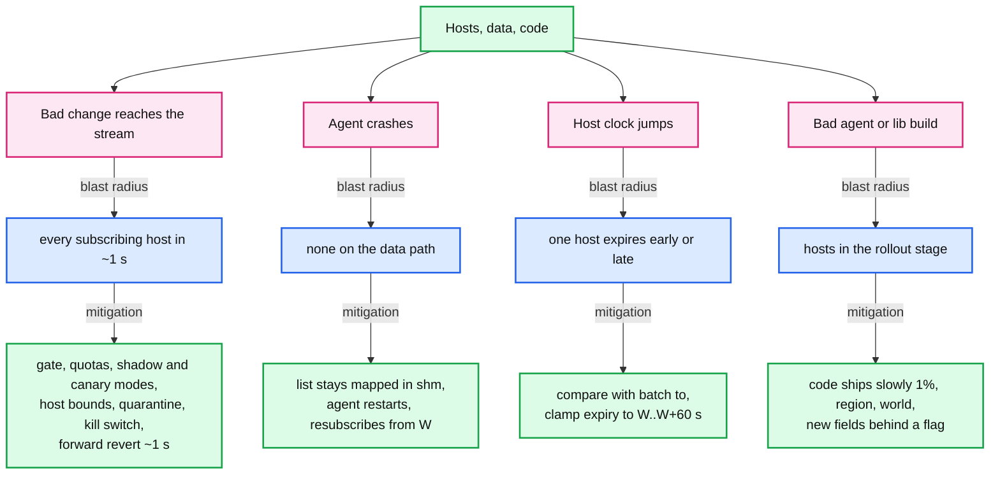

## D12. Rollout / migration

From per-service blocklists or a central Redis to this design, in four flag-guarded phases (`solution.md` §8). Each phase has a rollback point that is one flag.

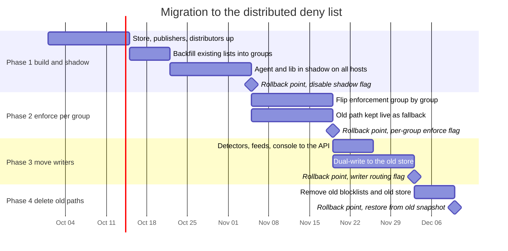
