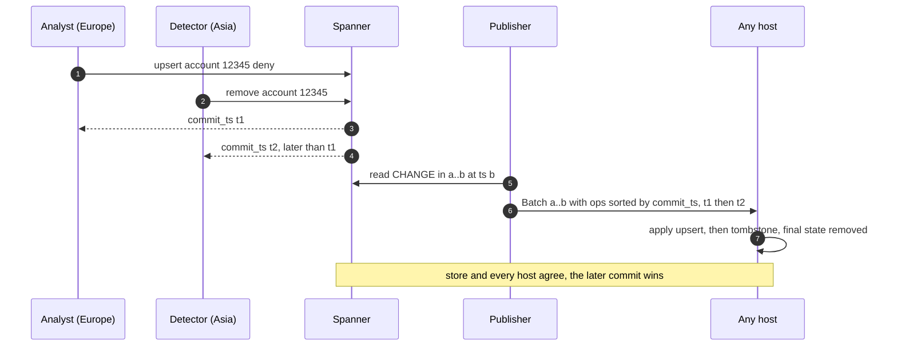
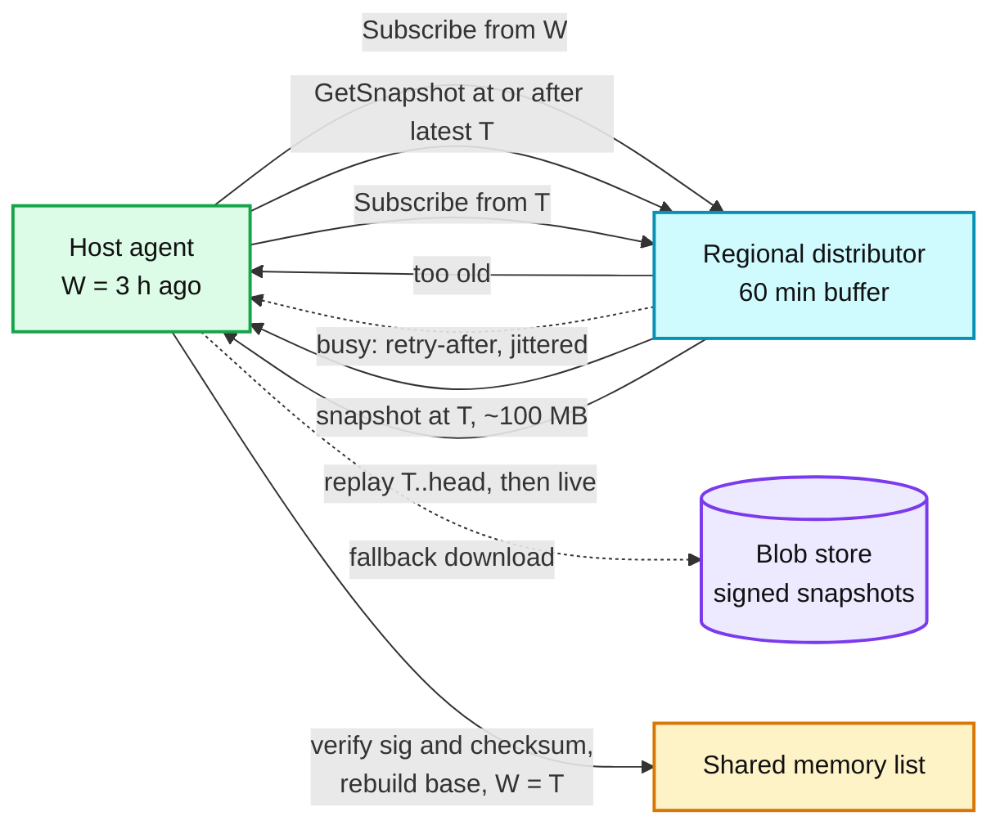
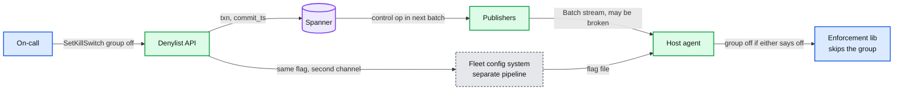

# Edge cases: distributed deny list

Every entry answerable in under 60 seconds out loud. Categories: failure, consistency, scale, data, operations, security. Design reference: [`solution.md`](solution.md).

---

## Failure

## Edge case: one regional distributor dies mid-burst
- **Trigger:** process crash, host failure, or a bad distributor build on one of the 8 regional distributors in a region.
- **Symptom:** about 625 host agents stop receiving batches and heartbeats. On-call sees their staleness jump to about 4 s on the heat map, then recover. Users see nothing.
- **Answer:**
  - Heartbeats come every 1 s. After 3 s of silence the agent reconnects to another distributor in the same site with `Subscribe(group, from = W)`.
  - The new distributor replays `(W, head]` from its 60-minute buffer. Contiguity (`batch.from == W`) decides what is applied, so nothing is lost and nothing is applied twice.
  - Enforcement never pauses. The shared-memory list stays mapped the whole time.
  - Blast radius: those hosts are about 4 s staler, once. This is the failover the 10 s p99 budget was sized for (3 s detect, 1 s replay).
- **Diagram:** `solution.md` §5.4 (D5 sequence).
- **Confidence:** [ ] shaky  [ ] ok  [ ] confident

## Edge case: both publishers, or Spanner, are unavailable
- **Trigger:** a bad publisher build deployed to both, a Spanner outage, or an IAM change that blocks the publishers' reads.
- **Symptom:** heartbeats stop fleet-wide. Every host's `now - W` climbs together. Publisher lag and regional staleness both page at 30 s. Deny decisions do not change.
- **Answer:**
  - Fail-static: every host keeps enforcing its last good list. No change reaches anyone, including removes.
  - The critical-tier drain rule (stale over 5 min) does not fire, because more than 20% of every site is stale. That is the panic threshold doing its job: the cause is upstream, so draining would only remove capacity.
  - Spanner multi-region survives one region's loss; writes resume and the publishers catch up from their last `b`. A bad publisher build is rolled back; the batch for `(a, b]` is a pure function of the store, so the recovered publisher emits exactly what it would have.
  - Urgent unblocks during the outage use the per-group kill switch on the second channel (the fleet config system), which does not go through the publishers.
- **Confidence:** [ ] shaky  [ ] ok  [ ] confident

## Edge case: a region is partitioned from the rest of the fleet
- **Trigger:** backbone cut, BGP mistake, or a regional network incident.
- **Symptom:** the region's regional distributors receive nothing. Its hosts go stale together. Edge PoPs homed on that region lose their upstream too.
- **Answer:**
  - Hosts in the region fail static and keep enforcing. More than 20% of each site is stale, so nobody drains.
  - PoP distributors subscribe to two regional distributors in two regions, so PoPs fail over and stay fresh.
  - When the link returns, regional distributors resubscribe to the publishers with their watermark and replay. Hosts replay from their distributor, or take a snapshot if the partition outlasted the 60-minute buffer.
  - Writers inside the partitioned region cannot commit (Spanner needs a quorum). That is the correct trade: a write that cannot be ordered cannot be propagated.
- **Confidence:** [ ] shaky  [ ] ok  [ ] confident

## Edge case: the host agent crashes or is upgraded
- **Trigger:** agent bug, OOM kill, or a routine agent binary rollout.
- **Symptom:** the agent process is gone for a few seconds. The proxy workers notice nothing.
- **Answer:**
  - The list lives in shared memory and on tmpfs, not inside the agent. Proxies keep mapping the last base and the last active overlay copy.
  - The restarted agent reads `W`, the checksum and the generation from the shared header, takes the writer file lock, and resubscribes from `W`.
  - For an upgrade, the new binary opens the same shared memory, takes the writer lock, and the old one exits. Quicksilver chose LMDB for the same property: many processes read one store while it is upgraded underneath them.
  - Blast radius: that host is a few seconds staler. Nothing on the data path.
- **Confidence:** [ ] shaky  [ ] ok  [ ] confident

## Edge case: a host boots and no distributor is reachable
- **Trigger:** a new host comes up during a distribution-plane outage, or its site's distributors are down.
- **Symptom:** `Subscribe` fails. The host is not ready, so the load balancer does not send it traffic.
- **Answer:**
  - First choice is the local-disk copy written at every rebase: if it is under 24 h old, verify its signature and checksum, map it, mark the host stale, and go ready.
  - No usable local copy: download the snapshot from the blob store directly. Still nothing: stay unready.
  - Exception: if more than 20% of the site is in the same state, the panic threshold lets hosts go ready with whatever they have. New capacity that is slightly stale beats no capacity.
  - Never fail closed. A host that denies everything because it has no list is an outage we built ourselves.
- **Diagram:** `solution.md` §6 Flow 4.
- **Confidence:** [ ] shaky  [ ] ok  [ ] confident

## Edge case: the whole fleet restarts at once
- **Trigger:** a kernel patch pushed too fast, a data-center power event, or a mass reboot to recover from a bad host image.
- **Symptom:** up to 200k boots in minutes. Snapshot download requests pile up on regional distributors.
- **Answer:**
  - Most hosts boot from their own local-disk copy and only replay minutes of batches from the 60-minute buffer. That turns a 20 TB download (200k × 100 MB) into a catch-up.
  - Hosts without a usable copy download with admission control: at most 50 concurrent snapshot downloads per distributor, the rest get a jittered retry-after, then fall back to the blob store.
  - The regional distributor is the component closest to its limit here (3.2 Gbps of burst stream plus up to 50 × 100 MB of snapshots). Local-disk boot is what keeps it under.
  - A bad agent build does not cause this: the list survives agent restarts, so rolling an agent back is not a host reboot.
- **Confidence:** [ ] shaky  [ ] ok  [ ] confident

---

## Consistency

## Edge case: an add in Europe and a remove in Asia race on the same key
- **Trigger:** an analyst in Europe denies an account while a detector in Asia removes it (an appeal auto-approved), within the same second.
- **Symptom:** two writers each got a `commit_ts` back. Which one wins?
- **Answer:**
  - Spanner orders the two transactions and gives them two commit timestamps consistent with real time. The later commit is the final state in the store.
  - Every host applies changes in commit timestamp order, in contiguous batches. So every host ends in the same state as the store. No CRDT, no last-writer-wins on wall clocks.
  - During the window, a host may enforce the first change for up to its staleness (about 1 s typical). Then it converges.
  - If the order matters to a human, `Lookup` shows both changes with timestamps and actors.
- **Diagram:**

- **Confidence:** [ ] shaky  [ ] ok  [ ] confident

## Edge case: an unblock arrives while a host is behind
- **Trigger:** support removes a wrongly denied customer. One host is 40 s stale because its distributor stream stalled.
- **Symptom:** the customer is allowed on most hosts within about 1 s but still denied on requests that land on the stale host.
- **Answer:**
  - Removes always take the emergency lane and the same path as adds, so on healthy hosts the unblock lands in about 1 s, 99% within 10 s.
  - The stale host shows up on the staleness heat map at 30 s. After 3 s of silence its agent should already have reconnected; a stream that sends heartbeats but no progress is caught by the distributor's per-subscriber send queue (30 s), which disconnects it so it replays.
  - When it replays, the remove is in the contiguous prefix, so it cannot be skipped.
  - If the customer needs certainty now, `GetPropagation(group, commit_ts)` shows the fraction of hosts at or past the remove, by region.
- **Confidence:** [ ] shaky  [ ] ok  [ ] confident

## Edge case: the second publisher's copy of a batch arrives
- **Trigger:** normal operation. Two publishers emit the same `(from, to)` batch; a distributor also replays after reconnect.
- **Symptom:** duplicate batches on the wire.
- **Answer:**
  - The distributor keeps the first copy of each `(from, to)` and compares the second copy's checksum. Equal: drop it. Different: page, because the batch is supposed to be a pure function of Spanner's state at `b`, so a mismatch is a publisher bug.
  - Hosts drop any batch with `to <= W`. Contiguity is the dedup, so a replay after reconnect is harmless.
  - The duplicate is a feature: it is a free cross-check between two independent publishers and it removes the need for a leader election.
- **Confidence:** [ ] shaky  [ ] ok  [ ] confident

## Edge case: a host's gap is older than the distributor's 60-minute buffer
- **Trigger:** a host was powered off for 3 hours, or partitioned longer than the buffer holds.
- **Symptom:** on `Subscribe(from = W)` the distributor answers "too old". The host is stale and not ready.
- **Answer:**
  - The agent loads the latest snapshot (boundary `T`, every 10 minutes) from its distributor's cache, or the blob store. It verifies the signature and the snapshot checksum.
  - It rebuilds the base at `T`, sets `W = T`, and replays `(T, head]` from the distributor, which it has because `T` is at most 10 minutes old.
  - This is the Kubernetes move when a watch's resource version was compacted: relist, then watch.
  - Distributors cap the buffer at 2 GB, so a long burst shortens the window below 60 minutes. The snapshot path covers that too.
- **Diagram:**

- **Confidence:** [ ] shaky  [ ] ok  [ ] confident

## Edge case: a host's list silently diverges from the fleet
- **Trigger:** a rebase bug, a bit flip in RAM, a parser edge case that skips one op. Watermarks all look correct.
- **Symptom:** the host denies or allows something no other host does. Without a check, nobody would ever know.
- **Answer:**
  - Every batch carries `C`, the XOR of a 128-bit hash of every stored entry after applying it. The host keeps the same `C` incrementally (O(1) per op) and compares.
  - Mismatch: keep enforcing (never drop protection because of a checksum), set `checksum_ok = false`, report it on the ack, and resync from the next snapshot. Every rebase also checks against the snapshot's checksum.
  - Checksum mismatch on more than 0.1% of hosts pages: that is an apply bug in the agent, not a bad host.
  - Safe Browsing v4 clients do the same with SHA-256 over the sorted local list, and re-download on mismatch.
- **Confidence:** [ ] shaky  [ ] ok  [ ] confident

## Edge case: a host's clock jumps
- **Trigger:** a broken NTP source, a VM migration, a hardware clock fault. The clock is 2 h behind or 2 h ahead.
- **Symptom:** behind: entries that should have expired keep denying. Ahead: entries expire early and attackers get through.
- **Answer:**
  - `expires_at` is checked against the host clock on every lookup, so the clock matters.
  - The agent compares its clock with the stream: a batch's `to` should be about 0.6 to 1 s behind `now`. Off by more than 5 s: alert, and use `now = clamp(local, W, W + 60 s)` for expiry.
  - So a bad clock can expire entries at most 60 s early or keep them no longer than the stream's own time allows. It cannot un-deny everything or deny forever.
  - Fix NTP. chrony normally holds skew to milliseconds, which is why this is an alert, not a design constraint.
- **Confidence:** [ ] shaky  [ ] ok  [ ] confident

---

## Scale

## Edge case: a DDoS detector writes 20k changes/s for ten minutes
- **Trigger:** a large attack from rotating source IPs. The detector adds `/32` drop entries with a 1 h TTL.
- **Symptom:** batches grow from about 200 ops to about 2,000 ops per 100 ms. Distributor egress rises.
- **Answer:**
  - Per host: 640 KB/s (5 Mbps), and 20k ops/s applied twice into the overlay. Both trivial.
  - Per regional distributor: about 625 hosts × 640 KB/s = 3.2 Gbps. Fine on 25 Gbps.
  - The overlay cap (500k entries) forces an early rebase after about 25 s at this rate, so memory stays bounded. The rebase is 1 to 2 s of one core.
  - Narrow `/32` entries are emergency lane, so they are uncapped; the detector quota (10k adds/min) is set per detector and raised for the DDoS detector, whose entries are narrow and short-lived. Spanner sees 20k upserts/s spread over 16 `CHANGE` buckets.
- **Confidence:** [ ] shaky  [ ] ok  [ ] confident

## Edge case: a 1 M entry bulk import
- **Trigger:** trust and safety imports a threat intelligence file, or onboards a new external list.
- **Symptom:** without a cap, one 32 MB batch would hit every host in the same second: 6.4 TB of fleet traffic and a 32 MB apply everywhere at once.
- **Answer:**
  - Imports use the bulk lane, capped at 5k changes/s per group. 1 M entries take 200 s and look like any other burst.
  - Import jobs record the last committed offset in the file, so a crash resumes instead of restarting.
  - A bulk import of broad entries still goes through the gate: breadth rules and impact estimate apply per entry, and anything broad lands in shadow first.
  - The group's `max_entries` cap and the host's hard bound (group at most 2x `max_entries`) stop an import that is far bigger than the group was designed for.
- **Confidence:** [ ] shaky  [ ] ok  [ ] confident

## Edge case: one group is much hotter or much bigger than the rest
- **Trigger:** the DDoS group churns at 20k/s while other groups change a few times a minute, or one group holds 8 M of the 10 M entries.
- **Symptom:** that group dominates batches, overlay size, rebase time and snapshot size.
- **Answer:**
  - The group is the unit of ordering, so each group has its own stream, watermark, overlay and snapshot. A hot group cannot delay another group's batches.
  - Hosts subscribe by role, so a huge IP group is loaded only on edge hosts, not on app front-ends.
  - A group that is huge and has rare positives can move to filter plus confirm (§5.6). A hot attack group stays exact and local, always.
  - If one group's change rate outgrows a publisher, publishers shard by group; the stream per group stays single and ordered.
- **Confidence:** [ ] shaky  [ ] ok  [ ] confident

## Edge case: the list grows 10x, to 100 M entries
- **Trigger:** three years of growth, or a new use case such as compromised-credential hashes.
- **Symptom:** memory per host goes from 255 MB to about 2.5 GB, 500 TB fleet-wide. Snapshots near 1 GB. Rebases 10x longer.
- **Answer:**
  - First, subscribe by role: each host type loads only the groups it enforces. Usually 3x to 5x. Quicksilver v2 found about 20% of keys used in large data centers and about 1% in small ones.
  - Second, denser encodings (sorted arrays, Elias-Fano): 5 to 8 B per IPv4 entry instead of 12 B, at about 200 ns per lookup.
  - Third, for long-tail groups only: a binary fuse filter (about 9 bits per key, 0.4% false positives, 113 MB for 100 M keys) plus a regional confirm service. About 400k confirms/s fleet-wide.
  - Never for attack groups: there, positives are the traffic, and a confirm call would reflect the attack into our own service.
- **Diagram:** `solution.md` §5.6.
- **Confidence:** [ ] shaky  [ ] ok  [ ] confident

## Edge case: a 200k-host bootstrap storm hits the distributors
- **Trigger:** a fleet-wide reboot, or a new region brought up with 5,000 empty hosts.
- **Symptom:** regional distributors see thousands of `GetSnapshot` calls at once. A region boot with no local copies is 5,000 × 100 MB = 500 GB.
- **Answer:**
  - Local-disk copies first. Only hosts with no copy under 24 h download.
  - Each distributor serves at most 50 concurrent downloads (about 3 GB/s) and answers the rest with a jittered retry-after. Past that, agents go to the blob store.
  - A brand-new region with no local copies takes about 20 s of aggregate distributor bandwidth from 8 distributors. Plan it as a ramp, not a flip.
  - For lists above about 1 GB, peer-to-peer inside the rack, the way Meta's PackageVessel moves configs over 1 MB.
- **Confidence:** [ ] shaky  [ ] ok  [ ] confident

---

## Data

## Edge case: a TTL entry expires while a host is cut off
- **Trigger:** a DDoS `/32` with a 1 h TTL. The host's distributor is unreachable for 2 hours.
- **Symptom:** does the host keep denying the IP forever because it never saw a remove?
- **Answer:**
  - Expiry never goes over the wire. Every lookup checks `expires_at > now` against the host clock, so the entry stops being enforced on time, stream or no stream.
  - The stored entry is purged at the next rebase boundary, on the host and in the snapshot, by the same deterministic rule (`expires_at <= T`), so checksums still agree.
  - This is why TTLs are the default for automated entries: they are the one kind of change that needs no propagation.
  - The only dependency is the clock, which is covered by the clamp to `[W, W + 60 s]` (the clock-jump entry above).
- **Confidence:** [ ] shaky  [ ] ok  [ ] confident

## Edge case: the security.gov.x feed returns a truncated list
- **Trigger:** the external feed times out halfway, returns an empty file, or changes its format.
- **Symptom:** a naive diff would remove most of the government-mandated entries, unblocking everything on the list.
- **Answer:**
  - The feed importer fetches every 5 minutes and diffs against the group's `source = feed` entries. If the feed shrinks by more than 20% in one fetch, it removes nothing and pages.
  - Parse failures are the same: no diff, keep the current entries, page.
  - The diff is idempotent (desired state), so when the feed recovers, the next fetch produces the correct adds and removes and nothing else.
  - Feed changes use the bulk lane (5k changes/s), so even a legitimate large update arrives smoothly.
- **Confidence:** [ ] shaky  [ ] ok  [ ] confident

## Edge case: an entry denies a mobile carrier's NAT range
- **Trigger:** an analyst denies a `/20` that looks like a botnet but is a carrier-grade NAT pool shared by millions of phones.
- **Symptom:** a spike of 403s from one carrier's customers in one country.
- **Answer:**
  - Prevented at the gate: IPv4 shorter than /24 goes to the standard lane, so it starts in shadow. The impact estimate from the traffic index (1% sample, counts per /24) shows how much good traffic it would have denied.
  - If the estimate is small but the shadow would-deny rate is not, the gate holds it for a human instead of promoting.
  - If it got to enforcing anyway: the group's deny rate goes 10x its baseline and pages; `Revert` is about 1 s to 99% of hosts.
  - Long-term: add the carrier's NAT ranges to the protected set, and use account entries, not IP entries, for users behind shared addresses.
- **Confidence:** [ ] shaky  [ ] ok  [ ] confident

## Edge case: "was I blocked on date Y, and by whom?" (appeal, audit, GDPR)
- **Trigger:** a customer appeal, a regulator request, or a GDPR data request.
- **Symptom:** support needs a defensible answer about a past moment, not the current list.
- **Answer:**
  - Within 7 days: `Lookup(key, at_time = Y)` is a Spanner read at timestamp Y. It returns the entry that matched, actor, reason, ticket, and change history.
  - Older than 7 days: the `CHANGE` history (90 days hot, then cold storage for 7 years) reconstructs it. The 403 reference code links to the decision log line (30-day retention).
  - GDPR: the live list holds only the key. History and decision logs hold personal data, so they have retention limits, and per-subject history can be crypto-shredded after the retention period while keeping aggregate counts.
  - API keys are never stored raw, so a data request never exposes a credential.
- **Confidence:** [ ] shaky  [ ] ok  [ ] confident

## Edge case: rolling out a new field in the batch format
- **Trigger:** adding `scope_country` for client-location rules, or a new key type for domains.
- **Symptom:** old agents on part of the fleet receive batches with a field they do not understand.
- **Answer:**
  - Code ships slowly, data ships fast. The new agent and library roll out first (1% of hosts for a day, one region, then the world) while no batch uses the field.
  - Old agents ignore unknown fields by design. The bounds checks are on sizes and key lengths, not on the field list, so they do not reject the batch.
  - Only after every agent reports the new version does a flag let the API write entries with the field. This is the Google Cloud June 2025 lesson: the new code path was not behind a feature flag.
  - Checksums cover the new field only from the flag flip on, and the publisher and agents flip together at a batch boundary.
- **Confidence:** [ ] shaky  [ ] ok  [ ] confident

---

## Operations

## Edge case: someone denies 0.0.0.0/0, or our own 10.0.0.0/8
- **Trigger:** a typo in the console, a copy-paste of the wrong CIDR, or a script bug.
- **Symptom:** if it reached enforcing, every user (or every internal service call) would be denied within about 1 s.
- **Answer:**
  - The gate rejects anything that covers the protected set: our own ranges, health checkers, the console and on-call addresses, partner callbacks. `10.0.0.0/8` is rejected outright.
  - `0.0.0.0/0` is shorter than /16 and has an impact estimate of 100%, so it needs a second approver and then goes shadow, then canary. It would never be promoted.
  - If the gate has a bug: the publisher runs the host checks first, and every host quarantines an op that covers a canary key (stored, not enforced, reported). A quarantined op pages.
  - Undo: `Revert(group, actor, from, to)`, about 1 s to 99%.
- **Diagram:** `solution.md` §10.4 (bad batch timeline).
- **Confidence:** [ ] shaky  [ ] ok  [ ] confident

## Edge case: the kill switch is needed and the deny-list stream itself is broken
- **Trigger:** a group is denying good traffic, and the publishers are down or the stream is carrying the problem.
- **Symptom:** `SetKillSwitch` commits to Spanner, but no batch reaches hosts.
- **Answer:**
  - The kill switch has two channels: the stream (fast when healthy) and the fleet's ordinary config system (a different pipeline and a different failure domain).
  - The agent and library treat the group as off if either channel says off. So a broken stream cannot block the brake.
  - Turning a group off is fail-open for that group only. It is the right call when the list is causing more harm than the attacks it stops, and it is scoped to one group.
- **Diagram:**

- **Confidence:** [ ] shaky  [ ] ok  [ ] confident

## Edge case: what pages at 3am
- **Trigger:** on-call asks which alerts are real.
- **Symptom:** n/a.
- **Answer:**
  - Freshness: publisher lag (commit to batch cut) over 5 s, which means the whole fleet is about to go stale. More than 1% of a region's hosts stale for 2 minutes.
  - Safety: any batch rejected by host bounds checks, any quarantined op, a group's deny rate 10x its hourly baseline with no open incident.
  - Correctness: checksum mismatch on more than 0.1% of hosts, publisher checksums disagreeing.
  - Tickets, not pages: an entry held by the gate, distributor egress over 70% of NIC.
- **Confidence:** [ ] shaky  [ ] ok  [ ] confident

## Edge case: the two publishers disagree after a publisher deploy
- **Trigger:** a new publisher build sorts ops differently or computes the checksum differently, and only one publisher has it.
- **Symptom:** distributors see two copies of the same `(from, to)` with different checksums and page.
- **Answer:**
  - Distributors keep the first copy, so hosts are fed a consistent stream. But which is right is unknown, so they page instead of guessing.
  - Stop the new publisher. The old one carries on alone with no gap, because there is no leader election to redo.
  - Hosts that received the new publisher's batches detect any real divergence by checksum at the next batch or rebase, and resync from the snapshot.
  - Publishers are deployed one at a time for exactly this reason: the pair is a live cross-check of each other's code.
- **Confidence:** [ ] shaky  [ ] ok  [ ] confident

## Edge case: migrating from per-service blocklists
- **Trigger:** today each service keeps its own blocklist in config, or proxies call a central Redis.
- **Symptom:** the interviewer asks how to get from there to here without an outage.
- **Answer:**
  - Phase 1: backfill every existing list into groups, run the agent and library in shadow on all hosts, and log every place their verdict differs from the old mechanism.
  - Phase 2: flip enforcement per group by flag, keeping the old path live as a fallback for two weeks.
  - Phase 3: move writers (detectors, feeds, console) to the API, dual-writing to the old store for two weeks.
  - Phase 4: delete the old paths. Every phase rolls back by flipping one flag. No coordinated deploy.
- **Confidence:** [ ] shaky  [ ] ok  [ ] confident

---

## Security

## Edge case: a rogue detector tries to deny 5 M accounts
- **Trigger:** a detector model with a bad threshold, or a detector bug that flags every active account.
- **Symptom:** the detector's add rate spikes. Account denies climb.
- **Answer:**
  - Actor quota: each detector has `max_adds_per_min` and `max_active` (10k per minute, 2 M active). Past the quota its changes are held and its owner is paged. It stops at 10k entries, not 5 M.
  - More than 1,000 entries in one call go to the standard lane: shadow first, so even those 10k are logged as would-deny before any is enforced.
  - Cleanup: `Revert(group, actor = detector, from, to)` removes everything it added in one change set, about 1 s to 99% of hosts.
- **Confidence:** [ ] shaky  [ ] ok  [ ] confident

## Edge case: a malformed or oversized batch (the Cloudflare November 2025 shape)
- **Trigger:** a correctly signed batch that breaks an assumption in host code: twice the expected size, a key of the wrong length, a field count the parser does not expect.
- **Symptom:** in Cloudflare's case, a feature file past its 200-feature limit (about 60 in use) made the proxy panic, and core traffic was down from 11:20 to about 14:30 UTC.
- **Answer:**
  - Hard bounds on the host: batch at most 16 MB, group at most 2x its `max_entries`, key lengths per type. Past any bound, reject the whole batch, stay at the last good `W`, alert. Never crash and never apply half a batch.
  - The parser has no panic path: bounded allocation, fuzzed. Config data is treated like user input, which is what Cloudflare committed to afterwards.
  - The publisher applies every batch with the same code first, so most bad batches never leave it.
  - The enforcement library only reads the shared memory the agent built and verified, so a bad batch cannot reach the proxy's address space as raw bytes.
- **Confidence:** [ ] shaky  [ ] ok  [ ] confident

## Edge case: an attacker weaponises the detector with spoofed source IPs
- **Trigger:** an attacker sends traffic with a victim's source IP (a partner, a competitor, a DNS resolver) so our detector denies the victim.
- **Symptom:** a legitimate network is denied because it "attacked" us.
- **Answer:**
  - Detectors judge IPs only on signals that are hard to spoof: traffic that completed a TCP handshake, not raw packets.
  - Automated entries default to a 1 h TTL, so a mistake heals itself without anyone noticing it.
  - Partners and major resolvers are in the protected set; the gate rejects entries that cover them.
  - Per-detector quotas bound how many victims one campaign can create. For account reports, weigh reporters by reputation.
- **Confidence:** [ ] shaky  [ ] ok  [ ] confident

## Edge case: a compromised distributor tries to inject entries
- **Trigger:** an attacker gets code execution on a distributor.
- **Symptom:** it could try to send a batch that denies a target, or drop batches.
- **Answer:**
  - Batches and snapshots are signed by the publishers with Ed25519 keys held in a key service. Agents reject anything unsigned or badly signed.
  - So a compromised distributor can delay or drop batches, which shows up as staleness on the heat map and pages at the regional threshold. It cannot inject or alter entries.
  - Its hosts reconnect to another distributor after 3 s of silence and replay from `W`.
  - Signing keys rotate with overlap, so a key rotation never makes hosts reject valid batches.
- **Confidence:** [ ] shaky  [ ] ok  [ ] confident

## Edge case: "is the API key list a list of secrets on every host?"
- **Trigger:** security review asks what an attacker gets from a host memory dump or a stolen snapshot.
- **Symptom:** n/a.
- **Answer:**
  - API keys and token ids are stored as a 16 B SHA-256 prefix, never raw. The library hashes the presented key before the lookup.
  - A stolen snapshot reveals which key hashes are revoked, not any usable credential.
  - The decision log records the prefix too, not the key.
  - 16 B of SHA-256 makes accidental collisions with a live key negligible, unlike the 64-bit key hash the design rejected in §2.
- **Confidence:** [ ] shaky  [ ] ok  [ ] confident
