# HLD: Distributed deny list

> One-line answer: every enforcement host (about 200k front-ends, API gateways and edge proxies) keeps the whole list in one shared-memory copy and checks it locally in under 1 us with zero network calls on the request path. Writes go to one strongly consistent store (Spanner) whose commit timestamp is the version. Two leaderless publishers cut the change log into deterministic 100 ms batches at a closed timestamp and push them down a three-level fan-out tree (publisher, distributors, host agents), so a change is enforced on 99% of hosts within 10 s and typically within 1 s. Each host applies a contiguous prefix of the log, verifies a state checksum, reports its watermark back up the tree, and keeps serving its last good copy when cut off (fail-static). Broad or bulk changes pass through shadow and canary modes that live on the entry itself, and every host validates every batch, so one bad change cannot deny the whole internet.

Sources: the Google prompts as reported (Hello Interview lists "Design a Distributed Blocking/Denylist System" among the five most common Google L6 problems; the Exponent and Hello Interview community versions add an external government feed and region-specific rules, see [`research/interview-framing-survey.md`](research/interview-framing-survey.md)), Meta's Configerator paper (SOSP 2015), Cloudflare Quicksilver, Google Safe Browsing v4, Mozilla CRLite, AWS constant work, and the 2019 to 2025 global config-push postmortems (see [`research/real-world-architectures-survey.md`](research/real-world-architectures-survey.md)). Every number from a source was checked by hand; the corrections are at the bottom of each survey. Written flow-first: §4 builds one diagram one functional requirement at a time, §5 breaks and mutates that design one non-functional requirement at a time, §6 shows the final design and the six flows to rehearse. Reusable blocks: [`../../concepts/bloom-filter.md`](../../concepts/bloom-filter.md), [`../../concepts/gossip-protocol.md`](../../concepts/gossip-protocol.md), [`../../concepts/stream-processing.md`](../../concepts/stream-processing.md) (watermarks), [`../../concepts/leases-fencing-clocks.md`](../../concepts/leases-fencing-clocks.md), [`../../concepts/merkle-tree.md`](../../concepts/merkle-tree.md), [`../../concepts/rate-limiting-and-load-shedding.md`](../../concepts/rate-limiting-and-load-shedding.md), and the xDS chapter [`../../popular_systems_deepdive/envoy/envoy-06-xds-control-plane.md`](../../popular_systems_deepdive/envoy/envoy-06-xds-control-plane.md).

---

## 1. Understanding the problem

Restate before designing. A deny list is **a small, hot, read-everywhere dataset with a safety-critical write path**. Three facts shape every decision, and all three should be said in the first minute:

1. **Reads outnumber writes by about 50,000 to 1 and sit on every request.** 100 M lookups/s against 2k changes/s. So the read must be local and the problem is really a **distribution** problem, not a storage problem. 10 M entries fit in any database. Getting each change to 200k hosts in seconds is the hard part.
2. **The list is a global kill switch.** Whatever reaches every host at once can deny every user at once, or crash every proxy at once. The largest outages in this class (Cloudflare 2019 and 2025, Google Cloud 2025, CrowdStrike 2024) were all "a data change reached the whole fleet in seconds". The write path needs more care than the read path.
3. **"Consistent" means "bounded stale" here.** No one needs every host to agree at the same instant. People need to know how stale a host can be, to detect a host that is behind, and to see when a change has landed. That is a watermark problem.

### 1.1 Functional requirements

Core:
1. **Check.** `check(ip, account_id, api_key)` returns `allow` or `deny(group, key)` on every request, in process, on every enforcement host. Keys are exact IPv4/IPv6 addresses, CIDR ranges, account ids, and API keys or token ids.
2. **Add and remove.** Humans (trust and safety console), automated detectors (abuse, DDoS) and external feeds (for example a government list at `security.gov.x`) add and remove entries with a reason, an owner, an optional TTL, and a scope (global or a set of regions). Bulk import of up to 1 M entries.
3. **Propagate and report.** Every add and every remove reaches every enforcement host that subscribes to its group, and the writer can ask "how many hosts enforce my change right now?".
4. **Explain and undo.** For any deny: which entry, who added it, why, when. Revert one change, all changes by one actor, or a whole group to its state at time T.

Below the line (say it out loud):
- **Deciding who to block.** The detectors are clients of this system. Their models and thresholds are out.
- **Actions other than deny and drop.** Rate limiting and CAPTCHA challenges reuse the same distribution. The policy engine that interprets them is out.
- **Regex, wildcard, or ML-score rules.** Exact, CIDR and (later) domain-suffix only. A regex rule list caused Cloudflare's 2019 global outage; a deny list that cannot run arbitrary code cannot do that.
- **A list of hundreds of millions of URLs checked from browsers with privacy (the Safe Browsing variant).** Covered as evolution in §5.6 and §10.11, not the base design.

### 1.2 Non-functional requirements

Ask for scale first: how many hosts check, how many requests per second, how many entries, how fast must a change land. Then:

| Dimension | Target | Why it matters |
|---|---|---|
| Scale | 200k enforcement hosts (30 regions of ~5,000, 150 edge PoPs of ~330). 50 M requests/s peak, 2 keys each, 100 M lookups/s. 10 M active entries. 2k changes/s average, 20k/s burst for minutes during an attack | The fleet size and the change rate set the distribution cost. The lookup rate rules out any remote call |
| Check latency | p99 under 1 us in process. Zero remote calls on the request path | A front-end's whole budget for pre-routing work is tens of microseconds. A remote call adds 0.5 ms p50 and a dependency |
| Freshness | Add or remove enforced on 50% of hosts within 2 s and 99% within 10 s of commit. Bulk lane (feeds, imports) within 5 minutes | An attack moves in seconds. An unblock of a wrongly denied customer matters just as much, so removes get the same SLO |
| Availability | The check never fails and never waits. The distribution plane may be down for hours; hosts keep enforcing their last good copy. Write API 99.95% | Decouple the data plane's availability from the control plane's. A deny list that fails closed is an outage generator; one that fails open is useless under attack |
| Consistency | Store: linearizable, every change has a commit timestamp. Each host: a consistent prefix of the change log, monotonic, alert if older than 30 s. Across hosts: eventual within 10 s. Writer: read-your-writes on the store, "propagated to X%" on the fleet | Stated per edge in §10.6 |
| Safety | No single change denies more than 0.1% of the last hour's good traffic without two-person approval. Any change reverted fleet-wide in under 30 s. A malformed batch never crashes a host | This is the requirement that separates a Staff answer from a Senior one |
| Durability and audit | Every change and its author kept 7 years. State at any time T in the last 7 days reconstructable | "Was user X blocked on date Y, and by whom" is an appeal and a legal question |

---

## 2. Back-of-envelope

Show the math. Only the numbers that change the design.

**Lookups decide where the check runs.** `50 M requests/s × 2 keys = 100 M lookups/s`. As a remote service: at about 100k lookups/s per server that is 1,000 servers, plus a network hop (0.5 ms p50, 5 ms p99 across a region) on every request, plus a hard dependency: if it is down, every front-end must choose between denying everyone and protecting no one. Under a DDoS it receives the attack traffic too. As a local check: `100 M × 400 ns = 40 CPU-seconds per second` spread over 200k hosts, 0.02% of the fleet's CPU. Local wins by every measure; the only question is memory.

**Memory per host.** Store exact keys, not hashes of them. A 64-bit hash as the key looks attractive (8 B for everything) but with 10 M entries a random lookup collides with probability `10^7 / 2^64 = 5.4 × 10^-13`, and at 100 M lookups/s that is `5.4 × 10^-5` wrong denies per second, about **5 legitimate users wrongly denied per day** with no entry to explain it. So each key type gets its own open-addressing table with the real key plus 5 B of metadata (`expires_at` 4 B in seconds, flags 1 B for action and mode), padded, at a 70% load factor:

| Table | Entries | Record | Bytes at 70% load |
|---|---|---|---|
| IPv4 exact | 6 M | 4 B key + 5 B, padded to 12 B | 103 MB |
| IPv6 exact | 1.5 M | 16 B key + 5 B, padded to 24 B | 51 MB |
| Account id | 1.8 M | 8 B key + 5 B, padded to 16 B | 41 MB |
| API key / token id | 0.5 M | 16 B SHA-256 prefix + 5 B, padded to 24 B | 17 MB |
| CIDR ranges | 200k | sorted non-overlapping intervals, 12 B (v4) or 40 B (v6) | 8 MB |
| Overlay (changes since the last rebase, two copies) | up to 500k | 24 B | 35 MB |
| **Total** | 10 M | | **~255 MB steady, ~500 MB for the few seconds of a rebase** |

One copy **per host**, mapped read-only by every process on it, not one per process. A host running 40 proxy workers that each loaded their own copy would spend 10 GB. Fleet-wide: `255 MB × 200k = 51 TB` of RAM. That number is the bill, and it is what forces tiering at 10x (§5.6).

**Snapshot size.** `10 M × ~13 B` (key plus `expires_at` plus flags, varint-packed) is 130 MB raw, about 100 MB with zstd. That is what a booting host downloads.

**Delta bandwidth.** One change on the wire is about 32 B (op, type, key up to 16 B, `expires_at`, flags). Average `2k/s × 32 B = 64 KB/s` per host. Burst `20k/s × 32 B = 640 KB/s = 5 Mbps` per host. Fleet-wide at burst: `200k × 640 KB/s = 128 GB/s`, which is why no central server sends to hosts directly. Through a tree where each distributor serves ~625 hosts: `625 × 640 KB/s = 400 MB/s = 3.2 Gbps` per distributor at burst. Fine on a 25 Gbps NIC.

**Why not ship the whole list every time (constant work).** AWS Hyperplane nodes fetch their whole config from S3 every few seconds even when nothing changed, which makes the system do the same work on its best and worst day. At our size: `100 MB × 200k hosts / 10 s = 2 TB/s = 16 Tbps`. Constant work is the right answer below about 1 MB of list (1 MB × 200k / 10 s is 20 GB/s, spread over 540 distributors it is 37 MB/s each). At 100 MB it is not. §4.3.

**Bootstrap storm.** A region restart: `5,000 hosts × 100 MB = 500 GB`. From 8 regional distributors each serving about 3 GB/s: about 20 s. The whole fleet at once (a fleet-wide kernel patch or a power event): `200k × 100 MB = 20 TB`, about 12 s of aggregate distributor bandwidth if perfectly spread, minutes in practice. Jitter and a blob-store fallback make it bounded; §5.4.

**Write path.** 2k changes/s average into Spanner is small. 20k/s burst is also fine if the keys are spread (a single monotonically increasing key would be a hotspot; §3.3). Live data: `10 M entries × ~500 B` (reason, actor, ticket, timestamps) = 5 GB. Change history: `2k/s × 86,400 × 200 B = 35 GB/day`, 90 days hot (3 TB), then cold storage for the 7-year audit.

**Staleness budget.** Commit, then 500 ms until the publisher's closed timestamp passes it, then up to 100 ms to the next batch cut, 50 ms to read, up to 150 ms publisher to a distributor on another continent, under 1 ms distributor to host, about 10 ms to apply. Total about 0.8 s typical. The 10 s p99 SLO leaves room for one distributor failover (3 s to detect, 1 s to reconnect and replay).

**Write rate vs lookup rate.** `2k / 100 M = 1 : 50,000`. Anything that trades write cost for read cost (precomputed tables, per-type layouts, rebuilds every 10 minutes) is a good trade.

---

## 3. The set-up

### 3.1 Core entities

- **Group** (list): a named set of entries with one owner team, one set of key types, a size cap, a security tier, and the host roles that subscribe to it (`edge-ip-drop`, `account-deny`, `api-key-revoked`, `gov-feed-de`). The unit of subscription, ordering, and kill switch.
- **Entry**: `(group, key_type, key, prefix_len)` is its identity. Fields: `action` (deny or drop), `mode` (shadow, canary, enforcing), `scope` (global or regions), `expires_at`, `source` (human, detector, feed), `actor`, `reason`, `ticket`.
- **Change**: one committed mutation of one entry (`upsert` or `remove`) with its **commit timestamp** from the store. The commit timestamp is the only version in the system.
- **Batch**: all changes of one group with commit timestamps in `(from_ts, to_ts]`, cut on 100 ms boundaries, plus the state checksum after applying it. Batches are contiguous: the next batch's `from_ts` is this batch's `to_ts`.
- **Snapshot**: the full state of a group at a boundary `T` (every 10 minutes), as a file in the blob store, with its checksum.
- **Watermark**: per host per group, the `to_ts` of the last batch applied. "Everything committed up to here is enforced on this host."
- **Actor quota**: per detector or feed, how many adds per minute and how many active entries it may own, and which lanes it may use.

### 3.2 API

Control plane (humans, detectors, feeds). gRPC, with a REST mirror for the console.

| Call | Request | Response | Notes |
|---|---|---|---|
| `AddEntries(group, entries[], request_id)` | up to 1,000 entries: `key_type, key, prefix_len, action, ttl_s, scope, reason, ticket` | `commit_ts, lane, mode per entry` or `needs_approval + impact estimate` or `rejected + rule` | Idempotent on `request_id` and on the entry identity (an upsert). §5.5 decides the lane |
| `RemoveEntries(group, keys[], request_id)` | keys | `commit_ts` | A remove is always the emergency lane: taking a deny away cannot deny anyone |
| `ImportJob(group, source_uri)` | a file or a feed URL | `job_id` | Bulk lane, rate-limited to 5k changes/s per group |
| `Lookup(key_type, key, at_time?)` | a key, optionally a past time | matching entries (exact and covering CIDRs) with actor, reason, history | Reads the store directly, optionally at a past timestamp. The support tool |
| `GetPropagation(group, commit_ts)` | a commit timestamp | `fraction_of_hosts_at_or_after, by_region, stragglers` | From the propagation tracker, about 1 s behind |
| `Revert(group, actor?, from_ts, to_ts)` or `Restore(group, to_time)` | a range or a past time | `commit_ts` | Writes the inverse changes as a new change set. Hosts never rewind |
| `SetKillSwitch(group, enforcing)` | on or off | `commit_ts` | Also mirrored to an out-of-band flag (§5.5) |

Distribution plane (internal, gRPC streams):

| RPC | Direction | Payload |
|---|---|---|
| `Subscribe(groups[], from_watermark per group)` | host agent to distributor, long-lived | server stream of `Batch{group, from_ts, to_ts, ops[], state_checksum, snapshot_marker?, signature}`, plus a heartbeat batch every 1 s when idle |
| `Ack(group, watermark, checksum_ok, quarantined)` | host agent to distributor, same stream, at most 1/s | aggregated upward, never per host to the center |
| `GetSnapshot(group, at_or_after_ts)` | host agent to distributor, falls back to the blob store | a signed snapshot file |

Data plane (in process):

| Call | Returns | Cost |
|---|---|---|
| `check(ctx{ip, account_id, api_key_hash, region})` | `ALLOW` or `DENY{group, key, mode, watermark}` | ~300 to 500 ns, no allocation, no lock, no syscall |

### 3.3 Data model

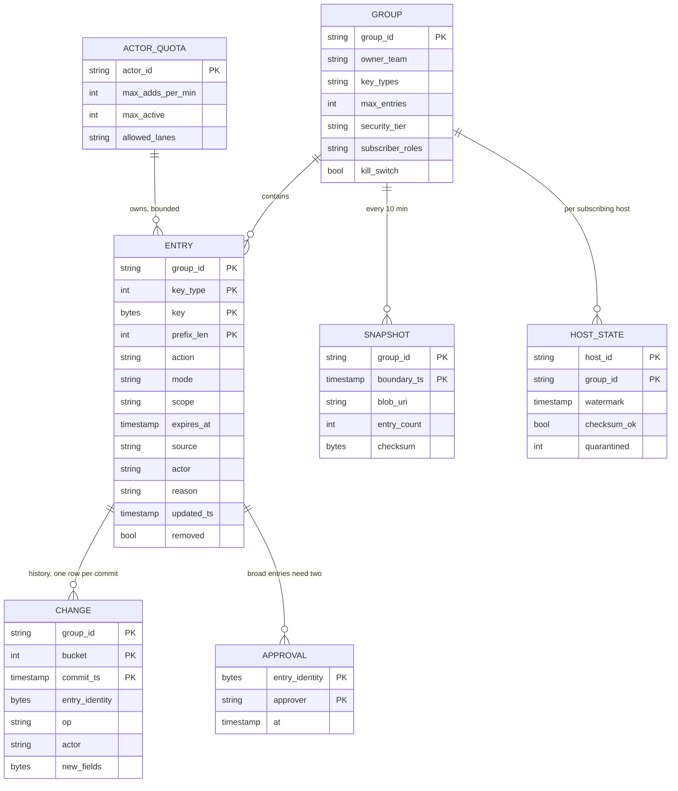

Access patterns that justify it:
- **Upsert by identity** (every add): primary key `(group_id, key_type, key, prefix_len)`. An add of an existing key extends it (`expires_at = max(old, new)`) instead of creating a duplicate, which makes detector retries free.
- **Changes in `(a, b]` for one group** (the publisher, 10 times a second): `CHANGE` keyed by `(group_id, bucket, commit_ts)` with `bucket = hash(identity) mod 16`. A key that is a bare timestamp would put every write on one Spanner split, the textbook hotspot; 16 buckets spread 20k writes/s over 16 splits, and the publisher reads 16 short ranges.
- **Full state at T** (snapshot every 10 minutes, and `Restore(to_time)`): a Spanner snapshot read at timestamp T over `ENTRY` where `removed = false and expires_at > T`. Lock-free, repeatable, identical for every reader.
- **Lookup by key for support**, including "which CIDRs cover this IP": exact by primary key, plus a secondary index on `(key_type, prefix_len, key)` for the covering-range scan (at most 33 prefix lengths for IPv4, 129 for IPv6, usually a handful in use).
- **Everything by actor** (`Revert(actor)`): `actor` is stored on every `CHANGE` row with a secondary index on `(actor, commit_ts)`. `ENTRY.actor` only holds the last writer, so it cannot find an actor's earlier changes to an entry someone else touched later.
- **Expiry**: `expires_at` is enforced by every host against its own clock on every lookup. Expired rows are not deleted through the change log; the snapshot filters them and a janitor archives rows expired for more than a day with no change record. That keeps TTL churn (most detector entries live an hour) off the wire.

**The version is the commit timestamp.** Spanner gives every transaction a commit timestamp consistent with real time order, and a read at timestamp `b` sees exactly the commits at or before `b`. So there is no separate sequencer and no counter row to contend on.

---

## 4. High-level design

One subsection per functional requirement. Each traces input to output through the boxes, adds the boxes it needs to a single diagram, and ends with what is still missing. The design at the end of §4 is deliberately the simple version.

### 4.1 Check on every request, in process

**Bad: call a deny-list service on every request.** A front-end calls `IsDenied(ip, account)` on a central service. 100 M RPC/s, +0.5 ms p50 per request, and a dependency every front-end must now handle: if the service is down, deny everyone (outage) or no one (unprotected). Under a DDoS the attack traffic hits the deny-list service too, so the thing meant to stop the attack is the first thing it takes out.

**Good: a read-through cache of lookups on each host.** Cache `IsDenied` results for 60 s, positive and negative. Most accounts repeat, so account hit rates are high. IPs do not: a front-end sees millions of distinct client IPs a day, so the negative cache is mostly misses and the central service still sees a large share of 100 M/s. Worse, a new deny waits up to 60 s on every host that cached "allowed", and there is no way to invalidate 200k caches for one key without building the push system anyway.

**Great: the whole list on every host.** It is 255 MB (§2). Load it into shared memory, check locally, no remote call ever. The rest of this document is about keeping 200k copies fresh and safe.

**Flow (simple version, list loaded at boot):**

1. A request arrives at a front-end (an edge proxy or an API gateway). The proxy has the client IP from the connection (or from a trusted `X-Forwarded-For` set by our own load balancer), the account id after it validates the auth token, and the API key if one was sent.
2. The proxy calls the in-process enforcement library: `check({ip, account_id, api_key_hash, region})`.
3. The library normalises: IPv4-mapped IPv6 to IPv4, IPv6 to its /128 and /64 forms, API key to its SHA-256 prefix (the list never holds raw secrets).
4. It probes the per-type tables: IPv4 or IPv6 exact, then the CIDR interval array (binary search over non-overlapping ranges, about 18 steps for 200k ranges), then account, then API key. Each probe is one or two cache misses, 80 to 150 ns.
5. A hit checks `expires_at > now` and `mode`. `enforcing`: return `DENY`. `shadow`: log "would deny" and continue.
6. On `DENY` the proxy answers 403 with a reference code (for appeals) and does not touch the backend. On `ALLOW` it routes as normal.
7. At boot the host loaded the list from a file in the blob store.

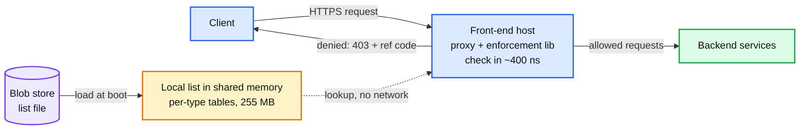

Data model so far: per-type tables in the host's memory, each record `key, expires_at, flags`.

**What is still missing:** nothing writes the list, and nothing refreshes it. A change needs a redeploy. §4.2 and §4.3.

### 4.2 Add and remove entries: one strongly consistent store

**Flow: a detector denies an IP for 1 hour.**

1. The DDoS detector calls `AddEntries(group = edge-ip-drop, [{ipv4, 203.0.113.7, /32, drop, ttl 3600, reason "syn flood", ...}], request_id)` on the Denylist API.
2. The API authenticates the caller (mTLS identity), checks it may write this group, validates each entry (well-formed key, `prefix_len` legal for the type, TTL within the group's maximum, scope a known region), and normalises the key (one canonical form per address).
3. One Spanner read-write transaction: upsert the `ENTRY` row by identity (`expires_at = max(existing, now + 3600 s)`), insert a `CHANGE` row `(group_id, bucket, commit_ts, identity, upsert, fields)`. Spanner assigns `commit_ts` at commit.
4. The API returns `commit_ts`. The writer now has read-your-writes on the store: `Lookup` at any later time sees the entry.
5. A retry with the same `request_id` (or simply the same entry) finds the row and returns the same result: the upsert is idempotent and never creates a second entry.

**Remove** is the same transaction with `removed = true` and an `op = remove` change. **Feeds**: a feed importer fetches `security.gov.x` every 5 minutes, diffs it against the group's current entries with `source = feed`, and writes the adds and removes as an import job. If the feed shrinks by more than 20% in one fetch, the importer does not remove anything and pages: a truncated download must not unblock everyone on the list.

**Multi-region writers.** Spanner is multi-region, so a trust and safety analyst in Europe and a detector in Asia write to the same database. If Europe adds an IP and Asia removes it, the two transactions get two commit timestamps; the later one wins everywhere, because every host applies changes in commit timestamp order. No CRDTs, no last-writer-wins on wall clocks.

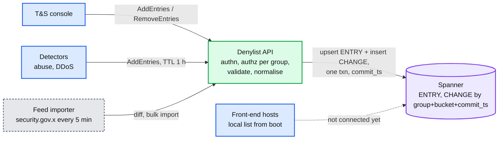

Data model so far: `ENTRY` keyed by identity, `CHANGE` keyed by `(group_id, bucket, commit_ts)`.

**What is still missing:** the change sits in Spanner. No host knows. §4.3.

### 4.3 Propagate every change, and report how far it got

**Bad: every host polls the store.** 200k hosts each run "changes since my timestamp" every second: 200k queries/s on the source of truth, most returning nothing, many crossing an ocean. And a booting host would read 10 M rows from it. The store becomes the fleet's bottleneck, and a thundering herd after any network blip lands on the one component that holds the truth.

**Good: publish the whole list as a file every 10 s (constant work).** A publisher writes a snapshot to the blob store; hosts fetch a tiny version file every few seconds and download the snapshot when the version changes. This is AWS Hyperplane's pattern and it is wonderfully robust: no ordering, no gaps, no state on the server, and the system does the same work on a quiet day and a bad one. It breaks on size: `100 MB × 200k hosts` every time the list changes, which during an attack is every interval, is 20 TB per cycle. It also floors freshness at the cycle plus the poll interval. Right answer for a 1 MB list; wrong for a 100 MB one. (Push back on anyone who calls it naive.)

**Great: a snapshot every 10 minutes plus a stream of small deltas down a fan-out tree.** Hosts load a snapshot once, then apply 100 ms batches of changes as they happen. 64 KB/s per host instead of 100 MB per change. The price is ordering: a host must never miss or reorder a batch, and must know when it is behind.

**Flow: the detector's add reaches every host.**

1. **Cut.** Two publishers (in different regions, both active) each run the same loop every 100 ms: `b = floor_100ms(now - 500 ms)`; read `CHANGE` rows for this group with `commit_ts` in `(a, b]` from 16 buckets, at Spanner read timestamp `b`. A read at timestamp `b` is guaranteed to see every commit at or before `b`, so the batch is complete, and both publishers produce the same batch.
2. **Sort and checksum.** Sort the ops by `(commit_ts, identity)`, apply them to the publisher's own in-memory copy of the group, and compute the state checksum (§5.3). Sign the batch.
3. **Push down the tree.** Send `Batch{group, from = a, to = b, ops, checksum, sig}` on long-lived streams to the regional distributors (8 per region, 240 in all), which forward it to the edge PoP distributors (2 per PoP, 300 in all). Each regional distributor subscribes to both publishers (PoP distributors subscribe to regional distributors in two regions), keeps the first copy of each `(from, to)`, and checks that the second copy's checksum matches.
4. **Fan out to hosts.** Each host's agent holds one stream to one distributor in its own site. The distributor forwards the batch within a millisecond. With no changes, the publishers still emit an empty batch every 100 ms, and the distributor merges runs of them into one heartbeat batch (`ops = []`) per host per second, so a host can tell "nothing changed" from "I am cut off".
5. **Apply.** The host agent checks `batch.from == my watermark` (contiguity), verifies the signature, applies the ops to the overlay in shared memory (§5.1), checks the resulting checksum equals `batch.checksum`, and advances `watermark = batch.to`. The enforcement library sees the change on the next lookup.
6. **Ack upward.** The agent acks `(group, watermark, checksum_ok)` on the same stream, at most once a second. Distributors aggregate their hosts into a watermark histogram and send it to the propagation tracker every second.
7. **Report.** `GetPropagation(group, commit_ts)` returns the fraction of subscribing hosts whose watermark is at or past `commit_ts`, by region. In steady state: 50% within about 0.8 s, 99% within 2 s.
8. **Snapshots.** Every 10 minutes (at boundaries `T = k × 600 s`) a snapshot builder does a Spanner snapshot read of the group at `T`, writes a signed file to the blob store, and the publishers mark the batch ending at `T` with that snapshot's checksum. A booting host loads the latest snapshot, then asks its distributor for batches from `T`. Distributors keep the last 60 minutes of batches in memory for that.

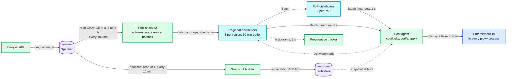

Data model so far: `SNAPSHOT` rows and files; per-host `watermark` in the agent and in the tracker's memory.

**What is still missing:** four things, each a deep dive. (1) Nothing yet says how the host stores base plus changes so that a lookup stays under 1 us while the agent writes (§5.1). (2) The latency and burst numbers need walking hop by hop (§5.2). (3) A host that silently diverges, and what a stale host should do (§5.3). (4) Worst of all: a detector bug or an analyst's typo now reaches 200k hosts in one second (§5.5).

### 4.4 Explain and undo

**Flow: a customer says "I was blocked".**

1. The 403 page shows a reference code: `hash(host, group, key_type, watermark, time)`. Enforcement hosts log every deny for accounts and API keys, and a 1% sample of IP denies (all of the first deny per key per minute), with `group, key, mode, watermark`, into the decision log.
2. Support pastes the code or the account id into the console, which calls `Lookup(account, 12345, at_time = the request time)`. The API reads Spanner **at that timestamp** and returns the entry that matched, who added it, why, the ticket, and its full change history.
3. If the entry was a mistake: `RemoveEntries` (emergency lane, enforced on 99% of hosts within 10 s). If a whole detector run was bad: `Revert(group, actor = detector-7, from_ts, to_ts)`.

**Flow: revert.** The API reads the state at `from_ts` and at `to_ts` (two Spanner snapshot reads), finds every change the actor made in between through the `(actor, commit_ts)` index on `CHANGE`, computes the inverse of each (remove what it added, restore what it removed with the original fields), skips any entry someone else changed later (those are listed for a human), and commits the inverse as one new change set. It flows to hosts like any other change, in about 1 s. Hosts never rewind their watermark. A rollback that moved hosts backwards would break contiguity, lose later unrelated changes, and need a second mechanism; a forward revert is just another write. `Restore(group, to_time)` is the same with the diff between "now" and "state at `to_time`" (Spanner keeps old versions for up to 7 days).

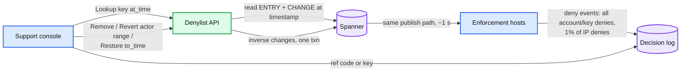

End of §4. We have a correct but naive design: the check is local, writes are strongly ordered, changes stream to every host, and every deny can be explained and reverted. It falls over on: a lookup that races the agent's write (§5.1), a 20k/s write burst and a 200k-host bootstrap (§5.2), a host that is silently behind or wrong (§5.3), the distribution plane going down (§5.4), and, first and worst, one bad change reaching every host within a second (§5.5). The list growing 10x breaks the memory math (§5.6).

---

## 5. Deep dives

One per non-functional requirement. Each one names what breaks in the §4 design with a number, fixes it, and lists what changed in the API, the data model, and the diagram.

### 5.1 "Check in under 1 us while the agent writes": the host's memory layout

**What breaks.** §4.3 said "the agent applies the ops". Four ways to do that wrong:

1. **A lock.** 40 proxy workers do 100k lookups/s between them; the agent applies a 2,000-op batch 10 times a second. A reader-writer lock puts an atomic on a shared cache line in every lookup (the line bounces between 40 cores, 50 to 100 ns each time), and a writer holding it for a 2 ms batch stalls every request on the host for 2 ms. The p99 target is 1 us.
2. **One copy per process.** 40 workers × 255 MB = 10 GB per host, 2 PB fleet-wide. And 40 copies to update.
3. **Rebuilding the table per batch.** Building a 10 M-entry table takes about a second of one core. Ten batches a second makes that impossible.
4. **CIDRs in a hash table.** A hash table answers "is this exact key present", not "does any range contain this address". A linear scan of 200k ranges is 200 us.

**Fix: an immutable base, a small overlay, a left-right swap, and one copy per host.**

- **Base.** At each snapshot boundary `T` (every 10 minutes) the agent builds per-type open-addressing tables and a sorted CIDR interval array into one file on tmpfs, and every proxy process maps it read-only. Immutable, so readers need no synchronisation at all. It never changes until the next boundary.
- **Overlay.** Changes since `T` go into one small map per key type, `key -> record or tombstone`, at most 500k entries (a burst forces an early rebase). Lookup order: protected allowlist (never deny these), overlay (a tombstone means "not denied, skip the base"), base exact tables, then CIDR ranges (base array, plus a short overlay list of CIDR adds since `T`). A CIDR **remove** cannot be a tombstone, because flattened segments no longer know which original range they came from, so a remove rebuilds the interval array at once (about 20 ms for 200k ranges). CIDR changes are rare, so this is cheap.
- **Left-right for the overlay.** Two copies, L and R, in shared memory, plus an `active` index. Readers load `active`, bump their own read indicator (one slot per worker thread, padded to its own cache line, so no sharing), read, and decrement. Each slot records its owner's process id, so the agent can clear a slot left set by a worker that crashed mid-read instead of waiting on it forever. The agent applies a batch to the inactive copy, flips `active`, waits until the old copy's read indicators drain to zero, then applies the same batch to it. Readers never block and never retry; the writer does every op twice (40k inserts/s at burst, trivial). It is the Ramalhete and Correia left-right pattern, a two-copy cousin of RCU (read-copy-update).
- **Rebase.** At `T` (or when the overlay passes 500k entries) the agent merges base plus overlay up to `T`, drops entries with `expires_at <= T`, and writes a new base file (1 to 2 s of one core). It checks the result against the snapshot checksum the publisher put in the stream (§5.3), writes a new generation number into a shared header, and trims the overlay. The library reads the generation (one atomic load of a line that almost never changes) on each lookup and re-maps when it moves. A rename does not update an existing mapping, so readers must re-map explicitly; the old file is unlinked after its last reader leaves.
- **CIDR matching.** Overlapping deny ranges are flattened at build into sorted non-overlapping intervals, so a lookup is one binary search: about 18 steps for 200k ranges, 100 to 200 ns with the top levels in cache. If the CIDR set grows to millions, switch to a compressed trie: Poptrie measured 174 to over 240 M lookups/s on one core with 500k to 800k route tables.
- **Packet-level drop at the edge.** Entries with `action = drop` (DDoS sources) are also written by the agent into kernel BPF maps (a hash map for exact addresses, an LPM trie for ranges) read by an XDP program on the NIC's receive path. XDP drops 24 M packets/s on one core in the XDP paper, against 4.8 M for the normal Linux stack, so attack packets die before TLS, before the proxy, before anything allocates. `deny` entries stay in the proxy because they need a 403 page and, for accounts and keys, a parsed request.

**Push back on the textbook answer.** "Use a Bloom filter, it is 20x smaller." At 10 M entries the exact tables are 255 MB, which fits. A Bloom filter at 1% false positives (9.6 bits per key, 12 MB) produces `1% × 100 M = 1 M` false positives per second, and each one needs a confirm from somewhere, which is a remote call on precisely the requests you are about to deny. That puts the dependency back. Filters earn their place only when the list stops fitting (§5.6). And "run Redis on every host": a loopback round trip and a syscall per lookup (tens of microseconds) and one more process to keep alive, for what shared memory does with a pointer dereference.

**What changed:** a host agent process per host; base file plus left-right overlay plus generation header in shared memory; allowlist table checked first; BPF maps on edge hosts. `check()` unchanged. Diagram: the host box splits into agent, shared memory, proxy, XDP. [`deep-dives/local-lookup-and-memory-layout.md`](deep-dives/local-lookup-and-memory-layout.md).

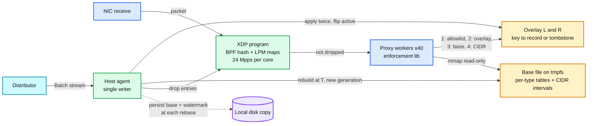

### 5.2 "99% of hosts within 10 s, even during a 20k/s burst": the propagation path

**What breaks.** Walk one change from commit to enforcement and name each cost:

1. **Closed timestamp.** The publisher reads at `now - 500 ms` so the read never waits on in-flight commits. 500 ms of latency by design; tunable down to about 100 ms if the store's safe time keeps up.
2. **A single publisher.** One leader with a lease is the obvious design. Its failover (lease expiry plus election, 5 to 10 s) eats the whole 10 s budget, and while it is out the whole fleet goes stale together.
3. **Egress at burst.** 20k changes/s is 640 KB/s per host. A distributor serving 625 hosts sends 400 MB/s (3.2 Gbps). Fine. The same distributor serving a region-wide boot sends 625 × 100 MB = 62 GB, which at 3 GB/s is 20 s of saturated NIC, and it has to keep streaming batches to already-booted hosts at the same time. **The regional distributor during a mass boot is what saturates first.**
4. **Bulk imports.** A 1 M-entry import committed at once is a 32 MB batch to every host in the same second: `200k × 32 MB = 6.4 TB`, and a 32 MB apply on every host at once.

**Fix.**
- **Deterministic, leaderless publishers.** The batch for `(a, b]` is a pure function of Spanner's state at `b`: the same read at the same timestamp, sorted the same way, with the same checksum. So run two publishers in two regions, both active, no election. Distributors subscribe to both, keep the first copy of each `(from, to)`, and compare the second copy's checksum; a mismatch is a publisher bug and pages (the distributor forwards the first copy without waiting, and the snapshot builder's independent checksum at the next 10-minute boundary says which publisher was right). Each publisher emits exactly one batch per 100 ms slot, empty or not, and never merges slots after a pause, because deduplication by `(from, to)` depends on both cutting the same slots. Losing one publisher costs nothing; losing both is §5.4.
- **A three-level tree.** Publishers to 240 regional distributors (8 per region) to 300 PoP distributors (2 per PoP) to 200k host agents. Fan-out per node: each publisher feeds 240 regional distributors; each regional distributor feeds ~625 hosts plus 2 or 3 PoP distributors (each PoP distributor subscribes to two regions); each PoP distributor feeds ~165 hosts. Every node is a dumb forwarder with a 60-minute ring buffer of batches and a cached copy of the latest snapshot per group. Meta's Configerator uses the same shape (leader, observers, proxies) and measured about 4.5 s to reach hundreds of thousands of servers across continents; Cloudflare's Quicksilver reported a p99 of 2.29 s to every machine worldwide at about 350 changes/s.
- **Lanes with rate caps.** Emergency lane: narrow entries and every remove, no cap, straight through. Standard lane: broad entries, capped at 2k changes/s per group. Bulk lane: imports and feeds, capped at 5k changes/s per group, so a 1 M import takes 200 s and its batches look like any other burst. The caps are enforced at the API, so the stream's size stays bounded by construction.
- **Bootstrap without a storm.** A booting agent first loads its **own** copy from local disk (written at every rebase), so a restart is a catch-up of minutes of batches, not a 100 MB download. Only a host with no local copy (new, or older than 24 h) downloads. Distributors cap concurrent snapshot downloads at 50 and answer the rest with "retry in N s", jittered; beyond that the agent goes to the blob store directly. For lists above ~1 GB, peer-to-peer inside the rack (Meta's PackageVessel moves configs over 1 MB this way, under 4 minutes to the fleet).

**Push back on the textbook answer.** "Use Kafka, and make every host a consumer." A group's changes live in one partition (ordering), so all 200k consumers fetch from the one broker leading it: `200k × 640 KB/s = 128 GB/s` at burst from a few brokers, plus 200k consumer sessions. You end up mirroring per region and adding relay consumers per site, which is the distributor tier with more moving parts. Kafka is a fine publisher-to-distributor transport if you want a durable log there; it is not a host fan-out. "Use gossip": `log2(200k) ≈ 18` rounds with duplicate traffic and no ordering, so each host still needs gap repair from somewhere authoritative. Gossip is right for liveness, not for an ordered stream ([`../../concepts/gossip-protocol.md`](../../concepts/gossip-protocol.md)).

**What changed:** second publisher; PoP distributor level; lane per change and per-group rate caps in the API; local-disk copy and download admission control. `Subscribe` unchanged. [`deep-dives/propagation-and-fan-out.md`](deep-dives/propagation-and-fan-out.md).

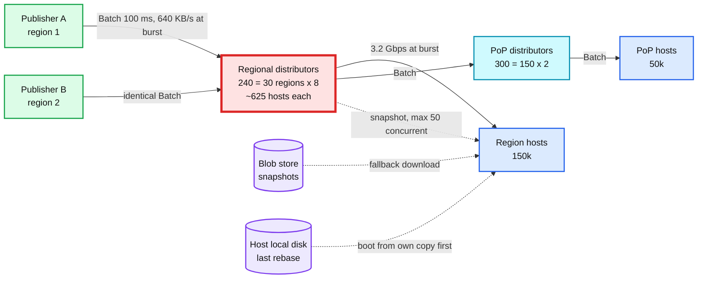

### 5.3 "How do you know it is everywhere, and how stale can one host be?": watermarks and the consistency window

**What breaks.** Three holes in §4.3.

1. **Silence is ambiguous.** A host that receives nothing for 10 s cannot tell "no changes" from "my distributor is wedged". Without a signal, a cut-off host is stale forever and nobody knows.
2. **Silent divergence.** A host applies every batch and still ends up with a different list: a bug in a rebase, a bit flip in RAM, an op skipped by a parser edge case. Contiguity checks cannot see it because the watermarks are right. That host enforces the wrong list until someone restarts it.
3. **"Propagated" has no proof.** The analyst's "is it live?" and the SLO "99% within 10 s" both need a fleet-wide measurement, and 200k hosts reporting individually to one place is 200k messages per second of pure overhead.

**Fix.**
- **The watermark is the commit timestamp.** A host's watermark `W` means "every change committed at or before `W` is enforced here". Staleness is `now - W`, directly comparable across hosts and with the store. Batches, including empty ones sent as a heartbeat every second, always advance `W`, so staleness only grows when the host is actually cut off.
- **Contiguity rule.** Apply a batch only if `batch.from == W`. If `batch.to <= W` it is a duplicate (the second publisher's copy, or a replay), drop it. If `batch.from > W` there is a gap: ask the distributor for `(W, batch.from]` from its 60-minute buffer; if it has been longer than that, load the latest snapshot and replay from its boundary. This is the same move as a Kubernetes watch whose resource version was compacted away: relist, then watch.
- **A state checksum in every batch.** The publisher keeps `C = XOR of H(identity, fields)` over every stored entry, with `H` a 128-bit hash. An upsert XORs out the old record and XORs in the new; a remove XORs out. Each op is O(1), order within a batch does not matter, and the batch carries `C` after it. The host maintains the same `C` and compares. Mismatch: keep enforcing (never drop protection because of a checksum), mark `checksum_ok = false`, alert, and resync from the next snapshot. Every rebase also recomputes the checksum from scratch and compares it with the snapshot's, because a bug in the incremental XOR can cancel itself out and hide. Google Safe Browsing v4 clients do the same thing: SHA-256 over the sorted local list, compared with the server's checksum after every update, and a full re-download on mismatch. XOR is not collision-proof against an adversary; the batch signature covers tampering, the checksum covers bugs.
- **Acks flow up and are summarised on the way.** Each agent acks `(group, W, checksum_ok)` at most once per second on its existing stream. Each distributor turns its hosts' acks into a histogram of watermarks per group plus a list of hosts older than 30 s, and sends that to the propagation tracker every second: 540 small messages per second, not 200k. The tracker knows the expected host set from the fleet inventory, so a host that never acks counts as stale, not as absent.
- **Propagation answers.** `GetPropagation(group, commit_ts)` is `hosts with W >= commit_ts / expected hosts`, by region. The SLI "time until 99% of hosts are at or past commit_ts" is computed for a sample of commits every minute. This is how the analyst sees "live on 99.4%" 2 s after pressing the button.
- **What a stale host does.** Staleness is a health signal, not a kill switch:

| Staleness `now - W` | Host behaviour | Who notices |
|---|---|---|
| under 30 s | normal | nobody |
| 30 s to 5 min | keep enforcing the last good list (fail-static); report stale | page if more than 1% of a region's hosts for 2 minutes |
| over 5 min, group tier `critical` (revoked credentials) | fail readiness so the load balancer drains this host, **unless more than 20% of the site's hosts are also stale** | page |
| any, and the host is booting | not ready until the list is loaded and within 30 s of the distributor's head (or the local-disk copy, §5.4) | |

The 20% rule is the panic threshold idea from Envoy's load balancer (default 50%): when a large fraction of hosts are unhealthy for the same reason, the reason is upstream, and draining all of them converts "slightly stale" into "no capacity".

**Consistency model, stated.** The store is linearizable. Each host sees a **consistent prefix** of the change log: it may be behind, but it never has change `n + 1` without change `n`, and never goes backwards. Across hosts: eventual, with staleness bounded at p99 10 s and alerted at 30 s. The writer gets read-your-writes against the store (`Lookup`) and a measured "propagated to X%" against the fleet. Nobody gets "every host at the same instant", and nobody needs it.

**Push back on the textbook answer.** "Make it strongly consistent so every host agrees." A write visible on all hosts at the same moment means every host must accept it before commit: a two-phase commit across 200k hosts, where one slow host blocks every write, and the write path's availability becomes the product of 200k hosts' availabilities. What people actually want is "tell me when it is everywhere", which is a watermark and a histogram.

**What changed:** heartbeat batches every 1 s; `state_checksum` in every batch; `Ack` on the stream; watermark histograms at distributors; the propagation tracker and `GetPropagation`; readiness tied to staleness with a site-level panic threshold. [`deep-dives/watermarks-and-consistency-window.md`](deep-dives/watermarks-and-consistency-window.md).

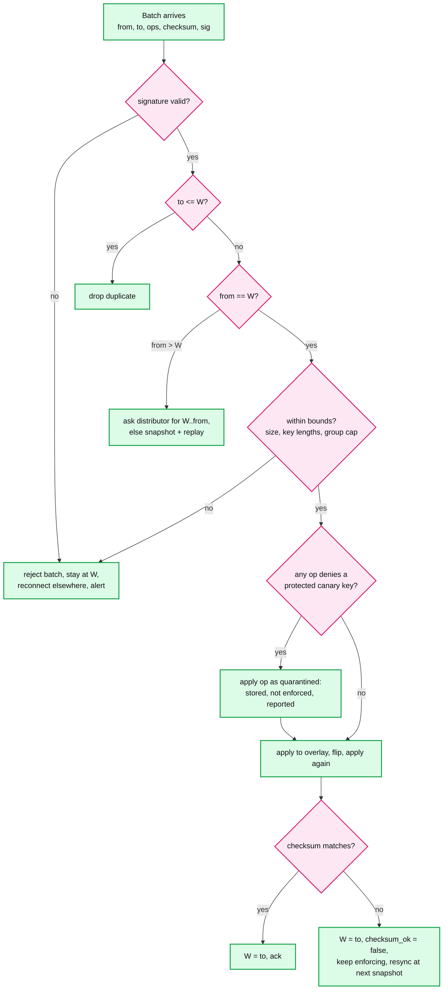

### 5.4 "Keep protecting when parts fail": fail-static everywhere

**What breaks.** Every box between the store and the host can fail, and a region can be cut off whole. The question for each is not "does the list stay fresh" (it cannot, if the source is gone) but "does enforcement continue, and does anyone notice".

**Fix: the data plane never depends on the control plane being up.**

| Failure | What the hosts see | What they do | Blast radius | Recovery |
|---|---|---|---|---|
| One distributor dies | heartbeats stop on ~625 streams | after 3 s without a batch, reconnect to another distributor in the site with `from = W`; it replays from its buffer | those hosts are about 4 s staler, once | automatic |
| One publisher dies | nothing: distributors take the other publisher's identical batches | nothing | none | restart; it catches up by reading the store |
| Both publishers, or Spanner, unavailable | heartbeats stop fleet-wide; every host's staleness climbs together | fail-static: enforce the last list. Critical-tier readiness rule does not drain anyone, because more than 20% of every site is stale | no new changes anywhere; enforcement unchanged | page at 30 s. Spanner multi-region survives one region's loss; writes resume, publishers catch up from their last `b` |
| A region is partitioned from the rest | its distributors get nothing; its hosts go stale | fail-static; PoP distributors homed on that region fail over to a second region | changes do not reach that region until it heals | automatic when the link returns; hosts replay from buffer or snapshot |
| Host agent crashes | the list in shared memory stays mapped; lookups continue on the last state | agent restarts, reads `W` from the shared header, resubscribes | none on the data path | seconds |
| Host boots while the distribution plane is down | no distributor answers | load the local-disk copy if under 24 h old, mark stale, go ready; otherwise stay unready, unless more than 20% of the site is in the same state | new capacity comes up slightly stale instead of not at all | normal once reachable |
| Mass host reboot (fleet-wide kernel patch, power event) | 200k boots | local-disk copies make most boots a catch-up; the rest download with admission control and jitter | minutes of mild staleness | automatic |
| Clock jump on a host | `expires_at` checks against a wrong `now` | agent compares its clock with the stream (a batch's `to` should be about 0.6 to 1 s behind `now`); off by more than 5 s: alert and use `now = clamp(local, W, W + 60 s)` for expiry | that host expires entries early or late by at most the clamp | fix NTP; chrony normally holds skew to milliseconds |

**Push back on the textbook answer.** "Fail closed, to be safe." Denying every request because the list cannot refresh turns a control-plane outage into a global data-plane outage. Google Cloud's 12 June 2025 incident is the lesson in the other direction: policy data with blank fields replicated globally within seconds, a code path with no error handling and no feature flag crash-looped Service Control everywhere, the red button took 40 minutes to roll out, and us-central1 took about 2 h 40 min because restarting tasks without randomized backoff overloaded their Spanner dependency. Their first remediation was to make the component fail open. For a deny list the answer is fail-**static**: the list from five minutes ago is almost exactly the list now.

**What changed:** persisted local copy per host; readiness rule with site-level panic threshold; clock sanity check in the agent; PoP distributors with two upstream regions. [`deep-dives/failure-modes-and-fail-static.md`](deep-dives/failure-modes-and-fail-static.md).

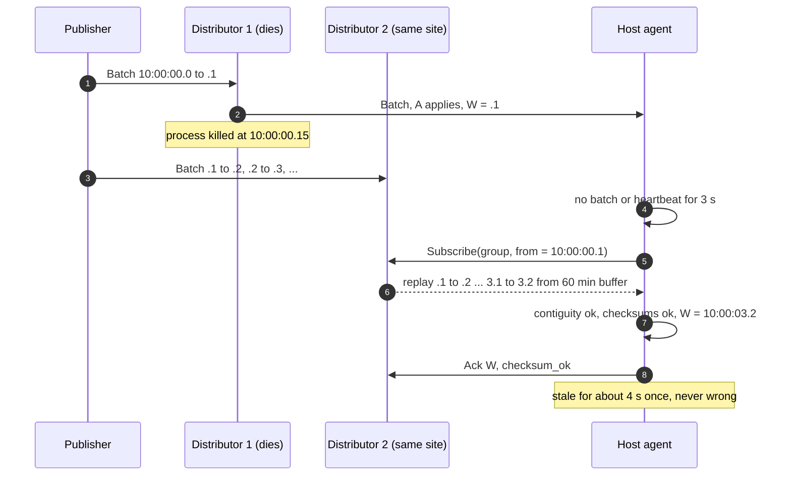

### 5.5 "One bad change must not deny everyone": blast radius and safe changes

**What breaks.** The §4 design delivers anything to 200k hosts in about a second. That is the requirement, and it is the danger. Four shapes of "bad":

1. **Too broad.** An analyst denies `0.0.0.0/0`, or `10.0.0.0/8` (our own internal range), or a /12 that happens to hold a mobile carrier's NAT pool: millions of users behind one address range.
2. **Too many.** A detector with a bad threshold denies 5 M accounts in two minutes.
3. **Malformed.** A batch that is well-signed but breaks an assumption in the host code. Cloudflare 18 November 2025: a permissions change made a query return duplicate rows, the bot-management feature file (regenerated every few minutes and published to the whole network) went past its 200-feature limit (about 60 in use), and the proxy's `unwrap()` panicked; core traffic failed from 11:20 UTC until about 14:30. CrowdStrike July 2024: content with 21 input fields met a sensor supplying 20, an out-of-bounds read, 8.5 million Windows machines.
4. **Expensive.** A rule that is valid but slow. Cloudflare 2 July 2019: one WAF regex with catastrophic backtracking went global through Quicksilver in seconds and pinned CPUs for 27 minutes. We avoid this class by construction (no regex, §1.1).

Meta's Configerator paper found 16% of high-impact incidents over three months were configuration-related. For a deny list, the bad change is the likeliest cause of a global outage, far ahead of any hardware failure.

**Fix: stage by breadth, not by count, and validate twice.**

1. **Guardrails at the API (the change gate).**
   - A **protected set** that nothing may cover: our own ranges, health checkers, the console's and the on-call's addresses, payment and partner callbacks, internal service accounts. An entry that covers any of them is rejected.
   - **Breadth rules**: IPv4 shorter than /24, IPv6 shorter than /48, or more than 1,000 entries in one call go to the standard lane. IPv4 shorter than /16, or an impact estimate above 0.1%, also need a second approver.
   - **Impact estimate**: a traffic index built from a 1% sample of the last 24 hours of successful requests, aggregated as counts per /24, per /48, per account and per API key. For a new entry it answers "this would have denied X% of the last hour's good traffic" in a few milliseconds.
2. **Actor quotas.** Each detector and feed has `max_adds_per_min` and `max_active` (default 10k/min and 2 M). Past the quota, its changes are held and its owner is paged. A rogue account-ban detector is stopped at 10k entries, not 5 M. The DDoS detector gets a larger emergency quota (up to 20k/s) but only for narrow, short-lived entries: single IPv4 addresses or IPv6 /64 or narrower, TTL at most 1 hour. Its worst case is therefore a burst of one-address denies that all expire within the hour.
3. **Rollout lives on the entry, not in the stream.** An entry has a `mode`: `shadow` (every host logs "would deny" and allows), `canary` (hosts with `hash(host_id) mod 100 < 1` enforce, the rest shadow), then `enforcing`. Standard-lane entries go shadow 5 minutes, canary 5 minutes, enforcing; the gate promotes automatically if the observed would-deny rate matches the estimate and no protected key was hit, and holds for a human otherwise. Because rollout is a field, every host still receives every batch, and contiguity and checksums are untouched. The emergency lane (narrow entries by a trusted actor, and every remove) goes straight to `enforcing`, because the thing being denied is attacking now and a /32 cannot hurt more than one address's users.
4. **Validate again on the host, assuming the gate has a bug.** Signature, hard size bounds (batch at most 16 MB, group at most 2x its configured `max_entries`, key lengths per type), a parser with no panic path (bounded allocation, fuzzed), and **canary keys**: a small signed list of must-never-deny keys shipped through a separate channel. An op that would deny one is applied as quarantined: stored (so checksums still match) but not enforced, and reported. A batch that fails bounds is rejected whole; the host stays at its last good watermark and alerts. It never crashes and never applies half a batch. Cloudflare's own remediation after November 2025 was to treat internal config files "like user-generated input"; this is that.
5. **The publisher runs the host's checks first.** It applies every batch to its own copy with the same code before emitting. Most bad batches die there, before any host sees them.
6. **Kill switch per group, on two channels.** `SetKillSwitch(group, off)` goes through the stream (fast), and also through the fleet's ordinary config system (a different pipeline, different failure domain). Either one saying off stops enforcement of that group on that host. If the deny-list stream itself is what broke, the second channel still works.
7. **Revert in under 30 s.** A forward revert (§4.4) rides the emergency lane: about 1 s to 99% of hosts.
8. **Code ships slowly, data ships fast.** The agent and the enforcement library roll out like any binary, 1% then a region then the world, over days. Only data takes the 1-second path. A new parser or a new field is enabled by a flag after the binary is everywhere (the Google Cloud report's lesson: the new code path was not behind a feature flag).

**Push back on the textbook answer.** "Canary every change on 1% of hosts for 10 minutes." Then blocking an attacking /32 takes 10 minutes, which fails the freshness requirement for the changes that matter most. Blast radius grows with breadth, not with the number of changes, so stage by breadth: a /32 ships in 1 s, a /8 ships in 10 minutes and needs two humans.

**What changed:** change gate with protected set, breadth rules, impact estimate and traffic index; actor quotas; `mode` on every entry with auto-promotion; canary keys and quarantine on hosts; out-of-band kill switch. `AddEntries` can now return `needs_approval` with the estimate. [`deep-dives/safe-changes-and-blast-radius.md`](deep-dives/safe-changes-and-blast-radius.md).

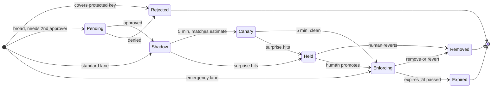

### 5.6 "The list grows 10x, or it is URLs": when the list stops fitting

**What breaks.** At 100 M entries the exact tables are about 2.5 GB per host: `2.5 GB × 200k = 500 TB` of RAM fleet-wide, a snapshot of about 1 GB (a region boot is 5 TB), and rebases 10x longer. At a billion URLs it does not fit at all.

**Fix, cheapest first.**
1. **Subscribe by role.** Edge hosts load IP groups; API gateways load API-key groups; app front-ends load account groups. The design already does this, and it usually cuts a host's share by 3x to 5x. Quicksilver v2's measurement is the argument: about 20% of the keyspace was in use in Cloudflare's large data centers and about 1% in small ones.
2. **Denser encodings for the base.** A sorted array of keys with succinct encoding (Elias-Fano) is 5 to 8 B per IPv4 entry instead of 12 B at 70% load, at the cost of a binary search (about 200 ns). Worth 2x.
3. **Filter locally, confirm remotely, for long-tail groups only.** Replace the base of a large group with a binary fuse filter (about 9 bits per key, 8.6 bits in the 4-wise variant, 0.4% false positives): 100 M keys in 113 MB. A filter hit asks a regional lookup service and caches the answer on the host. At `100 M lookups/s × 0.4%` that is 400k confirms/s fleet-wide, about 13k/s per region, plus the true positives. The full group is about 3 GB at 100 M entries, so the lookup service is 3 to 5 full replicas per region, not a sharded tier; sharding pays only near 10 B entries or 1 M confirms/s in a region. The overlay stays exact, so fresh adds and removes still work without the remote call. One catch: filters are static and a host in filter mode does not hold the keys, so it cannot rebase locally. It downloads the new filter at each boundary (113 MB every 10 minutes is about 190 KB/s per host), or filter groups move to an hourly boundary with a larger exact overlay. [`deep-dives/list-growth-and-tiering.md`](deep-dives/list-growth-and-tiering.md) compares these with an in-place-updatable cuckoo filter.
4. **Keep attack-driven groups exact and local, always.** For a DDoS IP group the positives **are** the traffic: 10 M attack requests/s would become 10 M confirm calls/s, the attack reflected into our own lookup service. Filters are for groups where positives are rare (compromised credentials, a URL reputation list).
5. **Hash prefixes when the client is not ours.** For browsers (the Safe Browsing variant), ship 4-byte prefixes of SHA-256 over URL expressions; a URL expands to at most 30 expressions (5 host suffixes × 6 path prefixes), and only a prefix hit asks the server for full hashes, so the server never learns the URLs a user visits. Mozilla's CRLite does the equivalent for certificate revocation: a 4 MB snapshot every 45 days, deltas every 12 hours, 300 kB per user per day.

**Push back on the textbook answer.** "A Bloom filter fixes memory." It fixes memory and changes the failure model: the confirm service is now on the deny path. If it is unreachable, a filter positive must become either deny (0.4% of legitimate traffic wrongly denied for the duration) or allow (the list stops working for that group). Choose per group and write it down: revoked credentials deny on an unconfirmed hit, IP abuse lists allow.

**What changed:** per-group `storage = exact | filter+confirm`; regional lookup service for filter groups; subscription by role already present. [`deep-dives/list-growth-and-tiering.md`](deep-dives/list-growth-and-tiering.md).

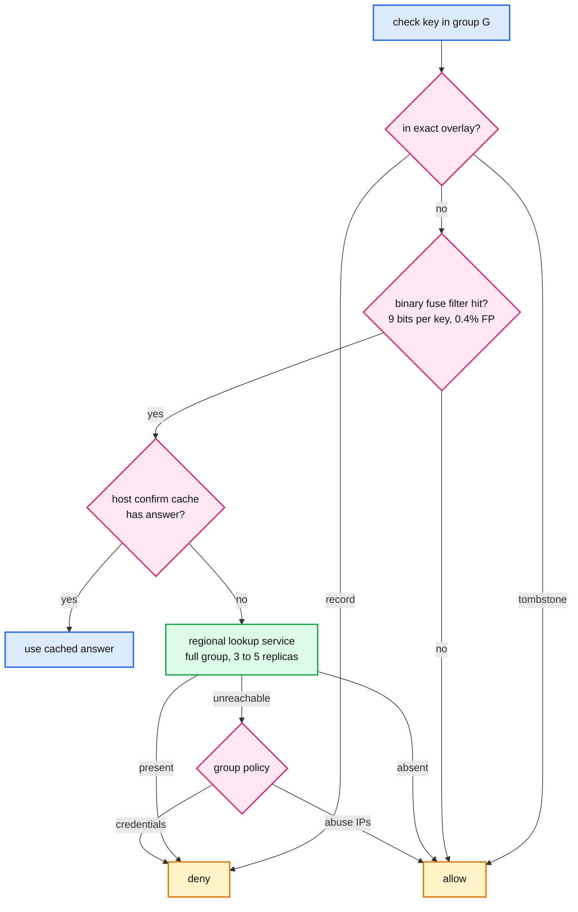

---

## 6. Final design and the six core flows

Everything from §5 composed. Under 15 nodes; zoom-ins in [`diagrams.md`](diagrams.md).

```mermaid
%% D3: final design. The publisher pair is red: every host applies its one ordered stream, so a bad batch or a stalled closed timestamp there reaches or freezes all 200k hosts at once. Every safety layer in §5.5 exists to protect that edge.
flowchart LR
    W[Writers<br/>T&S console, detectors,<br/>feed importer] -->|"Add / Remove / Import"| API[Denylist API + change gate<br/>protected set, breadth, quota,<br/>lane, mode]
    API -.->|"impact estimate"| TI[(Traffic index<br/>1% sample, 24 h)]
    API -->|"txn, commit_ts"| SP[(Spanner<br/>ENTRY, CHANGE)]
    SP -->|"read a..b at ts b, every 100 ms"| PUB[Publishers x2<br/>deterministic batches,<br/>checksum, pre-validate]
    SP -->|"snapshot read at T"| SNAP[Snapshot builder<br/>every 10 min]
    SNAP -->|"signed file"| BLOB[(Blob store)]
    PUB -->|"Batch stream"| RD[Regional distributors<br/>240, 60 min buffer]
    RD -->|"Batch"| PD[PoP distributors<br/>300]
    RD -->|"Batch, heartbeat 1 s"| AG[Host agent x200k<br/>contiguity, validate,<br/>apply, ack]
    PD -->|"Batch, heartbeat 1 s"| AG
    BLOB -.->|"snapshot if no local copy"| AG
    AG -->|"left-right overlay, base,<br/>XDP maps"| PX[Proxy + enforcement lib<br/>check ~400 ns]
    AG -.->|"ack W"| RD
    RD -.->|"watermark histograms"| TR[Propagation tracker]
    PX -->|"deny events"| DL[(Decision log)]
    OOB[Fleet config system<br/>kill switch, canary keys] -.->|"second channel"| AG

    class W client
    class API,SNAP,AG,TR service
    class TI,SP,BLOB,DL store
    class PUB critical
    class RD,PD queue
    class PX client
    class OOB external

    classDef client   fill:#dbeafe,stroke:#2563eb,stroke-width:2px,color:#111
    classDef service  fill:#dcfce7,stroke:#16a34a,stroke-width:2px,color:#111
    classDef store    fill:#ede9fe,stroke:#7c3aed,stroke-width:2px,color:#111
    classDef queue    fill:#cffafe,stroke:#0891b2,stroke-width:2px,color:#111
    classDef critical fill:#fee2e2,stroke:#dc2626,stroke-width:4px,color:#111
    classDef external fill:#e5e7eb,stroke:#6b7280,stroke-width:2px,color:#111,stroke-dasharray:4 3
```

The six flows below are the ones to be able to say from memory. Each is the final design, not the §4 version.

### Flow 1: `check` on a request (about 400 ns, no I/O)

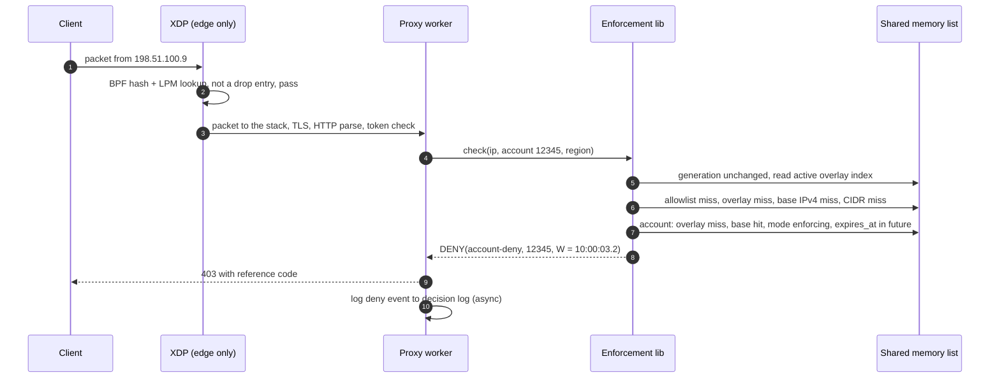

### Flow 2: emergency add, enforced on 99% of hosts in about 2 s

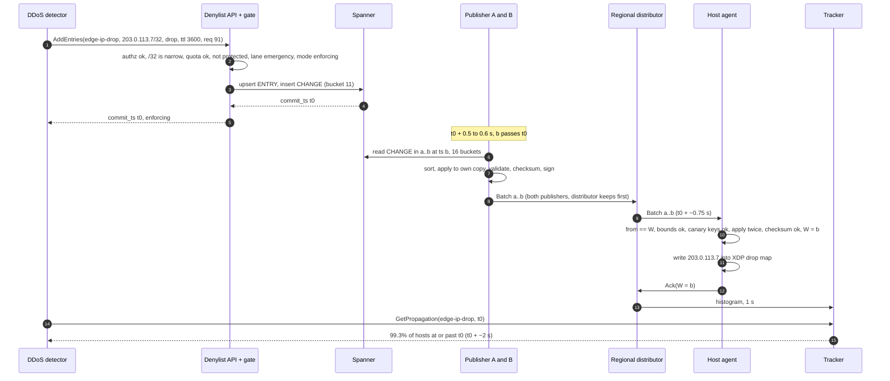

### Flow 3: broad add goes shadow, canary, enforcing

Shown in §5.5. Summary: an analyst adds `198.51.100.0/22`; the gate finds no protected key, estimates 0.004% of last hour's good traffic, and sends it down the standard lane as `shadow`. For 5 minutes every host logs would-deny events; the gate compares them with the estimate, sees no protected-key hits, and writes `mode = canary` (1% of hosts enforce). After 5 more clean minutes it writes `mode = enforcing`. Each mode change is an ordinary upsert, so it takes the same 1-second path. Total 10 minutes, no human needed unless the numbers surprise the gate.

### Flow 4: a host boots

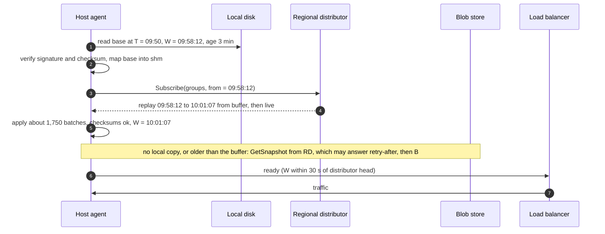

### Flow 5: a distributor dies

Shown in §5.4. Summary: the hosts on it hear nothing for 3 s (heartbeats are 1 s), reconnect to another distributor in the same site with `from = W`, replay from its 60-minute buffer, and are current again about 4 s after the crash. No batch is lost or applied twice, because contiguity decides what is applied.

### Flow 6: a bad batch is stopped, then reverted

Shown in §5.3 (the decision diagram) and §10.4. Summary: a detector bug slips past the gate and adds an entry covering a canary key. The publisher's own pre-validation quarantines it; if a publisher bug let it through, every host quarantines it instead (stored, not enforced, reported). The quarantine count pages the owning team, who calls `Revert(group, actor, from, to)`; the inverse change set is enforced on 99% of hosts within about 2 s.

---

## 7. Trade-offs

| Decision | Option A | Option B | Chose | Why |
|---|---|---|---|---|
| Where the check runs | Remote deny-list service per request | Full copy on every host | Local copy | 100 M lookups/s, 0.5 ms per hop, and a dependency on every request vs 255 MB of RAM per host. A remote service is also the first thing a DDoS takes out |
| Copies per host | One per process | One per host in shared memory | Per host | 40x less RAM (10 GB vs 255 MB per host) and one writer |
| Key storage | 64-bit hash of every key | Exact keys, per-type tables | Exact | About 5 wrongly denied legitimate requests per day from hash collisions at 100 M lookups/s; exact tables cost ~1.5x the memory |
| Distribution | Full list every few seconds (constant work) | Snapshot every 10 min + 100 ms deltas | Snapshot + deltas | 100 MB × 200k per cycle is 20 TB. Constant work wins below ~1 MB of list and would be our answer there |
| Transport | Hosts poll the store, or Kafka consumers, or gossip | Push down a three-level tree of dumb distributors | Tree | Keeps 200k clients off the store and off brokers; ordered; ~1 s end to end. Configerator and Quicksilver made the same choice |
| Version | A sequencer or counter row | Spanner commit timestamp, read at a closed timestamp | Commit timestamp | No hot row, no separate component, and the version is also the staleness measure |
| Publisher | One leader with a lease | Two deterministic active-active publishers | Deterministic pair | No election, so no 5 to 10 s failover inside a 10 s budget; the duplicate is also a free cross-check |
| Fleet consistency | Every host agrees at once (2PC to hosts) | Consistent prefix per host, bounded staleness, measured propagation | Bounded | 2PC across 200k hosts makes every write as available as the least available host |
| When cut off | Fail closed (deny all) or fail open (deny none) | Fail static (last good list), drain only critical-tier stale hosts under a site panic threshold | Fail static | A control-plane outage must not become a data-plane outage |
| Rollout of risky changes | Canary every change | Stage by breadth: narrow entries in 1 s, broad ones shadow then canary then enforce | By breadth | Keeps the 1 s path for the changes that fight attacks, and puts humans on the ones that can deny millions |
| Where rollout state lives | Different batches to different hosts | `mode` on the entry, same stream to every host | On the entry | Contiguity and checksums stay trivial |
| Rollback | Rewind hosts to an older version | Forward revert as a new change set | Forward | One path, monotonic watermarks, later unrelated changes survive |
| Validation | Producer only | Producer and every consumer, with quarantine | Both | Every incident in §5.5 had a producer-side check that missed |
| Large lists | Filters everywhere | Exact for attack groups, filter + confirm for long-tail groups | Per group | Under attack the positives are the traffic; a remote confirm would reflect the attack |
| What we refused to build | Regex and wildcard rules, per-host data canaries by default, a consensus-based publisher, strong fleet consistency, Kafka or Redis on every host | | | Each adds a failure mode that the requirements do not pay for |

Consistency model, stated once: **the store is linearizable and every change has a commit timestamp; each host enforces a consistent prefix of the change log, monotonic, p99 no more than 10 s behind and alerted at 30 s; across hosts the view is eventual; the writer has read-your-writes on the store and a measured propagation fraction on the fleet**. Expiry is exact to each host's clock, and the agent clamps a suspect clock.

---

## 8. Staff-level notes

- **Simplest thing that meets the requirement.** One store, one ordered stream per group, one agent per host, and a library that does four memory reads. No consensus on the data path, no per-request RPC, no cache invalidation protocol (hosts hold the whole list, so there is nothing to invalidate). We refused regex rules, strong fleet consistency, a leader-elected publisher, Kafka or Redis on hosts, and per-host canarying of data by default, and we can say why for each.
- **Failure modes and blast radius.** One distributor: ~625 hosts 4 s staler. A publisher: nothing. Both publishers or Spanner: no new changes anywhere, enforcement unchanged, paged at 30 s. A region partitioned: that region stale, still enforcing. The agent: nothing on the data path. The largest blast radius is **a bad change** (every host in a second) and **a bad agent or library build** (every host over a rollout); the first is stopped by the gate, host validation, quarantine and revert, the second by shipping code slowly and data fast.
- **Migration.** From "each service keeps its own blocklist in config" or "a central Redis the proxies call": phase 1, stand up the store, publishers and distributors, and backfill every existing list into groups; run the agent and library in **shadow** on all hosts, logging where their verdict differs from the old mechanism. Phase 2, flip enforcement per group by flag, keeping the old path live as a fallback for two weeks. Phase 3, move writers (detectors, feeds, console) to the API, dual-writing to the old store for the same two weeks. Phase 4, delete the old paths. Every phase rolls back by flipping one flag, and no phase needs a coordinated deploy.
- **Operability.** SLOs over 28 days: 99% of changes enforced on 99% of subscribing hosts within 10 s; 99.9% of host-minutes with staleness under 30 s; `check` p99 under 1 us. Pages at 3am: publisher lag (store commit to batch cut) over 5 s; more than 1% of a region's hosts stale for 2 minutes; any batch rejected by host bounds checks; any quarantined op; checksum mismatch on more than 0.1% of hosts; a group's deny rate 10x its hourly baseline that no incident explains; a standard-lane entry held by the gate. Dashboards in §10.9.
- **Cost.** RAM is the bill: 255 MB per host, 51 TB fleet-wide, about 0.1% of a 256 GB host. The distribution tier is 540 small machines, 0.3% of the enforcement fleet. Spanner holds 5 GB live plus history. The engineering cost is one platform team owning the store, API, publishers, distributors, agent and library; trust and safety owns groups, policies and detectors; the edge team owns XDP and the proxy hook. The contract between them is the group schema, the API, and `check()`.
- **Explicit trade-off.** We spend 51 TB of RAM and a push tree to keep every lookup local and every host serving through any control-plane outage. Below about 1 MB of list we would drop the tree for constant work; above about 100 M entries we move long-tail groups to filter plus confirm and accept a remote call on 0.4% of their lookups.

---

## 9. What is expected at each level

**Mid (80/20 breadth/depth).** Puts the list in Redis or a database behind a service, adds a cache on the front-ends with a TTL, and says "publish updates with Kafka". Knows the check must be fast. May not notice that a per-request call is a dependency, or that a TTL cache delays every block. Passes with a clean diagram, an API, and a few numbers.

**Senior (60/40).** Keeps the full list on each host, loads a snapshot and streams deltas, uses a version or offset to resume after a disconnect, puts a Bloom filter or exact set in memory, and says "eventual consistency, a few seconds". Handles "the central service is down" with "keep the last copy". Goes deep on one of: the data structure, the push mechanism, or multi-region writes.

**Staff+ (40/60).** Everything above, plus: says in the first minute that this is a distribution problem with a dangerous write path; sizes memory per host and fleet-wide and refuses a 64-bit hash key with the collision arithmetic; uses the commit timestamp as the version and the watermark, with heartbeats so staleness is measurable; makes the publisher deterministic instead of elected; adds a state checksum for silent divergence; reports propagation by aggregating acks up the tree; defines fail-static with a panic threshold instead of fail-open or fail-closed; stages changes by breadth with modes on the entry, validates on every host, and names the Cloudflare, Google Cloud and CrowdStrike incidents as the reason; says when constant work would be the better answer and when filters stop being one; and gives the migration in four flag-guarded phases.

---

## 10. Nitty-gritty (past interview scope)

### 10.1 Internals of each chosen technology

**Spanner as the store.** Every read-write transaction gets a commit timestamp from TrueTime, and the order of timestamps matches real-time commit order (external consistency). A read at timestamp `b` returns exactly the data committed at or before `b`, waiting if `b` is newer than the replica's safe time; that is why the publisher reads at `now - 500 ms`, where replicas are almost always already safe. `CHANGE` uses `(group_id, bucket, commit_ts)` with 16 buckets because a key that starts with a timestamp sends every insert to the last split of the table (the documented hotspot). The `commit_ts` column is written as `PENDING_COMMIT_TIMESTAMP()`, so it equals the transaction's real commit timestamp, and once a read at `b` has been served no later transaction can commit at or below `b`, which is what makes a cut at `b` final. The alternative is a **change stream** on `ENTRY`: records are ordered by commit timestamp within a partition only, and a heartbeat record (every 1 to 300 s, set by the reader) promises nothing older will arrive on that partition, so the publisher merges partitions and cuts at the minimum heartbeat. Change streams save the `CHANGE` table but make the cut depend on the slowest partition's heartbeat; the bucketed table is easier to reason about in an interview. Old versions are kept for a configurable window (up to 7 days), which is what makes `Restore(to_time)` and "was this key denied at time T" a plain read. [`../../concepts/mvcc-and-isolation.md`](../../concepts/mvcc-and-isolation.md).

**Publisher loop.** Every 100 ms: `b = floor_100ms(now - 500 ms)`; for each group, 16 range reads of `CHANGE` in `(a, b]` at timestamp `b` in one read-only transaction; sort by `(commit_ts, identity)`; apply to an in-memory copy of the group with the **host agent's code**; run the host's validation; update the XOR checksum; at 10-minute boundaries also purge expired entries and attach the snapshot checksum; sign with an Ed25519 key held in the publisher's HSM-backed key service; send. Stateless across restarts except `a`, which it recovers as "the latest boundary any distributor has", or by rebuilding from the latest snapshot and replaying. Two publishers run the same code in two regions.

**Distributor.** A process with, per group, a ring buffer of the last 60 minutes of batches (average `2k × 3,600 × 32 B = 230 MB`, capped at 2 GB, and a burst simply shortens the window), the latest snapshot per group on local SSD, and one gRPC server stream per subscriber. Each subscriber has a bounded send queue (say 30 s of batches). A host that falls behind by more than that is disconnected, not buffered for: it reconnects with its watermark and replays, which costs the distributor nothing extra and keeps one slow host from growing memory without bound. Upstream, a distributor subscribes to both publishers (regional) or to two regional distributors in two regions (PoP).

**Host agent.** A small daemon, the only writer of the shared list. State: per group, `W`, the XOR checksum, the base file, the two overlay copies, the reader indicators, and the XDP maps (edge only). On each batch it runs the D6 decision (§5.3). Every 10 minutes it rebases and writes base plus `W` to local disk (atomic rename of a new file; the old file stays until the next rebase). Upgrades: the new agent binary starts, opens the same shared memory, takes the writer lock (a file lock), and the old one exits; proxies never notice. Quicksilver chose LMDB for the same property: several processes read one store while it is upgraded underneath them.

**Enforcement library.** Linked into the proxy (C++ or Rust), no allocation, no locks, no syscalls on `check()`. Per lookup: one atomic load of the generation, one of the overlay `active` index, the read-indicator increment and decrement on the worker thread's own padded slot, and 3 to 6 table probes. The 403 reference code is computed from `(host id, group, key type, W, time)` so support can find the log line.

**XDP program.** Parses Ethernet and IP headers, looks up the source address in a BPF hash map (exact) and an LPM trie map (ranges), and returns `XDP_DROP` on a hit, `XDP_PASS` otherwise. The agent updates the maps from batches with `bpf_map_update_elem`. Only `action = drop` entries, only on edge hosts, only for IPs. LPM trie maps get slow to update in bulk at large sizes, so ranges above a few hundred thousand are flattened by the agent into exact /24 or /48 entries where that is cheaper.

### 10.2 Configuration knobs that matter

| Component | Knob | Value | Why |
|---|---|---|---|
| Publisher | closed-timestamp lag | 500 ms | Reads never block on in-flight commits. Lower is possible if the store keeps up; it is the largest single term in propagation latency |
| Publisher | batch cut | 100 ms | 10 messages/s per group. 10 ms would be 100 messages/s for 0.05 s of gain |
| Publisher | snapshot boundary | 10 minutes | Bounds overlay size and replay length; a 100 MB snapshot every 10 minutes is cheap to build |
| Distributor | batch buffer | 60 minutes, 2 GB cap (about 52 minutes under a sustained 20k/s burst) | A host offline for up to an hour catches up without a snapshot. Quicksilver's secondary mains keep about a week; we have the local-disk copy for longer gaps |
| Distributor | per-subscriber send queue | 30 s | Past that, disconnect and let the host replay; never buffer without bound |
| Distributor | concurrent snapshot downloads | 50 | About 3 GB/s at 100 MB each; the rest get retry-after with jitter |
| Distributor | heartbeat | 1 s | Staleness resolution. Hosts reconnect after 3 s of silence |
| Agent | reconnect after silence | 3 s | Three missed heartbeats; one is noise |
| Agent | overlay cap | 500k entries | Forces an early rebase during long bursts |
| Agent | batch bounds | 16 MB per batch, group at most 2x `max_entries` | Hard limits, reject past them. The Cloudflare lesson |
| Agent | stale alert / critical drain | 30 s / 5 min | Drain only for critical groups, only below the site panic threshold |
| Agent | site panic threshold | 20% of site hosts stale or unready | Above it, nobody drains and new hosts come up from local disk |
| Agent | local copy max age for boot | 24 h | Older than that, a host would enforce a list too different from the fleet's |
| Agent | clock sanity | alarm at 5 s disagreement, clamp expiry to `[W, W + 60 s]` | A bad clock cannot un-deny everything or deny forever |
| API | lane caps | emergency uncapped, standard 2k/s, bulk 5k/s per group | Bounds the stream by construction |
| API | breadth thresholds | IPv4 shorter than /24 or IPv6 shorter than /48: standard lane. Shorter than /16 or impact over 0.1%: second approver | Stage by breadth |
| API | detector quota | default 10k adds/min, 2 M active. DDoS detector 20k/s, narrow entries only, TTL at most 1 h | A rogue detector stops at 10k; the one detector allowed to burst can only add one-address, self-expiring entries |
| Gate | shadow and canary dwell | 5 min each, canary 1% of hosts | Long enough for a would-deny signal at 1% sample rates, short enough to be a normal workflow |
| Feed importer | max shrink per fetch | 20% | A truncated feed must not unblock the list |

### 10.3 Capacity math per component

| Component | Per unit | Fleet | Limit and headroom |
|---|---|---|---|
| Host RAM | 255 MB steady, ~500 MB during a rebase | 51 TB | 0.1% of a 256 GB host. Comfortable to about 5x the list |
| Host CPU, lookups | 100k lookups/s on a busy edge host × 400 ns = 4% of one core | 40 cores fleet-wide | Irrelevant |
| Host CPU, apply | 20k ops/s at burst, each applied twice, ~100 ns = 4 ms/s | | Irrelevant. The rebase is 1 to 2 s of one core every 10 minutes |
| Host network | 64 KB/s average, 640 KB/s burst | 12.8 GB/s average, 128 GB/s burst | Negligible per host |
| Regional distributor | ~625 hosts × 640 KB/s = 3.2 Gbps burst; boot: up to 50 × 100 MB concurrently at ~3 GB/s | 240 | **Closest to its limit** during a mass boot on a 25 Gbps NIC. Local-disk boot and admission control keep it under |
| PoP distributor | ~165 hosts × 640 KB/s = 0.85 Gbps burst | 300 | Comfortable |
| Publisher | 240 regional streams × 640 KB/s = 1.2 Gbps burst, 160 range reads/s on Spanner (16 buckets × 10/s) | 2 | Comfortable |
| Spanner writes | 2k/s average, 20k/s burst, 2 rows each | | Spread over 16 buckets and the `ENTRY` key space; a handful of nodes |
| Spanner storage | 5 GB live + 35 GB/day of `CHANGE` | 3 TB at 90 days | Archive older history to cold storage for the 7-year audit |
| Snapshot builder | 10 M rows × ~40 B read at T every 10 min = 400 MB | per group | Seconds of work |
| Propagation tracker | 540 histograms/s | 1 process pair | Trivial |
| Traffic index | 1% of 50 M requests/s = 500k samples/s aggregated into counts per /24, /48, account, key | | A small streaming job; the estimate is a lookup |
| Decision log | all account and key denies (say 50k/s) + 1% of IP denies | | Sized for an attack: capped per key per minute |

The component closest to its limit is the **regional distributor during a mass boot**, which is why boots start from local disk and snapshot downloads have admission control. The next is **host RAM at 10x the list**, which is §5.6.

### 10.4 Failure timeline

Distributor death is in §5.4. The other two that matter:

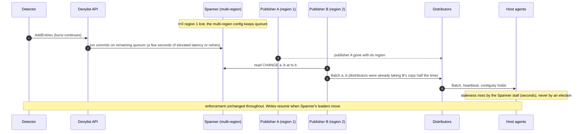

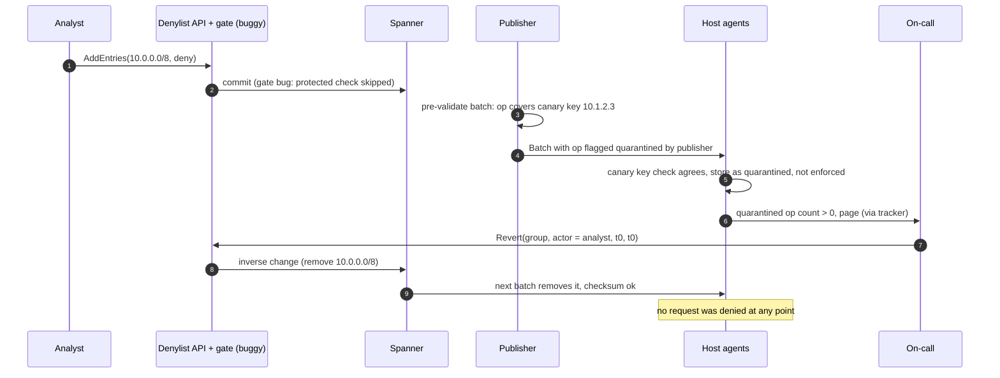

### 10.5 Exactly-once and idempotency end to end

Deny-list changes are **desired state**, not events, which makes almost everything idempotent by construction.
- **Client to API.** `request_id` dedupes retries for 24 h; independently, an add is an upsert on the entry's identity with `expires_at = max(old, new)`, so even a retry with a new `request_id` does not create a second entry. A remove of a removed entry is a no-op that still returns the original `commit_ts`.
- **Store to publisher.** Each `CHANGE` row has a unique `(group_id, bucket, commit_ts, identity)`. A publisher restart re-reads `(a, b]` and produces the identical batch.
- **Publisher to distributor.** Two publishers send identical batches; the distributor keeps the first per `(from, to)` and drops the second after comparing checksums.
- **Distributor to host.** Contiguity is the dedup: a batch with `to <= W` is dropped, a batch with `from == W` is applied, anything else is a gap to fill. Replay after reconnect is safe for the same reason.
- **Host acks.** Carry `W`; the tracker keeps the max per host, so duplicates and reordering do not matter.
- **Feeds and imports.** The feed importer computes a diff between the feed and the group's current `source = feed` entries, which is idempotent (running it twice produces an empty second diff). Import jobs record the last committed offset in the file and resume from it.
- **Revert.** Carries a `revert_id`; the inverse change set is computed once and stored, so a retried revert returns the first one's `commit_ts`.

There is no step where a duplicate can deny someone twice or undo a later change, because every apply is keyed by the entry's identity and ordered by commit timestamp.

### 10.6 Consistency model per edge

| Edge (final diagram) | Model | Where it changes |
|---|---|---|
| Writer to API to Spanner | Linearizable, commit timestamp per change | |
| Writer `Lookup` | Read-your-writes (strong read), or a snapshot read at a past time | |
| Spanner to publisher | Snapshot read at `b`: complete for `(a, b]` | Lag set by the 500 ms closed timestamp |
| Publisher to distributors | Ordered, contiguous, at-least-once (two publishers) | Deduped by `(from, to)` |
| Distributor to host agent | Ordered, contiguous, at-least-once with replay; consistent prefix | Falls back to snapshot plus replay after 60 minutes |
| Host agent to enforcement lib | Monotonic: readers see the old or the new overlay, never a mix within one lookup | New base only at a generation change |
| Across hosts | Eventual, p99 10 s, alert at 30 s | Stale beyond 5 min drains critical-tier hosts below the panic threshold |
| Host acks to tracker | Eventual, about 1 s behind | A missing host counts as stale |
| Entry `expires_at` | Evaluated against the host clock on every lookup | Clamped to `[W, W + 60 s]` when the clock is suspect |
| Kill switch | Fastest of two channels | |

### 10.7 Alternatives rejected

| Alternative | Why it looked attractive | Why rejected |
|---|---|---|
| Central deny-list service called per request | One copy, always fresh, simple | 100 M RPC/s, +0.5 ms per request, a hard dependency, and the first victim of a DDoS |
| TTL cache of lookups on each host | Small memory, familiar | IP hit rates are low; every block waits a TTL; invalidating 200k caches for one key needs the push system anyway |
| Constant-work full snapshot every few seconds (AWS Hyperplane) | No ordering, no gaps, same work on good and bad days | 100 MB × 200k per cycle. The right answer below ~1 MB of list |
| Kafka with every host as a consumer | Durable ordered log, offsets for resume | One partition per group means one broker serving 200k consumers; you rebuild the distributor tier as mirrors and relays |
| Gossip dissemination | No tree to run, robust to node loss | ~18 rounds for 200k hosts, duplicate bandwidth, no order; each host still needs gap repair |
| etcd or ZooKeeper watches from every host | Watches, revisions, resume | Sized for control-plane state (etcd suggests a few GB and ~50k writes/s at most); 200k watchers on one cluster, and a relist storm after compaction. Configerator had to put observers and proxies in front of Zeus for this reason |
| Redis on every host | Familiar data structures, TTLs built in | A syscall and loopback round trip per lookup, another process to keep alive, and its replication is not a consistent prefix with checksums |
| Bloom filter for every group | 20x less memory | Needs a remote confirm on 1% of lookups, on the deny path. Kept for long-tail groups in §5.6 only |
| Leader-elected single publisher | Obvious, one writer | Failover of 5 to 10 s inside a 10 s budget; the deterministic pair has none |
| Canary every change | Uniform safety | Blocks against a live attack would wait 10 minutes. Stage by breadth instead |
| Hosts rewind to an older version for rollback | Feels like "undo" | Breaks monotonic watermarks and drops later unrelated changes; a forward revert is one path |
| Download the snapshot every 10 minutes instead of rebasing locally | Free full resync | 100 MB × 200k / 10 min = 33 GB/s continuously, for something 1 to 2 s of local CPU does; the checksum tells us when a download is actually needed. Filter groups are the exception: a host holding only a filter has no keys to rebase from, so it downloads (§5.6) |

### 10.8 How the big companies do it

- **Meta Configerator (SOSP 2015).** Config committed to git, a tailer writes it to Zeus (a ZooKeeper fork), which pushes through a three-level tree (leader, hundreds of observers, a proxy on every server). About 4.5 s from Zeus to hundreds of thousands of servers across continents, about 14.5 s end to end with git. The proxy keeps an on-disk cache so applications can read configs "even if all Configerator components fail". A reconnecting observer sends its last transaction id and gets the missing writes. Configs over 1 MB go by BitTorrent (PackageVessel), under 4 minutes to the fleet. An automated canary takes about 10 minutes. Our tree, resume-by-watermark, local-disk copy and "large data by another path" are all this.
- **Cloudflare Quicksilver.** A replicated key-value store on every server: 2.5 trillion reads and 30 million writes a day (2020), LMDB so many processes share one store and upgrades are invisible, three tiers (top mains, main nodes, nodes), about a week of history for catch-up, and a measured p99 of 2.29 s to every machine at about 350 changes/s (2019). Its failure mode is the other half of our design: the 2019 WAF regex and the 2025 feature file both reached the whole network in seconds. Quicksilver v2 then split servers into full replicas and caching proxies once full replication stopped paying (about 20% of keys used in large data centers, 1% in small ones), which is our §5.6.
- **Google Safe Browsing (v4).** Clients hold hash prefixes (most 4 bytes, 4 to 32 allowed) of unsafe URL expressions, update with partial diffs (removals by index into the sorted list, then additions), and verify the whole local list with a SHA-256 checksum after every update, clearing and re-downloading on mismatch. A prefix hit asks the server for full hashes, so the server rarely learns what the user visited. Our checksum and our large-list variant are this.
- **Mozilla CRLite (2025).** Every revocation in the web PKI as a partitioned two-level cascade of Ribbon filters: a 4 MB snapshot every 45 days, deltas every 12 hours, 300 kB per user per day, replacing OCSP checks that blocked the handshake for 100 ms at the median. Chrome's CRLSets cover about 1% of revocations. The lesson: when the universe is known, a filter cascade can be exact.
- **AWS Hyperplane (constant work).** Customer changes are written into one config file in S3, and every node fetches and loads the whole file every few seconds, changed or not. No events, no workflow, same load on every day. It is the right design when the file is small, and the reason our §4.3 "Good" rung is not a strawman.

### 10.9 Operational runbook

- **Dashboards (five).** (1) Propagation: time for a change to reach 50% and 99% of hosts, per group and region. (2) Staleness heat map: hosts by `now - W`, per site. (3) Publisher health: store commit to batch cut lag, batch sizes, publisher checksum agreement. (4) Safety: quarantined ops, batches rejected by hosts, entries held by the gate, per-actor add rates against quota. (5) Effect: deny rate per group against its hourly baseline, would-deny rate for shadow entries, top denied keys.
- **Alerts.** Publisher lag over 5 s: page (the whole fleet is about to go stale). Over 1% of a region stale for 2 minutes: page. Any host-rejected batch or quarantined op: page the group owner and the platform on-call. Checksum mismatch on over 0.1% of hosts: page (apply bug). Group deny rate 10x baseline with no open incident: page the group owner (possible bad entry). Gate held an entry: ticket to the author. Distributor egress over 70% of NIC: ticket.
- **Rollout.** Data: the lanes in §5.5. Code: agent and library behind the normal binary rollout, 1% of hosts for a day, one region, then the world; new batch fields are ignored by old agents and enabled by a flag only after every agent understands them. Publishers and distributors: one at a time; the second publisher and the per-site redundancy make each restart invisible.
- **Rollback.** Bad data: `Revert` or `Restore(to_time)`, 1 to 2 s to 99%. A whole group misbehaving: kill switch (either channel). Bad agent build: roll back the binary; the shared-memory list survives agent restarts, so proxies never notice. Bad publisher build: stop it, the other one carries on; if both, stop both (hosts go static) and redeploy. Nothing needs a backfill: the store is the truth and every host can rebuild from a snapshot.

### 10.10 Security and abuse

- **Write authority.** Every writer authenticates with mTLS identity; each group has an ACL of actors; detectors have quotas and lane limits; broad entries need two humans. All changes are audited with actor, reason and ticket, kept 7 years.
- **Integrity to the host.** Batches and snapshots are signed by the publishers (Ed25519, keys in a key service, rotated with overlap); agents reject anything unsigned. A compromised distributor can delay or drop batches (which shows up as staleness) but cannot inject entries.
- **No secrets in the list.** API keys are stored as a SHA-256 prefix, never raw, so a host memory dump or a stolen snapshot reveals no credentials.
- **Using the deny list as a weapon.** An attacker who can make a detector deny victims (spoofed source IPs in a reflection attack, reports against a competitor's accounts) turns our safety system into their DoS. Mitigations: detectors must use signals that are hard to spoof (the TCP handshake completed before an IP is judged; account reports weighed by reporter reputation), TTLs on automated entries (default 1 h), quotas per detector, and the protected set for partners.
- **Evasion.** Attackers rotate IPs, so IP entries are short-lived and account and API-key entries carry the long-term weight. CIDR entries catch rotation within a range; that is also what makes them broad, hence the lanes.
- **Privacy.** The decision log holds IPs and account ids: 30-day retention, access-controlled, and denies for IPs sampled at 1%.

### 10.11 Evolution

- **10x entries (100 M).** Memory is the bill: 2.5 GB per host, 500 TB fleet-wide. Subscribe by role first, then denser encodings, then filter plus confirm for long-tail groups (§5.6). Snapshot boot goes peer-to-peer inside the rack. The stream, the version, and the safety layers do not change.
- **10x change rate (200k/s).** Batches grow to 6.4 MB per second per host; the per-host apply is still trivial, the distributor egress is not (32 Gbps per regional distributor). Shard the stream by group across publishers (already natural), add a second distributor level inside large regions, and compress batches (sorted IPs compress well with delta encoding).
- **New requirement: client-location scope (government-mandated blocks by the user's country).** Today scope is "which hosts enforce". Country scope is "which users it applies to": add a scope field matched against the request's geo-IP country at `check()` time, and a separate group per jurisdiction so only the relevant hosts pay for it.
- **New requirement: domains and URLs.** Add a key type for host suffixes and path prefixes, and expand each request into at most 30 expressions (5 host suffixes × 6 path prefixes, the Safe Browsing rule); each is one exact-table probe. Very large URL lists take the §5.6 filter path.
- **New requirement: per-customer lists (a Cloudflare Lists style product).** One group per customer, subscribed only by the hosts that serve that customer, with per-customer size caps. The group count grows to millions, so the publisher shards by group and distributors filter by subscription instead of forwarding everything.
- **New requirement: GDPR delete of an entry's history.** The live list has no personal data beyond the key. The `CHANGE` history and decision log do: crypto-shred per-subject history after the retention period, and keep only aggregate counts.

---

## 11. Follow-up questions to expect

Ranked by how often they come up. Each links to the edge case or deep dive that answers it.

1. **Why not call a deny-list service?** §4.1, §2. 100 M lookups/s, 0.5 ms per hop, a dependency on every request, and the first victim of a DDoS. The list is 255 MB; put it on the host.
2. **How big is it in memory, and what if it is 10x?** §2, §5.6. 255 MB per host, 51 TB fleet-wide; exact keys because a 64-bit hash key wrongly denies about 5 users a day. At 10x: role subscriptions, dense encodings, filter plus confirm for long-tail groups only. [`deep-dives/list-growth-and-tiering.md`](deep-dives/list-growth-and-tiering.md).
3. **How does a change reach every host, and how fast?** §4.3, §5.2, Flow 2. Commit timestamp, 100 ms batches at a 500 ms closed timestamp, deterministic publisher pair, three-level tree; ~1 s typical, 10 s p99. [`deep-dives/propagation-and-fan-out.md`](deep-dives/propagation-and-fan-out.md).
4. **How do you know it is everywhere? How stale can a host be?** §5.3. Watermarks with heartbeats, contiguity, state checksum, acks summarised at distributors, `GetPropagation`. [`deep-dives/watermarks-and-consistency-window.md`](deep-dives/watermarks-and-consistency-window.md).
5. **Someone denies `0.0.0.0/0`, or a detector goes rogue.** §5.5, Flow 6. Protected set, breadth lanes, impact estimate, quotas, shadow and canary modes, host validation with quarantine, two-channel kill switch, forward revert in about 1 s. [`deep-dives/safe-changes-and-blast-radius.md`](deep-dives/safe-changes-and-blast-radius.md).
6. **The central store or publisher is down.** §5.4. Fail-static; nothing on the data path changes; staleness pages at 30 s; critical-tier drain is suppressed by the panic threshold. [`deep-dives/failure-modes-and-fail-static.md`](deep-dives/failure-modes-and-fail-static.md).
7. **How fast is an unblock?** §5.5. Removes always take the emergency lane: same ~1 s path as an add, same 10 s p99.
8. **Two regions write conflicting changes.** §4.2. Spanner orders them by commit timestamp and every host applies in that order; the later one wins everywhere.
9. **A booting host, or 200k booting hosts.** §5.2, Flow 4. Local-disk copy first, replay from the distributor, snapshot with admission control; not ready until fresh.
10. **How does the lookup stay fast while the list changes?** §5.1. Immutable base plus a left-right overlay in shared memory; one writer, wait-free readers. [`deep-dives/local-lookup-and-memory-layout.md`](deep-dives/local-lookup-and-memory-layout.md).
11. **TTL entries and clock skew.** §3.3, §5.4. `expires_at` checked on every lookup; expiry never goes over the wire; a suspect clock is clamped to `[W, W + 60 s]`.
12. **Why not Kafka, gossip, or etcd watches?** §5.2, §10.7. The fan-out to 200k clients is the problem each of them leaves you to solve.
13. **What pages at 3am?** §8, §10.9. Publisher lag, regional staleness, host-rejected batches, quarantined ops, checksum mismatches, deny-rate spikes.
14. **Bloom filter vs hash set: code it.** The coding companion: [`../../concepts/bloom-filter.md`](../../concepts/bloom-filter.md) has a runnable filter and the 9.6 bits per key at 1% derivation. Then say why the base design does not use one (§5.1).
