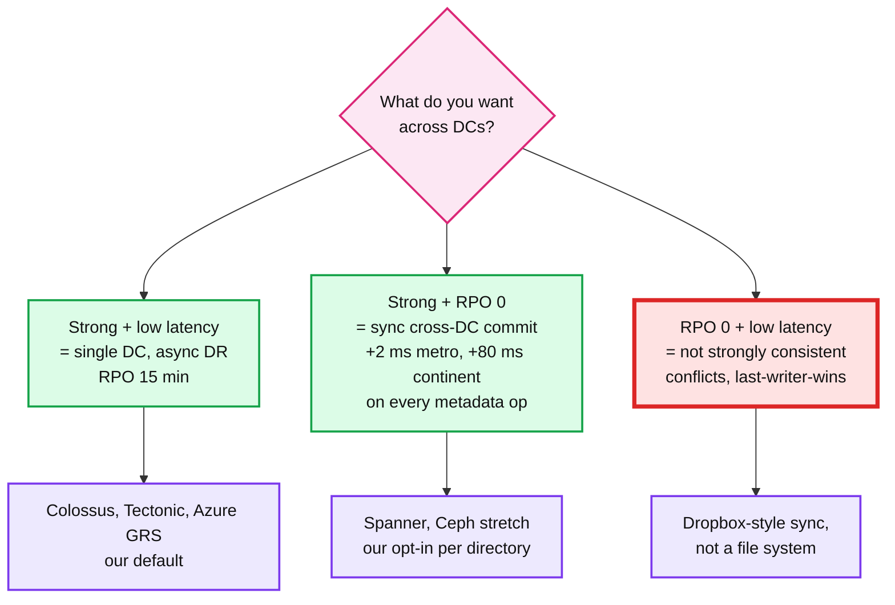
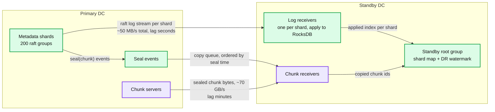

# Deep dive: disaster recovery, RPO, and why strong consistency stops at the DC wall

> One-line answer: strong consistency is a per-cluster promise. The standby DC gets every shard's Raft log within seconds and every sealed chunk within minutes, for RPO 15 min and RTO 1 h. RPO 0 is offered per directory by stretching that directory's shards across two DCs plus a witness, and it costs one cross-DC round trip on every metadata commit.

Part of [`../solution.md`](../solution.md) §5.5. Research in [`../research/interview-framing-and-dr-survey.md`](../research/interview-framing-and-dr-survey.md). Reference designs: Colossus (single DC, replication above), Tectonic (single DC), Azure GRS (async, RPO under 15 min), Ceph stretch (sync, 10 ms RTT limit).

## 1. The pick-two

The interviewer's trap: "you said strongly consistent, and you said you survive DC loss with 15 minutes of data loss. Which is it?" Answer: both, because they are promises about different things. Linearizability is a promise about the order of operations that were acknowledged. RPO is a promise about how many acknowledged operations survive the destruction of the machines that acknowledged them. Every system with async DR makes this exact pair of promises; Azure documents GRS as strongly consistent within the region and "typically under 15 minutes" of loss on a geo-failover.

## 2. Default: async replication to a standby DC

Mechanics:
- **Metadata:** each shard's leader streams its Raft log to a receiver in the standby that applies it to a RocksDB replica. The receiver is not a Raft voter; it never affects commit latency. Lag is bounded by cross-DC bandwidth, ~50 MB/s of log at 55 k mutations/s. Seconds.
- **Data:** only sealed chunks are copied (open chunks are still changing). The seal event goes into a copy queue; a copier reads the chunk from any replica and writes it to 3 chunk servers in the standby (or 14 fragments if already encoded). 200 GB/s of writes at the primary means ~70 GB/s of sealed bytes to ship after dedup of short-lived temp files (a `_temporary` file deleted within minutes is skipped by a 5 min delay on the queue). Cross-DC links of 100 Gbps x 8 = 100 GB/s. Lag minutes.
- **Watermark:** the standby root group records per shard `applied_index` and per chunk `copied`. RPO is measured, not assumed: alert when metadata lag > 10 s or the oldest un-copied sealed chunk > 15 min.
- **Deletes and GC:** shipped as log entries; the standby's GC runs on the same 24 h grace. A chunk deleted at the primary before it was copied is simply dropped from the queue.

Failover runbook (RTO 1 h target):
1. Operator declares the primary lost (no automatic failover: a partition between DCs must not produce two primaries).
2. Standby root group is promoted: it publishes a new shard map pointing at the standby receivers, which become single-node Raft groups and then add two local followers each.
3. Every chunk record whose chunk was not copied is marked `missing`. Files referencing a missing chunk return `EIO` on that range. A report lists them (this is the RPO, made concrete).
4. Clients are repointed by DNS or by the client library's DC list. They refresh the shard map and continue.
5. Writers that held leases at the primary are fenced automatically: the standby bumps every open file's epoch on promotion.

Failback: reverse the stream, reconcile with the diff of Raft indexes, no data movement for chunks that already exist on both sides (chunk ids are global and immutable).

## 3. Opt-in: RPO 0 for a directory subtree

For directories that hold ledgers, commit logs, or anything where 15 minutes is unacceptable:

- Stretch the shards that own that subtree's dentries and inodes across the two DCs plus a witness: 2 voters in DC1, 2 in DC2, 1 witness (log only, no data serving) in a third site. Commit needs 3 of 5, so it always includes one cross-DC vote. Cost: +RTT on every metadata commit for that subtree. Metro pair (2 ms): fine. Continental (80 ms): a `create` takes 85 ms instead of 5 ms.
- Data for those files: write the chain across DCs (head in DC1, mid in DC1, tail in DC2). Every 4 MB frame waits on the cross-DC hop. Throughput per writer drops to bandwidth-delay-product limits; the client keeps 16 frames in flight instead of 4.
- The witness pattern: 2 full sites plus 1 witness gives majority survival of any single site loss without a third full copy. This is Ceph stretch mode's monitor tiebreaker and etcd's learner-plus-voter guidance.
- Ceph's number for stretch mode is a 10 ms RTT ceiling between data sites. Above that, they say do not. Same for us: RPO 0 is a metro feature. Across a continent, offer it and let the tenant see the latency.

Why per directory and not per cluster: the shard map already records replica placement per shard, so the seam exists. Most data (job outputs, tables that can be recomputed) does not want to pay the latency. Say it as the Staff move: "I will not make everyone pay for a guarantee only the ledger needs."

## 4. Snapshots and backups (the third leg)

Replication copies your mistakes. A `delete -r /warehouse` replicates in seconds. Snapshots are the answer to operator error and bad deploys.

- Metadata is MVCC by Raft index in RocksDB (each dentry and inode record is versioned). A snapshot of a directory is `(subtree root, raft index per shard touched)` plus a GC hold on every chunk referenced at that index. Taking it costs a Raft write per shard involved; no data is copied because chunks are immutable.
- Reads at a snapshot: `open(path, at_snapshot)` resolves dentries at the recorded index. Same shards, same code path, a `read_index` parameter.
- Retention: hourly for 24 h, daily for 30 days. GC of a snapshot releases its holds; chunks with no holds and no live reference are deleted.
- Backup off-cluster: a snapshot's chunk list plus metadata export is streamed to a cold store (tape, or a second cluster in a third DC) for the once-a-decade "both DCs and a bug" event.

This is HDFS `.snapshot` (copy-on-write metadata, shared blocks), sharded.

## 5. Numbers to say out loud

| Thing | Number | Source |
|---|---|---|
| Raft commit inside a DC | 1 to 5 ms | Spanner reports ~5 ms Paxos in-region |
| Metro DC pair RTT | 1 to 2 ms | |
| Continental RTT | 60 to 80 ms | |
| Sync cross-region write penalty | +80 to 100 ms | Kafka multi-region measurements |
| Azure GRS RPO | typically < 15 min, no SLA | Azure docs |
| Ceph stretch RTT ceiling | 10 ms | Ceph docs |
| Our default RPO / RTO | 15 min / 1 h | |
| Our opt-in RPO 0 cost | +1 RTT per metadata commit, per 4 MB frame | |
| Metadata DR lag alert | 10 s | |
| Chunk DR lag alert | 15 min | |

## 6. What to say in 60 seconds

"Strong consistency is per cluster. The standby DC follows every shard's Raft log within seconds and receives every sealed chunk within minutes, and we alert on both watermarks, so the RPO is measured, not hoped. Failover is an operator decision, never automatic, because a partition must not create two primaries. On promotion, un-copied chunks are marked missing and reported, that list is the RPO made concrete. For the one percent of data that cannot lose 15 minutes, stretch its shards across two DCs plus a witness and pay a round trip on every commit. And snapshots, because replication copies your mistakes."
