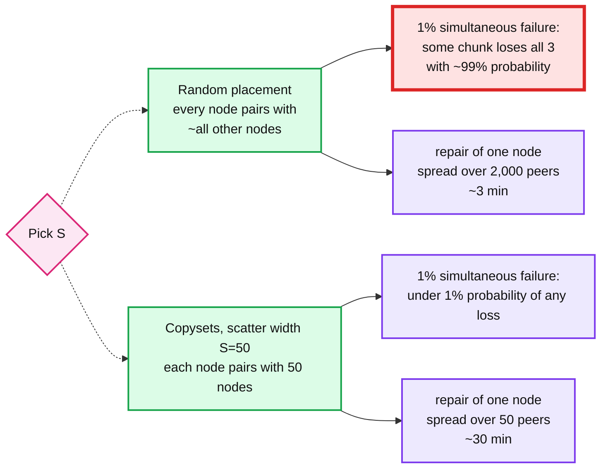
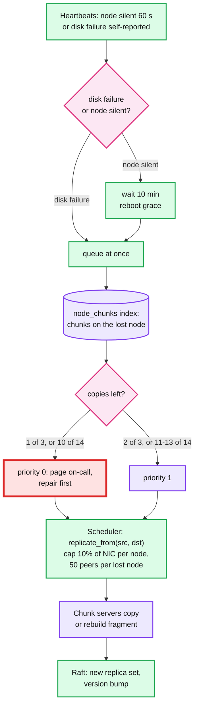

# Deep dive: durability, replication vs erasure coding, repair

> One-line answer: 3 replicas across 3 racks and 3 power domains for open and hot data, RS(10,4) across 14 failure domains for sealed cold data, copyset-aware placement so a correlated failure rarely covers a whole replica group, and cluster-parallel repair under a bandwidth cap so the window between the first and second loss is minutes, not days.

Part of [`../solution.md`](../solution.md) §5.3. Research in [`../research/data-layer-survey.md`](../research/data-layer-survey.md). Papers: Copysets (ATC '13), Azure LRC (ATC '12), Tectonic (FAST '21), HDFS-7285.

## 1. The durability equation

Durability is about the window between the first loss and the repair, and about whether failures are independent.

```
Independent model, 3 replicas, one chunk:
  p1 = P(one specific replica's disk dies in a year)      = AFR = 0.02
  W  = repair window after the first loss                  = 0.5 h
  p2 = P(a second specific replica dies inside W)          = AFR x W / 8,760 h = 0.02 x 0.5 / 8,760 = 1.1e-6
  p3 = P(the third dies inside W too)                      = 1.1e-6
  P(lose the chunk in a year) ~ 3 x p1 x 2 x p2 x p3        = 3 x 0.02 x 2 x 1.1e-6 x 1.1e-6 = 1.5e-13

Across 11 B chunks: expected losses per year = 11e9 x 1.5e-13 = 0.0017. One chunk every ~600 years. This is the "11 nines" claim.

The same math with W = 56 h (one node repairing alone at 100 MB/s):
  p2 = 0.02 x 56 / 8,760 = 1.3e-4, P ~ 3 x 0.02 x 2 x 1.3e-4 x 1.3e-4 = 2e-9
  Expected losses = 11e9 x 2e-9 = 22 chunks per year.
```

Two lessons the interviewer wants to hear: repair time is the knob that moves durability by four orders of magnitude, and this model is a lie because failures are correlated.

## 2. Correlated failure and copysets

A rack losing power kills 40 nodes at once. Random placement in a 5,000-node cluster puts some chunk's 3 replicas on 3 of any 40-node set with high probability once there are billions of chunks. Copysets (Cidon et al.) measured it: with random 3x placement, a simultaneous 1% node failure loses some data with ~99% probability; with copyset placement, under 1%.



Placement rule in the chunk shard's allocator:
1. Hard constraints: 3 different racks, 3 different power domains, no disk over 85% full, no node currently draining.
2. Soft constraint: pick from the node's precomputed copyset list (scatter width 50), generated offline as random permutations and stored in the root group. New nodes are added by generating permutations that include them.
3. Tie-break: fewest recent allocations (spread write load), then most free space.

Trade-off, stated: scatter width 50 means a node's 100 TB is repaired by 50 peers, ~30 min at 300 MB/s each, instead of 3 min. Independent-failure durability drops from 1.5e-13 to ~5e-12 per chunk per year. Correlated-failure durability improves by two orders of magnitude. Correlated failures are the ones that actually happen, so this is the right trade.

## 3. Replication vs erasure coding

| Scheme | Overhead | Survives | Repair reads | Write cost | Read cost (healthy) | Read cost (degraded) |
|---|---|---|---|---|---|---|
| 3x | 3.0x | 2 | 1 chunk | 3 writes | 1 read | 1 read |
| RS(6,3) | 1.5x | 3 | 6 fragments | 9 writes + encode | 6 reads (or 1 with contiguous layout) | 6 reads + decode |
| RS(10,4) | 1.4x | 4 | 10 fragments | 14 writes + encode | 10 reads | 10 reads + decode |
| LRC(12,2,2) | 1.33x | 3 (most 4) | 6 for a local repair | 16 writes | 12 reads | 6 or 12 |

Our rule: 3x while open and for 7 days after seal (hot), then RS(10,4) if the chunk's read rate is under a threshold. 80% of bytes end up encoded. Overhead across the fleet: `0.2 x 3 + 0.8 x 1.4 = 1.72x`. At 100 PB logical that is 172 PB raw vs 300 PB for all-3x, ~130 PB saved, ~$1.3M/yr at $10/TB/yr of raw disk, more with power and space.

Why never on the write path:
- A 4 KB append to an RS(10,4) stripe is a read-modify-write of 10 data fragments and 4 parity fragments. ~10x amplification. Append-only chunks written by a single writer do not have this problem only if the whole chunk is encoded once, after seal.
- Every hot read would need 10 fragments from 10 nodes. p99 becomes the slowest of 10 disks.
- Tectonic does encode on the write path with RS(9,6) for some tenants because their blob workload writes whole blocks at once. Our workload has appends.

Layout: contiguous, not striped. The 64 MB chunk is split into 10 x 6.4 MB data fragments, 4 parity fragments computed over them. A healthy read of bytes [0, 6.4 MB) is one fragment read. HDFS EC stripes with 1 MB cells so that a read of any range hits all data nodes in parallel; better throughput for large scans, worse for small reads. Cold data in our system is mostly full-file scans, so either works; contiguous makes degraded reads simpler.

Encoding pipeline (per chunk shard, background):
1. Pick sealed chunks older than 7 days with read heat below threshold.
2. Read from one replica (CRC-verified), compute 4 parity fragments, write 14 fragments to 14 nodes in 14 racks (across all 3 power domains).
3. Read all 14 back, verify.
4. Raft: chunk record -> `encoded`, version bump, fragment locations.
5. Delete the 3 replicas.
6. Crash anywhere before step 4: fragments not referenced by any record are collected by GC. Crash after: replicas not referenced are collected. Nothing is ever in a state where the record points at data that does not exist.

Un-encode: if an encoded chunk gets hot (read heat above threshold for 1 h), decode once, write 3 replicas, swap the record. Cost of getting the cold/hot guess wrong is one extra round of writes, not correctness.

## 4. Repair



Numbers:
| Event | Bytes to repair | Parallelism | Time at 300 MB/s per peer |
|---|---|---|---|
| 1 disk (20 TB) | 20 TB | 50 peers | 22 min |
| 1 node (100 TB) | 100 TB | 50 peers | ~1.9 h, or 30 min if we let each lost node's copysets overlap and use ~200 peers |
| 1 rack (40 nodes, 4 PB) | 4 PB | ~2,000 peers | ~1.1 h |
| 1 power domain (1,700 nodes) | 170 PB | not repairable in place; run degraded, page everyone | days |

EC repair is worse: rebuilding one 6.4 MB fragment reads 10 fragments (64 MB of traffic for 6.4 MB of output). A lost node with 100 TB of fragments generates 1 PB of repair reads. This is why Azure built LRC (local parity cuts it to 6 reads) and why we keep EC on cold data where a slower repair is acceptable and raise the priority-0 threshold to "fewer than 11 of 14".

Repair never starves users: the cap is 10% of each node's NIC. If repair is pinned at cap for an hour, that is a ticket, not a page, unless priority-0 chunks exist.

## 5. Scrubbing and checksums

- CRC32C per 64 KB block, computed by the client, verified by every replica before writing, stored next to the chunk. End-to-end: a flipped bit in a NIC or in RAM on any hop is caught before it is persisted.
- Read path verifies and fails over to another replica on mismatch, reporting the bad one.
- Scrubber reads every chunk every 14 days at 1% of disk bandwidth: 100 TB per node / 14 days = 83 MB/s, well under 1% of 24 spindles. Findings go to the chunk shard, which re-replicates or rebuilds.
- Expected findings: HDD uncorrectable bit error rate ~1 in 1e15 bits read means ~1 bad sector per 125 TB read. 500 PB scrubbed every 14 days finds ~4,000 bad sectors per cycle. That is the baseline; alert on 3x baseline per node.

## 6. Placement across failure domains, precisely

- Rack: 40 nodes, one top-of-rack switch, one PDU. Rack loss takes all 40.
- Power domain: ~40 racks. Loss takes 1,700 nodes. Not repairable in place; the design survives it with 2 of 3 replicas and 10 of 14 fragments, at degraded read latency, until power returns.
- 3 replicas on 3 racks in 3 power domains. 14 fragments on 14 racks, at most 4 fragments per power domain, so losing one domain leaves at least 10 and the chunk stays readable. With 3 domains that is 4 + 4 + 4 = 12 slots for 14 fragments, so the rule cannot be met with only 3 power domains. Either run 4 or more power domains, or accept RS(10,4) being unreadable (not lost) during a domain outage. Say which one you pick; we pick 4 domains for the EC pool and accept the constraint on the allocator.
- AZ / DC: not a placement domain for the sync path. DR handles it (see [`disaster-recovery.md`](disaster-recovery.md)).

## 7. What to say in 60 seconds

"Three replicas on three racks in three power domains while data is hot, RS(10,4) across 14 racks once it is sealed and cold, 1.7x fleet overhead. Placement is copyset-aware so a rack or power event almost never takes all copies of anything. Repair is cluster-parallel under a 10% bandwidth cap, so the window after a first loss is tens of minutes, and that window is what sets the durability number: about 1e-12 per chunk per year, one lost chunk in centuries on paper, with the honest caveat that correlated events dominate and copysets are the defense. CRC32C on every 64 KB, verified on every read and rescrubbed every two weeks."
