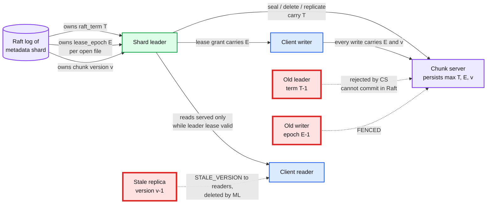

# Deep dive: every lease and epoch in the system, and the split-brain proof

> One-line answer: three monotonic numbers, each owned by a Raft log, each carried on every message it protects: the metadata shard's Raft term fences old leaders, the file's lease epoch fences old writers, the chunk version fences old replicas. Split brain is not prevented, it is made harmless.

Part of [`../solution.md`](../solution.md) §5.1, §10.4. Concept notes: Raft, leases, fencing tokens (see `concepts/` when written).

## 1. The map

| Token | Owner | Bumped when | Carried on | Checked by | Fences |
|---|---|---|---|---|---|
| `raft_term` | each shard's Raft group | leader election | every MDS -> chunk server command | chunk server (persisted max per shard) | a deposed metadata leader |
| leader lease | shard leader, derived from heartbeats | every majority heartbeat ack | nothing; local decision | leader itself | a deposed leader serving stale reads |
| `lease_epoch` | inode record in Raft | writer lease granted or recovered | every client write | chunk server (persisted per chunk) | a writer whose lease expired |
| `chunk_version` | chunk record in Raft | replica set change, seal, EC layout | every read and write, every heartbeat | chunk server and client | a replica that missed a change |
| capability token | signed by MDS at open | expires (1 h) or lease epoch changes | every data RPC | chunk server (signature) | clients without authorization |

## 2. Metadata leader: Raft term plus leader lease

Writes: Raft. A leader can only commit with a majority. Two leaders cannot both have a majority. A deposed leader's un-committed entries are overwritten by the new leader's log. Standard.

Reads: the interesting part. Linearizable reads on a Raft leader need proof that it is still the leader. Two ways:
- **ReadIndex**: leader records its commit index, sends a heartbeat round, waits for a majority ack, then serves the read at that index. Always safe, costs a round trip per read (or per batch of reads).
- **Leader lease**: after a majority heartbeat ack at local monotonic time `t`, the leader may serve reads locally until `t + election_timeout x (1 - drift_bound)`. Followers will not start an election until `election_timeout` after the last heartbeat they received, which they received after `t`. So no new leader exists before the lease expires, given clock drift under `drift_bound`.

We use leases (2 s election timeout x 0.9 = 1.8 s lease, renewed every 100 ms heartbeat) with ReadIndex as the fallback when the lease is in doubt (a heartbeat round failed, or a clock-drift check fired). This is the CockroachDB and TiKV design.

The drift assumption, said out loud: monotonic clocks on two machines advance at rates within 10% of each other over 2 s. Real hardware is within 0.01%. A VM pause does not break it: a paused leader's monotonic clock stops, so it under-estimates elapsed time, which is the dangerous direction; the fix is that on resume the leader compares wall-clock delta to monotonic delta and drops the lease if they disagree by more than 100 ms.

## 3. Writer lease and epoch

- `open(APPEND)` commits `lease{inode, client_id, epoch E+1, expires = now + 60 s}` in the inode shard's Raft log, then returns E+1 to the client. The chunk's replicas are told the epoch at `allocate_chunk`.
- Renew every 20 s: a Raft write that extends `expires`. Cheap, batched with other writes.
- Expiry check runs on the leader every second. Expired lease: commit `epoch E+2`, `lease = none`, then send `seal(chunk, epoch E+2)` to the replicas. From that commit on, any write with E+1 is `FENCED`.
- Why the epoch must be in Raft before the grant: if the leader granted E+1, crashed before committing, and the new leader granted E+1 to a different client, two writers would share an epoch. Committing first makes epochs unique.
- Why the chunk servers must persist the epoch: a chunk server that restarts and forgets the epoch would accept a fenced writer. It persists max epoch per chunk in RocksDB before acking any command that raises it.

The 60 s window, honestly: a dead writer holds the file for up to 60 s. A committer that cannot wait calls `recover_lease`, which does the expiry steps immediately. This is HDFS's soft-limit recovery.

## 4. Chunk version

- Bumped in Raft whenever the set of replicas or the meaning of "complete" changes: seal, replica replacement after repair, conversion to EC, hot-chunk replication increase.
- After the bump the MDS tells the live replicas the new version. Replicas that do not get the message (partitioned, dead) keep the old one and report it in their next heartbeat, where the MDS marks them for deletion.
- Clients get the version with the chunk list at `open` and send it on every read. A replica with a different version refuses, so a reader is never served bytes from a replica that missed a truncation.

Subtle case: the version is bumped on seal, and the truncate to the sealed length is sent with the new version. A replica that acks the truncate has both. A replica that has the new version but somehow not the truncate cannot exist because they are one command. A replica that has neither is stale by version and refused.

## 5. The proof, as the interviewer wants it

Claim: after a partition heals, no acknowledged operation is lost and no reader has seen a state that did not happen.

1. Any acked metadata write was majority-committed (Raft). The new leader's log contains it (leader completeness). Not lost.
2. Any acked data write was fsynced on all three replicas before the ack. A later seal picks a length >= all acked bytes (`min(client_committed, replica lengths)` where every replica length >= acked bytes). Not lost.
3. A partitioned leader's reads were served only inside its lease, which ended before any new leader could exist. So those reads observed the latest committed state at that moment. Not stale.
4. A partitioned leader's commands to chunk servers carry its old term. Chunk servers that have heard from the new leader reject them. Chunk servers that have not are, by definition, in the same state as before the new leader existed, and the new leader will re-issue with the same deterministic rule (seal at min length). Idempotent. Not divergent.
5. A partitioned writer keeps its old epoch. The moment the new leader recovers the lease, the replicas learn the new epoch and fence the writer. Any bytes the writer pushed after that are past the sealed length and truncated. Nothing it wrote was acked past the seal. Not visible.
6. A stale replica keeps an old version. Every read carries the current version. Not served.

Each of the six is one token or one Raft property. That is the whole argument. If the interviewer asks "what if the chunk server's clock is wrong", the answer is that no chunk server decision depends on a clock; only the metadata leader lease does, and §2 covers it.

## 6. What we did not build, and why

- **A separate lock service (ZooKeeper, Chubby).** Every lease already lives in an inode record in a Raft log. A second consensus system would be a second thing to page on and a second clock to trust.
- **Client-side fencing tokens on metadata ops.** Metadata ops go through Raft; they do not need a token because the log is the serialization point.
- **TrueTime or hybrid logical clocks.** Needed for cross-shard snapshot reads at a global timestamp. Our only cross-shard op is rename, done with 2PC and intents, so no global clock.

## 7. Numbers to say out loud

- Election timeout 1 s, heartbeat 100 ms, failover 1 to 2 s.
- Leader lease 0.9 x election timeout, drift budget 10%, real drift 0.01%.
- Writer lease 60 s, renew every 20 s, `recover_lease` for impatient committers.
- Chunk version bumps per chunk lifetime: typically 2 (seal, EC), plus one per repair.
