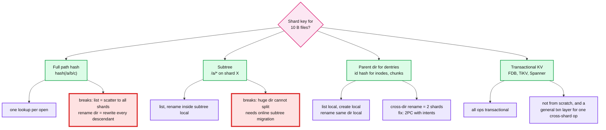
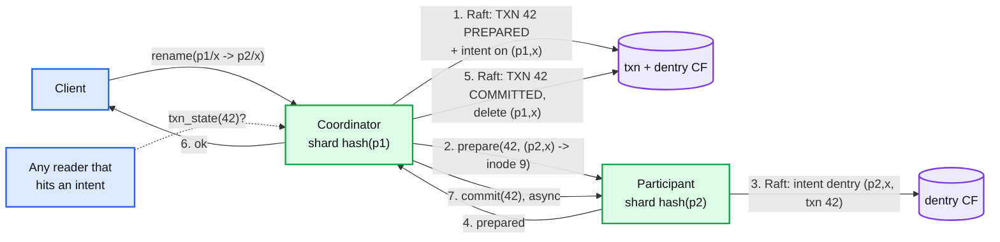

# Deep dive: sharding the namespace

> One-line answer: key dentries by parent directory and everything else by id hash, so `list` and same-directory ops are single-shard, and pay for cross-directory rename with a two-row 2PC instead of a general transaction layer.

Part of [`../solution.md`](../solution.md) §4.1, §4.4, §5.2. Research notes in [`../research/metadata-layer-survey.md`](../research/metadata-layer-survey.md).

## 1. The four ways to shard a tree, and what each breaks

| Key | `open` cost | `list(dir)` | rename file across dirs | rename dir | huge dir | Used by |
|---|---|---|---|---|---|---|
| Full path hash | 1 lookup | all shards | 2 shards | O(descendants) | fine | nobody at scale |
| Subtree | depth lookups, mostly 1 shard | 1 shard | 2 shards if subtrees differ | 1 shard unless crossing | cannot split | CephFS |
| Parent-dir dentries + id hash | depth lookups, cached | 1 shard | 2 shards | 1 or 2 shards, O(1) | split by name hash | Tectonic Name layer, HopsFS, InfiniFS, ours |
| Transactional KV | depth lookups | 1 range | txn | txn | fine | JuiceFS, 3FS |

Why ours: the two operations that must be cheap and single-shard are `list` (job planning lists directories constantly) and `create` in a directory (job output). Both are local with parent-dir keying. Rename of a directory is O(1) because children are keyed by the directory's inode id, which does not change. The price is cross-directory rename, which is rare enough (5 k/s) that 2PC is fine.

## 2. What lives on which shard

| Record | Key | Shard | Why |
|---|---|---|---|
| Dentry | `parent_inode_id \| name` | `hash(parent_inode_id)` | list and create are one range on one shard |
| Inode | `inode_id` | `hash(inode_id)` | spreads attribute reads; a directory's children's inodes are spread across shards, which is what we want for open-heavy load |
| Chunk | `chunk_id` | `hash(chunk_id)` | 11 B records, no locality needed |
| `node_chunks` | `node_id \| chunk_id` | same shard as chunk | repair scan per node per shard |
| Lease | `inode_id` | with inode | recovery is local to the inode |
| Txn | `txn_id` | coordinator = src dentry shard | crash recovery replays local txn table |
| Shard map | range -> raft group | root group | tiny, cached everywhere |

Tectonic's variant: dentries in the Name layer keyed by dir id, file-to-block in a File layer keyed by file id, block-to-chunk in a Block layer keyed by block id. Same idea, three separate KV tables in ZippyDB. Ours co-locates inode and chunk records on the same kind of shard to save one hop on `open`.

## 3. Path resolution and the client cache

Depth-d path = d sequential dentry lookups, each possibly on a different shard. At depth 5 that is ~2.5 ms of in-DC RPC before the first byte. Three fixes, in order of when to apply:

1. **Client dentry cache with directory versions.** Each directory inode carries a `version` bumped on every dentry change under it. The client caches `(parent, name) -> child` and validates by sending `(parent, cached_version)`; the shard returns `NOT_MODIFIED` or the new entry. Warm client: one round trip to the leaf. Near-root directories change rarely, so the hottest shard (root) sees only version checks.
2. **Lazy version checks.** Check the version of each cached directory at most every 5 s instead of per call. Trade: a client may resolve through a renamed directory for up to 5 s. Still linearizable at the leaf because the final `get_inode` is. Use this for read-heavy clients.
3. **Speculative resolution (InfiniFS).** Assign inode ids so the child's id is predictable from `hash(parent_id, name, generation)`. The client guesses all d inode ids and validates them in one parallel round. On a miss (a rename changed a generation) it falls back to sequential. Evaluated at 100 B files in the FAST '22 paper. This is the 10x seam.

## 4. Cross-shard rename: two-row 2PC with intents

The claim: rename touches exactly two rows (the source dentry, the destination dentry) plus a txn record. That is small enough to do without a general transaction manager.

Visibility rule (this is what makes it atomic to observers):
- A dentry with an intent is not trusted on its own. The reader asks the coordinator for the txn state (one RPC, cached for 100 ms).
- `PREPARED`: source is present, destination absent.
- `COMMITTED`: source absent, destination present.
- `ABORTED` or unknown after GC: source present, destination absent (the participant will clean the intent).
- So every observer sees either the before-state or the after-state, and the switch happens at exactly one Raft commit (step 5). That is linearizability for rename.

Failure cases:
- Coordinator crashes after step 1: new leader of the same Raft group sees `PREPARED`, re-sends prepare (idempotent by txn id). Or, after 30 s, aborts.
- Participant crashes after step 3: its new leader has the intent; coordinator's retry of prepare returns `prepared` again.
- Coordinator crashes after step 5 before step 7: new leader sees `COMMITTED`, re-sends commit. Meanwhile readers on the participant resolve the intent as committed.
- Participant refuses: dst exists (and not `replace` mode), dst parent is `DELETING`, or the cycle check fails. Coordinator writes `ABORTED`, clears the intent.

Locking and deadlock:
- The intent is the row lock. Two renames that touch the same dentry serialize on the intent (`INTENT_PENDING`, retry with backoff).
- Two renames that touch two dentries each in opposite order could deadlock. Rule: take intents in `(inode_id, name)` order regardless of which is source, so the coordinator is the lower-keyed shard. This is CephFS's lock ordering.
- Directory delete takes a `DELETING` intent on the directory, which any rename into or out of it checks. Rename out of a `DELETING` dir is refused (the subtree is going away); rename into it is refused.

Cost: one extra Raft commit on the participant and two cross-shard RPCs. ~3 to 5 ms total, vs ~1.5 ms for a same-shard rename. At 5 k renames/s, of which maybe 30% cross shard, this is 1.5 k participant commits/s spread over 200 shards. Nothing.

What Tectonic and Colossus do instead: refuse. Tectonic's paper says cross-directory moves are not atomic because ZippyDB has no cross-shard transactions. That is a legitimate Staff answer too, if you say what the application then has to do (Spark's committer would need a manifest-based commit instead of rename). We build it because the prompt says "strongly consistent" and the workload is job committers.

## 5. Hot directories

The interviewer's mental model: one directory maps to one shard, so a busy directory is a hot shard. Push back with numbers first, then give the fixes.

| Load | What it hits | Limit | Verdict |
|---|---|---|---|
| 1 M creates/min in one dir (17 k/s) | one shard's Raft log | 20 to 50 k/s with group commit | fine |
| Same, but each create updates parent mtime and count | one RocksDB row, serialized | ~5 k/s before write stalls | **this is the real hot spot**. Fix: no synchronous parent update |
| 500 k opens/s across the tree, no client cache | root shard: 500 k x depth lookups | ~100 k/s | melts. Fix: client cache |
| `list` of a 10 M entry dir | one range scan, 1 GB of dentries | seconds, blocks the shard's read threads | fix: paginate, 10 k per page, cursor |
| 100 k creates/s in one dir | one shard | 50 k/s | needs directory splitting |

Directory splitting, the last resort:
- Parent inode records `split_k = 4`. Dentry key becomes `parent_id | hash(name) mod k | name`, and the shard map routes the 4 sub-ranges to 4 shards.
- `list` is a 4-way merge by name. Create and lookup compute the sub-range from the name; still single-shard.
- Splitting an existing directory is an online range move like a shard split.
- Merge back on shrink is the rollback; write it first, ship the feature behind a flag.

Rename of a split directory still O(1) because children key on the directory's inode id, not its name.

## 6. Shard split and move

- Split trigger: RocksDB size over 60 GB or sustained 15 k writes/s.
- Mechanism: new Raft group is created; the source takes a RocksDB checkpoint of the key sub-range (instant, hard links), ships it, then streams the log tail; at cutover the root group commits the new shard map entry and the source shard answers `WRONG_SHARD` for the moved range. Clients refresh the map. Downtime for the moved range: the log-tail catch-up, under 1 s.
- Move (no split) is the same without the range cut, used for rebalancing leaders across failure domains.

## 7. Numbers to say out loud

- 200 shards, 40 GB each, 3 replicas, 600 metadata nodes. Shard loss = 0.5% of files.
- Per shard: 350 writes/s, 2.5 k reads/s, 50x headroom.
- Same-shard rename ~1.5 ms, cross-shard ~4 ms.
- Warm client `open` = 1 RPC. Cold = depth + 1 RPCs, ~3 ms at depth 5.
- Root shard without a client cache: 2 M lookups/s. With: version checks only.
