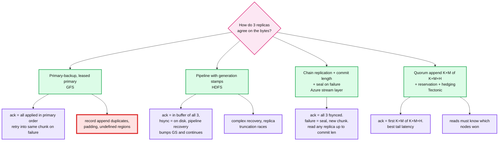
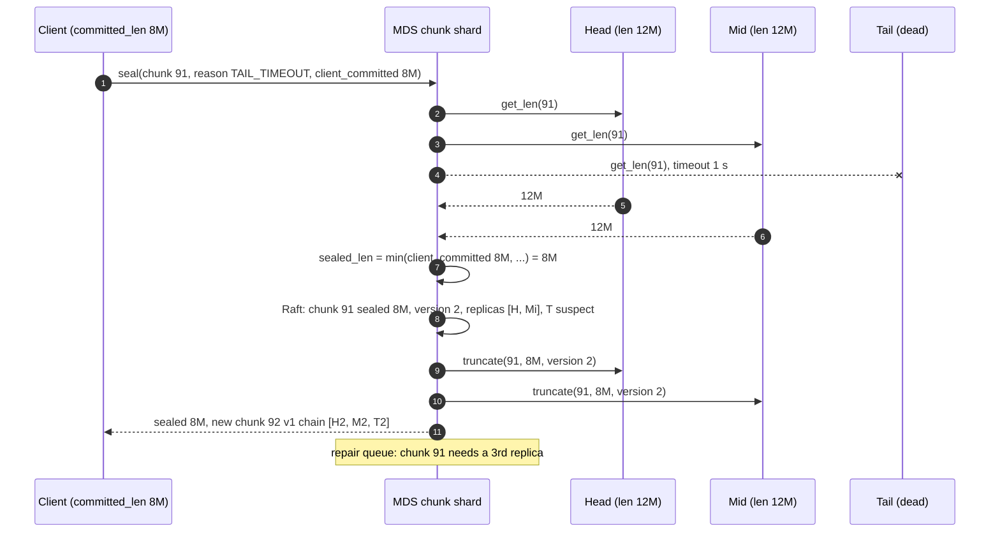

# Deep dive: the write path and what "committed" means

> One-line answer: chain replication of append-only 64 MB chunks, ack only after all three replicas fsync, a per-chunk committed length that readers respect, and on any failure seal the chunk at the agreed length and continue in a new one. Never repair a chunk that is being written.

Part of [`../solution.md`](../solution.md) §4.2, §4.3, §10.4, §10.5. Research in [`../research/data-layer-survey.md`](../research/data-layer-survey.md). Closest published design: Azure Storage stream layer (SOSP '11).

## 1. Four write-path models, and why chain plus seal wins here

GFS is red because its recovery rule (retry the mutation into the same chunk) is what produces duplicates and "defined but inconsistent" regions. The fix is not a better retry. The fix is to never retry into a chunk that has seen a failure.

## 2. The protocol

Per open file the client holds: writer lease `(inode, epoch E)`, current chunk `(chunk_id, version v, chain [H, M, T])`, `committed_len`.

Append of a 4 MB frame at file offset X:
1. Client computes CRC32C per 64 KB block, sends `write(chunk_id, v, E, chunk_off, data, crcs)` to H.
2. H verifies CRCs, checks `v` and `E` against its persisted values for the chunk, appends to its SSD WAL, forwards to M. M does the same and forwards to T.
3. T appends, fsyncs the WAL, acks M with its new length. M fsyncs (in parallel with the forward), acks H. H fsyncs, updates `committed_len = chunk_off + 4 MB`, acks the client.
4. Client advances `committed_len`. When the chunk reaches 64 MB, client calls `MDS.seal(chunk_id, 64 MB)` and `MDS.allocate_chunk`.

Ordering: the head assigns the chunk offset. Because there is exactly one writer (lease) and the client sends frames in order over one connection, `chunk_off` is always the current length. Any other offset is rejected: too small is `OFFSET_ALREADY_COMMITTED` (a lost-ack retry), too large is a bug.

Reads of the open chunk: any replica serves bytes at offsets below the head's `committed_len`. A reader asks H for `committed_len` (cheap, in memory), then reads from any of the three. Safe because a byte below committed_len is by definition fsynced on all three, and append-only means it will never change.

## 3. What "committed" means, stated exactly

- **Committed** = the head has acked the frame to the client. Invariant: acked bytes are fsynced on all three replicas.
- **Sealed length** = a length recorded in Raft by the MDS after asking the replicas. Invariant: sealed length <= every reachable replica's length, and sealed length >= every acked byte.
- **Visible to readers** = below `committed_len` of an open chunk, or below `sealed_len` of a sealed chunk.

A reader can never see a torn or un-acked byte because the two invariants above hold and readers never read past those lengths.

## 4. Seal on failure

Why `min(client_committed, replica lengths)` and not `max`:
- The bytes between 8M and 12M were forwarded but never acked. The client will resend them into chunk 92. Keeping them in 91 would duplicate.
- If the client itself is gone (lease recovery, no `client_committed` available), MDS takes the minimum length among reachable replicas. Those bytes might include un-acked data, which is harmless: the writer is gone, nobody will resend, and the file simply ends with the last bytes that made it to all reachable replicas. This is the Azure stream layer rule.

Why seal and not repair in flight:
- Repairing a chain mid-write (replace T with T2, copy 12M, resume) is what HDFS pipeline recovery does. It needs generation-stamp bumps, per-replica truncation, and a race-free handoff. It is the most bug-prone code in HDFS.
- Sealing needs one Raft write and two truncates. A new chunk costs one metadata record. A file that hits many failures becomes many short chunks; a background compactor rewrites them into full chunks and swaps the inode's chunk list atomically.

## 5. Fencing on the write path

Every write carries `(chunk version v, lease epoch E)`. The chunk server persists the highest `v` and `E` it has been told about for each chunk (by MDS commands, which themselves carry the MDS raft term). Rejections:

| Condition | Response | Client action |
|---|---|---|
| `E < known E` | `FENCED` | lease was recovered; reopen the file |
| `v < known v` | `STALE_VERSION` | chunk was resealed or re-replicated; refresh from MDS |
| `v > known v` | `STALE_VERSION` | this replica missed a bump; client tries another replica, MDS will fix the replica |
| offset < len | `OFFSET_ALREADY_COMMITTED` | lost ack; advance |
| offset > len | `BAD_OFFSET` | bug; abort |
| MDS command term < known term | ignored | old MDS leader; harmless |

## 6. Chunk server durability internals

- WAL on SSD (group fsync every 1 ms or 1 MB): ack latency ~0.2 to 0.5 ms per hop. Data is copied to the HDD chunk file asynchronously; on restart the WAL replays.
- Chunk file preallocated with `fallocate` to 64 MB, one file per chunk on XFS. No inode churn, sequential HDD writes.
- CRC32C per 64 KB stored in RocksDB alongside `(chunk_id, version, len, epoch)`. Verified on read, on scrub, and before forwarding in the chain.
- `hsync()` for the client is a no-op in this design: every ack already implies fsync on three nodes. HDFS separates `hflush` from `hsync` because its ack does not imply disk. We pay SSD WAL cost to make the simple rule true.

## 7. Latency budget for a 4 MB frame

| Step | Time |
|---|---|
| Client CRC + send 4 MB at 25 Gbps | 1.3 ms |
| H forward to M, M to T (pipelined with receive) | +0.3 ms |
| T WAL fsync (SSD, group) | 0.3 ms |
| Acks back up the chain | 0.2 ms |
| Total | ~2 to 3 ms per frame, 16 frames per 64 MB chunk, pipelined |
| 64 MB chunk | ~25 ms at line rate, ~500 ms p99 budget allows a slow disk |

The client keeps 4 frames in flight; the head orders them by offset.

## 8. Why not Tectonic's quorum append

Tectonic reserves capacity on K+M+H nodes and takes the first K+M acks. Tail latency improves because a straggler is dropped rather than waited on. The costs: the metadata must record which nodes won for every block, readers must consult that record (no "read from any replica"), and the reservation adds a round trip. For a design where seal-and-move already bounds the straggler cost at one 2 s timeout per failure, the extra machinery is not worth it. Say this as the "revisit if write p99 misses 500 ms" item in the trade-off table.

## 9. What to say in 60 seconds

"One writer per file, fenced by a lease epoch. Chunks are append-only and immutable once sealed. Writes go head to mid to tail, the head acks only when all three have fsynced, so committed means on three disks. Readers read any replica up to the committed length. On any failure we do not repair the chunk, we seal it at the acked length in Raft, truncate the survivors, and keep writing in a new chunk. Retries after a lost ack are rejected by offset, so appends are exactly-once. That is the difference from GFS record append."
