# Diagrams: strongly consistent distributed file system

The D1 to D12 set from `hld/CLAUDE.md` §4. Diagrams already embedded in [`solution.md`](solution.md) are linked, not pasted twice. Colors per root `CLAUDE.md` §3. Red is only for the thing that breaks first.

| # | Diagram | Where |
|---|---|---|
| D1 | Context | below |
| D2 | Data flow | below |
| D3 | Component architecture | [`solution.md` §6](solution.md#6-final-design) |
| D4 | Happy path per FR (4 sequences) | 4.1 and 4.2 and 4.4 in `solution.md`, 4.3 below |
| D5 | Failure paths (3 sequences) | 2 in [`solution.md` §10.4](solution.md#104-failure-timelines), duplicate-append below |
| D6 | Decision flow: write path with seal-and-move | below |
| D7 | Entity relationship | [`solution.md` §3.3](solution.md#33-data-model) |
| D8 | State machines: chunk, file, rename txn | below |
| D9 | Deployment topology | below |
| D10 | Scaling and partitioning | [`solution.md` §5.2](solution.md#52-how-does-metadata-scale-to-10-b-files-and-500-k-opss-and-what-about-a-hot-directory) |
| D11 | Failure mode map | below |
| D12 | Migration off HDFS | below |

---

## D1. Context

Our system is one box. Everything around it and what flows on each edge.

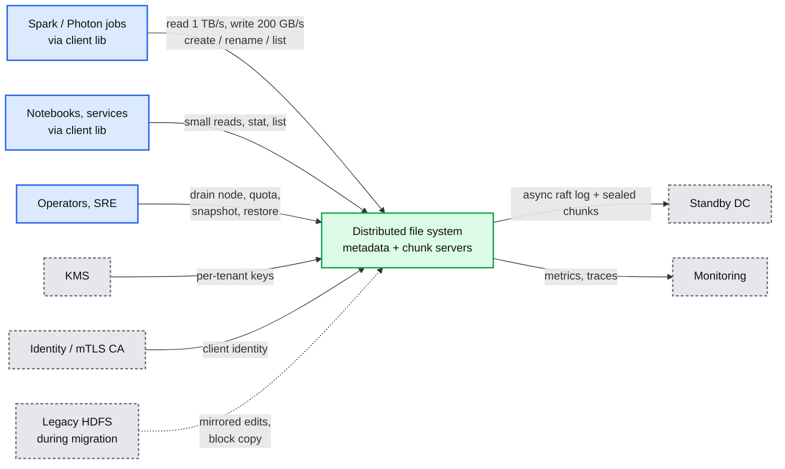

## D2. Data flow

Inputs to outputs, with data name, size, rate on each edge.

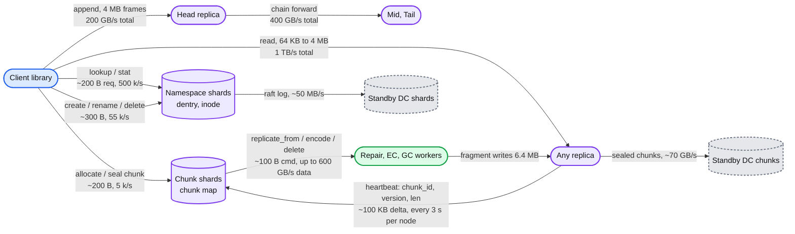

## D4. Happy path: read (FR 3)

The other FR sequences (path resolution, append, rename) are in `solution.md` §4.1, §4.2, §4.4.

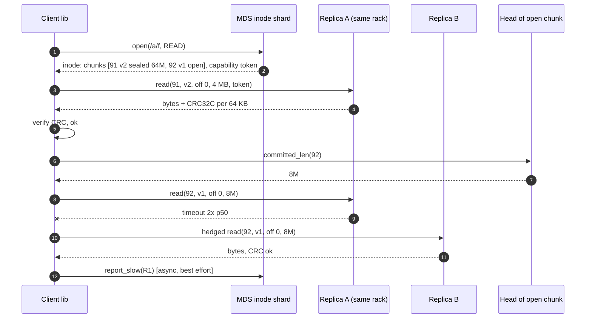

## D5. Failure path: duplicate append after lost ack

Timelines for "leader dies after ack" and "chunk server dies mid-append" are in `solution.md` §10.4.

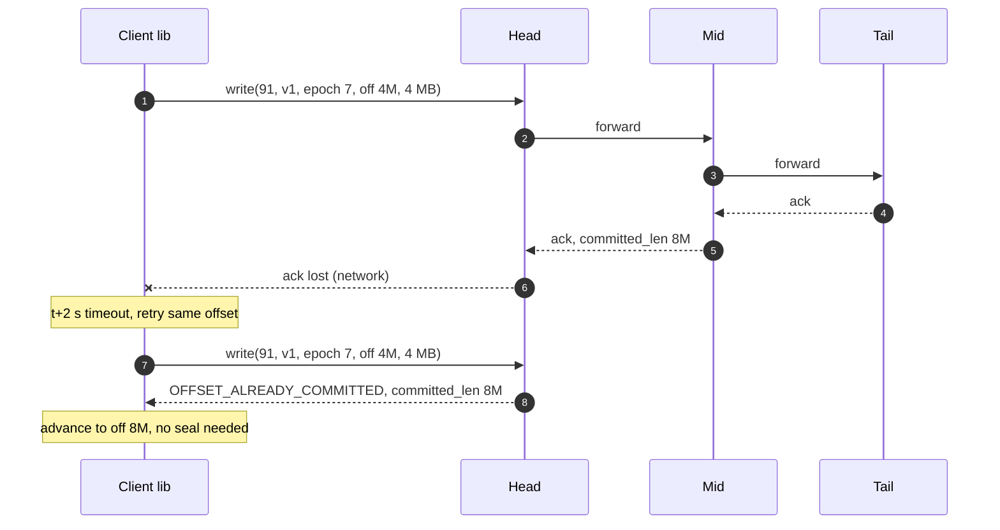

## D6. Decision flow: the write path

Branching logic inside the client library's append loop, the hardest piece of client code.

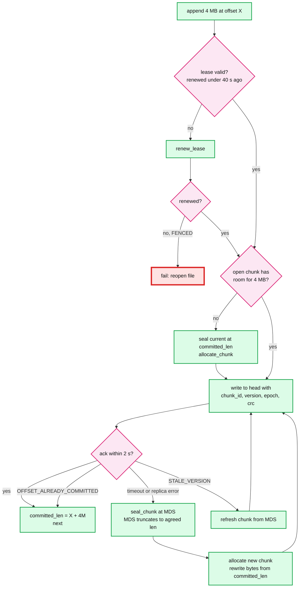

## D8. State machines

### D8a. Chunk lifecycle

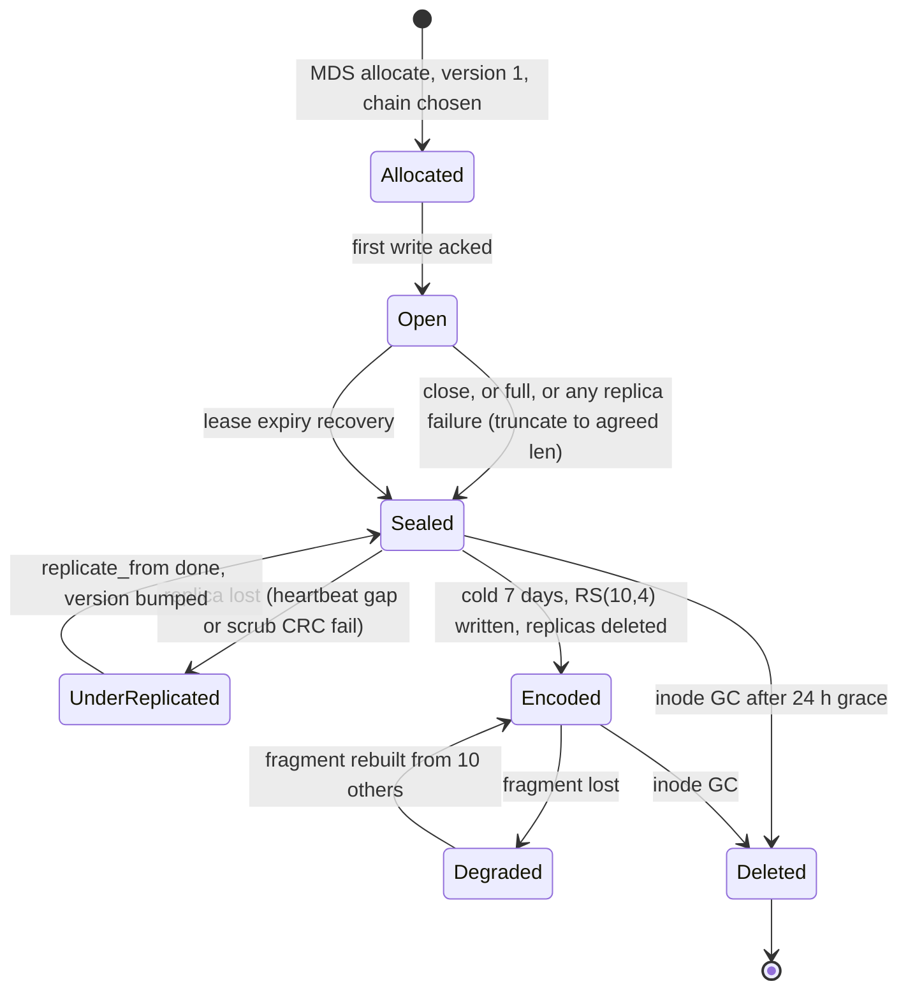

### D8b. File (inode) lifecycle

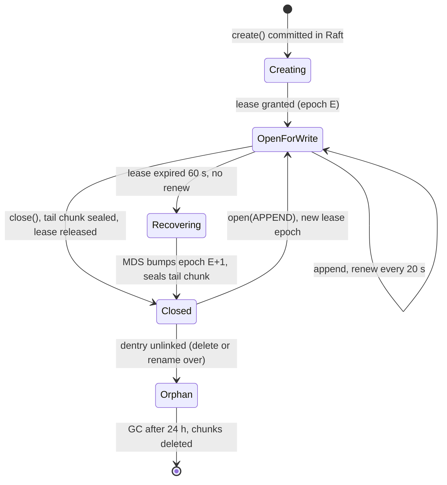

### D8c. Cross-shard rename transaction

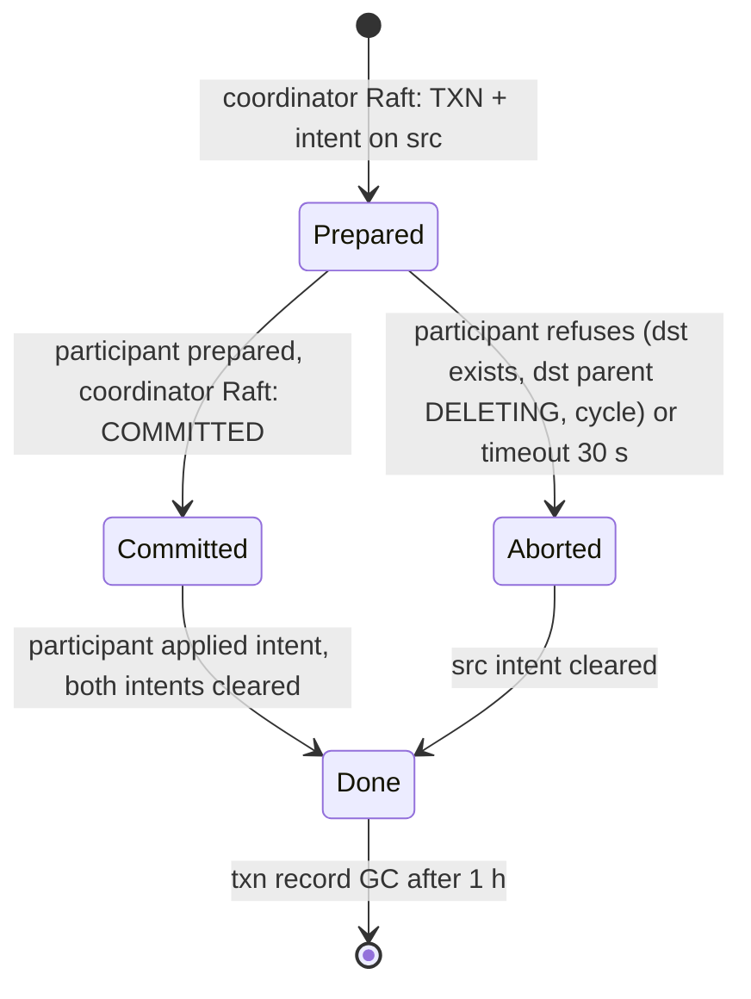

## D9. Deployment topology

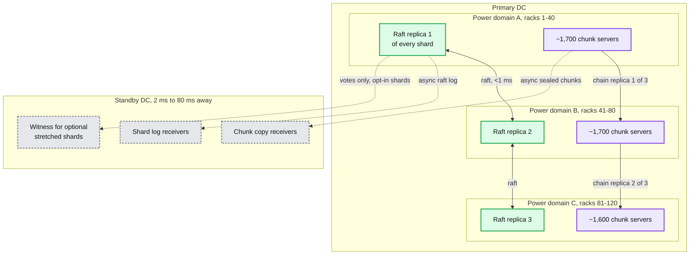

## D11. Failure mode map

```mermaid
%% D11: component -> what fails -> blast radius -> mitigation
flowchart TD
    M[Metadata shard] --> M1[leader dies] --> M1b[0.5% of files, 2 s] --> M1c[Raft election, client retry with request id]
    M --> M2[disk corruption] --> M2b[one shard] --> M2c[restore checkpoint + replay log, followers still serve]
    RT[Root shard] --> RT1[leader dies] --> RT1b[all cache-miss lookups, 2 s]:::critical --> RT1c[client cache absorbs, election]
    CS[Chunk server] --> CS1[node dies] --> CS1b[none for users] --> CS1c[read other replica, seal-and-move, repair 3 min]
    CS --> CS2[bit rot] --> CS2b[one replica] --> CS2c[CRC on read + scrub, re-replicate]
    RK[Rack or power domain] --> RK1[loss] --> RK1b[2% of nodes, 2 PB repair, 1 h] --> RK1c[3 domains per chunk, repair budget]
    NET[Network partition] --> NET1[leader isolated] --> NET1b[stale leader]:::critical --> NET1c[lease expiry + term fencing]
    CL[Client library] --> CL1[bad release] --> CL1b[every caller]:::critical --> CL1c[prefix-gated rollout, server rejects unknown versions]
    DC[Datacenter] --> DC1[loss] --> DC1b[everything, RPO 15 min] --> DC1c[promote standby, runbook RTO 1 h]

    class M,RT,CS,RK,NET,CL,DC service
    class M1,M2,RT1,CS1,CS2,RK1,NET1,CL1,DC1 decision
    class M1c,M2c,RT1c,CS1c,CS2c,RK1c,NET1c,CL1c,DC1c store
    class RT1b,NET1b,CL1b critical

    classDef service  fill:#dcfce7,stroke:#16a34a,stroke-width:2px,color:#111
    classDef store    fill:#ede9fe,stroke:#7c3aed,stroke-width:2px,color:#111
    classDef decision fill:#fce7f3,stroke:#db2777,stroke-width:2px,color:#111
    classDef critical fill:#fee2e2,stroke:#dc2626,stroke-width:4px,color:#111
```

## D12. Migration off HDFS

Each phase has a rollback point. No phase needs downtime.

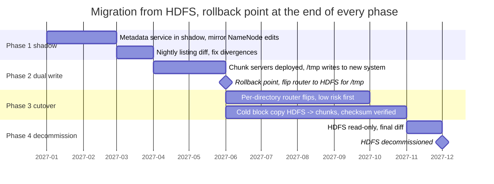
