# HLD: Strongly consistent distributed file system (no S3, no "just GFS")

> One-line answer: a metadata service sharded into Raft groups (dentries keyed by parent directory, inodes and chunk records keyed by id) that owns the whole namespace and chunk map, plus thousands of dumb chunk servers holding immutable 64 MB chunks written through a synchronous 3-node chain and sealed on any failure. Leases and epoch numbers on every write make a stale leader, stale client, or stale replica harmless. Sealed cold chunks are erasure-coded to RS(10,4).

Sources this follows: Tectonic (FAST '21), Azure Storage stream layer (SOSP '11), Colossus blog posts, HDFS HA and EC design docs, InfiniFS (FAST '22). Raw notes with links in [`research/`](research/). Diagrams D1 to D12 are in [`diagrams.md`](diagrams.md).

---

## 1. Understanding the problem

Interviewer's framing (Databricks, Meta E6): "Design a strongly consistent distributed file system. You cannot use S3 or an existing object store. GFS is not an acceptable answer because it is not strongly consistent." The second sentence is the tell. They want the mechanisms GFS lacks: sharded metadata, fenced writers, no duplicate records, no stale replicas.

### 1.1 Functional requirements

Core:
1. **Namespace ops**: `create`, `open`, `stat`, `list(dir)`, `delete`, `rename`. Hierarchical paths.
2. **Write large files**: append-only writer, file split into chunks over many nodes, one file can exceed one disk.
3. **Read**: any client reads any byte range of any file, sees every acknowledged write.
4. **Atomic rename and delete**, including rename across directories. This is what Spark, Delta, and every job committer rely on.

Below the line (say it out loud):
- Random overwrite inside a file. Append-only plus whole-file rewrite covers analytics workloads.
- Multiple concurrent writers to one file. One writer per file via lease.
- POSIX extras: hard links, symlinks, xattrs, byte-range locks.
- Cross-datacenter active-active. Strong consistency is a per-cluster promise; the second DC is disaster recovery.

### 1.2 Non-functional requirements

Ask for scale first. Numbers assumed for a Databricks-style DC:

| Dimension | Core target | Below the line |
|---|---|---|
| Files | 10 B files, 100 PB logical, 500 PB raw | 100 B files (10x, see §10.11) |
| Metadata QPS | 500 k ops/s peak (open, stat, list), 50 k creates/s, 5 k renames/s | |
| Data throughput | 1 TB/s read, 200 GB/s write, aggregate | |
| Latency | metadata p99 < 10 ms; first byte p99 < 20 ms; 64 MB chunk write p99 < 500 ms | sub-ms metadata |
| Consistency | **Linearizable metadata. Read-after-write data. No stale or torn read, ever** | |
| Durability | 11 nines per year on sealed data; survive 2 node losses, 1 rack, 1 power domain | region loss with RPO 0 |
| Availability | 99.95% reads, 99.9% writes, single DC | |
| DR | RPO 15 min, RTO 1 h on DC loss | |

The consistency row is the requirement that drives everything. It rules out async replication on the write path, rules out "read from any replica" unless replicas are provably identical, and forces a fenced single writer.

---

## 2. Back-of-envelope

```
Files             = 10 B, mean 10 MB, heavy tail (most files < 1 MB, most bytes in files > 1 GB)
Logical bytes     = 100 PB
Chunk size        = 64 MB (see §4.2)
Chunk records     = large files: 100 PB / 64 MB = 1.6 B
                    small files: ~9 B files x 1 chunk each = 9 B
                    total ~ 11 B chunk records
Replicas          = 3x for hot / open data, RS(10,4) = 1.4x for sealed cold data
Raw bytes         = 20 PB hot x 3 + 80 PB cold x 1.4 = 60 + 112 = ~172 PB
                    + headroom and repair slack -> plan 250 PB raw, budget says 500 PB. Fine.

Metadata bytes    = inode 200 B x 10 B = 2 TB
                    dentry 100 B x 10 B = 1 TB
                    chunk rec 150 B x 11 B = 1.65 TB
                    total ~ 5 TB, plus RocksDB overhead ~ 8 TB
Metadata shards   = 8 TB / 40 GB per shard = 200 shards x 3 Raft replicas = 600 metadata nodes
                    (or 100 shards on bigger boxes; pick 200 so one shard loss touches 0.5% of files)
Per-shard load    = 500 k / 200 = 2.5 k ops/s per shard, 250 creates/s. A Raft group with batching does 20 k+ writes/s. Headroom 10x.

Storage nodes     = 5,000 nodes x 24 x 20 TB HDD = 2.4 EB raw budget, we use 500 PB, so nodes can be smaller.
                    Pick 5,000 nodes x 100 TB = 500 PB.
Per-node read     = 1 TB/s / 5,000 = 200 MB/s. 24 spindles do ~2 GB/s sequential. Fine.
Per-node write    = 200 GB/s x 3 replicas / 5,000 = 120 MB/s. Fine.
Network per node  = 25 Gbps = 3 GB/s. Repair budget 10% = 300 MB/s.

Repair of 1 node  = 100 TB spread over ~2,000 peers -> each peer streams 50 GB at 300 MB/s -> ~3 min. Data-at-risk window ~3 min if repair starts at once.
```

Implications:
- Metadata fits on hundreds of machines, not one. Sharding is mandatory, and 10 B files x 3 hops of path resolution means the client dentry cache is not optional.
- Data path must bypass metadata. 1 TB/s through any service tier is a non-starter.
- Repair is cluster-parallel or the durability math fails (§5.3).

---

## 3. The set-up

Product-style set-up: this is an API that other engineers program against.

### 3.1 Core entities

- **Dentry**: `(parent_inode_id, name) -> child_inode_id, type`. One per path component.
- **Inode**: `inode_id -> type, size, mtime, perms, writer_lease, chunk_list[]`.
- **Chunk**: `chunk_id -> version, state (open | sealed | encoded), committed_len, replicas[3] or ec_fragments[14], crc_summary`.
- **Chunk server (CS)**: `node_id -> rack, power_domain, disks[], epoch, last_heartbeat`.
- **Lease**: `(inode_id, client_id, lease_epoch, expires_at)`. Exactly one per open-for-write file.

### 3.2 API

Client library API (the "file system client" every job links). All calls carry a client id and a request id for idempotency.

| Call | Args | Returns | Notes |
|---|---|---|---|
| `create(path, flags)` | path, exclusive? | inode_id, lease | Fails if exists and exclusive |
| `open(path, mode)` | mode = READ or APPEND | handle, inode snapshot, lease if APPEND | |
| `append(handle, bytes)` | up to 4 MB per call | committed offset | Client library batches, chains to chunk servers |
| `hsync(handle)` | | committed offset | Forces the commit point (§4.2) |
| `close(handle)` | | final size | Seals the tail chunk, releases lease |
| `read(handle, offset, len)` | | bytes | Client reads chunk servers directly |
| `stat(path)` | | inode attrs | Linearizable |
| `list(dir, cursor, limit)` | | entries, next cursor | Paginated, snapshot per page not across pages |
| `rename(src, dst)` | | ok | Atomic, cross-directory allowed |
| `delete(path, recursive?)` | | ok | Atomic unlink, async reclaim |

Internal RPCs (not for users): `MDS.allocate_chunk`, `MDS.seal_chunk`, `MDS.renew_lease`, `CS.write(chunk, version, lease_epoch, offset, data, crc)`, `CS.read`, `CS.seal`, `CS.report_chunks`, `CS.replicate_from`.

### 3.3 Data model

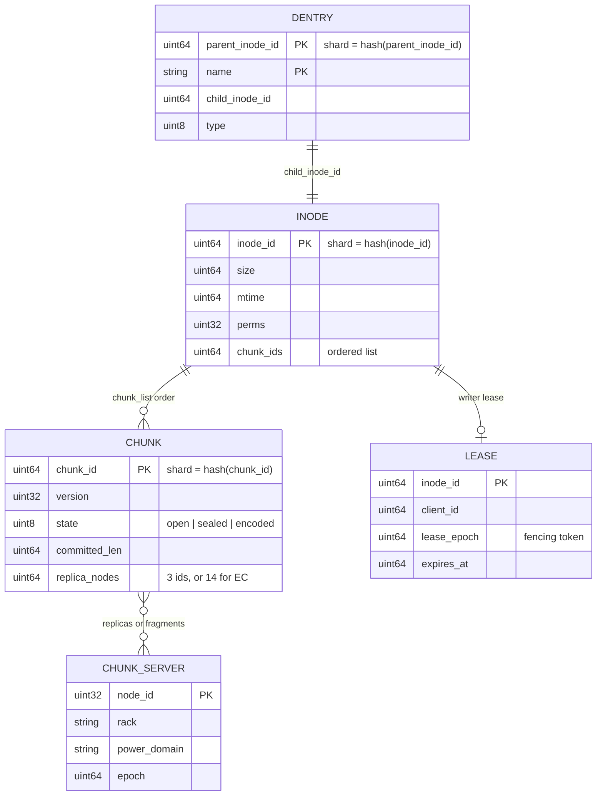

Access patterns this serves:
- `list(dir)` = range scan on `DENTRY` with prefix `parent_inode_id`. One shard, one scan.
- Path resolution `/a/b/c` = 3 point lookups on `DENTRY`, each possibly on a different shard. Client caches `(parent, name) -> inode` with a directory version for invalidation.
- `open` = `INODE` point lookup, then `CHUNK` lookups only for the ranges actually read.
- Repair = scan `CHUNK` where `replica_nodes` contains a dead node. Secondary index per shard: `node_id -> chunk_ids`.

Partition key: `parent_inode_id` for dentries so a directory listing and a create-in-directory are single-shard; `inode_id` and `chunk_id` hashed for everything else. The consequence, cross-directory rename touching two shards, is handled in §4.4. See [`deep-dives/metadata-sharding.md`](deep-dives/metadata-sharding.md) for why not path hash or subtree.

---

## 4. High-level design

One subsection per functional requirement.

### 4.1 Clients create, stat, list, and resolve paths (namespace)

**Bad: one metadata server holding the namespace in RAM (HDFS NameNode, GFS master).**
- Approach: a single process with the whole tree in memory, an edit log on disk, checkpoints.
- Why it breaks: 10 B files x ~300 B = 3 TB of heap. HDFS tops out in the low hundreds of millions of files per NameNode. 500 k ops/s on one JVM with a global namespace lock is also a wall. And it is a single point of failure: a restart replays hours of edit log.

**Good: one Raft group, RocksDB state machine (Ozone OM style).**
- Approach: 3 or 5 nodes, all namespace mutations go through a Raft log, state lives in RocksDB on NVMe, not in heap. Failover in seconds, no edit-log replay.
- Cost: still one write pipeline. A Raft group tops out around 20 to 50 k writes/s with batching, and 8 TB of RocksDB on one box is an operational nightmare (compaction, backups, restore time).

**Great: N Raft groups, keyed as in §3.3, with a client-side dentry cache.**
- Approach: 200 shards. Each shard is a Raft group of 3 with its own RocksDB. A shard map (which key range lives on which group) sits in a tiny "root" Raft group and is cached by every client. Reads are linearizable via Raft leader lease (ReadIndex when the lease is in doubt).
- Path resolution: client looks up `(root, "a")` on shard X, `(a, "b")` on shard Y, `(b, "c")` on shard Z. Sequential. Depth 5 = 5 round trips = ~2.5 ms in-DC. The client dentry cache keeps `(parent, name) -> child` and a per-directory `version`; the shard returns `NOT_MODIFIED` on a version check, so a warm client resolves a path with one round trip to the leaf shard.
- Challenges: cross-shard operations (rename) need a protocol (§4.4). Hot directories concentrate on one shard (§5.2). Shard split and move must be online (§10.11).

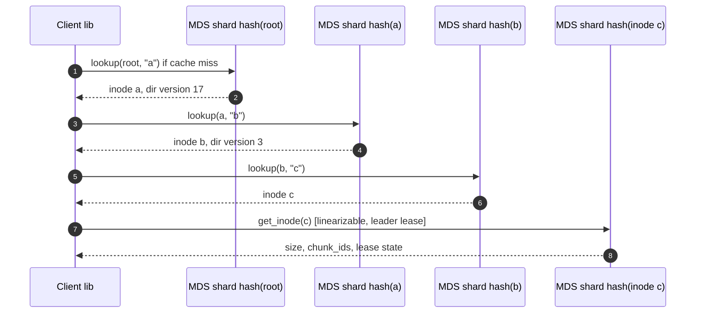

### 4.2 Clients write large files (chunking, replication, commit)

**Bad: client streams the file to one chunk server, which replicates asynchronously.**
- Why it breaks: the ack arrives before replicas exist. One disk death loses acknowledged bytes. Not strongly consistent, not durable.

**Good: fixed-size chunks, client writes to all 3 replicas in parallel, ack when all 3 fsync.**
- Approach: on open-for-append the MDS grants a writer lease with `lease_epoch`. Client asks MDS `allocate_chunk` and gets `(chunk_id, version=1, replicas=[cs1, cs2, cs3])` placed across 3 racks and 3 power domains. Client sends each 4 MB write to all 3 with `(chunk_id, version, lease_epoch, offset, crc32c)`. Chunk servers append to a chunk file, fsync (WAL on SSD, data on HDD), ack. Client acks the caller when all 3 acked.
- Cost: the client burns 3x its upload bandwidth. Tail latency is the slowest of 3 disks. A slow replica stalls the whole write.

**Great: chain replication with a commit length, sealed on any failure, never repaired in flight (Azure stream layer model).**
- Approach: client sends to the head replica, head forwards to mid, mid to tail, tail fsyncs and acks back up the chain, head acks the client only when all three have persisted. Client bandwidth is 1x. Every replica tracks `committed_len` = the largest offset it knows all three have. Reads of an open chunk are served only up to `committed_len` asked from the head.
- On any replica timeout (say 2 s), the client does not retry into that chunk. It calls `MDS.seal_chunk(chunk_id)`. MDS asks reachable replicas for their lengths, records the minimum agreed `committed_len` in Raft, bumps the chunk to `sealed`, and allocates a fresh chunk for the rest of the write. Nothing is ever appended to a chunk after a failure, so no replica can diverge.
- Commit point, stated precisely: **an append is committed when the head has acked it, which implies all three replicas have fsynced it.** A crash of the client before ack means the bytes may exist on replicas but are past `committed_len`; the seal on lease recovery truncates the chunk to the agreed length. A reader can never see a byte that is not on all three replicas and at or below the sealed or committed length.
- Challenges: the chain adds 2 hops of latency (in-DC, ~0.2 ms each, irrelevant next to fsync). A slow head still hurts; we mitigate with a 500 ms per-4 MB budget and aggressive seal-and-move. A file written through many failures fragments into many small chunks; a background compactor merges sealed short chunks.
- Push back on the textbook answer: GFS-style record append with duplicate suppression is not needed. Because we have one fenced writer per file and we never retry into a failed chunk, an append is exactly-once by construction. The client's retry after a seal goes to a new chunk at a known offset.

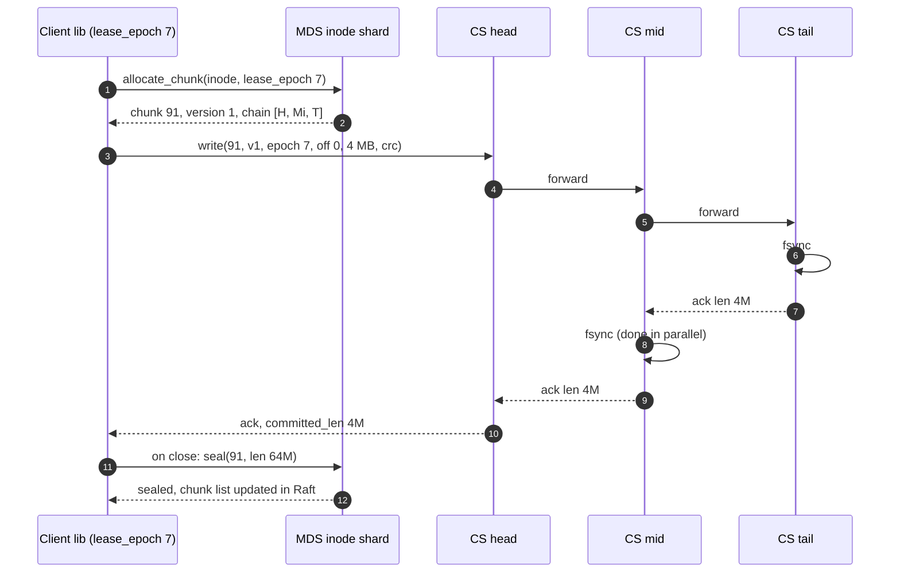

### 4.3 Clients read any byte range and never see stale data

**Bad: read from the "closest" replica with no version check.**
- Why it breaks: a replica that missed a seal or a version bump serves old bytes. This is the GFS stale-replica problem.

**Good: read from any replica, but only chunks the MDS says are sealed, with per-64 KB CRC32C.**
- Approach: `open` returns the inode's chunk list with versions. Client picks a replica (prefer same rack), sends `read(chunk_id, version, offset, len)`. The chunk server rejects a version it does not have. Client verifies CRC32C on each 64 KB block and fails over to the next replica on mismatch, reporting the bad replica to MDS.
- Cost: tail chunk of an open file is not readable, so "tail -f" style readers wait for close.

**Great: same, plus reads of the open tail chunk up to `committed_len`, and hedged reads.**
- Approach: for an open chunk the client asks the head for `committed_len` and reads up to it from any replica. Since bytes below `committed_len` are on all three replicas and immutable once written (append-only), any replica is safe. Hedged read: if the first replica has not responded in 2x its p50, issue the same read to a second replica, take the first answer.
- Challenges: a stale client with an old inode snapshot may read a chunk that was since deleted (file deleted and space reclaimed). Chunk servers return `GONE`, client re-stats. This is read-your-writes for data with a linearizable metadata anchor: stat is linearizable, and any chunk the stat lists is immutable and fully replicated. See §10.6.

### 4.4 Rename and delete are atomic, including across directories

**Bad: rename = copy data + delete source.**
- Why it breaks: 2x the bytes, minutes for a TB, and a crash in the middle leaves both. Every job committer that renames `_temporary/part-0` to `part-0` would double the write cost.

**Good: metadata-only rename, atomic only when source and destination directories share a shard (Tectonic and Colossus do exactly this: no atomic cross-directory move).**
- Approach: rename is "delete dentry A, insert dentry B" in one Raft log entry. Inode id does not change, chunks are untouched.
- Cost: cross-directory rename is not atomic. Tectonic documents it as unsupported. For Spark's commit protocol, that means a job commit can be observed half done. The prompt says "strongly consistent", so we need Great.

**Great: two-phase commit across shards, with the transaction record in Raft, lock ordering by inode id, and a visibility rule that makes the intermediate state invisible.**
- Approach: the client's shard-aware library picks the source shard as coordinator. Coordinator writes a `TXN{id, src=(p1,"x"), dst=(p2,"x"), state=PREPARED}` record in its Raft log, along with an intent marker on the source dentry. It sends `prepare` to the destination shard, which writes an intent dentry `(p2, "x", txn_id)` in its Raft log. Coordinator then writes `COMMITTED` and both shards apply and remove intents. If either shard sees an intent, a reader resolves it by asking the coordinator for the txn state: `PREPARED` means "treat source as present, destination as absent", `COMMITTED` means the reverse. A crashed coordinator's new Raft leader replays the txn table and finishes or aborts.
- Locks: intent markers act as row locks. Two renames are ordered by taking intents in `inode_id` order, so no deadlock. Rename of a directory into its own subtree is rejected by walking dst's ancestors on the coordinator before prepare (the ancestor walk is cached and re-validated under intent).
- Delete: `delete(path)` removes the dentry in one Raft entry, and moves the inode id to a per-shard `orphans` table with a timestamp. A GC job walks orphans after a 24 h grace period, tells chunk servers to delete the chunks, then drops the inode. Recursive delete of a directory is a subtree walk that marks the root dentry with a `DELETING` intent so no create can land under it, then deletes children in batches, then the root. Reads under a `DELETING` root return `ENOENT`.
- Challenges: the 2PC adds one extra Raft commit and one cross-shard RPC, ~3 to 5 ms. At 5 k renames/s that is nothing. The real cost is code complexity: the intent-resolution path must exist in every read. Push back on the textbook: you do not need a global lock service or a global transaction manager. Two shards and a txn record are enough because rename touches exactly two rows. See [`deep-dives/metadata-sharding.md`](deep-dives/metadata-sharding.md) §4.

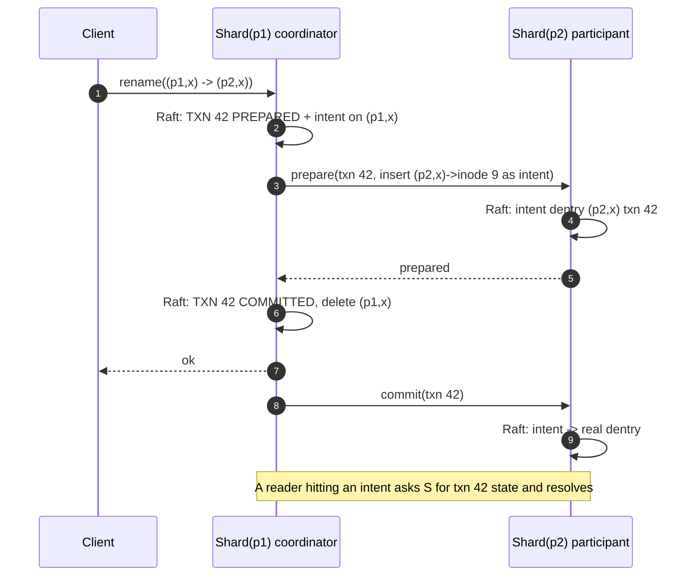

---

## 5. Deep dives

One per non-functional requirement, phrased as the interviewer asks it.

### 5.1 "How is metadata linearizable, and what stops two leaders after a partition?"

Walk the write path: client -> shard leader -> Raft log -> RocksDB apply -> ack. Three places to lie: a stale leader, a stale client lease, a stale chunk replica.

**Bad: primary with async standby and a VIP failover script.**
- Why it breaks: the old primary keeps acking writes into a log nobody else has. When the VIP moves, those writes vanish. Client saw an ack, later reads do not see the write. That is a linearizability violation and the interviewer knows it.

**Good: Raft per shard, ack only after majority commit, reads go through the log (ReadIndex).**
- Works: a deposed leader cannot commit because it no longer has a majority. Reads via ReadIndex are linearizable.
- Cost: every read costs a heartbeat round to the majority. At 500 k reads/s across 200 shards that is 2.5 k heartbeat rounds/s per shard, tolerable but wasteful, and it doubles read latency.

**Great: Raft plus leader leases for reads, plus explicit epochs on every outgoing command.**
- Leader lease: the leader serves reads locally while its lease (say 2 s, renewed by heartbeats, with clock-drift margin 10%) is valid. A new leader cannot be elected until the old lease could have expired, so two leaders never both believe they hold the lease. Reads drop to one local RocksDB get.
- Fencing token 1, MDS to chunk servers: every command from an MDS leader carries `(shard_id, raft_term)`. A chunk server remembers the highest term it has seen per shard and rejects lower. A partitioned old leader trying to seal or delete chunks is ignored.
- Fencing token 2, client to chunk servers: every write carries `lease_epoch`. On lease recovery the MDS bumps the epoch in Raft and tells the chunk's replicas. A client with the old epoch gets `FENCED` on its next write and must reopen.
- Fencing token 3, chunk replicas: `chunk version`, bumped on every replica-set change. Heartbeat reports `(chunk_id, version)`; stale versions are deleted.
- Challenges: leases need bounded clock drift. We use monotonic clocks for lease timing and assume drift under 100 ms per 2 s; if a node detects a clock jump it drops its lease. This is the Raft-lease design used by CockroachDB and etcd ReadIndex fallback. Full proof in [`deep-dives/leases-fencing-epochs.md`](deep-dives/leases-fencing-epochs.md).

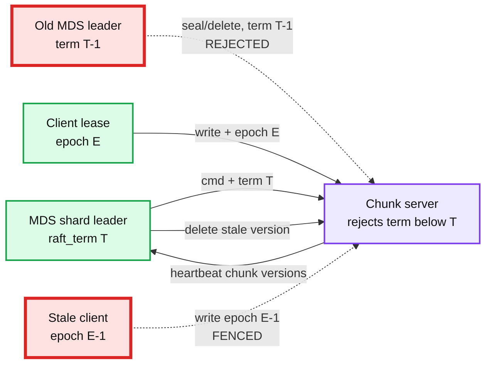

### 5.2 "How does metadata scale to 10 B files and 500 k ops/s, and what about a hot directory?"

The bottleneck in order: (1) one machine's RAM, solved by sharding in §4.1; (2) path resolution round trips, solved by the client cache; (3) the single hot shard that owns a directory receiving a burst. That third one is the red node.

**Bad: shard by hash of full path.**
- Looks great: perfect spread, one lookup per open. Breaks on `list(dir)` (scatter-gather across all 200 shards) and on rename of a directory (every descendant's key changes, 100 M rewrites for a big tree). Rejected.

**Good: shard by subtree (CephFS style), move hot subtrees between shards.**
- Works, list and rename-within-subtree are local. Cost: a balancer that migrates subtrees online is the most complex code in CephFS, and a single huge directory still cannot be split.

**Great: dentries keyed by parent directory, inodes by id, plus three hot-directory defenses.**
- 1 M creates/min in one directory (a Spark job writing part files) is 17 k creates/s on one shard. Push back on the textbook: that is NOT a hot-shard emergency. A Raft group with 4 MB log batches commits 20 to 50 k small entries/s. The thing that actually melts is updating the parent inode's `mtime` and `entry_count` on every create, which serializes on one row. Fix: do not touch the parent inode per create; derive `entry_count` from the range scan, update `mtime` lazily every 100 ms.
- Defense 2: `list` on a 10 M entry directory is paginated with a cursor, 10 k entries per page, each page a consistent snapshot of the RocksDB range. Do not promise a snapshot across pages; say so in the API.
- Defense 3 (only past ~10 M entries or ~50 k creates/s): split the directory's dentry range across k shards by `hash(name) mod k`, recorded in the parent inode. List becomes a k-way merge. This is the InfiniFS and CFS idea. We keep the seam and do not build it on day one.
- Read hot spot near the root: `/`, `/user`, `/warehouse` get every path resolution. The client cache absorbs it: those dentries change once a month and the version check is a cheap `NOT_MODIFIED`. Without the cache the root shard would take 500 k x (depth) lookups/s and fall over. That is why the root shard is the red node in the diagram, and the cache is the fix.

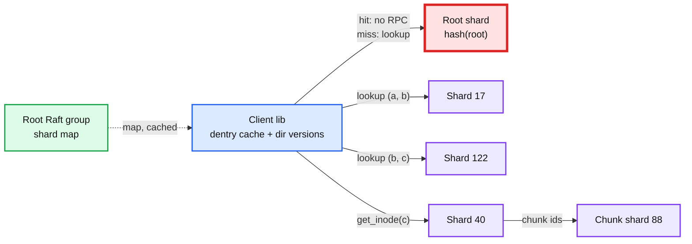

Full treatment in [`deep-dives/metadata-sharding.md`](deep-dives/metadata-sharding.md).

### 5.3 "How do you get 11 nines of durability, and what happens when a rack loses power?"

**Bad: 3 replicas on 3 random nodes, repair when someone notices.**
- Why it breaks: two things. Random placement means a 1% simultaneous node failure (a power event) has near-certain probability of killing all 3 replicas of some chunk in a 5,000-node cluster (Copysets, ATC '13). And repair from one node at 100 MB/s takes 56 h for 20 TB, so the window for a second and third failure is days.

**Good: failure-domain-aware placement, parallel repair, background scrubbing.**
- Placement: replicas on 3 different racks in 3 different power domains. Rack loss leaves 2 copies.
- Repair: the chunk shard scans `node_id -> chunk_ids` for the dead node and issues `replicate_from` to healthy holders, spread across ~2,000 peers. 100 TB at 300 MB/s per peer is ~3 min. Data-at-risk window shrinks from days to minutes. Node marked dead after 60 s without heartbeat, but repair starts at 10 min to avoid storms on a reboot; a disk failure reported by the node itself starts repair at once.
- Scrub: every replica re-read and CRC-checked every 14 days at ~1% of disk bandwidth. Silent corruption is found within two weeks and re-replicated.
- Cost: 3x storage for everything. At 100 PB that is 300 PB raw, roughly $3M/yr more than 1.4x at $10/TB/yr.

**Great: copyset-aware placement, 3x for hot and open data, RS(10,4) for sealed cold data, repair bandwidth budgeted.**
- Copysets: each node belongs to a small number of replica groups (scatter width ~ 20). Correlated failure of 1% of nodes then almost never covers a full copyset. Trade: repair parallelism per node drops from 2,000 peers to ~20, so a single node's repair takes ~2 h instead of 3 min. We pick scatter width 50 as the middle: correlated-loss probability under 1%, repair under 30 min.
- Erasure coding: after a chunk is sealed and cold for 7 days, an encoder reads it, writes 10 data + 4 parity fragments of 6.4 MB across 14 failure domains, commits the new layout in Raft, then deletes the 3 replicas. Overhead drops from 3.0x to 1.4x. Survives 4 losses. Degraded read costs 10 fragment reads plus a decode, so p99 on cold data is worse; that is acceptable for cold.
- Durability math on the Great design, sealed data: per-chunk annual loss probability ~ 1e-12 from independent failures with a 30 min repair window and AFR 2%, correlated loss under 1e-11 with copysets. Aggregate over 11 B chunks that is "expect one unrecoverable chunk every few years", which is the honest form of "11 nines". Say the number and the caveat.
- Challenges: EC small writes are ruinous, so we only encode sealed chunks and never modify them. Reads of EC data need 10 nodes to be up; we keep hot data replicated so EC latency never hits the interactive path.

Full math in [`deep-dives/durability-and-erasure-coding.md`](deep-dives/durability-and-erasure-coding.md).

### 5.4 "How do you serve 1 TB/s of reads and sub-20 ms first byte?"

- The data path never touches the metadata service. Metadata returns chunk ids and replica locations; bytes flow client to chunk server. 1 TB/s over 5,000 nodes is 200 MB/s per node.
- First byte: warm client has the inode cached (0 RPC), one read RPC to a same-rack replica (~1 ms network + ~8 ms HDD seek). p99 under 20 ms holds if the disk queue is short; we cap concurrent reads per disk at 16 and shed load with `RETRY_OTHER_REPLICA`.
- Hot chunk (10 k clients reading the same 64 MB, a broadcast join table): a single chunk server delivers ~2 GB/s, so 10 k readers see 200 KB/s each. Fix: MDS tracks per-chunk read rate from chunk-server reports; above a threshold it raises replication of that chunk to 10 or more, and clients read from any replica. Sealed chunks are also cached in a client-side or rack-local read cache with no invalidation problem, because sealed chunks are immutable.
- Push back on the textbook: you do not need a CDN or a separate cache tier. Immutability plus more replicas is the cache.

### 5.5 "What is your availability story, and what happens when the datacenter dies?"

- Shard leader dies: Raft election in 1 to 2 s (election timeout 1 s, heartbeat 100 ms). Writes to that shard (0.5% of files) fail for ~2 s and clients retry with the idempotent request id. This is the availability budget: 99.9% for writes allows 8.7 h/yr; 200 shards x say 4 elections/yr x 2 s is 27 min. Fine.
- Chunk server dies: readers fail over to another replica on the first timeout (2 s), writers seal and move. No user-visible failure beyond one slow request.
- Whole DC: strong consistency is per DC. The second DC receives async replication: Raft log shipping of every metadata shard (lag ~seconds) and chunk copies queued after seal (lag minutes). RPO 15 min. RTO 1 h is a runbook: promote the standby shard map, reject writes to chunks whose copy has not arrived, reopen. The Staff-level point: RPO 0 across DCs means every metadata commit waits on a cross-DC round trip (+2 ms across a metro, +80 ms across a continent). Offer it as a per-directory option with a stretched Raft group (2 DCs plus a witness), do not make it the default. See [`deep-dives/disaster-recovery.md`](deep-dives/disaster-recovery.md).

---

## 6. Final design

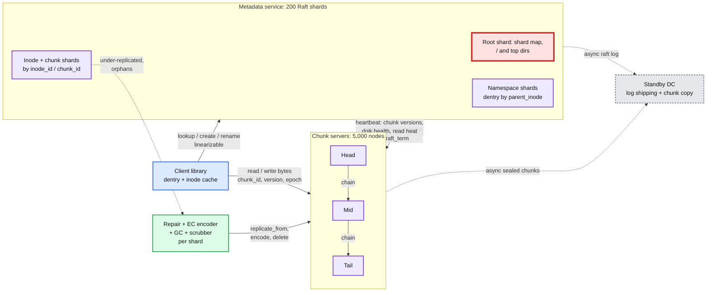

Zoom-ins: [`diagrams.md`](diagrams.md) D2 (data flow), D4 (per-FR sequences), D5 (failure sequences), D9 (deployment), D11 (failure map).

---

## 7. Trade-offs

| Decision | Option A | Option B | Chose | Why |
|---|---|---|---|---|
| Metadata store | Single NameNode in RAM | Sharded Raft groups on RocksDB | B | 10 B files do not fit; blast radius per shard 0.5% |
| Shard key | Full-path hash | Parent-dir for dentries, id hash for inodes and chunks | B | list and same-dir rename are local; path hash breaks rename of a directory |
| Cross-shard rename | Unsupported (Tectonic) | 2PC with intents | 2PC | Prompt says strongly consistent and job committers rename across dirs. Cost is ~3 ms and code complexity |
| Write replication | Parallel write to 3, W=3 | Chain replication with commit length | Chain | Client uses 1x bandwidth, commit length gives a clean read rule |
| Straggler on write | Retry into same chunk | Seal and allocate a new chunk | Seal | No divergence possible, no in-flight repair. Costs chunk fragmentation, fixed by compactor |
| Tail latency on write | Chain of exactly 3 | Quorum of 3 of 4 with hedging (Tectonic) | Chain | Simpler read rule (any replica). Revisit if write p99 misses 500 ms |
| Durability | 3x everywhere | 3x hot + RS(10,4) cold | Mixed | 1.4x on 80% of bytes, ~$5M/yr saved at 100 PB, no EC on the interactive path |
| Placement | CRUSH-style computed | Central map in chunk shards | Central | We already have sharded metadata; central lets us do copysets and hot-chunk replication with policy, not math |
| Linearizable reads | ReadIndex every read | Leader lease, ReadIndex fallback | Lease | Halves read latency; needs bounded clock drift |
| Cross-DC | Sync Raft across DCs | Async ship, RPO 15 min | Async default | RPO 0 costs +2 to +80 ms per metadata op. Offered per directory |
| Refused to build | POSIX overwrite, multi-writer, byte-range locks | | Refused | None needed by analytics workloads; each one breaks immutability, which is what makes reads and caching easy |

---

## 8. Staff-level notes

- **Failure modes and blast radius.** Shard leader loss: 0.5% of files unavailable for 2 s. Root shard leader loss: all cache-miss path resolutions stall 2 s, cache hits continue. Chunk server loss: zero user impact, repair in minutes. Rack loss: 2% of chunk servers gone, all chunks still have 2 of 3 or 10 of 14; repair traffic 2 PB, budget 10% of network, ~1 h. Metadata corruption bug: contained to one shard's RocksDB; restore from the last snapshot plus Raft log replay. Client library bug: worst blast radius in the system, ship it behind a version gate and keep the server rejecting unknown protocol versions.
- **Migration.** Existing system is HDFS. Phase 1: run the new metadata service as a shadow, mirror NameNode edits into it, compare listings nightly. Phase 2: new chunk servers register with both, new writes go to the new system for one low-risk namespace (`/tmp`). Phase 3: per-directory cutover with a router in the client library, rollback = flip the router. Phase 4: background copy of cold HDFS blocks into chunks with checksums verified, then decommission. No step requires downtime; every step has a rollback. D12 in `diagrams.md`.
- **Operability.** SLO: metadata p99 10 ms, read first byte p99 20 ms, zero unrecoverable chunks. Pages at 3 am: any shard without a leader for 30 s; under-replicated chunks above 0.01% of total; chunk with fewer than 2 live copies (page immediately); scrub-detected corruption rate above baseline; Raft apply lag above 5 s on any shard; repair bandwidth pinned at cap for 1 h. Dashboards: per-shard QPS and p99, commit latency, chunk state histogram (open / sealed / encoded / under-replicated), disk AFR trend, DR lag.
- **Cost.** 5,000 storage nodes at ~$15k each, 4-year life, is ~$19M/yr plus power. Metadata tier 600 nodes with NVMe is ~$3M/yr. EC on cold data saves ~110 PB of raw disk, ~$5M/yr. Engineering: a team of 8 to 10 for 18 months to first production, with the metadata service and the chunk server as separate sub-teams.
- **Team boundaries.** Metadata service (namespace, sharding, 2PC, leases) is one team. Chunk server and repair/EC is another. Client library is co-owned and is the contract; version it. DR replication is a third, thin team that consumes Raft logs and chunk seal events.

---

## 9. What is expected at each level

**Mid (80/20 breadth/depth).** Draw a metadata server, chunk servers, and a client. Explain chunking, 3x replication, heartbeats, and why the data path bypasses metadata. Know that the metadata server is a single point of failure and say "add a standby".

**Senior (60/40).** Everything above, plus: Raft for the metadata tier, leases for the single writer, chunk versions for stale replicas, a write pipeline with an explicit ack rule, checksums, rack-aware placement. Give QPS and storage numbers. Name the hot-directory problem and the rename problem when asked.

**Staff+ (40/60).** Unprompted: why GFS fails the "strongly consistent" bar (duplicates, padding, stale replicas, single master) and the three fencing tokens that fix it. Shard the metadata and say what the shard key breaks (cross-dir rename) and how you fix it (2PC with intents) or refuse it (Tectonic). Seal-and-move instead of in-flight repair. Copysets versus repair parallelism. EC only on sealed cold data. The durability number with its caveat. RPO 0 versus latency as a per-directory choice. The migration off HDFS with a rollback per phase. What pages at 3 am.

---

## 10. Nitty-gritty (past interview scope)

### 10.1 Internals of each chosen technology

**Raft per shard, RocksDB state machine.**

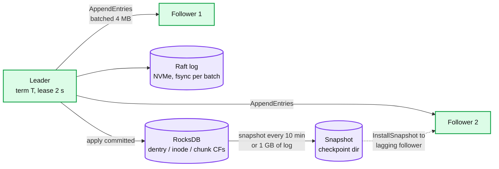

- Log entries are batched and fsynced once per batch (group commit). One fsync on NVMe is ~50 us; a batch of 200 entries gives 4 M entries/s theoretical, in practice 20 to 50 k/s per shard after RocksDB apply.
- RocksDB column families: `dentry` (key `parent_id|name`), `inode` (key `inode_id`), `chunk` (key `chunk_id`), `node_chunks` (key `node_id|chunk_id`, the repair index), `txn` (2PC records), `orphans`, `leases`. Prefix bloom filters on `dentry` so a `lookup` is one memtable or one SST probe.
- Snapshots are RocksDB checkpoints (hard links, instant). A follower more than 1 GB behind gets a checkpoint over the network instead of log replay.
- Lease-based reads: leader tracks `lease_until = last_majority_heartbeat_ack + election_timeout x 0.9`. Reads with `now < lease_until` are served locally; otherwise fall back to ReadIndex.

**Chunk server.**

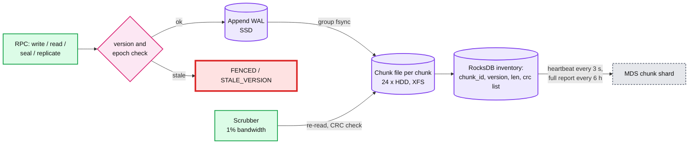

- One file per chunk on XFS, preallocated to 64 MB with `fallocate` so appends do not fragment. CRC32C per 64 KB block stored in a sidecar in RocksDB, verified on read and scrub.
- Appends land in an SSD WAL first (group fsync, ~100 us), ack goes up the chain, then the write is applied to the HDD file in the background. On restart the WAL replays into the chunk files. This is the same trick as Ceph BlueStore's deferred writes.
- The per-shard `raft_term` and the per-chunk `lease_epoch` are persisted in RocksDB before acking any command that raises them, so a chunk server that restarts cannot be talked into accepting an old epoch.

**Client library.**
- Holds: shard map (from root group, refreshed on `WRONG_SHARD`), dentry cache with dir versions (LRU, 1 M entries), inode cache with a 5 s TTL for read-only opens (stat is always linearizable when the caller asks), open handles with their chain and lease renewal timer (every 20 s for a 60 s lease).
- Every mutating RPC carries `(client_id, request_id)`; shards keep a 10-minute dedup window in RocksDB so a retried `create` after a timeout returns the original result.

### 10.2 Configuration knobs that matter

| Component | Knob | Value | Why |
|---|---|---|---|
| Raft | election timeout / heartbeat | 1 s / 100 ms | Failover under 2 s, no flapping on GC pauses under 500 ms |
| Raft | leader lease | 0.9 x election timeout | Local reads, safe under 10% clock drift |
| Raft | log batch | 4 MB or 5 ms | Group commit; latency vs throughput |
| Shard | count and split threshold | 200, split at 60 GB | One shard loss = 0.5% of files; RocksDB stays fast |
| Chunk | size | 64 MB | 11 B chunk records at 100 PB; small files waste nothing since chunks are variable length up to 64 MB |
| Chunk | replication (open/hot) | 3 across 3 racks, 3 power domains | Survive rack and power loss |
| Chunk | EC policy | RS(10,4), 14 domains, after 7 days sealed and cold | 1.4x, survive 4 losses |
| Chunk | write timeout before seal | 2 s per 4 MB | Seal-and-move beats retry |
| Lease | writer lease / renew | 60 s / 20 s | Long enough to ride a leader election, short enough to recover a dead writer in a minute |
| CS | heartbeat / dead after | 3 s / 60 s | Detect fast, do not repair on a blip |
| Repair | start delay / bandwidth | 10 min after dead (0 for disk failure) / 10% of NIC | No storm on mass reboot; bounded interference |
| Scrub | cycle / bandwidth | 14 days / 1% | Silent corruption found within 2 weeks |
| GC | orphan grace | 24 h | Undelete window, protects snapshot readers |
| DR | log ship / chunk copy lag alert | 10 s / 15 min | Matches RPO |

### 10.3 Capacity math per component

| Component | Metric | Value | Limit | Headroom |
|---|---|---|---|---|
| Metadata shard | writes/s | 250 creates + 25 renames + 50 seals = ~350 | 20 k | 50x |
| Metadata shard | reads/s | 2.5 k, 90% served from cache upstream | 100 k local gets | 40x |
| Root shard | lookups/s if no client cache | 500 k x depth 4 = 2 M | 100 k | **melts, cache is mandatory** |
| Metadata shard | RocksDB size | 40 GB | 100 GB before compaction hurts | 2.5x |
| Chunk server | read MB/s | 200 | 2,000 sequential, ~200 random 64 KB | 1x on random. Random small reads are the tightest budget in the system |
| Chunk server | write MB/s | 120 | 1,000 | 8x |
| Chunk server | NIC | 320 MB/s used | 3,000 | 9x |
| Chunk server | chunks per node | 11 B x 3 / 5,000 = 6.6 M records | RocksDB handles 100 M | 15x |
| Chunk server | heartbeat payload | 6.6 M x 16 B = 100 MB per full report | every 6 h, ok; incremental deltas every 3 s | fine |
| Repair | bytes on 1 node loss | 100 TB | 2,000 peers x 300 MB/s = 600 GB/s | ~3 min |
| Repair | bytes on 1 rack loss | 2 PB | same | ~1 h |

Closest to its limit: **random small reads per chunk server** (HDD IOPS), then the root shard without caching. Both are named in §5.

### 10.4 Failure timelines

**Metadata shard leader dies mid-create.**

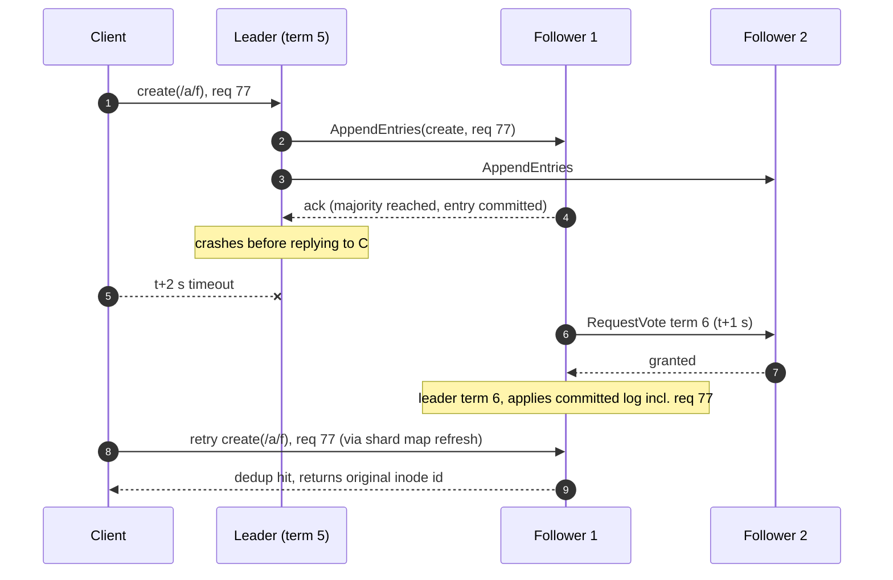
- Detection 1 s (election timeout). Failover 1 to 2 s. Data at risk: none, the entry was committed. User sees one 2 to 3 s slow call. On-call sees a leader-change event, no page unless it repeats.
- The important variant: crash BEFORE majority commit. Then the entry is not in the new leader's log, the retry creates it fresh, and the client gets a consistent answer either way. Never both.

**Chunk server dies mid-append.**

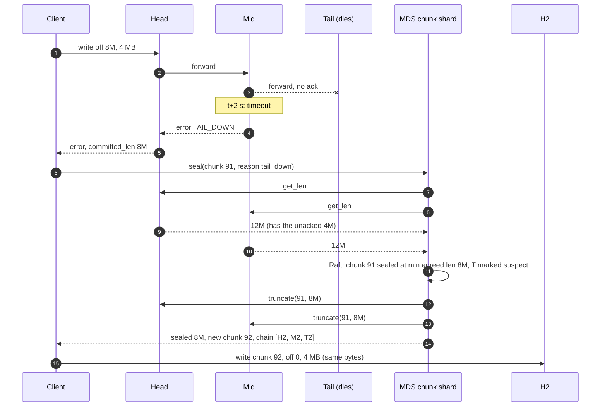
- Why truncate to 8M and not 12M: the client never got an ack for the 12M write, so the client will resend those bytes. Keeping them would duplicate. The rule "committed length is what was acked" is what makes appends exactly-once.
- Detection 2 s. Recovery ~10 ms of MDS work. Data at risk: none. User sees one slow write. Repair of T's other chunks starts at t+10 min unless T reported a disk failure.

**Network partition isolates a shard leader with one client.**
- t+0: leader L (term 5) loses contact with followers but not with client C and some chunk servers.
- t+0 to t+0.9 s: L's lease is still valid; L serves reads locally. These reads are linearizable because no other leader can exist yet.
- t+0.9 s: L's lease expires; L stops serving reads and cannot commit writes (no majority). C's requests time out.
- t+1 s: followers elect L' (term 6). L' persists term 6 into every chunk command from now on.
- t+2 s: C refreshes the shard map, talks to L'. Any `seal` or `delete` L still tries to send to chunk servers carries term 5 and is rejected. Any lease L granted has an epoch that L' will bump on the first recovery. No write from the partitioned side is ever visible. Proof in [`deep-dives/leases-fencing-epochs.md`](deep-dives/leases-fencing-epochs.md).

### 10.5 Exactly-once and idempotency end to end

| Hop | Where duplicates enter | Dedup key | Lifetime | On retry |
|---|---|---|---|---|
| Client -> MDS mutation | client retries after timeout | `(client_id, request_id)` in shard RocksDB | 10 min | return stored result |
| Client -> chunk chain append | client retries after timeout | `(chunk_id, offset)`; a chunk is append-only, an offset can only be written once. After a seal the retry goes to a new chunk | chunk lifetime | rejected as `OFFSET_ALREADY_COMMITTED` if the ack was lost, client advances |
| MDS -> chunk server command | MDS leader retries, or new leader re-issues | `(command_id, raft_term)` | until acked | chunk server is idempotent: seal at same length, delete already gone |
| Repair `replicate_from` | scheduler re-issues | `(chunk_id, version, target_node)` | until reported | target has it: no-op |
| DR log shipping | resend on reconnect | Raft index per shard | forever | apply-if-greater |
| 2PC rename | coordinator retries prepare/commit | `txn_id` | until txn record GC (1 h after commit) | participant is idempotent on txn state |

No hop has an at-least-once semantic that a user can observe. That is the whole difference from GFS record append.

### 10.6 Consistency model per edge

| Edge | Model | Note |
|---|---|---|
| Client -> MDS `stat`, `lookup`, `create`, `rename`, `delete` | Linearizable | Raft commit + leader lease |
| Client dentry cache -> path resolution | Read-your-writes, bounded stale | Dir version check on each use; a client that just renamed invalidates its own entry. Another client may resolve through a stale cached dentry for up to one version check |
| Client -> chunk server read of sealed chunk | Immutable, therefore trivially consistent | Any replica; version checked |
| Client -> chunk server read of open chunk | Read-after-write up to `committed_len` | Bytes below committed_len are on all 3 |
| `list(dir)` across pages | Snapshot per page only | Documented |
| MDS -> chunk server commands | Causal, fenced by term | Old-term commands rejected |
| Chunk server heartbeat -> MDS | Eventual, ~3 s | Drives repair, never drives reads |
| Metadata -> DR site | Eventual, seconds | RPO 15 min |
| Chunks -> DR site | Eventual, minutes | |

Where it changes: at the client cache (linearizable to bounded-stale, mitigated by version checks) and at the DC boundary (linearizable to eventual). Nowhere else.

### 10.7 Alternatives rejected

| Alternative | Why it looked attractive | Why rejected |
|---|---|---|
| GFS / HDFS single master | Simple, well understood | Does not reach 10 B files; single master; GFS record append is at-least-once |
| Transactional KV (FoundationDB, TiKV, Spanner) as the metadata store | Cross-shard txns for free, 3FS and JuiceFS do this | "From scratch" prompt. Also: rename is the only cross-shard op we need, 2PC over two rows is cheaper than a general txn layer. Name it as the buy option |
| Ceph CRUSH computed placement | No central chunk map | We already have sharded metadata; central placement lets us do copysets, hot-chunk replication, and drain a node by policy |
| Tectonic quorum writes (3 of 4) | Better write p99 | Reads must consult which 3 won; chain with seal-and-move gets 90% of the benefit |
| Path-hash sharding | One lookup per open | Breaks list and directory rename |
| Subtree sharding with migration (CephFS) | Locality | The balancer is the hardest code in CephFS; cannot split one huge directory |
| EC on the write path (Tectonic RS(9,6) hot) | 1.5x immediately | Small-write amplification, 14 nodes on every append, EC decode on every hot read |
| Sync cross-DC Raft by default | RPO 0 | +2 to +80 ms per metadata op for every user; offered per directory instead |
| Separate lock service (ZooKeeper, Chubby) for leases | Familiar | Leases live in the inode shard's Raft log already; a second consensus system is a second thing to page on |

### 10.8 How the big companies do it

- **Meta Tectonic** (FAST '21): three metadata layers (Name, File, Block) hash-sharded into ZippyDB, a Paxos-replicated KV. Sealed blocks, RS(9,6) and RS(10,4), quorum appends with reservation and hedging. No atomic cross-directory move because ZippyDB has no cross-shard transactions. 1.25 EB, 10.7 B files in one cluster. Our design differs by adding 2PC rename and by using chain replication instead of quorum writes.
- **Google Colossus**: Curators (sharded metadata over Bigtable, which is itself over Colossus), Custodians (background repair, rebalance, EC), D servers (disks). Clients talk to D directly. Single datacenter; replication above the file system. Our design is closest to this shape.
- **Azure Storage stream layer** (SOSP '11): append-only extents, chain replication, commit length, seal on failure with the stream manager (Paxos) arbitrating the length. Our write path is this.
- **HDFS**: NameNode with QJM (3 JournalNodes as the fence), generation stamps as chunk versions, pipeline writes, rack-aware placement, EC RS-6-3-1024k for cold data, Router-based federation for multiple namespaces. Our chunk versions and lease recovery are HDFS's generation stamps and lease recovery, sharded.
- **DeepSeek 3FS (2025)** and **JuiceFS**: metadata in FoundationDB or TiKV, which gives global transactions and therefore atomic cross-directory rename. The "buy" version of our 2PC.

### 10.9 Operational runbook

Dashboards (5 metrics): per-shard commit p99 and leader-change count; chunk state histogram (open / sealed / encoded / under-replicated / missing); repair queue depth and bandwidth; scrub corruption rate; DR lag (log index delta, unshipped sealed bytes).

Alerts:
| Alert | Threshold | Who |
|---|---|---|
| Chunk with < 2 live copies or < 11 of 14 fragments | any, immediately | page storage on-call |
| Shard with no leader | 30 s | page metadata on-call |
| Under-replicated chunks | > 0.01% of total for 30 min | page |
| Raft apply lag | > 5 s on any shard | page |
| DR lag | > 15 min | page |
| Scrub corruption | > 10 per day cluster-wide | ticket, page if > 100 |
| Repair bandwidth at cap | 1 h | ticket |
| Root shard p99 | > 20 ms | ticket, page if > 50 ms |

Rollout: chunk servers first, 1% then 10% then 50% per day, drained by moving primaries off them (no user impact since any replica serves reads). Metadata shards: rolling one follower at a time per shard, leader last, at most 5% of shards in flight. Client library: version gated by directory prefix, server rejects protocol versions it does not know.

Rollback: chunk server binary rollback is free (chunk format is versioned and forward-only additive). Metadata rollback requires the RocksDB schema to be readable by N-1, enforced in CI. A rollback after a shard split needs no backfill; a rollback after enabling directory splitting (§5.2 defense 3) needs a merge job, so that feature ships behind a flag with the merge job written first.

### 10.10 Security and abuse

- Auth boundary is the client library talking to MDS with mTLS and a per-tenant identity. MDS issues a signed capability token per open: `(inode_id, chunk_ids, mode, lease_epoch, expiry)`. Chunk servers verify the token signature and never call MDS on the read path. This is how Colossus and Tectonic keep the data path cheap.
- Rate limits: per-tenant metadata QPS at the shard (token bucket, 429 with backoff), per-tenant bytes/s at chunk servers. A tenant creating 1 M files/min gets its own directory shards split first and its QPS capped second.
- A malicious client can: read chunks it has a token for, write to a chunk it holds a lease for. It cannot: forge a token (signed), write to a chunk after its lease epoch is bumped (fenced), delete chunks (MDS-only command with term), or read another tenant's chunk (token bound to inode). Quotas per directory stop disk-fill attacks.
- Malformed input: path components limited to 255 bytes, depth to 64; chunk server verifies CRC before accepting a write, so a client cannot poison a replica with bytes that do not match the checksum it claimed.

### 10.11 Evolution

- **10x files (100 B):** shard count goes to 2,000. The root Raft group's shard map is still tiny. Path resolution depth becomes the cost; add InfiniFS-style speculative resolution (client guesses the child inode from a deterministic `hash(parent, name)` hint and validates in one round). The seam is the client library's resolver.
- **10x throughput:** chunk servers scale linearly. The seam that hurts is `node_chunks` index size on repair scheduling; move repair scheduling to a per-shard background worker with its own RocksDB iterator, already the design.
- **Multi-region strong consistency for a subset:** stretch specific shards to 2 DCs plus a witness. The seam is the shard map, which already records replica placement per shard.
- **Random overwrite:** chunks stop being immutable, which breaks read-from-any-replica and sealed-chunk caching. Do it as copy-on-write at chunk granularity (new chunk id, atomically swap in the inode's chunk list) and keep immutability. Same seam as EC re-layout.
- **GDPR delete:** delete is already an atomic unlink with GC; add a per-tenant "crypto-shred" by encrypting chunks with a per-tenant key held in a KMS and deleting the key. Chunks on the DR site and in snapshots become unreadable at the same instant.
- **Snapshots:** dentry and inode records are versioned in RocksDB (MVCC by Raft index). A snapshot is a recorded Raft index per shard plus a GC hold on the chunks it references. Chunks are immutable so snapshots are free on the data side. This is HDFS `.snapshot` sharded.

---

## 11. Follow-up questions to expect

Ranked by likelihood.

1. "Metadata leader acks a create then dies. Is it durable?" -> §10.4 timeline 1, [`edge-cases.md`](edge-cases.md) "leader dies after ack".
2. "Storage node dies mid-write. What is committed?" -> §4.2 Great, §10.4 timeline 2, edge case "chunk server dies mid-append".
3. "Rename `/a/x` to `/b/x` across shards, concurrent with delete of `/b`." -> §4.4, [`deep-dives/metadata-sharding.md`](deep-dives/metadata-sharding.md) §4, edge case "rename vs delete race".
4. "Two leaders after a partition. Prove the stale one is harmless." -> §5.1, [`deep-dives/leases-fencing-epochs.md`](deep-dives/leases-fencing-epochs.md).
5. "10 B files. Shard by path, inode, or subtree?" -> §5.2, deep dive on sharding.
6. "One directory takes 1 M creates a minute." -> §5.2 defenses, edge case "hot directory".
7. "Why not GFS?" -> §9 Staff paragraph, edge case "why GFS is not strongly consistent".
8. "DC dies. RPO? Does that contradict strong consistency?" -> §5.5, [`deep-dives/disaster-recovery.md`](deep-dives/disaster-recovery.md).
9. "How do you know a replica is not silently corrupt?" -> §5.3 scrub, §10.1 chunk server.
10. "Replication or erasure coding, and when?" -> §5.3, [`deep-dives/durability-and-erasure-coding.md`](deep-dives/durability-and-erasure-coding.md).
11. "Clock skew and your leases." -> deep dive on leases, edge case "clock jumps".
12. "How do you migrate off HDFS?" -> §8, D12.
13. "A client with a stale chunk list reads a deleted file." -> §4.3, edge case "stale client after delete".
14. "What is in the heartbeat and does it scale to 5,000 nodes?" -> §10.3.
15. "Small files: 9 B files under 1 MB. Is 64 MB chunking wasteful?" -> chunks are variable length up to 64 MB, so no disk waste; metadata cost is one chunk record per file, already in the math.
