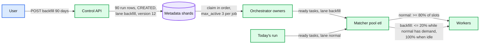
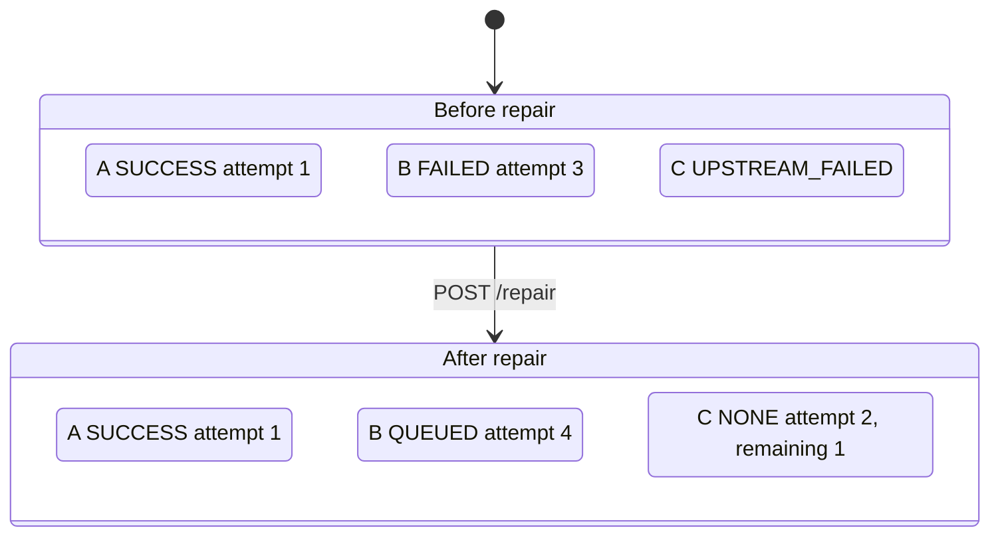

# Deep dive: backfill, rerun and stragglers

> One-line answer: a backfill is N ordinary runs created in one call with `lane = backfill`, a pinned `dag_version`, a chosen order, and `max_active_backfill_runs` per job; the matcher gives the backfill lane at most 20% of a pool while the normal lane has demand and all of it otherwise; a repair reuses the same `run_id`, resets only the failed subtree with `current_attempt + 1` so straggling old attempts are fenced, and keeps every SUCCESS; speculative execution is offered only for tasks marked idempotent and speculatable, triggered when an attempt exceeds 1.5x the task's p75 historical duration and the run is behind its SLA.

Part of [`../solution.md`](../solution.md) §4.4, §5.5. Sources: Airflow `catchup` and `clear`, Databricks and Netflix Maestro repair run, MapReduce backup tasks (sort 44% slower without them), Spark speculation defaults (`multiplier` 1.5, `quantile` 0.75, `interval` 100 ms), Dean and Barroso "The Tail at Scale". Links in [`../research/`](../research/).

---

## 1. Backfill is not special

A backfill run is a run. Same table, same orchestrator, same matcher, same event log. What differs is four fields set at creation:

```
POST /v1/jobs/{job_id}/backfill
{ from: "2026-06-01", to: "2026-08-29", order: "oldest_first", dag_version: 12, max_active: 3 }
-> 90 runs: trigger_type = backfill, lane = backfill, dag_version = 12, scheduled_time = each date
```

- `trigger_type = backfill` is part of the unique key, so a backfill for a date that already has a cron run creates a second run for that date. That is what the user asked for (re-run the day); if they wanted to re-run the *existing* run, that is repair.
- `lane = backfill` is what the matcher schedules on.
- `dag_version` defaults to current and can be pinned to an older one, for "reproduce what we shipped in June".
- `max_active` is enforced by the orchestrator when claiming CREATED runs of that job: at most 3 backfill runs of job J in flight. The rest sit in CREATED in the requested order.
- `propagate = false` by default: a backfill run's terminal event does not fire event-triggered downstream jobs. A user who wants the downstream backfilled asks for it.



## 2. Where fairness lives and why

Three places it could live:

| Place | Why not |
|---|---|
| Trigger plane (create backfill runs slowly) | It does not know pool occupancy. It would either starve backfill on a busy day or flood on an idle one |
| Orchestrator (`max_active_backfill_runs`) | Bounds one job. Ten tenants each with 3 backfill runs of 500 tasks still fill a pool |
| Matcher | Sees queued demand per lane and free slots per pool at the same instant. This is the only place the 20% rule can be enforced |

So `max_active` is a per-job limiter (keeps one backfill from being a 45 k task queue) and the lane share is the pool-level guarantee. Both exist.

The lane rule is deficit round robin with weights 80:20 plus a cap: while the normal lane has queued tasks, backfill may hold at most `0.2 × slots` running. When the normal lane is empty, the cap lifts. When normal tasks arrive again, backfill is not preempted; it stops receiving new slots until it is back under 20%. Preemption (killing backfill tasks) is refused: it wastes work and the normal lane's wait is bounded by task durations, which the pool owner controls with `task_timeout`.

Within a lane, tenants are weighted by their pool quota, then priority, then FIFO. See [`dispatch-and-workers.md`](dispatch-and-workers.md) §3.

## 3. Repair run

Repair = "run again the parts of this run that did not succeed, on the same run". Databricks calls it repair run; Airflow calls it `clear` with downstream.

```
POST /v1/runs/{run_id}/repair   { tasks?: ["B"] }     default: every FAILED and UPSTREAM_FAILED task
```

The owner:
1. Computes `subtree = tasks ∪ downstream(tasks)` from the pinned version.
2. For each task in the subtree: state to NONE, `current_attempt += 1` (so any straggling old attempt gets 409), `remaining_upstream` recomputed as the number of parents *not* in SUCCESS.
3. Tasks in the subtree whose recomputed `remaining_upstream` is 0 go to QUEUED.
4. Run state to RUNNING. Event `RunRepaired(subtree, by)`.
5. One transaction.

Every SUCCESS outside the subtree keeps its state and its `output_ref`. The DAG version does not change; a repair on a new version is refused (cancel and backfill instead), because the subtree of a changed graph is undefined.



"Mark success" is the escape hatch: sets a task SUCCESS without running it, records who did it in the event log, and lets the run continue. Used when the effect was done by hand.

## 4. Bulk repair

An upstream job broke 1,000 downstream runs. `POST /v1/runs/repair?cause_run_id=...&job_id=...` repairs all runs whose `cause_run_id` matches. Fan-out to the owners, one transaction each. The runs already have the lane they were created with (normal), so they compete normally; this is correct because they *are* today's runs.

## 5. Stragglers

A straggler is an attempt that is running much longer than the task usually takes. Three responses, in order of how often they are the right one:

1. **SLA miss alert.** Every run can carry `sla = "must finish by 06:00"`. The deadline is a timer in the trigger plane's wheel. When it fires and the run is not terminal, `SlaMissed(run, tasks_still_running)` goes to the owner. This is what most users want: a human looks at the slow task. Airflow's `sla_miss` is this.
2. **Task timeout.** `task_timeout` per task. The heartbeat response says `cancel`, the attempt is FAILED with `error_class = timeout`, retry policy applies. Cheap and always safe.
3. **Speculative execution.** Start a second attempt of the same task while the first is still running; first to finish wins, the other is cancelled. MapReduce's backup tasks made the sort benchmark 44% faster than without them; Spark launches a copy when an attempt exceeds `1.5 ×` the median after `75%` of the stage's tasks have finished, checking every `100 ms`.

Speculation is unsafe by default in a job scheduler because tasks have side effects. Both attempts may commit. It is offered only when the task is marked `idempotent: true, speculatable: true`, and it uses the duration history of *this task in this job* (p75 of the last 30 runs) rather than sibling tasks, because a DAG's tasks are not identical the way a stage's partitions are.

```
speculate when:  attempt_age > 1.5 × p75(task duration, last 30 runs)
            and  the task is on the run's critical path (longest remaining path to a leaf)
            and  the run's SLA deadline minus now < remaining critical path estimate
            and  task.speculatable
```

Both attempts share the idempotency key. The loser gets `cancel` on its next heartbeat and 409 on `complete`. The winner's `complete` wins the conditional update because the owner sets `current_attempt` to the winner at that moment. The cost is one wasted slot per speculation; the benefit is bounded by the tail, so the critical-path condition matters.

## 6. What to say in the interview

- "Backfill runs are runs. Four fields differ: trigger type, lane, pinned version, max active."
- "Fairness lives in the matcher because that is where demand and free slots meet. 20% cap while normal has demand, 100% when idle, no preemption."
- "Repair reuses the run, resets the failed subtree with attempt plus one so stragglers are fenced, recomputes in-degrees against SUCCESS."
- "Stragglers: SLA alert first, timeout second, speculation last and only for tasks that opt in, on the critical path, at 1.5x their own p75."
