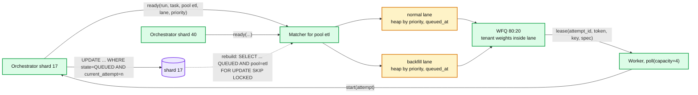
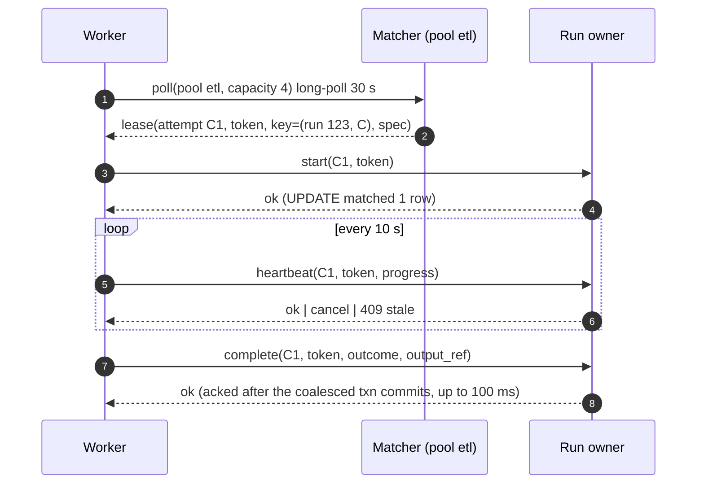

# Deep dive: dispatch and workers

> One-line answer: workers long-poll a matching node for their pool with their free capacity; the matcher holds an in-memory priority queue per pool fed by orchestrator notifications, runs weighted fair queueing between lanes and tenants, and hands out attempts as signed leases; the QUEUED to RUNNING transition is a conditional update on the run's shard so a duplicate hand-out loses at the database; the worker heartbeats every 10 s against a 60 s lease and is told to stop with a 409 the moment it is stale.

Part of [`../solution.md`](../solution.md) §4.2, §4.3, §5.5, §10.2. Sources: Temporal matching service and activity heartbeats, Airflow executors and its 5 s heartbeat with 300 s zombie threshold, Kubernetes leader election and node grace periods, SQS visibility timeout as the reference for lease-based queues. Links in [`../research/`](../research/).

---

## 1. Pull, not push

Push means the scheduler decides which worker gets a task, so it needs a live view of every worker's capacity, and a slow or dead worker makes the scheduler's view wrong. Pull means a worker asks for `capacity` tasks when it has `capacity` free, so the scheduler never over-commits a worker and never needs a capacity model. Backpressure is the absence of polls. Airflow's Celery executor, Temporal's task queues, and SQS consumers are all pull. Kubernetes is push (the kube-scheduler binds pods to nodes) because it owns the node inventory; we do not own the compute, so pull.

The poll is a long-poll: the connection is held up to 30 s and answered the instant a task for that pool is queued, so dispatch latency is not bounded by a poll interval.

## 2. The matcher



- Pools are assigned to matcher nodes by consistent hashing over live matchers (etcd membership, no epochs needed because the matcher is not authoritative).
- The heaps are a cache. If a matcher dies, its replacement scans `task_instance WHERE state = 'QUEUED' AND pool IN (...)` across shards (indexed on `(pool, state, priority, queued_at)`) and rebuilds. A few thousand rows per pool.
- Two matchers briefly holding the same pool (during a membership change) can both hand out the same task. The `start` call does `UPDATE task_instance SET state = 'RUNNING' ... WHERE run_id = ? AND task_id = ? AND state = 'QUEUED' AND current_attempt = ?`. Zero rows means the other worker won; this worker gets 409 and polls again. The DB, not the matcher, is the arbiter.

Why not `SELECT ... FOR UPDATE SKIP LOCKED` per poll (Airflow's pattern): it works, and it is the Good rung. At 2,400 hand-outs/s across 64 shards it is 40 locked-row reads per shard per second, which is fine. It fails in two ways at our shape: a worker asking for "any task in pool etl" must query every shard because tasks for a pool live on every shard, and fairness between lanes and tenants needs a view of the whole queue, which one `LIMIT n` query does not give. The in-memory heap gives the global view; the DB gives the durability and the arbitration.

## 3. Fairness: lanes, tenants, weights

Within a pool the matcher runs deficit round robin between lanes with weights `normal:backfill = 80:20`, with an extra rule: the backfill lane may take at most `backfill_share` (20%) of the pool's running slots while the normal lane has queued tasks, and any share when it does not. Within a lane, tenants are weighted by their pool quota, so a tenant with 100 slots and a tenant with 10 slots split contested capacity 10:1. Within a tenant, strict priority then FIFO by `queued_at`.

This is weighted max-min on a two-level tree (lane, tenant). The math and the water-filling loop are the same as [`../../network-throttling/deep-dives/hierarchical-fair-allocation.md`](../../network-throttling/deep-dives/hierarchical-fair-allocation.md), applied to slots rather than requests per second.

Head-of-line: a long task at the head of a Kafka partition blocks everything behind it. A heap plus per-attempt leases has no head; a long task holds one slot and the queue keeps draining. This is the concrete answer to "why not Kafka as the task queue".

## 4. Leases and heartbeats

```
lease_ttl        = 60 s          renewed by heartbeat every 10 s
grace            = 2 heartbeats  so LOST at last_heartbeat + 60 s... in practice ~50 s after the last one seen
heartbeat path   = worker -> run owner (in memory). DB lease_expires_at refreshed every 60 s (write-behind).
```

Compare: Airflow heartbeats every 5 s (`job_heartbeat_sec`) and declares a zombie after 300 s (`task_instance_heartbeat_timeout`), checked every 10 s. Temporal sets a heartbeat timeout per activity type, often 10 to 30 s. Kubernetes declares a node NotReady after 40 s (`node-monitor-grace-period`) and evicts pods after a 300 s toleration. We sit at 60 s: fast enough that a dead worker's slot is reclaimed within a minute, slow enough that a 30 s GC pause or a leader election does not produce a wave of false LOSTs.

The heartbeat response carries instructions: `ok`, `cancel` (run cancelled or attempt superseded), or `409 stale` (this attempt is no longer current). A worker that receives anything but `ok` stops the task and cleans up. Long tasks must heartbeat from a separate thread, not from the thread doing the work, or a CPU-bound loop produces a false LOST.



## 5. Long tasks and short tasks on one fleet

A 6 h Spark job and a 200 ms Python function have different needs:

| Concern | Short (< 1 min) | Long (> 10 min) |
|---|---|---|
| Lease | 60 s default is fine | Same lease, heartbeats matter more; make the SDK heartbeat from a background thread |
| Pool | High slot count, small workers | Dedicated pool, large workers, `max_active` per tenant |
| Retry | Cheap, `max_attempts` 3 | Expensive, checkpoint inside the task, `max_attempts` 1 or 2 |
| Speculation | Never worth it | Only if idempotent and on the critical path ([`backfill-rerun-and-stragglers.md`](backfill-rerun-and-stragglers.md)) |
| Failover | Owner death is invisible | Owner death must not LOST the attempt: the new owner gives every RUNNING attempt fresh grace |

The fleet is the tenant's problem (their Kubernetes namespace, their cluster). We define pools and the worker SDK. A pool maps to a worker deployment; autoscaling the deployment on `queued_age` for the pool is a two-line HPA rule and is out of our scope.

## 6. Worker SDK contract

```
1. poll(pool, capacity) -> leases
2. for each lease: start(attempt, token) -> ok | 409. On 409 drop it.
3. run task with env: RUN_ID, TASK_ID, ATTEMPT_ID, IDEMPOTENCY_KEY, LOGICAL_DATE, PARAMS_REF, OUTPUT_REF
4. heartbeat thread: every 10 s, stop task on cancel | 409
5. complete(attempt, token, outcome, exit_code, output_ref, error_class) with retries and backoff for 5 min
6. logs to object storage under log_ref, never to the scheduler
```

The SDK is what makes "at-least-once with idempotency key" real: the key is in the environment, the 409 is handled, and the complete call is retried. Without the SDK the guarantees are documentation.

## 7. Capacity

```
Hand-outs steady:      2,400/s fleet, ~200/s per matcher (12 matchers). Trivial.
Midnight:              1.8 M ready tasks arrive in ~1 s (or 60 s with spread). Heap inserts ~150 k per matcher. ~100 ms.
                       Hand-outs bounded by free slots, so the heap drains at the completion rate.
Parked long-polls:     one per worker per pool, ~2 k per matcher. Fine for any modern server.
Heartbeats:            21.6 k/s fleet, in memory at the owners, 720/s per orchestrator node.
Matcher memory:        150 k queued × 200 B = 30 MB worst case.
```

The matcher is never the bottleneck. It exists to give fairness a global view and to remove the per-poll DB query.

## 8. What to say in the interview

- "Pull with long-poll. Backpressure is free, no poll interval in the latency."
- "The matcher's heap is a cache. The QUEUED to RUNNING update is the arbiter."
- "Fairness is weighted max-min over lane and tenant, in the matcher, because that is the only place that sees demand and free slots together."
- "60 s lease, 10 s heartbeat. Airflow is 300 s. Temporal is per activity. I chose the middle and I can say why."
- "A heap plus leases has no head-of-line. That is the Kafka answer."
