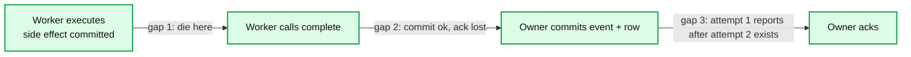
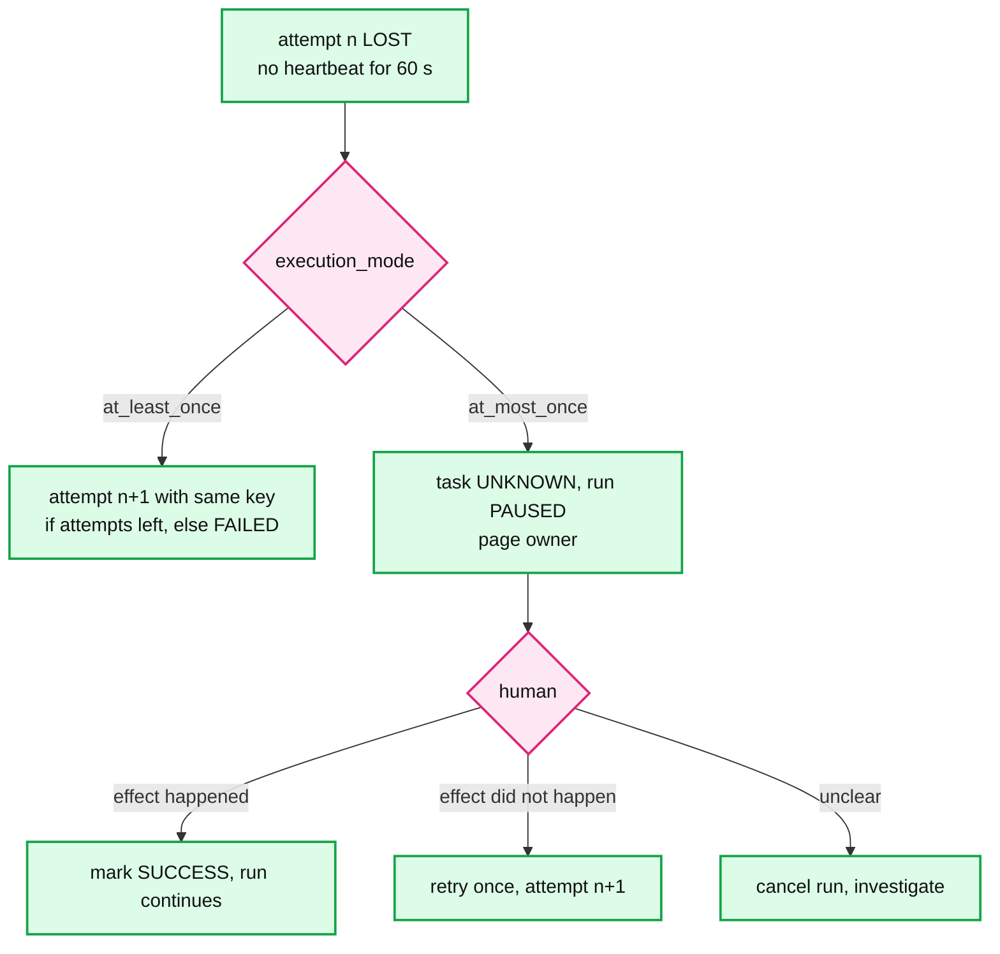

# Deep dive: exactly-once and idempotency

> One-line answer: the platform makes the *record* of execution exactly-once (unique keys on `run` and `run_event`, conditional updates on `current_attempt`, signed attempt tokens) and makes the *execution* at-least-once, because the gap between "side effect committed" and "completion reported" cannot be closed by any scheduler; it hands every task the idempotency key `(run_id, task_id)` so the task author can make the second execution a no-op, and offers `at_most_once` per task, which turns a lost lease into a page instead of a retry. Google's cron picked the opposite default (skip rather than double launch) for a population of non-idempotent jobs; ours is a population of data pipelines.

Part of [`../solution.md`](../solution.md) §5.1, §10.5. Sources: Google SRE book cron chapter, Temporal's activity semantics (at-least-once, result recorded in history), Kafka transactions and Flink two-phase-commit sinks for the "effectively once" vocabulary, Stripe's idempotency key post, the outbox pattern. Links in [`../research/mechanisms-survey.md`](../research/mechanisms-survey.md).

---

## 1. The three gaps

| Gap | What happened | Platform closes it? | How |
|---|---|---|---|
| 1 | Effect happened, nobody was told | **No** | Lease expires, attempt LOST, retry under the same key (at-least-once) or UNKNOWN and page (at-most-once) |
| 2 | Effect happened, record committed, worker did not hear the ack | Yes | Worker retries `complete`; `UNIQUE(run_id, attempt_id, event_type)` rejects the duplicate event; owner returns the same ack |
| 3 | Slow worker's attempt was superseded, then it reports | Yes | `UPDATE ... WHERE current_attempt = 1` matches 0 rows, 409, worker stops. The effect may already have happened twice, which is gap 1 again |

The interview sentence: "I can make the *record* exactly-once. I cannot make the *execution* exactly-once. Nobody can. So I make the second execution harmless."

## 2. Why gap 1 is not closable

Two generals. The worker and the external system have committed a state the scheduler cannot observe, and the message that would tell the scheduler was lost. The scheduler must choose: assume it happened (skip, risk a missed effect) or assume it did not (retry, risk a duplicate). Any protocol that tries to make the effect and the report atomic needs the external system to participate in a transaction with the scheduler, which is two-phase commit across organizations. Kafka transactions and Flink 2PC sinks do exactly this, but only when the sink is Kafka or a system with a transactional API; a task that calls a vendor's REST API has no such thing.

## 3. What the platform does

1. **Hands over the key.** Every attempt gets `IDEMPOTENCY_KEY = (run_id, task_id)`. Stable across attempts and repairs. Plus `LOGICAL_DATE` and `ATTEMPT_ID` for tasks that want to be smarter.
2. **Fences every write.** Attempt token is signed and carries `attempt_id`. Heartbeat, complete, and start are all `WHERE current_attempt = n`. An old attempt cannot change anything after it is superseded.
3. **Dedups the record.** `run` unique on `(job_id, scheduled_time, trigger_type)`. `run_event` unique on `(run_id, attempt_id, event_type)`. Manual triggers carry a client `Idempotency-Key` stored for 24 h.
4. **Makes duplicates visible.** The UI shows attempt 1 LOST and attempt 2 SUCCESS, with the LOST attempt's last heartbeat time. The user can see that an effect may have happened twice.
5. **Offers the other default.** `execution_mode: at_most_once` per task. LOST becomes UNKNOWN, the run pauses, the owner is paged. A human decides: mark success, or retry.

## 4. What the task author does

| Effect type | Idempotent form |
|---|---|
| Write a table partition | Overwrite `dt = LOGICAL_DATE` (or `INSERT OVERWRITE`), never append |
| Insert rows | `INSERT ... ON CONFLICT (idempotency_key) DO NOTHING`, key column filled from `IDEMPOTENCY_KEY` |
| Write a file | Write to `output/{IDEMPOTENCY_KEY}.tmp`, then atomic rename to the final name |
| Call an external API | Pass `IDEMPOTENCY_KEY` as the API's idempotency header (Stripe style). If the API has none, use `at_most_once` |
| Send a message | Include the key; consumer dedups. Or `at_most_once` |
| Increment a counter | Not idempotent. Store `(key, delta)` and sum at read time, or `at_most_once` |

This table is the worker SDK's documentation page. Most data pipeline tasks are row 1 and are idempotent by construction, which is why at-least-once is the right default here and the wrong one for Google's fleet of "send the newsletter" jobs.

## 5. At-most-once, precisely

`at_most_once` does not mean "the platform guarantees zero or one execution". It means: the platform never *starts* a second attempt on its own. The worker can still have died in gap 1, so the effect may have happened or not. What the user gets is that the decision to retry is a human's, with the evidence (last heartbeat, logs) in front of them.

Google's cron: "we favor skipping launches rather than risking double launches, as much as the infrastructure allows." Their reasoning is that recovering from a skip is tenable and recovering from a double is often not. That is `at_most_once` as a fleet default. We make it per task because a data platform's population is mostly idempotent, and a skipped daily partition is a missed SLA that someone has to notice and backfill.

## 6. Trigger-side duplicates

Two owners of the same partition during a handover both fire job 9 at 09:00. Both `INSERT run ... ON CONFLICT DO NOTHING`. One row exists. The stale owner's cursor update is rejected by `owner_epoch`. No duplicate run, and the stale owner learns it is stale from the row count. No clocks involved.

Event triggers: Kafka redelivers after a consumer crash between the fire transaction and the offset commit. Same unique key, `scheduled_time = logical_date` from the event. No duplicate run.

Manual triggers: a user double-clicks. `Idempotency-Key` header, stored on the run for 24 h, same run returned.

## 7. Downstream duplicates

Notifications: the outbox relay may publish `RunFailed` twice. The notifier dedups on `(run_id, event_type)` for 24 h. Event-triggered downstream runs are covered by the unique key on `run`.

Read model: CDC may replay. Every row carries `seq` or `updated_at`, and the read model applies with `WHERE incoming.seq > existing.seq`.

## 8. The one that bites in production

Attempt 1 is a 6 h Spark job. At 5 h 59 m its worker has a 70 s network partition. Attempt 1 goes LOST, attempt 2 starts from zero. Attempt 1 reconnects, finishes, calls `complete`, gets 409, and its output partition is already written. Attempt 2 runs 6 h and overwrites the same partition with the same data. Correct, and 6 h of compute wasted. Mitigations, in order of value:
- Lease for long tasks: the SDK can request a longer lease (up to 10 min) at start, so a 70 s blip is not a LOST. The trade-off is 10 min of a dead worker holding a slot.
- Checkpoint inside the task. Attempt 2 resumes from the checkpoint keyed by `IDEMPOTENCY_KEY`.
- `at_most_once` for tasks over an hour, with a page. A human reconnects the worker faster than the platform re-runs 6 h.

Say this story. It shows that "at-least-once with idempotency" is correct but not free, and that the lease TTL is a product knob, not a constant.

## 9. What to say in the interview

- "Record exactly-once, execution at-least-once. The gap is between the side effect and the report, and no scheduler can close it."
- "I give the task the key. I fence every write on the attempt. I dedup the record with unique constraints. I make the duplicate visible."
- "`at_most_once` per task turns a lost lease into a page. That is Google cron's default, applied selectively."
- "Trigger duplicates die at the unique key and the epoch, and neither uses a clock."
