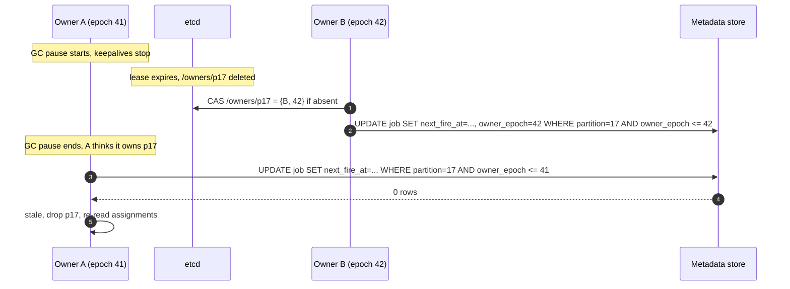

# Deep dive: leases, failover and fencing

> One-line answer: ownership of every trigger partition and every run shard is a key in etcd attached to the owner's lease (TTL 10 s, keepalive every 3 s) together with a monotonically increasing epoch; the epoch is stored in the database rows and every write from an owner is conditioned on it, so a stale owner that wakes from a GC pause can still hold the lease in its own head but cannot change anything; the unique key on `run` is a second, independent guard on the data. Failover is lease expiry (≤ 10 s) plus reassignment (~0.1 s) plus reload (< 1 s), about 12 s, and nothing acked is lost because cursors and events only move in the same transaction as the thing they describe.

Part of [`../solution.md`](../solution.md) §5.2, §10.1, §10.4. Sources: etcd leases and Raft defaults, Kubernetes client-go leader election defaults (15 s / 10 s / 2 s), Kleppmann's fencing token argument ("How to do distributed locking"), Chubby and ZooKeeper session semantics, Google SRE cron chapter. Links in [`../research/mechanisms-survey.md`](../research/mechanisms-survey.md).

---

## 1. A lease is not a lock

A lease says "for the next 10 s, nobody else will be granted this". It does not say "the previous holder has stopped". The previous holder may be in a GC pause, blocked on a disk, or on the far side of a partition, and will wake up believing it still owns the thing. Kleppmann's fix: the lock service hands out a fencing token that increases on every grant, and the storage the holder writes to rejects any token lower than the highest it has seen. We call the token `epoch`.



Two guards on purpose:
- **Epoch**: tells the stale owner to stop, before it does more. Cheap: one integer column, one predicate.
- **Unique key on `run`**: protects the data even if an owner writes without checking (bug, old binary). A double fire is a no-op at the row.

Neither uses a wall clock. The stale owner's local timer is a third, advisory guard: it stops acting when its own lease should have expired on a monotonic clock, which handles the common case before the DB has to.

## 2. Ownership layout in etcd

```
/assign/trigger/p017        = {node: "t-3", epoch: 42}        lease of t-3
/assign/orch/s17            = {node: "o-3", epoch: 9}         lease of o-3
/members/trigger/t-3        = {addr, capacity}                lease of t-3
/members/orch/o-3           = {addr, capacity}                lease of o-3
/assigner                   = {node: "t-1"}                   lease of t-1 (elected)
/epoch/trigger/p017         = 42                              no lease, monotonic counter
```

- A node's lease covers its membership key and every assignment key it holds. If the node dies, all disappear together.
- The assigner is one elected node (etcd `Elect`). It watches `/members/*` and `/assign/*`, computes a balanced assignment when they diverge, and writes assignments with `epoch = /epoch/... + 1` in a transaction. If the assigner dies, another node wins the election within the lease TTL; its work is idempotent because it is a function of current state.
- Partition count is fixed (256 trigger, 64 orchestration). Rebalancing moves whole partitions; data never rehashes.

## 3. The numbers

| Parameter | Value | Why |
|---|---|---|
| Lease TTL | 10 s | Survives one lost keepalive and a ~6 s GC pause. Kubernetes uses 15 s |
| Keepalive interval | 3 s | Three attempts inside the TTL. Kubernetes renew deadline 10 s, retry 2 s |
| etcd Raft heartbeat / election | 100 ms / 1,000 ms | Defaults. etcd's own leader failover is 1 to 2 s and pauses keepalives, which the 10 s TTL absorbs |
| Reassignment | ~100 ms | Watch delivery plus one CAS transaction |
| Trigger reload | < 1 s | 4 k rows per partition with a 5 min horizon |
| Orchestrator reload | < 1 s | ~65 k `task_instance` rows per shard in non-terminal state |
| Worst-case failover | ~12 s | TTL + reassignment + reload |
| Local safety timer | TTL minus 1 s on `CLOCK_MONOTONIC` | Owner stops on its own before etcd would have expired it |

Why not TTL 3 s: below about 5 s, ordinary events (etcd election, a 2 s GC pause, a slow etcd disk fsync) cause false failovers. Each one is harmless but each is a reload spike, a `partition_without_owner` blip, and one more time the on-call learns to ignore the alert.

## 4. What is lost on failover

Trigger plane: nothing. The wheel is a cache of `next_fire_at`. Fires that happened moved the cursor in the same transaction. Fires that did not happen are still due and fire on reload. Lateness ≤ 12 s for 1/12 of jobs (with 12 nodes).

Orchestration plane: nothing acked. In-memory `RunState` is rebuilt from rows. The coalesce buffer (up to 100 ms of events not yet flushed) is lost, but those events were not acked to workers, so the workers retry `complete` and the events are re-applied. In-memory leases are rebuilt from `lease_expires_at` in the DB (refreshed every 60 s), and every RUNNING attempt gets fresh grace on the new owner, so a failover never produces a wave of false LOSTs.

Matcher: the heap. Rebuilt from QUEUED rows. Not authoritative.

## 5. Split brain scenarios

| Scenario | What happens | Guard that catches it |
|---|---|---|
| Owner GC pause longer than TTL | New owner assigned. Old owner wakes and writes | Epoch predicate, 0 rows, old owner drops partition |
| Network partition: owner can reach DB but not etcd | Owner's local timer expires at TTL minus 1 s, owner stops. New owner assigned by etcd side | Local monotonic timer, then epoch |
| Network partition: owner can reach etcd but not DB | Owner keeps lease, cannot write. Fires held in memory, retried. If it lasts past the misfire threshold, misfire policy applies on eventual write | Nothing to guard; correctness intact, latency suffers. Alert `trigger_lag` |
| etcd quorum lost | No reassignment possible. Owners hold until local timer, then stop | Fail closed on triggers. Operator "freeze" switch to continue without renewal during a known incident |
| Assigner bug assigns one partition to two nodes | Both fire. Only one epoch is highest | Epoch on the cursor, unique key on the run |
| Old binary ignores epoch | Both fire | Unique key on `run`. This is why there are two guards |

## 6. Fail closed on etcd loss, on purpose

When etcd is unavailable, owners stop at their local timer. Triggers stop fleet-wide about 10 s later. This is a deliberate choice: a double fire (two owners, one without the epoch check because it never got the new epoch) is worse for most jobs than a late fire, and late fires are what misfire policy exists for. Compare [`../../network-throttling/deep-dives/failure-modes-and-fail-policy.md`](../../network-throttling/deep-dives/failure-modes-and-fail-policy.md), where the data path fails open because a dropped request is worse than an over-admitted one. Same question, opposite answer, and the reason is the cost of the two errors.

The operator switch: `freeze_ownership = true` written to a config store that owners poll. While set, owners ignore lease expiry and keep their current assignments. Used when the on-call knows etcd is down for maintenance and no node is being added or removed. It trades single-owner safety for progress, and it is a human's call.

## 7. Migration of ownership during deploys

A deploy is 30 controlled failovers of ~10 s each. The node being drained releases its assignments one at a time (delete the key, wait for the new owner's epoch to appear, move on), so at no point is a partition unowned for longer than reassignment plus reload. Spread over 30 minutes, the fleet sees `partition_without_owner` at 1 for about a second at a time. Rollback is the same procedure with the old binary.

## 8. What to say in the interview

- "A lease says nobody else gets it. It does not say the old holder stopped. The epoch is what stops the old holder."
- "Two guards: epoch on the cursor, unique key on the run. Neither uses a clock. The second exists for the day the first has a bug."
- "10 s TTL, 3 s keepalive, about 12 s failover, nothing acked lost. Shorter TTLs buy false failovers."
- "etcd down: fail closed on triggers, on purpose, with a human switch. The rate limiter fails open. Same question, different cost of being wrong."
