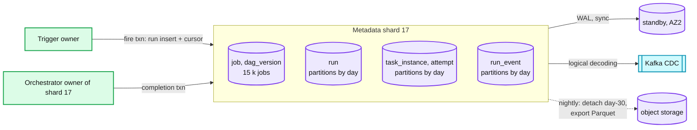

# Deep dive: metadata store and sharding

> One-line answer: 64 Postgres shards keyed by `hash(run_id)`, each a primary with a synchronous standby in another AZ, with `run`, `task_instance`, `attempt`, and `run_event` range-partitioned by day inside each shard; every hot transaction (fire, completion, ready-set update) touches one shard, so no cross-shard transactions exist; the shard count is set by the one-second midnight burst (5.4 M rows with lazy materialization, 84 k per shard) and by hot storage (9 TB for 30 days), not by steady state (24 k row writes/s fleet-wide); the alternative, a managed distributed SQL database, is a team-size decision and both answers are correct.

Part of [`../solution.md`](../solution.md) §2, §5.3, §10.1, §10.3. Sources: Postgres MVCC, `SKIP LOCKED`, partitioning and synchronous replication docs; Airflow's metadata DB as the documented scaling limit; Temporal's persistence shards; Hello Interview's time-bucketed executions table. Links in [`../research/`](../research/).

---

## 1. What is on a shard

```
Shard s (0..63) holds every run with hash(run_id) mod 64 == s, and everything under it:
  run              21 M/day / 64 = 330 k rows/day,   300 B  ->  100 MB/day
  task_instance    210 M/day / 64 = 3.3 M rows/day,  400 B  ->  1.3 GB/day
  attempt          ~1.1 x task_instance             200 B  ->  0.7 GB/day
  run_event        5 x task_instance                200 B  ->  3.3 GB/day
  outbox           small, drained continuously
  Total            ~5.4 GB/day per shard, 160 GB for 30 days hot (plus indexes ~40%)  ->  ~230 GB per shard

The job table (1 M rows, 5 GB with dag_version) is on the same shards keyed by hash(job_id) mod 64. A fire transaction
touches the job's shard (cursor) and the run's shard (new row). Those are different shards.
```

Wait: that means the fire is a cross-shard write. Resolution: `run_id` is not random. `run_id = (job_id, scheduled_time, trigger_type)` hashed, so `hash(run_id) mod 64 == hash(job_id) mod 64` by construction (the shard component of `run_id` is derived from `job_id`). Every run of a job lands on the job's shard. The fire transaction is single-shard. The cost is that a job with 96 runs a day and 10 k tasks each is a hot job on one shard, which is what `max_tasks_per_dag` and `max_active_runs` bound.



## 2. The midnight second, per shard

```
No spread, lazy rows:
  900 k run rows + 1.8 M root task_instance rows + 900 k RunCreated events + 1.8 M TaskQueued events = 5.4 M rows
  Per shard: 84 k rows in ~1 s, in batches of 1,000 -> 84 statements, 84 k rows/s for one second.
  Postgres batched INSERT on a mid-size node: 50 k to 150 k rows/s depending on row width and indexes.
  Verdict: survivable, at the edge. This is the red node.

No spread, eager rows:
  + 7.2 M non-root task_instance rows -> 12.6 M rows, 200 k rows/s per shard. Not survivable. Hence lazy.

Spread 60 s (default for new jobs):
  5.4 M rows / 60 s = 90 k rows/s fleet, 1.4 k rows/s per shard. Indistinguishable from steady state.

Spread applies to new jobs. The residual spike is the legacy aligned jobs, and the migration plan (D12) chases them down.
Meanwhile the trigger plane also smooths what it can: fires due in the same second are written in the order the wheel
popped them, and the wheel processes partitions round-robin, so a shard receives its 84 statements spread over the
whole second, not in the first 50 ms.
```

Steady state for comparison: 2,400 task starts/s × ~10 row writes = 24 k row writes/s fleet, 375 per shard. The shard count is set by the burst and by storage, not by steady state. If the burst goes away (all jobs spread), 16 shards would carry the writes and 64 is about storage and blast radius.

## 3. Why single-shard transactions matter

Every hot write is one transaction on one shard:
- Fire: run insert + cursor update, both on the job's shard.
- Completion: task_instance update + run_event inserts + child inserts + outbox, all on the run's shard.
- Dispatch: task_instance conditional update, run's shard.

So there is no two-phase commit, no saga, no cross-shard consistency question inside the hot path. The only cross-shard reads are the matcher rebuild (`QUEUED` rows for a pool, across all shards, on failover only) and the read model (via CDC). This is what makes plain Postgres viable, and it is also the answer to "why not a distributed SQL database": we would pay for cross-shard transactions we never issue.

## 4. Inside a shard: MVCC, vacuum, partitions

Postgres `UPDATE` writes a new tuple version and leaves the old one dead until vacuum reclaims it. A task instance has ~4 updates in its life; a shard sees ~13 M dead tuples a day from `task_instance` alone. Defaults (`autovacuum_vacuum_scale_factor = 0.2`) would let the day partition bloat to 20% dead before vacuuming. Set it to 0.01 on the hot tables and give autovacuum enough workers. Dead tuples matter because the matcher rebuild and the UI's "QUEUED in pool X" scans get slower as the index carries pointers to dead rows.

Day partitions: `run`, `task_instance`, `attempt`, `run_event` are `PARTITION BY RANGE (created_at)`, one partition per day, created 7 days ahead by a cron job (yes, on this scheduler; the meta-job is a good interview aside). Retention is `ALTER TABLE ... DETACH PARTITION` then export to Parquet then `DROP`. No `DELETE`, no vacuum storm.

Indexes on `task_instance` within a partition:
- PK `(run_id, task_id)`.
- `(pool, state, priority, queued_at) WHERE state = 'QUEUED'` (partial index, small) for matcher rebuild.
- `(state, lease_expires_at) WHERE state = 'RUNNING'` for the new owner's lease reload.

`run_event`: PK `(run_id, seq)`, unique `(run_id, attempt_id, event_type)`. Append-only, no updates, so no dead tuples.

## 5. Replication and failover

`synchronous_commit = on` with one synchronous standby in another AZ: a commit returns after the standby has the WAL record. RPO zero within the region. Latency cost ~1 ms per commit, invisible behind the 100 ms coalesce window. Failover: a failover manager (Patroni-style, itself on etcd) promotes the standby after 3 failed health checks (~15 s), updates the shard map, ~30 s total. During those 30 s, trigger owners hold fires in memory (cursor not advanced, so nothing can be lost even if the trigger node also dies), orchestrators buffer completions and keep answering heartbeats from memory, workers retry. Timeline in [`../solution.md`](../solution.md) §10.4.

Cross-region: one async replica per shard in the DR region, RPO ~1 s. Promotion is a runbook, ~10 min, and accepts that attempts running in the failed region are LOST and retried.

## 6. Resharding

Fixed shard count with hashing means adding a shard rehashes. Two ways to avoid a big-bang:
- Pre-split: run 64 logical shards on 16 physical nodes from day one (4 databases per node). Growing to 64 nodes is moving databases, not rehashing rows.
- Split by generation: new runs use 256 logical shards, old runs stay on 64. Runs are short-lived (hours to days), so within the retention window every live run is on the new layout. The `job` table's shard derives from `job_id` and needs a one-time move per job, done per tenant with a brief pause of that tenant's triggers.

The second is what §10.11 in `solution.md` describes for 10x growth.

## 7. Sharded Postgres vs distributed SQL vs KV

| | Sharded Postgres (chosen) | Distributed SQL (Spanner, CockroachDB, Yugabyte) | KV with conditional writes (DynamoDB, Cassandra LWT) |
|---|---|---|---|
| Hot-path fit | Every txn single-shard, so plain Postgres semantics | Same queries, no shard map to manage, cross-shard txns free | Conditional update per row yes, multi-row single-run txn awkward (DynamoDB TransactWriteItems 100 items) |
| Midnight burst | 84 k rows/s per shard for 1 s, batched | Handles it, at a per-row cost | Handles it, provisioned or on-demand cost |
| Queue rebuild query | Partial index, one query per shard | One query | Needs a GSI on `(pool, state)` with hot partition risk |
| Ops | Shard map, failover manager, vacuum tuning, resharding: real work | Managed, expensive, fewer knobs | Managed, cheap at low scale, no joins |
| Cost | ~128 mid-size instances | ~2x storage bill, less eng time | Depends on write units, unpredictable at the burst |
| Verdict | Right for a platform team that already runs Postgres | Right for a small team or a company already on it | Right for the Hello Interview one-shot job version, not for DAG state |

Say both of the first two are correct and that the choice is who is on call. The interviewer wants to hear that you know the hot path is single-shard either way.

## 8. Retention and the read model

Hot: 30 days on the shards. Warm: day partitions exported nightly to Parquet on object storage, queried by the read model through a lakehouse engine. Cold: the same files with a lifecycle policy to 2 years. The read model (UI lists, dashboards, "all runs of tenant X today") is fed by CDC from the shards and by the Parquet exports, and is eventual by seconds. The per-run view (`GET /runs/{id}`) reads the shard directly and is strong.

## 9. What to say in the interview

- "64 shards by run, run id derived from job id so the fire is single-shard. No cross-shard transactions anywhere on the hot path."
- "The shard count is set by one second a day and by 9 TB of hot history, not by 24 k writes/s."
- "Lazy rows and jitter are what make SQL viable: 12.6 M rows in a second is not a Postgres number, 84 k per shard is."
- "Day partitions, detach for retention, autovacuum at 1% on the hot tables."
- "Distributed SQL is the same design with fewer knobs and a bigger bill. I would pick it with a small team."
