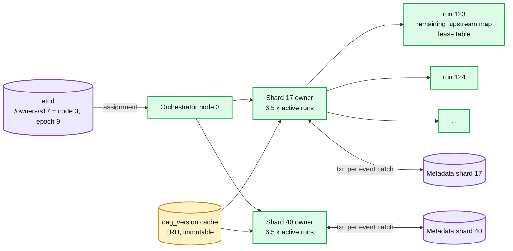
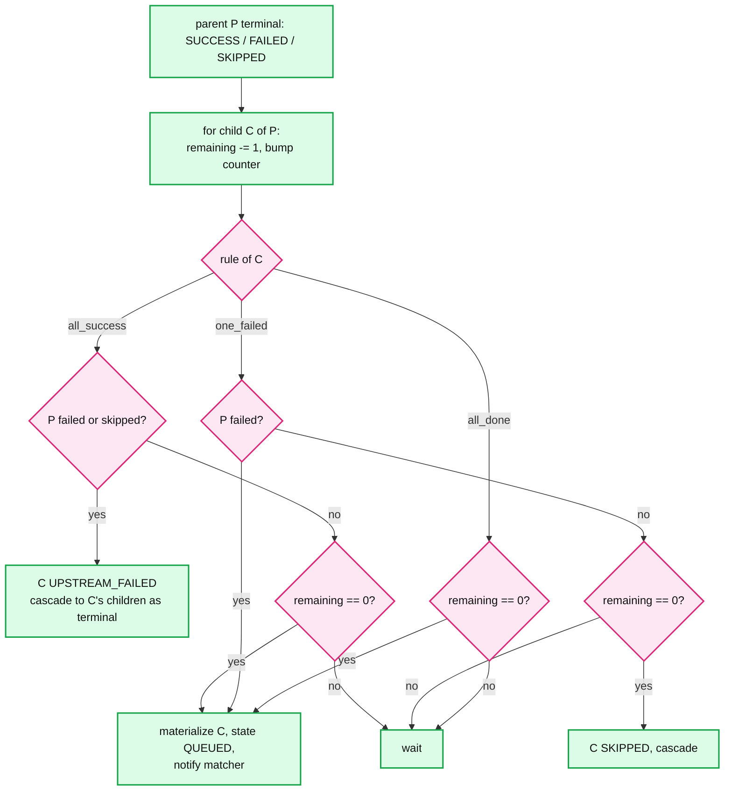

# Deep dive: orchestrator and DAG evaluation

> One-line answer: every run has exactly one owner at a time (the orchestrator node holding `shard = hash(run_id) mod 64`), the owner keeps `remaining_upstream` per task in memory as a cache of the `task_instance` rows, and on every attempt event it applies each child's trigger rule, appends the events and updates the rows in one transaction on the run's shard, coalescing events for the same run within 100 ms. Task rows are materialized lazily. A run pins one immutable `dag_version` at creation and never switches.

Part of [`../solution.md`](../solution.md) §4.2, §4.3, §5.6, §10.1. Sources: Temporal's history and mutable-state model and its 51,200 event cap, Airflow trigger rules and Airflow 3 DAG versioning, Kahn's algorithm, Netflix Maestro's foreach and step state machine. Links in [`../research/`](../research/).

---

## 1. Why one owner per run

The alternative is "any orchestrator can process any event". Then two parent completions for the same child race: both read `remaining_upstream = 2`, both write 1, the child never runs. Or both see 0 and both queue it. You fix that with row locks or compare-and-swap, and now every event is a contended transaction on a hot row for wide fan-ins.

One owner per run turns the graph math into single-threaded code with no locks. The cost is that ownership must be exclusive, which is the same etcd lease plus epoch mechanism the trigger plane already uses ([`leases-failover-and-fencing.md`](leases-failover-and-fencing.md)). Temporal makes the same choice: a workflow's mutable state is owned by one history shard, and the shard is owned by one history node.



## 2. The per-run state

```
struct RunState {
    run_id, job_id, dag_version, state, lane
    tasks: map<task_id, TaskState>          // only materialized tasks
    remaining_upstream: map<task_id, int>   // for every task in the version, initialized from in-degree
    current_attempt: map<task_id, int>
    leases: map<attempt_id, (expires_at_mono, worker_id)>
    pending_events: vec<Event>              // coalesce buffer, flushed every 100 ms or at 100 events
    seq: int                                // next run_event sequence number
}
```

About 100 B per task plus the maps. 6.5 k active runs × 10 tasks × ~150 B = ~10 MB per shard. Rebuilt on failover from `task_instance` rows (`state`, `current_attempt`, `lease_expires_at`) plus the pinned `dag_version` for the in-degrees. Reload of 65 k rows takes under a second.

## 3. Ready-set computation: in-degree counting under trigger rules

Kahn's algorithm, but the "decrement and queue at zero" rule is one of several. Each task has a trigger rule from the DAG definition:

| Rule | Child becomes QUEUED when | Child becomes UPSTREAM_FAILED or SKIPPED when |
|---|---|---|
| `all_success` (default) | every parent SUCCESS | any parent FAILED, UPSTREAM_FAILED, or SKIPPED |
| `all_done` | every parent terminal (any outcome) | never |
| `one_success` | first parent SUCCESS | every parent terminal and none SUCCESS |
| `one_failed` | first parent FAILED | every parent terminal and none FAILED (then SKIPPED) |
| `none_failed` | every parent terminal, none FAILED (SKIPPED allowed) | any parent FAILED |
| `none_failed_min_one_success` | every parent terminal, none FAILED, at least one SUCCESS | any parent FAILED, or all SKIPPED |

Implementation: per child keep `remaining`, `n_success`, `n_failed`, `n_skipped`. On each parent terminal event: `remaining -= 1`, bump the outcome counter, evaluate the rule. Evaluate on every parent event, not only at `remaining == 0`, because `one_failed` and `all_success`'s early failure need to fire before all parents are done.



A cascade (C UPSTREAM_FAILED makes its children UPSTREAM_FAILED) is processed in the same batch, so a failed root in a 10 k task DAG produces one transaction with 10 k row inserts, not 10 k transactions. The run is terminal when every task in the version is terminal, which is `count(terminal) == len(version.tasks)`, tracked as a counter.

## 4. The transaction

```sql
BEGIN;  -- on the run's shard
UPDATE task_instance SET state = 'SUCCESS', ended_at = now(), output_ref = $1
  WHERE run_id = $r AND task_id = 'A' AND current_attempt = 1;           -- 0 rows -> stale, abort, 409
INSERT INTO run_event (run_id, seq, event_type, attempt_id, payload) VALUES
  ($r, 4711, 'TaskSucceeded', $a1, ...),
  ($r, 4712, 'TaskQueued',    NULL, '{"task":"C","attempt":1}');
INSERT INTO task_instance (run_id, task_id, state, current_attempt, pool, priority, queued_at)
  VALUES ($r, 'C', 'QUEUED', 1, 'etl', 5, now());
UPDATE run SET state = 'RUNNING' WHERE run_id = $r AND state = 'QUEUED';
INSERT INTO outbox (...) VALUES (...);   -- only for run-terminal events
COMMIT;
```

`run_event` has a second unique key `(run_id, attempt_id, event_type)` so a retried completion for the same attempt is a no-op at the database even if the owner's in-memory dedup missed it (fresh owner after failover). `seq` is per run and assigned by the owner; it is the order of truth for replay.

## 5. Coalescing

Events for the same run within 100 ms, or up to 100 events, are applied to the in-memory state one by one and flushed as one transaction. This turns a 5,000-way fan-in from 5,000 transactions into about 50, and a cascade from a failed root into one. The cost is up to 100 ms of extra dispatch latency for the second event in a batch, inside the 2 s NFR. Completions are acked to the worker after the flush, so a worker's `complete` call takes up to 100 ms; workers treat it as async.

## 6. Lazy materialization

A run is created with zero `task_instance` rows. On claim, the owner inserts the roots as QUEUED. A child row is inserted the first time it changes state (QUEUED, SKIPPED, or UPSTREAM_FAILED). The UI renders the pinned `dag_version` and overlays the rows that exist; a task with no row is shown as "not yet scheduled". In-degrees come from the version, never from counting rows.

Effect: the midnight second writes 5.4 M rows instead of 12.6 M ([`metadata-store-and-sharding.md`](metadata-store-and-sharding.md)). Also a 10 k task DAG that fails at the root writes 10 k UPSTREAM_FAILED rows in one batch, which is the same cost as eager, so the cap on `max_tasks_per_dag` (10 k) still matters.

## 7. DAG versioning

`PUT /jobs/{id}` writes a new `dag_version` row and bumps `job.current_version`. Old versions are never modified or deleted while a run references them. A run's `dag_version` is set in the fire transaction from `job.current_version` and never changes.

What this buys:
- A run in flight keeps its graph. A task added in the new version has no defined upstream state in the old run; a task removed keeps its row and its history.
- Repair and backfill can run an older version on purpose.
- The event log replays deterministically against the version it was written with.

Airflow only got this in 3.0 (DAG versioning); before that an edited DAG changed the shape of a running DagRun and produced orphaned or surprise task instances. Say that.

If the user wants a running run to pick up the new version, the answer is "cancel and re-trigger". A "hot swap" would need a merge of two graphs plus a definition of what a new task's upstream state is. Refuse to build it.

## 8. Dynamic fan-out (map)

A `map` task produces N items at runtime. The owner creates N mapped task instances `(task_id = 'process', map_index = i)` with the same downstream. The join task's `remaining_upstream` is set to N when the map result arrives, not from the static version. Caps: `max_map_width` 10 k. Reason: with about 5 events per task instance, a 10 k map is 50 k events, and Temporal's experience (hard cap 51,200 events, warning at 10,240) is that history beyond that is slow to replay and to render.

A very wide map should be a sub-job triggered by an event, with its own runs, not a 100 k way fan-out inside one run.

## 9. Event log and replay

`run_event` is the truth. `task_instance` is the index. Both are written in one transaction, so they never disagree after a commit. Replay tool: read `run_event` for a run in `seq` order, apply to an empty `RunState` built from the pinned version, compare to the rows. Used for audits ("why did C run when B failed") and for repairing a corrupted row after a bug. The log is never edited.

Retention: `run_event` is 210 GB/day fleet-wide. Day partitions, 30 hot, then Parquet in object storage.

## 10. What to say in the interview

- "One owner per run makes the graph math lock-free. Ownership is the same lease and epoch as the trigger plane."
- "In-degree counting, but the rule is evaluated on every parent event, because `one_failed` fires early."
- "Events and rows in one transaction on one shard. The log is the truth, the rows are the index."
- "Coalescing turns a 5,000-way fan-in into 50 transactions."
- "Lazy rows: roots at creation. That is 5.4 M instead of 12.6 M rows in the midnight second."
- "A run pins a version. Airflow only got this in 3.0. Hot swap is refused."
