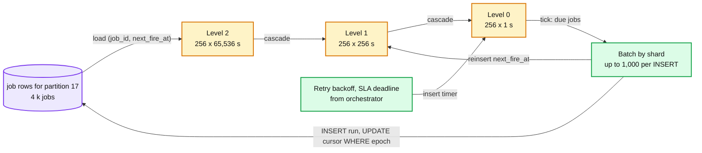
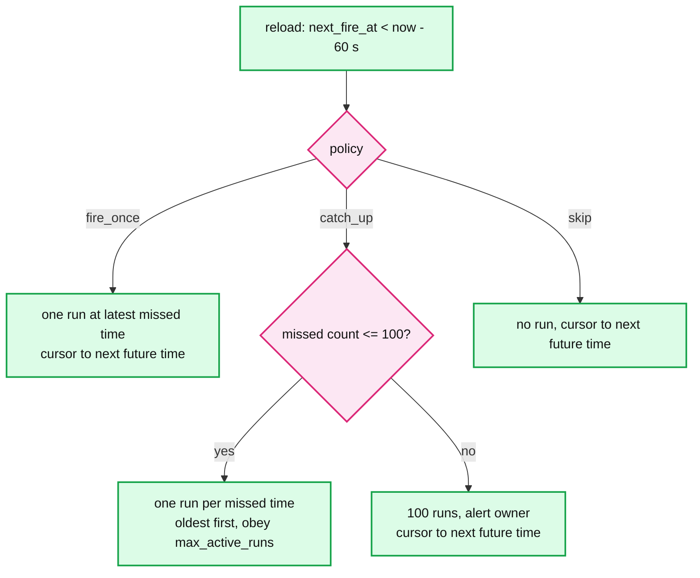

# Deep dive: trigger plane and timers

> One-line answer: hash the 1 M jobs into 256 partitions, lease each partition to one trigger node through etcd with an epoch, load each partition's `(job_id, next_fire_at)` into a hierarchical timing wheel with 1 s ticks, and on each tick pop the due jobs, batch them by metadata shard, and run one transaction per shard that inserts the runs (`ON CONFLICT DO NOTHING`) and advances the cursors (`WHERE owner_epoch = ?`). The database never scans for due jobs; it only records fires. Failover reloads 4 k rows per partition, not 1 M.

Part of [`../solution.md`](../solution.md) §4.1, §5.2, §5.3, §5.4. Sources: Google SRE book chapter on distributed cron (small replicated state, `?` jitter, skip over double launch), Kafka's purgatory timing wheel and Varghese and Lauck 1987, Quartz misfire instructions, Kubernetes CronJob `startingDeadlineSeconds` and the 100 missed schedules rule, Hello Interview's time-bucketed executions table. Links in [`../research/mechanisms-survey.md`](../research/mechanisms-survey.md) and [`../research/real-world-architectures-survey.md`](../research/real-world-architectures-survey.md).

---

## 1. Why not scan the table

```
1 M jobs. Poll every second: SELECT ... WHERE next_fire_at <= now().
Index on next_fire_at makes the read cheap (a few rows most seconds).
But every fire UPDATEs next_fire_at, so the index churns at 2,400 updates/s steady, 900 k in the midnight second.
And precision = poll period + query time + insert time. With one poller, the midnight second is a 900 k row serial job.
The scan is not the cost. The single loop and the coupling of "who is due" to the database are.
```

The trigger plane's state is tiny: `1 M × 32 B = 32 MB`. It fits on one node. We partition it anyway, for two reasons that are not memory or CPU: blast radius (a dead node delays 1/12 of jobs, not all) and reload time on failover (4 k rows per partition, under 1 s).

## 2. The wheel

Hierarchical timing wheel, three levels, 256 slots each.

```
Level 0: 256 slots × 1 s     = covers the next 256 s
Level 1: 256 slots × 256 s   = covers the next ~18 h
Level 2: 256 slots × 65,536 s = covers the next ~194 days
```

Insert a timer for time `t`: pick the coarsest level whose slot width is larger than `t - now`, put it in slot `(t / width) mod 256`. O(1). Every second, level 0's current slot is popped and its timers fire. When level 1's current slot expires, its timers are cascaded into level 0 slots. Same from level 2 to level 1. Kafka's purgatory uses this exact structure for millions of delayed produce and fetch operations.



Why one wheel and not a heap: a binary heap is O(log n) per insert and pop, which is fine at 4 k entries. The wheel wins when the same node also carries retry backoffs and SLA deadlines for the orchestrator shards it is co-located with (about 200 k live timers) and at the midnight pop of 75 k timers in one tick. It also has a property a heap does not: "everything due in this second" is one slot, so batching is free.

Alternative considered: Redis sorted set with `ZRANGEBYSCORE key 0 now` plus a Lua pop. Right answer for tens of thousands of timers and a team without a scheduler; wrong here because Redis becomes a second stateful system whose durability (AOF fsync) we would have to reason about, and the database already holds the truth.

## 3. The fire transaction

```sql
BEGIN;
INSERT INTO run (run_id, job_id, dag_version, scheduled_time, trigger_type, state, lane, created_at)
VALUES (...), (...), ...            -- up to 1,000 rows, all for jobs whose home shard is this one
ON CONFLICT (job_id, scheduled_time, trigger_type) DO NOTHING;

UPDATE job SET next_fire_at = v.next, owner_epoch = 42
FROM (VALUES (job_1, next_1), (job_2, next_2), ...) AS v(job_id, next)
WHERE job.job_id = v.job_id AND job.owner_epoch <= 42;
COMMIT;
```

Properties:
- The run and the cursor move together or not at all. A crash between them cannot lose a fire or double a fire.
- The `ON CONFLICT` makes a second owner's fire a no-op.
- The `owner_epoch <= 42` makes a stale owner's cursor update a no-op, and the row count tells it so.
- `next_fire_at` is computed in the job's timezone with an IANA-aware library, stored in UTC.

The trigger plane then notifies the orchestrator shard for each new run (best effort). The orchestrator also polls `run WHERE state = CREATED` on its shards every second, so a lost notification costs at most one second.

## 4. Misfire policy

A misfire is a fire time that passed while nobody could fire it: node down longer than the lease TTL plus reload, database unavailable, job paused and unpaused, or a `max_active_runs` limit that held the job for longer than one schedule interval.

| Policy | Behaviour | Precedent | Use when |
|---|---|---|---|
| `fire_once` (default) | Create one run for the most recent missed `scheduled_time`, skip the rest, resume the schedule | Quartz `MISFIRE_INSTRUCTION_FIRE_ONCE_NOW`; Kubernetes CronJob with `startingDeadlineSeconds` | Most jobs. "Latest data" matters, history does not |
| `catch_up` | Create a run for every missed `scheduled_time`, oldest first, respecting `max_active_runs` | Airflow `catchup=True` (default is False since 2.x) | Jobs whose output is partitioned by date |
| `skip` | Create nothing for the gap, resume with the next future time | Kubernetes CronJob after 100 missed schedules | Monitoring, cleanup, anything where a late run is noise |

Quartz's `misfireThreshold` default is 60 s: a fire less than 60 s late is not a misfire, it is just late. We use the same threshold. Kubernetes CronJob refuses to catch up more than 100 missed schedules and logs an error; we cap `catch_up` at 100 runs too and alert the owner.



## 5. Jitter: the `?` from Google's cron

Google added `?` to their crontab so a job can say "some minute in hour 0" instead of "00:00". The value is chosen by hashing the job's configuration, so it is stable. We do the same with `spread_seconds`:

```
fire_at = scheduled_time + (hash(job_id) mod spread_seconds)
```

Default 60 s for new jobs. 0 allowed, with a warning in the UI. Deterministic, so the same job fires at the same offset every day and the user can predict it. The run's `scheduled_time` stays the logical time (00:00); only `fire_at` moves. This is different from a throttle: a throttle delays fires the user did not agree to and breaks the precision SLO; a spread is part of the schedule.

Effect on the midnight second (from `solution.md` §2): 5.4 M rows in 1 s becomes 90 k rows/s for 60 s.

## 6. Event triggers

An event trigger is a cron with an external clock. The trigger node that owns the subscribing job's partition consumes `JobRunSucceeded` and `DatasetUpdated` events from Kafka (partitioned by upstream `job_id` or dataset id), maps them to the downstream jobs via a subscription table cached in memory, and runs the same fire transaction with `trigger_type = event` and `scheduled_time = logical_date` from the event. Kafka redelivery hits the unique key. The consumer offset is committed after the transaction commits.

Event triggers with multiple upstreams ("fire when A and B for the same date are both done") are a join. The subscription row carries the set of expected upstreams; the trigger node records arrivals in a small `trigger_state` table on the job's shard and fires when the set is complete. That table is the only state in the trigger plane that is not derivable from `job`.

## 7. Failover math

```
Lease TTL 10 s, keepalive every 3 s.
Node dies right after a keepalive: lease lives 10 s more.
Assigner notices via watch: ~50 ms. Compare-and-swap new assignment: ~10 ms.
New owner reload: SELECT ... WHERE partition = p AND next_fire_at < now() + 5 min. 4 k rows, ~300 ms including network.
Fire overdue: one tick.
Worst case lateness: 10 + 0.1 + 0.3 + 1 = ~11.5 s. Budget is 30 s.
```

Why not a 3 s TTL for 5 s failover: a 4 s GC pause, an etcd leader election (1 to 2 s) plus a slow disk, or a network blip then causes a false failover, which means a reload and a brief second owner. Both are harmless (unique key, epoch), but each one is a spike of 4 k reads and a `partition_without_owner` blip that trains the on-call to ignore the metric. 10 s is where Kubernetes lands too (lease 15 s, renew deadline 10 s, retry 2 s).

## 8. Owner memory as a cache

The owner's wheel can be stale in one direction: a job edited through the API (new cron, paused, deleted) after the owner loaded it. Three defenses:
- The API publishes `JobChanged(job_id, partition)` on a small Kafka topic; owners subscribe to their partitions and reload that row. Latency ~100 ms.
- Every owner refreshes each partition from the DB every 60 s regardless.
- The fire transaction reads nothing from memory that matters for correctness: the run insert carries `dag_version = job.current_version` via a subselect, and a paused job's cursor update has `AND paused = false`, so a stale wheel entry fires zero rows.

## 9. What to say in the interview

- "The trigger plane's state is 32 MB. I partition it for failover time and blast radius, not for size."
- "The DB never asks 'who is due'. It is told 'these fired'. One transaction moves the run and the cursor together."
- "Jitter is Google's `?`. A throttle is lateness; a spread is a schedule."
- "Misfire policy is a per-job choice with three values and a 100-run cap, because a node can be down longer than a schedule interval."
- "Failover is about 12 s and I can show the sum."
