# Diagrams: distributed job scheduler with DAG dependencies

The full D1 to D12 set from `hld/CLAUDE.md` §4. [`solution.md`](solution.md) embeds the most important ones once and links here for the rest. A diagram that lives in `solution.md` is linked, not pasted twice. Colors per root `CLAUDE.md` §3. Red is used for exactly one thing: the metadata store write path during the aligned top-of-hour spike, and the single-owner orchestrator shard that a wide fan-in lands on.

Design recap: trigger plane (partitioned timing wheels, one leased owner per partition) creates runs. Orchestration plane (one owner per run) appends task events and computes ready tasks. Execution plane (matching service per pool, stateless workers) runs attempts under heartbeat leases. Metadata store is sharded by `run_id`. etcd holds partition and shard ownership with epochs.

---

## D1. Context (zoom-out)

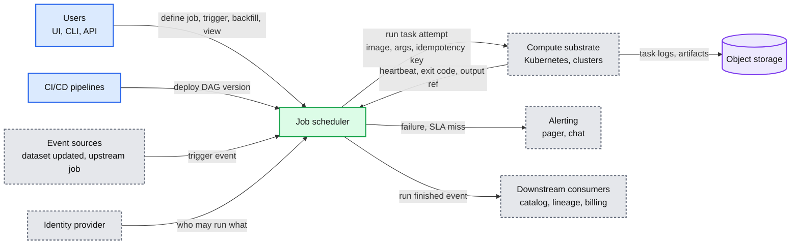

## D2. Data flow (DFD)

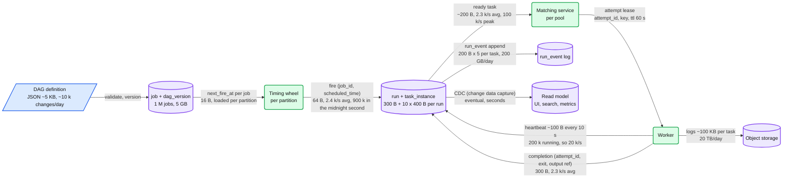

## D3. Component architecture

Embedded in [`solution.md` §6](solution.md#6-final-design). Not repeated here.

## D4. Sequence, happy path, one per FR

- D4a cron trigger creates a run: [`solution.md` §4.1](solution.md#41-trigger-runs-on-time-on-demand-or-on-an-event).
- D4b task completes, downstream becomes ready, worker picks it up: [`solution.md` §4.2](solution.md#42-execute-tasks-in-dependency-order).
- D4c retry after failure, run ends failed, alert: [`solution.md` §4.3](solution.md#43-retries-timeouts-cancellation-and-alerts).
- D4d backfill and repair run: [`solution.md` §4.4](solution.md#44-backfill-a-date-range-and-rerun-a-failed-subtree).
- D4e event trigger (upstream job success), below.

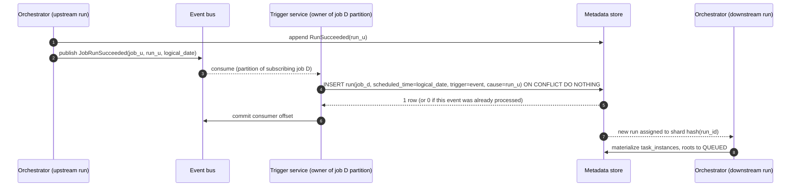

## D5. Sequence, failure paths

- D5a worker finishes the task, then dies before reporting: [`solution.md` §5.1](solution.md#51-how-do-we-guarantee-a-task-is-never-counted-as-done-twice-and-what-happens-when-a-worker-dies-after-finishing).
- D5b trigger owner dies at 08:59:59: [`solution.md` §5.2](solution.md#52-the-scheduler-node-dies-at-085959-do-the-0900-jobs-fire).
- D5c slow worker is declared dead, then reports late, below.
- D5d duplicate cron fire during ownership handover, below.

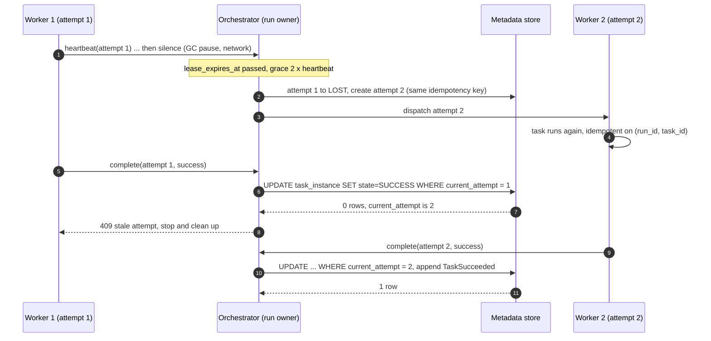

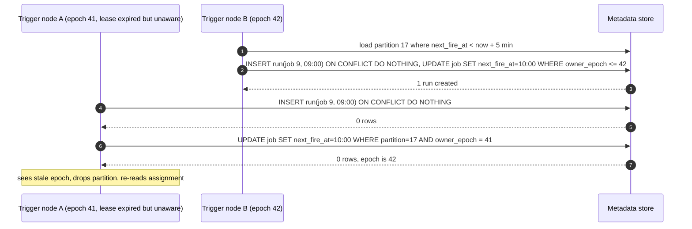

## D6. Activity / decision flow

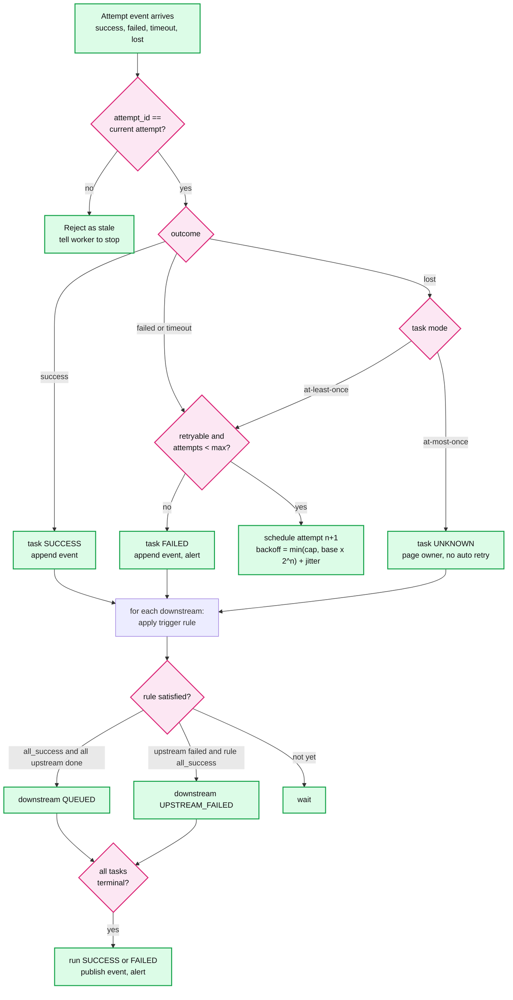

## D7. Entity relationship

Embedded in [`solution.md` §3.3](solution.md#33-data-model). Not repeated here.

## D8. State machines

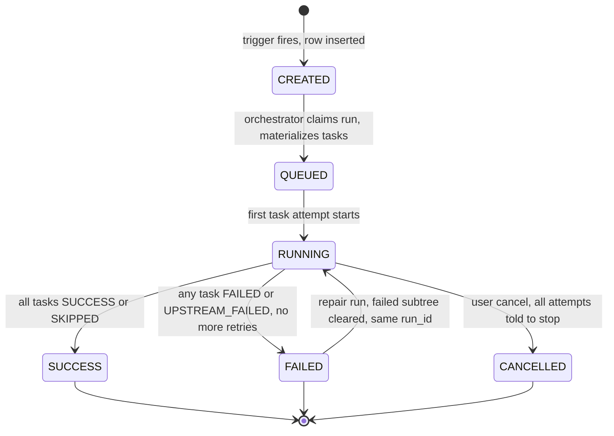

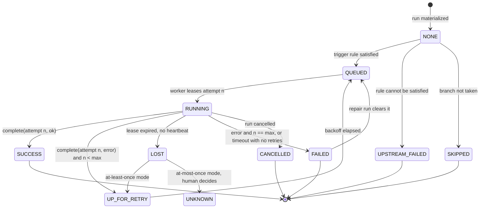

## D9. Deployment / topology

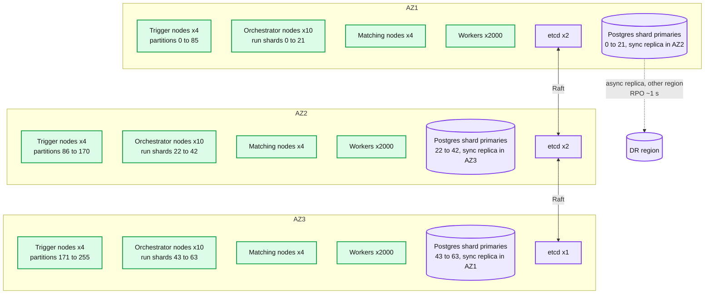

Notes:
- Partition and shard counts are fixed (256 trigger partitions, 64 run shards) and mapped onto whatever nodes are alive. Adding a node moves partitions, never re-hashes data.
- Workers are the only tier that autoscales with load. Everything else scales with job count.
- Cross-region: async replication of the metadata shards, RPO about 1 s. Promotion is manual. See [`solution.md` §10.11](solution.md#1011-evolution).

## D10. Scaling / partitioning

Embedded in [`solution.md` §5.3](solution.md#53-900-k-jobs-fire-at-midnight-what-breaks-first). Not repeated here.

## D11. Failure mode map

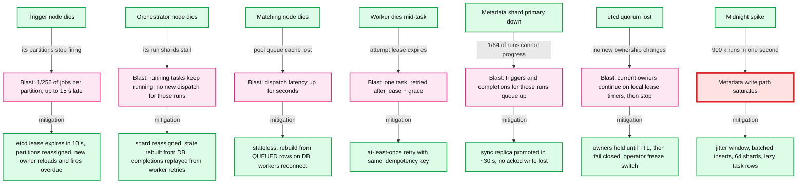

## D12. Rollout / migration

Applicable. The realistic starting point is a fleet of cron boxes plus one single-scheduler Airflow. The migration moves the trigger plane first because a missed trigger is the visible failure, and keeps a rollback point per phase.

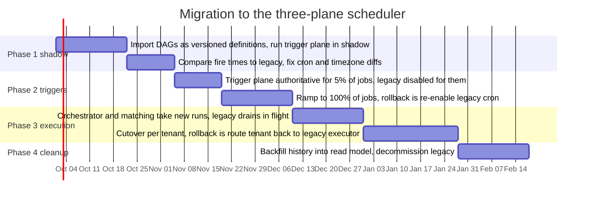

Rollback points: after Phase 1 nothing changed for users. After Phase 2 re-enabling legacy cron for a job is one flag, and the `run` unique key prevents double fires while both are briefly active. After Phase 3 a tenant can be routed back to the legacy executor because run state lives in the metadata store either way.
