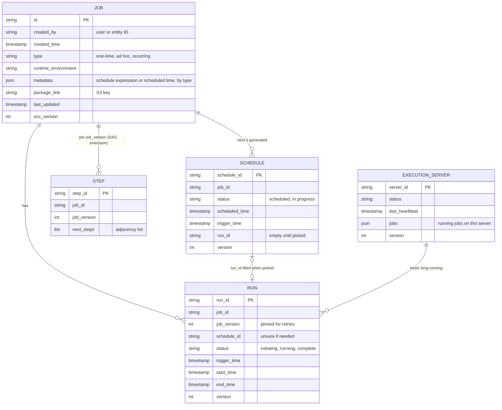
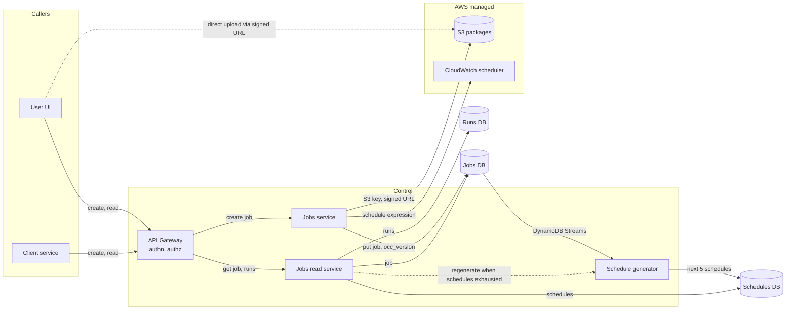
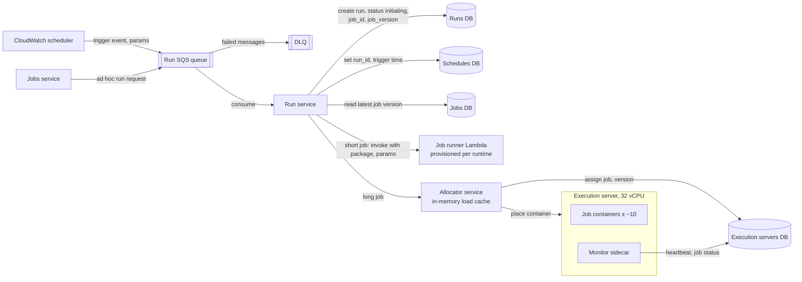
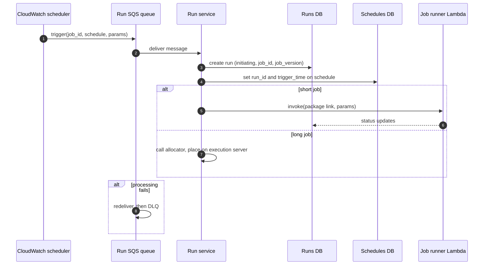
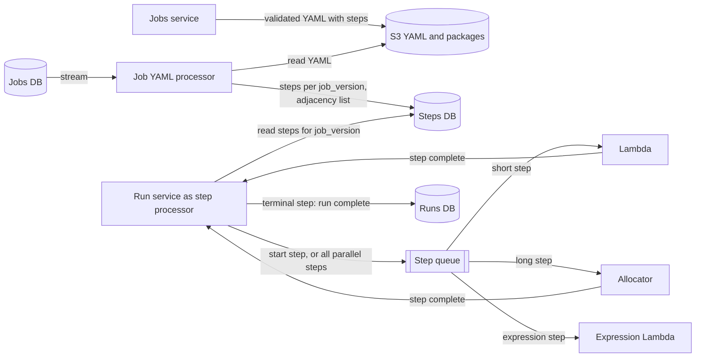
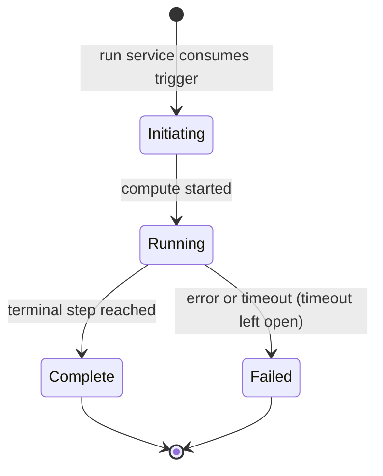

# My attempt: distributed job scheduler (mock interview, ~61 min)

Timed attempt before reading [`solution.md`](solution.md). Order of this document:

1. **Transcript** — auto-transcribed and lightly cleaned; section headings and approximate timestamps added.
2. **Design as presented** — diagrams reconstructed from the transcript. They show what I proposed, not the corrected design.
3. **Review** — Staff-level feedback against [`solution.md`](solution.md).

---

## 1. Transcript

### 1.1 Opening and problem statement (00:00)

So for the next one hour, we will be discussing about the distributed job scheduler. Distributed job scheduler is nothing but majorly the users will be able to create jobs that run at fixed or like ad hoc, ad hocly that can be run. So this is the high level distributed job scheduler.

### 1.2 Functional requirements

And yeah, functional requirements. Coming to the functional requirements, user should be able on the job, and then you should be able to see the run status of the current and the historical data, and also be able to create jobs from multiple technologies. And one of the core requirement that we need to also consider is that we should be providing maybe a one-time or is like a scheduled job which runs sometime later. And ad hoc is just when the user actually clicks run, that's when it will be running. And then recurring is basically a scheduled job that runs like a cron job from time to time.

### 1.3 Non-functional requirements

Yeah, now for this particular system, I think the should be very high. So let's say in the order of like around 4 months. And regarding consistency, so all the at least the read after write consistency should be supported. So consistency should be read after write, and eventual consistency is fine in other cases. Eventual consistency is fine as far as I am thinking.

Then I think what else is required for the jobs. So, yeah, one of the important, I think, non-functional requirement for the system itself should be the graceful handling of the jobs, the graceful handling of the jobs, and all metrics should be possible. So based on the graceful handling, and I think QAS is not a problem.

One guarantee I think we should also ensure is that for scheduled or one time, we should ensure timely runs, like on-time runs. We should ensure on-time runs, maybe with a maximum SLA of, let's say, 500 ms for the trigger. And then it should be, is like it depends on, it should be quickly available. The VM should be basically quickly available, so the job should be quickly up and running. So I believe 500 milliseconds, let's say we consider that.

### 1.4 Scale

And coming to the scale of this particular system, I think we can, let's say this particular system is going to work for companies like Google or Amazon, etc., where they have a lot of event driven architectures, choreography, and all of those like architectures. So basically I think the scale should be like almost like a more than a million jobs running parallely. Then jobs of different types should be supported. And also I think like more than, let's say, 30 million active jobs can be present, meaning they can be having a different schedules and all of those things. So high level, like this is what I feel should be a good scale for this.

### 1.5 Actors, scope and entities

Now coming to the actors, I think the actor will be a simple user. I believe users also will generally not create it, but so the clients should be the actual actors. And yeah, and one of the actor for this particular.

So, out of scope is, I think one thing that we will keep out of scope is definitely, even though it's a job scheduler, so we will talk more about how the jobs will be running, not about the scheduling part. So scheduling, I think we will hand it over to some other third party scheduling service. So scheduler, like the actual scheduler implementation is out of scope.

Then coming to, yes, the client will be, the actors will be, scheduler will be there. So this is the thing. So users, yeah, the clients will be there, who will, which will be creating automatically or fetching the status or something. But users also will be, should be able to create and see is the jobs that they are actually owning. So that's where the users are coming into picture. And yeah, actors are these.

And so when it comes to entities, I think, yeah, a job, basically a job definition and all of those things. Then maybe what else is there required? So I think users are is important entities, but I think user entities will be by default present is what I expect. Authorization and authentication are not considered, so I am not going to consider the entities over there. So schedules is one more thing, one more big entity that we will be having. And apart from this, maybe I think we can also keep the notification also out of scope. Notification also out of scope.

Entities, jobs, schedulers, and maybe runs is one thing. So jobs is one thing. Job is the definition, run is the actual instance, and schedule is basically a trigger kind of a thing. Not a trigger, basically it is like an individual instance of the schedule. So you can say it's almost like one-to-one mapping for the runs that we have.

So this is the way that I am thinking, and one note. So I think one thing that we can simplify here firstly is that we will start with a basic job scheduler, meaning the whole job will be written in a single script. So multiple steps and everything are taken care by the owner itself, not by us. But I think eventually, eventually we will talk about the DAG approach of service, multi-step service, multi-step jobs.

So basically in case of the multi-step jobs, maybe I think what we will also have is steps. So steps and step instances may be the case. I think that's where it is. Or the run is there, and maybe we will have this data. I think steps will be one more granular information. I think right now, let's see, maybe the job definition itself will contain the steps. I think we can derive it from there.

### 1.6 APIs (~09:30)

So yes, first and foremost about the data model or the APIs, basically. Yes, I think I'll put for create, okay, job, jobs slash create. So here headers, maybe we'll take the user ID so that he can have access to the, like we will identify who is actually creating it and all. And then user ID or entity ID. I think it can be anything. So in future, if we want to provide a way for the entities to automatically create, we can have both. So user ID or entity ID, anything. I think we will see that.

Now coming to the body. So the body can be of two types, so I believe. So for now, I think we can here, I think one thing that I am thinking here is that in the request body, we will give all the job details, right? Job details of the details like name, then the type of the job, the, what is that, runtime environment of the job that are supported, and a high level understanding of memory and the CPU that is required, that can be stated here.

Yeah, I think you can also consider this to be a YAML file as well. So you can share it as an YAML, and we will extract all the information from that YAML, like including the permissions and all of those things, because permissions are much, much necessary. Like which account type, which role we need to use, let's say for AWS, right? So if we have to assume a role, so which is the role? So all of those information will be present. So I think instead of keeping it in a body, like the simplest way is to present right now is in the body. But I believe that we can also keep it in a YAML file.

And one more thing is that the size of the media, media is basically, I think the size of the package basically. Basically the package is nothing but the actual script that has to be written or the whole environment. Let's say in case of Java, you need to give it a JAR, so that it can be running with all the, like we can unpack the JAR and then it can be run, right? So those are the things.

So I believe what we can do is this size of the package, maybe instead of giving the size of the package, we can give this. And then in the response you will get an ID for the job. Status is something like pending source or something. And then we will get a signed upload URL. So upload URL for like this is the signed URL that you will get. So within the signed URL, you will go and update. And then we will, let's say, let's say it actually creates, the client actually uploads it. So within the UI, if the user does that, I think the upload, when you click on the upload, that's when the upload URL will be picked up, and then direct upload will happen over there.

Is also in case of the clients. So you can say that jobs / dot ID / upload, or maybe you can directly upload as well. So I think upload is necessary for the UX, but not for this one. So I think we can ignore that.

Then coming to the updates, I think update is also the same. Is basically, I think what I'm thinking is instead of jobs / ID and ID, when you say delete, it will be soft marked as deleted, and that's it. Nothing more than that. And then we will look at it later, like how to process that particular delete. And all of those things will almost look like the create only, where the body, everything is there, and then the YAML file is also updated. So maybe that's the way that we can think of.

And what else is there? CRUD may read. So the GET API for the slash of jobs slash ID will have all the earlier responses, like earlier response in the sense of ID and status, or next scheduled time or runtime, previous five runs or something like that. And yes, this is the thing.

And now coming to similarly, we can have a GET for the... So it will be a pagination of all of this. And because it is time series based, I think we can use the last runtime or something like that. And you can use the pagination. So basically, yes, it will be a list of this. And similarly to the earlier previous five runs, the object is the same. Response, we will have a list of the runs. So it will be like run ID, the status of it, what is the start time, end time if it is required, and the average CPU usage and memory usage.

And I think we can also present the log layer, but I don't believe that. So logs link can also be presented here, but I don't think right now we are going to support. So like any discussion of logs, like we assume that there is a log support here. So logs support is already present. For instance, cloud, you can think of like we are using the CloudWatch Logs for any publishing. So I think most of this is AWS related. So even if it is a relational DB, let's say we will go with the AWS MySQL or the RRRDB basically. So that's how it is.

Now, I think we have a decent understanding of this. Before, I think the data model, I will see as we fly into the, as we go into the HLD, we will understand more about the details of the data model, and we will see there.

### 1.7 High-level design: create path (~19:00)

So coming to the HLD part, so yes, I think, let's say we have an API Gateway. It is a normal routine where we have the authentication, authorization, and everything will happen. And so there will be a client who will be like calling the API Gateway, and then there can be a user as well who can be calling the API.

So let's say we will walk down the path of a create. So a create, whenever the client creates, or a user, let's say for this matter, for this time we will use the user, will call create. And then what happens is maybe we will have a jobs service which actually takes this request, validates. I think Authy and authentication and everything done. So now, like it will simply is a signed URL, and then there will be... So basically, it will create an S3 key and save that S3 key in...

So basically, we will have... So this is the database. We can... I'll think about the database. Right now, what I am thinking is this. So this is the jobs DB. So within this jobs DB, we will have ID, created by. We will have the entity ID or the user ID, and created time is there. Then the type is there, runtime, environment is there. We have discussed about all of this, right? The schedule, like schedule expression, right? If this is only present for the type, the schedule, for the other...

So I think maybe what we can do is that we can have a metadata field, which is like a duplicate. It's a multiplexed object which can have, which it's a basically adjacent of different kinds. So let's say the type is scheduled now, then you will have the schedule expression here. And then if it is ad hoc, or sorry, not ad hoc, if it is one time, then you might have the start type or the scheduled time or something like that. So within the metadata, so it's the same object, just that the metadata will change. And that is, the metadata will change per object.

And then, yeah, I think last updated time. We will have a OCC version, basically. So clearly it is BOSAC version, so that we can ensure that the latest record is always the, can be written in a consistent fashion.

So with this, I think we, right now we can assume that what we are doing is we are using the DynamoDB as a basic, as the, so DB for this particular jobs. And is there a reason for me to do anything else? I believe not, because I don't think we will have a cross join and multiple query types anywhere here. So I believe we can have it as a DynamoDB itself.

So yes, whenever this is there, like internally we will create an S3 key and... So the S3 key will ask for the signed URL, and then that signed URL is presented to the user or the client. And then let's say the client or the user uploads it, uploads to it directly. So this way, I think the package can be handled easily. Yeah, this way the package can be handled very easily, so it can be uploaded very easily. So this is the way. So you will also have here the package, what do you say? Okay. So, link. Maybe it can be the S3 or anything you can use it. So that's why we can keep it like this.

### 1.8 Scheduling and the schedules table (~24:30)

Now coming to the job has been created. The S3 has been done. So now what will happen from here is that the schedules have to be created. So let's say we use, as discussed earlier, right now we will be... So, since we are not having any tag or anything, so there are no steps. So right now we have to go and create a schedule.

So basically, what we will do is that we can have an alternative, like we can use the CloudWatch service here to create the schedules. I believe CloudWatch also gives you the same level of things. We don't create anything, but for others we do create. Yeah, I think AWS CloudWatch we can create, and that will be like you will create an entry here. So the CloudWatch is an external entity. We are going to use it similar to S3 and... So this is the scheduler. This will be acting as the scheduler. So here we will pass on the schedule expression or the schedule time according to their own API structure and all. So the schedule will be created here.

The other part, I think, what I am thinking is that, so we have actually... So the higher level, when I was thinking about the schedules entity, the major reason why I was thinking it is that maybe we want to know when are the next few runs, etc. So that was the reason why the schedule is actually created.

So I think what we can do is that this can be an eventual one. Like you don't really need it to be strongly consistent. So for that matter, what we can do is that from the DynamoDB, we can have an event stream. So it can be DynamoDB Streams or Kafka or anything. So this event stream will be listened to. So this can be like a schedule generator or something like that.

So basically, we will, let's say as a configuration, we will say that, okay, these are the next five schedules that we are having, right? So that if that is the case, so basically we will have a table like we discussed, the schedules DB, right? So the schedules DB will have the schedule ID, the status of it. Is it scheduled, or is it in progress or anything like that? What is the start exact timestamp, and what is the actual end time, and what is the... So status is... So there are two things. One is the status, and the other one is the job. So maybe I think we can use the run data here. So that's where the run ID will be there here. So run ID will be empty.

At the runs are being picked up, that is when this schedule will be created. So yes, the schedule ID, I think so, the run ID and the schedule ID is present. Yeah, I think version is also important just to make sure that everything is running consistently and we are not running the, like, we can make sure that is ensured based on the status. We will not go back to the earlier status if it is, like, if the start time has already run. So we will make sure that the run ID and the status are already there, and then we will not update it back and all of those things. But all of these needs a version to be present so that even during a stale read you will not be updating it back. So that is the OCC version is still needed.

So you will write it to the schedules DB and then, so this is one way. So what happens is this one, and the second thing is, so schedules will be created like this. So slowly it will be percolated. I think we can have a separate schedule service, but as of now I feel that job service is already a slow, like a less frequent process. Maybe, I think because of separation of concerns, maybe we can have a read service, jobs read service, which will also fetch the details of the schedules as well. So yeah, frequently accessed jobs, I think you can have it a cache. I really don't think that is necessary. So you can also use a tax for that matter if that is needed.

But yeah, so whenever you are reading the schedule, you will try to read it from the job scheduler service, and then it will pick the job ID. And for that job ID, it will also go and fetch the schedules. Yeah, so this will happen now. And also we need to introduce the runs DB. So what will happen is that we will have a run ID for the job ID. One thing, I think here also within the run ID we will have a job ID and the job version. So that we ensure that we will be able to identify what is the version of the runtime environment or the package that we have written, right?

So whenever you update the package, you might run into a new version, and that at that time you do not want, let's say if you want to retry, you do not want to change the job type, the entire runtime, and then do it in a different way. So basically that's for the idempotency purpose. So we will save the job ID and the job version so that the package source, everything remains the same. So this way it is also present. And the schedule ID, I believe we do, do we need to put it here? I don't know. But yeah, anyhow, the run status, same, the start time, the end time.

Yeah, so here I think is better for the schedule to actually have the trigger time, not the start time and end time. So trigger time and actually scheduled time. So this is what will happen. And the start time and end time, and again maybe, maybe because it can be written by multiple, so you will have a version status so that it is consistent approach. Now how does this runs DB? So the runs DB is also. Firstly, it is also fetched from the runs DB.

So one thing that we need to ensure here is, one thing I want to clarify is, so within the schedules, so we are creating five schedules, right? The generation, the schedule generation is only five. But what if those schedules are completed and then you are reading this job service? So at that time also, maybe this particular schedule generator, we can trigger this particular schedule generator from here, and then it will automatically create those schedules again. So this way it will ensure that the same logic is being repeatedly used, and also we are ensuring that the whole thing is consistent. So that's the way it is.

### 1.9 Runs and execution

Now coming to the runs DB. So how is it getting created, the entry that is getting created? So that is the actual run. So I think there are two things. One is maybe a run, a job. So basically what we can do here is, initially what I was thinking is that we will support, we will do this through Lambda. Okay. So we will have a custom package which will be saying that, okay, we will pull this package, expand the package and start running it. So that's why what I wanted to do here is that we can have a Lambda here. Okay. So it is basically the job runner Lambda.

So for every, let's say within the CloudWatch also, we will have different run times. So basically based on the run time, we will trigger which Lambda environment we need to trigger, so that based on that we will be able to identify. And yeah, so for now I am simply thinking that the job service or the job run service, a job service can actually create. So it is basically a background one. So the run service can simply say that whenever this trigger actually happens, this particular Lambda, it automatically gets triggered from the job service for ad hoc ones, not for this one.

So the run service goes and picks up the schedule for that particular run. And if it is ad hoc, it will simply ignore. But if it is not ad hoc, it will go for the schedules DB. And then it will first start a run and then update the schedules DB with the run ID. Okay. So that way you will, and also whatever the trigger that has come. So we will put the trigger ID, trigger time and everything. And because the CloudWatch is, like if it is basically a failure, so what we, so we can have a reconciler basically in the background from the event streams.

But in general, for the ad hoc, it will give us success only if the run ID has been started, and then it is also able to save the schedules, and then it is able to start the actual job. So only after that it will be able to save. So let's say if the customer actually clicks, or if the user again clicks on it for the same ad hoc, if there is a run ID that has already been created. Okay, I think ad hoc may there are no runs, so that's why I think.

So I think, okay, now I get it. So basically ad hoc, so there is no schedule. So that is why when you click on it, it will directly go and create the run ID and that's it. So that is done. But when you come and click on the CloudWatch event, so it creates a run and it will also say that, okay, this is the run ID and this is the schedule ID. And then it will, so based on this event, the run ID event, it will basically, let's say there is another background service, which actually gets triggered. So this is the one that actually gets triggered. So once the run is enabled, so here we will have the actual Lambda, like actual run event.

With the run ID, will pick up the job ID. It will read the jobs and get the latest version from the jobs. So based on the actual job. So this is a job. Okay. So, oh yes, okay. So yes, based on the job data, it will pick it up. It will first update that job version, then pull the data, and then it will start running it.

### 1.10 Latency budget and redesign

So I think coming back, circling back to the SLA of 500 milliseconds for the reaction time, I think let's say that the CloudWatch is zero. There is no propagation time. But the trigger has come, and basically the streams are triggered at, let's say, 20 milliseconds because it is within the same. So the run service, let's say it has to update 2 DBs in the worst case also, even if it is with multiple retries, maybe if it takes another 200 milliseconds there. And then the event stream has to be created, and the event stream has to come to the run service. And then again, run service has to do the jobs and all of this.

So basically, I think this is a huge... I think we will not be able to, like, achieve the 500 milliseconds with this particular architecture. But it is a better architecture in a way that it is decoupled. So basically, you are creating the entry and ensuring that that particular schedule is actually triggered, or it has been taken, is being taken care of, and then it actually runs.

But because this is an event stream also, so what I think is that the streams can also have a DLQ. So as far as I understand, let's say if you put the trigger into the SQS, and then also the ad hoc runs also into the SQS, and the same SQS can have the same DLQ. And this SQS will be read by this actual run. And in that, before actually triggering the Lambda, you will just do this, like update the run and everything, and then give it that, okay, this is the actual, like these are the startup parameters, this is the package from where you need to run, et cetera. And then you trigger the Lambda.

And because, let's say, Lambda takes, in general, Lambda takes 250 milliseconds, is what I do, for all for the cold start. And also sometimes it will also go to one second. But I think we will use the provisioned throughput here, provisioned throughput based on some back-of-the-envelope calculations that we will have. So we will use the provisioned throughput for, like, making sure that the data is already warm and all, so I believe.

So now again, if I iterate, so in this particular case, so there is no run service, but it is only the actual run service that is actually doing all of this. So what happens is that the only thing is that we need to make sure that the runs happen in an idempotent way, so that when it is actually triggered back, so all of this is not going to be an issue.

So yeah, again coming back, so the job service, I think the schedules will be created. So the CloudWatch will trigger the event, so it will go to... For the ad hoc one also, ad hoc one also will have the ad hoc queue, or as like. And then the actual run service will have consumers at their end. And then it will pick up that particular consumer, it will pick up that particular queue, and then generates a run for it, gets the job version and the job ID, and updates it. And then it's like it will be, let's say, maybe just we can have a initiating stage here in the status, and then you update it in the schedules.

So once this transaction is updated, then you don't really do not need another event here. So basically, you will go and directly with the parameters that are there. So the parameters can be coming through the CloudWatch event as well as this one as well. So this will look, that will be part of the queues itself. So that object will be there, and then the Lambda will be triggered with this. So this is how it is. I think this is a better architecture. I think this will actually work. So this is it.

And yeah, now comes the other important question. So basically, how will we reduce the latency? And also, we are using the provision throughput. We have reduced several hops and all of those things. So now I think we can be comfortably under 500 milliseconds. But what will happen? So there is another question that can be the case. So that is like, what will happen if the user or client has jobs which run for a very long time?

### 1.11 Long-running jobs and the allocator (~45:30)

Is not a good fit for a long-running job. So definitely, I think what we should do is that we can have some kind of a sandboxed servers, Docker containers that will be. So let's say we have the servers within which we can run these Docker containers, and we can have an allocator service. So basically, we can create an allocator service internally. So it can be something like a very consistent one. So basically, we can use the DynamoDB here itself the same way, in a consistent way.

So every service, every server will have, let's say, an entry in the, like, execution service or something like that. So whenever they come up, they go and update the status. And also with a heartbeat, they will also keep updating this execution servers DB. So the allocator service will actually... So the run service, what it will do, it will call the allocator service. And then it will, the allocator service will check the execution server based on the load and the number of jobs that are allocated to it. So it will try to organize it.

And then maybe you can have an in-memory cache because the execution servers might not be as many, even though there can be, like, 1 million jobs that are actively running. But I don't think, like, even if you run, like, let's say we have a 32 vCPUs container server. And within that 32 vCPUs container, you can easily run, like, let's say, based on the different allocation needs, you can, let's say, run 10. So that means, like, 1 million by 10, it is like 100K servers. So 100K servers, even if they exist, the allocator service will have a very small memory to be storing that. So that's why I don't think it's a problem.

So yes, you will have an internal cache that will be there with you, that will be there with the allocator service. It will decide, and it will write to the execution server with some version and the job ID. So it will have metadata or jobs data or something. So it will have, let's say, the running status of all the jobs that is there. So it will keep on get updating all these jobs. So maybe it's like a JSON blob of almost like 617 entries. So that's how it will be. So this is how the...

So based on the size of the, like, we can also have us the metadata from the user itself, like it's a long-running one or it's a small one. So if it's a long-running one, we can use the allocator service to actually run it on the execution servers. If it's a small running one, we can use the Lambda. So that way, we can also offload a certain level of, like, all of this complexity to Lambda if the problem statement is smaller.

Now coming. So, the status, the heartbeats will be present, like each execution server will have a sidecar running, which will present the data of what is the job status, what is the... It will keep on publishing that information. So there will be a separate sidecar here. So yes, job monitor sidecar, and also it can be the server monitor as well. So basically, it's a monitor sidecar that will be there for our jobs itself. So this is the way it is.

### 1.12 Extending to DAGs (~52:00)

I think the next important question that we have discussed is how can we extend to a DAG-based approach? So I think this is the latest one where the Step Functions, et cetera, are actually, like, coming into picture. So I believe the DAG is something like we discussed. I think we already have most of the support. So the YAML files, we said that we will take these jobs as a YAML file. And then we said that, we already mentioned that we have Lambdas for all the small running jobs. So even though if this particular job is a very big job, so what I feel is that, so we can have a YAML file within which there are steps which is, like, will be validated. We will have a library which will be validating this YAML file for the steps to...

And avoid all the cyclicalities and all of those things. And also, it can, let's say, there can be two steps, which can be like one that can be running on, that has to run, that has some runtime environment. So some runtime environment is exactly the same as the existing job ID runtime environment and all of those things. So you will have a separate package. Everything will be there for that. Or it can also be an expression.

So a simple expression one, maybe that, in that case, I think we can hand it over to maybe an expression Lambda or something, where this particular, this runtime is basically our own expression language, which we'll find it and then save it. So yes, so whenever this YAML has been processed, so the jobs service will take this jobs data, and also YAML will also be uploaded to the S3 along with the package. And then this YAML, let's say, similar to the schedule generator, there will be some kind of a job YAML processor or something like that. So this will actually, like the basic ones will be present, but for longer other things, like multiple steps, etc., will have to be created, right? So that will be.

So basically, this will trigger the job YAML processor, and the job YAML processor will actually fetch the YAML from the DB. Validation is already done before the update, and even in the job service also we can do. But after the validation, I will try to identify the steps, and then basically we will.

So basically, I think for the steps, because it's a DAG, you don't need to worry that we will somehow have some cyclicality or anything. But definitely we will have a step ID with the job version and job ID, and the step ID is updated every time the job ID and the job version will be updated, and its actual step has to be updated. So basically, I think we will update the job version if that particular step is not yet updated. If the step itself has been updated, or its sequence has been updated or something like that, then we will create a new version of it. So that's how I am thinking about it.

So basically, it's like a doubly linked list or something, or it's like a DAG approach where you have the adjacency list. So from the node, the next way will have the two nodes. So that's the whole process. So the steps DB will have this. I'm thinking the job version should also be, job ID and job version should be present so that we will get to know which step ID is used for what, so that whenever we are running, I think only one single job version will be picked up.

And then, yes, so the only thing that will actually change here is the run will be updated. But then for that particular job version and the job status, we will have to go and pick up the steps. So here, what we will do is that we will pick up these steps, and then we can have a circular, like another queue, which actually is a sequence of these steps. Like, let's say the step is X. If there is parallel steps, then we will put all of those steps into the queue. If not, then we will put only a single step.

So basically, we will have something like a step queue, which is what will actually, instead of the, is what actually triggers the Lambda now. And the same process earlier, like earlier, the step execution process or something. So if it's a long-running one, you will go and use the allocator service. If it's a short-running one, it is the Lambda. So the only thing that has changed is within a single run you can have multiple steps. So basically, the step, the actual run service is the one that will take care of this. And whenever the Lambda has been completed, so it will.

So the step processor, the actual run service here is the, let's say you can call it the step processor as well. So it assumes the role of the step processor, and then it will read the next step, whatever is the next step from the current processed steps, and it will put in the step queue, and the same thing again runs, is the way. So YAML, then we will extend, convert run executioner to step executioner and use, like we will introduce step queue for processing each step. And, like, next step will be put into the step queue when the current step is completed. I think there is some caveats, like what if a particular step is waiting for all the other parallel steps to complete? So these are.

So this way, once the last step has been executed, that we reached the terminal state, reached the terminal step. So I think terminal step and the start step are always there. So they are existing even without the YAML processor. So when we reached the terminal step, that's when it actually triggers. It has a different handling, and that is basically in this particular step, we will always, like every step has the run ID for which it is running, so it will go ahead and update the run ID with the status. So that way, we will go ahead and complete the state. Run will be updated with complete status.

### 1.13 Closing notes (~59:30)

So there are multiple things. So one more thing I think we did not actually get a chance to ensure. So within these, like for Lambda, we know that the timeouts will be handled. But for allocator service within the execution servers, we should also contain that there should be some kind of a timeout with the expectations that the user have set. So these are some things that we have to handle. Whether that is needed or not is also a product concern. So first we need to consider that, and then we need to discuss how we can do it. So this is the one. The second thing is that.

Yeah, I believe these are the things, and I think there will be some kind of an improvement, like the jobs read service will have to do something more. Within the runs, it is not like showing the runs exactly as it is, but it is also like per step what exactly has happened. So we need to have that. So I think we have to introduce one more DB, which is basically the step exit.

---

## 2. Design as presented

Reconstructed from the transcript. Names match what I said. Where I was unsure or changed my mind live, it is marked.

### 2.1 Requirements as stated

| Area | What I said |
|---|---|
| Functional | Create, update, soft-delete jobs. View current and historical run status. Multiple runtimes. Job types: one-time, ad hoc (user clicks run), recurring (cron). DAG / multi-step jobs as an extension |
| Consistency | Read-after-write for jobs; eventual elsewhere (schedules view) |
| Availability | "Very high" (said as "order of 4 months"; meant four nines) |
| Trigger SLA | 500 ms from trigger to job running, including compute being ready |
| Scale | > 1 M jobs running in parallel, > 30 M active job definitions |
| Other | "Graceful handling of jobs", metrics |
| Out of scope | Scheduler implementation (delegated to a managed scheduler), auth, notifications, log storage (assume CloudWatch Logs) |
| Simplification | Start with single-script jobs; steps are the owner's problem. Extend to DAG later |

### 2.2 APIs

| Method | Path | Body / notes | Returns |
|---|---|---|---|
| POST | `/jobs/create` | Header: user ID or entity ID. Body (or YAML): name, type, runtime environment, CPU and memory, IAM role to assume, schedule, package size | job ID, status `pending source`, signed S3 upload URL |
| PUT | `/jobs/{id}` | Same as create; YAML re-uploaded | job |
| DELETE | `/jobs/{id}` | Soft delete; processed later | — |
| GET | `/jobs/{id}` | — | ID, status, next scheduled time, previous 5 runs |
| GET | `/jobs/{id}/runs` | Paginated by last run time | run ID, status, start, end, avg CPU and memory, (log link) |

### 2.3 Data model (all DynamoDB)

### 2.4 Architecture: create and schedule path

What to notice:
- Two schedule records: CloudWatch holds the real schedule; the Schedules DB holds the next 5 for display and run linkage.
- The schedule generator is fed by streams and also poked from the read path.
- Every table carries a version for optimistic concurrency.

### 2.5 Architecture: trigger and execution path (final version)

What to notice:
- The run service writes Runs DB and Schedules DB, then invokes compute directly; no second event hop.
- Short versus long jobs are routed by user-provided metadata.
- Capacity estimate: 1 M concurrent jobs / 10 per server = 100 k servers, small enough for the allocator to cache in memory.

### 2.6 Trigger sequence and the latency redesign

The first version I drew had an extra hop: the run service wrote the run, a stream event fired a second service, and that service invoked Lambda. My budget walk-through (streams ~20 ms, two DB writes with retries ~200 ms, second event hop, Lambda cold start 250 ms to 1 s) showed it could not meet 500 ms. I removed the hop and added SQS with a DLQ and provisioned Lambda.

### 2.7 DAG extension

What to notice:
- Start and terminal steps always exist; the terminal step marks the run complete.
- On completion, the step processor enqueues the next steps.
- Open at the end: a step waiting on several parallel parents, step timeouts on execution servers, and a per-step execution table for the read service.

### 2.8 Run status as presented

Statuses were described loosely; `Failed` is implied, not stated.

---

## 3. Review

Overall: component thinking is solid at Senior level, but as presented this would likely be graded **below the Staff bar**. The gap is not knowledge. The hardest parts of the problem were scoped out or never reached, and the design was discovered live rather than driven.

### 3.1 How the hour was spent

| Time | Section | Staff-level target |
|---|---|---|
| 0–9 min | Requirements, actors, entities | ~5 min |
| 9–19 min | APIs (create, upload URL, CRUD, pagination) | ~3 min |
| 19–45 min | HLD for a single-script job, including redesigning the trigger path | ~12 min |
| 45–52 min | Long-running jobs, allocator | part of deep dives |
| 52–61 min | DAG extension, unfinished | ~10 min |
| — | Failures, duplicates, midnight spike, trade-offs | **never reached**; this is where Staff is graded |

### 3.2 What went well

- **Starting simple, then extending to DAGs** was a good way to structure the problem. Naming it upfront helps.
- **Pinning `job_version` on the run** so retries use the same package is exactly right. `solution.md` does the same.
- **The signed upload URL** for packages is a practical detail that shows real production experience.
- **OCC versions and forward-only status transitions** show good instincts about stale writes.
- **Catching that the design missed the 500 ms SLA** and removing a hop is a positive signal. At Staff level the interviewer wants to see that before drawing the design, not after.
- **Splitting work between Lambda and a container fleet**, with a heartbeating allocator and a sanity check on server count, is a reasonable execution-plane sketch.

### 3.3 Gaps that matter for Staff

**1. The scheduler was scoped out.** Handing triggers to CloudWatch removes the core of a job scheduler question. Expect: "Assume it doesn't exist. How do 30 M schedules fire on time, and what happens when the node holding them dies?" A managed service is a fine Good rung; the Great rung is partitioned timers, leases with fencing, and a unique run key on `(job_id, scheduled_time)`.

**2. Execution semantics were never stated.** At-least-once versus at-most-once is the most important NFR here. The chosen stack delivers duplicates at every hop:
- Scheduled triggers can fire more than once.
- SQS standard queues deliver at least once.
- Async Lambda invocations retry on failure.

A Staff answer names where duplicates enter, how the platform removes them (a conditional put on a run key), and what idempotency key it hands to the task author.

**3. NFRs were vague or inconsistent.**
- Availability needs a crisp number (four nines).
- "Graceful handling" and "all metrics should be possible" aren't measurable.
- The 500 ms SLA mixed trigger precision (run created on time) with start latency (container running). Start depends on pool capacity. Split them, as `solution.md` does: 1 s trigger precision, 2 s dispatch given a free slot.

**4. No back-of-envelope.** 30 M jobs and 1 M concurrent were stated but never turned into runs/day, writes/sec, or the top-of-hour burst. "What happens at midnight" is one of the most likely follow-ups, and jitter or lazy materialization never came up because the numbers never exposed the problem.

**5. The schedules table is a second source of truth.** The next five occurrences live in CloudWatch and in the Schedules DB. Questions to answer:
- The user edits the cron. Who deletes stale future schedules?
- The generator is also triggered from the read path. A read with side effects is a red flag.
- Run creation writes Runs DB and Schedules DB. Is that atomic? In DynamoDB that means `TransactWriteItems` or a conditional put.
- The background reconciler was mentioned but never designed.

**6. Failure handling was deferred.** Timeouts on execution servers became "a product concern." Worker death, heartbeat loss, retry policy, allocator failure, and a slow worker reporting after its replacement were not discussed. At Staff level, start from failure paths.

**7. The DAG design breaks on fan-in.** "Enqueue the next step when the current one completes" works for chains. Two parents finishing together will both enqueue the child unless there is a single owner per run, or an in-degree counter decremented with a conditional update. Trigger rules (what happens to C when B fails), repair of only the failed subtree, and backfill were not covered.

**8. Presentation and precision.**
- Lots of backtracking out loud ("okay, now I get it"). Thinking aloud should sound like weighing options, not searching for the design.
- Terminology: provisioned *concurrency* for Lambda, not throughput; time-based triggers are *EventBridge Scheduler*, not CloudWatch.
- Lambda's 15-minute limit and account concurrency limits would have justified the container split instead of it sounding like a preference.
- Committing to AWS services early made it harder to discuss the mechanisms underneath.

### 3.4 Next attempt checklist

1. **One-line answer in the first 5 minutes.** "Three planes. Triggers are partitioned and leased with a fencing epoch. Each run has a single owner that walks the DAG. Workers pull, holding heartbeat leases. Execution is at-least-once with a platform idempotency key." Then name the three hard parts.
2. **Numbers on the NFRs**, including execution semantics and the midnight spike.
3. **3 minutes on APIs**, not 10.
4. **Drive the HLD with failure questions:** scheduler dies at 08:59:59; worker slow, not dead; worker finishes but dies before reporting; 900 k jobs at midnight.
5. **Close with a trade-offs table and what you refused to build.**
