# HLD: Distributed job scheduler with DAG dependencies

> One-line answer: three planes that fail independently. A **trigger plane** hashes 1 M jobs into 256 partitions, leases each partition to one node through etcd with a fencing epoch, keeps each partition's `next_fire_at` values in an in-memory timing wheel, and creates a `run` row (unique on `job_id, scheduled_time`) in the same transaction that advances the cursor. An **orchestration plane** gives every run exactly one owner, which appends each task state change to a per-run event log, updates the `task_instance` row in the same local transaction, and computes newly ready tasks by in-degree counting under the task's trigger rule. An **execution plane** of stateless workers long-polls a per-pool matching service, holds a 60 s heartbeat lease per attempt, and reports completion with the attempt's fencing token. Execution is at-least-once with a platform-issued idempotency key `(run_id, task_id)`; at-most-once is a per-task option that turns a lost lease into a page instead of a retry.

Sources this follows: Google's SRE book chapter on distributed cron (small Paxos-replicated state, "favor skipping launches rather than risking double launches", the `?` jitter extension), Apache Airflow 2 and 3 (`SELECT ... FOR UPDATE SKIP LOCKED` multi-scheduler, 5 s heartbeats, 300 s `task_instance_heartbeat_timeout`, DAG versioning), Temporal (event-sourced history, matching service, 51,200 event limit, activity heartbeats), Netflix Maestro and Databricks Jobs (repair run, 2,000 concurrent task runs per workspace), Quartz (60 s misfire threshold), Kubernetes CronJob (`startingDeadlineSeconds`, 100 missed schedules). Hello Interview frames the generic version as 10 k jobs/s with 2 s precision and at-least-once. Raw notes with links in [`research/`](research/). Diagrams D1 to D12 are in [`diagrams.md`](diagrams.md).

---

## 1. Understanding the problem

Interviewer's framing (Databricks, Meta): "Design a system where users define DAGs of tasks with cron schedules. A million jobs. Run tasks in dependency order on a shared fleet. Retry failures. Do not run anything twice by accident. Do not miss a trigger when a scheduler dies. Then: what happens at midnight, what happens when a worker is slow but not dead, and how does someone rerun only the failed part?" Google asks the cron half by itself. The signal graded is not the DAG traversal. It is where ownership lives, what is written before what, and what happens on every failure.

### 1.1 Functional requirements

Core:
1. **Define a job.** A DAG of tasks. Each task: image or command, retry policy, timeout, pool, priority, trigger rule (`all_success` default, `one_failed`, `all_done`, `none_failed`). Job: cron with timezone, or trigger-only. Definitions are versioned and immutable. A run pins one version.
2. **Trigger runs** on schedule, on demand (API), or on an event (upstream job success, dataset arrival). Enforce `max_active_runs` per job and a misfire policy (`catch_up`, `fire_once`, `skip`).
3. **Execute tasks in dependency order** with retries, timeouts, cancellation, per-task state and logs, per-run outcome, alerts on failure and SLA miss.
4. **Backfill and repair.** Backfill a date range under a chosen version. Repair a failed run by re-executing only the failed subtree.

Below the line (say it out loud):
- The compute substrate (Kubernetes, Spark clusters, autoscaling). We hand an attempt to a worker in a pool. Cross-link `cluster-manager/` when it exists.
- Lineage, data quality, dataset catalog. We consume "dataset updated" events; we do not produce them.
- Log storage and search. Workers write logs to object storage; we keep a pointer.
- Multi-region active-active. One region owns a job. DR in §10.11.

### 1.2 Non-functional requirements

Ask for scale first. Numbers assumed:

| Dimension | Core target | Below the line |
|---|---|---|
| Scale | 1 M jobs, 10 tasks each, 2 roots each. 20 M runs/day, 200 M task instances/day. **2,300 task starts/s average. About 900 k runs due in the same second at midnight** | 10 M jobs (§10.11) |
| Trigger precision | **Run row exists within 1 s of `scheduled_time` at p99.** Never later than 30 s after a scheduler failover. **Never lost** | sub-second SLA tiers |
| Dispatch latency | Ready task handed to a worker **within 2 s at p99, given a free slot** | |
| Execution semantics | **At-least-once with idempotency key.** At-most-once per task on request. A task is never counted SUCCESS twice | |
| Availability | Trigger and orchestration 99.99%. Control API 99.9% and its loss never stops running work | |
| Durability | Acked run and task state never lost. 30 days hot, 2 years cold | |
| Consistency | **Strong within a run** (single owner, single shard). Cross-run views eventual within seconds | |
| Fairness | Backfill at most 20% of a pool while SLA runs wait, 100% when idle | multi-resource fairness |

Two rows fight. "Never lost, never twice" wants one serialized writer per job and per run. "900 k in one second" wants thousands of writers. The design is about picking the unit of serialization (one partition of jobs, one run) so that both hold.

---

## 2. Back-of-envelope

```
Jobs                = 1 M. Schedule mix: 45% hourly at :00 (450 k), 45% daily at 00:00 (450 k), 10% every 15 min (100 k)
Runs/day            = 450 k x 24 + 450 k x 1 + 100 k x 96 = 10.8 M + 0.45 M + 9.6 M = ~21 M
Task instances/day  = 21 M x 10 = ~210 M  ->  2,400/s average
Root tasks          = 2 per run

The midnight second:
  Runs due at 00:00:00 = 450 k hourly + 450 k daily = 900 k runs, in ONE second if nobody adds jitter
  Root tasks ready      = 1.8 M
  Rows to write, eager  = 900 k run + 9 M task_instance + their events = ~12.6 M rows in 1 s. Not happening on any SQL fleet we want to pay for.
  Rows to write, lazy   = 900 k run + 1.8 M root task_instance + 2.7 M events (RunCreated, TaskQueued) = 5.4 M rows in 1 s
  Per shard (64 shards) = 84 k rows in 1 s, batched 1,000 per INSERT = 84 statements. Postgres does 50 k to 150 k batched inserts/s. At the edge, for one second.
  With the default 60 s spread on new jobs: 5.4 M / 60 = 90 k rows/s fleet-wide, 1.4 k/s per shard. Trivial.
  -> Lazy materialization and jitter are not optimizations. They are what makes the SQL choice possible.

Steady state:
  Row writes per task   = 1 insert + 3 state updates + 1 lease refresh + 5 events = ~10
  Fleet write rate      = 2,400 x 10 = 24 k row writes/s, 375/s per shard. Nothing. Shard count is set by the spike and by storage, not by steady state.

Storage:
  task_instance 400 B x 210 M = 84 GB/day.  run_event 200 B x 5 x 210 M = 210 GB/day.  run 300 B x 21 M = 6 GB/day
  Hot 30 days           = 300 GB x 30 = 9 TB, 140 GB per shard. Fits on ordinary nodes.
  Cold 2 years          = 220 TB raw, ~25 TB as Parquet in object storage.

Heartbeats:
  Running attempts      = 2,400/s x 90 s average duration = 216 k concurrent
  Heartbeats at 10 s    = 21.6 k/s to orchestrators, in memory. DB lease refresh at 60 s = 3.6 k writes/s fleet.

Trigger plane:
  Memory                = 1 M x (job_id 16 B + next_fire_at 8 B + heap slot 8 B) = 32 MB. The whole thing fits on one node.
  Pops at midnight      = 900 k heap pops, ~1 us each = 0.9 s single-threaded, 75 ms across 12 nodes
  -> The trigger plane is partitioned for blast radius and failover reload time (4 k jobs per partition, not 1 M), not for CPU or memory. Say this.

Dispatch:
  1.8 M ready root tasks at midnight vs maybe 200 k free slots. They cannot all start. The queue drains at the completion rate.
  -> The precision NFR is "run row exists within 1 s". Task start is bounded by pool capacity and is measured as queue age per pool.
```

---

## 3. The set-up

Product-style. Users create things and look at them.

### 3.1 Core entities

- **Job**: identity, tenant, schedule, timezone, misfire policy, `max_active_runs`, `spread_seconds`, pointer to current `dag_version`, `next_fire_at`, `partition`, `owner_epoch`.
- **DagVersion**: immutable graph (tasks, edges, trigger rules, retry policies, pools). Created on every edit.
- **Run**: one execution of one `DagVersion` for one `scheduled_time`. Unique on `(job_id, scheduled_time, trigger_type)`. Has a `lane` (normal, backfill).
- **TaskInstance**: one task within one run. Holds `state`, `current_attempt`, `remaining_upstream`.
- **Attempt**: one execution of one task instance on one worker. Holds the lease.
- **RunEvent**: append-only log of everything that happened to a run, ordered by `seq`.
- **Pool**: named capacity with slots and a backfill share, per tenant.

### 3.2 API

| Method | Path | Body / params | Returns |
|---|---|---|---|
| PUT | `/v1/jobs/{job_id}` | DAG definition JSON, schedule, timezone, policies | new `version`. Never mutates an old version |
| POST | `/v1/jobs/{job_id}/runs` | `scheduled_time?`, `params`, header `Idempotency-Key` | `run_id`. Same key returns the same run |
| POST | `/v1/jobs/{job_id}/backfill` | `from`, `to`, `order` (oldest_first, newest_first), `dag_version?`, `max_active` | `backfill_id`, list of `run_id` |
| GET | `/v1/runs/{run_id}` | | run state, pinned version, per-task state, attempt list, log refs |
| POST | `/v1/runs/{run_id}/repair` | `tasks?` (default: all failed) | clears failed subtree, run back to RUNNING |
| POST | `/v1/runs/{run_id}/cancel` | | attempts told to stop, run CANCELLED |
| POST | `/internal/pools/{pool}/poll` | `worker_id`, `capacity`, long-poll up to 30 s | 0..n attempt leases: `attempt_id`, signed token, `idempotency_key`, spec |
| POST | `/internal/attempts/{attempt_id}/heartbeat` | token, progress | `ok` or `409 stale` (stop) |
| POST | `/internal/attempts/{attempt_id}/complete` | token, `outcome`, `exit_code`, `output_ref` | `ok` or `409 stale`. Idempotent on `attempt_id` |

The two `409` responses are the whole fencing story from the worker's point of view: if the platform says stale, stop.

### 3.3 Data model

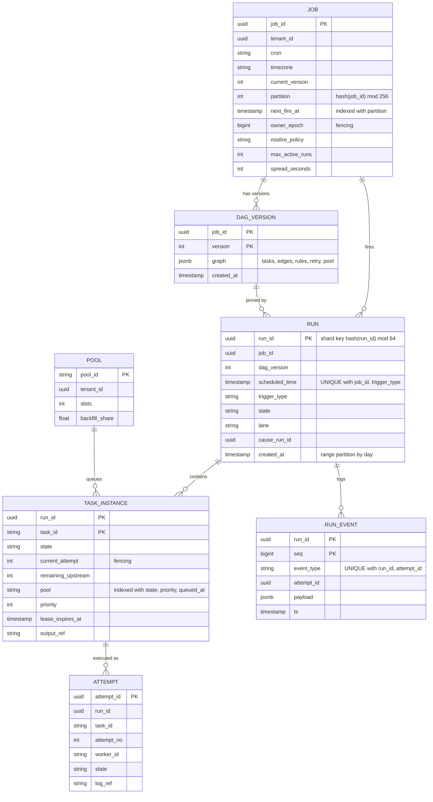

Access patterns this model serves:
- Trigger owner loads a partition: `WHERE partition = p AND next_fire_at < now() + 5 min`. Index `(partition, next_fire_at)`.
- Fire: `INSERT run ... ON CONFLICT DO NOTHING` plus `UPDATE job SET next_fire_at WHERE job_id = ? AND owner_epoch = ?`. One transaction on the job's home shard.
- Orchestrator on completion: read children of the task from `DAG_VERSION.graph` (cached per version), `UPDATE task_instance ... WHERE run_id = ? AND task_id = ? AND current_attempt = ?`, `INSERT run_event`. One transaction on the run's shard.
- Matching: `SELECT ... FROM task_instance WHERE state = 'QUEUED' AND pool = ? ORDER BY priority, queued_at LIMIT n FOR UPDATE SKIP LOCKED`. Only used to rebuild the in-memory queue, not per dispatch.
- UI: everything by `run_id`, or by `job_id` through the read model.

Partition keys: `hash(job_id) mod 256` for the trigger plane because a fire is per job. `hash(run_id) mod 64` for everything else because every hot write is per run, and all of a run's tasks and events must be on one shard so that completion plus ready-set computation is one local transaction. `run_id` embeds `hash(job_id)` so that a job and all its runs share a shard, which makes the fire transaction (run insert plus cursor update) single-shard too. Detail in [`deep-dives/metadata-store-and-sharding.md`](deep-dives/metadata-store-and-sharding.md). Consistency model: strong within a run and within a job; eventual across them.

---

## 4. High-level design

### 4.1 Trigger runs on time, on demand, or on an event

**Bad: one scheduler process scans the jobs table every second.**
- Approach: `SELECT * FROM job WHERE next_fire_at <= now()` every loop, create runs, advance cursors. Airflow 1.x, most first answers.
- Why it breaks: a 1 M row scan per second on a table whose hot column changes constantly; the process is a single point of failure, and a restart at 08:59 means every 09:00 job fires late. Precision is the loop period plus the scan time. At midnight it must create 900 k runs in one loop, serially.

**Good: N schedulers compete for due jobs with `SELECT ... FOR UPDATE SKIP LOCKED`.**
- Approach: Airflow 2 HA. Each scheduler grabs a batch of due rows with `SKIP LOCKED` (indexed on `next_fire_at`), creates the runs, advances the cursors, commits. Two schedulers never take the same row. No etcd, no leader.
- Cost: the database is the coordinator for every fire. At midnight 900 k rows are locked, read, and updated through one primary. Precision is still bounded by poll period. Astronomer's benchmark of the Airflow 2 scheduler scaled about linearly to 3 schedulers; the shared resource is the metadata DB, and that is exactly the thing that is already hot at midnight. Works to about 100 k jobs. This is the answer to give if the interviewer's scale is Hello Interview's 10 k jobs/s of one-shot jobs.

**Great: partitioned in-memory timing wheels with leased ownership, DB writes only on fire.**
- Approach: `partition = hash(job_id) mod 256`. etcd assigns partitions to live trigger nodes, each assignment carrying an `epoch`. The owner loads `(job_id, next_fire_at)` for its partitions into a hierarchical timing wheel (1 s ticks, 4 k entries per partition), and on each tick pops due jobs, batches them, and runs one transaction per shard: `INSERT run ON CONFLICT DO NOTHING`, `UPDATE job SET next_fire_at = next(cron, tz) WHERE job_id IN (...) AND owner_epoch = ?`. The DB never scans; it only sees the fires. Precision is the tick (1 s) plus insert latency. Failover reloads 4 k rows per partition, not 1 M.
- Challenges: ownership must be exclusive or two nodes fire the same job (§5.2: unique key plus epoch make the overlap harmless). The owner's memory is a cache of the DB, and a job edited through the API must reach the owner (the API writes the row and publishes an invalidation; the owner also refreshes each partition every 60 s). Misfire policy has to be explicit because a node can be down for minutes.

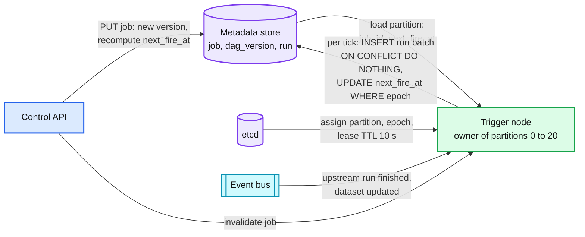

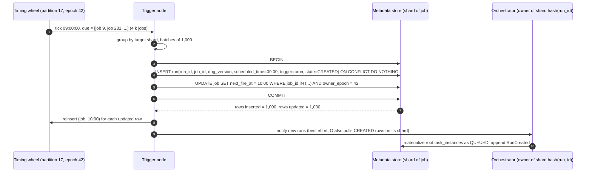

Manual and event triggers enter at step 4 with `trigger_type = manual` or `event` and their own `scheduled_time` (logical date). Same unique key, same path. D4e in [`diagrams.md`](diagrams.md#d4-sequence-happy-path-one-per-fr) shows the event case with the outbox. `max_active_runs` is checked by the orchestrator when it claims the run, not by the trigger plane: a run over the limit sits in CREATED until a slot frees, so the "fire" is never lost and the limit is exact.

### 4.2 Execute tasks in dependency order

**Bad: the scheduler loop re-evaluates every active run's DAG on every pass.**
- Approach: for every RUNNING run, for every task, check whether all upstreams are SUCCESS. Airflow's original loop.
- Why it breaks: 200 k active runs × 10 tasks = 2 M checks per loop, most of them no-ops. Loop time grows with active runs, so dispatch latency grows with load. This is why Airflow's `scheduler_idle_sleep_time` and `max_tis_per_query` exist.

**Good: event-driven. On completion, look up the children and check their parents.**
- Approach: when task A finishes, read A's children from the DAG, and for each child read the state of every parent. If all SUCCESS, queue it.
- Cost: a child with 1,000 parents costs 1,000 reads per parent completion, so 1 M reads for the join. Two completions of siblings racing on the same child can both see "all done" and both queue it, so you need a conditional update anyway. Works for narrow DAGs.

**Great: one owner per run, in-degree counters, trigger rules, coalesced events.**
- Approach: the run's owner (orchestrator node holding `shard = hash(run_id) mod 64`) keeps `remaining_upstream` per task, initialized from the pinned `DagVersion`. On `TaskSucceeded(A)`: for each child C, apply C's trigger rule (`all_success`: decrement, queue at zero; `one_failed`: queue on first failure; `all_done`: decrement on any terminal state). Append the event and update the rows in one transaction on the run's shard. Events for the same run within 100 ms are coalesced into one transaction, which turns a 5,000-way fan-in from 5,000 transactions into about 50. Task instances are materialized lazily: roots at creation, a child the first time a parent completes.
- Challenges: exactly one owner per run at a time (§5.2, same etcd lease and epoch as the trigger plane). Owner memory is a cache rebuilt from `task_instance` rows on failover. A wide fan-in is now a per-shard throughput problem, not a lock problem (§5.3).

Dispatch is pull-based. A worker long-polls the matching node for its pool. The matching node keeps an in-memory priority queue per pool fed by orchestrator notifications, and hands out attempts. The QUEUED to RUNNING transition is a conditional update on the run's shard, so if two matching nodes ever hold the same task, one loses the race at the DB. Pull gives backpressure for free: no worker asks for more than it can run.

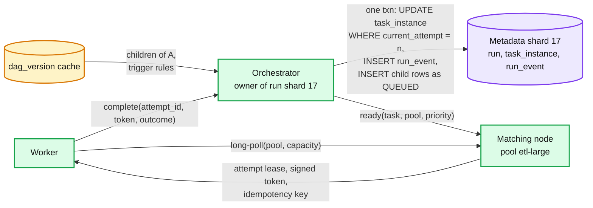

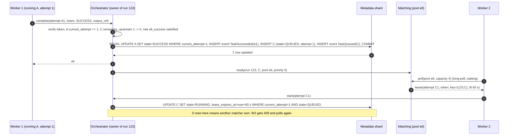

### 4.3 Retries, timeouts, cancellation and alerts

**Bad: the worker retries in a loop and reports the final result.**
- Why it breaks: no visibility into attempts, a worker crash loses the retry budget, a stuck task is invisible until its outer timeout, and a slow worker cannot be told to stop.

**Good: the scheduler owns retries with a fixed delay, and a zombie sweep marks tasks whose heartbeat is older than a threshold.**
- Approach: Airflow's model. Workers heartbeat every 5 s (`job_heartbeat_sec`); a sweep every 10 s marks any task without a heartbeat for 300 s (`task_instance_heartbeat_timeout`) as failed and reschedules it.
- Cost: 300 s is the recovery time for every dead worker, chosen large because a slow DB makes heartbeats late and a small threshold produces false zombies. Fixed-delay retries synchronize retry storms. A retry after a lost heartbeat and a retry after a real error are the same thing, so a non-idempotent task cannot opt out.

**Great: per-attempt leases, LOST as its own state, per-task retry policy with full jitter, per-task execution mode, alert dedup and SLA timers.**
- Approach: an attempt holds a 60 s lease renewed by 10 s heartbeats, kept in the owner's memory and written to the DB every 60 s. Missing 3 heartbeats plus a grace of 2 heartbeats moves the attempt to LOST at about 50 s. `at_least_once` (default): LOST behaves like a retryable failure. `at_most_once`: LOST becomes UNKNOWN and pages the owner. Retry delay `min(cap, base × 2^n)` with full jitter, capped attempts, error classes (`retryable`, `terminal`, `infra`, where `infra` does not consume the user's attempt budget). Cancellation is a flag on the attempt returned in the next heartbeat response. Alerts are per run per hour, not per task. An SLA timer per run (`must finish by 06:00`) is another entry in the trigger plane's wheel.
- Challenges: 50 s detection means a slow worker gets replaced 50 s into a GC pause, and both attempts may run (§5.1). The lease TTL is the knob; 60 s is a compromise between Airflow's 300 s and Temporal-style 10 s activity heartbeats. Long tasks must heartbeat from a thread that is not the one doing the work.

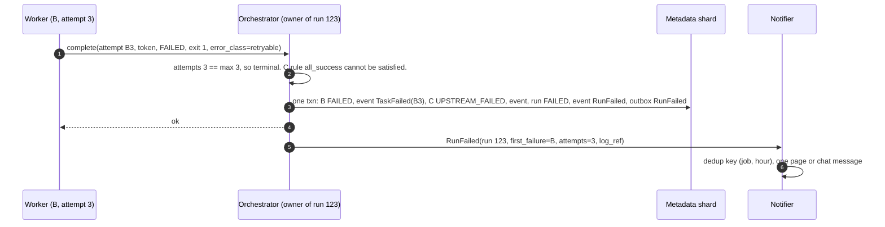

State machines for run and task instance are D8 in [`diagrams.md`](diagrams.md#d8-state-machines). The decision tree for this section is D6.

### 4.4 Backfill a date range and rerun a failed subtree

**Bad: the user scripts 90 manual triggers.**
- Why it breaks: 90 runs compete with today's run in the same pool, each picks up the current DAG version so old dates run new code, no ordering, no cap, no way to stop it.

**Good: a backfill API creates the runs at lower priority.**
- Cost: strict priority means backfill never runs while any normal task is waiting, so a busy pool starves the backfill forever, and an idle pool lets a 500-task backfill grab every slot and then hold them when today's run arrives.

**Great: backfill is a lane with a weighted share, bounded concurrency, explicit version and order; repair reuses the run.**
- Approach: `POST /backfill` creates the 90 runs with `lane = backfill`, `dag_version` pinned to the requested version (default: current), ordered as requested, and `max_active_backfill_runs` per job (default 3). The matcher runs weighted fair queueing between lanes in a pool: backfill gets at most `backfill_share` (20%) of slots while the normal lane has demand, and everything when it is idle. Repair: `POST /runs/{id}/repair` clears the failed tasks and every downstream of them back to NONE, recomputes `remaining_upstream` from the pinned version, bumps `current_attempt` so any straggling old attempt is fenced, and the run returns to RUNNING. Successful tasks keep their SUCCESS and their outputs.
- Challenges: backfill of a job with event-triggered downstreams will fire those downstreams for old dates too, so backfill runs carry `propagate = false` by default. Repair of a task whose outputs were consumed by a succeeded sibling is a correctness question for the user, not the platform; we expose it and do not guess.

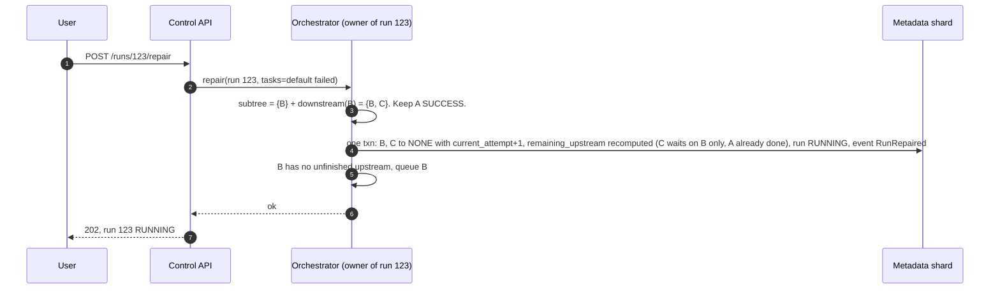

---

## 5. Deep dives

### 5.1 "How do we guarantee a task is never counted as done twice, and what happens when a worker dies after finishing?"

The request path: worker executes, worker calls `complete`, orchestrator writes, orchestrator acks. There are three gaps.

1. **Execute, then die before `complete`.** The side effect happened. Nobody knows. The lease expires at ~50 s, the attempt is LOST, attempt 2 runs. The effect happens twice.
2. **`complete` committed, ack lost.** Worker retries `complete`. The event log's unique key `(run_id, attempt_id, event_type)` rejects the duplicate and the orchestrator returns the original ack.
3. **Slow worker replaced, then reports.** Attempt 1's `complete` arrives after attempt 2 exists. `UPDATE ... WHERE current_attempt = 1` matches 0 rows. 409, worker stops.

**Bad: claim exactly-once.** Gap 1 cannot be closed by the scheduler. The two-generals problem is the reason; the honest sentence is "the platform guarantees the *record* is exactly-once and the *execution* is at-least-once".

**Good: at-least-once plus an idempotency key the task author uses.** The key is `(run_id, task_id)`, stable across attempts and across repairs. Writing an output partition `dt=2026-09-13` by overwrite, or `INSERT ... ON CONFLICT DO NOTHING` with the key, makes the second execution a no-op. Google's cron chapter reaches the opposite conclusion for their fleet ("favor skipping launches rather than risking double launches") because their jobs were not idempotent and a skipped launch is easier to recover than a duplicate one.

**Great: both modes, per task, and the fencing that makes the record exact.** `execution_mode = at_least_once | at_most_once`. In `at_most_once`, LOST does not retry; it goes UNKNOWN and pages. The worker's token is signed and includes `attempt_id`; every write is conditioned on `current_attempt`. Push back on the textbook answer: "just make tasks idempotent" is not a platform design. The platform's job is to hand the task a key it can be idempotent *with*, to make the second attempt visible in the UI (so the user knows a duplicate might have happened), and to offer the at-most-once choice for the tasks where a duplicate is worse than a page.

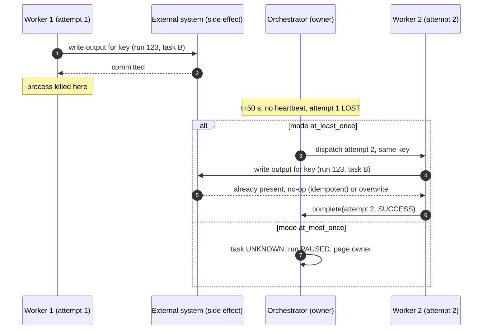

Full story per hop in [`deep-dives/exactly-once-and-idempotency.md`](deep-dives/exactly-once-and-idempotency.md).

### 5.2 "The scheduler node dies at 08:59:59. Do the 09:00 jobs fire?"

**Bad: a single leader with a heartbeat and a human restart.** Every job fires late by the time it takes a human to notice.

**Good: leader election, one leader for all jobs.** Google's cron does this with Paxos for a datacenter's worth of jobs. Failover in "seconds to a minute". One leader means one node loads 1 M jobs on failover, and every 09:00 job is late by the same amount. Works because their state is tiny; does not work if the leader is also the orchestrator.

**Great: 256 leased partitions with epochs, reload per partition.**
- Detection: etcd lease TTL 10 s, renewed every 3 s. A dead node's partitions are unowned at most 10 s after its last renewal.
- Reassignment: the assigner (itself elected) hands the 21 partitions to the survivors with `epoch + 1`. About 1 s.
- Reload: `SELECT job_id, next_fire_at FROM job WHERE partition = p AND next_fire_at < now() + 5 min`. 4 k rows, under 1 s. Anything with `next_fire_at <= now()` fires immediately.
- Total: 12 to 15 s late for 1/12 of the fleet. Inside the 30 s NFR. Nothing lost, because `next_fire_at` only moves in the transaction that created the run.
- Overlap: the old owner may still be alive (GC pause). Its `INSERT ... ON CONFLICT DO NOTHING` is a no-op if the new owner already fired, and its `UPDATE ... WHERE owner_epoch = 41` matches nothing. Two mechanisms on purpose: the unique key protects the data, the epoch tells the stale owner to stop. Neither uses a clock.

The push-back: a smaller TTL is not free. Below about 5 s, a GC pause or an etcd slow disk causes a false failover, which costs a reload and briefly two owners. 10 s with 3 s renewal is where Kubernetes lands too (15 s / 10 s / 2 s).

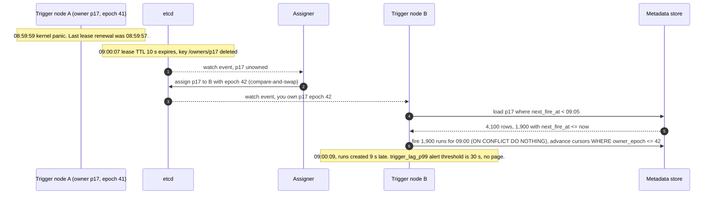

More in [`deep-dives/leases-failover-and-fencing.md`](deep-dives/leases-failover-and-fencing.md) and [`deep-dives/trigger-plane-and-timers.md`](deep-dives/trigger-plane-and-timers.md).

### 5.3 "900 k jobs fire at midnight. What breaks first?"

Walk the path: wheel pops → run inserts → task_instance inserts → matching → workers.

- Wheel pops: 900 k in 0.9 s single-threaded, 75 ms across 12 nodes. Not the bottleneck.
- **Run and root task inserts plus their events: 5.4 M rows in one second. This is the red node.** 84 k rows/s per shard for one second, batched. At the edge of one Postgres primary, survivable. Eager materialization would make it 12.6 M rows, 200 k rows/s per shard, and that is not doable on Postgres.
- Matching: 1.8 M ready tasks into per-pool heaps. Memory, fine. Handing them out is bounded by free slots.
- Workers: whatever the pools have. The queue absorbs the rest.

**Bad: accept the spike.** One database, eager rows. Falls over at about 100 k aligned jobs, and while it is down, `next_fire_at` cursors do not move, so recovery is a second spike.

**Good: shard and batch.** 64 shards by `run_id`, 1,000-row batches, lazy materialization. The spike is 84 statements per shard in one second. Survivable, but it is 200x steady state and it sizes the fleet for one second a day.

**Great: remove the alignment.** Google's cron added `?` to crontab so that "sometime in hour 0" replaces "00:00". We do the same with `spread_seconds` (default 60 s for new jobs, 0 allowed with a warning). A job with `spread = 60` gets `fire_at = scheduled_time + hash(job_id) mod 60`, deterministic so it is the same offset every day and the user can predict it. With 60 s spread the spike is 90 k rows/s fleet-wide, 1.4 k/s per shard, indistinguishable from steady state. Legacy aligned jobs keep spread 0 and are the residual spike; the migration plan (D12) chases them. Push back on "rate limit the trigger plane" as the fix: delaying fires past the precision SLO to protect the database is the same as being down, just quieter. Jitter that the user opted into is not lateness; a throttle is.

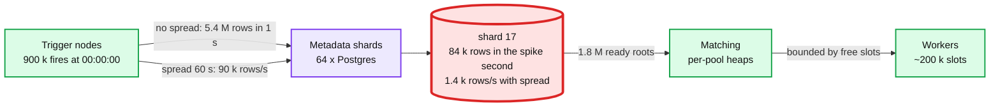

Math per shard in [`deep-dives/metadata-store-and-sharding.md`](deep-dives/metadata-store-and-sharding.md).

### 5.4 "Precision within 1 s for 1 M jobs. Do you scan the table every second?"

**Bad: yes.** `WHERE next_fire_at <= now()` every second over 1 M rows. Index makes the read cheap but the row updates on every fire churn the index, and precision is poll period plus query time.

**Good: time buckets.** Hello Interview's shape: an `executions` table keyed by minute bucket, a watcher that reads the next minute's bucket once and pushes to a delay queue. Precision is the queue's delay granularity (SQS `DelaySeconds` is whole seconds, max 900 s). Good for one-shot jobs. Cron jobs need the next execution computed and inserted after each fire, which is the same cursor write we have.

**Great: the wheel.** A hierarchical timing wheel with 1 s ticks and 256 slots per level (Kafka's purgatory shape, Varghese and Lauck 1987). Insert and pop are O(1); 4 k entries per partition; memory 32 MB for the whole fleet. Dispatch latency comes from long-polling: a worker's poll is parked at the matcher and answered the moment a task is ready, so there is no poll interval between "ready" and "handed out". The 2 s dispatch NFR is one transaction on the run's shard (~5 ms), one notify to the matcher (~1 ms), and one long-poll reply. The wheel also carries SLA deadlines and retry backoffs, so there is one timer mechanism in the system. Push back on "sub-second precision": below 1 s the network and the DB commit dominate, and no job in this population needs it. Offer it as a paid tier, not a default.

Internals in [`deep-dives/trigger-plane-and-timers.md`](deep-dives/trigger-plane-and-timers.md).

### 5.5 "Backfill 90 days without starving today's SLA run. Where does fairness live?"

Fairness lives in the matcher, per pool, between lanes and between tenants, because that is the only place that sees both the demand and the free slots.

**Bad: priority integer.** Strict priority starves whichever side is lower.

**Good: reserved slots.** 80 slots normal, 20 backfill. Wastes the 20 when there is no backfill and the 80 when there is nothing but backfill.

**Great: weighted fair share with a cap.** Deficit round robin between lanes with weights 80:20; the backfill lane is additionally capped at `backfill_share` while the normal lane has demand, and uncapped when it does not. Within a lane, tenants are weighted by their pool quota. `max_active_backfill_runs` per job bounds in-flight tasks so one job cannot fill the lane. This is the same weighted max-min idea as [`../network-throttling/deep-dives/hierarchical-fair-allocation.md`](../network-throttling/deep-dives/hierarchical-fair-allocation.md), applied to slots instead of requests. Detail in [`deep-dives/backfill-rerun-and-stragglers.md`](deep-dives/backfill-rerun-and-stragglers.md).

### 5.6 "Once acked, never lost. Strong within a run. How, and where does it stop being strong?"

- Within a run: every write is one transaction on one shard by one owner. `run_event` is the truth (append-only, `(run_id, seq)`), `task_instance` is the index. Replaying the log against the pinned version reproduces the rows. This is Temporal's history model, with Temporal's limit in mind: their hard cap is 51,200 events or 50 MB per workflow, which is why our DAG size cap is 10 k tasks and a 5,000-way map is coalesced into batched events.
- Within a job: `next_fire_at` and the run's unique key live on the job's home shard. Strong.
- Across runs and jobs: the UI's list of "all runs for tenant X today" is a read model fed by CDC. Eventual, seconds. Event triggers cross from one run to another job through the outbox, so a downstream run fires after the upstream's terminal event is durable, never before.
- Durability: Postgres `synchronous_commit = on` to a replica in another AZ. RPO zero within the region. Cross-region async, RPO ~1 s, manual promotion (§10.11).

Push back on "use Kafka as the source of truth for task state": a log gives ordering per partition but no per-message ack, no visibility timeout, no conditional update, and a slow task at the head blocks the partition. It is the right tool for the outbox and for CDC, and the wrong tool for the ready queue.

---

## 6. Final design

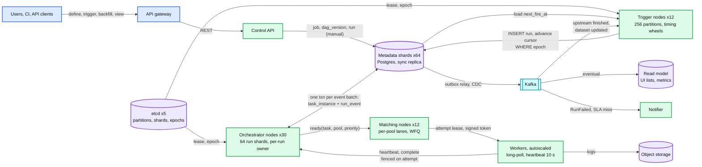

Zoom-ins: D1 context, D2 data flow, D9 deployment, D11 failure map in [`diagrams.md`](diagrams.md). Read the diagram left to right as the three planes: trigger (T), orchestration (O and DB), execution (M and W). Kafka never sits between a fire and a run, or between a completion and the next dispatch.

---

## 7. Trade-offs

| Decision | Option A | Option B | Chose | Why |
|---|---|---|---|---|
| Trigger coordination | DB `SKIP LOCKED` between N schedulers | etcd-leased partitions, in-memory wheel | B | The DB is already the midnight bottleneck; do not make it the coordinator too. B reloads 4 k rows on failover, not 1 M |
| Execution semantics | At-most-once (Google cron) | At-least-once with idempotency key | B, with A per task | Data pipelines are idempotent by construction; a skipped run is a missed SLA. Non-idempotent tasks opt into A |
| Task state truth | Mutable rows only | Event log plus rows in one txn | B | Replay, audit, duplicate rejection by unique key. Cost: 2.5x write volume |
| Ready queue | Kafka topic per pool | In-memory matcher over DB rows | B | Kafka has no per-message ack, priority, or fairness; head-of-line blocking on a slow task. Kafka stays for outbox and CDC |
| Dispatch | Push to workers | Workers long-poll | B | Backpressure is free, no capacity model for workers on the scheduler side |
| Task materialization | Eager, all rows at run creation | Lazy, roots then children on demand | B | 12.6 M vs 5.4 M rows in the midnight second |
| Midnight spike | Throttle fires | Deterministic per-job jitter (`spread_seconds`) | B | A throttle is lateness the user did not choose; jitter is a schedule they agreed to |
| Metadata store | Distributed SQL (Spanner, CockroachDB) | 64 sharded Postgres | B for the write-up | Every hot transaction is single-shard, so we do not need cross-shard transactions. A is the right call if the team is small and the bill is fine; say both |
| Zombie detection | 300 s threshold (Airflow default) | 60 s lease, 10 s heartbeat | B | 50 s recovery vs 300 s. Cost: more false zombies on GC pauses, made safe by fencing and idempotency |
| Refused to build | Exactly-once execution, a workflow DSL with loops and conditionals, a cross-region active-active scheduler, our own log storage | | | Each one is a product. Say what you refused |

---

## 8. Staff-level notes

- **Failure modes and blast radius.** Trigger node: 1/12 of jobs late by ~15 s. Orchestrator node: 1/32 of runs pause dispatch for ~15 s, running tasks unaffected. Matching node: one pool's dispatch pauses for seconds. Metadata shard: 1/64 of runs stall until the replica is promoted (~30 s), no acked write lost. etcd quorum: no new ownership; owners hold on local timers, then stop (fail closed on triggers, on purpose). Full tree is D11.
- **Migration.** From cron boxes plus a single-scheduler Airflow: shadow the trigger plane (create runs as `shadow`, compare fire times for two weeks), flip triggers per job with legacy disabled per job, then move execution per tenant. Rollback per phase is a flag; the `run` unique key makes a double-enable harmless. D12.
- **Operability.** SLOs: `trigger_lag_p99 < 1 s` normal, `< 30 s` during failover; `dispatch_latency_p99 < 2 s` given slots; `lost_attempt_rate < 0.1%`. Pages: `trigger_lag_p99 > 30 s` for 2 min, `partition_without_owner > 0` for 60 s, `lost_attempt_rate > 1%`, `queued_age_p99 > 5 min` in a pool with free slots, `outbox_lag > 5 min`. Individual task failures alert the job owner, never the platform on-call.
- **Cost.** 64 Postgres shards with replicas (~128 mid-size instances) is the bill; the stateless tiers are ~60 nodes. Workers are the tenant's cost. Engineering: trigger plane 1 quarter for 2 people, orchestrator 2 quarters for 3, matcher and worker SDK 1 quarter for 2, control plane and UI ongoing. The alternative of paying for a managed distributed SQL removes about a third of the ops load for maybe 2x the storage bill.
- **Team boundaries.** Trigger plus orchestration is one team (it owns correctness). Matching and the worker SDK is the interface to compute teams. Control API and UI is a product team. The DAG definition schema is the contract between them and is versioned like an API.
- **Trade-offs made explicit.** At-least-once by default. Fail-closed triggers on etcd loss. Jitter over throttling. Sharded Postgres over distributed SQL. Each one is a sentence in the interview, not a discovery by the interviewer.

---

## 9. What is expected at each level

**Mid (80/20 breadth/depth).** Jobs table, scheduler service, queue, workers. Cron parsed into next run time. Workers pull from the queue and write status back. Retries with a counter. Can explain that a DAG is executed by topological order. Probably a single scheduler; when asked what happens if it dies, says "run two".

**Senior (60/40).** Splits scheduling from execution. Names at-least-once and idempotency without prompting. Leader election or `SKIP LOCKED` for scheduler HA and can explain the difference. Heartbeats and a zombie threshold. Recognizes the midnight spike and proposes jitter or sharding. Pins the DAG version per run. Talks about the DB as the bottleneck and proposes partitioning. May still push tasks to workers and may still use Kafka as the task queue.

**Staff+ (40/60).** Says the one-line answer with the three planes and why the unit of ownership is a partition of jobs and a single run. Puts numbers on the midnight second (5.4 M rows, 84 k per shard) and shows lazy materialization and jitter are what make SQL viable. Explains fencing with epochs plus the unique key and why neither uses a clock. Distinguishes the three duplicate gaps and says which one the platform cannot close, then offers at-most-once as a product choice. Names what is refused (exactly-once, workflow DSL, active-active). Gives the migration in phases with rollback. Names the five pages and the three SLOs. Says "Google chose skip over double, we chose the reverse, here is why the population differs". Discusses Postgres vs distributed SQL as a team-size decision, not a technical one.

---

## 10. Nitty-gritty (past interview scope)

### 10.1 Internals of each chosen technology

**Postgres as a sharded metadata store.** MVCC means an `UPDATE` writes a new row version and leaves a dead tuple; a table with 10 state updates per task instance generates 2 B dead tuples/day fleet-wide, so autovacuum settings are load-bearing (§10.2). `FOR UPDATE SKIP LOCKED` returns rows not currently row-locked by another transaction, which is how N readers drain one queue table without blocking; we use it only for matcher rebuild. Range partitioning by `created_at` day makes retention a `DETACH PARTITION`, not a `DELETE`. Synchronous replication (`synchronous_commit = on`, one sync standby) means a commit returns after the standby has the WAL, RPO zero within region at the cost of ~1 ms per commit.

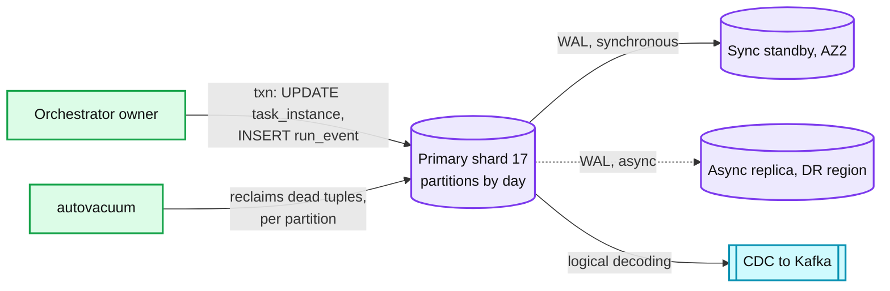

**etcd for ownership.** A Raft-replicated KV with leases: a client creates a lease with a TTL, attaches keys to it, and keeps it alive; if keepalives stop, the lease expires and the keys are deleted. Watchers see the deletion. Raft defaults: 100 ms heartbeat, 1,000 ms election timeout, so etcd's own leader failover is ~1 to 2 s. Our assignment key `/owners/p17 = {node: B, epoch: 42}` is written with a compare-and-swap on the previous value, and the epoch is a monotonically increasing integer stored in etcd, which is what makes it a fencing token.

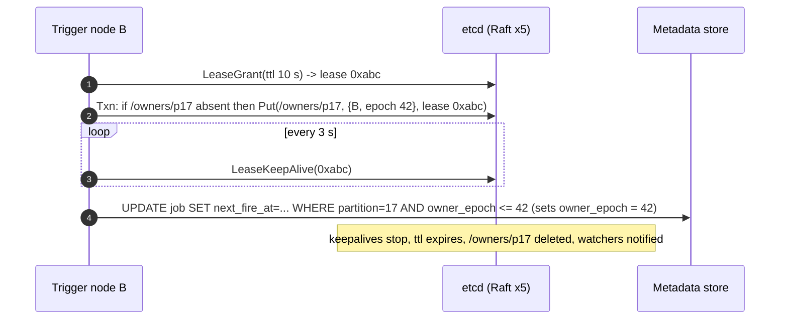

**Hierarchical timing wheel.** Level 0: 256 slots of 1 s. Level 1: 256 slots of 256 s. Level 2: 256 slots of ~18 h. A timer for `t` goes into the coarsest level whose slot width exceeds `t - now`; when a coarse slot expires, its timers cascade into the finer level. Insert and expire are O(1) amortized. Kafka's purgatory uses the same structure to hold millions of delayed operations. Our wheel per partition holds ~4 k jobs plus retry backoffs and SLA deadlines; the fleet holds ~1.5 M timers.

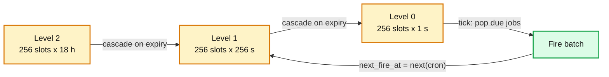

**Kafka (outbox and CDC only).** Partition by `job_id` for event triggers so one job's upstream events are ordered. `acks=all`, `min.insync.replicas=2`. Consumers (trigger nodes) commit offsets after the `INSERT run ON CONFLICT` transaction, so a crash between insert and commit replays the event and the unique key absorbs it. Internals in [`../../popular_systems_deepdive/kafka/`](../../popular_systems_deepdive/kafka/).

### 10.2 Configuration knobs that matter

| Component | Knob | Value | Why |
|---|---|---|---|
| etcd | lease TTL / keepalive | 10 s / 3 s | Failover ~12 s; survives one missed keepalive and a 6 s GC pause |
| etcd | election timeout / heartbeat | 1,000 ms / 100 ms | Defaults. etcd's own failover ~2 s |
| Trigger | wheel tick | 1 s | Matches the 1 s precision NFR. 100 ms possible, no job needs it |
| Trigger | default `spread_seconds` | 60 | Turns the midnight second into a minute |
| Trigger | reload horizon | 5 min | Rows loaded per partition on failover; anything later is loaded on the periodic refresh |
| Trigger | misfire policy default | `fire_once` | One catch-up run, like Quartz's fire-now instruction. `catch_up` for backfill-style jobs, `skip` for "latest only" |
| Orchestrator | event coalesce window | 100 ms | 5,000-way fan-in becomes ~50 transactions |
| Orchestrator | attempt lease / heartbeat / grace | 60 s / 10 s / 2 beats | LOST at ~50 s. Airflow: 300 s. Temporal: per-activity |
| Orchestrator | DB lease refresh | 60 s | Keeps DB writes at 1 per attempt per minute |
| Orchestrator | `max_tasks_per_dag`, `max_map_width` | 10 k / 10 k | Below Temporal's 51,200 event cap with 5 events per task |
| Matcher | long-poll timeout | 30 s | Below most LB idle timeouts, cheap to reissue |
| Matcher | `backfill_share` | 0.2 | 20% while normal lane has demand |
| Postgres | `synchronous_commit` | `on`, one sync standby | RPO zero in region |
| Postgres | `autovacuum_vacuum_scale_factor` on hot tables | 0.01 | Vacuum at 1% dead tuples, not the 20% default |
| Postgres | partition size | 1 day | 30 hot partitions per table, drop for retention |
| Kafka | `acks`, `min.insync.replicas` | `all`, 2 | Do not lose an upstream-finished event |
| Retry | base / cap / max attempts | 30 s / 30 min / 3 | Full jitter. Infra errors do not count against the 3 |

### 10.3 Capacity math per component

```
Trigger node (12):     21 partitions x 4 k jobs = 88 k timers, ~3 MB. Midnight: 75 k pops in 75 ms. Steady: 200 pops/s. Idle CPU.
Orchestrator node (30): 2 shards x 6.5 k active runs = 13 k runs, ~100 B state each = 1.3 MB plus lease table 7 k attempts.
                        Steady: 80 completions/s -> 80 txns/s. Midnight: 60 k root queues in 1 s, coalesced into ~600 txns. 
                        Heartbeats: 720/s in memory.
Matcher node (12):      ~150 k queued tasks across its pools at midnight, 200 B each = 30 MB. Steady: 200 hand-outs/s. Long-polls parked: ~2 k connections.
Metadata shard (64):    Steady: 375 row writes/s, 180 txns/s. Midnight second: 84 k rows, 84 batched statements.
                        Storage: 140 GB hot. Dead tuples: 30 M/day per shard -> vacuum must run continuously on the day partition.
                        <- Closest to its limit. The one-second burst is near a single Postgres primary's batched insert capacity.
etcd (5):               ~330 keys (256 partitions + 64 shards + assigner), 42 keepalives/s. Nothing. Do not put anything else on it.
Kafka:                  ~25 k events/s (CDC 24 k + outbox 250). One small cluster.
Workers:                ~216 k concurrent attempts. 21.6 k heartbeats/s. Sized by tenants, not by us.
```

### 10.4 Failure timeline

Trigger owner death is D5b in §5.2. Orchestrator owner death:

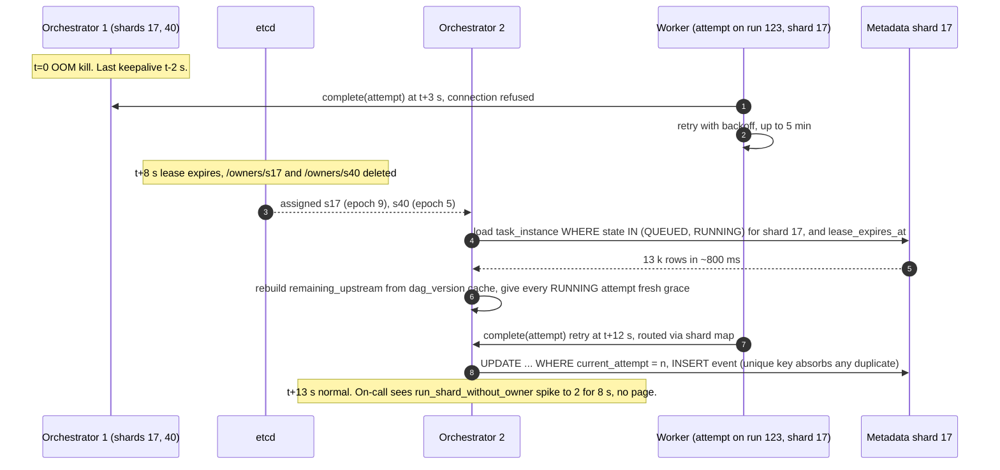

Metadata shard primary loss:

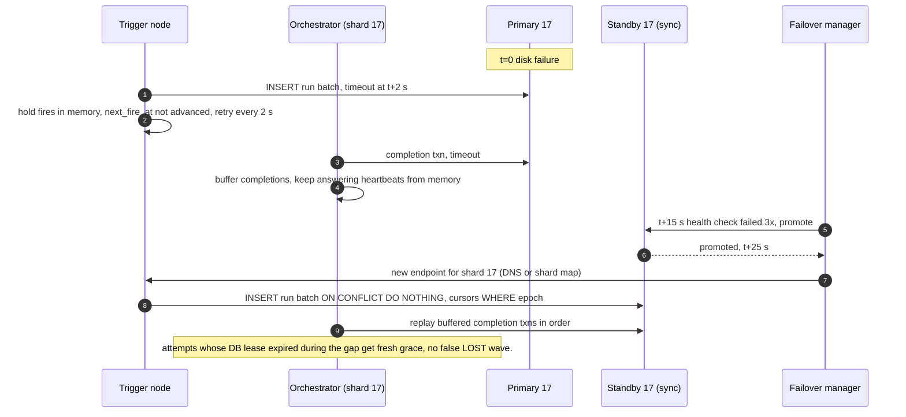

### 10.5 Exactly-once and idempotency end to end

| Hop | Duplicate can enter because | Removed by | Key | Lifetime |
|---|---|---|---|---|
| Cron fire | Two owners during handover, or an owner retrying after a timeout | `UNIQUE(job_id, scheduled_time, trigger_type)` on `run` | `(job_id, scheduled_time)` | Forever (row exists) |
| Manual trigger | Client retry | `Idempotency-Key` header stored on `run` | client key | 24 h |
| Event trigger | Kafka redelivery after consumer crash | Same unique key, `scheduled_time = logical_date` from the event | `(job_id, logical_date)` | Forever |
| Dispatch | Two matchers hand out the same task | `UPDATE ... WHERE state = QUEUED AND current_attempt = n` | `(run_id, task_id, attempt)` | Until terminal |
| Execution | Lease lost, worker alive | Cannot be removed by the platform. Task uses `(run_id, task_id)` | `(run_id, task_id)` | Task author's store |
| Completion | Worker retry after lost ack | `UNIQUE(run_id, attempt_id, event_type)` on `run_event` | `attempt_id` | Retention (30 d hot) |
| Stale completion | Attempt 1 reports after attempt 2 exists | `WHERE current_attempt = 1` matches 0 rows, 409 | `current_attempt` | Until terminal |
| Downstream ready | Two parent completions race | Single owner per run serializes; counter decrement is in the same txn | run owner | n/a |
| Notification | Outbox relay retries | Notifier dedups on `(run_id, event_type)` | event id | 24 h |

Detail in [`deep-dives/exactly-once-and-idempotency.md`](deep-dives/exactly-once-and-idempotency.md).

### 10.6 Consistency model per edge

| Edge in D3 | Model | Note |
|---|---|---|
| Control API → metadata (job, dag_version) | Strong | Single-shard write, read-your-writes through the primary |
| Metadata → trigger node (load) | Eventual, ≤ 60 s | Owner memory is a cache; API sends invalidation, owner refreshes each minute |
| Trigger node → metadata (fire) | Strong | One txn: run insert plus cursor advance, fenced by epoch |
| Orchestrator ↔ metadata | Strong within a run | One owner, one shard, one txn per event batch |
| Orchestrator → matcher | Eventual, ms | Notification; the QUEUED to RUNNING update is what is authoritative |
| Matcher → worker | Lease | Time-bounded exclusive right to run attempt n |
| Worker → orchestrator (heartbeat, complete) | Fenced | Accepted only for `current_attempt` |
| Metadata → Kafka → read model | Eventual, seconds | UI lists lag; per-run view reads the primary |
| Metadata → Kafka → trigger (event triggers) | Eventual, at-least-once | Downstream run fires after upstream terminal event is durable; duplicates absorbed by unique key |
| Primary → sync standby | Strong (RPO 0) | Same region |
| Primary → DR replica | Eventual, ~1 s | Cross region |

### 10.7 Alternatives rejected

| Alternative | Why it looked attractive | Why rejected |
|---|---|---|
| Airflow-style `SKIP LOCKED` schedulers for triggers | No etcd, no partitions, simple | DB is the coordinator and the midnight bottleneck at once; failover reload is the whole table; precision bounded by poll interval |
| Google-cron-style single Paxos leader for all jobs | Proven, tiny state | One node reloads 1 M jobs on failover; combined with orchestration it is a hot spot. Right for 10 k jobs, not 1 M |
| Temporal as the engine | Event sourcing, matching, heartbeats already built | Cron is a workflow per job, so 1 M long-lived workflows with timers; history caps force continue-as-new; DAG semantics (trigger rules, repair) must be built on top anyway. Good choice for a company that already runs Temporal |
| Kafka as the ready queue | Durable, scalable, everyone knows it | No per-message ack or visibility timeout, no priority, no fairness, head-of-line blocking per partition |
| Redis sorted set as the timer store | `ZRANGEBYSCORE` is a one-liner | Single-threaded per shard, loses timers on failover without AOF fsync, and we already have the wheel plus the DB as truth |
| Kubernetes CronJob per job | Zero code | 1 M CronJob objects in etcd; controller reconcile loop is not built for it; no DAG |
| Eager task materialization | Simpler UI, all rows exist | 12.6 M rows in the midnight second |
| Push dispatch | Lower latency by one poll | Needs a capacity model per worker; pull gives backpressure and worker-side admission for free |
| Distributed SQL (Spanner, CockroachDB) | No shard management, cross-shard txns | Every hot txn is single-shard already; 2x storage bill. Reasonable if the team is small; say so |
| DynamoDB-style KV for task state | Scales writes | Conditional updates yes, but the multi-row single-run transaction and the queue rebuild query are awkward; we would rebuild an index layer |

### 10.8 How the big companies do it

- **Google cron (SRE book).** Paxos-replicated launch start and end events, tiny state, one leader per datacenter, `?` jitter in crontab, and an explicit preference for skipping a launch over a double launch. Our trigger plane is this idea partitioned 256 ways with the opposite default on duplicates.
- **Airflow 2 and 3.** Multi-scheduler HA on `SELECT ... FOR UPDATE SKIP LOCKED` (`use_row_level_locking = True`), 5 s heartbeats, 300 s `task_instance_heartbeat_timeout` checked every 10 s, `parallelism` 32 and `max_active_runs_per_dag` 16 as defaults, DAG versioning and a Task Execution API in 3.x that puts a real API between scheduler and workers. Our Good rungs are Airflow; our Great rungs are what Airflow's scale limits point at.
- **Temporal / Cadence.** History service with event-sourced per-workflow history, matching service with task queues and sticky execution, activity heartbeats, hard caps of 51,200 events or 50 MB per execution, 10 s workflow task timeout. Our per-run owner plus `run_event` is Temporal's mutable-state plus history, with a DAG on top.
- **Netflix Maestro (open sourced 2024).** Hundreds of thousands of workflows, millions of jobs a day, foreach and subworkflow, signal triggers, step-level state machine, and the engineering blog's emphasis on strict SLOs under traffic spikes. Repair-style rerun and signal triggers are where our §4.4 and event triggers come from.
- **Databricks Jobs.** Per-workspace limits of 2,000 concurrent task runs and 750 concurrent parent tasks, 12,000 saved jobs, 10,000 job creations per hour; repair run; queueing when concurrency is exceeded. The interviewer is thinking of this product.

### 10.9 Operational runbook

Dashboards (5): `trigger_lag_p99` (scheduled_time to run created), `dispatch_latency_p99` (queued to running, per pool), `queued_age_p99` per pool with free-slot count beside it, `lost_attempt_rate` and `stale_completion_rate`, `partition_without_owner` and `run_shard_without_owner`.

Alerts: `trigger_lag_p99 > 30 s` for 2 min pages the scheduler on-call. `partition_without_owner > 0` for 60 s pages. `lost_attempt_rate > 1%` for 5 min pages (usually a network or DB issue, not workers). `queued_age_p99 > 5 min` with free slots pages; without free slots it is a ticket to the tenant. `outbox_lag > 5 min` pages. `dead_tuple_ratio > 5%` on any hot partition is a ticket.

Rollout: canary one orchestrator node (2 shards) for 1 h, watch `stale_completion_rate` and `events_per_txn`. Then 10% of nodes, then all, each step a controlled ownership handoff (~10 s per shard). Trigger nodes same, watching `trigger_lag`. Event schema changes are additive only, so mixed versions can own different shards.

Rollback: same handoff in reverse. No data backfill needed unless a new event type was written; then the old version must ignore unknown types (it does, by rule).

### 10.10 Security and abuse

- Auth boundary: the control API authenticates users (OIDC) and authorizes per tenant and per job (owner, editor, viewer). Workers authenticate with per-pool credentials scoped to a tenant.
- Attempt tokens: signed (HMAC with a rotating key) containing `run_id, task_id, attempt_id, expires_at`. A worker cannot heartbeat or complete an attempt it was not leased. Token lifetime equals the lease; heartbeats return a refreshed token.
- Secrets: task parameters reference a secret store; the worker resolves them under the tenant identity at start; nothing secret is stored in `run` or `run_event` or logs (log scrubber for known patterns).
- Quotas: jobs per tenant, minimum schedule interval 60 s, `max_active_runs` per tenant, tasks per DAG, backfill runs per job. Enforced at `PUT /jobs` and by the orchestrator when claiming runs.
- What a malicious tenant can do: fill its own pools, page its own owners. What it cannot do: see another tenant's runs (row-level tenant filter in every query), starve another tenant's pool (pools are per tenant), or fence another tenant's attempts (tokens).

### 10.11 Evolution

- **10x jobs (10 M).** Trigger partitions stay at 256 (40 k jobs each, 320 MB fleet-wide); add trigger nodes. Run shards 64 to 256 by split: new runs hash into 256, old shards drain in days because runs are short-lived. `run_event` at 2 TB/day leaves Postgres: keep 7 days hot, ship day partitions to object storage nightly.
- **Multi-region.** Phase 1 (this design): one region owns a job; async replica in a second region, RPO ~1 s, promotion is a runbook (~10 min) and accepts that in-flight attempts in the failed region are LOST and retried. Phase 2: jobs pinned to a home region with a per-region trigger and orchestration plane, cross-region event triggers over Kafka MirrorMaker, and a global read model. Active-active for the same job is refused; the unique key would need a global consensus store and the gain is small.
- **GDPR delete.** Tenant key deletion first, then row deletion on hot shards, then cold Parquet rewrite monthly.
- **New requirement: conditional branches and loops in the DAG.** The seam is `DagVersion.graph` plus the trigger-rule evaluator. Branches are a `SKIPPED` state and a `none_failed` rule (already there). Loops are refused; a loop is a sub-job triggered by an event.
- **New requirement: sub-second precision tier.** Wheel tick to 100 ms for a `strict` tier, dedicated partitions, and a price. The DB commit (~5 ms) stays inside it.
- **New dimension: resource-aware scheduling (GPU, memory).** Pools become multi-resource and the matcher's fair share becomes dominant-resource fairness. The seam is the matcher; nothing else changes.

---

## 11. Follow-up questions to expect

Ranked by how likely an interviewer asks them.

1. Scheduler dies at 08:59:59, do the 09:00 jobs fire, can two nodes fire them? §5.2, [`edge-cases.md`](edge-cases.md#edge-case-trigger-node-dies-at-085959).
2. Same job running twice: how do you prevent it, and what if you cannot? §5.1, §10.5.
3. Worker slow vs dead; replaced worker reports late. §4.3, D5c, [`edge-cases.md`](edge-cases.md#edge-case-a-worker-is-slow-not-dead-and-reports-after-its-replacement-finished).
4. Worker finishes, dies before acking. §5.1, D5a.
5. 900 k jobs at midnight, what breaks first. §5.3, [`deep-dives/metadata-store-and-sharding.md`](deep-dives/metadata-store-and-sharding.md).
6. Why not Kafka as the task queue. §5.6, §10.7.
7. DAG edited mid-run. [`edge-cases.md`](edge-cases.md#edge-case-user-edits-the-dag-while-a-run-is-halfway-through), [`deep-dives/orchestrator-and-dag-evaluation.md`](deep-dives/orchestrator-and-dag-evaluation.md).
8. A succeeds, B fails, C depends on both; rerun only B and C. §4.3, §4.4.
9. Backfill 90 days without starving today. §5.5.
10. Precision within 1 s without scanning the table. §5.4.
11. 5,000-way fan-out into one join. [`edge-cases.md`](edge-cases.md#edge-case-one-task-fans-out-into-5000-dynamic-sub-tasks-that-feed-one-join).
12. Cron at 02:30 on the DST change day. [`edge-cases.md`](edge-cases.md#edge-case-cron-at-0230-americanew_york-on-the-dst-change-day).
13. Clock skew of 200 ms between nodes. [`edge-cases.md`](edge-cases.md#edge-case-clocks-on-scheduler-nodes-differ-by-200-ms).
14. Why Postgres shards and not Spanner or DynamoDB. §7, §10.7.
15. etcd is down for two minutes. [`edge-cases.md`](edge-cases.md#edge-case-etcd-loses-quorum-for-two-minutes).
16. How would Google's cron answer differ, and why do you disagree with their default. §5.1, §10.8.
17. Migration from a single Airflow. §8, D12.
18. What pages at 3am. §10.9.
