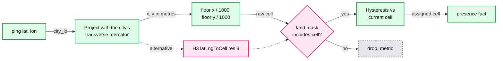
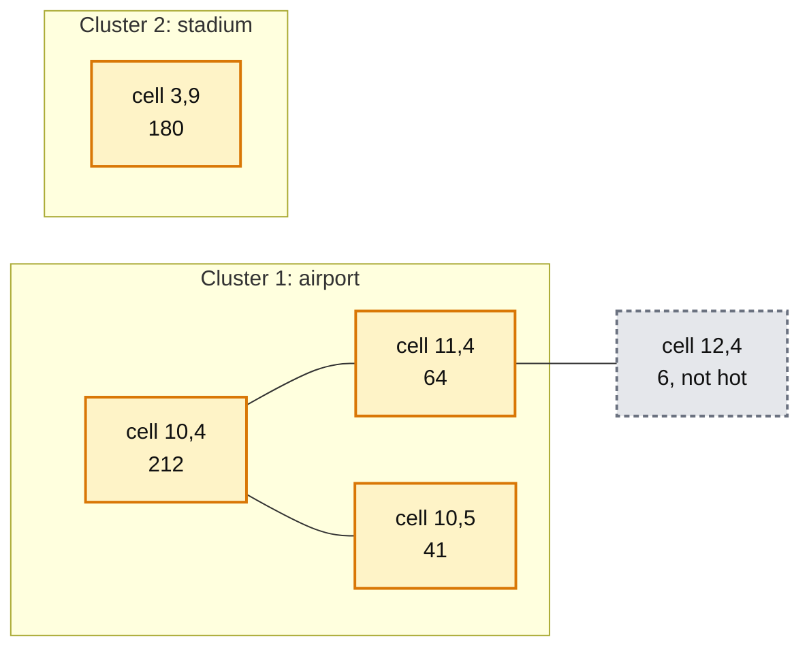

# Deep dive: grid cells, boundary jitter, and hot clusters

> One-line answer: project each ping into a city-local metric coordinate system (a transverse Mercator centred on the city) and floor by 1,000 m to get an exact 1 km² square; keep drivers in their current cell until a ping is 50 m inside a new one so GPS jitter cannot double count; find hot clusters on read with a breadth-first search over the 8 neighbours of every cell above a per-city threshold. H3 resolution 8 (0.737 km²) is the drop-in alternative if "about 1 km²" is acceptable.

Related: [`../../../concepts/geospatial-index.md`](../../../concepts/geospatial-index.md).

---

## 1. Why not just floor latitude and longitude?

- A degree of longitude is 111 km at the equator and 111 km × cos(latitude) elsewhere: ~72 km at London (51.5°), ~87 km at New York (40.7°). A fixed-degree grid gives cells of different area in different cities and even across one large city.
- Web Mercator (map tiles) inflates distances by 1 / cos(latitude): 1.6x at London. A "1 km" tile there is ~0.4 km² on the ground.
- A transverse Mercator projection centred on each city keeps scale error under ~0.1% within ~100 km of the centre. Floor by 1,000 m and the cells are 1 km² to within rounding.

## 2. Square grid vs H3

| | Square, city-local projection | H3 resolution 8 |
|---|---|---|
| Area | Exactly 1 km² | 0.737 km² on average ([H3 table](https://h3geo.org/docs/core-library/restable/)). Res 7 is 5.161 km² |
| Neighbours | 4 edge + 4 corner, at different distances | 6, all at the same distance |
| Global id | `city:ix:iy`, only unique per city | One global 64-bit id |
| Hierarchy | Aggregate 2x2 manually | Parent and child cells built in |
| Fits the requirement | Literally | Approximately |

Choice: square, because the requirement says 1 km² and each city is analysed on its own. Switch to H3 if other Uber systems join on H3 ids. The grid is one function in stage 1 and one column in the table.

## 3. Boundary jitter

GPS error is typically 5 to 20 m in the open and 30 to 50 m in dense downtown areas. A driver parked within that distance of a cell edge flips cells ping to ping.

Hysteresis rule in stage 1 (per driver state: current cell, candidate cell, candidate count):
- If the raw cell equals the current cell: stay.
- If `accuracy_m > 100`: stay, the fix is too poor to move anyone.
- If the ping is at least 50 m inside the new cell, or it is the second ping in a row in the new cell: switch.
- Otherwise: remember the candidate and stay.

A driver really crossing a boundary at 30 km/h covers 83 m in 10 s, so they switch on the first or second ping. A parked driver jittering by 20 m never switches.

## 4. Hot clusters

A single hot cell is a number. A cluster is what ops acts on: "the airport plus the two cells next to it".

1. **Hot cell:** `drivers_20m >= max(floor, p90 of the city's non-zero cells)`. Floor is per city (say 20). The ops user can override both.
2. **Cluster:** connected components of hot cells over the 8 neighbours. Breadth-first search.
3. **Report:** per cluster: cells, the sum of average drivers (see the note below), centroid, and change vs 20 minutes ago from the trend.

Cost: 1,500 cells, one pass. Under 1 ms in the API. Doing it on read lets each user tune the threshold without touching the pipeline.

Note on the cluster total: a driver who moved between the airport's three cells counts in each. For an exact cluster total, the API would need driver-level data, which it does not have. Label the sum as "cell visits" or, better, sum **average drivers**, which does add up.

## 5. What the interviewer asks next

- "Why not DBSCAN or k-means on raw points?" They answer "where are the dense blobs of points", need driver-level coordinates in the query path, and cost O(n log n) per refresh on 50k points. The grid is fixed, cheap, and matches the 1 km² requirement. Density clustering is a fine offline analysis on the lake.
- "Cells that cross the city boundary?" The land mask per city decides. Airports outside city limits are included on purpose.
