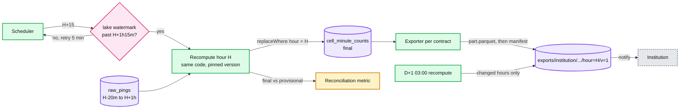

# Deep dive: the hourly export to institutions

> One-line answer: wait for a completeness gate at H+15 min, recompute hour H from raw pings with the same stage 1 and stage 2 code in batch mode, swap the result into `cell_minute_counts` as `final`, then for each contract write tumbling 20-minute windows with values under 5 suppressed to a deterministic path, manifest last, and notify; restate once at D+1 if late data changed anything. Institutions get numbers that are final, reproducible and private, published by H+30.

Related: [`../../streaming-ingestion/`](../../streaming-ingestion/) (how raw pings land), [`../../delta-lake-transactions/`](../../delta-lake-transactions/) (atomic partition swap), [`../../../concepts/exactly-once.md`](../../../concepts/exactly-once.md).

---

## 1. Why not just export what ops saw

| | Copy the provisional stream output | Recompute from raw (chosen) |
|---|---|---|
| Includes pings over 20 min late | No | Yes, up to the cutoff |
| Reproducible months later | Only if the stream never had a bug or an outage | Yes, from raw plus pinned code version |
| Same code as ops | Yes | Yes, same library in batch mode |
| Matches ops exactly | Yes | No, differs by late pings, typically under 1% |
| Cost | Zero | ~20 cores × 5 min per hour |

A regulator who publishes a number wants it to stay the same. Final and reproducible beats identical-to-the-dashboard.

## 2. The hourly pipeline



Details:
- **Input range** `[H-20 min, H+1 h)`. The 20-minute window ending at H:05 needs pings from H-15 min.
- **Cutoff** H+15 is picked from the measured p99.9 end-to-end delay of raw ingestion, plus margin. Revisit quarterly.
- **Pinned code version.** The batch runs the stream library version from yesterday. A bad stream release then shows up as a reconciliation gap instead of silently entering final data.
- **Atomic swap.** One Delta or Iceberg commit replaces hour H. Readers see all provisional or all final, never a mix.

## 3. File contract

```
exports/{institution}/v1/city={city}/date=2026-09-23/hour=14/v=1/
    part-0000.parquet
    _manifest.json
```

Rows: `city_id, cell_id, cell_centroid_lat, cell_centroid_lon, window_start, window_end, drivers_distinct, drivers_avg`, windows `14:00-14:20`, `14:20-14:40`, `14:40-15:00`. Values under `k_min` are null with `suppressed = true`.

Manifest (written last, so its presence means the file is complete): row count, SHA-256 of each part, schema version, code version, source watermark, `restated`, `supersedes`.

Delivery: we publish and notify (webhook or SNS); they pull with credentials scoped to their prefix. We never push into their systems, so their outage is not our retry queue.

## 4. Privacy

| Risk | Control |
|---|---|
| Identify one driver in a quiet cell | Suppress counts under 5 |
| Subtract overlapping windows to see one driver arrive | Tumbling windows only, no overlap |
| Subtract a suppressed cell from a city total | City totals are rounded to the nearest 10, or omitted |
| Finer cells or shorter windows on request | Not in the contract; legal review per change |
| Data outside the contract's cities | Filter in the exporter, credentials scoped by prefix |

Differential privacy (adding calibrated noise) is the next step if an institution publishes the data openly. It changes counts, so it is per contract, and the unnoised final stays internal.

## 5. Restatement

- D+1 03:00: recompute every hour of D with all late data.
- If any published value changed, write `v=2` next to `v=1`, manifest `restated = true, supersedes = v1`, notify.
- After D+1 an hour is frozen. A later bug fix is a new schema or contract version, announced, not a silent overwrite.
- Expected rate: well under 1% of city-hours, dominated by phones that were offline for a long time.

## 6. What the interviewer asks next

- "Why hourly and not every 20 minutes?" The requirement says hourly. The same job at a 20-minute cadence is a scheduler change, but it would publish less complete data.
- "One institution wants it in real time." Serve provisional from Redis through a rate-limited API, labelled provisional. A contract change, not a pipeline change.
- "Twenty institutions, different formats." One final table, N thin exporters. The contract row holds format, cities, `k_min`, delivery.
