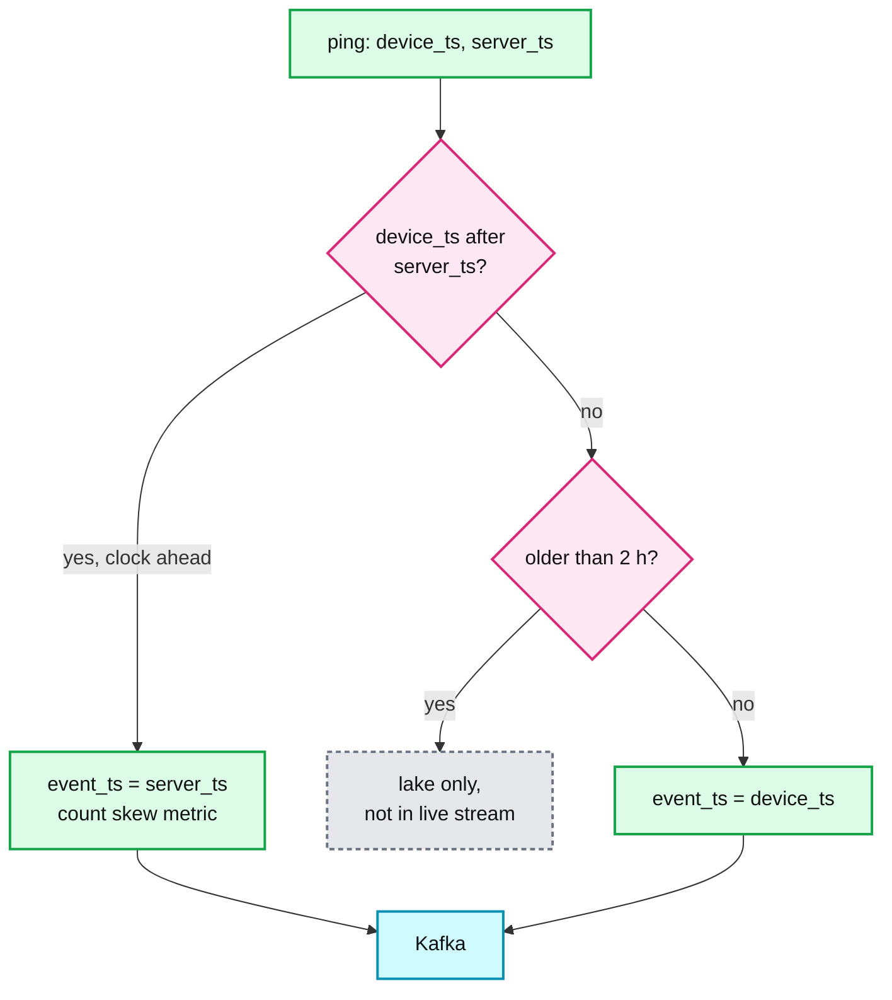
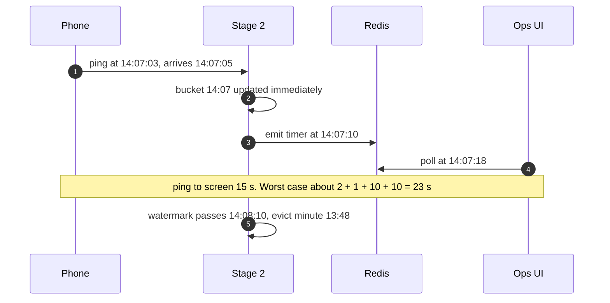

# Deep dive: time, watermarks, and late pings

> One-line answer: bucket by device time clamped to server time (`min(device_ts, server_ts)`), so tunnel pings land in the right minute and a future-dated clock can never push the watermark past the wall clock; let the watermark drive only eviction, never emission, so freshness is ~23 s regardless of lateness; lateness up to the 20-minute window is free because a late fact just moves a last-seen pointer; anything later is picked up by the hourly batch.

Related: [`../../../concepts/stream-processing.md`](../../../concepts/stream-processing.md), [`../../../concepts/leases-fencing-clocks.md`](../../../concepts/leases-fencing-clocks.md) (never trust wall clocks).

---

## 1. Three clocks

| Clock | Who sets it | Good for | Bad because |
|---|---|---|---|
| Device time | The phone | When the driver was really there, including buffered pings | Phones can be minutes or hours off |
| Server time | The gateway on receipt | Trustworthy, monotonic-ish | Buffered pings land in the wrong minute and wrong cell history |
| Processing time | Flink when it handles the fact | Timers for emission | During replay it is far ahead of the data |

Choice: **event time = min(device, server)**. Device time when it is plausible, server time as a ceiling. A ping older than 2 hours goes to the lake only.

A clock that is behind is not clamped. It makes pings look late. The worst case is a phone 30 minutes behind: its pings fall outside the window and that driver is missing from the live view. The skew histogram per app version makes this visible; fixing the phone is not our job.

## 2. The watermark and what it controls

- Generated in the Kafka source per partition: max `event_ts` seen minus 10 s. The operator watermark is the minimum over its input partitions.
- `withIdleness(1 min)`: a partition with no data for a minute stops holding the watermark back. With `driver_id` partitioning every partition carries every city, so it rarely triggers. It matters if someone partitions by city and a small city sleeps at night.
- **The watermark only decides eviction.** Emission is a processing-time timer every 10 s that reports the window `[wm_minute - 19, wm_minute]` including the open minute.

## 3. Lateness, by how late

| How late | Live view | Hourly final |
|---|---|---|
| Under 10 s | Normal | Included |
| 10 s to 20 min | Included. It moves the driver's last-seen pointer if newer | Included |
| 20 min to cutoff (H+15) | Dropped from live, the window already moved on | Included |
| After cutoff | Dropped | Included in the D+1 restatement |
| Over 2 h (at the gateway) | Lake only | Included if within D+1 |

Push back on the textbook: most answers say "watermark plus allowed lateness of N minutes". With last-seen state there is no window to keep open. Allowed lateness is simply the window length, for free.

## 4. Replay and catch-up

After a 30-minute outage, Flink replays Kafka at ~10x.
- Event-time eviction means buckets are evicted as the data's time moves, not the wall clock. Counts are right at every step.
- `as_of` reports the watermark, which lags the wall clock during catch-up. The UI banner stays on until it is within 60 s.
- If eviction used processing time, every driver would be evicted before their backlog pings were processed, and counts would sit near zero for the whole catch-up.

## 5. What to measure

- `clock_skew_seconds` histogram (device minus server), by app version and OS.
- Share of pings clamped, share lake-only.
- Lateness histogram at stage 2 (watermark minus event time of each fact).
- Watermark lag vs wall clock per job. This is `as_of` age.
