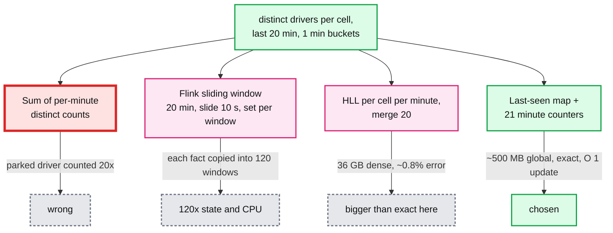
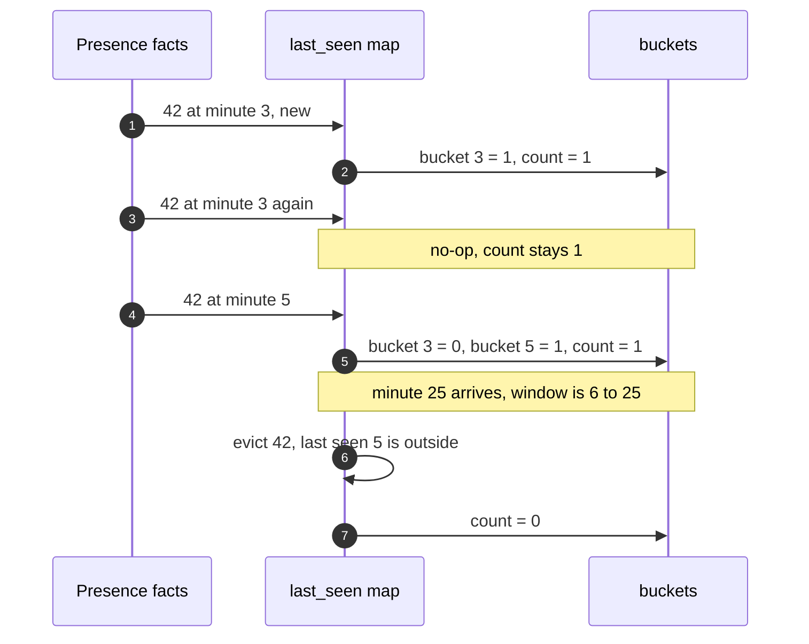

# Deep dive: the 20-minute distinct driver count per cell

> One-line answer: keep, per cell, each driver's last-seen minute plus 21 counters of "drivers last seen in minute m". The 20-minute distinct count is the sum of 20 counters, updates are O(1), duplicates and late facts are no-ops, and state is one entry per distinct (driver, cell) in the window. This is the red node in [`../solution.md`](../solution.md) because it is where "counted once" is decided.

Related: [`../../../concepts/stream-sketches.md`](../../../concepts/stream-sketches.md) (HLL), [`../../../concepts/stream-processing.md`](../../../concepts/stream-processing.md) (keyed state, timers).

---

## 1. Four ways to compute it, three of them wrong or wasteful



- **Sum of per-minute counts.** Each minute bucket is a correct distinct count for that minute. Adding 20 of them counts a driver once per minute they were present. A parked driver becomes 20.
- **Sliding window.** Correct, but Flink assigns each element to every window that contains it: size / slide = 20 min / 10 s = 120 windows, each holding its own set. Slide by 1 minute and it is still 20 copies.
- **HyperLogLog.** Union of 20 per-minute HLLs is a correct distinct estimate. At this cardinality (tens to hundreds per cell) exact state is smaller. HLL wins at millions per key, not hundreds.
- **Last-seen map.** One entry per (driver, cell) in the window. Count = drivers whose last-seen minute is inside the window.

## 2. The chosen structure

Per cell (Flink key = `cell_id`):
- `last_seen: MapState<driver_id, minute>`
- `buckets: int[21]`, ring indexed by `minute % 21`. `buckets[m]` = drivers whose last-seen is `m`. 21, not 20, so the minute being evicted and the new minute never share a slot.
- `in_minute: int[21]` = distinct drivers with any fact in minute `m` (for `drivers_in_minute` and average drivers).

Operations:
- **Add** `(d, m)`: ignore if `m < now - 19`. If `d` new: `buckets[m]++`. If `m > last_seen[d]`: `buckets[old]--`, `buckets[m]++`. Else no-op.
- **Count**: `sum(buckets[now-19 .. now])`.
- **Evict** (event-time timer each minute): drop drivers with `last_seen < now - 19`, zero the slot that is being reused.



## 3. Runnable Python

```python
from collections import defaultdict

WINDOW = 20  # minutes


class CellCounter:
    """Distinct drivers per cell over the last WINDOW minutes, exact."""

    def __init__(self):
        self.last_seen = {}                      # driver -> minute
        self.buckets = defaultdict(int)          # minute -> drivers last seen then
        self.in_minute = defaultdict(set)        # minute -> drivers with any fact
        self.now = 0                             # event-time minute (watermark)

    def add(self, driver, minute):
        if minute < self.now - (WINDOW - 1):
            return                               # too late for the live view
        self.in_minute[minute].add(driver)
        old = self.last_seen.get(driver)
        if old is not None and minute <= old:
            return                               # duplicate or older fact
        if old is not None:
            self.buckets[old] -= 1
        self.buckets[minute] += 1
        self.last_seen[driver] = minute

    def advance(self, minute):
        """Watermark moved to `minute`. Evict drivers outside the window."""
        self.now = max(self.now, minute)
        start = self.now - (WINDOW - 1)
        for d in [d for d, m in self.last_seen.items() if m < start]:
            self.buckets[self.last_seen.pop(d)] -= 1
        for m in [m for m in self.buckets if m < start]:
            del self.buckets[m]
        for m in [m for m in self.in_minute if m < start]:
            del self.in_minute[m]

    def distinct(self):
        start = self.now - (WINDOW - 1)
        return sum(c for m, c in self.buckets.items() if m >= start)

    def average(self):
        return sum(len(s) for s in self.in_minute.values()) / WINDOW


if __name__ == "__main__":
    c = CellCounter()
    for minute in range(20):                     # driver 1 parked 20 minutes, 6 pings/min
        c.advance(minute)
        for _ in range(6):
            c.add(1, minute)
    c.add(2, 10)                                  # driver 2 passes through at minute 10
    c.add(2, 10)                                  # duplicate
    print("distinct:", c.distinct())             # 2, not 120 + 2
    print("average:", c.average())               # (20 + 1) / 20 = 1.05
    c.advance(30)                                # window is now 11 to 30
    print("after 11 min:", c.distinct())         # 1: driver 2 aged out, driver 1 last seen 19
    c.advance(40)
    print("after 21 min:", c.distinct())         # 0
```

Output:

```
distinct: 2
average: 1.05
after 11 min: 1
after 21 min: 0
```

## 4. Memory math, exact vs HLL

| Structure | Per unit | Units | Total |
|---|---|---|---|
| Exact last-seen map | ~80 B per (driver, cell) in RocksDB | 1.5 M drivers × ~4 cells = 6 M | ~500 MB |
| Dense HLL (p = 14) | 12 KB | 150k cells × 20 minutes = 3 M | ~36 GB |
| Sparse HLL | ~a few bytes per distinct item until it turns dense | same | roughly the exact size, and still approximate |

Where HLL does belong: "distinct drivers across all cities over 90 days" (tens of millions of items, merged across partitions). Nobody asked for it.

## 5. Emission and eviction are two different clocks

- **Emit** every 10 s on a processing-time timer. Freshness does not wait for the watermark.
- **Evict** on an event-time timer per minute. Correct during Kafka replay, when processing time is far ahead of event time.
- Emit only cells that changed since the last emit, plus a full emit once a minute so a blank Redis refills.

## 6. What the interviewer asks next

- "Why 21 slots?" The slot for minute `now - 20` is still being evicted when minute `now` starts writing. 21 avoids a collision.
- "What if you need the count at 14:07 an hour later?" The minute rows in `cell_minute_counts` store `drivers_20m` per minute. The live state only answers "now".
- "Can Redis do this alone?" A sorted set per cell with `ZADD driver score=minute` and `ZCOUNT` over the window is the same idea. It works for one city. Across 150k cells it pushes 30k writes/s plus eviction into Redis and gives up checkpointed exactly-once. Fine as a small-scale answer, say where it stops.
