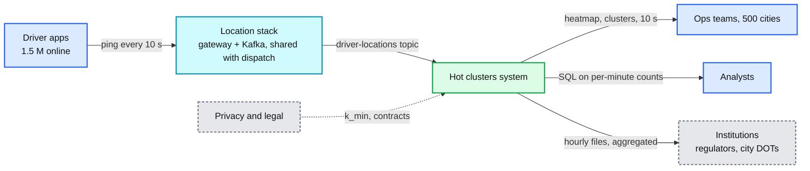
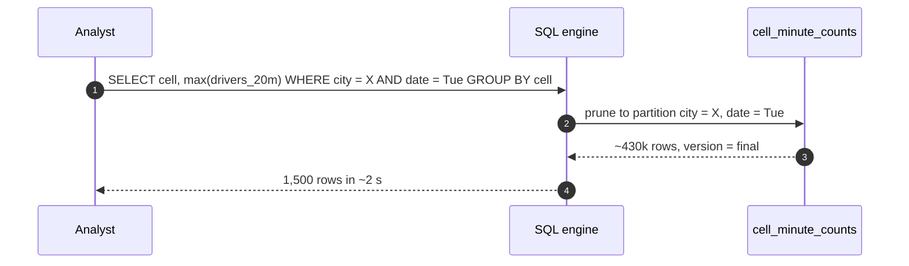
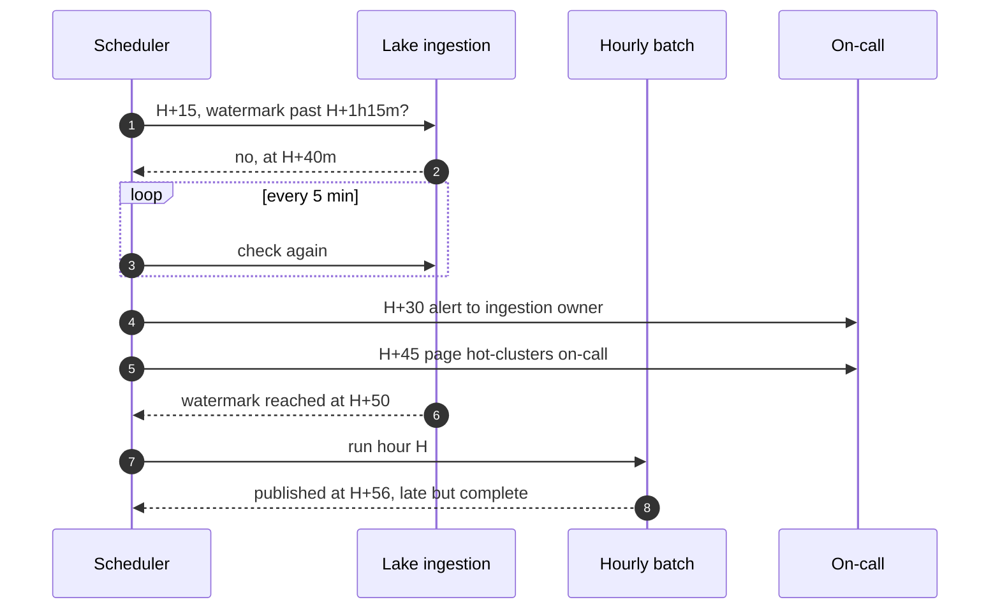
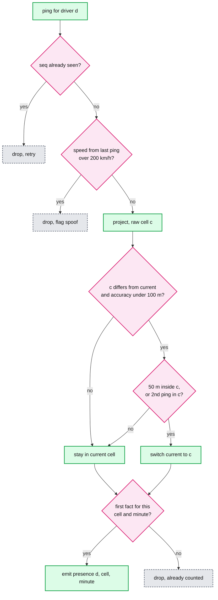
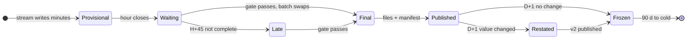
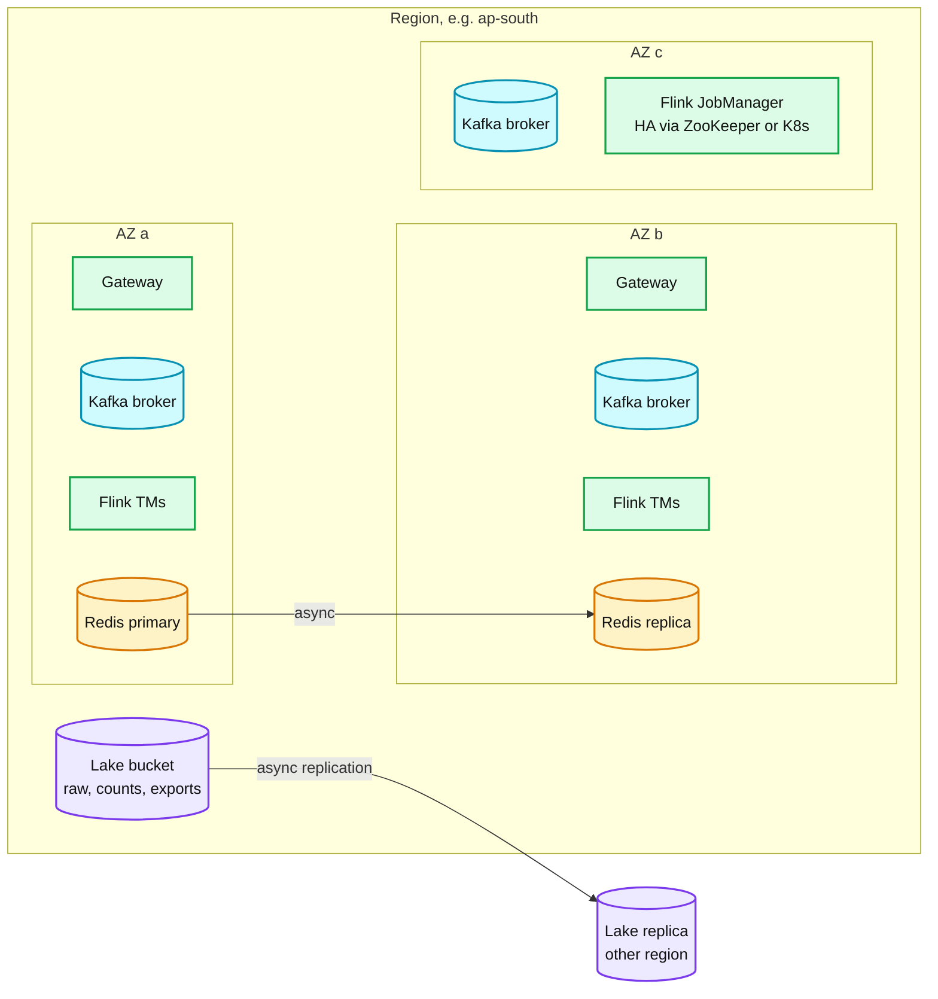
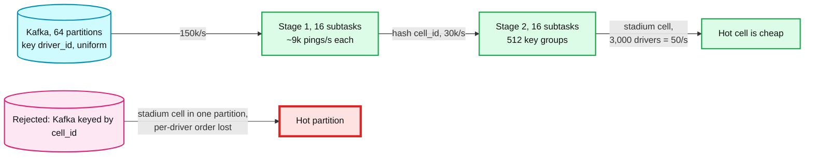
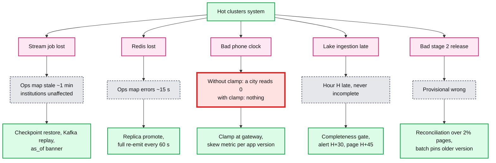
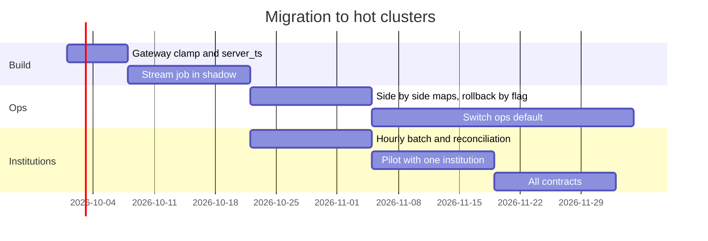

# Diagrams: Driver hot clusters in a city

The D1 to D12 set from `hld/CLAUDE.md` §4. A diagram is drawn once: the ones embedded in [`solution.md`](solution.md) are linked here, not repeated.

| # | Diagram | Where |
|---|---|---|
| D1 | Context | below |
| D2 | Data flow | below |
| D3 | Component architecture (final design) | `solution.md` §6 |
| D4 | Happy path per FR | FR1 to FR3 ping to screen: `solution.md` §6 Flow 1. FR4 hourly export: §6 Flow 2. FR5 history query: below |
| D5 | Failure paths | Stream job restart: `solution.md` §6 Flow 3. Clock 1 h ahead: §5.2. Hourly completeness gate fails: below |
| D6 | Decision flow | Stage 2 per presence fact: `solution.md` §5.1. Stage 1 cell assignment with hysteresis: below |
| D7 | Entity relationship | `solution.md` §3.3 |
| D8 | State machine | Hour lifecycle, provisional to final to restated: below |
| D9 | Deployment / topology | below |
| D10 | Scaling / partitioning | below |
| D11 | Failure mode map | below |
| D12 | Rollout / migration | below |

---

## D1. Context (zoom-out)

## D2. Data flow (DFD)

```mermaid
%% D2: data flow with names, formats, sizes and rates on every edge.
flowchart LR
    APP([Driver app]) -->|"ping, protobuf ~60 B, 150k/s peak"| K[(Kafka topic)]
    K -->|"ping, 150k/s"| S1([Stage 1: dedup + grid])
    S1 -->|"presence, ~40 B, ~30k/s"| S2([Stage 2: distinct per cell])
    S2 -->|"cell counts, ~20 B, up to 15k/s batched"| R[(Redis)]
    S2 -->|"minute rows, 2.5k/s, 6.5 GB/day"| CMC[(cell_minute_counts)]
    K -->|"raw, ~100 GB/day Parquet"| RAW[(raw_pings)]
    RAW -->|"1 h = ~4 GB, hourly"| HB([Hourly batch])
    HB -->|"final rows, 9 M per hour"| CMC
    CMC -->|"450k rows/h, ~15 MB"| EXP([Exporter])
    EXP -->|"Parquet + manifest per contract"| OUT[(Export bucket)]
    R -->|"~30 KB JSON per city, 100 reads/s"| API([Heatmap API])

    class APP client
    class S1,S2,HB,EXP,API service
    class K queue
    class R cache
    class CMC,RAW,OUT store

    classDef client   fill:#dbeafe,stroke:#2563eb,stroke-width:2px,color:#111
    classDef service  fill:#dcfce7,stroke:#16a34a,stroke-width:2px,color:#111
    classDef store    fill:#ede9fe,stroke:#7c3aed,stroke-width:2px,color:#111
    classDef cache    fill:#fef3c7,stroke:#d97706,stroke-width:2px,color:#111
    classDef queue    fill:#cffafe,stroke:#0891b2,stroke-width:2px,color:#111
```

## D4. FR5 history query (happy path)

## D5. Hourly completeness gate fails

## D6. Stage 1 cell assignment with hysteresis

## D8. State machine: one hour of counts

## D9. Deployment / topology

## D10. Scaling / partitioning

## D11. Failure mode map

## D12. Rollout / migration

