# HLD: Driver hot clusters in a city

> One-line answer: turn every 10 s GPS ping into a `(driver, cell, minute)` presence fact in a stage keyed by driver, then keep one exact "last seen minute" per driver per 1 km² cell in a stage keyed by cell, so the 20-minute count is a sum of 20 minute-buckets and every driver counts once however many pings it sent; push per-cell counts to Redis every 10 s for the ops heatmap and hot clusters; write the same per-minute counts to a lake table as `provisional`, and let an hourly batch job, running the same code over raw pings after a 15-minute late-data cutoff, overwrite them as `final` and publish k-anonymised files to each institution. Nothing here is big (150k pings/s peak, well under 1 GB of state). The red node is the per-cell distinct-count state, because that is where "counted once" is either right or wrong.

Sources: [Blind, Uber L6 round](https://www.teamblind.com/post/uber-l6-staff-engineer-system-design-round-8euje85r) (20 min, 1-minute buckets, durable after 24 h), [H3 resolution table](https://h3geo.org/docs/core-library/restable/), [Real-time Data Infrastructure at Uber, SIGMOD 2021](https://arxiv.org/abs/2104.00087), [Flink windows](https://nightlies.apache.org/flink/flink-docs-stable/docs/dev/datastream/operators/windows/), [Flink watermarks](https://nightlies.apache.org/flink/flink-docs-stable/docs/dev/datastream/event-time/generating_watermarks/). Research notes in [`research/requirements-survey.md`](research/requirements-survey.md). Written flow-first: §4 builds one diagram one functional requirement at a time, §5 breaks and changes that design one non-functional requirement at a time, §6 is the final design plus the flows to rehearse.

---

## 1. Understanding the problem

Restate before designing. Ops managers in a city look at a map. Each 1 km² square shows how many distinct drivers were in it during the last 20 minutes. Squares that are hot, and groups of hot squares next to each other, tell them where supply is piling up (airport lot, a stadium emptying) or missing. They act on it: send incentives, move drivers, open a pickup zone. Separately, every hour, the same numbers go to outside institutions (city transport department, regulator, research partners) as files.

The trap is that the data volume is small and the semantics are hard. Three things carry the interview:
- **What "counted once" means.** A driver pings 120 times in 20 minutes and may cross 5 cells.
- **Time.** Pings arrive late, out of order, and with phone clocks that lie.
- **Two consumers, two correctness bars.** Ops wants fast and approximately right. Institutions want slow, final, reproducible and private.

### 1.1 Functional requirements

Core (after the web research, see [`README.md`](README.md#what-the-web-research-changed)):
1. **Ingest.** Every online driver pings every 10 s. Map each ping to a 1 km² land cell.
2. **Count.** Per cell, distinct drivers seen in the last 20 minutes, in 1-minute buckets. A driver counts once per cell per window.
3. **Ops heatmap.** City heatmap plus hot clusters (groups of adjacent hot cells), refreshed every 10 s, with a 20-minute trend per cell.
4. **Institutions.** Hourly, deliver per-cell counts to multiple institutions, aggregated and anonymised, each under its own contract.
5. **History.** Per-minute cell counts durable and queryable for analytics after 24 h. 90 days hot.

Below the line (say it out loud):
- Demand (rider requests) and surge pricing. Same pipeline, second input stream. Evolution in §10.11.
- Acting on the data (repositioning drivers, incentives). Ops decides, we show.
- Prediction of future hot spots.
- Per-driver tracking for ops. The dispatch system already has live driver locations; this system only exposes counts.
- The location ingest itself (gateway, mobile protocol). We reuse the one dispatch already runs, see [`../uber-ride-hailing/`](../uber-ride-hailing/).

**Definition of "counted once"** (agree this with the interviewer before drawing anything):

| Question | Answer we pick | Why |
|---|---|---|
| Driver sends 120 pings in cell A in 20 min | Counts 1 in A | The whole point of the requirement |
| Driver passes through A, B, C in 20 min | Counts 1 in each of A, B, C | Ops asks "how many drivers were here recently". Each cell's number is honest on its own |
| City total | Distinct drivers across the city, computed separately | Summing cells would count that driver 3 times |
| Same ping delivered twice (retry) | No effect | Set semantics make it free |
| Driver parked on a cell edge, GPS jitters | Counts in one cell | Hysteresis in cell assignment (§5.1) |
| Driver logged in on two phones | Counts once | Key is `driver_id`, not device id |

We also emit a second number for free: **average drivers** = driver-minutes in the window / 20. A driver who spent 4 of 20 minutes in A adds 0.2 to A. Summed over the city this equals drivers online on average, so it never double counts. Offer it; let ops choose which one colours the map.

### 1.2 Non-functional requirements

Ask for scale first. Uber does not publish concurrent online drivers, so state assumptions.

| Dimension | Target | Why this number |
|---|---|---|
| Scale | 500 cities, 1.5 M online drivers at global peak, 50k in the largest city. Largest city ~1,500 km² of land, so ~1,500 cells | Assumption. Registered driver counts (millions) are not concurrency |
| Ingest rate | 150k pings/s global peak, 60k/s average. 5k/s in the largest city | 1.5 M / 10 s |
| Freshness | Ping to heatmap p99 < 30 s. Map refreshes every 10 s | Pings arrive every 10 s, so faster than 10 s shows nothing new |
| Correctness, ops | Exact distinct count for pings up to 20 min late. Later pings are missing from the live view only | Late beyond the window cannot change the current window anyway |
| Correctness, institutions | Final, deterministic, reproducible from raw data. Restated at most once (D+1) | They publish it. A number that changes silently is worse than a late one |
| Hourly delivery | Hour H published by H+30 min, 99.5% of hours | 15 min late-data cutoff + compute + delivery |
| History | Per-minute counts queryable 24 h later and for 90 days | Blind report: durable for analytics after 24 h |
| Availability | Dashboard fresh (< 60 s old) in 99.9% of minutes. Stale is shown as stale, never as zero | Ops decisions are minutes-scale; a stale-but-labelled map is fine for a minute |
| Privacy | Institutions never see driver ids, trajectories, or counts under 5 | Location is personal data |

Below the line: multi-region active-active for one city (a city lives in one region), sub-10 s freshness.

---

## 2. Back-of-envelope

**Pings.** 1.5 M online × 1 ping / 10 s = **150k pings/s peak**. Average ~0.6 M online = **60k/s**. A ping (driver id, device ts, lat, lon, accuracy, status, seq, city) is ~60 B in protobuf, ~150 B with Kafka framing. Peak bytes: 150k × 150 B = **22.5 MB/s**. That is one mid-size Kafka topic. The largest city is 5k pings/s.

**Raw storage.** 60k/s × 86,400 = 5.2 B pings/day × 150 B = **780 GB/day** raw, ~100 GB/day in Parquet (driver id dictionary-encodes, coordinates delta-encode). Raw is personal data: keep 30 days = ~3 TB.

**Cells.** 500 cities, average ~300 km² of land = **~150k cells** globally. Largest city 1,500.

**Presence facts** (stage 1 output, one per driver per cell per minute, plus one on each cell change). 1.5 M / 60 s = 25k/s, plus cell changes. A driver at 30 km/h crosses a 1 km cell about every 2 minutes, and about half of online drivers are moving: +6k/s. **~30k/s**, a 5x cut from 150k pings/s.

**Stage 2 state** (one entry per distinct driver per cell in the last 20 minutes). A parked driver touches 1 cell, a moving one ~10. Average ~4. 1.5 M × 4 = **6 M entries**. At ~80 B each in RocksDB with overhead: **~500 MB global**. Largest city: 50k × 4 × 80 B = 16 MB.

**HyperLogLog comparison.** A dense HLL is 12 KB. One per cell per minute bucket: 150k × 20 × 12 KB = **36 GB**, 70x more than the exact state, and ~0.8% wrong. Sparse HLL shrinks it, but exact is still smaller and exact. HLL is the wrong tool at this cardinality (tens to hundreds per cell). Say this out loud.

**Serving.** Every 10 s, emit changed cells: at most 150k values / 10 s = 15k writes/s, batched as one Redis pipeline per city = 50 pipelines/s. A city heatmap is 1,500 cells × ~20 B = 30 KB, ~8 KB gzipped. 1,000 ops users polling every 10 s = **100 reads/s**. Trivial.

**History table.** 150k cells × 1,440 minutes = 216 M rows/day × ~30 B = 6.5 GB/day raw, ~1 GB/day compressed. 90 days = **~90 GB**. Any lake table plus a SQL engine handles it.

**Institution files.** Per city-hour: 1,500 cells × 3 twenty-minute windows = 4.5k rows. Global: 150k × 3 = 450k rows/hour, ~15 MB. 20 institutions each get a subset.

**Compute.** Stage 1 does a projection, a grid lookup and a map update per ping: ~200k pings/s per 8 cores is conservative. 150k/s peak fits on ~16 cores. Provision 64 vCPU for 3x catch-up after an outage.

**Freshness budget** (p99 30 s): phone to gateway ~2 s on mobile, gateway to Kafka ~10 ms, Kafka to stage 1 to stage 2 ~1 s, stage 2 emits every 10 s (worst 10 s), Redis write ~5 ms, dashboard poll every 10 s (worst 10 s). Worst case ~23 s. The watermark is **not** on this path (§5.2).

---

## 3. The set-up

Data-processing style: system interface, naive data flow, then the data model.

### 3.1 System interface

**Input**
- Ping: `(driver_id, device_ts, lat, lon, accuracy_m, status ∈ {available, on_trip}, seq, city_id)` plus `server_ts` stamped by the gateway.

**Output**
- Live: `GET /v1/cities/{city}/heatmap?metric=distinct|avg` → `{as_of, window: [t-20m, t], cells: [{cell_id, distinct, avg, available, on_trip}], clusters: [...]}`.
- Trend: `GET /v1/cities/{city}/cells/{cell}/trend?minutes=20` → per-minute counts.
- History: SQL on the `cell_minute_counts` table (analysts).
- Institutions: hourly files at `exports/{institution}/v1/city={c}/date={d}/hour={h}/`, plus a manifest and a notification.

### 3.2 Data flow (deliberately naive)

1. For each ping, compute the cell and `INCR count:{cell}:{minute}` in Redis.
2. The dashboard sums the last 20 minute-keys per cell.
3. Every hour a cron job copies the sums to a CSV for each institution.

It fails the one requirement that matters. A driver sitting in a cell pings 6 times a minute: that cell shows 6 per minute and 120 over the window instead of 1. Switching to `SADD` per minute fixes the 6 but summing 20 per-minute sets still counts a parked driver 20 times. It also has no answer for late pings, retries, or bad clocks, and the hourly CSV is whatever Redis held at that moment, not reproducible. §4 fixes each of these.

### 3.3 Data model

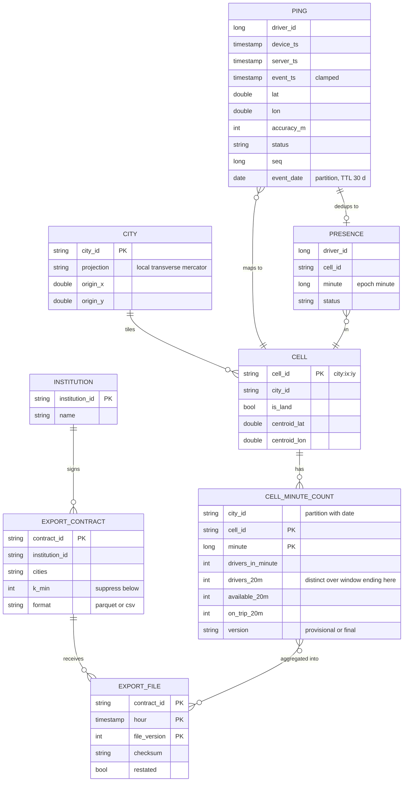

Access patterns that justify it:
- **"Heatmap for city X now"** reads 1,500 cells from one Redis hash `heat:{city}`. One key per city, so one round trip.
- **"Trend for cell Y, last 20 minutes"** reads a Redis sorted set per city keyed by minute, 20 entries.
- **"Counts for last Tuesday"** scans `cell_minute_counts` partitioned by `(city_id, date)`. ~430k rows per big city per day.
- **"Hour H for institution I"** reads `cell_minute_counts` where `version = final` for the contract's cities and hour. Same table as analysts, so one definition.
- **Raw pings** are partitioned by `event_date` and read only by the hourly job and by replays. TTL 30 days.
- **Stage 2 state** (not a table): per cell, `driver_id → last_seen_minute` plus 21 minute counters. Lives in Flink state, checkpointed.

---

## 4. High-level design

One subsection per functional requirement. Each one traces input to output, adds boxes to one diagram, and ends with what is still missing. §5 fixes the gaps.

### 4.1 Ingest: a ping becomes a presence fact in a 1 km² cell

**Flow**

1. The driver app sends a ping every 10 s to the location gateway (the one dispatch already runs). The gateway stamps `server_ts` and writes to Kafka topic `driver-locations`, **partitioned by `driver_id`**, with an idempotent producer. Per-driver order is kept within a partition.
2. Stage 1 of the stream job (Flink) reads the topic. It is keyed by `driver_id`, which is also the Kafka partition key, so there is no network shuffle.
3. For each ping it computes the cell: project `(lat, lon)` into the city's local metric grid, `ix = floor(x / 1000)`, `iy = floor(y / 1000)`, `cell_id = city:ix:iy`. Water cells are dropped by a static land mask (or kept if ops wants bridges; ask).
4. It keeps tiny per-driver state: last `seq`, last cell, last minute emitted. A ping with a `seq` it has already seen is dropped (retry). A ping in the same cell and the same minute as the last emitted fact is dropped (the 5 other pings of that minute).
5. Otherwise it emits `presence(driver_id, cell_id, minute, status)`. That is one fact per driver per cell per minute: ~30k/s instead of 150k/s.

```mermaid
%% Incremental diagram, step 1 of 5: ingest. Pings are partitioned by driver so stage 1 can dedup per driver without a shuffle.
flowchart LR
    APP[Driver app<br/>ping every 10 s] -->|"1. ping, ~60 B"| GW[Location gateway<br/>stamps server_ts]
    GW -->|"2. keyed by driver_id<br/>150k/s peak"| K[(Kafka<br/>driver-locations)]
    K -->|"3. same partitioning,<br/>no shuffle"| S1[Stage 1: per driver<br/>cell assign, dedup]
    S1 -->|"4. presence<br/>driver, cell, minute<br/>~30k/s"| OUT[next: stage 2]

    class APP client
    class GW,S1 service
    class K queue
    class OUT external

    classDef client   fill:#dbeafe,stroke:#2563eb,stroke-width:2px,color:#111
    classDef service  fill:#dcfce7,stroke:#16a34a,stroke-width:2px,color:#111
    classDef queue    fill:#cffafe,stroke:#0891b2,stroke-width:2px,color:#111
    classDef external fill:#e5e7eb,stroke:#6b7280,stroke-width:2px,color:#111,stroke-dasharray:4 3
```

**Still missing:** nothing is counted yet. GPS jitter on a cell edge will flip the cell every ping (fixed in §5.1). Phone clocks decide `minute` and can lie (fixed in §5.2).

### 4.2 Count: distinct drivers per cell over the last 20 minutes

The idea: **store when each driver was last seen in each cell, not how many pings arrived.** Then the 20-minute count is "how many drivers have a last-seen minute inside the window", and a driver can only ever be one entry.

**Flow**

1. Presence facts are re-keyed by `cell_id` (a network shuffle, ~30k/s).
2. Stage 2 keeps, per cell: `last_seen: driver_id → minute`, and a ring of 21 counters `bucket[minute] = drivers whose last_seen is that minute`.
3. On `presence(d, cell, m)`: if `m` is newer than `last_seen[d]`, decrement the old minute's counter, increment `bucket[m]`, set `last_seen[d] = m`. Otherwise do nothing. Duplicates and older facts are no-ops.
4. `drivers_20m = sum(bucket[now-19 .. now])`. 20 additions. `drivers_in_minute` is a separate per-minute counter of first presence per driver per minute.
5. Once a minute, drivers whose last seen minute has fallen out of the window are removed from `last_seen`, so state stays at "drivers seen in the last 20 minutes".
6. A parallel keyed-by-city aggregate does the same for the city total (distinct across cells).
7. Every 10 s (processing-time timer) stage 2 emits `(city, cell, window_end, drivers_20m, drivers_in_minute, available_20m, on_trip_20m)` for cells that changed.

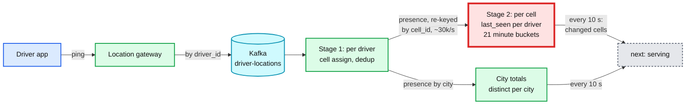

**Still missing:** nowhere to read it from. What "now" means is undefined (device clock? server clock?). A restart must not double count.

### 4.3 Ops heatmap: map plus hot clusters, every 10 s

**Flow**

1. A sink writes stage 2 output into Redis, one pipeline per city: `HSET heat:{city} {cell} {packed counts}` and `HSET heat:{city}:meta as_of {window_end}`. Values are **set, never incremented**, so a replayed write is harmless.
2. The same sink appends each finished minute to `ZADD trend:{city} {minute} {packed cells}` and trims to 120 minutes (2 h of trend).
3. The ops UI polls `GET /v1/cities/{city}/heatmap` every 10 s (SSE is an option; 1,000 users do not need it).
4. The heatmap API reads the hash (~30 KB), then finds **hot clusters**: a cell is hot if `drivers_20m >= max(absolute floor, city p90)`. A breadth-first search over the 8 neighbours of each hot cell groups them. 1,500 cells takes under 1 ms, so do it on read and let each user tune the threshold.
5. The response carries `as_of`. If `as_of` is older than 60 s, the UI shows a stale banner instead of pretending the numbers are live.

**Still missing:** Redis only knows the last 2 hours and is losable. No history, nothing for institutions.

### 4.4 Institutions: hourly, final, private files

The key decision: **institutions do not get what ops saw. They get the same computation, run again later over complete data.** Ops wants fast, institutions want final. Both come from one piece of code.

**Flow**

1. Raw pings also land in the lake (`raw_pings`, partitioned by `event_date`) through the standard ingestion path ([`../streaming-ingestion/`](../streaming-ingestion/)). The stream job also writes each finished minute to `cell_minute_counts` with `version = provisional`.
2. At H+15 min a scheduler checks a completeness gate: the lake's ingestion watermark has passed H+1h+15min. (If not, wait and alert at H+30.)
3. The hourly job reads raw pings with `event_ts` in `[H-20min, H+1h)` (the 20 minutes before H are needed to compute windows that end early in the hour). It runs **the same stage 1 and stage 2 library** in batch mode.
4. It overwrites hour H of `cell_minute_counts` with `version = final` in one atomic partition swap. Analysts and institutions only read `final`.
5. For each export contract: pick its cities, take 20-minute tumbling windows (`:00`, `:20`, `:40`) per cell, suppress any value under `k_min` (default 5, shown as `<5`), write `part.parquet`, then `_manifest.json` (row count, checksum, code version, source watermark) last. Notify the institution (webhook or SNS). They pull with credentials scoped to their own prefix.
6. Paths are deterministic (`hour=H/v=1/`). A re-run writes the same bytes to the same path.

```mermaid
%% Incremental diagram, step 4 of 5: the hourly path. Same code as the stream, run in batch mode over complete raw data, published per contract.
flowchart LR
    K[(Kafka)] -->|"raw pings"| ING[Lake ingestion]
    ING -->|"Parquet, by event_date"| RAW[(raw_pings<br/>TTL 30 d)]
    S2[Stage 2<br/>stream]:::critical -->|"each minute,<br/>provisional"| CMC[(cell_minute_counts)]
    SCH[Scheduler<br/>H+15 min, completeness gate] -->|"run hour H"| HB[Hourly batch<br/>same stage 1+2 code]
    RAW -->|"event_ts in H-20m to H+1h"| HB
    HB -->|"replace hour H,<br/>final"| CMC
    CMC -->|"final rows"| EXP[Export per contract<br/>k-anon, 20 min windows]
    EXP -->|"files + manifest"| B[(Export bucket<br/>prefix per institution)]
    B -->|"pull, scoped creds"| INST[Institutions]

    class INST external
    class ING,SCH,HB,EXP service
    class K queue
    class RAW,CMC,B store

    classDef service  fill:#dcfce7,stroke:#16a34a,stroke-width:2px,color:#111
    classDef store    fill:#ede9fe,stroke:#7c3aed,stroke-width:2px,color:#111
    classDef queue    fill:#cffafe,stroke:#0891b2,stroke-width:2px,color:#111
    classDef external fill:#e5e7eb,stroke:#6b7280,stroke-width:2px,color:#111,stroke-dasharray:4 3
    classDef critical fill:#fee2e2,stroke:#dc2626,stroke-width:4px,color:#111
```

**Still missing:** late data after the cutoff (restatement), and proof that provisional and final agree closely enough.

### 4.5 History: queryable after 24 h

Nothing new to build. `cell_minute_counts` is the durable history: final for every hour older than ~H+15 min, provisional for the current hour. A SQL engine (Trino or Spark SQL) on the lake answers analyst queries in seconds. Retention: 90 days hot, then a lifecycle rule to cold storage. Redis holds only 2 hours and can be lost.

What we refused to build: a real-time OLAP store (Pinot, Druid). Ops needs the last 20 minutes, which Redis serves. Analysts need yesterday, which the lake serves. Nobody asked for interactive slicing of the last hour by arbitrary dimensions. If they do, Pinot reading the same Kafka topic of cell counts is the seam.

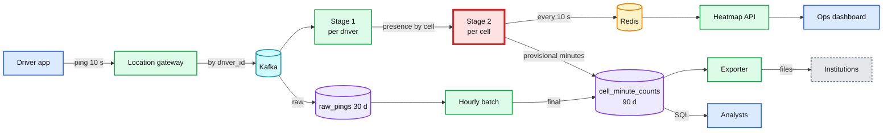

---

## 5. Deep dives

One per non-functional requirement, phrased as the interviewer's question. Each says what breaks in the §4 design, the fix, and what changed.

### 5.1 "How do you guarantee a driver is never counted twice?"

This is the red node. Five ways to double count, in the order an interviewer finds them:

| # | What breaks | Fix | Where |
|---|---|---|---|
| 1 | Summing per-minute distinct counts over 20 minutes counts a parked driver 20 times | Count drivers by **last seen minute**, not by minute. One entry per driver per cell | Stage 2 |
| 2 | Flink `SlidingEventTimeWindows(20 min, 10 s)` with a distinct set per window | Each element is copied into size / slide = **120 windows**, so state and CPU are 120x. Rejected. Use a `KeyedProcessFunction` with the last-seen map | Stage 2 |
| 3 | GPS jitter of 10 to 30 m on a cell edge flips the cell every ping. Driver counts in both cells | **Hysteresis**: switch cell only when the ping is at least 50 m inside the new cell, or 2 pings in a row are there. Pings with `accuracy_m > 100` never change the cell | Stage 1 |
| 4 | Retries, redelivery, job restart replaying Kafka | Set semantics (a replayed presence is a no-op), Flink exactly-once state with checkpoints, Redis values are `SET` not `INCR` | Stage 1, 2, sink |
| 5 | City total computed as the sum of cells | Separate keyed-by-city distinct. Sum of cells is labelled "cell-visits", never "drivers" | City aggregate |

Push back on the textbook: HyperLogLog is the reflex answer for distinct counts. Here the cardinality is tens to hundreds per cell, exact state is ~500 MB globally, and dense HLL would be ~36 GB (§2). Exact is smaller, cheaper and correct. HLL earns its place only for "distinct drivers across all cities for the last 90 days", which nobody asked for.

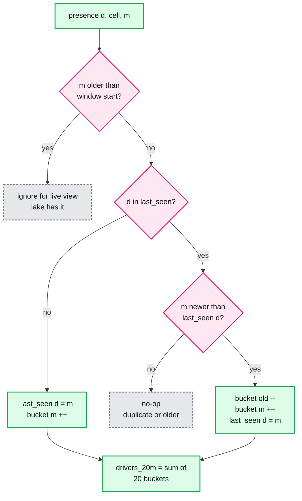

**What changed:** stage 1 gained hysteresis state (last cell, candidate cell, candidate count). Stage 2 is a `KeyedProcessFunction`, not a window operator. The API labels sums of cells as visits. Full treatment with runnable code: [`deep-dives/windowed-distinct-count.md`](deep-dives/windowed-distinct-count.md), [`deep-dives/grid-cells-and-clusters.md`](deep-dives/grid-cells-and-clusters.md).

### 5.2 "How is it fresh in 30 s and still right with late pings and lying clocks?"

**What breaks in §4.**
- A phone whose clock is 1 hour ahead sends `device_ts = now + 1h`. If the watermark follows device time, it jumps 1 hour, every real ping becomes "late", and every cell in the city drops to 0. One phone blanks a city.
- A phone in a tunnel buffers 5 minutes of pings and sends them at once. With a short allowed lateness they are dropped.
- If "now" is the watermark and we emit only when the watermark passes a minute, freshness equals the watermark delay plus 1 minute.
- After a 10-minute outage, the job replays Kafka at 10x speed. If "now" is processing time, it evicts drivers whose pings are still in the backlog, and counts collapse during catch-up.

**Fixes.**
1. **Clamp time at the gateway**: `event_ts = min(device_ts, server_ts)`. A clock in the future becomes server time. A ping older than 2 hours goes to the lake only. Now the watermark can never pass the wall clock.
2. **Event time, not processing time**, decides the minute bucket. Watermark = max `event_ts` per Kafka partition minus 10 s. `withIdleness(1 min)` so a quiet partition does not hold it back (with driver-id partitioning every partition carries every city, so this is rare).
3. **The watermark only drives eviction**, not emission. A ping increments its bucket the moment it arrives. The 10 s emit timer shows the window `[current minute - 19, current minute]` including the partial minute. So freshness is ~23 s worst case and does not depend on the watermark.
4. **Lateness up to 20 minutes is free.** A late presence for minute `m` still lands if `m` is inside the window, because it just moves a last-seen pointer. Past 20 minutes it cannot change the live window, so it is dropped from the live view and picked up by the hourly batch.
5. **Catch-up is correct by construction**, because eviction follows event time. During replay the map shows `as_of` = watermark, which lags wall time, and the stale banner is on until it catches up.

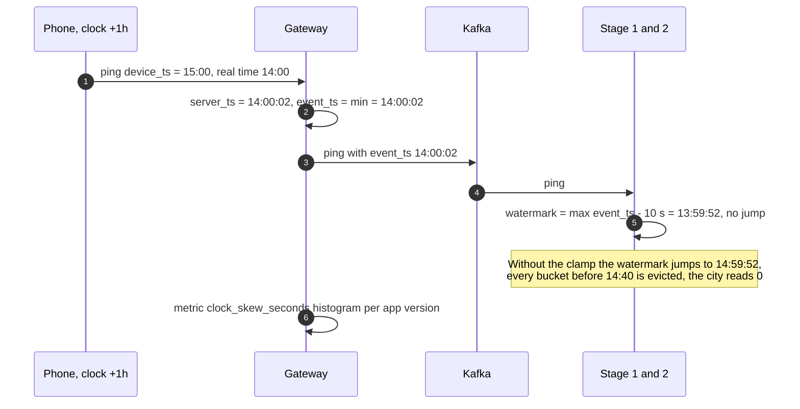

**What changed:** the gateway stamps `server_ts` and clamps. Stage 2 has two timers: 10 s processing-time emit, 1-minute event-time eviction. Details: [`deep-dives/time-watermarks-and-late-pings.md`](deep-dives/time-watermarks-and-late-pings.md).

### 5.3 "Institutions and ops see different numbers. Which is right?"

**What breaks.** Ops saw "Airport: 212 drivers, 14:00 to 14:20". The regulator's file says 214. Someone asks which is true.

**The answer is designed in, not explained away.**
- Both come from the same code. Provisional is computed from pings that arrived within 20 minutes. Final is computed from all pings that arrived within the H+15 cutoff. **Final is right.** The difference is exactly the late pings.
- The hourly job writes a **reconciliation metric** per city-hour: `abs(final - provisional) / final` per cell. Expected p99 < 1%. If it goes above 2% the stream is dropping or double counting something: page.
- Late data after the cutoff: a daily job at D+1 03:00 recomputes yesterday. If any published value changed, it writes `hour=H/v=2/` with `restated = true` in the manifest and notifies. The contract says hours are final at D+1. Expected restatements: well under 1% of hours.

**Privacy (what each institution can learn).**
- Only aggregates. No driver id, no trajectory, no cell finer than 1 km², no window shorter than 20 minutes.
- Values under `k_min = 5` are suppressed as `<5`. Suppression is per value, and windows are **tumbling** (`:00`, `:20`, `:40`), not sliding. Sliding windows every minute would let someone subtract neighbouring windows to see one driver arrive.
- Each contract lists its cities. Credentials are scoped to one bucket prefix. Every download is logged.

**What changed:** the counts table gained `version`, the exporter gained the D+1 restatement, and there is a reconciliation job and metric. Details: [`deep-dives/hourly-institution-export.md`](deep-dives/hourly-institution-export.md).

### 5.4 "What happens when a component dies?"

| Component dies | Ops sees | Institutions see | Recovery |
|---|---|---|---|
| One Flink TaskManager | Stale banner for ~1 min | Nothing | Restart from last checkpoint (30 s interval, ~500 MB state, restore ~20 s), replay Kafka from checkpoint offsets at ~10x. Redis writes are idempotent `SET` |
| Whole Flink job for 30 min | Stale banner, last known map | Nothing: the hourly job reads raw pings, not the stream | Kafka retains 3 days. Catch-up at 10x takes ~3 min. Eviction follows event time, so counts are right during catch-up |
| Redis primary | Up to ~15 s of errors | Nothing | Replica promoted. Stage 2 re-emits every cell once a minute (not only changed ones), so a blank Redis is full again within 60 s |
| Kafka | Stale map. Also dispatch is down, a bigger incident | Hourly delayed | Shared platform. Not ours to fix, ours to survive |
| Lake ingestion lagging | Nothing | Completeness gate holds hour H. Alert at H+30 | Hour published late, never incomplete |
| Hourly job bug | Nothing | Wrong file | Fix, re-run hour H, publish `v=2` with `restated` |

The one real single point of failure for ops is the stream job. Stale is fine for a minute; a map that silently shows zeros is not. That is why `as_of` travels with every response.

### 5.5 "Now 10x drivers, or a stadium empties into one cell"

- **Hot cell.** A stadium lets out and 3,000 drivers sit in one cell. That is 3,000 presence facts per minute to one key = 50/s. Not a hot key. Stage 2 is keyed by cell and nothing per key is expensive.
- **Why not partition Kafka by cell?** It moves the hot cell into one hot Kafka partition and loses per-driver order, which stage 1 needs for dedup and hysteresis. Partition by driver, re-key by cell after the 5x reduction.
- **10x drivers** (15 M online): 1.5 M pings/s, 225 MB/s. Kafka goes to ~128 partitions, stage 1 to ~160 cores, stage 2 state to ~5 GB. Same design. The first thing to rethink is sending every ping over the mobile network: sample to one ping per minute for this use case at the gateway, since we only need one fact per minute anyway.
- **Cells smaller than 1 km²** (say 100 m): 100x cells, and counts per cell drop into single digits, so the k-anonymity floor suppresses most of the map. That is a product conversation, not a scaling one.

---

## 6. Final design and the core flows

```mermaid
%% D3: final design. Two stages keyed by driver then by cell. Redis is the live view, the counts table is the one definition every other consumer reads. Red: stage 2 state, where counted-once is decided.
flowchart LR
    APP[Driver app<br/>ping 10 s] -->|"ping"| GW[Location gateway<br/>server_ts, clamp clock]
    GW -->|"keyed by driver_id<br/>150k/s peak"| K[(Kafka<br/>driver-locations, 3 d)]
    K -->|"no shuffle"| S1[Stage 1 per driver<br/>seq dedup, grid, hysteresis<br/>one fact per minute]
    S1 -->|"presence by cell_id<br/>~30k/s"| S2[Stage 2 per cell<br/>last_seen map, 21 buckets<br/>emit 10 s, evict on watermark]:::critical
    S2 -->|"SET per city, 10 s"| R[(Redis<br/>heat + trend 2 h)]
    R --> API[Heatmap API<br/>clusters on read, as_of]
    API -->|"poll 10 s"| OPS[Ops dashboard]
    S2 -->|"provisional minutes"| CMC[(cell_minute_counts<br/>provisional to final, 90 d)]
    K -->|"lake ingestion"| RAW[(raw_pings, 30 d)]
    RAW -->|"H+15, same code"| HB[Hourly and D+1 batch]
    HB -->|"replace hour, final"| CMC
    CMC --> EXP[Exporter<br/>k-anon, tumbling 20 min]
    EXP -->|"files, manifest last"| INST[Institutions]

    class APP,OPS client
    class GW,S1,API,HB,EXP service
    class K queue
    class R cache
    class RAW,CMC store
    class INST external

    classDef client   fill:#dbeafe,stroke:#2563eb,stroke-width:2px,color:#111
    classDef service  fill:#dcfce7,stroke:#16a34a,stroke-width:2px,color:#111
    classDef store    fill:#ede9fe,stroke:#7c3aed,stroke-width:2px,color:#111
    classDef cache    fill:#fef3c7,stroke:#d97706,stroke-width:2px,color:#111
    classDef queue    fill:#cffafe,stroke:#0891b2,stroke-width:2px,color:#111
    classDef external fill:#e5e7eb,stroke:#6b7280,stroke-width:2px,color:#111,stroke-dasharray:4 3
    classDef critical fill:#fee2e2,stroke:#dc2626,stroke-width:4px,color:#111
```

Flows to say from memory:

### Flow 1: one ping to the heatmap (p99 under 30 s)

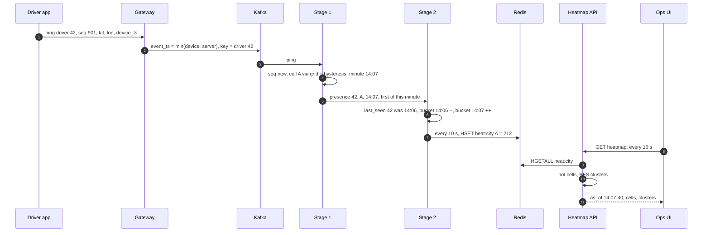

### Flow 2: hour H for the institutions (by H+30 min)

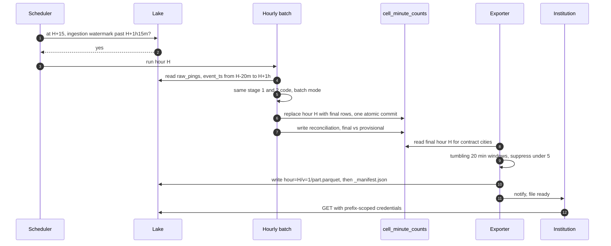

### Flow 3: stream job restarts (failure, no double count)

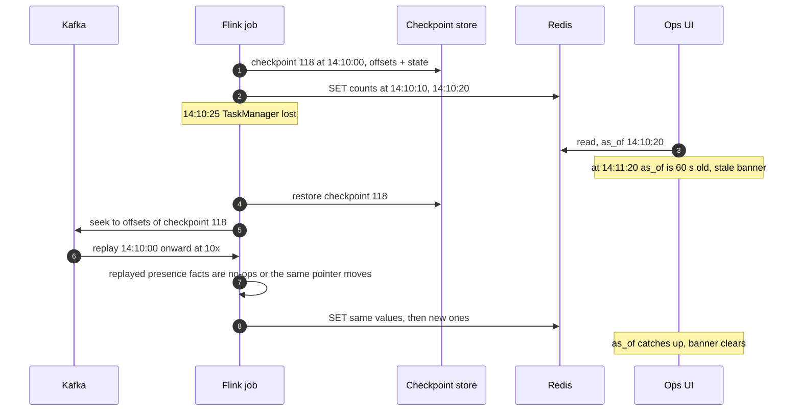

---

## 7. Trade-offs

| Decision | Option A | Option B | Chose | Why |
|---|---|---|---|---|
| Distinct count | Exact last-seen map per cell | HyperLogLog per cell per minute | A | ~500 MB exact vs ~36 GB dense HLL at this cardinality, and exact is exact. HLL only for cross-city, multi-day distinct |
| 20-minute window | `KeyedProcessFunction` with minute buckets | Flink sliding window 20 min / 10 s | A | Sliding copies each element into 120 windows. Buckets are O(1) update, O(20) read |
| Grid | Square 1 km grid in a city-local projection | H3 res 8 (0.737 km²) | A | Requirement says 1 km². H3 wins if "about 1 km²" is fine and other Uber systems already use H3 ids. The seam is one function |
| Kafka key | `driver_id` | `cell_id` | A | Per-driver order for dedup and hysteresis, no hot partition. Re-key by cell after the 5x reduction |
| Time | Event time, clamped to server time | Server receive time | A | Server time puts buffered tunnel pings in the wrong minute. Clamping removes the only danger of device time |
| Emission | 10 s processing-time timer, watermark only evicts | Emit on watermark per minute | A | Freshness ~23 s vs ~70 s |
| Institutions' numbers | Batch recompute from raw, same code, after cutoff | Copy what ops saw | A | Final, reproducible, includes late pings. Costs a second run of the same code, and a small documented difference from ops |
| Institution windows | Tumbling 20 min | Sliding every minute | A | Sliding lets a reader subtract windows and see one driver. Tumbling plus k=5 does not |
| Delivery | They pull from a prefix, we notify | We push to their systems | A | Their outage does not become our retry queue. One code path for 20 institutions |
| Live store | Redis hash per city | Pinot / Druid | A | 30 KB per city per read. OLAP is the seam if ad-hoc slicing is asked for |
| Refused to build | Prediction, demand side, per-driver views, sub-10 s refresh, real-time institution feed | | | Each is a new requirement. Name the seam, do not build it |

---

## 8. Staff-level notes

- **Failure modes and blast radius.** Stream job down: ops map stale (labelled), institutions unaffected, recovery ~3 min after restart. Redis down: ~15 s, refilled in 60 s. Bad phone clock: one phone, zero blast radius because of the clamp. Without the clamp: one phone blanks a city. Bad code release in stage 2: provisional wrong, reconciliation metric catches it within one hour, final unaffected until the batch runs the same bad code, so the batch pins a code version and upgrades one day after the stream (canary by time).
- **Migration.** Today ops probably counts from snapshots of the dispatch geo index (drivers per cell right now). (1) Run this pipeline in shadow and show both maps side by side for 2 weeks. (2) Switch the ops map, keep the old one a click away for a month. (3) Start institution exports only after 14 days of reconciliation under 1%. Rollback at every step is a UI flag or a paused export; nothing is destructive.
- **Operability.** SLOs: dashboard `as_of` age < 60 s in 99.9% of minutes; hour H published by H+30 in 99.5% of hours; reconciliation p99 < 1%. Page at 3am: `as_of` age > 3 min for 5 min in any tier-1 city; hour H not published by H+45; reconciliation > 2%. Ticket, not page: clock-skew rate by app version above 1%, Flink checkpoint duration > 20 s.
- **Cost.** Flink ~64 vCPU (~$2.5k/month), Redis primary plus replica (~$300/month), raw pings 3 TB plus counts 90 GB in the lake (~$100/month), hourly batch ~20 cores for 5 minutes per hour. Kafka is the shared location topic. Well under $10k/month. Cost is not the driver. Eng-time is: 2 engineers to build, a fraction of one to run.
- **Team boundaries.** The dispatch or location team owns the gateway and the topic, and must agree to stamp `server_ts` and clamp. This team owns stages 1 and 2, Redis, the counts table and the exporter. Legal and privacy own `k_min` and each contract. Ops owns the hot threshold. The counts table schema is the contract with analysts and institutions, so changing it is versioned.

---

## 9. What is expected at each level

**Mid (80/20).** Kafka, a stream processor, geohash or grid cells, Redis counters per cell, a dashboard. Probably sums per-minute counts and double counts parked drivers until asked. Hourly export is a cron job over Redis.

**Senior (60/40).** Counts distinct drivers with sets or HLL per minute and unions 20 of them. Mentions watermarks and allowed lateness. Batch job for institutions. Knows sliding windows are expensive. May not notice that the union still needs per-cell per-driver state or that one bad clock can move the watermark.

**Staff+ (40/60).** Pins the definition of "counted once" with the interviewer first, including the city total and boundary jitter. Does the memory math and rejects HLL. Uses last-seen state and minute buckets, not sliding windows. Clamps device time at the gateway and keeps the watermark off the freshness path. Separates provisional from final, runs the same code for both, publishes a reconciliation metric, and has a restatement contract. Tumbling windows plus k-anonymity for institutions and explains the subtraction attack. Names what was refused: OLAP store, HLL, prediction, real-time feed for institutions. Numbers: 150k pings/s, 30k presence/s, ~500 MB state, 23 s freshness, H+30.

---

## 10. Nitty-gritty (past interview scope)

### 10.1 Internals of each chosen technology

- **Flink keyed state.** Stage 2 uses `MapState<Long, Integer>` (driver to minute) and a `ValueState<int[21]>` for buckets on the RocksDB state backend. Each key group lives on one subtask. Incremental checkpoints upload only changed SST files. Timers are stored per key in state, so they survive restarts. See [`../../concepts/stream-processing.md`](../../concepts/stream-processing.md).
- **Watermarks.** Generated per Kafka partition inside the source, the operator's watermark is the minimum of its inputs. One slow partition holds everything back unless idleness is set.
- **Redis hash.** `heat:{city}` holds 1,500 fields of ~20 B: well under the listpack thresholds only for small cities, so large cities use a hashtable encoding (~100 KB). `HGETALL` on 1,500 fields is ~0.3 ms.
- **Lake table.** `cell_minute_counts` is a Delta or Iceberg table partitioned by `(city_id, date)`; the hourly job does an atomic `replaceWhere hour = H`. See [`../delta-lake-transactions/`](../delta-lake-transactions/).

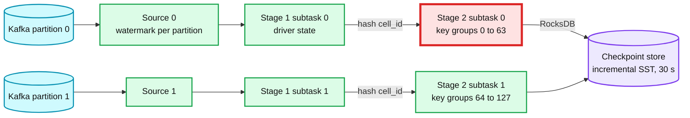

### 10.2 Configuration knobs that matter

| Component | Knob | Value | Why |
|---|---|---|---|
| Kafka | partitions of `driver-locations` | 64 | 22.5 MB/s peak is ~0.35 MB/s per partition, headroom for 10x and for parallelism |
| Kafka | retention | 3 days | Covers a weekend outage of the stream job; the lake has the rest |
| Flink | checkpoint interval | 30 s, exactly-once, incremental | Replay after failure ≤ 30 s of data. State ~500 MB so checkpoints take a few seconds |
| Flink | watermark | bounded out-of-orderness 10 s, idleness 1 min | Tolerance only affects eviction; small is fine |
| Flink | max parallelism | 512 key groups | Fixed at first start. Allows rescaling to 512 subtasks later |
| Stage 1 | hysteresis | 50 m inside, or 2 consecutive pings; ignore `accuracy_m > 100` | GPS error is typically 5 to 20 m in the open, worse near tall buildings |
| Gateway | clamp | `event_ts = min(device, server)`, drop to lake-only if older than 2 h | Removes future clocks; keeps buffered pings |
| Redis | `maxmemory-policy` | `noeviction`, TTL 10 min on `heat:*` | Small dataset. A dead city's key should expire, not be evicted randomly |
| Hourly job | cutoff | H+15 min, alert H+30, page H+45 | Measured p99.9 ingest delay is the input to this number |
| Exporter | `k_min` | 5 | Common small-cell suppression floor. Legal owns the number |

### 10.3 Capacity math per component

| Component | Load | Limit | Headroom |
|---|---|---|---|
| Kafka partition | 150k/s × 150 B / 64 = 0.35 MB/s | ~10 MB/s comfortable | 30x |
| Stage 1 subtask (16) | ~9.4k pings/s | ~50k/s for this work | 5x |
| Stage 2 subtask (16) | ~1.9k presence/s, ~30 MB state | 100k/s, GBs of RocksDB | 50x |
| Redis | 50 pipelines/s write, 100 reads/s | 100k ops/s | 1000x |
| Largest city hash | 1,500 fields, ~100 KB | n/a | n/a |
| Hourly batch | 1 h of raw ≈ 216 M pings ≈ 4 GB Parquet | 20 cores, ~5 min | fits |

Closest to a limit: nothing by throughput. The closest thing to a limit is the **hourly deadline** (H+15 cutoff + ~5 min compute + delivery vs H+30), because it depends on the lake ingestion lag we do not own.

### 10.4 Failure timeline

Stream job loses a TaskManager at 14:10:25 (Flow 3 above), second by second:
- 14:10:25 heartbeat missed. 14:10:35 JobManager declares it lost (10 s timeout).
- 14:10:40 new slots allocated, restore checkpoint 118 (14:10:00), ~20 s for 500 MB from object storage.
- 14:11:00 processing resumes from 14:10:00 offsets. 60 s of backlog at 10x takes ~6 s.
- 14:11:06 caught up. First fresh emit 14:11:10. `as_of` was at most ~50 s old, so the 60 s banner may never show.
- Data at risk: none. Duplicate risk: none (idempotent state and `SET`).

Hourly job misses the cutoff because lake ingestion is 40 minutes behind: H+15 gate fails, retry every 5 min, H+30 alert to the ingestion on-call, H+45 page to us, publish when complete. Institutions get it late, never incomplete.

### 10.5 Exactly-once and idempotency end to end

| Hop | Duplicates enter by | Removed by | Key | Lives for |
|---|---|---|---|---|
| App to gateway | Mobile retry | Stage 1 `seq` check | `(driver_id, seq)` | Last seq per driver, in state |
| Gateway to Kafka | Producer retry | Idempotent producer | producer id + sequence | Kafka |
| Kafka to Flink | Restart replay | Checkpointed offsets plus state | checkpoint id | 30 s interval |
| Stage 1 to stage 2 | Replay | Last-seen is monotonic, re-applying is a no-op | `(cell, driver)` | 20 min |
| Stage 2 to Redis | Replay | `SET` of absolute values | `(city, cell)` | n/a |
| Stage 2 to counts table | Replay | Upsert by `(cell, minute)` in the sink, or Delta `txn` marker | `(cell, minute)` | table |
| Batch to counts table | Re-run | Atomic replace of hour H | `hour` | table |
| Exporter to bucket | Re-run | Deterministic path, manifest last | `(contract, hour, v)` | forever |

### 10.6 Consistency model per edge

- App to Kafka: at-least-once. Per-driver order within a partition.
- Kafka to stage 2: exactly-once effect.
- Stage 2 to Redis to ops: **eventual, bounded** to ~23 s. Reads may mix cells from two consecutive emits; accepted.
- Stream to counts table: provisional, eventual.
- Batch to counts table: **strong per hour** (atomic swap). Final at H+15, restated at most once at D+1.
- Counts table to institutions: immutable files, versioned.

### 10.7 Alternatives rejected

| Alternative | Why it looked attractive | Why rejected |
|---|---|---|
| Redis `SADD` per cell per minute, union 20 sets on read | No stream processor | 20 set unions per cell per read x 1,500 cells x 100 reads/s. Late and duplicate handling pushed into Redis. No clean restart story |
| Redis HLL (`PFADD`, `PFCOUNT` over 20 keys) | Mergeable, fixed size | Bigger than exact at this cardinality, approximate, and still double counts across cells unless the definition is fixed |
| Pinot with `DISTINCTCOUNT` over the raw topic | One store for live and history | 150k rows/s into OLAP to answer a question about 150k cells. More cost and ops than a 2-stage job plus Redis |
| Snapshot of the dispatch geo index every minute | Already exists | Gives "drivers in cell now", not "in the last 20 minutes". Couples ops analytics to the dispatch hot path |
| Spark Structured Streaming micro-batch | Same engine as the batch job | Workable at 30 s triggers. Flink's per-key timers fit the last-seen pattern better. Either is defensible |
| Lambda with two codebases | Standard | Two implementations drift. One library run in two modes avoids it |

### 10.8 How the big companies do it

- **Uber** runs Kafka, Flink and Pinot as its real-time stack ([SIGMOD 2021](https://arxiv.org/abs/2104.00087)) and indexes space with H3 ([Uber blog](https://www.uber.com/blog/h3/)). Marketplace analytics on H3 cells is the real-world version of this problem.
- **Uber Movement** shared anonymised aggregates with cities, never per-trip data ([PRI, 2017](https://theworld.org/stories/2017/01/20/uber-making-ride-sharing-data-publicly-available-privacy-pandora-box)).
- **Mobility Data Specification** is how US cities require data from scooter and car-share operators ([OMF](https://github.com/openmobilityfoundation/mobility-data-specification)). Privacy advocates criticised its trip-level feeds, which is the argument for our aggregates-only contract.

### 10.9 Operational runbook

- **Dashboards (5 metrics):** `as_of` age per city, pings/s and presence/s, stage 2 state size and checkpoint duration, clock-skew rate by app version, reconciliation diff per city-hour.
- **Alerts:** see §8.
- **Rollout:** new stage logic runs as a shadow job writing to `heat_shadow:*`. Compare per-cell diffs for a day. Flip by config. The hourly job pins a code version and follows one day later.
- **Rollback:** switch Redis keys back to the old job's output. Re-run affected hours of the batch with the old version and publish `v=n+1`.

### 10.10 Security and abuse

- Pings are authenticated by the driver session at the gateway; a spoofed `driver_id` needs a stolen token.
- GPS spoofing apps (drivers faking location to farm surge areas): stage 1 drops pings implying speed > 200 km/h and flags drivers with repeated teleports. Counting a fake driver in a cell is a fraud problem owned elsewhere; we expose the flag.
- Institutions: per-prefix credentials, short-lived signed URLs if they pull over HTTPS, download audit log, contract lists cities. No raw data leaves.
- Ops API: SSO, per-city authorisation. Cell counts are not personal data; the trend of a single cell at 3am with 1 driver nearly is, so the ops UI also hides counts under 3 outside the ops role.

### 10.11 Evolution

- **Demand side.** Add `ride_requests` as a second stream with the same stage 2 keyed by cell. Emit `requests_20m / available_20m` as a pressure score. This is how the map becomes a surge input.
- **H3 instead of squares.** Swap the grid function. Cell ids change, so the counts table gets a `grid` column and both run side by side during migration.
- **GDPR delete of a driver.** Delete from `raw_pings` (30-day TTL already bounds it). Aggregates with k ≥ 5 are not personal data and stay.
- **Real-time feed for an institution.** Serve provisional numbers from the same Redis through a rate-limited API, clearly labelled provisional. The contract changes, not the pipeline.
- **Multi-region.** A city lives in one region. Region loss: the city's map is down until failover of the location stack; the hourly job re-runs from the lake replica.

---

## 11. Follow-up questions to expect

1. "What exactly is counted once?" → §1.1 table, [edge case: driver crosses 5 cells](edge-cases.md#edge-case-a-driver-drives-through-5-cells-in-20-minutes).
2. "Why not HyperLogLog?" → §2, §5.1, [deep dive](deep-dives/windowed-distinct-count.md).
3. "Why not a Flink sliding window?" → §5.1 row 2.
4. "A phone's clock is wrong" → §5.2, [edge case](edge-cases.md#edge-case-a-phone-clock-is-1-hour-ahead).
5. "Ops and the regulator disagree" → §5.3.
6. "Driver parked on a cell edge" → §5.1 row 3, [deep dive](deep-dives/grid-cells-and-clusters.md).
7. "Why 1 km² squares and not H3?" → §7, [deep dive](deep-dives/grid-cells-and-clusters.md).
8. "The job restarts, what does ops see?" → §6 Flow 3, §10.4.
9. "An institution wants per-driver data or 100 m cells" → §5.5, §5.3 privacy.
10. "Add rider demand" → §10.11.
