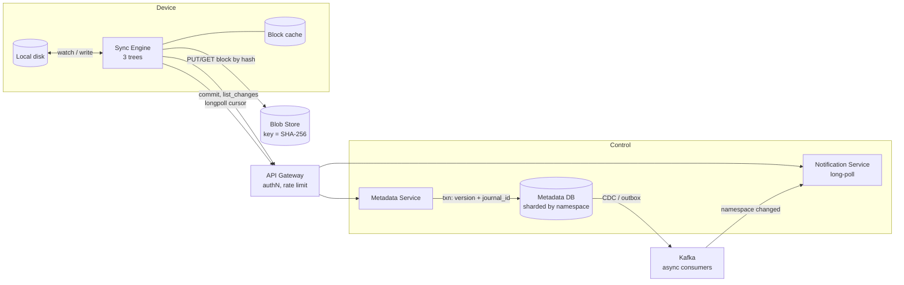
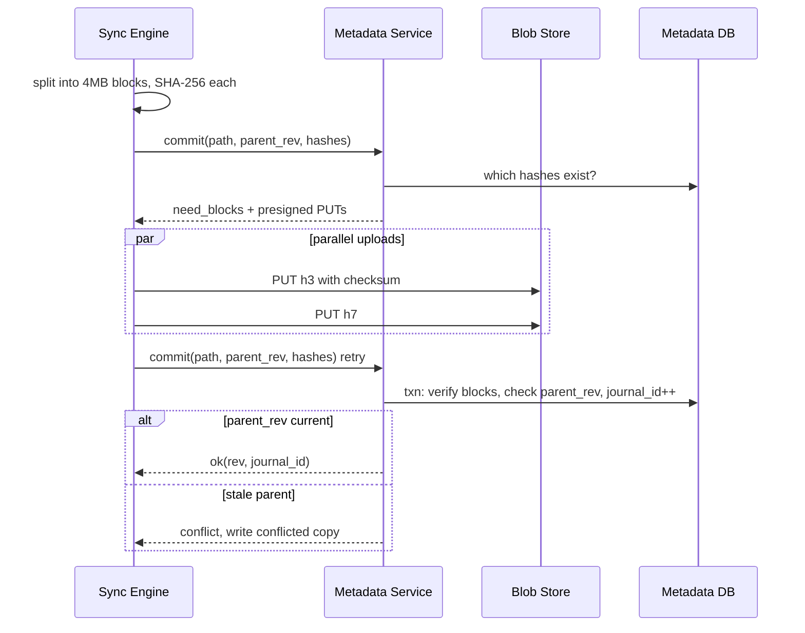
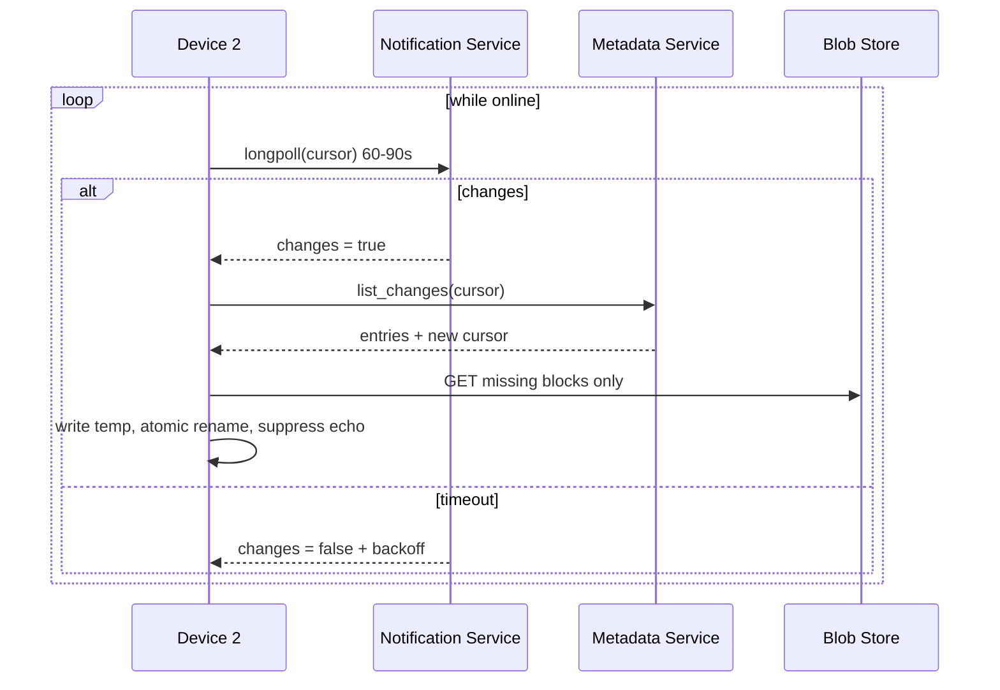

# Mock Interview — Dropbox HLD (Sep 2026)

As of 2026-09-18

## Session context

Round: design Dropbox — file hosting with cloud storage, sync across devices, and a client application.

- **Stated scale:** 100M daily active users, file sizes up to 50 GB.
- **Scope taken in the round:** personal (non-shared) files only; folder hierarchy, sharing, and file modification were each declared out of scope.
- **Transcript length:** ~2,800 words, roughly 20–25 minutes of speaking. Pauses and drawing time are not visible in the transcript.
- **Layout:** design as delivered first, verdict and feedback second.

## Transcript

As delivered, cleaned only of filler and transcription noise.

So we are going to design a Dropbox here, which is a file hosting service that offers the cloud storage with file synchronization and personal cloud and client software. So like the functional requirements here are user should be able to upload the file to the remote storage and download from the same and automatically sync across multiple devices.

So, there can be one of the things that the scale is 100 million daily active users and file sizes can be up to 50 GB as well. So, yes, I think in terms of the non-functional requirement, what I believe, first, in terms of non-functional requirement, availability is very, is important than consistency. Since I mean like the only reason is that it's okay to have some delay between uploaded data and syncing across multiple storages, but I think availability is a must. And yes, I think one of the other key constraint is that data, it should not be ideally corrupted, and if it is also, we should be able to identify it.

I think the third thing is I think we have already discussed about the scale. So apart from availability, consistency, what else we need? So data, so like durability is also one thing that we have already discussed. So latency, I think there is like sync of files may happen in, let's say, the download and automatically sync can happen with an SLA of sync of files, can happen with an SLA of less than one minute, also depending on the availability of the device.

So these are the non-functional requirements that I could think of. On to… is one of the other key item is that we should be able to resume from where we left in case of any failure. I think, yeah, so that will be with the fundamental, okay.

Then, so basically I think what are the core entities that I can think of here is that the files, files or folders. The files are the final entity. I think folder structure can also be required, but I think we can keep it out of scope right now. And chunks of files, because we mentioned that there is a large file, so we cannot. So it will be chunks of files and then users and related devices. So users is basically for authorization, and devices is to identify which devices has to be synced. So this is the personal one. Right now we are not implementing the group related changes. I think these are the key entities.

Yeah, API routes, I think. So first I think we should have a PUT for a create, where like create file, which will be having the file details like the name, size, something, like a path, etc. Type might also be required. So these are the few things. And within the body, we have the file details, but also we will have headers, which is basically contains the user ID for user authentication and authorization.

Response is initiated, which means that it is right now still in the created phase but did not upload it. So then it will be like created as the first stage. If at all we support the updates later, then it will be in the updated state as well. So once the create is there and the signed URL, so signed URL also will be like a map of the chunk ID and the signed URL. So basically on the client end itself we should be able to decide. So basically the chunk ID, so the chunks will be like a maybe I think we should do this like, do it like this.

So, what it actually says is that, okay, so you will have a chunk ID and then the size of the chunk, and then we have the offset from and to offset within the file so that we can clearly understand, and I think the signed URL as well. Once this is done, so we PUT update and POST. So POST will be like update, okay, like upload status maybe.

Status could be like for this file details, and it will also have a list of chunks if some chunks are done, or else it can be like it is both basically to support both. So the chunk ID is also supported, and then the CRC is also pasted so that the checksum can be checked at and the check the CRC is done. And then the status is the status also, let's say it's a success or a failure. So automatically we will take a note of it, and then we will say response as maybe the file details itself, the full size that has been uploaded, and also the list of chunks, or maybe the status of the request itself, which is success or failure, if at all it did not find the signed URL did not have the data.

Then comes the, so this is the upload status and then this one. So there is another, there are two other APIs that we need to do. So that is like GET all files or GET delta is one thing. So which is basically like headers will have the user ID, and within the GET delta, it is actually the delta is for the query will be like device ID and, let's say device ID, I think we can do that. And then we will say the response will be like list of files that has to be updated.

Then we have a GET download file, which will have the, which is from the previous response. And headers again contains the user ID for authorization and authentication, and the response is the list of chunks that you should be downloading and the order of it as well. So this is it.

I think maybe we can also create a /devices/, which will be based on the user ID, and so you will be having it from this. So yeah, you will be saying that what is the device type and device details and everything is there here. So I think these are the things for API, the APIs.

Yes, we will move on to the high level design. So basically the high level design, I think we will first start with the, so at the client end I think we will draw multiple things. So at the client end we will have user, so at the client end we will have the user. I think we should first of all has something on the client end itself, which is like the, let's say storage client, okay, where we register what are the files that has to be synced and all those things. The user will be interacting with this particular client and then say that like, files that have to be synced, etc.

And then post that it is the storage client that takes care of all of these details. And also the user will have its own, like their own, like in the operating system, let's say the hard disk. It will interact with it directly to check or upload the data. This is all in the device, so this is all in the device. So you will have a device here, and we will have the storage client, and also the hard disk is also part of that. And yeah, so the user interacts with the, or by checking the hard disk for the latest updates or latest files and all of these things, or writing to the file or reading from the hard disk. So this is the thing, and the storage client is basically, it will just register what are the files that have to be synced and all. So then basically what you will do is that we will have a…

Like we will have a API gateway that is fronting the API and the load balancer that will actually make sure that everything, authorization, authentication, happens and also is routed properly. So the storage client, let's say it will first make a call of whenever this whole thing. So it will first see if it has to be registered or not. Okay. So it will be first trying to see if it has to be, so it will indicate that this is the client. So there will be, let's say, a devices service which will take care of all the heartbeats and everything.

So basically we will have the devices service where the registration to the device actually happens. So the registration actually to the device happens, and then let's say we have a database of called devices, where devices, where we have device ID, like last heartbeat time, and like other details, whatever those details are. So we will, and also it is related to a user, right? So this particular, I think we should have the user ID also here. And I think, like we are assuming that there is a user's table, so which has the user ID already present. Is in. So this is the devices service.

Once the registration is done, then we go to the actual file generation service, file service maybe, or file storage service or something like that. So we will have a DB here. We can decide on what kind of a DB we will have to use based on the queries and the patterns that we have. So it will be like the files. So here we will, like we discussed, I think file ID when it is first time created. Then user ID, just to make sure that we have the authentication, authorization always present. And initiating device maybe. Is initiating device required? I think initiating device is just required for some kind of a, is for audit trail, not for this one. So user, I think in between, so this one user ID is already there. So initiating, I think file ID, user ID is there, and then the status is there.

And then we will have the chunks information, like is a list of chunk IDs we will have. And also we will have OCC version, which is very necessary. And even for the device also it is the same everywhere. Whatever we are doing, I think we should have the OCC version just to make sure that we are optimistically writing it in a consistent fashion using the optimistic concurrency control.

So, whenever the storage client makes a request to create a file, basically the storage client connects to the API Gateway. API Gateway forwards, and it will say that I want to create a file or store a file. Basically, create or store has come. So first time it will check if the file is already present or not. If not, then it will go and create it. So here what it will do is that it will also process what are the list of chunks that you need to do, and in a batch, basically in a batch write. So it will simply go ahead and create a set of chunk IDs. And also first, for every chunk ID, for every chunk ID we will, and we will have the chunk ID and S3 key. And we will have the signed URL with the expiry status, just in case if something has missed and for restarting it. So this is the thing.

And yeah, I believe what we can do, I think to see from where it is left to update, so we can have last uploaded chunk. So what this will do, expiry status of the signed URL, and then the status of the chunk is also required. So it will create these.

So, whenever there is a store request, it will create the files, it will create the chunks, it will decide what are the chunks. And then within the chunk it will create this S3 key, signed URL, save all of it, and offset, like start offset and like end offset, everything will be stored. The CRC at this particular point is actually empty right now. And then it will be updated later. And yes, the status and the last modified or last updated, I think there is no modification. So we will always have a created date only. Even if there is a modification, we will trash these chunks as like status inactive or garbage, and then so we will create a new one. So this way it will be easier to handle as well.

So yeah, for file storage, so you have the chunks, and then this was the, this is where the blob storage is, like the client directly connects to the blob storage S3. Let's say some kind of a blob storage. So whatever response that we have sent with the signed URL, the storage will call it. So the storage client will make a call to the blob storage and upload it. Once it has uploaded, it will make another call. It will make another call to actually register the upload. So update the upload status or something like that. So first store. First is store. So here what it does is it will also send along with the chunks and everything. Update upload.

So yeah, I think in this way the chunks are created. And so I think we should, like, okay, now comes the device. So this is a device one for the user, but let's say there is another device which is basically, let's say we have this as the laptop, and then we have the mobile here, the device here. So again the storage client will be present here, and then the same hard disk also will be present here. So the user here, let's say he doesn't write anything to the, so he doesn't write anything here. Like he just directly queries. He opens the storage client and then logs in with his user ID, and then the storage client requests for what all are the. So he just logs in the storage client, and then the storage client actually writes the data to the hard disk, and he directly looks into the hard disk.

So here, once the log actually happens, so it will connect to the file storage, and it will ask for basically the get files or sync files. Okay, get or get or sync, basically the files. So then what happens is that the file storage will go ahead and first check if the device ID is validated or not. Valid, is going to get the device details and see and validate if the devices are indeed of the user. And then once it is there, it will make a query with the user ID and see all the file IDs. So these are all the files that you need to sync here.

And then the storage client will say a, the storage client will say, download file x, download, get chunks for file download, get chunks. So something like that is already present, right? So get chunks is basically, we have this file storage with all the chunks, right? We call the file for the file ID, will get all the chunks here, and then it will respond back. So for each chunk it will get the S3 URL directly, the signed URL only for read now. The earlier signed URL is for write, and this time the signed URL is only for read. So this then the storage client will directly connect to the.

And make a request and fetch the individual chunks. So it will be on the client side only. We will ensure that for a particular file, all the chunks have been fetched or not. If not, we keep on, like, pulling it until the file option is done.

So we, if we want to see that there has been an update or there has been basically an edit of the file, then the storage client will actually talk to the OS to see if what a OS kernel it can ask and say, "What are the update? Give me updates on this particular folder." And then it will update. It will get that updates and then make a store, create, upload as the sequence is again. So that way it will actually be able to do that, do the updates for the new files.

And also the sync also, it is not like we will have any WebSocket or anything. Even the SLIs are very this one. So maybe we can do it every 30 seconds or something like that. And, like, you can also think that the file storage service may even save it in the DB depending on the number of files. But I think it is still okay. The file size might, like, even though there are, like, millions of files with, like, if at all we just need to. So that's why I think kind of cache will help.

Or else what we can do is that we can also improvise this by saying that we through Kafka or something. So we will have an updates processor. So basically what you can do is. So what we can do is that we will write the data to this updates Kafka for subscription. And then whenever there is a request, we can just query the Kafka as a consumer and say that for this particular shard, which can be on the user ID, what are the updates that happened? So it will understand that, okay, these are the files that have been changed for this particular user. And then it will see if the device has been synced or not, and, like, based on that it will say.

So basically the thing is what we can do is, like, every update, let's say there is an update sequence number here. Okay, so let's say we have. So basically the storage client will say that sync files after the last update sequence number X. So using that as the sequence number, then the file storage service can call this updates Kafka for this particular device. This is the update sequence number. Give me what are all the changes that have been done. So that it can compress is there, transitively it will be able to identify how the final changes are, and then it will go ahead and write, like, go ahead and respond back immediately, easily.

So that way I think iterator. So if we want to see, if we want to store it at our end, I think it is fine. I think as far as I feel, like, if the storage client also has a local disk, so you can have that cache. And if the cache is also, if the cache has been cleared, right, then we can see based on the hard disk, the actual hard disk for this particular device, we will say that, okay, these are all the files. This is the latest update, last modified date and all. And the storage client can make sure that in an idempotent way, what is the last modified.

So right now, because modified and this one are out of scope, I think this is where we can end it. Apart from this, I think, is there anything else?

Well, first, at the client's end, at the user's end, within the device, there will be a storage client. Let's say that is the thin client from our particular service.

## Design as presented

The shape delivered was: chunked upload through presigned URLs straight to blob storage, with a metadata service owning file and chunk rows, and pull-based sync.

**Requirements**

- Functional: upload, download, automatic sync across a user's devices.
- Non-functional: availability over consistency; durability; corruption must be detectable; sync SLA under 1 minute; resume after failure.
- Out of scope: folders, sharing, file modification.

**Entities:** file, chunk, user, device.

**APIs**

| Call | Request | Response |
| --- | --- | --- |
| `PUT /files` (create) | name, size, path, type; user ID in header | state `initiated`; map of chunk ID → presigned URL, size, start/end offset |
| `POST /files/{id}/status` | chunk IDs, CRC per chunk, success or failure | file details, uploaded size, chunk list |
| `GET /delta` | device ID; user ID in header | list of files to update |
| `GET /files/{id}/download` | file ID; user ID in header | ordered chunk list with read-only presigned URLs |
| `/devices` | user ID, device type and details | registration |

**Components:** storage client on each device (plus local disk), API gateway and load balancer, devices service with a devices table (device ID, user ID, last heartbeat), file storage service with a files table (file ID, user ID, status, chunk IDs, OCC version) and a chunks table (chunk ID, S3 key, presigned URL and expiry, start/end offset, CRC, status, last uploaded chunk pointer), and blob storage.

**Flows**

- *Upload:* create file → server computes chunks and writes chunk rows with keys and presigned URLs → client PUTs chunks to blob storage → client posts upload status with CRCs.
- *Download:* client asks for files by user ID after device validation → per-file chunk list with read presigned URLs → client fetches chunks and retries until complete.
- *Change detection:* storage client asks the OS for changes on the watched folder, then repeats the create-and-upload sequence.
- *Sync:* polling roughly every 30s; later revised to an update sequence number per user, with the file storage service consuming a Kafka updates topic sharded by user ID to compute the changes after a client's cursor.
- *Modification:* old chunks marked inactive or garbage and new chunks created rather than edited in place.

## Target design

The same skeleton holds; three changes make it Staff level: blocks named by content hash, a two-step commit, and a journal cursor with long-poll instead of 30s polling.

What to notice:

- Kafka carries async side effects (search, thumbnails, GC) and wakes the notification service. It is never queried to answer a sync request.
- The journal in the metadata DB is the source of truth and of cursors.
- Blocks are content-addressed, so identical blocks are stored once and only changed blocks move.
- The notification service says only "something changed"; the client then pulls with its cursor.

### Upload and commit

What to notice:

- Commit is idempotent, so resuming an interrupted upload is the same call again.
- A one-byte edit to a 50 GB file uploads one block.
- The blob store verifies the checksum on write; the metadata service verifies block existence at commit. The client's CRC is never trusted.
- The `parent_rev` comparison is where the OCC version does real work.

### Sync to another device

What to notice:

- An idle client costs one held connection instead of two requests a minute.
- A device offline for days resumes from its cursor with no special case.
- Temp file plus rename means the user never sees a partial file.
- The backoff hint lets the server avoid a thundering herd after an outage.

## Verdict

**Hire at Senior. Not yet Staff.** Judged against what fits in 45 minutes, not against the full gap list below.

**What worked**

- Control plane and data plane separated: the client talks to blob storage directly through presigned URLs.
- Resumability, integrity and durability raised unprompted as requirements.
- Per-chunk state, OCC versions, and separate write and read presigned URLs.
- Improved the design mid-round without being pushed: 30s polling → an update log with a sequence-number cursor.

**What held it below the bar**

- No quantitative reasoning anywhere. Numbers should drive the choices, and none were given.
- Conflicts and edits declared out of scope, though handling them is what sync means.
- One design that does not work: Kafka queried per user from a request path.
- Consistency treated as one global choice rather than split between metadata and propagation.
- Time spent walking through components on the happy path instead of arguing trade-offs.

**Time was not the constraint.** Of the eight things expected within 45 minutes, only one was plausibly cut for time. The rest were choices: a consistency split takes one sentence, capacity numbers take two minutes, and naming the hard problems takes one sentence. The round also ended with "is there anything else?", which suggests unused time.

## Gaps, ranked by severity

| # | Gap | As presented | Staff-level answer |
| --- | --- | --- | --- |
| 1 | Conflicts and edits | Out of scope | Client sends `parent_rev`; mismatch keeps both as a conflicted copy; deletes are tombstones |
| 2 | Chunking model | Server picks offsets, stores keys and URLs | Client splits into fixed 4 MB blocks named by SHA-256, giving dedup, delta upload and resume |
| 3 | Commit protocol | Per-chunk status with a client CRC | `commit(hashes)` returns missing blocks; upload those; second commit is atomic and server-verified |
| 4 | Change propagation | Query Kafka per user after sequence X | Per-namespace `journal_id` in the metadata DB, plus long-poll to signal that a fetch is due |
| 5 | Polling cost | Every 30s | 100M DAU × ~3 devices ÷ 30s ≈ **10M QPS** of mostly empty calls; the number rules polling out |
| 6 | Consistency | "Availability over consistency" globally | Strong within a namespace for metadata; eventual for blob replication and propagation |
| 7 | Data model | Chunk list on the file row | 50 GB ÷ 4 MB ≈ 12,800 blocks; split into `file_versions`, `version_blocks`, `blocks(hash, refcount)` |
| 8 | Presigned URLs in DB | Stored with expiry | Derivable and short-lived; generate on demand |
| 9 | Resume pointer | "Last uploaded chunk" | Parallel uploads make "last" meaningless; use the missing-hash set |
| 10 | Client sync engine | Watcher re-triggers upload | Three trees for a merge base, echo suppression, and periodic rescan since watchers drop events |
| 11 | API security | `user_id` in a request header | Identity from the auth token; a client-supplied user ID is spoofable |
| 12 | Device service | Validated per sync call, heartbeats | `device_id` in the token; presence from the long-poll connection |
| 13 | Not mentioned | — | Block GC with refcounts, abandoned-upload cleanup, quotas, backoff with jitter, scrubbing, erasure coding, encryption, rate limits |

**Reference points from Dropbox's public engineering writing:** 4 MB blocks keyed by SHA-256, a per-namespace Server File Journal holding the cursor, longpoll-based change notification, the Nucleus sync engine with its three-tree model, and Magic Pocket for erasure-coded block storage. Anything beyond what those posts describe is inferred.

## Fitting it in 45 minutes

Not all of the above belongs in one round. A 60-minute slot leaves about 45 minutes of design, and the skill is choosing where they go.

| Minutes | Phase | Cover | Skip |
| --- | --- | --- | --- |
| 0–5 | Requirements | Functional list, consistency split, durability and integrity | Discussing each non-functional requirement at length |
| 5–8 | Numbers | ~300M clients, 10M QPS if polling, ~200 TB/day pre-dedup | Detailed storage math |
| 8–12 | Entities and API | `commit`, `list_changes`, `longpoll` | Every field, the devices API |
| 12–22 | High-level design | One diagram: sync engine, gateway, metadata service and DB, blob store, notifications | Kafka and async workers beyond one line |
| 22–40 | Two deep dives | Content-hashed blocks with the commit protocol; journal cursor, long-poll and conflicts | Three-tree client internals, erasure coding |
| 40–45 | Wrap | Failure modes, scaling, what you would do next | — |

**Where the 13 gaps go**

- *Build into the main design, no extra time:* content-addressed blocks, commit protocol, journal cursor with long-poll, `parent_rev` conflicts, token-based identity, no stored presigned URLs.
- *One sentence each:* echo suppression, rescan fallback, block GC, backoff with jitter, erasure coding, scrubbing, quotas.
- *Only if asked:* three-tree sync engine, folder renames, shared-folder fan-out, Dropbox-specific systems.

Fitting this mostly means cutting the happy-path walkthrough from roughly 70% of the round to about 10 minutes.

## Next round

Three habit changes would likely move this same design up a level.

- [ ] Put 2–3 numbers on the board in the first 8 minutes and let one of them kill a design, e.g. "10M QPS of empty polls, so long-poll".
- [ ] Before drawing, say which two problems are the hard ones and commit to going deep on them.
- [ ] Cut the happy-path walkthrough to ~10 minutes and spend the rest on those two, rather than finishing early.

**Questions to be ready for**

1. A user renames a folder holding 1M files. What goes in the journal, and what do other devices receive?
2. Two devices edit the same file offline and reconnect together. Walk it through byte by byte.
3. How do you garbage-collect a block safely when an in-flight commit may reference it?
4. A shared folder has 10k members. Where does fan-out happen, and what does it do to namespace sharding?
5. How do you detect silent corruption in cold blocks, and what is the repair SLA?
