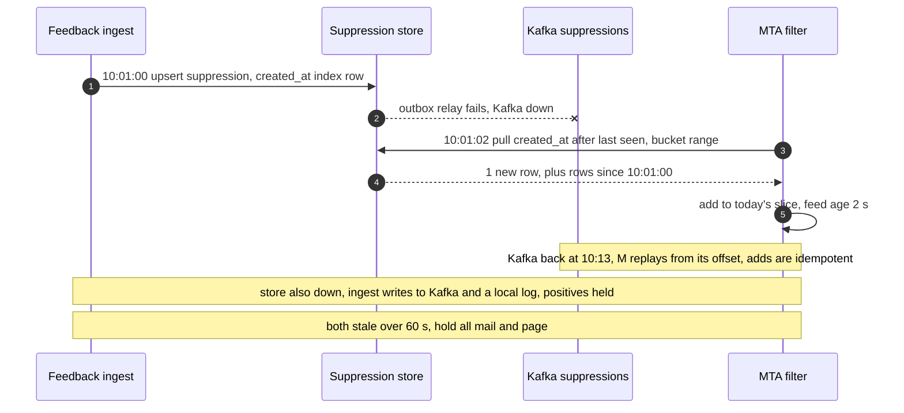

# Deep dive: bounces, complaints and suppression

> One-line answer: every signal that a person cannot or will not take our mail (a `5xx` at RCPT, a DSN (delivery status notification) days later, an ARF (Abuse Reporting Format) complaint, a one-click unsubscribe POST) is mapped back to its message by the signed id in the VERP (variable envelope return path) address or our headers, written as a suppression keyed by (account, email hash) in a strongly consistent store, and pushed to every checker; the last check is a Bloom filter in each MTA (mail transfer agent) just before SMTP (Simple Mail Transfer Protocol). That filter must rotate, because a Bloom filter cannot delete, and it needs two independent feeds, so that neither a Kafka outage nor a store outage forces ~100k remote reads a second or stops mail.

Zoom-in on [`../solution.md`](../solution.md) §4.4 (the loop), §5.4 (the 10:01 unsubscribe), §8 (degraded modes) and §10.5. Reusable blocks: [`../../../concepts/bloom-filter.md`](../../../concepts/bloom-filter.md), [`../../../concepts/exactly-once.md`](../../../concepts/exactly-once.md), [`../../../concepts/stream-processing.md`](../../../concepts/stream-processing.md), [`../../../concepts/caching-patterns.md`](../../../concepts/caching-patterns.md). Siblings: [`reputation-and-ip-pools.md`](reputation-and-ip-pools.md) (what complaints do to reputation), [`delivery-semantics-and-mta-failures.md`](delivery-semantics-and-mta-failures.md).

Other acronyms: FBL (feedback loop), CFL (Yahoo Complaint Feedback Loop), JMRP (Microsoft Junk Mail Reporting Program), HMAC (hash-based message authentication code), KMS (key management service), GDPR (EU General Data Protection Regulation), MPP (Apple Mail Privacy Protection).

---

## 1. Four inputs, one suppression

```mermaid
%% Every negative signal becomes one suppression row, then reaches every checker by two independent feeds. Arrows carry what flows.
flowchart LR
    MTA[MTA reply classifier] -->|"550 5.1.1 at RCPT"| SW[Suppression writer]
    DSN[DSN to bounce+id<br/>at em.shop.com] -->|"parsed, VERP decoded"| FI[Feedback ingest<br/>HMAC check]
    ARF[ARF from Yahoo CFL,<br/>Microsoft JMRP] -->|"our id from headers"| FI
    POST[One-click POST /u/token] -->|"RFC 8058 body"| FI
    FI -->|"event: bounced, complained, unsubscribed"| SW
    SW -->|"upsert plus outbox, one write"| SUP[(Suppression store<br/>account, bucket, email hash)]
    SUP -->|"outbox relay, push, p99 ~2 s"| K[[Kafka suppressions]]
    SUP -->|"created-since index, pull every 2 s"| PULL[Delta poller in each checker]
    K -->|"primary feed"| CHK[Render delta set and<br/>MTA Bloom filter]
    PULL -->|"second feed"| CHK
    CHK -->|"positives only, ~150/s"| SUP

    class MTA,SW,FI,PULL,CHK service
    class DSN,ARF,POST external
    class SUP store
    class K queue

    classDef service  fill:#dcfce7,stroke:#16a34a,stroke-width:2px,color:#111
    classDef store    fill:#ede9fe,stroke:#7c3aed,stroke-width:2px,color:#111
    classDef queue    fill:#cffafe,stroke:#0891b2,stroke-width:2px,color:#111
    classDef external fill:#e5e7eb,stroke:#6b7280,stroke-width:2px,color:#111,stroke-dasharray:4 3
```



## 2. Bounces: classify before you suppress

| Reply or DSN status | Meaning | Action |
|---|---|---|
| `550 5.1.1` "The email account that you tried to reach does not exist" | No such user | Hard bounce, account-wide suppression |
| `553 5.1.2` or a null MX | No such domain | Hard bounce |
| `552 5.2.2` mailbox full | The person exists | Soft. Suppress only after 3 in 30 days [estimate] |
| `550 5.7.1` reputation or policy block | About **us**, not the recipient | Never suppress the address. Pause the key (throttling dive) |
| `550 5.7.26` or `5.7.515` authentication | Our signing or DNS is broken | Page platform on-call. Never suppress |
| `4xx` | Try again | Retry schedule, no suppression |

- **A 5.7.x is never a hard bounce.** Treating a reputation block as "address invalid" would suppress millions of good Gmail addresses in an hour.
- **A false 5.1.1 storm.** A receiver incident can answer "no such user" for real users. Guard: if one provider's 5.1.1 rate across all accounts runs over 5x its 7-day baseline for 10 minutes [estimate], new 5.1.1s from it become `quarantined` (retried in 24 h) instead of suppressions, and the deliverability on-call is paged. One customer's bad list moves its own rate, never the platform's.
- **Asynchronous bounces.** The receiver accepted, then failed later and sent a DSN to the envelope sender. The envelope sender, the only return path we use, is `bounce+<message_id>@em.<customer domain>`, for example `em.shop.com`. That host is a CNAME (canonical name) to our bounce host, verified with the domain, so the DSN lands in our MX and SPF is checked on the customer's own subdomain.

## 3. Complaints and the one-click POST

- **Yahoo CFL** sends per-message ARF reports for enrolled DKIM domains ([Yahoo FAQ](https://senders.yahooinc.com/faqs/)). We map each one to a message by our id in the original headers, emit `complained`, and write an account-wide suppression. Microsoft JMRP is similar [details of its redaction unverified].
- **Gmail** sends none per message. Its FBL is an aggregate per `Feedback-ID` identifier, "FBL data will only pertain to @gmail.com recipients", and "For a given day's traffic, FBL reports are generated only if a given Identifier is present in a certain volume of mails as well as in distinct user spam reports" ([Google FBL](https://support.google.com/mail/answer/6254652)). It is a reputation input, not a suppression source.
- **One-click unsubscribe (RFC 8058).** The POST "MUST NOT include cookies, HTTP authorization, or any other context information", the sender "MUST NOT return an HTTPS redirect", and the URI "SHOULD contain an opaque identifier or another hard-to-forge component" ([RFC 8058](https://www.rfc-editor.org/rfc/rfc8058.txt)). Ours is `(account, audience, contact, campaign)` plus an HMAC, keys kept 1 year.
- **The headers we send.** `List-Unsubscribe: <https://u.<link domain>/u/TOKEN>` and `List-Unsubscribe-Post: List-Unsubscribe=One-Click`, both inside the DKIM signature, since RFC 8058 requires the signature to cover them. The link domain is the account's branded one where it exists, so the unsubscribe host is not a shared URL domain either.
- **Scope.** An unsubscribe is scoped to the audience the message came from (the customer may run two lists); a hard bounce and a complaint are account-wide. The filter key is `(account, email_hash)` for both, so an audience-scoped row costs a confirm read for the account's other lists and never a wrong drop: the confirm read checks the scope.
- **GET never unsubscribes.** RFC 8058 notes how easy it already is to provoke GETs "due to spam filter auto-fetches". `GET /u/{token}` shows a preference page; only the POST acts.
- **Late mail goes to spam anyway.** Gmail tells its users: "If someone sends an email after you unsubscribe, their emails go directly to Spam" ([Gmail help](https://support.google.com/mail/answer/1366858)). A send after an unsubscribe is not only a compliance miss, it is a spam-folder placement that counts against the sender.

## 4. The suppression store

- **Key.** Partition `(account_id, bucket = email_hash mod 64)`, clustering `email_hash`, value `(scope, reason, created_at, lifted_at, source_message_id)`. The hash is an HMAC under a KMS-held key.
- **That key can never rotate.** Rehashing needs the plaintext emails, which the store deliberately does not keep. Treat it like a root key: in KMS, used only inside the writer and the checkers, rotation means a dual-write period while contacts are re-seen, which takes months.
- **Re-subscribe.** A person who unsubscribed and signs up again through double opt-in gets `lifted_at` set, not a delete, so a replayed old unsubscribe cannot win: the row keeps the latest of `created_at` and `lifted_at`. The Bloom filter still says "maybe" for her; the confirm read sees `lifted_at` and sends.
- **GDPR erasure.** Delete the contact and its events; keep the hashed suppression so she stays opted out.
- **Size.** ~24 M new suppressions a day is ~8.8 B rows a year, ~560 GB a year at 64 B, ~1.7 TB after three years. Still one ordinary KV (key-value) cluster. Only the MTA filter is bounded (5 days), so it does not grow with the store.

## 5. Three checks, and a filter that must rotate

1. **Snapshot** excludes everyone suppressed before `snapshot_at` (anti-join, 64 buckets per account).
2. **Render** skips anyone in the stream's suppressions since `snapshot_at`.
3. **Pre-SMTP** in the MTA: a Bloom filter of the last 5 days, because a deferred message can sit in a spool for 4. A positive is confirmed against the store; at the design's ~0.65% false positives that is ~150 reads/s on average.

A Bloom filter cannot delete. "The last 5 days" therefore means six daily slices, dropping the oldest at midnight, and a query checks every slice. The first sizing was one 144 MB filter at 9.6 bits per entry; six slices sized like that have six chances to lie, which is why the design uses ~14 bits per entry.

```python
# The pre-SMTP suppression filter: 5 days of suppressions, no deletes, so it must rotate.
# Scaled 1:1000 (24k suppressions/day instead of 24 M); false-positive rates do not change with scale.
import hashlib, math, random

class Bloom:
    def __init__(self, n, bits_per_entry):
        self.m = int(n * bits_per_entry)
        self.k = max(1, round(bits_per_entry * math.log(2)))
        self.bits = bytearray((self.m + 7) // 8)
    def _idx(self, key):
        h = hashlib.blake2b(key.encode(), digest_size=16).digest()
        a, b = int.from_bytes(h[:8], "big"), int.from_bytes(h[8:], "big")
        return ((a + i * b) % self.m for i in range(self.k))   # double hashing
    def add(self, key):
        for i in self._idx(key):
            self.bits[i >> 3] |= 1 << (i & 7)
    def __contains__(self, key):
        return all(self.bits[i >> 3] >> (i & 7) & 1 for i in self._idx(key))

rng = random.Random(5)
PER_DAY, DAYS, PROBES = 24_000, 6, 100_000
days = [[f"acct{rng.randrange(10**6)}:{rng.getrandbits(64):x}" for _ in range(PER_DAY)]
        for _ in range(DAYS)]
probes = [f"acct{rng.randrange(10**6)}:{rng.getrandbits(64):x}:clean" for _ in range(PROBES)]

def fp(filters):
    return sum(any(p in f for f in filters) for p in probes) / PROBES

one = Bloom(PER_DAY * 5, 9.6)                       # the first sizing: one filter, no rotation
for d in days[:5]:
    for k in d: one.add(k)
print(f"1) One filter, 120k entries, 9.6 bits each: FP {fp([one]):.2%}, "
      f"{one.m / 8 / 1e3:.0f} KB here, {one.m / 8 / 1e3:.0f} MB at full scale")

for bpe in (9.6, 14.4):
    slices = []
    for d in days:                                   # 6 daily slices, drop the oldest at midnight
        b = Bloom(PER_DAY, bpe)
        for k in d: b.add(k)
        slices.append(b)
    size = sum(s.m for s in slices) / 8 / 1e3
    print(f"2) Six daily slices at {bpe} bits/entry: FP {fp(slices):.2%}, "
          f"{size:.0f} KB here, {size:.0f} MB at full scale")

print("\n3) Remote reads per second the MTAs send to the suppression store")
for fp_rate in (0.0065, 0.06):
    print(f"   filter FP {fp_rate:.2%}: avg {23_000 * fp_rate:,.0f}/s, egress peak {100_000 * fp_rate:,.0f}/s")
print("   Kafka down, confirm every message (rejected): 100,000/s at the egress peak")
hosts, poll_s = 200 + 100, 2                         # MTA hosts + render processes
print(f"   Kafka down, pull the store's 'created since' index every {poll_s} s: "
      f"{hosts / poll_s:.0f} range reads/s, ~{3_000 * poll_s:,} rows each at the 3k/s peak")
```

Output:

```
1) One filter, 120k entries, 9.6 bits each: FP 0.98%, 144 KB here, 144 MB at full scale
2) Six daily slices at 9.6 bits/entry: FP 5.89%, 173 KB here, 173 MB at full scale
2) Six daily slices at 14.4 bits/entry: FP 0.65%, 259 KB here, 259 MB at full scale

3) Remote reads per second the MTAs send to the suppression store
   filter FP 0.65%: avg 150/s, egress peak 650/s
   filter FP 6.00%: avg 1,380/s, egress peak 6,000/s
   Kafka down, confirm every message (rejected): 100,000/s at the egress peak
   Kafka down, pull the store's 'created since' index every 2 s: 150 range reads/s, ~6,000 rows each at the 3k/s peak
```

What it shows:
- **Rotation sized naively is 6x worse.** Six slices at 9.6 bits each give ~5.9% false positives, ~1,380 confirm reads/s. At ~14 bits per entry (the design: ~259 MB per host at full scale, 0.65% measured) it is ~150/s. The alternative is to rebuild one filter nightly from the store and ship it.
- **The degraded mode does not need 100k reads/s.** The first Kafka-down plan was to confirm every message against the suppression store once the feed was 60 s stale, which needs a store sized for ~100k reads/s for a rare event. The design pulls the same suppressions from the store's `created_at` index instead: ~150 range reads/s across the fleet. The filter stays fresh and only its positives go remote.

## 6. Degraded modes, done with two feeds



| Down | Unsubscribe still recorded? | Checkers fresh? | Mail |
|---|---|---|---|
| Kafka | Yes, store write before the 200 | Yes, by pull (~150 reads/s) | Flows |
| Suppression store | Yes, ingest writes Kafka and a local log, replayed later | Yes, by Kafka | Flows; filter positives (~0.65%) held |
| Both | Ingest answers `503`, the provider retries the POST | No | Held after 60 s, page |

## 7. What an interviewer pushes on

1. **"Read the store before every send."** ~23k/s average, ~100k/s at peak, and the store's outage becomes a mail outage. The filter answers ~99% locally.
2. **"Your filter has false positives."** They cost a confirm read, never a missed send. False negatives cannot happen for anything inside the filter's window.
3. **"What escapes?"** A message already inside an SMTP transaction during the ~5 s propagation. Honest residual.
4. **"A 5.7.1 from Gmail on 1 M addresses."** Not a bounce. It is a reputation block; suppressing would delete a good list.
5. **"Legal says 10 business days."** CAN-SPAM does; Google's FAQ lists "Unsubscribe requests aren't honored within 48 hours" as non-compliance and Yahoo says "Honor unsubscribes within 2 days" ([Yahoo](https://senders.yahooinc.com/best-practices/)). Our SLO is 60 s because complaints come from mail sent after an unsubscribe.

## 8. Trade-offs

| Decision | Chose | Gave up |
|---|---|---|
| Last check | Bloom filter in each MTA | ~250 MB per host, a confirm read per positive |
| Window | 5 days, daily slices | More bits per entry than one static filter |
| Feeds | Kafka push plus store pull | A time-ordered index on the store |
| Key | HMAC of the email | A key that can never rotate cheaply |
| 5.7.x replies | Never suppress | A real policy block on one address keeps retrying until expiry |
| 5.1.1 storm guard | Quarantine above 5x baseline | Real bad addresses wait 24 h longer during an incident |

## 9. Numbers to say out loud

- ~24 M suppressions a day (~280/s, ~3k/s after a round hour), ~8.8 B rows a year.
- POST to every filter: p99 ~5 s, SLO 60 s. Google 48 h, Yahoo 2 days, CAN-SPAM 10 business days.
- One filter: 120 M entries, 9.6 bits, 144 MB, 1%. Six slices at 9.6 bits: 5.9%. At ~14 bits: 0.65%, ~259 MB per host.
- Confirm reads ~150/s. Kafka down by pull: ~150 range reads/s, not 100k point reads/s.
