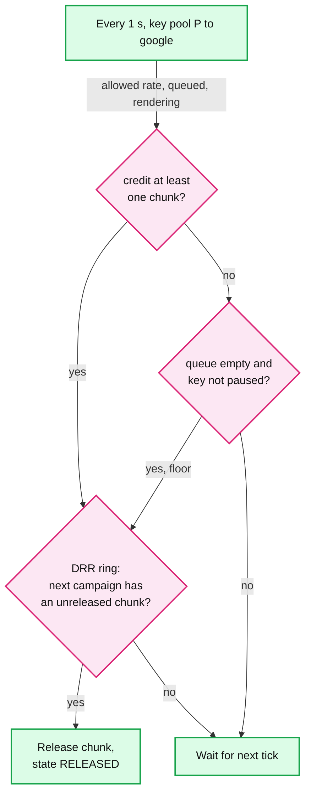

# Deep dive: campaign fan-out and scheduling

> One-line answer: a send is four stages that run at very different speeds (snapshot in seconds, render at ~50k/s, delivery at whatever each receiver accepts), so a dispatcher between them releases provider-chunks only within credit (each key's allowed rate × 10 minutes, minus what is already rendered or queued), keeps the backlog as 500 B snapshot rows instead of 50 KB rendered messages, gives every campaign a 500-recipient chunk 0 at `send_at`, and shares each (pool, provider) pipe across campaigns by DRR (deficit round robin). The "~2 h for 20 M" is the measured Gmail rate of one pool, not a constant: at half the planned per-IP rate it is 3.7 h, and the answer is a live ETA (estimated time of arrival) and capacity planned from measurements, never cold IPs on the day.

Zoom-in on [`../solution.md`](../solution.md) §2 (the 20 M table), §4.1, §5.1 (dispatcher and Black Friday) and §6 Flow 1 and Flow 6. Reusable blocks: [`../../../concepts/fan-out-fan-in.md`](../../../concepts/fan-out-fan-in.md), [`../../../concepts/rate-limiting-and-load-shedding.md`](../../../concepts/rate-limiting-and-load-shedding.md), [`../../../concepts/leases-fencing-clocks.md`](../../../concepts/leases-fencing-clocks.md). Related: [`../../distributed-job-scheduler/`](../../distributed-job-scheduler/), [`../../credit-score-alerts/`](../../credit-score-alerts/). Siblings: [`per-domain-throttling.md`](per-domain-throttling.md) (where each key's rate comes from), [`delivery-semantics-and-mta-failures.md`](delivery-semantics-and-mta-failures.md).

Other acronyms: MTA (mail transfer agent), MX (mail exchanger record), IP (sending address), DST (daylight saving time), STO (send-time optimization).

---

## 1. Four stages, four speeds

```mermaid
%% The send pipeline for the 20 M campaign. The dispatcher is the valve between cheap rows and expensive rendered mail. Gmail's acceptance for pool P is red: it sets the pace of everything upstream.
flowchart LR
    SCH[Scheduler<br/>due index, every 5 s] -->|"T minus 10 min, 20 M rows"| SNAP[(Snapshot store<br/>2,000 chunks per provider,<br/>500 B a row)]
    SNAP -->|"provider-chunks, 10k"| DSP[Dispatcher<br/>credit per pool and provider,<br/>DRR across campaigns]
    QS[Quota service] -->|"allowed rate per key"| DSP
    DSP -->|"released within credit"| RW[Render workers<br/>~50k/s for one campaign]
    RW -->|"50 KB each, batches of 500"| MQ[MTA queues, pool P<br/>at most 10 min of drain]
    MQ -->|"1,200/s to Google"| GM[Gmail acceptance<br/>20 IPs x ~60/s]
    MQ -->|"~3,600/s combined"| OT[Microsoft, Yahoo,<br/>Apple, long tail]
    MQ -.->|"queued count, every 1 s"| DSP

    class SCH,DSP,RW,QS service
    class SNAP store
    class MQ queue
    class GM critical
    class OT external

    classDef service  fill:#dcfce7,stroke:#16a34a,stroke-width:2px,color:#111
    classDef store    fill:#ede9fe,stroke:#7c3aed,stroke-width:2px,color:#111
    classDef queue    fill:#cffafe,stroke:#0891b2,stroke-width:2px,color:#111
    classDef critical fill:#fee2e2,stroke:#dc2626,stroke-width:4px,color:#111
    classDef external fill:#e5e7eb,stroke:#6b7280,stroke-width:2px,color:#111,stroke-dasharray:4 3
```



| Stage | Speed | Unit of work | If it crashes |
|---|---|---|---|
| Snapshot | ~500k rows/s [estimate]: 20 M in ~40 s | Chunk file `(campaign, provider, chunk_no)` | Re-run; same path overwritten |
| Dispatcher | ~1 decision per chunk | Credit per (pool, provider) | State rebuilt from `SEND_CHUNK` rows + 1 s of MTA reports |
| Render | ~3 ms per message (merge plus two DKIM signatures), ~330/s per core, ~600 cores at the 200k/s peak | Batch of 500 | Lease expires in 30 s, next owner resumes at the checkpoint |
| Delivery | 1,200/s to Google for pool P | One SMTP transaction | Spool journal, see the delivery dive |

The stages are decoupled on purpose. "Decide what to send" must be cheap to redo. "Deliver it" takes hours and must survive crashes on disk. Everything between them is a valve.

## 2. Snapshot: freeze the audience, cut it per provider

- **Point in time.** Lists over 100k snapshot at `send_at − 10 min` (rows ÷ scan rate × 2 margin); small lists snapshot at `send_at` on a separate lane in under 5 s. Contacts added after `snapshot_at` are not in the send; the report says "sent to the audience as of 09:50:40".
- **Per provider.** The provider of each recipient comes from the in-memory domain-to-provider map (MX based). Chunks are files per (campaign, provider): for the 20 M send, Google 800, Microsoft 400, Yahoo 200, Apple 100, long tail 500.
- **Chunk 0 is small and free.** 500 recipients per (campaign, provider), released at `send_at` whatever the credit, so every campaign has mail moving within seconds.
- **Chunks are assigned by hash, not by scan order.** Each row goes to chunk `hash(campaign_id, contact_id)` within its provider. A range scan returns rows in index order, often signup order, so cutting chunks in scan order made chunk 0 the 500 oldest contacts, and a probe or canary built from the first chunks was not a sample at all. With the hash, any chunk is a random sample the sender cannot seed, which is what the canary (solution §5.3) relies on. Cost: a hash partition of 10 GB inside the snapshot job.
- **Dedup by normalized address.** Lowercase the domain, trim, and dedup exact matches. Do not strip dots or `+tags` globally: dots are ignored for consumer Gmail only ([Gmail help](https://support.google.com/mail/answer/7436150): for work or school accounts "dots do change your address"), and a `+tag` is often the person's deliberate second subscription.

## 3. The dispatcher: credit, DRR, chunk 0

**Credit per (pool, provider):**

```
credit = allowed_rate × 600 s − (messages queued in MTAs + messages being rendered)
release a 10k chunk when credit ≥ 10k, or when the key has nothing queued and is not paused
```

- **Allowed rate, not measured drain.** Credit uses the AIMD rate the quota service holds for the key, which is what the receiver would accept. Measured drain was the first choice and it stalls: drain is `min(allowed rate, supply)`, so when a key's queue runs dry (a slow render, a small campaign, the long tail), measured drain falls toward 0, credit falls toward 0, nothing is released, and drain stays at 0. The valve shuts itself. The "nothing queued and not paused" release is the second guard: a key can never stall at zero. Measured drain stays a dashboard number.
- **DRR across campaigns.** Each (pool, provider) keeps a ring of active campaigns with a quantum of one chunk. A 5,000-recipient campaign gets its chunks in the first rounds and finishes in minutes while the 20 M one takes its 2 h.
- **Chunk 0 bound.** ~5,000 campaigns × ~3 providers × 500 = at most ~7.5 M messages released outside credit at a round hour, ~375 GB over 200 MTA hosts, ~1.9 GB each.
- **Pause and cancel.** Pause stops releases at once; already-rendered mail (at most 10 minutes of drain) is purged by a cancelled-campaign set pushed to MTAs like suppressions. What is left is unrendered rows, so resume needs no re-render.



## 4. How wrong can "~2 h" be? A sensitivity run

The ~2 h, the 20-IP pool and the Black Friday math all rest on two estimates: what Gmail accepts per IP (60/s) and Google's share of the list (40%). Neither is published. This is the arithmetic with both moved.

```python
# Sensitivity of the 20 M campaign to the two estimates it rests on:
# the per-IP rate Gmail accepts and Google's share of the list.
N, IPS, CREDIT_S = 20_000_000, 20, 600      # recipients, IPs in the pool, 10 min credit
OTHERS = {"microsoft": (0.20, 35), "yahoo": (0.10, 20), "apple": (0.05, 25)}  # share, per-IP/s
TAIL_SHARE, TAIL_RATE = 0.25, 2_000          # long tail drains at ~2,000/s for the pool

def drain_hours(g_share, g_rate, other_scale=1.0):
    """Hours until each provider's pipe is empty; non-Google shares rescale."""
    rest = 1 - g_share
    hours = {"google": N * g_share / (IPS * g_rate) / 3600}
    for p, (s, r) in OTHERS.items():
        hours[p] = N * s * rest / 0.60 / (IPS * r * other_scale) / 3600
    hours["tail"] = N * TAIL_SHARE * rest / 0.60 / (TAIL_RATE * other_scale) / 3600
    return hours

print("1) Campaign finish (hours) = slowest pipe. Rows: Gmail per-IP rate. Cols: Google share")
shares = [0.30, 0.40, 0.50, 0.60]
print("rate/s " + "".join(f"{s:>8.0%}" for s in shares))
for r in [30, 45, 60, 90, 120]:
    row = []
    for s in shares:
        h = drain_hours(s, r)
        row.append(f"{max(h.values()):7.2f}" + ("*" if max(h, key=h.get) != "google" else " "))
    print(f"{r:>6} " + "".join(row))
print("   * = Google is NOT the long pole in that cell")

print("\n2) Everyone else 2x slower than planned (Gmail at 60/s, share 40%)")
h = drain_hours(0.40, 60, other_scale=0.5)
print("   " + ", ".join(f"{p} {v:.2f} h" for p, v in h.items()))

print("\n3) Rendered queue for (pool, google): render-all-first vs credit")
for r in [30, 60, 120]:
    pipe = IPS * r
    flood = 0.40 * N - (N / 50_000) * pipe       # render runs at 50k/s
    print(f"   {r:>3}/s per IP: flood peak {flood/1e6:5.2f} M msgs ({flood*50e3/1e9:4.0f} GB),"
          f" credit {pipe*CREDIT_S/1e3:5.0f} k msgs ({pipe*CREDIT_S*50e3/1e9:3.0f} GB)")

print("\n4) IPs needed to finish Google in 2 h")
for s in [0.40, 0.60]:
    print(f"   share {s:.0%}: " + ", ".join(f"{r}/s -> {N*s/(7200*r):5.1f}" for r in [30, 60, 120]))

print("\n5) Black Friday: the same sender at 5x (100 M in one day) on the same 20 IPs")
for s, r in [(0.40, 60), (0.40, 30), (0.60, 30)]:
    hrs = 5 * N * s / (IPS * r) / 3600
    print(f"   share {s:.0%}, {r}/s: Google needs {hrs:5.1f} h" + ("  > 24 h, cannot fit the day" if hrs > 24 else ""))

print("\n6) ETA after 10 min of measured drain, when the truth is half the plan (30/s)")
sent = 10 * 60 * IPS * 30
eta = (0.40 * N - sent) / (IPS * 30) / 3600 + 10 / 60
print(f"   sent {sent/1e3:.0f} k to Google, projected finish {eta:.2f} h vs planned 1.85 h")
```

Output:

```
1) Campaign finish (hours) = slowest pipe. Rows: Gmail per-IP rate. Cols: Google share
rate/s      30%     40%     50%     60%
    30    2.78    3.70    4.63    5.56 
    45    1.85    2.47    3.09    3.70 
    60    1.85*   1.85    2.31    2.78 
    90    1.85*   1.59*   1.54    1.85 
   120    1.85*   1.59*   1.32*   1.39 
   * = Google is NOT the long pole in that cell

2) Everyone else 2x slower than planned (Gmail at 60/s, share 40%)
   google 1.85 h, microsoft 3.17 h, yahoo 2.78 h, apple 1.11 h, tail 1.39 h

3) Rendered queue for (pool, google): render-all-first vs credit
    30/s per IP: flood peak  7.76 M msgs ( 388 GB), credit   360 k msgs ( 18 GB)
    60/s per IP: flood peak  7.52 M msgs ( 376 GB), credit   720 k msgs ( 36 GB)
   120/s per IP: flood peak  7.04 M msgs ( 352 GB), credit  1440 k msgs ( 72 GB)

4) IPs needed to finish Google in 2 h
   share 40%: 30/s ->  37.0, 60/s ->  18.5, 120/s ->   9.3
   share 60%: 30/s ->  55.6, 60/s ->  27.8, 120/s ->  13.9

5) Black Friday: the same sender at 5x (100 M in one day) on the same 20 IPs
   share 40%, 60/s: Google needs   9.3 h
   share 40%, 30/s: Google needs  18.5 h
   share 60%, 30/s: Google needs  27.8 h  > 24 h, cannot fit the day

6) ETA after 10 min of measured drain, when the truth is half the plan (30/s)
   sent 360 k to Google, projected finish 3.70 h vs planned 1.85 h
```

What it shows:
- **The time is linear in both estimates.** Half the per-IP rate doubles it (3.7 h). A consumer list at 60% Gmail takes 2.8 h at the planned rate. The "1.85 h" is one cell of a table whose range is 1.3 h to 5.6 h.
- **"Google is the long pole" is also an estimate.** At a 30% Google share Microsoft sets the time, and if every non-Google rate is half the plan, Microsoft takes 3.2 h while Google takes 1.85 h.
- **The queue is not the problem.** With credit, the rendered queue scales with the real rate (18 to 72 GB) and the backlog waits as rows. A wrong estimate makes the campaign slower, never the spool fuller.
- **Black Friday can stop fitting in the day.** At 60% Google and 30/s, the 5x day needs 27.8 h on 20 IPs.

**What the system does when the estimate is 2x wrong (too optimistic):**
1. **Nothing breaks.** Credit follows the allowed rate, the rendered queue halves to 360k, the rest stays as rows.
2. **The ETA tells the truth at minute 10.** `ETA = remaining ÷ allowed rate` per provider, maximum over providers: 3.70 h. The campaign page and the API show it; above `send_at + 4 h` or past `expire_after`, the account's deliverability owner is notified. A customer who planned a 2 h flash sale learns at 10:10, not at 13:40.
3. **Levers, in order.** Wait. Narrow the send (the customer can pause and send the rest tomorrow). If, and only if, the deferrals are IP-scoped and the sender is A-grade, overflow to warm shared-A IPs, the way SendGrid's warm-up overflows to other IPs. Never if the throttle is DKIM-scoped: it follows the domain. Never cold IPs.
4. **Fix the plan, not the day.** Size dedicated pools from the 10th percentile of a month of measured per-IP acceptance per provider, and the provider mix from the sender's own last 10 sends, not 40%.

**Black Friday rule.** Google warns that "immediately doubling previously sent volumes suddenly could result in rate limiting or reputation drops" ([sender guidelines](https://support.google.com/mail/answer/81126)). So a 5x day does not get Tuesday's per-IP rate, and planning as if it did is what part 5 of the output breaks. Rule: a dedicated sender's forecast peak day must fit in 12 h at the p10 rate, with volume ramped through November and IPs added from early October (~41 days of warm-up).

**The fleet is not the limit; one sender's pool is.** Egress has no cap of its own: it is the sum over busy keys of IPs × per-IP rate. With the planning mix one IP is Google-bound at `60 ÷ 0.40 = 150/s`, so 5,000 IPs could accept ~750k/s at plan rates, ~375k/s at half of plan, against a host ceiling of ~500k/s (200 hosts × ~2,500/s). A normal day's round-hour egress peak is ~100k/s [estimate] because most pools are idle at any moment, and a 5x day averages ~116k/s. Both fit. What stops fitting is the 20 IPs of one big sender (part 5).

## 5. Bursts, time zones, priority

- **Round hours.** ~5,000 campaigns start at 10:00 [estimate]. Snapshots for big lists ran at 09:50; small ones take seconds. The render pool scales up at :55 from the schedule, not at :00 from load.
- **Recipient time zone mode.** One campaign becomes ~38 slices (whole, half and quarter hour offsets). The snapshot is taken once, before the first slice, so the last slice sends ~26 h after it; unsubscribes in between are caught by the render-time delta and the MTA filter, new contacts are not included. DST: a local time that does not exist that day (02:30 on spring-forward) moves to the next valid minute; one that happens twice sends at the first.
- **STO.** A model picks each recipient's hour from human opens and clicks, never from machine opens. It only moves work in time, so it flows through the same credit.
- **Priority.** Transactional mail has its own pools and MTA processes, so a campaign never waits behind it and it never waits behind a campaign.

## 6. What an interviewer pushes on

1. **"Put every rendered message on Kafka and add consumers."** Consumers cannot raise Gmail's acceptance. A deeper rendered queue only adds staleness: more to purge on cancel, more to re-check on unsubscribe.
2. **"Why 10 minutes of credit?"** It covers a 10-minute 4.7.28 pause without starving the pipe when it resumes, and it is what a cancel or a content fix has to chase. 5 minutes risks an idle pipe after a lease hiccup; 30 minutes triples the purge.
3. **"The snapshot is 26 h old by the last time zone."** It is the audience as of one moment, stated in the report. Suppressions are honored live; additions are not.
4. **"Your 2 h is a guess."** Yes, and the design does not depend on it: credit, ETA and capacity planning all use measured rates. The number to defend is the method.
5. **"What does the customer see when Gmail halves you?"** The ETA moves from 1.85 h to 3.7 h at minute 10, and the report shows Gmail deferrals by provider.

## 7. Trade-offs

| Decision | Chose | Gave up |
|---|---|---|
| Backlog | Unrendered rows | Render happens late, so a template bug surfaces late. Mitigated: chunk 0 renders at `send_at` |
| Credit input | Allowed rate from the quota service | One more signal to keep fresh. Measured drain is simpler and stalls |
| Fairness | DRR per (pool, provider) | A 20 M send on a shared pool takes longer than it could alone |
| Chunk 0 | 500 free per (campaign, provider) | ~7.5 M messages outside credit at a round hour |
| Chunk assignment | Hash of contact id | A shuffle in the snapshot job |
| Capacity | p10 of measured rates, warmed 6 weeks ahead | IPs idle on normal days |
| Black Friday | Fair share, ETA, `expire_after` | Big campaigns finish hours later; no cold IPs |

## 8. Numbers to say out loud

- 20 M rows in ~40 s; 2,000 chunks; chunk 0 is 500.
- Credit 1,200/s × 600 s = 720k (36 GB). Render-everything-first: 7.5 M (375 GB).
- 1.85 h at 60/s and 40% Google; 3.7 h at 30/s; 2.8 h at 60% Google.
- 18.5 IPs for 2 h at 60/s; 37 at 30/s.
- Black Friday 5x: 9.3 h at plan, 27.8 h at 30/s and 60% Google. Ramp through November.
