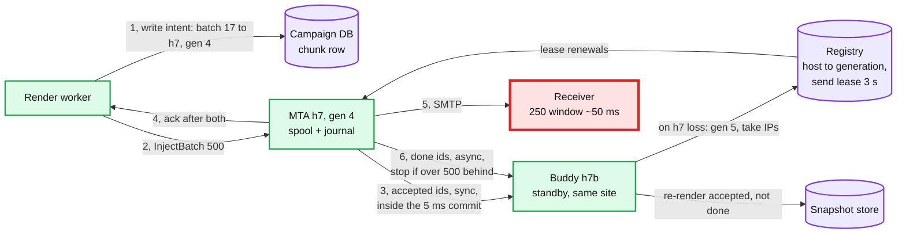
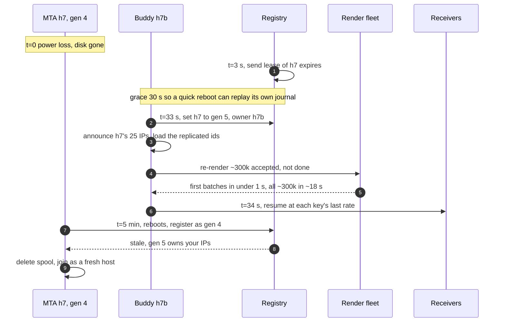

# Deep dive: delivery semantics and MTA failures

> One-line answer: SMTP (Simple Mail Transfer Protocol) is at-least-once by protocol, because a lost `250` means a resend, so the design states that window (~125 messages per host crash), makes every hop before it idempotent by a deterministic message id, and bounds what a crash can add. The design records the target MTA (mail transfer agent) on the chunk row before injecting, replicates each host's small journal records (accepted and done ids, never message bodies) to a buddy host before acking, and fences a replaced host by generation. Result per host death: a restart with the disk replays its own journal with ~133 duplicates; a takeover after disk loss resumes sending ~34 s after the death with 0 messages lost and ~128 duplicates, whatever Kafka's lag. Three simpler recoveries were tried first and failed in the simulation: rendezvous hashing moved retried batches when pool membership changed, a re-injector driven by Kafka events duplicated **and lost** whatever the event lag hid, and nothing stopped an old host that came back after its mail was re-sent.

Zoom-in on [`../solution.md`](../solution.md) §5.4 (one message per recipient), §5.5 (MTA crash), §10.4 (failure timeline) and §10.5 (idempotency table). Reusable blocks: [`../../../concepts/exactly-once.md`](../../../concepts/exactly-once.md), [`../../../concepts/leases-fencing-clocks.md`](../../../concepts/leases-fencing-clocks.md), [`../../../concepts/replication-and-quorums.md`](../../../concepts/replication-and-quorums.md), [`../../../concepts/etcd.md`](../../../concepts/etcd.md). Siblings: [`campaign-fan-out-and-scheduling.md`](campaign-fan-out-and-scheduling.md), [`bounces-complaints-and-suppression.md`](bounces-complaints-and-suppression.md).

Other acronyms: RFC (Request for Comments), DATA (the SMTP command that carries the message), IP (sending address), DB (database), SLO (service level objective).

---

## 1. The window nobody can close

RFC 1047 (1988) named it: "There is a point in the process of delivering a message where the receiving mailer knows it has accepted the message but the sending mailer is still not sure the message has been reliably delivered. If the SMTP conversation is broken at this point, the sending mailer will be forced to re-deliver the message" ([RFC 1047](https://www.rfc-editor.org/rfc/rfc1047.txt)). RFC 5321 §4.5.3.2.6 gives the wait for that `250` a 10 minute timeout, because "A spurious timeout at this point would be very wasteful and would typically result in delivery of multiple copies of the message" ([RFC 5321](https://www.rfc-editor.org/rfc/rfc5321.txt)).

| Moment for message m | Time after our final dot | Who owns m | If our host dies here |
|---|---|---|---|
| Final dot sent | 0 ms | Us | Resend. No duplicate |
| Receiver commits | ~100 ms [estimate] | **Both** | Resend. **Duplicate** |
| We read `250` | ~150 ms | Receiver | Resend unless `done(m)` is durable |
| `done(m)` fsynced | ≤ 5 ms later (group commit) | Receiver | Nothing |

- **Per crash, at 2,500 sends/s:** the ~50 ms between commit and reading the reply is ~125 messages, plus ≤ 5 ms of unsynced `done` records, ~13. That is the honest floor (sim §4: 133).
- **Same id on the resend.** The re-rendered copy carries the same deterministic `Message-ID`. Gmail even has a per-sender quota on it: "421 4.7.28 Gmail has detected this sender exceeded the quota for sending messages that have the same Message-ID:" ([Google SMTP errors](https://support.google.com/mail/answer/3726730)). Whether a receiver hides the second copy is up to it [unverified]. Never reuse one `Message-ID` across recipients: that is the pattern this quota exists to catch.

## 2. Three simpler recoveries, and why each failed

**A. Route a retried batch by rendezvous hash.** The first design chose the target by rendezvous hashing of the message id over the pool's hosts, so a re-injected batch would land on the same MTA and its spool index would drop known ids. If a host joins or leaves between the crash and the retry, part of the retried batch hashes to a host that never saw those ids. Measured below: 94 of 500 ids move when a 5th host joins, 138 of 500 when a host leaves the ring while it still holds its queue. Each one already accepted by the old host is a duplicate. Host joins happen weekly in an autoscaled fleet; render crashes happen daily.

**B. After a lost disk, re-inject from Kafka events.** A re-injector would list ids with an `injected(host)` event and no final event, expecting duplicates bounded by "~1 s of that host's sends". Two holes:
- An inject is acked after the local fsync, not after its `injected` event reached Kafka. If the disk dies first, the re-injector never lists that message and the render worker already checkpointed past it. **It is lost**, so "never loss" did not hold.
- Event lag is not bounded by design. At a 50 ms median the sim shows ~377 duplicates and ~257 losses per lost disk; with Kafka slow (30 s median, the D5c scenario) ~112k of each.

**C. Restart or re-inject, whichever happens.** "If the original host restarts, it replays its journal; if not, the re-injector runs" leaves nothing to decide which. A host that reboots at minute 3, after the re-injector ran at minute 2, replays its journal and sends its whole spool again: up to ~300k duplicates (one host's spool).

## 3. The fix: record the target, replicate the ids, fence by generation



- **Write-ahead intent (fixes A).** Before injecting batch k, the render worker writes `(inflight_batch = k, host = h7, host_gen = 4)` on the chunk row it already updates every 500 messages, fenced by its `lease_epoch`. A retry reads the row and goes to h7, or to whoever holds h7's generation now. Rendezvous stays as the default choice for a fresh batch, so a lost intent write (a DB failover) still mostly lands on the same host. Cost: one more small write per 500 messages, ~400/s at the 200k/s peak.
- **Replicate the ids, re-derive the bodies (fixes B).** Each host streams two small journal records per message to a buddy in another rack of the same site: `accepted(id)` synchronously inside the 5 ms group commit (the inject ack waits for local fsync and the buddy's ack), and `done(id)` asynchronously. If the buddy falls more than W = 500 `done` records behind, the host stops opening new SMTP transactions until it catches up. About 2 × 50 B × 2,500/s = 250 KB/s per host. Replicating bodies would cost 80 Gbps at the inject peak; ids cost a rounding error.
- **Fence by generation (fixes C).** A host may send only while it holds a send lease from the registry ([etcd](../../../concepts/etcd.md) or the campaign DB), renewed every 1 s, valid 3 s. On loss, the buddy waits for the lease to expire, bumps the generation, takes the IPs and the queue. A rebooted h7 must register before sending, learns it is generation 4 of 5, and deletes its spool. The IP moves only after the old lease expired, so two hosts never announce one address.
- **Recovery.** The buddy holds every accepted id and all but ≤ 500 done ids. It re-renders accepted-not-done messages from the snapshot (kept until expiry + 7 days) into its own spool. Nothing depends on Kafka, membership or timing.

**Host loss, second by second, with the fix:**



- **Why a 30 s grace** [estimate]. Most "host down" events are a process crash or a reboot with the disk intact. If the host comes back inside the grace it replays its own journal and the duplicate count stays at the floor. The cost is 30 s of silence on 25 IPs, which receivers do not punish.
- **Re-render cost.** ~300k messages at ~3 ms each (merge plus two DKIM signatures) is ~900 core-seconds, ~18 s on 50 render cores. It streams: 50 cores re-render ~16.7k/s while the host sends ~2,500/s, so sending resumes within about a second of takeover: ~34 s after the host died (3 s lease plus 30 s grace plus ~1 s).

| Hop | Duplicate source | Removed by, after the fix |
|---|---|---|
| Render to MTA | Retried batch after a worker crash | Intent row sends it to the recorded host or its successor; spool index drops known ids |
| MTA host restart, disk intact | `250` read but `done` not fsynced | Not removed: ≤ 13 per crash |
| MTA host loss | Done ids not yet on the buddy | Not removed: ≤ W = 500, typically ~5 |
| Zombie host | Old host replays a re-sent spool | Generation fence: it may not send |
| MTA to receiver | Lost `250` | Not removed: ~125 per crash, by protocol |

## 4. Simulation: duplicates and losses per crash, message by message

One host at 2,500 sends/s. Each message's `250` is read 150 ms after the final dot; the receiver commits at 100 ms. Event lag is lognormal around a median; buddy lag is 0.5 to 2 ms. The second part runs real rendezvous hashing on 500 ids.

```python
# One MTA host (2,500 sends/s) crashes. Count duplicates and losses, message by message,
# under four recoveries. Times in ms. Receiver commits 100 ms after our final dot; we read
# its 250 at 150 ms. Journal group commit every 5 ms.
import hashlib, math, random
rng = random.Random(21)
RATE, ACC, TX, FSYNC, CRASH, SPOOL = 2.5, 100, 150, 5, 600_003, 300_000

def lag(median_ms):                       # event pipeline lag, lognormal, p99 ~ 16x median
    return median_ms * math.exp(rng.gauss(0, 1.2))

def run(event_median_ms, buddy_ms=2.0, window_ms=120_000):
    dup = {"restart": 0, "events": 0, "buddy": 0}
    lost_events = 0
    for j in range(int(window_ms * RATE)):          # sends whose final dot was in the window
        s = CRASH - window_ms + j / RATE
        if s + ACC > CRASH:
            continue                                 # receiver had not committed: resend is fine
        got250 = s + TX
        journal = math.ceil(got250 / FSYNC) * FSYNC <= CRASH
        event = got250 + lag(event_median_ms) <= CRASH
        buddy = got250 + rng.uniform(0.5, buddy_ms) <= CRASH
        dup["restart"] += not journal
        dup["events"] += not event
        dup["buddy"] += not buddy
    for j in range(int(window_ms * RATE)):          # injects in the window: is "injected" known?
        a = CRASH - window_ms + j / RATE
        lost_events += a + lag(event_median_ms) > CRASH   # acked, but no event: nobody resends
    return dup, lost_events

print("Crash of one host. Duplicates reach a human; losses never arrive.")
print(" event lag p50    restart+journal   lost disk, re-inject from events   buddy + fence")
for med in (50, 300, 30_000):
    d, lost = run(med)
    print(f" {med/1000:>8.2f} s {d['restart']:>13} {d['events']:>17} dup, {lost:>6} lost"
          f" {d['buddy']:>14} dup, 0 lost")
print(f" no fence, old host replays after the re-injector ran: + ~{SPOOL:,} duplicates")

def rendezvous(msg, hosts):                       # highest random weight wins
    return max(hosts, key=lambda h: hashlib.sha1(f"{h}|{msg}".encode()).digest())

print("\nRetried batch of 500 ids, pool membership changed between the crash and the retry")
ids = [f"c_42.ct_{rng.randrange(10**8)}.mac" for _ in range(500)]
four, five, three = ["h1", "h2", "h3", "h4"], ["h1", "h2", "h3", "h4", "h5"], ["h1", "h2", "h3"]
for label, after in [("host h5 added", five), ("h4 left the ring, still sending", three)]:
    moved = sum(rendezvous(m, four) != rendezvous(m, after) for m in ids)
    print(f"   {label}: {moved} of 500 land on a host that never saw them -> duplicates")
```

Output:

```
Crash of one host. Duplicates reach a human; losses never arrive.
 event lag p50    restart+journal   lost disk, re-inject from events   buddy + fence
     0.05 s           133               377 dup,    257 lost            128 dup, 0 lost
     0.30 s           133              1700 dup,   1531 lost            129 dup, 0 lost
    30.00 s           133            111647 dup, 111646 lost            128 dup, 0 lost
 no fence, old host replays after the re-injector ran: + ~300,000 duplicates

Retried batch of 500 ids, pool membership changed between the crash and the retry
   host h5 added: 94 of 500 land on a host that never saw them -> duplicates
   h4 left the ring, still sending: 138 of 500 land on a host that never saw them -> duplicates
```

What it shows:
- **Restart with the journal is already at the floor** (133 ≈ 125 + ~8 unsynced). Nothing to fix there.
- **Recovery from events is unbounded.** It tracks Kafka's health, and every duplicate comes with a loss of the same size.
- **Buddy plus fence is flat at the floor** whatever Kafka does, and loses nothing.
- **Rendezvous alone is not a dedup scheme.** A fifth of a retried batch moves on a single membership change.

## 5. Retries, expiry, and the slow receiver

- **Message-level `4xx`** (mailbox full, greylisting): 15 min, 45 min, then every 2 h; give up at 4 days or the campaign's `expire_after`, with an `expired` event. RFC 5321 §4.5.4.1: "the retry interval SHOULD be at least 30 minutes; however, more sophisticated and variable strategies will be beneficial when the SMTP client can determine the reason for non-delivery". Our 15-minute first retry relies on that clause.
- **Throttle deferrals** do not spend an attempt. The key pauses and the message keeps its place.
- **A slow receiver** that takes minutes to answer the final dot: wait the full 10 minutes. A 60 s timeout there turns every slow `250` into a duplicate.
- **Campaign DB failover.** Within a site the chunk rows have a synchronous standby (RPO, recovery point objective, of 0). With an asynchronous one, a failover could lose the last second of checkpoints and intent rows: ~400 batches at the peak would be re-injected with no recorded host, fall back to rendezvous, and mostly dedup, but not if membership moved too.

## 6. What an interviewer pushes on

1. **"Make it exactly-once."** The receiver's `250` is the commit point and it has no idempotency key we can use. The best we can do is shrink the window (fast fsync, never time out the final dot) and say the number.
2. **"Why not replicate the spool synchronously?"** Bodies are ~50 KB, 80 Gbps at the inject peak, and a body can be re-rendered from the snapshot. Ids are ~50 B and cannot be re-derived after the disk is gone. Replicate what you cannot recompute.
3. **"Two hosts announce the same IP."** Only after the old host's 3 s send lease expired and its generation was bumped. A partitioned host stops sending when its lease lapses, whether or not it knows why.
4. **"Both h7 and its buddy die."** Fall back to the event-based re-injector, with its lag-sized duplicates and losses, and page. A double failure in two racks is the case where we accept that.
5. **"How long do you keep the dedup index?"** 5 days, matching the 4 to 5 day retry lifetime of a message in the spool, so any id the host could still be holding is known. An optimization, not in the design: drop an id one hour after it reaches a final state, since a retry can only come from the next lease owner of its chunk and a checkpointed batch is never re-injected.
6. **"Why not make Kafka the journal and wait for its ack?"** Then a Kafka outage stops every MTA at once. The buddy couples two hosts in one site, one network hop apart, and a buddy outage only slows its own host.
7. **"A whole site is lost."** Buddies sit in the same site (IPs never cross sites), and so does that site's Kafka, so neither the buddies nor the delivery events survive. That is why every site mirrors a compact stream of final ids (~50 B each, ~5 MB/s at a 100k/s egress peak) to the other site. Site B then knows from the intent rows (asynchronous campaign DB replica) what was sent to site A, and from the mirror what was delivered. If the site comes back (power loss), its journals replay at the floor. If it is gone, site B re-renders site-A messages with no final id and sends them from its own half of each pool, re-sending about one mirror lag (~1 s) of site A's mail. Without the mirror, every accepted site-A message with no known final state would be a candidate resend.

## 7. Trade-offs

| Decision | Chose | Gave up |
|---|---|---|
| Delivery | At-least-once, ~125 per crash stated | Exactly-once, which the protocol cannot give |
| Retry routing | Intent row, rendezvous as default | One write per 500 messages |
| Host loss | Ids replicated to a buddy, bodies re-rendered | ~250 KB/s per host, ~0.5 ms on the inject ack, a standby per host pair |
| Zombie host | Send lease plus generation fence | Up to 3 s of no sending on a healthy host that lost the registry |
| Backpressure | Stop SMTP at 500 unreplicated `done` records | A slow buddy slows its host |
| Final dot | 10 minute timeout | Connections held longer on slow receivers |

## 8. Numbers to say out loud

- RFC 1047 (1988) and RFC 5321 §4.5.3.2.6: the 250 window; wait 10 minutes.
- ~125 duplicates per host crash plus ~13 from the 5 ms commit. That is the floor.
- Events-based recovery: 377 duplicates and 257 losses at 50 ms lag; ~112k of each at 30 s.
- No fence: +~300k duplicates. Rendezvous: ~94 to 138 of 500 move on one membership change.
- Restart with the disk: ~133 duplicates. Takeover after disk loss: buddy at 250 KB/s per host, W = 500, 0 losses, ~128 duplicates whatever Kafka does, re-render ~18 s on 50 cores, sending again ~34 s after the death.
- Site loss: final ids mirrored cross-site at ~5 MB/s; re-send about one mirror lag (~1 s).
