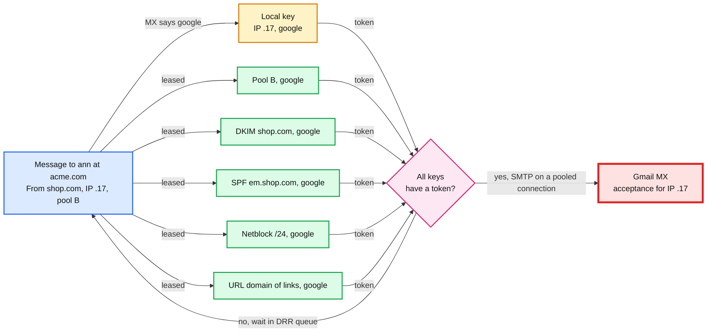
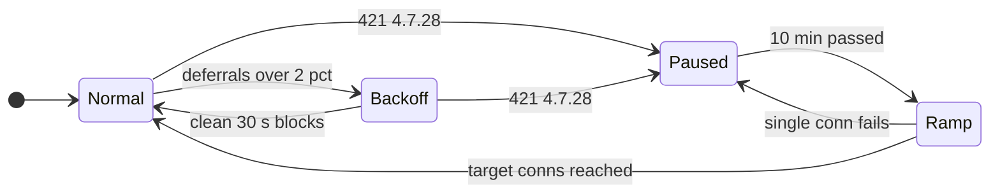

# Deep dive: per-domain throttling

> One-line answer: the throttle key is (sending scope, mailbox provider), where the provider comes from the recipient domain's MX (mail exchanger) records, not from the domain string; each key holds a rate and a connection cap learned by AIMD (additive increase, multiplicative decrease) from SMTP (Simple Mail Transfer Protocol) replies and scoped by what the reply text names; keys that live on one IP stay inside the MTA (mail transfer agent) that owns the IP, keys that span MTAs are leased from the quota service every second, and a message leaves only when every key it belongs to has a token. The controller settles at ~92% of a limit nobody publishes, so the "60/s per IP to Gmail" in the plan is a measurement to keep fresh, not a constant to trust.

Zoom-in on [`../solution.md`](../solution.md) §4.2 (per-key queues and AIMD), §5.2 (the quota service) and §10.1 (MTA internals). Reusable blocks: [`../../../concepts/rate-limiting-and-load-shedding.md`](../../../concepts/rate-limiting-and-load-shedding.md), [`../../../concepts/leases-fencing-clocks.md`](../../../concepts/leases-fencing-clocks.md), [`../../../concepts/sharding.md`](../../../concepts/sharding.md). Related problem: [`../../network-throttling/`](../../network-throttling/). Siblings: [`campaign-fan-out-and-scheduling.md`](campaign-fan-out-and-scheduling.md) (what the dispatcher does with each key's rate), [`reputation-and-ip-pools.md`](reputation-and-ip-pools.md).

Other acronyms: DKIM (DomainKeys Identified Mail), SPF (Sender Policy Framework), DNS (Domain Name System), TTL (time to live), DRR (deficit round robin), TLS (Transport Layer Security).

---

## 1. The key: who actually receives the mail

Google says it plainly: "Although the domains are different, if both domains have google.com as their MX record, messages sent to these domains count toward your limit" ([Google sender guidelines](https://support.google.com/mail/answer/81126)). So the provider is resolved from MX hosts, once per domain, off the hot path.

| Recipient domain | MX host (lowest preference) | Provider key |
|---|---|---|
| `gmail.com` | `gmail-smtp-in.l.google.com` | `google` |
| `acme.com` (Google Workspace) | `aspmx.l.google.com` | `google` |
| `contoso.com` (Microsoft 365) | `contoso-com.mail.protection.outlook.com` | `microsoft` |
| `yahoo.com`, `aol.com` | `mta5.am0.yahoodns.net` | `yahoo` |
| `bigcorp.com` behind a mail filter | `mx1.bigcorp.pphosted.com` | `mx:pphosted.com` (one key for every company behind that filter) |
| `tiny.org`, no MX record | its A record (RFC 5321 §5.1 implicit MX) | `mx:tiny.org` |
| `parked.example`, null MX `0 .` | none (RFC 7505) | hard bounce at once, no connection |

- **Rule.** A short suffix list maps the big operators (Google, Microsoft, Yahoo, Apple iCloud, a few filters). Everything else is `mx:<registrable domain of the MX host>`. ~10 M recipient domains collapse to ~5 big keys plus tens of thousands of small ones [estimate].
- **Two resolutions, on purpose.** The snapshot builder resolves the provider to cut chunks per provider and to debit the dispatcher's credit (§2 of the fan-out dive). The MTA resolves MX again at send time through its caching resolver and keys its queue on that answer. If a company moved to Google between the two (a Workspace migration mid-campaign), the message is still throttled by the right key; only one message of credit is mis-booked.
- **DNS failure is a deferral, not a bounce.** `SERVFAIL` or a timeout keeps the message queued and counts nothing against the key. Only `NXDOMAIN` or a null MX is permanent.



## 2. What a key holds, and why connections matter

| Field | Example for (IP .17, google) | Notes |
|---|---|---|
| `rate` | 60 msg/s | Learned. Starts at the key's last good rate, not a config constant (§5) |
| `max_connections` | 20 [estimate] | A cap, rarely the binding limit |
| `mode` | `NORMAL`, `BACKOFF`, `PAUSED`, `RAMP` | Diagram below |
| `paused_until` | 10:10:00 | Set by a 4.7.28 |
| `last_good_rate` | 62 msg/s | Highest rate held for 10 clean minutes in the last 7 days; durable in the campaign DB |

- **Little's law sizes the connections.** Connections in use = rate × time per transaction. At ~150 ms per message on a warm connection [estimate], 60/s needs `60 × 0.15 = 9` connections. `PIPELINING` (RFC 2920) cuts round trips, so fewer.
- **A slow receiver, not a down one.** If Gmail starts taking 2 s to answer the final dot, the same 9 connections carry `9 ÷ 2 = 4.5/s`, and even the cap of 20 gives only 10/s. The key is not deferred, it is slow, so AIMD sees no 4xx and does nothing. The dispatcher still sees the drain rate fall and cuts credit. Do not open more connections to compensate: that is the burst Google asks senders to avoid ("Send email at a consistent rate. Avoid sending email in bursts").
- **Never give up on the final dot early.** RFC 5321 §4.5.3.2.6 gives the "250 OK" wait after the final dot a 10 minute timeout, because a spurious timeout there "would typically result in delivery of multiple copies of the message" ([RFC 5321](https://www.rfc-editor.org/rfc/rfc5321.txt)). Our final-dot timeout is 10 minutes; connection and command timeouts can be short.



## 3. AIMD on replies, scoped by the text

The reply text, not only the code, says which key to act on. Google's `421 4.7.28` has one variant per scope: "from your IP address", "from your IP Netblock", "from your DKIM domain", "from your SPF domain", "containing one of your URL domains", and one with **no scope at all**: "Gmail has detected an unusual rate of email" ([Google SMTP errors](https://support.google.com/mail/answer/3726730)).

| Reply | Key acted on | Action |
|---|---|---|
| `250` | every key of the message | Count toward a clean block |
| `421 4.7.28 ... your IP address` | (IP, google) | Pause 10 min, then 1 connection, +1 connection per clean minute |
| `421 4.7.28 ... your DKIM domain` / `SPF domain` | (DKIM or SPF domain, google), global | Same, through the quota service |
| `421 4.7.28 ... IP Netblock` / `URL domains` | (netblock or URL domain, google), global | Same |
| `421 4.7.28 Gmail has detected an unusual rate of email` (no scope) | (IP), (DKIM), (SPF) together | Google: "If the error message does not specify if you exceeded your DKIM, SPF, or IP quota, assume that all three are affected" ([sender guidelines](https://support.google.com/mail/answer/81126)) |
| `421 4.7.28 ... the same Message-ID` | none: this message only | A per-message quota. Our ids are per recipient, so seeing it means a bug resent one id many times: page |
| `421`, `451` other deferrals | the key with the deferral | Over 2% of a 60 s window: rate × 0.5 |
| `450 4.2.1` "receiving email too quickly" | none: that one user | Retry that message in 30 min |
| `550 5.7.1` reputation block | (IP, provider) | Pause 1 h, page if pool-wide |

- **Increase.** +1 step per 30 s block with zero deferrals. Step = 2% of the key's planning rate (1.2/s for 60/s).
- **Decrease.** × 0.5 when deferrals exceed 2% of the last 60 s. Between 0% and 2% the rate holds: a deadband, so one stray 4xx does not trigger a cut.
- **After a 4.7.28,** Google's own steps: "Do not send email for at least 10 minutes", "send emails from a single connection", "If the single connection fails, wait another 10 minutes", then "increase the number of connections one at a time".

## 4. Keys that span MTAs: leases

- **Local keys** (IP, provider) never leave the MTA host: ~25 IPs × ~5 big providers plus the long tail per host. No network call per message.
- **Global keys** live in the quota service, sharded by key hash: pool, DKIM domain, SPF domain, netblock, URL domain, each × provider. Every second each MTA reports reply counts and demand per key and receives a lease (tokens, valid 2 s). The split is max-min fair by demand.
- **Overshoot is one lease.** For (bigshop.com, google) at 1,200/s the worst overshoot is `1,200 × 2 s = 2,400` messages, and only if every lease is spent in the instant the key is paused.
- **Merged signal.** AIMD for a global key runs on the merged reply counts from every MTA, so 4 hosts sending one DKIM domain halve once, not four times on four schedules.
- **Fail slow.** Quota service unreachable: last leased rate × 0.5 for 5 minutes, then one connection per global key. Never faster than the last lease.

**The pool key halves on a fraction, not a count.** (pool, google) is halved when IP-scoped 4.7.28s reach **5% of the pool's active IPs** within 60 s, or when the pool's merged deferral rate passes 2%. A fixed count was tried first and failed: "3 IPs in 60 s" on shared pool B (~1,000 IPs), at a background of one IP-scoped 4.7.28 per IP per day [estimate], sees ~0.7 hits a minute, so three in one minute happens ~48 times a day (output §5, part 3), and each one would halve Google mail for ~10k senders. 5% means 5 IPs on pool C (~100 IPs) and 50 on pool B.

## 5. Simulation: what AIMD converges to, and what a wrong start costs

One key against a Gmail limit L = 60/s that jitters ±10% each second. The sender uses exactly the §4.2 rules. Part 3 is the Poisson arithmetic that rejected the fixed-count pool rule.

```python
# AIMD on one (IP, google) key against a limit we do not know (solution 4.2 rules).
# Receiver: accepts up to L msgs/s (L jitters +-10% each second), defers the rest (4xx).
# Sender: deferrals over 2% of a 60 s window -> rate x beta.
#         a 30 s block with zero deferrals -> rate + step (2% of the 60/s plan).
import math, random

def run(start, L=60.0, beta=0.5, step=1.2, secs=7200, seed=1):
    rng = random.Random(seed)
    r, sent, deferred, first90 = start, 0.0, 0.0, None
    w_att = w_def = b_def = 0.0
    for t in range(1, secs + 1):
        ok = min(r, L * rng.uniform(0.9, 1.1))
        sent += ok; deferred += r - ok
        w_att += r; w_def += r - ok; b_def += r - ok
        if first90 is None and ok >= 0.9 * L:
            first90 = t
        if t % 60 == 0 and w_def > 0.02 * w_att:
            r *= beta                          # multiplicative decrease wins
        elif t % 30 == 0 and b_def == 0:
            r += step                          # additive increase
        if t % 60 == 0:
            w_att = w_def = 0.0
        if t % 30 == 0:
            b_def = 0.0
    return sent / secs, deferred, first90

print("1) Two hours on one key, true limit L = 60/s")
print(" start  beta  avg/s  util  deferred  first at 90% of L")
for beta in (0.5, 0.8):
    for start in (30, 60, 120):
        avg, d, f = run(start, beta=beta)
        print(f"{start:>6} {beta:>5} {avg:6.1f} {avg/60:5.0%} {d:9.0f}  {f/60:5.1f} min")

print("\n2) The 20 M campaign's Google pipe (8 M over 20 IPs) at those averages")
for beta in (0.5, 0.8):
    for start in (30, 60):
        avg, _, _ = run(start, beta=beta)
        print(f"   beta {beta}, start {start}/s: {8e6 / (20 * avg) / 3600:4.2f} h"
              "  (plan: 60/s flat -> 1.85 h)")

print("\n3) Pool key rule '3 IPs hit 4.7.28 within 60 s' on a 1,000-IP pool")
for per_ip_day in (0.25, 0.5, 1.0, 2.0):
    lam = 1000 * per_ip_day / 1440            # background IP hits per minute
    p3 = 1 - math.exp(-lam) * (1 + lam + lam**2 / 2)
    print(f"   {per_ip_day:>4} hits/IP/day: {lam:4.2f}/min, P(>=3 in a minute) {p3:6.2%},"
          f" ~{p3 * 1440:5.1f} false pool halvings/day")
```

Output:

```
1) Two hours on one key, true limit L = 60/s
 start  beta  avg/s  util  deferred  first at 90% of L
    30   0.5   54.9   91%      1561   10.0 min
    60   0.5   54.9   92%      1652    0.0 min
   120   0.5   55.0   92%      5344    0.0 min
    30   0.8   54.9   91%      1561   10.0 min
    60   0.8   56.0   93%      1680    0.0 min
   120   0.8   56.1   93%      8450    0.0 min

2) The 20 M campaign's Google pipe (8 M over 20 IPs) at those averages
   beta 0.5, start 30/s: 2.02 h  (plan: 60/s flat -> 1.85 h)
   beta 0.5, start 60/s: 2.02 h  (plan: 60/s flat -> 1.85 h)
   beta 0.8, start 30/s: 2.02 h  (plan: 60/s flat -> 1.85 h)
   beta 0.8, start 60/s: 1.99 h  (plan: 60/s flat -> 1.85 h)

3) Pool key rule '3 IPs hit 4.7.28 within 60 s' on a 1,000-IP pool
   0.25 hits/IP/day: 0.17/min, P(>=3 in a minute)  0.08%, ~  1.1 false pool halvings/day
    0.5 hits/IP/day: 0.35/min, P(>=3 in a minute)  0.54%, ~  7.8 false pool halvings/day
    1.0 hits/IP/day: 0.69/min, P(>=3 in a minute)  3.35%, ~ 48.2 false pool halvings/day
    2.0 hits/IP/day: 1.39/min, P(>=3 in a minute) 16.38%, ~235.9 false pool halvings/day
```

What it shows:
- **The controller lives below the limit.** The deadband plus "zero deferrals for an increase" parks the rate at ~92% of L. So the plan's 60/s must be the *achieved* rate, which needs a real limit near 65/s. If Gmail's limit is 60/s, the 20 M campaign's Google pipe takes ~2.0 h, not 1.85 h. Still inside "~2 h", with no margin.
- **A wrong start is asymmetric.** Starting at 2x the limit costs ~4k to 7k extra deferrals in the first minute, then it is fixed. Starting at half the limit costs 10 minutes at reduced speed. So each key starts from its stored `last_good_rate`, and a key with no history starts at the pool's median for that provider.
- **β barely matters once settled.** 0.5 and 0.8 differ by ~2%. Keep 0.5: when a receiver is really angry, backing off hard is the cheap mistake.
- **A fixed count fires on noise.** At one background hit per IP per day, "3 IPs in 60 s" would halve pool B ~48 times a day. That is why the design uses 5% of the pool's active IPs, which scales with pool size.

## 6. What an interviewer pushes on

1. **"Why not a token bucket per recipient domain?"** A B2B (business to business) list with 5,000 Workspace domains would get 5,000 budgets at Google's front door. Postfix's `default_destination_concurrency_limit = 20` per destination has the same trap ([postconf](https://www.postfix.org/postconf.5.html)).
2. **"Why not one central rate limiter for every message?"** 100k remote calls a second at the egress peak, and the limiter becomes the outage. Local keys answer most messages; only keys that span hosts are leased, once a second, per key.
3. **"How do you know Gmail's limit?"** We do not. We measure acceptance per key, keep `last_good_rate`, and plan capacity from the 10th percentile of a month of measurements ([fan-out dive](campaign-fan-out-and-scheduling.md) §4).
4. **"Rotate to fresh IPs when one is throttled."** "DKIM and SPF quotas are specific to your domain" (Google), so a domain-scoped throttle follows the sender, and a cold IP gets less, not more.
5. **"The 4.7.28 has no scope."** Pause IP, DKIM and SPF keys together, as Google says. A classifier that only matches scoped texts would treat it as a generic deferral and keep sending at half rate into a throttle.
6. **"The quota service partitions from half the MTAs."** Those MTAs fall to half their last lease, then one connection per key. The other half keep full leases. The total can only go down.
7. **"Gmail names *your* DKIM domain."** Every message also carries a second signature with one of our domains (solution §4.3, for Yahoo's CFL and Gmail's FBL). There is one such signer domain per pool tier (A, B, C, dedicated, transactional), so a 4.7.28 naming it pauses (that tier's signer domain, google): no wider than one tier, and a probation sender's complaints never land on shared A's signer. With a single shared signer domain the same reply would pause every customer's Gmail mail.

## 7. Trade-offs

| Decision | Chose | Gave up |
|---|---|---|
| Key | MX provider | One DNS lookup per new domain, a suffix list to maintain |
| Rate | AIMD with a 0 to 2% deadband | ~8% of the limit left unused |
| Scope | Parse the reply text | Text parsing per provider, and it changes. Tests run on recorded replies |
| Unscoped 4.7.28 | Pause IP, DKIM and SPF keys | Other senders on that IP pause too, for 10 minutes |
| Global keys | Leases of 2 s | Overshoot up to one lease |
| Pool key trigger | Fraction of the pool's IPs | A small pool (pool C, ~100 IPs [estimate]) reacts at 5 IPs, a big one at 50 |
| Start rate | `last_good_rate` per key | One durable row per key, ~100k rows |

## 8. Numbers to say out loud

- Provider from MX. ~10 M domains, ~5 big keys.
- 60/s × 0.15 s = 9 connections. Final-dot wait 10 min (RFC 5321).
- AIMD: +2% of plan per clean 30 s, × 0.5 above 2% deferrals in 60 s. Settles at ~92% of the limit.
- 4.7.28: 10 minutes off, one connection, +1 connection at a time. Unscoped means IP, DKIM and SPF.
- Leases every 1 s, valid 2 s, overshoot one lease (2,400 messages at 1,200/s).
- Pool key halves at 5% of active IPs in 60 s. A fixed "3 IPs" would fire ~48 times a day on 1,000 IPs.
