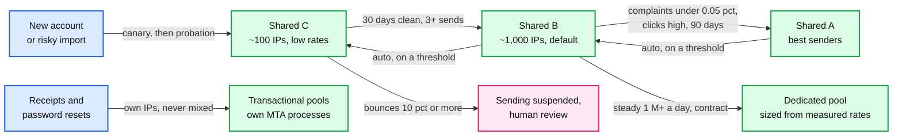
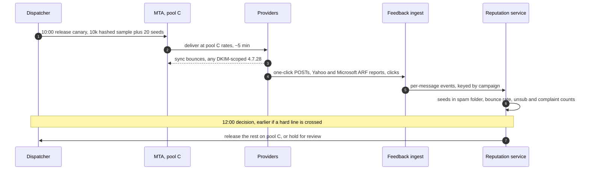

# Deep dive: reputation and IP pools

> One-line answer: reputation is the one asset that cannot be bought back this week, and receivers keep it per IP and per domain, so we sort senders into IP pools by quality (transactional, dedicated, shared A, B, C), warm every new IP for ~6 weeks, sign with the customer's own aligned DKIM (DomainKeys Identified Mail) domain so domain reputation follows the sender, and run an abuse loop that stops a bouncing list in seconds. Complaints are the slow signal: Gmail reports them only as a daily aggregate for @gmail.com recipients, so a list that does not bounce can finish a whole campaign before any complaint threshold fires. New and risky sends therefore go out as a 10k canary held ~2 h and judged on per-message signals (one-click unsubscribes from every provider, Yahoo and Microsoft feedback-loop complaints, human clicks, seed placement, a domain-scoped 4.7.28).

Zoom-in on [`../solution.md`](../solution.md) §4.3 (pools, signing, warm-up), §5.3 (the purchased list) and §12 (the send-risk model). Reusable blocks: [`../../../concepts/rate-limiting-and-load-shedding.md`](../../../concepts/rate-limiting-and-load-shedding.md), [`../../../concepts/stream-processing.md`](../../../concepts/stream-processing.md). Siblings: [`per-domain-throttling.md`](per-domain-throttling.md), [`bounces-complaints-and-suppression.md`](bounces-complaints-and-suppression.md), [`campaign-fan-out-and-scheduling.md`](campaign-fan-out-and-scheduling.md).

Other acronyms: SPF (Sender Policy Framework), DMARC (Domain-based Message Authentication, Reporting and Conformance), FBL (feedback loop), CFL (Yahoo's Complaint Feedback Loop), JMRP (Microsoft's Junk Mail Reporting Program), ARF (Abuse Reporting Format), MTA (mail transfer agent), ESP (email service provider), SES (Amazon Simple Email Service).

---

## 1. What receivers track, and who shares it

Google: "Gmail tracks volume, feedback, and limits per domain and IP address: DKIM and SPF quotas are specific to your domain ... The IP address quota is shared for all senders that use that IP address" ([sender guidelines](https://support.google.com/mail/answer/81126)).

| Reputation unit | Who shares it | What one bad 1 M list does to it |
|---|---|---|
| The customer's DKIM domain (`d=shop.com`) | That customer only | Takes the full hit. Correct: it is their list |
| A sending IP in shared pool B | ~10k senders a day [estimate] | Diluted. Pool B carries ~1,000 IPs × ~400k/day, ~160 M Gmail messages a day. At 0.8% complaints the list adds ~3,200 Gmail reports, ~3 per IP: invisible |
| Our shared click-tracking domain | Every sender without a branded link domain | Concentrated. Gmail's 4.7.28 has a "containing one of your URL domains" variant |
| Probation pool C (~100 IPs [estimate]) | New and flagged accounts | 10x less dilution than pool B |

So the shared assets that one sender can actually burn are the **tracking domain** and the **small pools**, not the big shared pool's IPs. That is why every paying tier gets a branded link domain (a dedicated-only rule left every shared-pool sender on one domain that any of them could get throttled), and why pool C is where risky mail goes.

## 2. Pools and how accounts move



- **Down is fast, up is slow.** The reputation service moves an account down within a minute of a threshold; up only after weeks of history [estimate for the thresholds on the arrows].
- **Dedicated is earned.** An IP needs steady volume to hold a reputation. 2,000 messages on Tuesday and nothing else never builds one, and many thin IPs look like snowshoeing.
- **Transactional is apart.** Google: "use a different IP address for each message type". A password reset never waits behind a sale.

## 3. Warm-up

- **The curve.** SendGrid's automated schedule starts at 20 messages/hour on day 0, reaches 1,000/hour on day 12 and 484,029/hour on day 30, and ends on day 41 ([Twilio SendGrid](https://www.twilio.com/docs/sendgrid/ui/sending-email/warming-up-an-ip-address)). Overflow goes to the account's previous IPs. An IP idle for 30 days warms again.
- **Volume jumps count too.** Google: "immediately doubling previously sent volumes suddenly could result in rate limiting or reputation drops". This applies to a domain on a warm IP, so a sender's first 5x Black Friday send is a warm-up problem even on old IPs.
- **The quota service enforces it** as one more key: (IP, all providers) with a daily cap that grows ~1.4x a day.

## 4. Authentication, and who receives the complaint data

- **Aligned DKIM.** `d=shop.com` with `From: news@shop.com`, so DMARC passes on DKIM alone, and Google's "aligned with either the SPF domain or the DKIM domain" is met.
- **Yahoo's CFL is keyed on that domain.** "ARF reports are sent if the DKIM domain is enrolled and emails matching the DKIM domain (d= in the signature) are marked as spam", and "Yahoo no longer offers IP or CIDR-based CFL reporting" ([Yahoo sender FAQ](https://senders.yahooinc.com/faqs/)).
- **Gmail's FBL needs a signing domain the sender controls.** The `Feedback-ID` header must be "DKIM signed by a domain owned (or controlled) by the sender, after the addition of this header. This domain should be added and verified to the Gmail Postmaster Tools" ([Google FBL](https://support.google.com/mail/answer/6254652)).
- **So every message is signed twice.** Signing only with `d=shop.com` left Yahoo sending complaints only for customer domains enrolled one by one, and Gmail's FBL data belonging to a domain we would have to verify in Postmaster Tools per customer. Hundreds of thousands of customer domains make both impractical. The second DKIM signature, with our own signer domain for the sender's pool tier, gives a handful of CFL enrollments and Postmaster Tools domains for every customer's `Feedback-ID`. Cost: a second RSA-2048 signature, ~1 ms [estimate], so render is ~3 ms per message and ~600 cores at the 200k/s peak (~400 with one signature).
- **Feedback-ID granularity.** Gmail reports an identifier only when it "is present in a certain volume of mails as well as in distinct user spam reports" on one day. A median campaign of ~1,000 recipients never gets there. So campaign and account ids go in the header only for senders above ~100k Gmail messages a day [estimate]; below that the fields carry a (tier, pool) bucket.
- **One second-signer domain per pool tier.** Gmail keeps reputation per DKIM domain, and every customer's mail also carries ours, so a single signer domain would be a reputation unit shared by everyone. The second signature therefore uses one domain per tier (A, B, C, dedicated, transactional): pool C's complaints never touch the signer that shared A and dedicated senders use, and a 4.7.28 naming a signer domain pauses one tier. Each tier's domain is enrolled once in Yahoo's CFL and verified once in Postmaster Tools: five enrollments instead of one, still not hundreds of thousands.

## 5. The abuse loop: fast for bounces, slow for complaints

| Signal | Latency | Coverage | Use |
|---|---|---|---|
| Synchronous bounce (`550 5.1.1` at RCPT) | Under 1 s | Every provider | Pause at 5%, suspend at 10% after 1,000 attempts (SES uses 5% review, 10% pause) |
| One-click unsubscribe POST (RFC 8058) | Minutes after a human reads | Every provider that shows the button, Gmail included | Leading indicator for complaints |
| Yahoo CFL ARF report | Not published [unverified]; per message | Yahoo and AOL, ~10% of mail | Per-message complaint |
| Microsoft JMRP report | Per message [unverified detail] | ~20% of mail | Per-message complaint |
| Human clicks | Minutes | Every provider, minus link scanners | Engagement; low on a purchased list |
| Seed mailboxes we own | ~5 min after delivery | Gmail, Yahoo, Outlook seeds | Inbox vs spam placement for content and sender; seeds have no history [estimate] |
| Gmail `421 4.7.28 ... your DKIM domain` | Real time | Gmail | Gmail has already decided: damage, not warning |
| Gmail FBL per `Feedback-ID` | "For a given day's traffic", only @gmail.com, only above a volume and report threshold | Gmail consumer | Next-day confirmation |
| Postmaster Tools spam rate | "Typically, the data is updated within 24 hours but can take longer" ([Postmaster Tools](https://support.google.com/mail/answer/14668346)) | Gmail | Daily trend, 0.1% and 0.3% lines |

Google also says "Spam rate is calculated daily" and senders become eligible for mitigation again only "when their spam rates remain below 0.3% for 7 consecutive days" ([FAQ](https://support.google.com/a/answer/14229414)). One bad day costs a week.

**Why the probe alone was not enough.** The first design held the rest of a risky list for 15 minutes after a 5,000 probe, then paused on "complaints ≥ 0.3% of FBL-covered deliveries". That catches a list that **bounces**, and the design keeps it for that. A scraped or stale list of valid addresses does not bounce; it draws complaints, and complaints need a human to open the mail first. If read time is roughly exponential with a 4 h mean [estimate], 15 minutes shows 6% of the eventual complaints. The simulation below is what added the canary.

## 6. Simulation: probe and stream rule vs a canary

A 1 M list on pool C at ~500/s. "Bad" draws 0.8% complaints and 1.5% unsubscribes per delivered message; "good" 0.05% and 0.2% [all four estimates]. FBL covers 30% of mail (Yahoo plus Microsoft).

```python
# A list that does not bounce but draws complaints. Which signal sees it before it is all sent?
# Per-message signals: Yahoo + Microsoft FBL complaints (~30% of mail), one-click unsubscribes
# (every provider, Gmail included). Gmail complaints: a daily aggregate, the next day.
import math, random
rng = random.Random(54)
FBL, READ_H = 0.30, 4.0                   # FBL-covered share; mean hours until a human reads it
LISTS = {"bad": (0.008, 0.015), "good": (0.0005, 0.002)}  # complaints, unsubs per delivered

def poisson(lam):
    if lam > 50:
        return max(0, round(rng.gauss(lam, math.sqrt(lam))))
    k, p, u = 0, math.exp(-lam), rng.random()
    while u > p:
        u -= p; k += 1; p *= lam / k
    return k

def visible(age_h):                       # share of eventual signals already in
    return 1 - math.exp(-age_h / READ_H)

def streaming_rule(kind, n=1_000_000, start_min=17, per_min=30_000):
    """Probe-only design: probe 5k, hold 15 min, then ~500/s; pause at complaints
    >= 0.3% of FBL-covered deliveries once 1,000 are covered."""
    c = LISTS[kind][0]
    sends = [5_000] + [0] * (start_min - 1)          # minute 0: the probe
    left = n - 5_000
    while left > 0:
        sends.append(min(per_min, left)); left -= per_min
    sends += [0] * 600
    for m in range(1, len(sends)):
        done = sum(sends[:m])
        exp_c = sum(d * FBL * c * visible((m - i) / 60) for i, d in enumerate(sends[:m]))
        if done * FBL >= 1_000 and poisson(exp_c) >= 0.003 * done * FBL:
            return m, done
    return None, n

def canary(kind, size=10_000, hold_h=2.0, max_c=4, max_u=25):
    c, u = LISTS[kind]
    return (poisson(size * FBL * c * visible(hold_h)) >= max_c or
            poisson(size * u * visible(hold_h)) >= max_u)

print("1) Probe-only design on a 1 M list: probe 5k, 15 min hold, then ~500/s on pool C")
for kind in LISTS:
    m, done = streaming_rule(kind)
    print(f"   {kind:>4}: " + (f"paused at minute {m}, {done:,} already sent" if m
                              else f"never paused, all {done:,} sent"))
print(f"   probe hold sees {visible(0.25):.0%} of eventual complaints; the send ends at minute ~50")

print("\n2) Share of eventual signals in after a hold: " +
      ", ".join(f"{h} h {visible(h):.0%}" for h in (0.25, 1, 2, 6)))

T = 4000
print(f"\n3) Canary of 10k, hold 2 h, hold the rest if FBL complaints >= 4 or unsubs >= 25 ({T} trials)")
for name, kw in [("both", {}), ("FBL only", dict(max_u=10**9)), ("unsub only", dict(max_c=10**9))]:
    b = sum(canary("bad", **kw) for _ in range(T)) / T
    g = sum(canary("good", **kw) for _ in range(T)) / T
    print(f"   {name:>10}: catches bad {b:6.1%}, false hold on good {g:6.2%}")

print("\n4) Gmail spam reports the bad list leaves on the shared pool, all seen a day later")
for label, sent in [("probe only, whole list", 1_000_000), ("canary, 10k then held", 10_000)]:
    print(f"   {label:>26}: ~{sent * 0.40 * LISTS['bad'][0]:,.0f}")
```

Output:

```
1) Probe-only design on a 1 M list: probe 5k, 15 min hold, then ~500/s on pool C
    bad: paused at minute 142, 1,000,000 already sent
   good: never paused, all 1,000,000 sent
   probe hold sees 6% of eventual complaints; the send ends at minute ~50

2) Share of eventual signals in after a hold: 0.25 h 6%, 1 h 22%, 2 h 39%, 6 h 78%

3) Canary of 10k, hold 2 h, hold the rest if FBL complaints >= 4 or unsubs >= 25 (4000 trials)
         both: catches bad 100.0%, false hold on good  0.30%
     FBL only: catches bad  98.5%, false hold on good  0.33%
   unsub only: catches bad 100.0%, false hold on good  0.00%

4) Gmail spam reports the bad list leaves on the shared pool, all seen a day later
       probe only, whole list: ~3,200
        canary, 10k then held: ~32
```

What it shows:
- **The stream rule fires 90 minutes after the list is gone.** The complaint ratio only climbs as people read, so the pause comes at minute 142; the last message left at minute ~50.
- **Unsubscribes are the strongest early signal.** They are more frequent than complaints, arrive per message within minutes of reading, and come from Gmail too. The exact separation rests on the estimated rates; the structure does not.
- **A canary cuts the Gmail damage 100x** (~3,200 reports to ~32) at the cost of a 2 h delay for the senders who get one.

## 7. The canary policy



- **Who gets one.** Accounts under 30 days or 3 completed sends; imports scored medium risk; any send over 5x the account's largest in 90 days (Google's doubling warning); an account moved down a tier this week. ~3% of campaigns [estimate].
- **Size.** `min(10k, 20% of the list)`, a hashed sample (shuffled chunks, see the fan-out dive §2). Lists under 2,000 go whole on pool C: their blast radius is smaller than any canary's.
- **Hold.** Up to 2 h (39% of eventual signals at a 4 h read mean). Never release early. Hold early on any hard line: bounces ≥ 5%, a DKIM-scoped 4.7.28, half the seeds in spam.
- **Decision.** Unsubscribes ≥ 25 or FBL complaints ≥ 4 in the canary (for 10k) holds the rest for human review. Thresholds scale with canary size.
- **Link scanners.** Security gateways fetch every link within seconds of delivery. Clicks from known scanner ranges, or on every link of a message within 10 s, count as machine, like Apple MPP (Mail Privacy Protection) opens.
- **Guardrail.** The risk model can add a canary, never remove the hard lines (solution §12).

## 8. What an interviewer pushes on

1. **"Why not just wait for Postmaster Tools?"** It is daily, @gmail.com only, and silent on low-volume days. It confirms; it cannot prevent.
2. **"Two hours is a long delay for a new customer."** It applies to ~3% of campaigns, and the alternative is ~3,200 Gmail spam reports on shared infrastructure and a week before mitigation is possible again.
3. **"A spammer games the canary with a clean first 10k."** The sample is a hash over the whole list, chosen by us after the snapshot, so the sender cannot place good addresses in it.
4. **"Why not route risky senders to their own IPs?"** Pool C is that, shared among the risky few. One IP per new account never warms.
5. **"Unsubscribes are not complaints."** Correct. They are the per-message signal Gmail does give us, and on a bad list they move first.
6. **"Your second DKIM signature makes your own domain everyone's reputation."** It would, with a single signer domain: that is the price of receiving Yahoo and Gmail complaint data for every customer through a few enrollments. It is bounded like the IPs: one signer domain per pool tier (§4), and a DKIM-scoped 4.7.28 naming one is a signal for that tier's pool.

## 9. Trade-offs

| Decision | Chose | Gave up |
|---|---|---|
| Risky sends | 10k canary, 2 h hold | 2 h for ~3% of campaigns |
| 5k probe on pool C | Kept for bounces (seconds) | Nothing; it is just not a complaint test |
| DKIM | Customer domain plus a second signature with our per-tier signer domain | ~1 ms per message, ~200 extra cores at peak, five signer domains to enroll and watch |
| Link domains | Branded per paying account | DNS setup per customer |
| Pool moves | Down in a minute, up in weeks | Good senders recover slowly after a false demotion |

## 10. Numbers to say out loud

- Gmail spam rate daily, under 0.1%, never 0.3%; 7 clean days to regain mitigation.
- 15 min sees ~6% of eventual complaints; 2 h ~39% [4 h read mean, estimate].
- Stream rule: pause at minute 142, list gone at minute 50. Canary: ~3,200 Gmail reports down to ~32.
- SendGrid warm-up: 20/h on day 0, 484,029/h on day 30, done day 41.
- Yahoo CFL: keyed on DKIM `d=`, no IP-based FBL. Sign twice, the second time with one signer domain per pool tier.
