# Diagrams: Mailchimp campaign sending

> One-line answer: twelve views of one design. A control path (campaign service, scheduler, snapshot store, dispatcher) decides what to send and paces it. A sending path (render workers, MTA fleet with one queue per (IP, provider) and journal ids on a buddy host, quota service) delivers it at the rate each receiver accepts. A feedback path (feedback ingest, suppression store, Kafka, reputation service with a canary for risky campaigns) turns bounces, complaints and unsubscribes into the next send's rules. The mailbox providers' acceptance for our pools is the one red box.

The D1 to D12 set from `hld/CLAUDE.md` §4, each with a one-line caption. A diagram already in [`solution.md`](solution.md) gets a heading, a caption and a link, never a second copy. Acronyms: MTA (mail transfer agent), MX (mail exchanger DNS record), SMTP (Simple Mail Transfer Protocol), DKIM (DomainKeys Identified Mail), SPF (Sender Policy Framework), DMARC (Domain-based Message Authentication, Reporting and Conformance), DSN (delivery status notification, a bounce), ARF (Abuse Reporting Format, a complaint report), FBL (feedback loop), VERP (variable envelope return path), DRR (deficit round robin), KMS (key management service), AIMD (additive increase multiplicative decrease), MIME (the standard email message format), CAS (compare-and-set), DNS (Domain Name System).

| # | Diagram | Where it lives |
|---|---|---|
| D1 | Context | below |
| D2 | Data flow | below |
| D3 | Component architecture (final design) | [solution §6](solution.md#6-final-design-and-the-six-core-flows) |
| D4 | Happy path per FR | FR1 final first minute: below. FR2 throttle: [solution §4.2](solution.md#42-throttle-per-receiver-one-queue-per-ip-provider-rates-learned-from-replies). FR3 domain verification: below (the signed send itself is in [solution §4.3](solution.md#43-protect-reputation-pools-authentication-warm-up-an-abuse-loop)). FR4 async bounce and complaint: below (one-click unsubscribe is in [solution §4.4](solution.md#44-close-the-loop-bounces-complaints-unsubscribes-stats)) |
| D5 | Failure paths | Render worker dies mid-chunk, quota service shard lost, suppression feed stale: below. MTA crash after 250: [solution §5.5](solution.md#55-an-mta-crashes-after-the-receiver-said-250-ok-but-before-we-recorded-it-duplicate-loss-or-neither). Gmail throttles a pool: [solution §10.4](solution.md#104-failure-timeline) |
| D6 | Decision flow | SMTP reply classifier: below. Import and probe gates: [solution §5.3](solution.md#53-a-new-customer-imports-a-purchased-list-and-15-bounce-how-do-you-protect-everyone-else-on-the-shared-pool) |
| D7 | Entity relationship | [solution §3.3](solution.md#33-data-model) |
| D8 | State machines | Message, campaign, sending IP: below |
| D9 | Deployment / topology | below |
| D10 | Scaling / partitioning | below |
| D11 | Failure mode map | below, two trees |
| D12 | Rollout / migration | below |

## D1. Context (zoom-out)

Our system as one box: customers send campaigns in, mail goes out to mailbox providers, and four kinds of feedback come back.

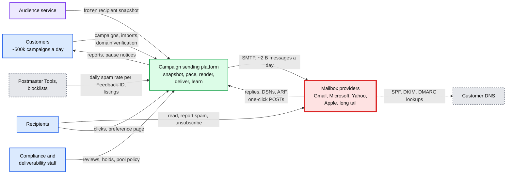

## D2. Data flow (DFD)

Inputs to outputs with data name, format, size and rate. Stores are cylinders, processes rounded. Rates are averages from solution §2 unless marked peak.

```mermaid
%% D2: what flows where. 6.5 B events a day is ~75k/s. Unsubscribes are ~0.2% of sends, ~46/s.
flowchart LR
    AUD[(Audience DB)] -->|"contact rows, ~500 B,<br/>20 M in ~40 s"| SNAPP(Snapshot builder)
    SNAPP -->|"chunk files per provider,<br/>10k rows, encrypted"| SNAP[(Snapshot store)]
    SNAP -->|"provider-chunks by credit"| RND(Render + DKIM sign)
    TPL[(Content versions)] -->|"HTML template ~50 KB,<br/>once per campaign"| RND
    RND -->|"MIME ~50 KB, 23k/s,<br/>200k/s peak"| MTA(MTA fleet)
    MTA -->|"SMTP, ~9.3 Gbps"| OUT[Mailbox providers]
    OUT -->|"reply code + text ~100 B,<br/>one per attempt"| MTA
    OUT -->|"DSN ~70/s, ARF ~5/s,<br/>one-click POST ~46/s"| FB(Feedback ingest)
    FB -->|"suppression ~100 B,<br/>~280/s, ~3k/s peak"| SUP[(Suppression store)]
    SUP -->|"outbox relay, JSON"| KF[(Kafka)]
    MTA -->|"delivery events JSON ~300 B,<br/>~75k/s"| KF
    KF -->|"Parquet ~400 GB/day"| LAKE[(Event lake)]
    KF -->|"counters per campaign,<br/>provider, outcome"| RPT(Stats job)

    class SNAPP,RND,MTA,FB,RPT service
    class AUD,SNAP,TPL,SUP,LAKE store
    class KF queue
    class OUT critical

    classDef service  fill:#dcfce7,stroke:#16a34a,stroke-width:2px,color:#111
    classDef store    fill:#ede9fe,stroke:#7c3aed,stroke-width:2px,color:#111
    classDef queue    fill:#cffafe,stroke:#0891b2,stroke-width:2px,color:#111
    classDef critical fill:#fee2e2,stroke:#dc2626,stroke-width:4px,color:#111
```

## D3. Component architecture

The final design, 14 nodes, is [solution §6](solution.md#6-final-design-and-the-six-core-flows). The MTA zoom-in is in [solution §10.1](solution.md#101-internals-of-each-chosen-technology).

## D4. Happy paths, one per FR

### D4 FR1 final: the first minute of the 20 M campaign

The final design: early snapshot, a free 500-recipient chunk 0 per provider, credit from the allowed rate, the target host recorded before injecting, ids on a buddy. Times are typical.

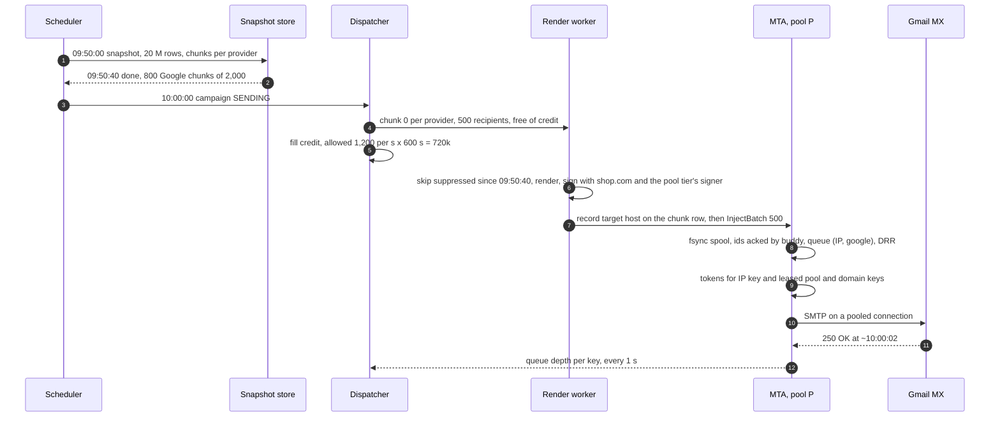

### D4 FR2: throttle per receiver

Embedded in [solution §4.2](solution.md#42-throttle-per-receiver-one-queue-per-ip-provider-rates-learned-from-replies) (a Gmail pause on one IP while the Yahoo queue keeps sending). The global-key version is [solution §5.2](solution.md#52-gmail-starts-answering-421-4728-for-one-ip-pool-what-changes-in-what-order-automatically).

### D4 FR3: a customer verifies a sending domain

Before any send from `shop.com`, the customer proves control in DNS and delegates DKIM to keys we hold and can rotate.

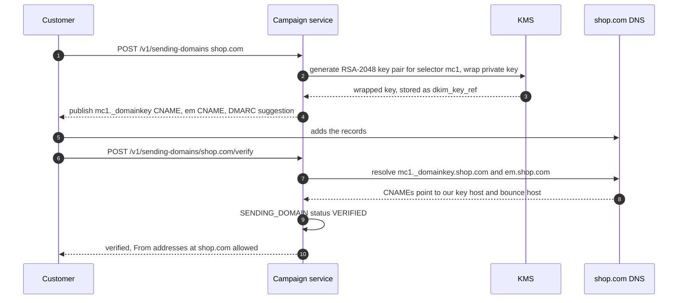

### D4 FR4: an asynchronous bounce and a Yahoo complaint

Both arrive by mail days or minutes after the send. Both map to the message by its signed id, with no lookup table.

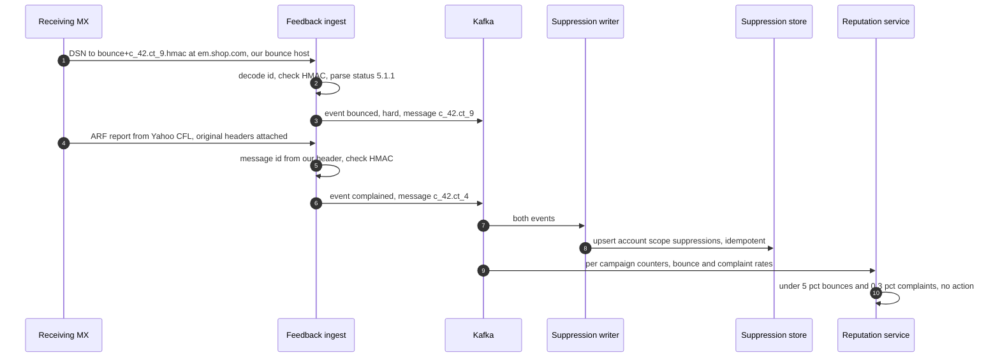

## D5. Failure paths

### D5a. A render worker dies mid-chunk, and the pool changes

The next owner resumes from the checkpoint with a higher epoch and sends the retried batch to the host recorded on the chunk row. Rendezvous hashing alone would move ~1 in 5 of those ids when a host joins ([delivery dive](deep-dives/delivery-semantics-and-mta-failures.md) §2).

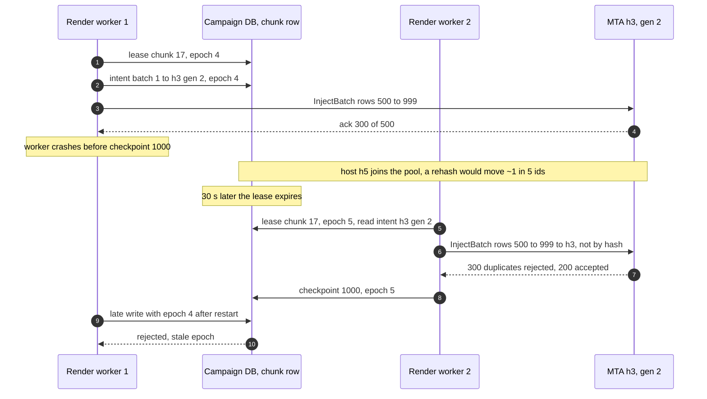

### D5b. A quota service shard is lost

MTAs keep sending more slowly on their last leases; a new owner rebuilds the keys from the next round of reports.

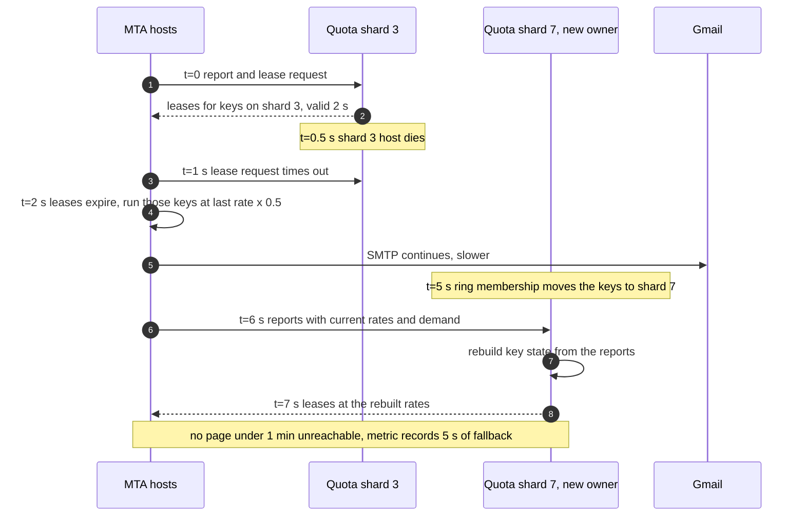

### D5c. The suppression feed goes stale

Kafka is unavailable. MTAs keep their filters fresh by pulling the suppression store's `created_at` index, hold canary and probation sends, and keep counting bounces locally. Mail is held only when both feeds are stale.

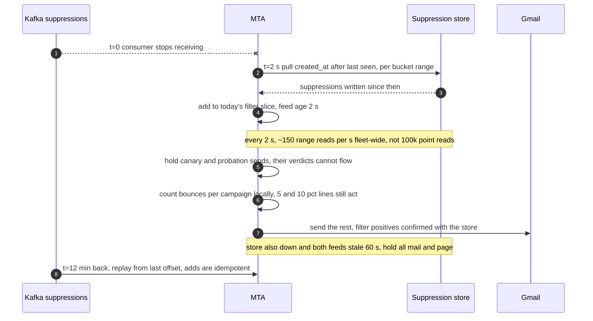

## D6. Activity / decision flow

The SMTP reply classifier inside every MTA: one reply in, one action out. The `4.7.28` variants follow the wording on [Google's SMTP error page](https://support.google.com/mail/answer/3726730); for the unscoped one Google says "assume that all three are affected".

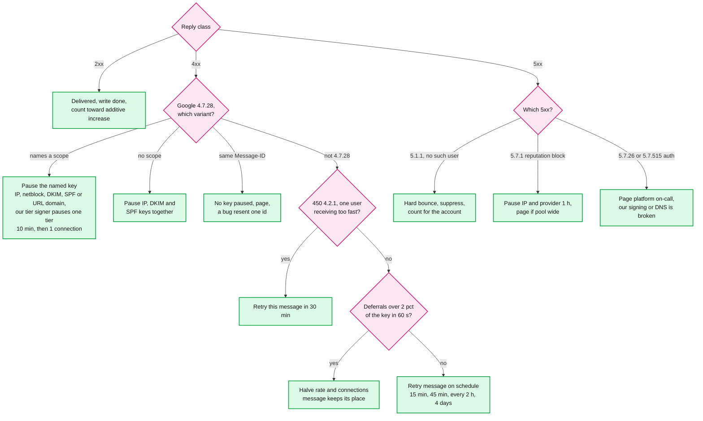

## D7. Entity relationship

Embedded in [solution §3.3](solution.md#33-data-model) with the access patterns and partition keys.

## D8. State machines

### D8a. Message

One message per (campaign, recipient). Throttle deferrals keep it `Queued`; only message-level failures spend an attempt.

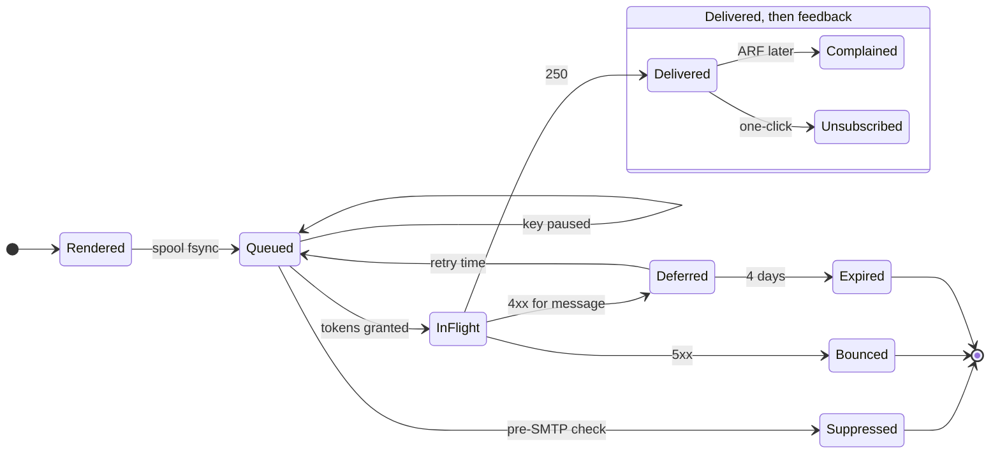

### D8b. Campaign

The abuse loop and the customer can both pause; only the customer or a reviewer resumes.

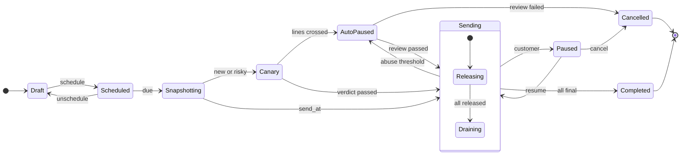

### D8c. Sending IP

An IP's reputation is its value. rDNS is reverse DNS (a PTR record), which Google requires for every sending IP. SendGrid: "If you haven't sent email messages through your IP address in more than 30 days, warm it up again" ([SendGrid](https://www.twilio.com/docs/sendgrid/ui/sending-email/warming-up-an-ip-address)).

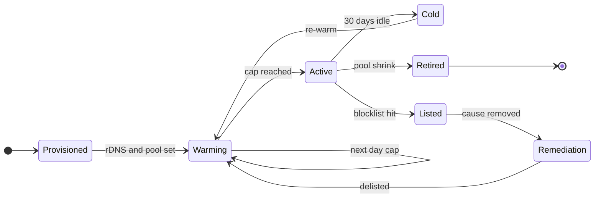

## D9. Deployment / topology

Two sites. Every pool keeps half its IPs in each, so a site loss halves rates instead of stopping a pool. Inside a site, each MTA host has a buddy in another rack that holds its journal ids, and a registry hands out send leases and generations. Across sites, a compact final-id stream tells each site what the other delivered. Control-plane data replicates asynchronously; the suppression topic is mirrored both ways because every MTA needs every suppression.

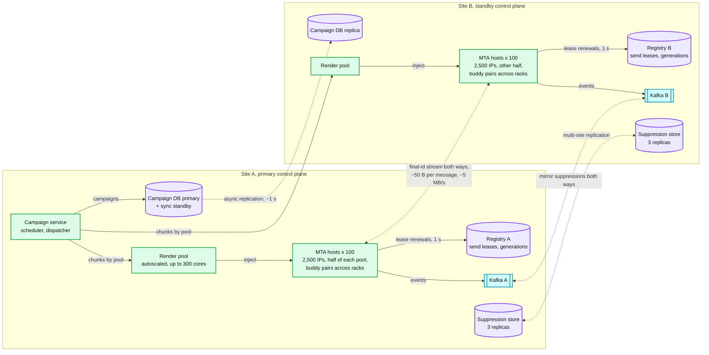

## D10. Scaling / partitioning

Work is partitioned by the throttle key, not by customer or campaign. The hot key is the big sender's pool to Google; the fix is planned IP capacity and fair sharing, not more machines.

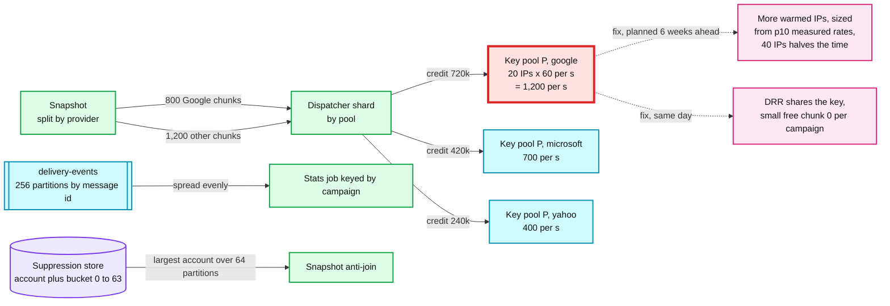

## D11. Failure mode map

### D11a. Sending path

Component, what fails, blast radius, mitigation. The receiver's block is the widest radius and the slowest to heal.

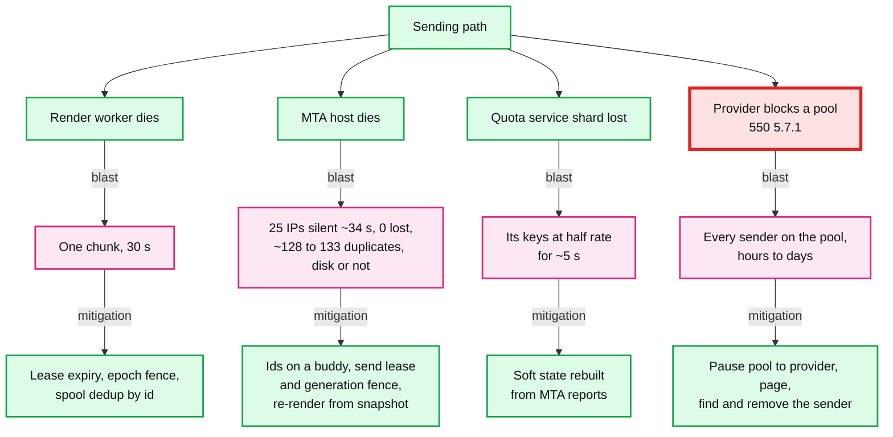

### D11b. Control and feedback path

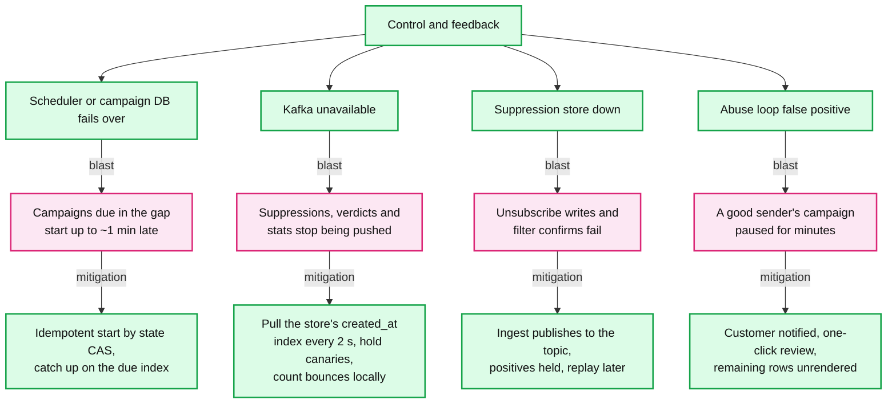

## D12. Rollout / migration

From static per-domain MTA configs and nightly bounce processing to the design in solution §6. Every phase has a per-pool or per-feature flag as its rollback point; phases 1 to 3 change no sending behaviour.

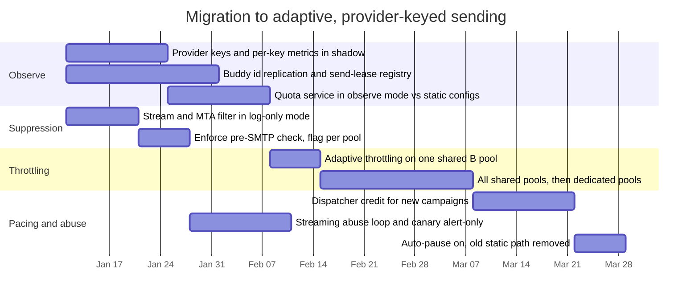

Rollback per phase: shadow phases have nothing to roll back; enforcement and throttling flip back to the old path per pool by flag, and the MTAs keep both code paths until the last task; the dispatcher can be bypassed per campaign, which falls back to render-as-fast-as-possible. Avoid starting any phase in the six weeks before Black Friday: that window is for warming IPs, not for changing how they are driven.
