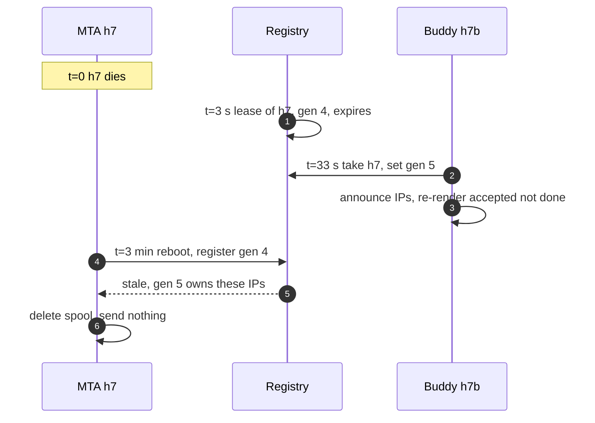
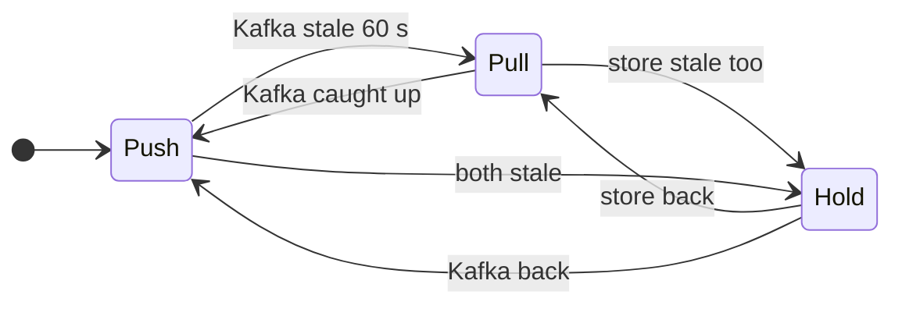
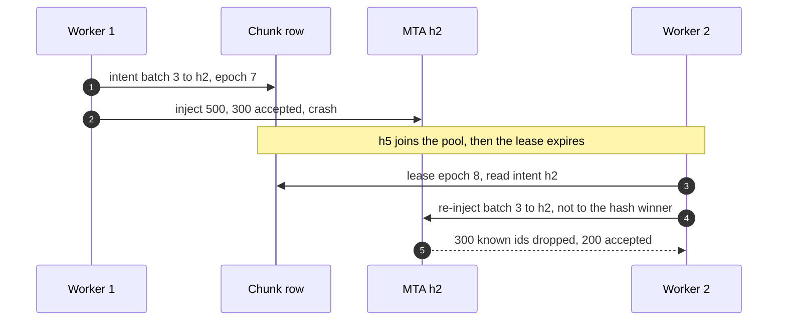
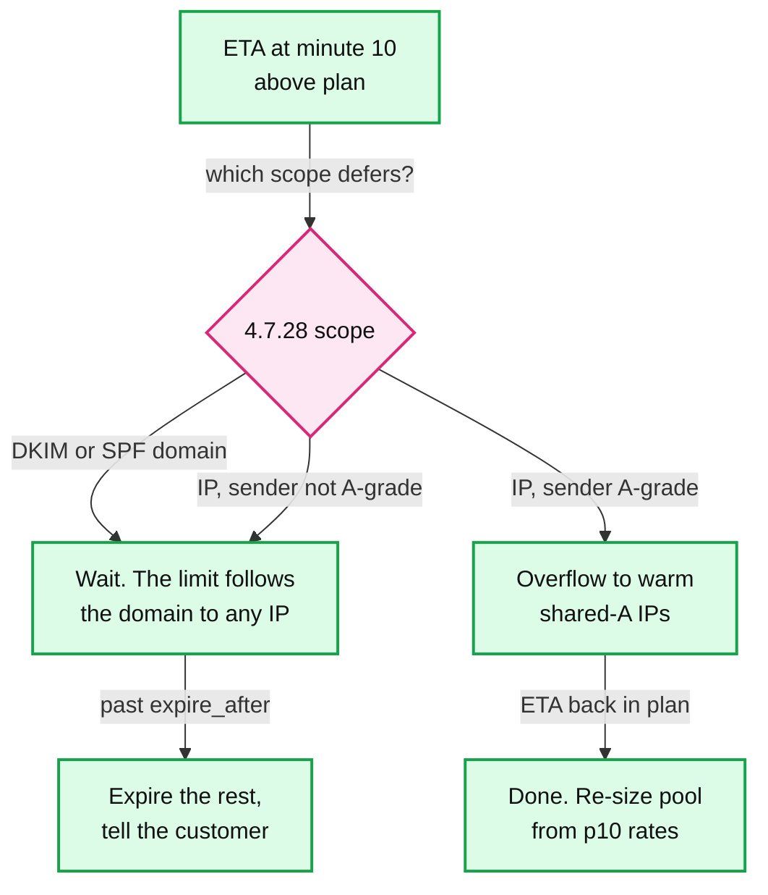

# Edge cases: Mailchimp campaign sending

Every entry answerable in under 60 seconds out loud. Categories: failure, consistency, scale, data, operations, security / abuse. Design reference: [`solution.md`](solution.md). An answer bullet that starts with **Decision:** goes past what solution.md states or changes it; the deep dives carry the numbers. Acronyms: MTA (mail transfer agent), RFC (Request for Comments), SPF (Sender Policy Framework), DMARC (Domain-based Message Authentication, Reporting and Conformance), CNAME (DNS alias record), B2B (business to business), MX (mail exchanger record), SMTP (Simple Mail Transfer Protocol), DKIM (DomainKeys Identified Mail), FBL (feedback loop), ARF (Abuse Reporting Format), DSN (delivery status notification), VERP (variable envelope return path), DRR (deficit round robin), AIMD (additive increase, multiplicative decrease), HMAC (hash-based message authentication code), KMS (key management service), ETA (estimated time of arrival), GDPR (EU General Data Protection Regulation).

---

## Failure

## Edge case: an MTA process crashes mid-send, disk intact
- **Trigger:** a bug or OOM (out of memory) kill on one of 200 hosts at 2,500 sends/s, ~300k messages in its spool.
- **Symptom:** ~2,000 SMTP connections drop; 25 IPs go quiet; "host down, spool not drained" alert.
- **Answer:**
  - Restart, replay the journal (~1 min [estimate]), rebuild the per-(IP, provider) queues. Everything acked to render was fsynced first, so nothing is lost.
  - Duplicates: messages Gmail committed whose `250` we had not read (~50 ms × 2,500/s ≈ 125) plus `250`s not yet in the 5 ms group commit (≤ 13). ~133 in the sim ([delivery dive](deep-dives/delivery-semantics-and-mta-failures.md) §4). At-least-once, said out loud.
  - Its buddy takes over only after the host's 3 s send lease expires plus a 30 s grace, so a quick reboot replays its own journal and stays at the floor.
- **Confidence:** [ ] shaky  [ ] ok  [ ] confident

## Edge case: an MTA host is lost with its disk
- **Trigger:** NVMe (non-volatile memory express) failure or a host that never boots again.
- **Symptom:** the spool's ~300k accepted messages are unreadable.
- **Answer:**
  - Each host replicates its small journal records to a buddy host in another rack: `accepted(id)` synchronously inside the 5 ms commit, before the inject is acked, and `done(id)` asynchronously, with SMTP paused if the buddy is over 500 behind. ~250 KB/s per host. Bodies are never replicated.
  - At t = 33 s (lease 3 s plus 30 s grace) the buddy takes the generation and the IPs, and re-renders accepted-not-done bodies from the snapshot: ~300k in ~18 s on 50 cores, streamed, so sending resumes ~34 s after the host died. 0 lost, ~128 duplicates, whatever Kafka does.
  - Why not re-inject from Kafka events: an inject is acked before its event reaches Kafka, so the last event-lag window is never listed and is **lost**. The sim showed ~257 lost and ~377 duplicated at a 50 ms median lag, ~112k of each at 30 s ([delivery dive](deep-dives/delivery-semantics-and-mta-failures.md) §2).
- **Confidence:** [ ] shaky  [ ] ok  [ ] confident

## Edge case: the old host comes back after its mail was re-sent elsewhere
- **Trigger:** h7 reboots at minute 3; the re-injector already moved its spool at minute 2.
- **Symptom:** without a fence, h7 replays its journal and sends its whole spool again: up to ~300k duplicates.
- **Answer:**
  - A host may send only while it holds a send lease (renewed every 1 s, valid 3 s) for its current generation. Takeover bumps the generation. A rebooted host registers first, learns it is stale, and deletes its spool.
  - The IPs move only after the old lease expired, so two hosts never announce one address.
- **Diagram:**

- **Confidence:** [ ] shaky  [ ] ok  [ ] confident

## Edge case: the quota service is unreachable
- **Trigger:** a network split between the MTAs and the 3 to 5 quota nodes, or all of them restarting.
- **Symptom:** leases for global keys (pool, DKIM domain, netblock, URL domain) stop.
- **Answer:**
  - Leases run out in 2 s. Each MTA then runs every global key at its last leased rate × 0.5 for 5 minutes, then one connection per key. Local (IP, provider) AIMD continues. Mail slows; it never speeds past what Gmail last accepted.
  - Page at 1 minute unreachable. State is soft: on return, the MTAs' next reports rebuild every key in about a second.
- **Confidence:** [ ] shaky  [ ] ok  [ ] confident

## Edge case: Kafka is down for 12 minutes
- **Trigger:** a broker-side incident on the cluster that carries `suppressions` and `delivery-events`.
- **Symptom:** suppressions stop reaching render and MTA filters; stats and the streaming abuse loop go blind.
- **Answer:**
  - Every MTA and render worker pulls the suppression store's `created_at` index every 2 s: ~150 range reads/s fleet-wide, the filter stays fresh, only its positives go remote. Confirming every message instead would need ~100k reads/s at the egress peak ([suppression dive](deep-dives/bounces-complaints-and-suppression.md) §5).
  - The abuse loop is blind, so canary and probation sends hold until it is back, and each MTA keeps local per-campaign bounce counters so the 5% and 10% lines still act on its own sample.
  - Events buffer on local disk and replay; a lost disk in this window is covered by the buddy, not by the events.
- **Diagram:**

- **Confidence:** [ ] shaky  [ ] ok  [ ] confident

## Edge case: the suppression store is down
- **Trigger:** the KV (key-value) cluster that holds ~3 B+ suppression rows loses quorum.
- **Symptom:** one-click POSTs cannot be written; filter positives cannot be confirmed.
- **Answer:**
  - Feedback ingest writes the suppression to the `suppressions` topic and a local log, and still answers `200`; the writer replays into the store when it returns.
  - MTAs keep their filters fresh from Kafka. Filter positives (~1% of mail) are held, not sent.
  - Both store and Kafka down: ingest answers `503` so the provider retries the POST, and MTAs hold all mail after 60 s and page.
- **Confidence:** [ ] shaky  [ ] ok  [ ] confident

## Edge case: Gmail is slow, not down
- **Trigger:** Gmail takes ~30 s to answer the final dot instead of ~150 ms, with no 4xx.
- **Symptom:** throughput on (IP, google) falls from ~60/s to under 1/s per IP; AIMD sees no deferrals and does nothing.
- **Answer:**
  - Little's law: 20 connections ÷ 30 s ≈ 0.7/s per IP. Do not open more connections: that is the burst Google asks senders to avoid.
  - Never time out the final dot before 10 minutes (RFC 5321 §4.5.3.2.6): a spurious timeout there "would typically result in delivery of multiple copies".
  - The dispatcher's credit subtracts what is queued, so release stops by itself; the ETA on the campaign page moves.
- **Confidence:** [ ] shaky  [ ] ok  [ ] confident

## Edge case: DNS resolvers return SERVFAIL for an hour
- **Trigger:** our caching resolvers, or a big provider's authoritative servers, fail.
- **Symptom:** MX lookups fail for some domains; new domains cannot be mapped to a provider.
- **Answer:**
  - `SERVFAIL` and timeouts are deferrals: the message stays queued, spends no attempt, counts nothing against the key. Only `NXDOMAIN` or a null MX (RFC 7505) bounces.
  - The domain-to-provider map and the MTA resolvers serve stale entries past TTL (time to live) while the authority fails.
- **Confidence:** [ ] shaky  [ ] ok  [ ] confident

## Edge case: one site is lost mid-campaign
- **Trigger:** site A goes dark at 10:30 with the control-plane primary and half of every pool's IPs.
- **Symptom:** every pool runs on half its IPs; campaign DB fails over to site B.
- **Answer:**
  - Rates halve: the 20 M campaign's Google pipe goes from 1.85 h to ~3.7 h. Receivers see fewer IPs, not new ones.
  - The scheduler starts are idempotent by state compare-and-set, so a double start is a no-op. Cross-site replication is asynchronous, so ~1 s of chunk checkpoints can be lost; those batches are re-injected.
  - Site A's spools are a lost-disk case with no buddy: buddies, IPs and site A's Kafka all live in site A. So each site mirrors a compact final-id stream (~50 B per message, ~5 MB/s at a 100k/s peak) to the other. Site B knows from intent rows what went to site A and from the mirror what was delivered, re-renders the rest and sends it from its own IPs: about one mirror lag (~1 s) of mail is re-sent. If the site returns instead, journals replay at the floor ([delivery dive](deep-dives/delivery-semantics-and-mta-failures.md) §6).
- **Confidence:** [ ] shaky  [ ] ok  [ ] confident

---

## Consistency

## Edge case: she unsubscribes at 10:01 and her message is queued since 10:00:30
- **Trigger:** one-click POST from Gmail while the campaign is draining.
- **Symptom:** the message was rendered before she clicked.
- **Answer:**
  - Suppression row and outbox in ~10 ms, `200`. Kafka by ~10:01:02, every MTA's filter by ~10:01:05.
  - At 10:05 her message reaches the head of its queue: filter says maybe, store confirms, dropped as `suppressed`.
  - Residual: a message already inside an SMTP transaction during those ~5 s. And Gmail itself sends later mail from that sender "directly to Spam" after an unsubscribe, so a miss costs placement, not only compliance.
- **Confidence:** [ ] shaky  [ ] ok  [ ] confident

## Edge case: a render worker crashes mid-batch while the pool gains a host
- **Trigger:** worker W1 injected 300 of 500 to h2 and died; before its lease expired, h5 joined the pool.
- **Symptom:** routed by rendezvous hash over the current hosts, 94 of 500 ids of the retried batch would map to h5, which never saw them; those already accepted by h2 would go out twice (real hashing in the [delivery dive](deep-dives/delivery-semantics-and-mta-failures.md) §4).
- **Answer:**
  - Before injecting, the worker writes the target host on the chunk row (`inflight_batch`, `target_host`, `host_gen`), fenced by its lease epoch. The next owner sends the retry to that host or its successor; the spool index (5 days) drops known ids.
  - Rendezvous stays only as the default for fresh batches. Cost: one small write per 500 messages, ~400/s at the 200k/s peak.
- **Diagram:**

- **Confidence:** [ ] shaky  [ ] ok  [ ] confident

## Edge case: two scheduler replicas start the same campaign
- **Trigger:** failover at 10:00:00 while the old leader is still scanning the due index.
- **Symptom:** two snapshots, two sets of chunks, every recipient twice.
- **Answer:**
  - Start is a compare-and-set `SCHEDULED → SNAPSHOTTING` on the campaign row; the loser stops.
  - Chunk paths are `(campaign, provider, chunk_no)` and message ids are deterministic, so even a re-run snapshot overwrites the same files with the same ids.
- **Confidence:** [ ] shaky  [ ] ok  [ ] confident

## Edge case: the customer cancels at 10:20
- **Trigger:** a wrong price in the email.
- **Symptom:** up to 10 minutes of rendered mail is in MTA queues; some messages are mid-transaction.
- **Answer:**
  - The dispatcher stops releases at once. A cancelled-campaign set is pushed to MTAs like a suppression and checked before SMTP: queued messages are purged in ~10 s.
  - What is in flight goes. What is left is unrendered rows, so a corrected campaign is a new send to "recipients of c_42 not yet delivered".
- **Confidence:** [ ] shaky  [ ] ok  [ ] confident

## Edge case: a re-subscribe races an old unsubscribe event
- **Trigger:** she unsubscribed Monday, re-joined through double opt-in Wednesday; a Kafka replay re-delivers Monday's event Thursday.
- **Symptom:** a naive upsert suppresses her again.
- **Answer:**
  - The re-join sets `lifted_at`, never deletes. The row's state is the latest of `created_at` and `lifted_at`, so an older event cannot win.
  - The Bloom filter cannot delete and still says "maybe"; the confirm read sees `lifted_at` and sends.
- **Confidence:** [ ] shaky  [ ] ok  [ ] confident

## Edge case: the same person is in the list three times
- **Trigger:** `Ann@Gmail.com`, `ann@gmail.com` and `a.nn@gmail.com` imported from three sources.
- **Symptom:** three messages, likely one complaint.
- **Answer:**
  - The snapshot dedups on a normalized address: lowercase the domain, trim. That merges the first two.
  - **Decision:** do not strip dots or `+tags` globally. Dots are ignored for consumer Gmail only ("If you use Gmail through work, school, or other organization ... dots do change your address", [Gmail help](https://support.google.com/mail/answer/7436150)), and a `+tag` is often a deliberate second subscription. Dot-folding for `gmail.com` alone is a product choice, behind a flag.
- **Confidence:** [ ] shaky  [ ] ok  [ ] confident

## Edge case: a company moves its mail to Google during the campaign
- **Trigger:** `contoso.com` switches MX from Microsoft to Google at 10:30; its chunks were cut as `microsoft` at 09:50.
- **Symptom:** the chunk says one provider, the MX says another.
- **Answer:**
  - The MTA keys its queue on the MX it resolves at send time, so the message is throttled by `google`. Only the dispatcher's credit is off, by the messages of that one domain.
  - The provider map refreshes on DNS TTL for the next snapshot.
- **Confidence:** [ ] shaky  [ ] ok  [ ] confident

## Edge case: a deferred message is retried after its campaign expired
- **Trigger:** a flash sale with `expire_after = 6 h`; a recipient's mailbox was full and the 2 h retries run past it.
- **Symptom:** a "sale ends tonight" email arrives tomorrow.
- **Answer:**
  - Every retry checks `expire_at` first; past it, the message ends as `expired` with an event, never sent.
  - Default expiry is `send_at + 4 days`, inside RFC 5321's "at least 4-5 days" give-up guidance.
- **Confidence:** [ ] shaky  [ ] ok  [ ] confident

---

## Scale

## Edge case: a 20 M campaign and 5,000 others start at 10:00
- **Trigger:** a round hour in US mornings, ~100 M recipients due at once [estimate].
- **Symptom:** the big send's 2,000 chunks would sit in front of every small campaign.
- **Answer:**
  - Big lists snapshot at 09:50; small ones in under 5 s on their own lane. Render scales up at 09:55 from the calendar.
  - Every (campaign, provider) gets a free 500-recipient chunk 0 at `send_at`: at most ~7.5 M messages outside credit, ~1.9 GB per MTA host.
  - Then DRR per (pool, provider): a 5,000-recipient send finishes in minutes, the 20 M one in ~2 h.
- **Confidence:** [ ] shaky  [ ] ok  [ ] confident

## Edge case: Gmail accepts half the per-IP rate we planned
- **Trigger:** the pool's real Gmail acceptance is ~30/s per IP, not 60/s. The plan's number was an estimate.
- **Symptom:** the 20 M campaign's Google pipe needs 3.7 h, not 1.85 h.
- **Answer:**
  - Nothing breaks: credit follows the allowed rate, the rendered queue shrinks to 360k, the backlog waits as rows.
  - The campaign shows a live ETA from minute 10 (`remaining ÷ allowed rate`, worst provider): 3.70 h. Past `send_at + 4 h` or `expire_after`, the deliverability owner is told.
  - Levers: wait; split the send; overflow to warm shared-A IPs only for an A-grade sender and only if the deferrals are IP-scoped. Never cold IPs. Next time, size pools from the 10th percentile of measured rates ([fan-out dive](deep-dives/campaign-fan-out-and-scheduling.md) §4).
- **Diagram:**

- **Confidence:** [ ] shaky  [ ] ok  [ ] confident

## Edge case: Black Friday at 5x on one dedicated pool
- **Trigger:** the 20 M sender sends 5 × 20 M on one day from the same 20 IPs.
- **Symptom:** at the plan's 60/s and 40% Google, Google needs 9.3 h; at 30/s and a 60% Gmail list, 27.8 h: it does not fit the day.
- **Answer:**
  - Receivers do not scale for us, and Google warns that "immediately doubling previously sent volumes suddenly could result in rate limiting", so Friday's per-IP rate is likely below Tuesday's.
  - A dedicated sender's forecast peak day must fit in 12 h at the p10 measured rate. Extra IPs start warming in early October (~41 days), and the customer ramps volume through November.
  - The fleet is not the limit: 5,000 IPs × ~150/s (Google-bound) is ~750k/s at plan rates, ~375k/s at half, against a ~500k/s host ceiling; a 5x day averages ~116k/s. One sender's 20 IPs are the limit.
  - On the day: transactional untouched, DRR within pools, `expire_after` on time-boxed offers, no cold IPs.
- **Confidence:** [ ] shaky  [ ] ok  [ ] confident

## Edge case: the dispatcher's valve shuts itself
- **Trigger:** a key's MTA queue runs dry (render was slow for a minute, or a long-tail key has little demand).
- **Symptom:** with credit computed from the *measured* drain rate, an empty queue measures ~0 (drain is `min(allowed, supply)`), credit goes to ~0, nothing is released, and drain stays ~0.
- **Answer:**
  - That is why credit = the quota service's allowed rate for the key × 600 s − (queued + rendering), and a chunk is released whenever the key has nothing queued and is not paused.
  - Measured drain stays a dashboard number; the ETA also uses the allowed rate.
- **Confidence:** [ ] shaky  [ ] ok  [ ] confident

## Edge case: background 4.7.28s on a 1,000-IP pool
- **Trigger:** a few IPs of shared pool B get IP-scoped 4.7.28s every minute, as background noise.
- **Symptom:** a pool rule of "3 IPs within 60 s" would fire: at one hit per IP per day [estimate], pool B sees ~0.7 hits a minute, P(3 or more in a minute) is 3.4%, ~48 false halvings a day, each slowing ~10k senders.
- **Answer:**
  - (pool, google) halves only when IP-scoped hits reach 5% of the pool's active IPs within 60 s, or the pool's merged deferral rate passes 2%. That is 5 IPs on pool C (~100 IPs), 50 on pool B ([throttling dive](deep-dives/per-domain-throttling.md) §4).
  - Below that, each hit pauses only its own (IP, google) key.
- **Confidence:** [ ] shaky  [ ] ok  [ ] confident

## Edge case: the biggest tenant has 100 M contacts and 50 M suppressions
- **Trigger:** one account's newsletter to its whole audience.
- **Symptom:** the snapshot scan and the suppression anti-join are 5x the 20 M case.
- **Answer:**
  - Snapshot start is sized by count: `rows ÷ scan rate × 2`, so ~200 s of scan means starting at `send_at − 7 min` or earlier.
  - Suppressions are spread over 64 buckets per account, so the anti-join reads 64 partitions in parallel, not one hot partition.
  - It needs a dedicated pool sized for 100 M (~40 M to Google ≈ 92 IPs at 60/s for a 2 h send), or its customer accepts ~9 h on 20 IPs.
- **Confidence:** [ ] shaky  [ ] ok  [ ] confident

## Edge case: a mail filter fronts 20,000 corporate domains
- **Trigger:** a B2B list where many domains' MX is a filtering service such as `*.pphosted.com`.
- **Symptom:** one key, `mx:pphosted.com`, carries mail for thousands of companies.
- **Answer:**
  - That is the right key: the filter enforces its own limits on our IPs, like Gmail. Keying per recipient domain would open thousands of connections into it.
  - DRR per account inside the key keeps one big B2B sender from starving the others. Its rate is learned like any provider's.
- **Confidence:** [ ] shaky  [ ] ok  [ ] confident

---

## Data

## Edge case: a GDPR erasure request
- **Trigger:** a recipient asks the customer, or us, to erase her data.
- **Symptom:** she must disappear, but she must also never be mailed again.
- **Answer:**
  - Delete the contact, her rows in snapshot files (deleted 7 days after expiry anyway) and her events in the lake by account and contact id.
  - Keep the hashed suppression: it holds no address, and it is what keeps her opted out if the customer re-imports an old list.
- **Confidence:** [ ] shaky  [ ] ok  [ ] confident

## Edge case: the suppression hashing key must rotate
- **Trigger:** a security review asks for key rotation, or the key may have leaked.
- **Symptom:** rows are keyed by `HMAC(key, email)`. Rehashing needs the plaintext, which the store does not keep.
- **Answer:**
  - Treat it like a root key: in KMS, used only inside the writer and the checkers.
  - Rotation is a dual-key period: write and check both hashes, re-key each row when its address is seen again (send, import, POST). It takes months; rows never seen again keep the old key.
  - A leaked key lets an attacker test whether an address is suppressed; it does not reveal addresses.
- **Confidence:** [ ] shaky  [ ] ok  [ ] confident

## Edge case: a receiver answers 5.1.1 for real users during its own incident
- **Trigger:** a provider bug returns "account does not exist" for valid mailboxes for 40 minutes.
- **Symptom:** millions of good addresses would become hard-bounce suppressions across every account.
- **Answer:**
  - **Decision:** a platform guard. If one provider's 5.1.1 rate across all accounts runs over 5x its 7-day baseline for 10 minutes [estimate], new 5.1.1s from it are quarantined (retried in 24 h), not suppressed, and the deliverability on-call is paged.
  - Already-written ones are reversed by `source_message_id` time range. One customer's bad list cannot trip it: it moves that account's rate, not the provider's.
- **Confidence:** [ ] shaky  [ ] ok  [ ] confident

## Edge case: the message id format changes
- **Trigger:** a new id layout (for example, adding a region).
- **Symptom:** DSNs for old ids arrive for 4 more days; unsubscribe tokens in old mail are clicked for a year.
- **Answer:**
  - Ids and tokens carry a version prefix and a key id. Decoders accept every version and every HMAC key from the last year; encoders emit only the newest.
  - CAN-SPAM requires the unsubscribe mechanism to work "at least 30 days" after the send; we keep a year.
- **Confidence:** [ ] shaky  [ ] ok  [ ] confident

## Edge case: three years of suppressions
- **Trigger:** growth at the stated rates.
- **Symptom:** at ~24 M new rows a day the store adds ~8.8 B rows (~560 GB) a year, ~1.7 TB after three years.
- **Answer:**
  - Still one ordinary KV cluster; partitions by `(account, bucket)` keep it even. The MTA filter holds only 5 days, so its size does not grow.
  - The platform-wide 90-day bounce set used at import is separate and bounded (~1.8 B entries at most [estimate]).
- **Confidence:** [ ] shaky  [ ] ok  [ ] confident

## Edge case: the 5-day Bloom filter has to forget
- **Trigger:** a Bloom filter cannot delete, and "the last 5 days" must drop old entries.
- **Symptom:** six daily slices sized like one 144 MB filter (9.6 bits per entry) would give ~5.9% false positives: ~1,380 confirm reads/s.
- **Answer:**
  - Six daily slices, oldest dropped at midnight, each at ~14 bits per entry: ~259 MB per host, 0.65% measured, ~150 confirm reads/s ([suppression dive](deep-dives/bounces-complaints-and-suppression.md) §5).
  - The alternative is to rebuild one filter nightly from the store and ship it to every host.
- **Confidence:** [ ] shaky  [ ] ok  [ ] confident

---

## Operations

## Edge case: what pages at 3 AM
- **Trigger:** Gmail starts answering `550 5.7.1 ... very low reputation` for shared pool B.
- **Symptom:** a block, not a throttle: every sender on pool B fails at Gmail.
- **Answer:**
  - Pages: 5xx blocks above 1% at a major provider for a pool for 5 minutes; Google deferrals above 20% of a pool for 15 minutes; scheduler lag over 2 min; suppression lag over 30 s on any MTA; a host down with an undrained spool; quota service unreachable 1 min.
  - Runbook: pause (pool B, google), rank pool B's accounts by share of Gmail traffic × bounce and complaint rates, move the top ones to pool C, then resume with one connection.
  - A single auto-paused campaign is a customer notice and a ticket, not a page.
- **Confidence:** [ ] shaky  [ ] ok  [ ] confident

## Edge case: a bad abuse threshold pauses 2,000 good senders at 10:00
- **Trigger:** a config push sets the complaint line to 0.03% instead of 0.3%.
- **Symptom:** a wave of auto-pauses and support tickets in minutes.
- **Answer:**
  - Thresholds are config with a canary: one pool, alert-only for an hour, compared with the old rule's decisions.
  - Bulk resume from the reputation console by change id. The paused campaigns' remaining work is unrendered rows, so nothing re-renders; their delay is the outage.
- **Confidence:** [ ] shaky  [ ] ok  [ ] confident

## Edge case: rolling out new AIMD constants
- **Trigger:** deliverability wants +3% steps instead of +2%.
- **Symptom:** a too-aggressive step earns 4.7.28 storms across a pool.
- **Answer:**
  - Config per pool, never in the 09:00 to 12:00 US Eastern peak. One shared-B slice first for 24 h, compared with its peers on deferral rate and accepted per hour.
  - Each key starts from its stored `last_good_rate`, so a rollback does not throw away what was learned.
- **Confidence:** [ ] shaky  [ ] ok  [ ] confident

## Edge case: migrating from static per-domain throttles
- **Trigger:** today's MTAs use hand-set rates per recipient domain and nightly bounce jobs.
- **Symptom:** a big-bang switch could change every IP's sending pattern on one day.
- **Answer:**
  - Shadow first: provider keys and per-key metrics, then the quota service in observe mode compared with the static configs.
  - Adaptive throttling on one shared-B pool for a week, then the rest, dedicated pools last with the customer told. A per-pool flag is the rollback; MTAs keep both paths until the end.
  - Never in the six weeks before Black Friday: that window is for warming IPs.
- **Confidence:** [ ] shaky  [ ] ok  [ ] confident

## Edge case: Gmail throttles our shared click-tracking domain
- **Trigger:** `421 4.7.28 ... containing one of your URL domains` for the link domain shared by every sender without a branded one.
- **Symptom:** every message with that domain slows at Gmail, across all shared pools.
- **Answer:**
  - The (URL domain, google) key pauses 10 minutes, then ramps; senders with branded link domains are unaffected.
  - Every paying tier has a branded link domain, so one customer's bad list throttles its own link domain. Only accounts without one (free, on pool C [estimate]) share this domain.
- **Confidence:** [ ] shaky  [ ] ok  [ ] confident

## Edge case: Gmail names our own DKIM signing domain in a 4.7.28
- **Trigger:** every message carries a second DKIM signature with our domain (for Yahoo's CFL and Gmail's FBL); Gmail answers `421 4.7.28 ... from your DKIM domain` naming it.
- **Symptom:** with one shared signer domain, the key (our signer domain, google) would span every customer on every pool: all Gmail traffic would pause for 10 minutes.
- **Answer:**
  - A signer domain is a shared reputation unit, like the tracking domain. Treat the hit as a signal for that tier's pool and find the sender with the pool health attribution.
  - That is why the second signer is one domain per pool tier (A, B, C, dedicated, transactional): a 4.7.28 naming it pauses only that tier's (signer domain, google) key, and pool C's complaints never reach shared A's signer ([reputation dive](deep-dives/reputation-and-ip-pools.md) §4).
- **Confidence:** [ ] shaky  [ ] ok  [ ] confident

## Edge case: a pool IP lands on a major blocklist
- **Trigger:** a spam-trap hit traced to one sender on shared pool B.
- **Symptom:** providers that use the list reject from that IP; the IP's state goes `Listed`.
- **Answer:**
  - Drain the IP: its traffic moves to the pool's other IPs (warm, same pool). Find the sender from the trap's message id if the listing shows it, or from the IP's top senders that day.
  - Remove the cause, request delisting, re-warm the IP before it returns to full rate.
- **Confidence:** [ ] shaky  [ ] ok  [ ] confident

---

## Security / abuse

## Edge case: a purchased list that does not bounce
- **Trigger:** a new account imports 1 M scraped but valid addresses. Bounces stay under 2%.
- **Symptom:** the 5k probe passes (it watches bounces). Complaints need a human to open the mail: 15 minutes sees ~6% of them [4 h read mean, estimate]. Gmail's FBL is daily and @gmail.com only. With the probe and stream rule alone, the pause came at minute ~142, after the list finished at minute ~50, leaving ~3,200 Gmail spam reports on pool C.
- **Answer:**
  - New and risky campaigns go out as a canary of `min(10k, 20%)`, a hashed sample, held up to 2 h and judged on one-click unsubscribes (every provider, Gmail included), Yahoo and Microsoft FBL complaints, human clicks, seed mailboxes and any DKIM-scoped 4.7.28.
  - In the sim it caught the bad list in 100% of trials with 0.3% false holds, and cut Gmail reports ~100x, to ~32 ([reputation dive](deep-dives/reputation-and-ip-pools.md) §6). Cost: a ~2 h delay for ~3% of campaigns [estimate].
- **Confidence:** [ ] shaky  [ ] ok  [ ] confident

## Edge case: an account takeover sends 5 M phishing emails
- **Trigger:** a stolen API key on a good account with a good pool.
- **Symptom:** a phishing campaign with a high-reputation sender's name.
- **Answer:**
  - Hold for review: a new login plus a new key plus a send far above the account's history, or content the classifier flags (brand impersonation, credential forms).
  - Sends only from verified domains; a "5x the largest send in 90 days" campaign gets a canary anyway.
  - Blast radius if it slips: the account's own DKIM domain and dedicated IPs, paused on the first complaints or seed hits.
- **Confidence:** [ ] shaky  [ ] ok  [ ] confident

## Edge case: someone forges one-click POSTs to unsubscribe a competitor's list
- **Trigger:** a script POSTs guessed tokens.
- **Symptom:** mass unsubscribes from one account.
- **Answer:**
  - The token is `(account, audience, contact, campaign)` plus an HMAC; RFC 8058 asks for "a hard-to-forge component". A guessed token fails the check and writes nothing.
  - Rate limits per source IP on `/u/`, and an alert when one account's unsubscribe rate jumps 10x without a send.
- **Confidence:** [ ] shaky  [ ] ok  [ ] confident

## Edge case: link scanners click every link
- **Trigger:** corporate security gateways fetch every URL in a message seconds after delivery.
- **Symptom:** inflated clicks, and a GET-based unsubscribe would unsubscribe everyone.
- **Answer:**
  - `GET /u/{token}` only shows a preference page; only the RFC 8058 POST acts. RFC 8058 itself notes GETs are easy to provoke "due to spam filter auto-fetches".
  - Clicks within ~10 s of delivery, on every link of a message, or from known scanner ranges are `machine`, like Apple MPP (Mail Privacy Protection) opens. Engagement signals and the canary use human clicks only.
- **Confidence:** [ ] shaky  [ ] ok  [ ] confident

## Edge case: a competitor complaint-bombs a sender
- **Trigger:** someone signs up 5,000 Gmail and Yahoo accounts to a rival's list, then marks every email as spam.
- **Symptom:** the rival's complaint rate jumps; our loop may pause them.
- **Answer:**
  - Signups through double opt-in only, with per-source-IP limits and a CAPTCHA (challenge test) on spikes.
  - Complaints are weighted by subscriber age: a burst from addresses that joined in the last 7 days goes to review instead of auto-pause.
  - Gmail counts them anyway; we cannot undo that, only detect it and remove the fake subscribers.
- **Confidence:** [ ] shaky  [ ] ok  [ ] confident

## Edge case: a DKIM key leaks from render worker memory
- **Trigger:** a memory-disclosure bug in a render worker.
- **Symptom:** an attacker can sign mail as `shop.com`, and with our own second-signer key, as us: forged mail that carries a valid `Feedback-ID` signature.
- **Answer:**
  - Keys are KMS-wrapped and decrypted only in signer memory, never on disk. **Decision:** decrypt a customer key only when the worker first renders that customer's campaign, keep it in an LRU (least recently used) cache with a 1 h TTL, so a leak is bounded to keys used on that worker recently. Second-signer keys are per tier, so a worker holds only the tier keys it signs for, and a leak is bounded to those tiers.
  - Rotation is ours alone: the customer's `mc1._domainkey` is a CNAME to our key host, so we publish a new key and switch selectors without the customer. DMARC aggregate reports show mail signed from IPs that are not ours.
- **Confidence:** [ ] shaky  [ ] ok  [ ] confident

## Edge case: a verified domain expires and someone else registers it
- **Trigger:** the customer lets `shop-promo.com` lapse; an attacker buys it and opens an account with us.
- **Symptom:** two accounts claim the same domain, and the old account's sends now pass someone else's DNS.
- **Answer:**
  - Verification is re-checked daily: the DKIM and return-path CNAMEs must still point at us with the account's selector. A broken check blocks new sends from that domain.
  - A domain moves to a new account only after the old verification lapsed, with a fresh DNS proof, and the old account's queued mail from it is purged.
- **Confidence:** [ ] shaky  [ ] ok  [ ] confident
