# HLD: Mailchimp campaign sending

> One-line answer: a campaign send is a fan-out (one campaign to millions of recipients) that must drain through thousands of **narrow pipes**, one per (sending IP or pool, receiving mailbox provider). At send time the audience is frozen into a recipient snapshot, split into chunks per provider, rendered per recipient (merge tags, a signed one-click unsubscribe link, tracking), and each message is queued by the recipient's **mailbox provider**, resolved from MX (mail exchanger) records, so a Google Workspace domain shares Gmail's limits. MTAs (mail transfer agents) drain those queues under per-pipe connection and rate limits that adapt to what the receiver says: 2xx keeps the rate, 4xx deferrals cut it (AIMD, additive increase multiplicative decrease), block codes pause the pool and page. A dispatcher releases work only as fast as each pipe is allowed to drain, so the backlog waits as cheap unrendered rows, not as rendered mail. Reputation is protected by **IP pools** grouped by sender quality, warm-up for new IPs, DKIM (DomainKeys Identified Mail) signing with the customer's domain, an abuse loop that pauses an account within about a minute of its bounce rate crossing a threshold, and a **canary** for new and risky campaigns (a hashed sample of up to 10k recipients, held up to 2 h and judged on unsubscribes, Yahoo and Microsoft complaints and seed mailboxes, because Gmail reports complaints only daily), so one bad list cannot burn a shared pool. The thing that breaks first is the receiver's patience, not our hardware.

Sources: the problem statement and requirements in [`README.md`](README.md); the agent survey [`research/facts-survey.md`](research/facts-survey.md) (several of its numbers were wrong or unsourced; the corrections are listed at the end of §10.8). Primary pages I opened for the numbers that carry the design: Google's [Email sender guidelines](https://support.google.com/mail/answer/81126) and its [FAQ](https://support.google.com/a/answer/14229414), Google's [SMTP error reference](https://support.google.com/mail/answer/3726730), Google's [Feedback Loop page](https://support.google.com/mail/answer/6254652), Yahoo's [sender best practices](https://senders.yahooinc.com/best-practices/), Microsoft's [Outlook high-volume sender announcement](https://techcommunity.microsoft.com/blog/microsoftdefenderforoffice365blog/strengthening-email-ecosystem-outlook%E2%80%99s-new-requirements-for-high%E2%80%90volume-senders/4399730) (read through the Wayback Machine), [RFC 5321](https://www.rfc-editor.org/rfc/rfc5321.txt) §4.5.3.2.6, §4.5.4.1 and §6.1, [RFC 8058](https://www.rfc-editor.org/rfc/rfc8058.txt), the [Postfix parameter reference](https://www.postfix.org/postconf.5.html), the [Amazon SES enforcement FAQ](https://docs.aws.amazon.com/ses/latest/dg/faqs-enforcement.html), [SES FAQ](https://aws.amazon.com/ses/faqs/) and [pricing](https://aws.amazon.com/ses/pricing/), Twilio SendGrid's [IP warm-up page](https://www.twilio.com/docs/sendgrid/ui/sending-email/warming-up-an-ip-address), Apple's [Mail Privacy Protection page](https://support.apple.com/guide/iphone/use-mail-privacy-protection-iphf084865c7/ios), and the [FTC CAN-SPAM guide](https://www.ftc.gov/business-guidance/resources/can-spam-act-compliance-guide-business). Anything I could not open is marked `[estimate]` or `[unverified]`. Reusable blocks: [`../../concepts/fan-out-fan-in.md`](../../concepts/fan-out-fan-in.md), [`../../concepts/rate-limiting-and-load-shedding.md`](../../concepts/rate-limiting-and-load-shedding.md), [`../../concepts/leases-fencing-clocks.md`](../../concepts/leases-fencing-clocks.md), [`../../concepts/bloom-filter.md`](../../concepts/bloom-filter.md), [`../../concepts/exactly-once.md`](../../concepts/exactly-once.md), [`../../concepts/sharding.md`](../../concepts/sharding.md), [`../../concepts/stream-processing.md`](../../concepts/stream-processing.md). Related problems: [`../network-throttling/`](../network-throttling/) (rate limiting), [`../credit-score-alerts/`](../credit-score-alerts/) (fan-out), [`../distributed-job-scheduler/`](../distributed-job-scheduler/) (timed starts).

Written flow-first: §4 builds one diagram one functional requirement at a time, §5 breaks and mutates it one non-functional requirement at a time, §6 shows the final design and the six flows to rehearse.

Acronyms used throughout: SMTP (Simple Mail Transfer Protocol), MX (mail exchanger DNS record), MTA (mail transfer agent), SPF (Sender Policy Framework), DKIM (DomainKeys Identified Mail), DMARC (Domain-based Message Authentication, Reporting and Conformance), FBL (feedback loop: a provider's stream of "this is spam" reports), ARF (Abuse Reporting Format, RFC 5965), DSN (delivery status notification, a bounce message), VERP (variable envelope return path: a per-message bounce address), DRR (deficit round robin), ESP (email service provider), MPP (Apple Mail Privacy Protection), KMS (key management service), HSM (hardware security module), DNS (Domain Name System), TLS (Transport Layer Security), SES (Amazon Simple Email Service), SLO (service level objective), GDPR (the EU General Data Protection Regulation).

---

## 1. Understanding the problem

Three facts shape every decision. Say all three in the first minute:

1. **The receiver sets the speed, not us.** A 20 M recipient campaign is about 8 M messages to Google alone. Google tracks "volume, feedback, and limits per domain and IP address", and tells senders to "limit sending email from a single IP address based on the MX record domain, not the domain in the recipient email address" ([Google sender guidelines](https://support.google.com/mail/answer/81126)). It does not publish the number. So the core of the design is a few thousand narrow pipes, one per (our IP, their provider), with rates learned from SMTP replies. Our CPUs idle at ~5% while queues wait on Gmail.
2. **Reputation is shared, and one sender can spend it for everyone.** Google again: "The IP address quota is shared for all senders that use that IP address. When the IP address hits its quota, all domains that send from that IP address stop sending emails." On a shared pool, one customer's purchased list throttles thousands of innocent senders. Protection has to act upstream: pools by quality, probe sends and auto-pause for bounces (seconds), and a canary for complaints, which Gmail reports only a day later.
3. **Email has no exactly-once and no recall.** A receiver's `250 OK` after DATA means it "is accepting responsibility for delivering" the message ([RFC 5321 §6.1](https://www.rfc-editor.org/rfc/rfc5321.txt)). If that 250 is lost, we resend and the recipient gets a duplicate. Once accepted, a message cannot be pulled back. So correctness means checking suppression right before the last irreversible step, and stating the duplicate window honestly.

### 1.1 Functional requirements

Core (from the README):
1. **Send a campaign.** At a scheduled time (or per recipient local time), resolve the audience segment, render a personalized message per recipient, and deliver it.
2. **Throttle per receiver.** Never exceed what each mailbox provider accepts from each of our IPs. Adapt to its responses.
3. **Protect reputation.** Authenticate every message (SPF, DKIM, DMARC alignment), place senders in IP pools by quality, warm new IPs, and stop abusive senders fast.
4. **Close the loop.** Process bounces, deferrals, complaints (feedback loops) and unsubscribes into a suppression list that every future send honors, and report delivery stats to the customer.

Below the line (say it out loud):
- **The campaign editor, templates and segmentation queries.** We consume a frozen list and a content version.
- **Automation journeys** (welcome series, abandoned cart). They reuse the sending pipeline with a different trigger.
- **Transactional email.** A separate product with its own IP pools and the highest priority. Mentioned only because it must never wait behind a campaign.
- **SMS and inbound mail** (except the bounce and FBL mailboxes we run ourselves).

### 1.2 Non-functional requirements

Ask for scale first: messages per day, the largest campaign, how peaky the schedule is, the provider mix, how many sending IPs exist today. Then:

| Dimension | Target | Why it matters |
|---|---|---|
| Scale | ~2 B messages/day [estimate], avg ~23k/s. Round-hour peaks ~200k/s for minutes. Largest campaign ~20 M. Black Friday week designed for 5x a normal day (a ceiling, not a forecast) [estimate] | The inject side is bursty. The egress side is capped by receivers, so bursts become queues |
| Campaign start | First messages accepted by an MTA within 1 min of the scheduled time. A 20 M campaign fully attempted within ~2 h on a pool sized for it (~20 IPs to Google), unless receivers defer | "My sale email went out an hour late" is the most common complaint. The 2 h is set by Gmail's per-IP acceptance, not by us, and is an estimate with a 1.3 to 5.6 h range (§2) |
| Deliverability | Spam complaint rate under 0.1% per sender, never 0.3%. Hard bounces under 2% per send | Google: keep spam rate "below 0.10% and avoid ever reaching a spam rate of 0.30% or higher". Yahoo: "below 0.3%" |
| Correctness | One message per (campaign, recipient). An unsubscribe or hard bounce honored by every later message, under 1 min for new sends. No send to a suppressed address | Legal floor is looser (Google FAQ: 48 h, Yahoo: 2 days, CAN-SPAM: 10 business days). The product bar is minutes, because complaints come from mail sent after an unsubscribe |
| Availability | Scheduling and acceptance 99.95% (~22 min/month). Deferred mail retried up to ~4 days, then bounced | RFC 5321 §4.5.4.1: give-up time "generally needs to be at least 4-5 days" |
| Isolation | One customer's bad list cannot hurt others on a shared pool for more than minutes of bounce harm, or more than one canary (~10k messages) of complaint harm | Shared IP quota is shared fate (fact 2). Bounces show in seconds; Gmail complaints only a day later (§5.3) |
| Security | Signed unsubscribe links, DKIM private keys wrapped by a KMS and decrypted only in signer memory (an HSM call per signature would mean ~200k messages/s at peak, each signed twice), no open relay, customers send only from domains they verified | A platform that sends 2 B messages a day is a phishing cannon if an account is taken over |

Below the line for NFRs: inbox placement guarantees (only receivers decide that), real-time open tracking accuracy (MPP makes it impossible, §4.4).

---

## 2. Back-of-envelope

Only the numbers that change the design. Inputs marked `[estimate]` are assumptions to state out loud.

**Volume.** `2 B/day ÷ 86,400 s = 23,148/s`, so ~23k/s average. Campaigns cluster on round hours in US mornings, so inject peaks at ~200k/s for a few minutes (~9x average). Black Friday week at 5x (a design ceiling, not a forecast) is 10 B/day, `10 B ÷ 86,400 = 115,741/s`, ~116k/s average.

**Campaigns.** ~500k campaigns/day [estimate], average `2 B ÷ 500k = 4,000` recipients, median ~1,000 [estimate], largest 20 M. The biggest single send is 1% of a day.

**Provider mix [estimate].** Google (Gmail plus Workspace) ~40%, Microsoft ~20%, Yahoo and AOL ~10%, Apple iCloud ~5%, long tail ~25% across ~10 M distinct recipient domains. The survey's "Apple 45.5%, Gmail 23.5%" is email-client share of tracked opens, inflated by MPP. It says nothing about which servers accept our mail, so it cannot size queues.

**The 20 M campaign, one pipe at a time.** Per-IP acceptable rates are not published; these are planning numbers for IPs with high reputation [estimate]. The pool is dedicated to this sender, 20 IPs, and the times are at measured rates once the controller has settled:

| Provider | Messages | Per-IP rate [estimate] | Pool rate (20 IPs) | Time to drain |
|---|---|---|---|---|
| Google | 8 M | 60/s | 1,200/s | `8 M ÷ 1,200 = 6,667 s` = **1.85 h** |
| Microsoft | 4 M | 35/s | 700/s | `4 M ÷ 700 = 5,714 s` = 1.6 h |
| Yahoo and AOL | 2 M | 20/s | 400/s | `2 M ÷ 400 = 5,000 s` = 1.4 h |
| Apple | 1 M | 25/s | 500/s | `1 M ÷ 500 = 2,000 s` = 0.55 h |
| Long tail | 5 M | ~100/s spread over many domains | ~2,000/s | `5 M ÷ 2,000 = 2,500 s` = 0.7 h |

Work it backwards and the pool size falls out: to send 8 M to Google in 2 h needs `8 M ÷ 7,200 s = 1,111/s`, and at ~60/s per IP that is 19 IPs, so 20. **Google is the long pole.** If Gmail halves our rate (§5.2), the campaign takes 3.7 h and nothing on our side can change it this week.

**The 1.85 h is one cell of a range.** Time is linear in both estimates: at 30/s per IP it is 3.7 h, at 60% Google it is 2.8 h, and the grid over 30 to 120/s and 30% to 60% Google runs from **1.3 h to 5.6 h** ([sensitivity run](deep-dives/campaign-fan-out-and-scheduling.md#4-how-wrong-can-2-h-be-a-sensitivity-run)). AIMD also settles at ~92% of the true limit, so achieving 60/s needs a real limit near 65/s. So we promise "~2 h at measured rates", show a live ETA from minute 10 (`remaining ÷ allowed rate`, maximum over providers), and size dedicated pools from the **10th percentile** of a month of measured per-IP acceptance per provider and from the sender's own provider mix, not from 60/s and 40%.

**Queue depth.** Render runs at ~50k/s for one campaign if allowed, so 20 M are rendered in `20 M ÷ 50k = 400 s`. Render everything first and the Google queue peaks at `8 M − 400 × 1,200 = 7.5 M` messages, `7.5 M × 50 KB = 375 GB` sitting on 4 MTA hosts for up to 2 h. Pace the render to the pipe with 10 minutes of credit and the queue is `1,200 × 600 = 720k` messages, 36 GB (§5.1).

**Render CPU.** ~1 ms to render a template with merge tags and links plus two RSA-2048 DKIM signatures, the customer's domain and ours (§4.3), at ~1 ms each [estimate]: `200k/s × 3 ms = 600 cores` at peak, `23k × 3 ms = 69 cores` on average.

**Bytes.** Average rendered message 50 KB [estimate]. `2 B × 50 KB = 100 TB/day`, `100 TB ÷ 86,400 = 1.16 GB/s`, ~9.3 Gbps average egress. Inject peak `200k × 50 KB = 10 GB/s` (80 Gbps) inside the data center. Egress has no cap of its own: it is the sum over active keys of IPs × per-IP rate. With the planning mix one IP is Google-bound at `60 ÷ 0.40 = 150/s`, so 5,000 IPs could accept ~750k/s at plan rates or ~375k/s at half of plan, against a host ceiling of ~500k/s. On a normal day the round-hour egress peak is ~100k/s [estimate] (5 GB/s, 40 Gbps), because most pools are idle at any moment. A 5x day (116k/s average) fits these fleet ceilings; what stops fitting is one sender's pool (§5.1).

**IPs and MTA hosts.** ~5,000 sending IPs [estimate], 25 per MTA host, so 200 hosts. Average per IP: `2 B ÷ 5,000 = 400k/day = 4.6/s`. A host is sized for ~2,500 msg/s and ~2,000 open SMTP connections [estimate], so the fleet ceiling is ~500k/s: ~5% used on average, ~20% at the egress peak. **IPs, not hosts, are the capacity unit**, and an IP must carry steady volume to keep a reputation.

**Spool.** 10 minutes of credit at ~100k/s egress is `60 M × 50 KB = 3 TB` fleet-wide, 15 GB per host. Deferred mail: ~2% of sends [estimate] = 40 M/day, average dwell ~2 h, so ~3.3 M queued at once, ~170 GB. Black Friday multiplies both by ~5. A 2 TB NVMe per host covers it.

**Suppression.** New suppressions ~1.2% of sends [estimate] (hard bounces ~1%, unsubscribes ~0.2%, complaints ~0.02%): ~24 M/day, `24 M ÷ 86,400 = 278/s` average, ~3k/s after a round hour. That is ~8.8 B rows a year, ~560 GB a year at 64 B, ~1.7 TB after 3 years. The pre-send check in each MTA needs only the last 5 days. A Bloom filter cannot delete, so it is 6 daily slices and the oldest is dropped at midnight: `6 × 24 M = 144 M` entries at ~14 bits each, ~259 MB per host, ~0.65% false positives across all slices (sized at 9.6 bits per slice, six slices would lie ~6% of the time).

**Events.** ~3 delivery events per message (injected, attempted, final) plus ~0.4 B opens and ~0.04 B clicks [estimate]: ~6.5 B events/day × 300 B ≈ 2 TB/day, ~23 MB/s average on Kafka. Compressed ~5x in Parquet: ~400 GB/day, ~145 TB/year.

**What the numbers tell us.** CPU (~600 cores at peak), bandwidth (~9 Gbps average) and storage (~145 TB/year of events) are ordinary. The constraint is the receivers' acceptance per (IP, provider): ~60 msg/s per IP at Gmail (a planning number) puts a ~2 h floor on a 20 M send from a 20 IP pool, and buying more IPs this week does not help, because a new IP needs ~6 weeks of warm-up (SendGrid's automated schedule runs 41 days). The design is a pacing and reputation system with a mail pipeline attached.

---

## 3. The set-up

Product-style.

### 3.1 Core entities

- **Account**: one customer. Tier (A, B, C), standing (`GOOD`, `PROBATION`, `PAUSED`, `SUSPENDED`), assigned pool.
- **Sending domain**: a domain the account proved it controls, with a DKIM selector and key reference, and a return-path host for bounces.
- **Audience and contact**: owned by the audience service. We read a frozen snapshot of it; we never query it per message.
- **Campaign**: content version, audience segment, `send_at`, send mode (fixed time, recipient time zone, optimized), state, expiry (default `send_at + 4 days`).
- **Send chunk**: up to 10k recipients of one campaign for one provider, a file in object storage, with a lease, a checkpoint, and the target host of the batch in flight. Recipients are assigned to chunks by `hash(campaign_id, contact_id)`, so any chunk is a random sample of the list.
- **Message**: one per (campaign, contact). Its id is deterministic: `campaign_id.contact_id.hmac`. It lives in an MTA spool while in flight; what happens to it becomes delivery events.
- **Pool and sending IP**: a pool is a set of IPs of one kind (transactional, dedicated, shared A, B, C). Each IP lives on one MTA host and has a warm-up day and a daily cap.
- **Provider**: the mailbox operator behind a recipient domain, from its MX hosts: `google`, `microsoft`, `yahoo`, `apple`, else `mx:<registrable domain of the MX host>` (so a hosted corporate mail filter that fronts many companies' domains becomes one key on its own).
- **Throttle key**: `(scope, provider)` where scope is one IP, one pool, or one DKIM domain. Holds a rate, a connection count and a mode. Soft state.
- **Suppression**: `(account, email)` with a reason (unsubscribe, hard bounce, complaint, manual) and a scope (one audience or the whole account).
- **Delivery event**: injected, deferred, delivered, bounced, suppressed, expired, complained, unsubscribed, opened, clicked.

### 3.2 API

Customer-facing (REST, account from the OAuth token or an API key scoped to the account):

| Call | Request | Response | Notes |
|---|---|---|---|
| `POST /v1/campaigns/{id}/schedule` | `send_at`, `mode: FIXED or RECIPIENT_TZ or OPTIMIZED`, `expire_after?` | `202 {state: SCHEDULED}` | Validates the sending domain is verified and the content passes checks. `expire_after` lets a flash sale say "do not deliver after 6 h" |
| `POST /v1/campaigns/{id}/send` | none | `202` | Same as schedule at now |
| `POST /v1/campaigns/{id}/pause`, `/cancel` | none | `200` | Stops chunk release at once, purges queued messages from MTAs within ~10 s |
| `GET /v1/campaigns/{id}/report` | none | counts by outcome and provider, bounce and complaint rates, unsubscribes, clicks, opens split into `human` and `machine` | §4.4 explains the open split |
| `POST /v1/audiences/{id}/imports` | file or contact list, `consent_source` | `import_id`, later `quality {score, issues}` | The pre-send list check (§5.3) |
| `POST /v1/sending-domains`, `POST /v1/sending-domains/{d}/verify` | domain | DNS records to publish: DKIM CNAMEs, return-path CNAME, a DMARC suggestion | A domain is usable only after verification |

Recipient-facing (no login, ever):

| Call | Request | Response | Notes |
|---|---|---|---|
| `POST /u/{token}` | body `List-Unsubscribe=One-Click` | `200`, empty | RFC 8058 one-click. Usually sent by the mailbox provider on the user's behalf. No cookies, no redirect |
| `GET /u/{token}` | none | preference page | The visible link in the body |
| `GET /c/{token}` and `GET /o/{token}.gif` | none | `302` to the target, or a 1x1 image | Click and open tracking. Signed tokens, so they cannot be used as open redirects |

Internal:

| Call | From, to | Payload | Notes |
|---|---|---|---|
| `InjectBatch` | render worker to MTA, mTLS (mutual TLS) | up to 500 rendered, signed messages with `message_id`, pool, provider, account | Acked per message after the spool fsync and the buddy's ack of the ids (§5.5). The MTA rejects a `message_id` it already holds |
| `Lease` | MTA to quota service, every 1 s | `[(key, demand)]` | Returns `[(key, tokens, valid_until)]` (§5.2) |
| `ReportReplies` | MTA to quota service, every 1 s | per key: counts of 2xx, 4xx by class, 5xx by class | Feeds AIMD for keys that span MTAs |
| Inbound DSN | receivers to `bounce+<message_id>@em.<customer domain>` (a CNAME to our bounce host, the only return path we use) | a bounce message | VERP: the bounce address carries the message id |
| Inbound ARF | Yahoo CFL (Complaint Feedback Loop), Microsoft JMRP (Junk Mail Reporting Program) to our FBL mailbox | a complaint report | Mapped to the message by our headers |

### 3.3 Data model

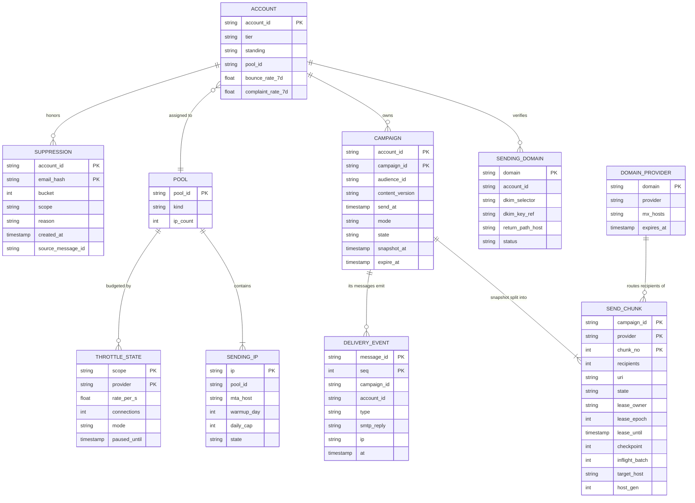

Access patterns that justify it:
- **Due campaigns** (scheduler, every 5 s): a small global table `due(send_minute, campaign_id)` written when a campaign is scheduled. The campaign rows themselves are sharded by `account_id`, so the scheduler never scans every shard.
- **Chunk leasing** (render workers, ~20 leases/s at peak): primary key `(campaign_id, provider, chunk_no)`. A worker takes a lease with a compare-and-set on `lease_epoch`; every write it makes carries the epoch, so a worker whose lease expired cannot overwrite the next owner's checkpoint ([`../../concepts/leases-fencing-clocks.md`](../../concepts/leases-fencing-clocks.md)). Before each inject the worker also writes `(inflight_batch, target_host, host_gen)` on the row, fenced by the same epoch, so a retried batch goes to the recorded host or its successor (§5.4); that is ~400 extra small writes/s at the 200k/s peak.
- **Suppression** (snapshot anti-join, unsubscribe writes, confirm-on-positive reads): partition key `(account_id, bucket)` with `bucket = email_hash mod 64`, clustering key `email_hash`. One account's 50 M suppressions spread over 64 partitions and can still be read as one account for the snapshot. The email is stored as a keyed hash, so the store is useless if stolen.
- **Domain to provider** (snapshot builder and MTAs): primary key `domain`, ~10 M rows, held in memory everywhere, refreshed from MX lookups on DNS TTL expiry.
- **Throttle state**: in quota-service memory, sharded by `hash(scope, provider)`, snapshotted every 10 s only to speed up a restart. It is rebuilt from MTA reports within seconds, so it needs no durable store.
- **Message id to campaign and contact** (every DSN, FBL report, unsubscribe and click): decoded from the id itself and checked with its HMAC (hash-based message authentication code). No lookup table of 2 B rows a day.
- **Per-campaign stats** (customer report): a streaming job keyed by `campaign_id` keeps counters per (campaign, provider, outcome). The report never scans events.
- **Retention**: snapshot chunk files deleted 7 days after the campaign's expiry (they hold personal data); delivery events kept 13 months in the lake for reporting, then aggregated.

---
## 4. High-level design

One subsection per functional requirement. Each traces one request from input to output, adds the boxes it needs to one diagram, and ends with what is still missing. The design at the end of §4 is deliberately the simple version; §5 breaks it.

### 4.1 Send a campaign: freeze the audience, render, hand to an MTA

**Flow: a 20 M recipient campaign scheduled for 10:00.**

1. The customer calls `POST /v1/campaigns/c_42/schedule {send_at: 10:00}`. The campaign service checks that the From domain is verified, writes `CAMPAIGN.state = SCHEDULED`, and adds a row to the `due` index for minute 10:00.
2. At 09:50 the scheduler (it scans `due` every 5 s) sees a campaign over 100k recipients due in 10 minutes and starts the **snapshot**: 16 parallel range scans of the segment in the audience DB, status `subscribed` only, ~500k rows/s [estimate], so 20 M rows in ~40 s. It assigns each recipient to a chunk by `hash(campaign_id, contact_id)` and writes 2,000 chunk files of 10k recipients (email, contact id, merge fields; ~500 B per row, 10 GB in all) to object storage, encrypted with the account's data key, and records `snapshot_at`. Contacts added after this moment are not in this send; the report says "sent to the audience as of 09:50:40".
3. At 10:00:00 the campaign moves to `SENDING` and its chunks become leasable.
4. A render worker leases a chunk, loads the content version once, and for each recipient fills merge tags, rewrites links to signed tracking URLs, adds a signed unsubscribe token, and sets the message id `c_42.<contact_id>.<hmac>`. It sends `InjectBatch` of 500 messages to an MTA and records the batch offset as the chunk's checkpoint.
5. The MTA writes each message to its spool on local disk, fsyncs, and acks. A sender loop resolves the recipient's MX, opens an SMTP connection, and delivers.
6. Gmail answers `250 2.0.0 OK` at ~10:00:02. The MTA marks the message done.

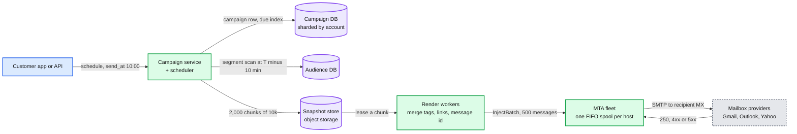

Data model touched: `CAMPAIGN`, `SEND_CHUNK` (lease, checkpoint), snapshot files.

**What breaks, compressed.**
- **A loop that sends synchronously.** One SMTP transaction to Gmail takes ~150 ms [estimate], so one connection does ~6.7 messages/s and 20 M take `20 M ÷ 6.7 = 3 M s`, about 35 days.
- **Thousands of parallel connections from the app servers.** Now a handful of IPs open 1,000 connections to Gmail at 10:00:00. Google asks senders to "send email at a consistent rate. Avoid sending email in bursts", and the answer is `421 4.7.28` within minutes. An app server that crashes loses whatever it held in memory.
- **Chosen: snapshot, chunks, render fleet, MTAs with a durable spool.** "Decide what to send" takes seconds and is restartable from a checkpoint. "Deliver it" takes hours and survives a crash on disk. The two run at different speeds, which is the point.

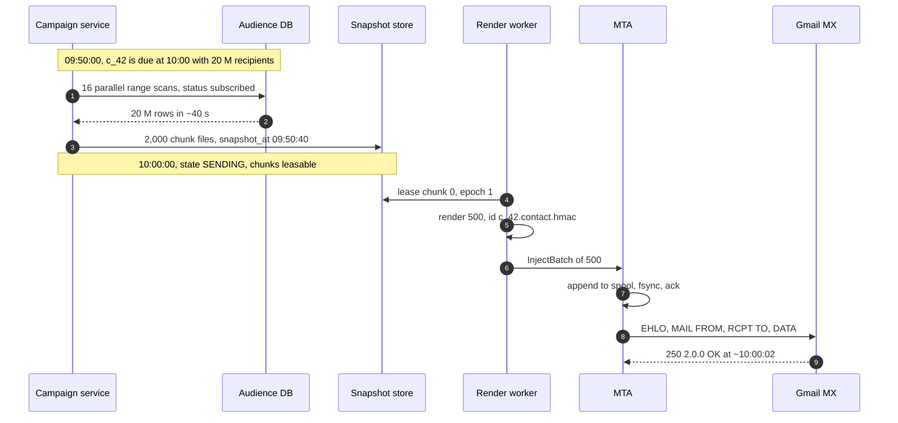

**What is still missing:** the MTA sends as fast as it can to whatever MX it finds. Nothing knows Gmail's limit, and one FIFO spool means a Gmail deferral blocks the Yahoo mail behind it. §4.2.

### 4.2 Throttle per receiver: one queue per (IP, provider), rates learned from replies

**Flow: the same campaign, now with the receiver in charge.**

1. **Provider resolution at snapshot time.** For each recipient the snapshot builder looks up the domain in the `DOMAIN_PROVIDER` map. `gmail.com` and `acme.com` both resolve to `google` because acme's MX is `aspmx.l.google.com`. `contoso.com` with MX `contoso-com.mail.protection.outlook.com` is `microsoft`. A domain whose MX is unknown becomes `mx:<registrable domain of its MX host>`. Map entries expire with the DNS TTL and are refreshed by a background resolver, never on the hot path. The builder writes chunks **per (campaign, provider)**: ~800 Google chunks, ~400 Microsoft, and so on.
2. Render works as in §4.1 and injects to an MTA host that owns IPs in the campaign's pool.
3. Inside the MTA, each message goes to the queue for **(IP, provider)**. A queue holds one FIFO sub-queue per account and serves them by DRR (deficit round robin), so a 500-recipient newsletter on a shared IP is not stuck behind a 2 M send on the same IP.
4. One sender loop per queue keeps a **rate** (messages/s) and a **connection count**, and opens connections to the provider's MX hosts up to that count.
5. Every reply is classified (the full decision tree is [D6 in diagrams.md](diagrams.md#d6-activity--decision-flow)):
   - `250`: delivered. After every clean 30 s window the rate rises by one step (additive increase).
   - `421`, `451` deferrals above 2% of a 60 s window: rate halved, connections halved (multiplicative decrease). The message stays queued; it was not its fault.
   - `421 4.7.28` from Google: stop that queue for 10 minutes, then restart with one connection and add connections one at a time. That is Google's own published procedure.
   - `550 5.1.1` (no such user): hard bounce, never retried, a suppression (§4.4).
   - `450 4.2.1` (this one user receives too fast): retry that one message later. Not a pool signal.
6. A Gmail pause stops only the Gmail queues. Yahoo, Microsoft and long-tail queues on the same IP keep sending.

```mermaid
%% Incremental diagram, step 2 of 4: recipients are split by provider at snapshot time, and each MTA keeps one queue per (IP, provider) with its own adaptive rate. New boxes: provider map, per-key queues, AIMD senders.
flowchart LR
    U[Customer app or API] -->|"schedule"| CS[Campaign service<br/>+ scheduler]
    CS -->|"campaign, due index"| CDB[(Campaign DB)]
    CS -->|"segment scan"| AUD[(Audience DB)]
    PM[(Domain to provider map<br/>from MX records)] -->|"gmail.com and acme.com<br/>both google"| CS
    DNS[DNS resolvers] -.->|"MX refresh on TTL"| PM
    CS -->|"chunks per campaign and provider"| SNAP[(Snapshot store)]
    SNAP -->|"lease chunk"| RW[Render workers]
    RW -->|"InjectBatch"| MQ[MTA queues<br/>per IP and provider,<br/>DRR across accounts]
    MQ -->|"next message within rate"| MS[SMTP senders<br/>AIMD per IP and provider]
    MS -->|"SMTP"| MBP[Mailbox providers]
    MBP -->|"250, 421 4.7.28, 550 5.1.1"| MS
    MS -.->|"rate up or halve, pause 10 min"| MQ

    class U client
    class CS,RW,MQ,MS service
    class CDB,AUD,SNAP,PM store
    class MBP,DNS external

    classDef client   fill:#dbeafe,stroke:#2563eb,stroke-width:2px,color:#111
    classDef service  fill:#dcfce7,stroke:#16a34a,stroke-width:2px,color:#111
    classDef store    fill:#ede9fe,stroke:#7c3aed,stroke-width:2px,color:#111
    classDef external fill:#e5e7eb,stroke:#6b7280,stroke-width:2px,color:#111,stroke-dasharray:4 3
```

Data model touched: `DOMAIN_PROVIDER`, `SEND_CHUNK.provider`, `THROTTLE_STATE` (here still local to each MTA).

**What breaks, compressed.**
- **One FIFO queue per MTA.** Google is ~40% of the mail. When Gmail pauses an IP for 10 minutes, the head of the queue is a Gmail message, and the Yahoo and Outlook mail behind it waits too. A 40% problem becomes a 100% outage of that IP.
- **A token bucket per recipient domain string.** It looks right and is the most common wrong answer. A B2B list with 5,000 Google Workspace domains gets 5,000 separate budgets of, say, 20 connections each: up to 100,000 connections from one IP to the same Google servers. Google says to limit "based on the MX record domain, not the domain in the recipient email address". Postfix has the same trap: its `default_destination_concurrency_limit` of 20 is "the default maximal number of parallel deliveries to the same destination", and a destination is the recipient domain ([postconf](https://www.postfix.org/postconf.5.html)).
- **Static per-provider rates in MTA config.** Works until reputation moves. Set 60/s and a medium-reputation pool earns `421 4.7.28` storms; set 20/s and the 20 M campaign takes 5.6 h. The right number changes daily, so the rate has to be learned from replies.
- **Chosen: per (IP, provider) queues keyed by MX, DRR across accounts, AIMD on SMTP replies.** It is the same control loop TCP uses for an unknown bottleneck: probe up slowly, back off hard. Postfix already does a crude version: per-destination concurrency starts at `initial_destination_concurrency = 5` and moves up or down by `positive_feedback` and `negative_feedback`, but only on connection or handshake failures, not on what the 421 text says.

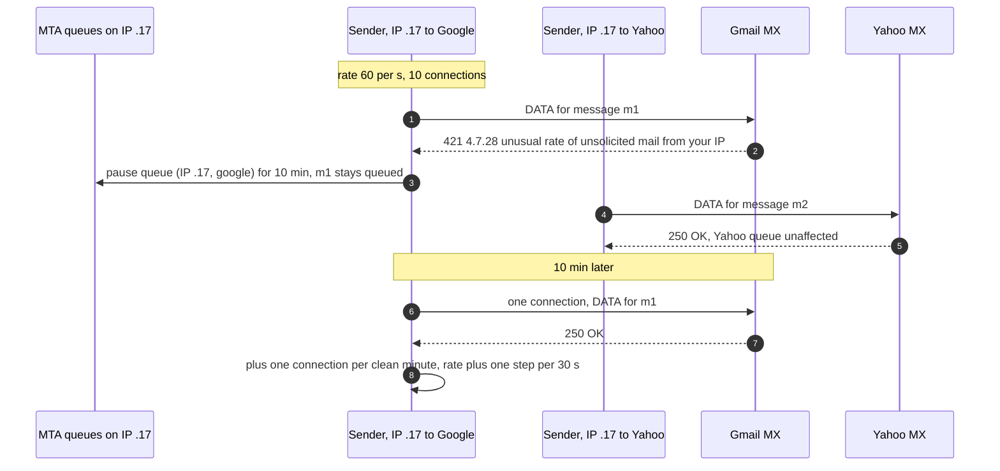

**What is still missing:** who is on the IP. If every account shares one pool and we sign with our own domain, one spammer's `421` is everyone's `421`, and DMARC alignment fails for all of them. §4.3.

### 4.3 Protect reputation: pools, authentication, warm-up, an abuse loop

**Flow: a tier B account sends its weekly newsletter from `shop.com`.**

1. **Domain verification (once).** The account adds `shop.com`. We return DNS records to publish: `mc1._domainkey.shop.com CNAME mc1.dkim.<our domain>` (we hold the key and can rotate it without the customer), `em.shop.com CNAME bounces.<our domain>` as the return-path host (SPF and bounces; every message uses `bounce+<message_id>@em.shop.com`), and a suggested `_dmarc.shop.com` record. Verification checks the CNAMEs resolve. Until then the domain cannot be used as a From address.
2. **Pool selection.** The account's tier picks the pool. Pools by kind:
   - **Transactional**: password resets and receipts. Separate IPs, separate MTA processes, highest priority. Google: "use a different IP address for each message type".
   - **Dedicated**: one large sender with steady volume (the 20 M sender's 20 IPs).
   - **Shared A**: senders with low complaints and high engagement.
   - **Shared B**: the default.
   - **Shared C (probation)**: new accounts and recently flagged ones. Lower rates, smaller blast radius.
3. **Signing, twice.** Render workers sign every message with DKIM `d=shop.com`, aligned with `From: news@shop.com`, so DMARC passes on DKIM alone (Google: the From domain "must be aligned with either the SPF domain or the DKIM domain"). They add a **second signature with one of our own signing domains, one per pool tier** (A, B, C, dedicated, transactional), because both complaint channels key on the signer: Yahoo's CFL reports per DKIM `d=`, and Gmail's FBL needs `Feedback-ID` "DKIM signed by a domain owned (or controlled) by the sender" and verified in Postmaster Tools. Five enrollments then cover every customer, instead of hundreds of thousands of customer domains. One per tier, not one for the platform, because that domain is itself a reputation unit: a `4.7.28` naming it pauses only its tier. Cost: ~1 ms more per message, render goes from ~400 to ~600 cores at peak. The signed headers include `List-Unsubscribe` and `List-Unsubscribe-Post`, which RFC 8058 requires. Private keys sit encrypted under a KMS key and are decrypted only in signer memory at start (§5.6). [`deep-dives/reputation-and-ip-pools.md`](deep-dives/reputation-and-ip-pools.md) §4.
4. **Warm-up.** A new IP gets a daily cap that grows each day; the quota service enforces it as one more key. SendGrid's automated schedule starts at 20 messages/hour on day 0, reaches 1,000/hour on day 12 and 484,029/hour on day 30, and ends on day 41 ([Twilio SendGrid](https://www.twilio.com/docs/sendgrid/ui/sending-email/warming-up-an-ip-address)). Overflow goes to the account's previous pool.
5. **Abuse loop (simple version).** Every hour a job reads the delivery events, computes per-account hard-bounce and complaint rates, and moves accounts between tiers or pauses them.
6. Gmail checks SPF on `em.shop.com`, DKIM on `shop.com`, DMARC alignment, and answers 250.

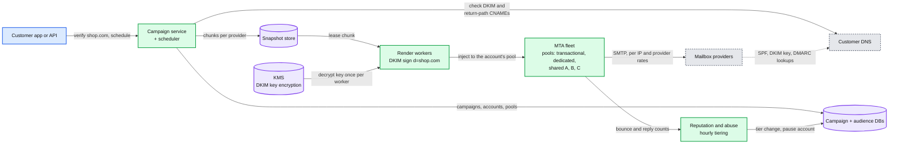

Data model touched: `SENDING_DOMAIN`, `POOL`, `SENDING_IP` (warm-up day, daily cap), `ACCOUNT.tier`, `ACCOUNT.standing`.

**What breaks, compressed.**
- **One shared pool, DKIM signed with our domain.** `From: shop.com` with `d=our-esp.net` is not aligned, so every bulk sender fails Google's and Microsoft's DMARC requirement. Microsoft rejects non-compliant high-volume mail with `550; 5.7.515 Access denied` from May 5, 2025 ([announcement](https://techcommunity.microsoft.com/blog/microsoftdefenderforoffice365blog/strengthening-email-ecosystem-outlook%E2%80%99s-new-requirements-for-high%E2%80%90volume-senders/4399730)). And one bad list throttles the whole platform.
- **A dedicated IP for everyone.** Most accounts send a few thousand messages a week. An IP that sends 2,000 messages on Tuesday and nothing else never builds a reputation, and spreading senders over many thin IPs looks like snowshoe spam (spreading volume to dodge filters).
- **Chosen: tiered shared pools for most, dedicated pools for large steady senders, transactional pools apart, aligned DKIM, warm-up caps, a loop that moves accounts between tiers.**

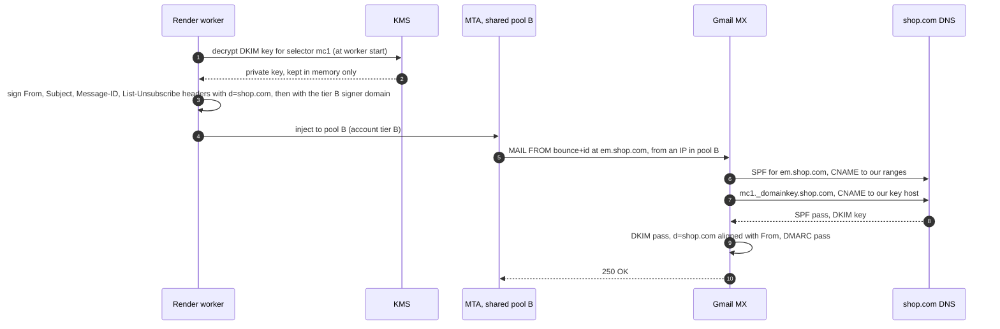

**What is still missing:** the loop has no inputs yet. Bounces arrive as SMTP replies and as delayed DSNs, complaints arrive through feedback loops, unsubscribes arrive as HTTP POSTs, and none of them reach the next send. §4.4.

### 4.4 Close the loop: bounces, complaints, unsubscribes, stats

**Flow A: a recipient clicks "Unsubscribe" next to the sender name in Gmail.**

1. Gmail sends `POST /u/<token>` with body `List-Unsubscribe=One-Click` to the URL in the message's `List-Unsubscribe` header. RFC 8058: the POST "MUST NOT include cookies, HTTP authorization, or any other context information", and the sender "MUST NOT return an HTTPS redirect". The token is our opaque, "hard-to-forge" component: `(account, audience, contact, campaign)` plus an HMAC.
2. The feedback ingest service checks the HMAC, writes `SUPPRESSION(account, email_hash, scope = audience, reason = unsubscribe)` (~10 ms), sets the contact's status in the audience DB, writes an outbox row, and answers `200`.
3. A relay publishes the suppression to the `suppressions` Kafka topic (keyed by account). Render workers keep, per active campaign, the set of suppressions newer than its `snapshot_at`, and skip those recipients.

**Flow B: a hard bounce.** A synchronous `550 5.1.1` at `RCPT TO` becomes a `bounced` delivery event from the MTA. An asynchronous bounce (the receiver accepted, then failed later) arrives as a DSN at the return path `bounce+<message_id>@em.shop.com`, which resolves to our bounce host; the ingest parses it, decodes the message id from the address (VERP), and emits the same event. A suppression writer turns hard bounces into account-wide suppressions.

**Flow C: a complaint.** Yahoo's CFL needs a DKIM-signed stream ("An active CFL is needed for all DKIM domains", [Yahoo](https://senders.yahooinc.com/best-practices/)) and sends ARF reports; Microsoft's JMRP is similar. Each report maps to a message id through our headers, becomes a `complained` event and an account-wide suppression. Gmail sends no per-message reports: its Feedback Loop aggregates spam rates per `Feedback-ID` identifier (up to 3 identifiers plus a mandatory 5 to 15 character sender id) in Postmaster Tools ([Google FBL](https://support.google.com/mail/answer/6254652)). Reports appear only when an identifier "is present in a certain volume of mails as well as in distinct user spam reports", so a per-campaign id is silent for small sends. We set `Feedback-ID: <campaign or tier bucket>:<account or tier bucket>:<mailtype>:<sender id>`, using campaign and account ids only above ~100k Gmail messages a day [estimate] and a (tier, pool) bucket below it, sign it with our own domain, and pull the dashboard daily.

**Flow D: stats.** Every MTA emits delivery events to Kafka. A streaming job keeps per (campaign, provider, outcome) counters for the report, and the reputation service reads the same stream. Events land in a Parquet lake for 13 months.

**Opens are not what they look like.** Apple's MPP "prevents senders from seeing if you've opened the email message" and hides the IP ([Apple](https://support.apple.com/guide/iphone/use-mail-privacy-protection-iphf084865c7/ios)): Apple's proxy fetches the tracking pixel for every protected message, so an MPP recipient shows as an open whether or not a human read it. We tag opens fetched by Apple's proxy as `machine` and report `human` opens and clicks separately. Engagement-based features (send-time optimization, sunsetting inactive contacts, tier scoring) use clicks and human opens only.

```mermaid
%% Incremental diagram, step 4 of 4: the feedback loop. New boxes: feedback ingest, suppression store, Kafka, stats and lake. The render workers now skip anyone suppressed after the snapshot.
flowchart LR
    U[Customer app or API] -->|"schedule, read report"| CS[Campaign service<br/>+ scheduler + DBs]
    CS -->|"chunks per provider"| SNAP[(Snapshot store)]
    SNAP -->|"lease chunk"| RW[Render workers]
    K[[Kafka<br/>suppressions, delivery events]] -->|"suppressions since snapshot"| RW
    RW -->|"inject"| MTA[MTA fleet<br/>pools, per IP and provider queues]
    MTA -->|"SMTP"| MBP[Mailbox providers]
    MBP -->|"one-click POST, DSNs,<br/>ARF complaints"| FI[Feedback ingest<br/>token check, VERP decode]
    FI -->|"suppression write"| SUP[(Suppression store<br/>account, email hash)]
    SUP -->|"outbox relay"| K
    MTA -->|"delivery events"| K
    K -->|"per campaign counters, events"| LAKE[(Stats + event lake)]
    K -->|"bounce, complaint rates"| REP[Reputation and abuse]
    REP -->|"tier, pause"| CS

    class U client
    class CS,RW,MTA,FI,REP service
    class SNAP,SUP,LAKE store
    class K queue
    class MBP external

    classDef client   fill:#dbeafe,stroke:#2563eb,stroke-width:2px,color:#111
    classDef service  fill:#dcfce7,stroke:#16a34a,stroke-width:2px,color:#111
    classDef store    fill:#ede9fe,stroke:#7c3aed,stroke-width:2px,color:#111
    classDef queue    fill:#cffafe,stroke:#0891b2,stroke-width:2px,color:#111
    classDef external fill:#e5e7eb,stroke:#6b7280,stroke-width:2px,color:#111,stroke-dasharray:4 3
```

Data model touched: `SUPPRESSION`, `DELIVERY_EVENT`, per-campaign counters.

**What breaks, compressed.**
- **Nightly batch processing of bounces and unsubscribes.** Legal on paper (CAN-SPAM: "within 10 business days"; Google's FAQ lists "Unsubscribe requests aren't honored within 48 hours" as non-compliance), but the morning's campaign still goes to people who unsubscribed last night, and every one of those is a likely spam report.
- **Per-message rows in a database to map bounces back.** 2 B rows a day written once and read by ~1% of messages. The message id already carries campaign and contact, signed, so the lookup is a decode.
- **Chosen: suppression store as the source of truth, an outbox to Kafka for propagation, VERP and signed ids for mapping, a stream job for stats.**

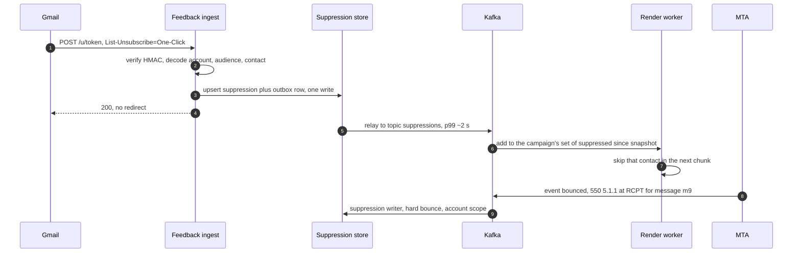

**What is still missing:** everything §5 is about. Render floods the MTA spool far ahead of the pipe, so the 10:05 message to the person who unsubscribed at 10:01 may already be rendered and queued (§5.1, §5.4). Each MTA learns rates alone, but Google also limits per DKIM domain across all our IPs (§5.2). The hourly abuse job lets a purchased list run for an hour on a shared pool (§5.3). And an MTA crash between Gmail's 250 and our journal write is undefined (§5.5).

---

## 5. Deep dives

One per non-functional requirement, phrased as the interviewer's question. Each names what breaks in the §4 design with a number, fixes it, and lists what changed in the API, the data model and the diagram.

### 5.1 "A 20 M campaign at 10:00 and 5,000 others in the same minute: first message in 1 min, done in ~2 h. Where is the queueing?"

**What breaks in the current design.**
1. **Render floods the spool.** Render runs at ~50k/s for the big campaign, so all 20 M are rendered by 10:07. The Google pipe drains 1,200/s, so ~7.5 M messages (375 GB) sit on 4 MTA hosts for up to 2 h. A cancel must purge 7.5 M messages, an unsubscribe must chase a message queued for 2 h, and a host crash strands a quarter of it.
2. **Small campaigns wait behind big ones in render.** At 10:00:00 the chunk queue holds the big campaign's 2,000 chunks in front of a 500-recipient campaign's one chunk. At 200k/s across the render fleet, the big one alone takes `20 M ÷ 200k = 100 s` of the whole fleet. The small campaign misses the 1 minute start.
3. **Snapshot storm.** ~5,000 campaigns [estimate] with ~100 M recipients [estimate] start at the round hour. At ~2 M rows/s across the audience fleet [estimate] that is 50 s of scanning before the last one can start.

**The fix.**
- **A dispatcher between snapshot and render, with credit per (pool, provider).** Credit = **allowed rate** × 10 min − (messages queued in MTAs + messages being rendered). The allowed rate is the AIMD rate for that key (from §5.2 on, the quota service's rate), not the measured drain: drain is `min(allowed, supply)`, so a key whose queue ran dry would measure ~0 and shut its own valve. A chunk is also released whenever the key has nothing queued and is not paused. For the big pool's Google key: `1,200/s × 600 s = 720k` messages, 36 GB, never 7.5 M. When Gmail slows the key to 600/s the credit halves by itself.
- **DRR across campaigns within each (pool, provider), and a small free first chunk.** The snapshot writes chunk 0 of every (campaign, provider) with only 500 recipients, and the dispatcher releases it at `send_at` whatever the credit, so every campaign has mail leaving within seconds. The burst this allows is bounded: ~5,000 campaigns × ~3 providers × 500 = at most ~7.5 M messages at the round hour, spread over every pool, instead of whole campaigns. After that, active campaigns share the pipe in rounds, so a 5,000-recipient send finishes in minutes while the 20 M send takes its 2 h.
- **Snapshot early, sized by count.** Lists over 100k snapshot at `send_at − 10 min` (rows ÷ scan rate × 2 of margin); small ones snapshot at `send_at` on a separate lane and take under 5 s.
- **A live ETA from minute 10.** `remaining ÷ allowed rate`, maximum over providers, on the report and the API. If Gmail runs at half the plan the customer sees 3.7 h at 10:10, not at 13:40; past `send_at + 4 h` or `expire_after`, the account's deliverability owner is notified.
- **Scale render on the calendar.** The schedule for the next hour is known, so the render pool scales up at :55 instead of reacting at :00 (the same move as the TurboTax calendar pre-scale in [`../turbotax-efile/`](../turbotax-efile/)).

**Push back on the textbook answer.** "Put every message on Kafka and add consumers until the lag is gone." The lag cannot go away by adding consumers: Gmail's acceptance sets the drain rate. A deeper queue of rendered mail only adds staleness: more to purge on cancel, more to re-check on unsubscribe, more to redo after a crash, and content that can no longer be fixed. Keep the backlog **upstream as unrendered snapshot rows** (500 B each instead of 50 KB, still cancellable, still filtered at render), and keep the rendered queue at 10 minutes.

**Black Friday at 5x (a ceiling, not a forecast): who waits?** Receivers do not scale for us, and a sudden jump is itself a warning sign to them: Google says "immediately doubling previously sent volumes suddenly could result in rate limiting or reputation drops". Friday's per-IP budgets can be lower than Tuesday's, not the same. So:
- **Transactional never waits.** Its own pools and MTA processes.
- **Within a pool, everyone waits a fair share.** DRR means small sends still finish in minutes; the biggest campaigns stretch. A dedicated pool that sends 5 × 20 M in a day needs `40 M ÷ 1,200/s = 9.3 h` for its Google share at plan rates, and 27.8 h at 30/s with 60% Google, which does not fit in the day.
- **Capacity is bought six weeks ahead, by a rule.** A dedicated sender's forecast peak day must fit in **12 h at the 10th-percentile per-IP rate**. A new IP takes ~41 days to warm (SendGrid's schedule), so extra IPs start warming in early October, and large senders ramp their volume through November so that Friday is not a doubling.
- **Overflow only where it cannot hurt.** To warm shared-A IPs, only when the deferrals are IP-scoped and the sender is A-grade. Never on a DKIM-scoped throttle (it follows the domain), never to cold IPs.
- **Time-boxed promotions set `expire_after`.** A "sale ends at midnight" message that cannot be delivered by midnight is dropped as `expired`, not delivered late.
- **We refuse to burst onto cold IPs.** It would make Friday faster and the rest of the quarter slower.

**What changed.** New box: the dispatcher. `SEND_CHUNK.state` gains `RELEASED`. MTAs report queue depth per key every second; the allowed rate comes from the AIMD state. The report and API gain a live ETA.

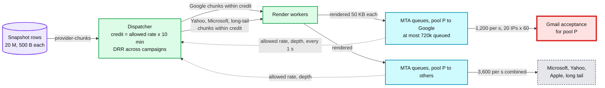

[`deep-dives/campaign-fan-out-and-scheduling.md`](deep-dives/campaign-fan-out-and-scheduling.md).

### 5.2 "Gmail starts answering 421 4.7.28 for one IP pool. What changes, in what order, automatically?"

**What breaks in the current design.** §4.2 runs AIMD inside each MTA, per (IP, provider). That is right for a limit on one IP, and wrong for the others. Google's `421 4.7.28` text names its scope: "from your IP address", "from your IP Netblock", "from your DKIM domain", "from your SPF domain", or "containing one of your URL domains" ([Google SMTP errors](https://support.google.com/mail/answer/3726730)). Two more variants matter: one with **no scope** ("Gmail has detected an unusual rate of email"), for which Google says "assume that all three are affected" (IP, DKIM and SPF), and one about the **same Message-ID** sent too often, which is a per-message quota, not a key.
1. **A DKIM-domain limit spans hosts.** The 20 M sender's `d=bigshop.com` leaves from 20 IPs on 4 hosts. Each host sees a quarter of the 421s and halves on its own schedule; the combined rate oscillates and the domain stays throttled.
2. **A domain-scoped problem punishes the IP.** One customer's bad content on shared pool B makes the MTAs halve pool B's IPs, slowing the ~10k other senders [estimate] on those IPs.
3. **A netblock or a URL domain spans pools.** A `/24` holds 256 of our IPs across pools. Our shared click-tracking domain is in every customer's mail.

**The fix: a quota service for every key that spans MTAs.**
- **Keys.** `(IP, provider)` stays local to the MTA that owns the IP. `(pool, provider)`, `(DKIM domain, provider)`, `(netblock, provider)` and `(URL domain, provider)` live in the quota service, sharded by key hash. A message may leave only if every key it belongs to has a token: its effective rate is the minimum over its keys.
- **Leases.** Every second each MTA reports reply counts per key and asks for tokens by demand. The quota service splits each key's rate across the MTAs that want it (max-min fair) and returns leases valid for 2 s. Overshoot is bounded by one lease period. [`../../concepts/rate-limiting-and-load-shedding.md`](../../concepts/rate-limiting-and-load-shedding.md), [`../network-throttling/`](../network-throttling/).
- **AIMD per global key**, on the merged signal: deferrals above 2% of a 60 s window halve the rate; each clean 30 s adds one step (~2% of the key's pre-incident rate [estimate]), the same constants as the local loop in §4.2. On `4.7.28`, Google's procedure: "Do not send email for at least 10 minutes", then "send emails from a single connection", then "increase the number of connections one at a time".
- **Fail slow, never fast.** If the quota service is unreachable, an MTA keeps its last lease rate × 0.5 for up to 5 minutes, then drops to one connection per key until it is back.

**In order, automatically, for a DKIM-domain 4.7.28 on pool B:**
1. t = 0: an MTA gets `421 4.7.28 ... from your DKIM domain bigshop.com`. It stops sending that domain's messages to Google at once, locally, before any round trip.
2. t ≤ 1 s: its report reaches the quota service, which pauses `(bigshop.com, google)` for 10 minutes. Every MTA learns it at its next lease, within 2 s. Other customers on the same IPs keep sending to Google.
3. t ≤ 2 s: the dispatcher sees bigshop's allowed Google rate at 0 (paused), so its credit is 0 and no more bigshop Google chunks are rendered. bigshop's Yahoo and Microsoft mail keeps flowing.
4. t ≈ 1 min: the reputation service looks at bigshop's numbers (bounces, FBL complaints, yesterday's Postmaster spam rate). If they are bad, it pauses the campaign and notifies the customer (§5.3).
5. t = 10 min: one connection for bigshop to Google. Each clean minute adds a connection.
6. Had the text said "your IP", only `(IP, google)` would pause. Had it carried no scope, `(IP, google)`, `(DKIM domain, google)` and `(SPF domain, google)` would all pause. Had it named the same Message-ID, no key would pause and the platform on-call would be paged: our ids are per recipient, so it means a bug resent one id many times. `(pool B, google)` is halved only when IP-scoped hits reach **5% of the pool's active IPs** within 60 s, or the pool's merged deferral rate passes 2%: on pool B's ~1,000 IPs, a fixed "3 IPs in 60 s" would fire on background noise ~48 times a day ([throttling dive](deep-dives/per-domain-throttling.md) §4). Had it named our tier B signer domain, `(signer domain, google)` would pause tier B only, never every tier. Had it been a tracking domain, `(URL domain, google)` would pause, which is why every paying account gets a branded link domain: a URL-domain throttle then hits one customer, not all of them.
7. No page. A page fires on `5xx` blocks (`550 5.7.1 ... very low reputation of the sending IP`) or Google deferrals above 20% of a pool for 15 minutes.

**Push back on the textbook answer.** "Rotate traffic to fresh IPs when an IP is throttled." Google says "DKIM and SPF quotas are specific to your domain", so the throttle follows the sender to the new IP. A cold IP has no reputation and gets less, not more. And moving a throttled sender across IPs is what snowshoe spammers do. Fix the sender, not the IP.

**What changed.** New box: the quota service. New internal APIs: `Lease`, `ReportReplies`. `THROTTLE_STATE` becomes a global, soft-state table. Every paying tier gets a branded tracking domain.

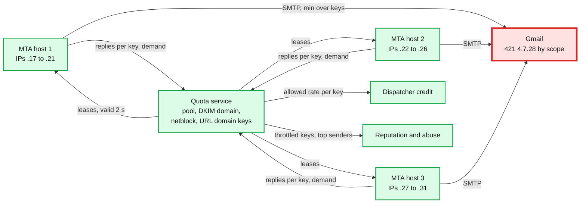

[`deep-dives/per-domain-throttling.md`](deep-dives/per-domain-throttling.md). The reply classifier is [D6 in diagrams.md](diagrams.md#d6-activity--decision-flow); the second-by-second timeline is §10.4.

### 5.3 "A new customer imports a purchased list and 15% bounce. How do you protect everyone else on the shared pool?"

**What breaks in the current design.**
1. **Bounces arrive faster than an hourly job.** The §4.3 abuse job runs hourly and new accounts start on shared pool B at full speed. A 1 M list on pool B (~1,000 IPs shared by ~10k active senders a day [estimate]) gets ~2,000/s of spare capacity, so it is fully attempted in `1 M ÷ 2,000 = 500 s`, under 9 minutes. That is ~150k hard bounces and likely spam-trap hits before the job runs. Google: "When the IP address hits its quota, all domains that send from that IP address stop sending emails". Ten thousand senders pay for one.
2. **Complaints arrive slower than any stream.** A scraped list of valid addresses does not bounce; it draws spam reports, and a report needs a human to open the mail first. Gmail, ~40% of the mail, reports complaints only as a daily aggregate ("For a given day's traffic"). Yahoo and Microsoft FBLs (~30%) report per message, but only once people read. At a ~4 h mean read time [estimate], a 15-minute hold sees ~6% of the eventual complaints.

**The fix, in layers.**
1. **Check the list at import, before any send.** Syntax, role accounts (`info@`, `admin@`), disposable domains, consent source, and the share of addresses in a platform-wide set of hashed addresses that hard-bounced for any account in the last 90 days. A model turns these into a risk score (the AI story, §12). High risk blocks the send until the customer confirms consent or compliance reviews it.
2. **Probation pool plus a probe, for bounces.** New accounts and risky imports send from shared pool C. The first 5,000 recipients go first and the streaming loop (layer 4) judges them in seconds.
3. **A canary, for complaints.** New and risky campaigns (accounts under 30 days or 3 sends, medium-risk imports, a send over 5x the account's largest in 90 days, an account moved down a tier this week: ~3% of campaigns [estimate]) send `min(10k, 20%)` of the list first. Chunks are assigned by `hash(campaign_id, contact_id)`, so the canary is a real random sample the sender cannot seed. It is held up to 2 h (~39% of eventual signals at a 4 h read mean [estimate]) and judged on per-message signals: one-click unsubscribes (every provider, Gmail included), Yahoo and Microsoft FBL complaints, human clicks, seed mailboxes we own, and any DKIM-scoped 4.7.28. 25 or more unsubscribes or 4 or more FBL complaints per 10k holds the rest for review. Lists under 2,000 go whole on pool C. [`deep-dives/reputation-and-ip-pools.md`](deep-dives/reputation-and-ip-pools.md) §7.
4. **A streaming abuse loop, not an hourly one.** Per-campaign counters on the delivery-event stream. After at least 1,000 attempts: hard bounces ≥ 2% warn the customer (the README target), ≥ 5% pause the campaign, ≥ 10% suspend the account's sending pending review. Complaints ≥ 0.3% of FBL-covered deliveries pause. These echo Amazon SES's own lines: bounce rate 5% "under review", 10% "might pause", complaint rate 0.1% review, 0.5% pause ([SES enforcement FAQ](https://docs.aws.amazon.com/ses/latest/dg/faqs-enforcement.html)).
5. **Pool health attribution.** When a shared pool's Google deferrals rise, the reputation service ranks accounts by their share of the throttled traffic times their bounce and complaint rates, and moves the top one down a tier.

**With the fix.** A list that **bounces**: synchronous bounces come back at `RCPT TO` in under a second, so the 5% line is crossed at ~1,000 attempts: ~150 hard bounces, all on pool C, in ~20 s at the probe's ~50/s. Pool B never sees it. A list that **draws complaints**: the harm is one canary of ~10k messages. In the reviewer's simulation of a 1 M bad list, the stream rule alone paused at minute 142 when the list was gone at minute 50; the canary cut the Gmail spam reports left on shared IPs from ~3,200 to ~32, for a ~2 h delay on ~3% of campaigns ([reputation dive](deep-dives/reputation-and-ip-pools.md) §6). The "~20 s" blast radius holds only for lists that bounce.

**Push back on the textbook answer.** "Verify every address with SMTP `RCPT` probes before sending." Probing receivers without sending looks like a directory harvest attack and costs reputation on the probing IPs, and catch-all domains accept every address anyway. Our own bounce history across ~2 B sends a day is a better signal and costs nothing.

**What changed.** Pool C, the probe and the canary. `POST /v1/audiences/{id}/imports` returns `quality {score, issues}`. `ACCOUNT.standing` gains `PROBATION`; `CAMPAIGN.state` gains `CANARY`. Seed mailboxes. The abuse job moves from hourly batch to the event stream. The second DKIM signature (§4.3) is what makes Yahoo and Gmail complaint data reach us at all.

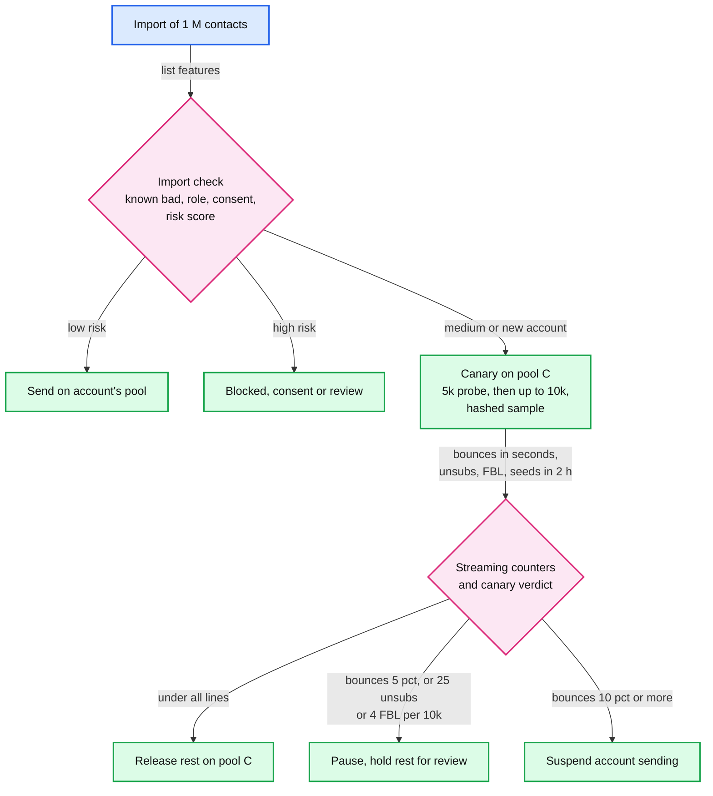

[`deep-dives/reputation-and-ip-pools.md`](deep-dives/reputation-and-ip-pools.md).

### 5.4 "She unsubscribes at 10:01 while the campaign is still sending. Does she get the 10:05 message? And how is it one message per recipient?"

**What breaks in the current design.**
1. **The render check is not the last check.** After §5.1, a rendered message waits up to 10 minutes in an MTA queue, and a deferred one waits hours. The message that leaves at 10:05 may have been rendered at 10:00:30, before she clicked.
2. **A render worker crash duplicates a batch.** A worker injects 300 of 500 messages and dies before its checkpoint. The next lease owner re-injects from the checkpoint. If that batch lands on a different MTA, 300 people get two copies. Choosing the MTA by rendezvous hash does not prevent it: when one host joins or leaves the ring, ~94 to 138 of a 500-id batch move ([delivery dive](deep-dives/delivery-semantics-and-mta-failures.md) §4).

**The fix.**
- **Three checkpoints.** (a) The snapshot excludes everyone suppressed before `snapshot_at`. (b) Render skips anyone in the stream's suppressions since `snapshot_at`. (c) **Just before SMTP**, the MTA checks a Bloom filter of the last 5 days of suppressions, fed by the same stream. A Bloom filter cannot delete, so it is 6 daily slices at ~14 bits per entry (~259 MB per host, ~0.65% false positives over all slices), the oldest dropped at midnight. A positive is confirmed against the suppression store: ~150 reads/s fleet-wide on average. Confirmed: the message is dropped as `suppressed`. If the store is unreachable, positives are held, not sent. [`../../concepts/bloom-filter.md`](../../concepts/bloom-filter.md).
- **Why 5 days.** A deferred message can sit in a spool for up to 4 days, so the filter must cover every suppression made since the oldest queued message was rendered.
- **Timing.** POST at 10:01:00, suppression row at 10:01:00.01, Kafka by ~10:01:02 (p99), every MTA's filter by ~10:01:05. The SLO is under 60 s; the target is 5 s.
- **What still escapes.** A message already inside an SMTP transaction during those ~5 seconds. That is the honest residual.
- **One message per (campaign, recipient).** The snapshot deduplicates by normalized email. The message id is deterministic. **The target host is recorded, not recomputed:** before injecting batch k, the worker writes `(inflight_batch = k, target_host, host_gen)` on the chunk row, fenced by its lease epoch. A retry reads the row and goes to that host, or to whoever holds its generation now (§5.5), and that MTA rejects ids already in its spool index (kept 5 days). Rendezvous hashing stays only as the default choice for a fresh batch. Checkpoints every 500; cost ~400 small writes/s at the peak.

**Push back on the textbook answer.** "Read the suppression store synchronously before every send." That is a remote read per message at ~23k/s average and ~100k/s at the egress peak, and a store outage stops all mail. The filter answers ~99% of checks locally in about a microsecond; only positives go remote.

**What changed.** MTAs consume the `suppressions` topic and keep the filter. A `suppressed` delivery event. A rotating, sliced filter. The intent row on `SEND_CHUNK` and spool-level dedup by message id.

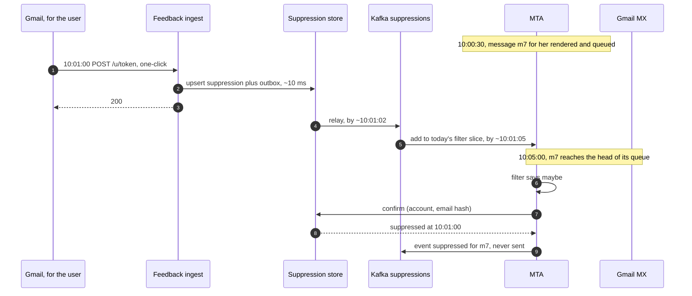

[`deep-dives/bounces-complaints-and-suppression.md`](deep-dives/bounces-complaints-and-suppression.md).

### 5.5 "An MTA crashes after the receiver said 250 OK but before we recorded it. Duplicate, loss, or neither?"

**Duplicate, bounded at ~130 per host crash. No loss, once accepted ids live on two hosts.** The availability and durability NFRs live here.

**What breaks in the current design.** An MTA host holds ~15 GB of spool (~300k messages) and ~2,000 open connections. If it dies, messages mid-transaction are ambiguous and its 25 IPs stop sending. The naive recovery, a re-injector that lists ids with an `injected(host)` event and no final event, fails three ways ([delivery dive](deep-dives/delivery-semantics-and-mta-failures.md) §2):
1. **It loses mail.** An inject is acked after the local fsync, not after its event reached Kafka. If the disk dies first, nobody knows the message existed. At 50 ms of event lag that is ~377 duplicates and ~257 losses per lost disk; at 30 s of lag, ~112k of each.
2. **A zombie resends everything.** A host that reboots after its mail was re-injected replays its journal: up to ~300k duplicates.
3. **Nothing decides who owns the IPs** during the gap.

**The fix.**
- **Accept on two hosts.** `InjectBatch` is acked only after the local group-commit fsync (~5 ms) **and** the buddy's ack of the `accepted(id)` records. The buddy is a standby host in another rack of the same site. `done(id)` streams to it asynchronously; if the buddy falls more than 500 `done` records behind, the host stops opening SMTP transactions until it catches up. Only ids travel: `2 × 50 B × 2,500/s = 250 KB/s` per host. Bodies are never replicated; they are re-rendered from the snapshot (kept until expiry + 7 days).
- **Finish durably, accept the window.** After `250`, the MTA appends `done(message_id)` to the journal. A crash between the receiver's commit and our reading its 250 (~50 ms × 2,500/s ≈ 125 messages [estimate]) is resent either way. On a restart with the disk, add ~8 (at most 13) `done` records not yet fsynced: **~133**. On a takeover after the disk is lost, the local records do not matter; add ~3 `done` records the buddy had not received: **~128**. RFC 5321 §4.5.3.2.6 names exactly this: a spurious timeout while waiting for the 250 "would typically result in delivery of multiple copies of the message". SMTP has no idempotency key that receivers honor, so this is at-least-once by protocol, and we say so. We also wait the full 10 minutes RFC 5321 gives the final dot: a shorter timeout turns every slow 250 into a duplicate.
- **Restart with the disk.** Replay the journal, rebuild the queues: ~1 minute [estimate] for 300k messages.
- **Fenced takeover.** A host may send only while it holds a send lease in a registry, renewed every 1 s, valid 3 s, with a generation number. When h7's lease expires, its buddy waits a 30 s grace (most "down" hosts are reboots with their disk), bumps h7 to generation 5, announces h7's 25 IPs (only after the old lease expired, so two hosts never announce one address), and re-renders every accepted-not-done id: `300k × 3 ms = 900 core-seconds`, ~18 s on 50 render cores, streamed, so sending resumes ~1 s after takeover. A rebooted h7 learns it is stale, deletes its spool and rejoins as a fresh host. Result: **0 lost and ~128 duplicates, whatever Kafka's lag**. If h7 and its buddy both die, we fall back to the event-based re-injector and page. [`../../concepts/leases-fencing-clocks.md`](../../concepts/leases-fencing-clocks.md).
- **Retries for message-level 4xx** (mailbox full, greylisting): RFC 5321 says the interval "SHOULD be at least 30 minutes" unless the client knows the reason, and suggests "two connection attempts in the first hour ... then backing off to one every two or three hours". Ours: 15 min, 45 min, then every 2 h; give up at 4 days, or at the campaign's `expire_after`, with an `expired` event. Throttle deferrals are different: the queue pauses and the message keeps its place without spending an attempt.
- **Site loss.** Every pool has half its IPs in each of two sites. Losing a site halves every pool's rate: the 20 M campaign takes ~3.7 h instead of 1.85 h. The control plane (campaign DB, scheduler) fails over with asynchronous replication; the scheduler is idempotent on campaign state, so a double start is a no-op. Within a site, the chunk rows need a synchronous standby so no checkpoint or intent row is lost. Each site also mirrors a compact **final-id stream** to the other (~50 B per message, ~5 MB/s at 100k/s egress), so site B knows what site A delivered, not just what it was sent: it re-renders site A's checkpointed ids that have no final id, and duplicates are bounded by the stream's lag, ~1 s of site A's mail.

**Push back on the textbook answer.** "Replicate the spool synchronously to a second host so nothing is ever redone." Replicate what you cannot recompute. Bodies are ~50 KB, 80 Gbps at the inject peak, and can be re-rendered. Ids are ~50 B, 250 KB/s per host, and cannot be re-derived once the disk is gone. And no replication removes the duplicate window, which sits between the receiver's 250 and our journal.

**What changed.** Buddy replication of journal ids, a send-lease and generation registry, the 30 s grace, the intent row on `SEND_CHUNK` (§5.4), the retry schedule, the 10-minute final-dot timeout. The second-by-second host-loss timeline is in the [delivery dive](deep-dives/delivery-semantics-and-mta-failures.md) §3.

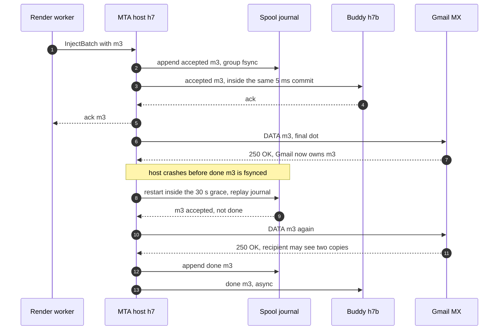

[`deep-dives/delivery-semantics-and-mta-failures.md`](deep-dives/delivery-semantics-and-mta-failures.md).

### 5.6 "How do you stop the platform from being an open relay or a phishing cannon?"

**What breaks in the current design.** Nothing stops an account from writing `From: paypal.com` in a draft until verification is enforced at send time. A stolen API key can send 5 M phishing messages through a good pool in about an hour. DKIM private keys sit in the memory of ~600 render cores. A forgeable unsubscribe token lets anyone mass-unsubscribe a competitor's list. A click redirector without a signature is an open redirect for phishers.

**The fix.**
- **Send only from verified domains**, checked at schedule time and again at render. Verification is DNS proof, and DMARC alignment needs our DKIM CNAME in their DNS anyway.
- **DKIM keys.** Private keys, the customer's and the five per-tier second signers, are wrapped by a KMS key and decrypted only in signer memory at start (a worker holds only its tiers' signer keys), never written to disk. Selectors rotate every 6 months [estimate] by flipping the CNAME target. An HSM call per signature was rejected: ~200k messages/s at peak, each signed twice.
- **No open relay.** MTAs accept injection only from render workers, over mTLS, on a private network. The campaign product exposes no SMTP submission port.
- **Signed tokens everywhere.** Unsubscribe, click and open tokens carry an HMAC with a rotating key. Old keys are kept 1 year, so an unsubscribe link keeps working well past CAN-SPAM's "at least 30 days".
- **Account takeover.** A new login plus a new API key plus a send far above the account's history, or content a classifier flags as phishing, holds the campaign for review (§12).
- **PII (personally identifiable information).** Snapshot files are encrypted per account and deleted 7 days after expiry. The suppression store holds keyed hashes, not addresses. A GDPR erasure deletes the contact but keeps the hashed suppression, so the person stays opted out.

**What changed.** Verification is enforced at render. KMS-wrapped keys. mTLS on inject. Token signing keys with rotation.

```mermaid
%% 5.6: trust boundaries. Only signed tokens cross from the internet into feedback ingest, and only render workers can inject into MTAs.
flowchart LR
    CUST[Customer, OAuth or API key] -->|"campaigns, verified From only"| CS[Campaign service]
    NET[Internet: recipients, providers] -->|"signed tokens only"| FI[Feedback ingest<br/>HMAC check]
    CS -->|"chunks"| RW[Render workers]
    KMS[(KMS)] -->|"unwrap DKIM keys at start"| RW
    RW -->|"mTLS inject, private network"| MTA[MTA fleet<br/>no submission port]
    MTA -->|"STARTTLS to MX"| NET

    class CUST,NET client
    class CS,FI,RW,MTA service
    class KMS store

    classDef client   fill:#dbeafe,stroke:#2563eb,stroke-width:2px,color:#111
    classDef service  fill:#dcfce7,stroke:#16a34a,stroke-width:2px,color:#111
    classDef store    fill:#ede9fe,stroke:#7c3aed,stroke-width:2px,color:#111
```

---

## 6. Final design and the six core flows

Everything from §5 composed. Under 15 nodes; zoom-ins in [`diagrams.md`](diagrams.md).

```mermaid
%% D3: final design. The mailbox providers' acceptance for our pools is red: it is the first thing that limits a send, it cannot be bought this week, and every queue, credit and lease in the design exists to respect it.
flowchart LR
    U[Customers<br/>app and API] -->|"schedule, imports, reports"| CS[Campaign service<br/>scheduler, import check]
    CS -->|"campaigns, accounts, pools"| CDB[(Campaign +<br/>audience DBs)]
    CS -->|"snapshot at T or T minus 10 min,<br/>chunks per provider"| SNAP[(Snapshot store)]
    SNAP -->|"provider-chunks"| DSP[Dispatcher<br/>credit per pool and provider,<br/>DRR across campaigns]
    DSP -->|"released chunks"| RW[Render workers<br/>merge, links, DKIM sign]
    RW -->|"mTLS inject to the host<br/>recorded on the chunk row"| MTA[MTA fleet<br/>200 hosts, 5,000 IPs, queues per<br/>IP and provider, ids on a buddy]
    MTA <-->|"leases, reply counts, every 1 s"| QS[Quota service<br/>pool, DKIM domain,<br/>netblock, URL keys]
    QS -->|"allowed rate per key"| DSP
    MTA -->|"SMTP, AIMD rates"| MBP[Mailbox providers<br/>Gmail acceptance<br/>for our pools]
    MBP -->|"one-click POST, DSN, ARF"| FI[Feedback ingest]
    FI -->|"suppressions"| SUP[(Suppression store)]
    SUP -->|"outbox relay"| K[[Kafka<br/>suppressions, delivery events]]
    MTA -->|"delivery events"| K
    K -->|"filter slices, since snapshot sets"| MTA
    K -->|"stream counters"| REP[Reputation and abuse<br/>tiers, canary, auto-pause]
    REP -->|"pause, tier, pool"| CS
    K -->|"events, per campaign stats"| LAKE[(Stats + event lake)]

    class U client
    class CS,DSP,RW,MTA,QS,FI,REP service
    class CDB,SNAP,SUP,LAKE store
    class K queue
    class MBP critical

    classDef client   fill:#dbeafe,stroke:#2563eb,stroke-width:2px,color:#111
    classDef service  fill:#dcfce7,stroke:#16a34a,stroke-width:2px,color:#111
    classDef store    fill:#ede9fe,stroke:#7c3aed,stroke-width:2px,color:#111
    classDef queue    fill:#cffafe,stroke:#0891b2,stroke-width:2px,color:#111
    classDef critical fill:#fee2e2,stroke:#dc2626,stroke-width:4px,color:#111
```

The six flows below are the ones to say from memory. Each is the final design, not the §4 version.

### Flow 1: the 20 M campaign at 10:00 (first message ~10:00:02, done ~11:51 at measured rates)

1. 09:50:00: the scheduler sees a list over 100k due in 10 minutes and starts the snapshot. ~40 s of scans; 2,000 chunks written per provider (Google 800, Microsoft 400, Yahoo 200, Apple 100, long tail 500); `snapshot_at = 09:50:40`.
2. 09:55: the render pool scales up for the round hour from the schedule.
3. 10:00:00: state `SENDING`. The dispatcher releases chunk 0 per provider (500 recipients each) at once, then fills each (pool, provider) credit: 720k for Google, 420k for Microsoft, 240k for Yahoo.
4. 10:00:01: render workers take chunks, skip anyone suppressed since 09:50:40, sign with the customer's DKIM key and ours, record the target host on the chunk row, inject 500 at a time.
5. 10:00:02: the first Gmail `250`. From here the pipes drain at ~1,200/s (Google), ~700/s (Microsoft), ~400/s (Yahoo), ~500/s (Apple), ~2,000/s (long tail).
6. 10:10: the live ETA replaces the plan with measured rates (if Gmail runs at half the plan, it says 13:40 now, not later).
7. ~10:33 Apple is done, ~10:42 the long tail, ~11:24 Yahoo, ~11:36 Microsoft, **~11:51 Google**. The dispatcher kept every rendered queue under 10 minutes the whole time. Picture: [D4 FR1 in diagrams.md](diagrams.md#d4-fr1-final-the-first-minute-of-the-20-m-campaign).

### Flow 2: Gmail answers 421 4.7.28 for one pool

1. t = 0: the reply names the scope (IP, netblock, DKIM domain, SPF domain, URL domain). The MTA pauses the matching key locally at once.
2. t ≤ 2 s: the quota service pauses or halves the global key; every MTA has it at its next lease.
3. t ≤ 2 s: the dispatcher's credit for that key drops to 0; other providers and other senders keep going.
4. t ≈ 1 min: the reputation service decides whether a sender caused it and pauses them.
5. t = 10 min: one connection, then one more per clean minute. No page unless 5xx blocks or deferrals above 20% for 15 minutes. Detail: §5.2 and §10.4.

### Flow 3: a purchased list, 15% bounce

1. Import: 6% of the list hard-bounced elsewhere on the platform in 90 days and the consent source is blank. Risk medium, account new: probation and a canary.
2. Probe of the first 5,000 of the hashed sample on pool C at ~50/s. Bounces come back at `RCPT TO`.
3. After 1,000 attempts (~20 s): 15% hard bounces. Campaign paused; at 10% the account's sending is suspended for review.
4. Damage: ~150 bounces on pool C. Pool B, and its ~10k senders, never saw the list.
5. Had the list been valid but unwanted, it would not bounce: the canary of up to 10k waits up to 2 h for unsubscribes, Yahoo and Microsoft complaints and seed placement, and the other 990k wait with it. Detail: §5.3.

### Flow 4: she unsubscribes at 10:01, the 10:05 message never leaves

1. 10:01:00: Gmail POSTs the one-click URL. HMAC checked, suppression row and outbox written in ~10 ms, `200` returned.
2. ~10:01:02: the suppression is on Kafka. Render workers add it to the campaign's "since snapshot" set.
3. ~10:01:05: today's slice of every MTA's Bloom filter has it.
4. 10:05:00: her message (rendered at 10:00:30) reaches the head of its queue. Filter positive, store confirms, dropped as `suppressed`. Detail: §5.4.

### Flow 5: an MTA host dies mid-send

1. Every acked message was fsynced locally and its id was on the buddy: none lost, even if the disk is gone.
2. ~130 messages are sent twice: ~125 whose 250 we never read, plus ~8 unsynced `done` records on a restart (~133) or ~3 the buddy lacked on a takeover (~128). At-least-once, said out loud.
3. t = 3 s: the send lease expires. If the host is back inside the 30 s grace, it replays its own journal (~1 minute).
4. t = 33 s otherwise: the buddy bumps the generation, announces the 25 IPs, streams the re-render of ~300k accepted-not-done messages (~18 s on 50 cores) and resumes sending at ~34 s. A late reboot of the old host finds itself stale and deletes its spool. Detail: §5.5.

### Flow 6: Black Friday at 5x

1. Inject peaks are absorbed as unrendered snapshot rows; rendered queues stay at 10 minutes of drain.
2. Transactional pools are untouched. Within each pool, DRR shares the pipes, so small sends finish in minutes and the largest campaigns stretch to many hours.
3. Each dedicated sender's forecast peak was checked in October to fit in 12 h at the 10th-percentile rate; extra IPs started warming ~6 weeks earlier and volume ramped through November, so Friday is not a doubling. Nothing cold is added on the day. Promotions with `expire_after` drop instead of arriving late. Detail: §5.1.

---

## 7. Trade-offs

| Decision | Option A | Option B | Chose | Why |
|---|---|---|---|---|
| Throttle key | Recipient domain string | Mailbox provider from MX records | MX provider | Google says so explicitly. Google Workspace and Microsoft 365 put a large share of business domains behind a few MX operators |
| Rate setting | Static per-provider config | AIMD on SMTP replies, scoped by reply text | AIMD | The right rate changes with reputation daily and is never published |
| Global coordination | Each MTA alone | Quota service with 1 s leases for keys that span MTAs | Leases | DKIM-domain, netblock and URL-domain limits span hosts. Overshoot bounded by one lease. Fails toward slower |
| Queue structure | One FIFO per MTA, or a Kafka topic per provider | Per (IP, provider) queues, DRR per account inside | Per key with DRR | No head-of-line blocking across providers or across senders |
| Where the backlog waits | Rendered, in MTA spools or Kafka | Unrendered snapshot rows, released by credit | Unrendered | 500 B vs 50 KB, still cancellable and still filtered. Rendered queue held to 10 min |
| Suppression check | At snapshot only, or a synchronous store read per send | Snapshot + render delta + pre-SMTP Bloom filter | Three checks | Under 60 s honored with no remote read on the hot path |
| Pools | One shared pool, or dedicated for all | Tiered shared A, B, C + dedicated for steady large senders + transactional apart | Tiered | Isolation where it pays. Small senders cannot keep an IP warm |
| Abuse loop | Hourly batch | Streaming counters + probe on a probation pool + a 2 h canary for new and risky campaigns | All three | Bounces arrive in seconds and a 1 M list takes 9 minutes to send; Gmail complaints arrive a day later, so complaint harm is capped at one canary, for a ~2 h delay on ~3% of campaigns |
| Delivery guarantee | Try for exactly-once | At-least-once with a stated duplicate window | At-least-once | SMTP has no receiver-side idempotency. Loss is worse than a rare duplicate |
| Spool durability | Replicate bodies, or re-inject from Kafka events | Local fsync + ids on a buddy host, bodies re-rendered, takeover fenced by generation | Ids on a buddy | Replicate what you cannot recompute: 250 KB/s per host, 0 lost, ~128 to ~133 duplicates per crash whatever Kafka's lag |
| Retry routing | Rendezvous hash of the message id | Target host recorded on the chunk row before inject | Recorded | One membership change moves ~1/5 of a retried batch to a host that never saw it |
| DKIM keys | HSM sign per message | KMS-wrapped keys decrypted only in signer memory | KMS-wrapped | ~200k messages/s at peak, each signed twice |
| DKIM signers | Customer domain only, or one platform signer | Customer domain plus a second signer domain per pool tier | Both, per tier | Yahoo's CFL and Gmail's FBL key on the signer; five enrollments cover every customer, and a throttle on one signer pauses one tier, for ~1 ms per message |
| Message to campaign mapping | A 2 B rows/day lookup table | Signed, decodable message id in VERP and headers | Decodable id | No table, stateless feedback ingest |
| Black Friday capacity | Add IPs on the day | Peak day fits 12 h at the p10 rate, IPs warmed 6 weeks ahead, volume ramped through November | Plan ahead | A cold IP gets less, not more, and a sudden 5x is itself a reason for receivers to slow us |
| Build or buy | Amazon SES at $0.10 per 1,000 | Own MTAs and IPs | Own | `2 B × $0.10 ÷ 1,000 = $200k/day`, ~$73 M/year; and reputation management is the product |
| Refused to build | Exactly-once delivery, synchronous spool replication, IP rotation on throttle, SMTP RCPT list probing, per-message HSM signing, a per-message state table, real-time open accuracy | | | Each costs a lot or makes deliverability worse for a guarantee the protocol or the receivers cannot give |

**Consistency model, stated once.** Campaign and account state: strong, single row in the sharded campaign DB. Suppression: strong at the store (single-key write), eventual to every checker with p99 ~5 s, SLO 60 s, and the guarantee is "no send after 60 s", not "zero race". Throttle budgets: eventual, soft state, leases of 2 s, so a key can overshoot by at most one lease. Delivery: at-least-once per message, ~130 duplicates per MTA crash, with deterministic ids and recorded target hosts for dedup inside our system. Stats and reports: eventual, seconds to minutes. Cross-site: asynchronous, including a mirrored final-id stream (~5 MB/s); a site loss can re-send ~1 s of mail, and loses none.

---

## 8. Staff-level notes

- **Simplest thing that meets the requirement.** Per-key queues inside MTAs we already run, AIMD on replies, one small soft-state quota service, a credit counter in the dispatcher, a Bloom filter fed by a topic. We refused exactly-once delivery, synchronous spool replication, IP rotation, RCPT probing and a per-message state table, and can say why for each (§7).
- **Failure modes and blast radius.** A render worker: nothing (lease expires in 30 s, the next owner resumes from the checkpoint). An MTA host: a restart costs ~1 minute and ~133 duplicates; a lost disk costs ~34 s of silence on its 25 IPs, 0 messages and ~128 duplicates (§5.5). The quota service: MTAs run at half their last rate for 5 minutes, then one connection per key; slower, never faster. Kafka: suppressions stop being pushed, so every MTA pulls the suppression store's `created_at` index every 2 s instead (~150 range reads/s fleet-wide, not 100k point reads/s) and mail is held only when both feeds are stale for 60 s; canary and probation sends are held, because their verdict events cannot flow; each MTA keeps local per-campaign bounce counters so the 5% and 10% lines still act; stats lag ([suppression dive](deep-dives/bounces-complaints-and-suppression.md) §6). The suppression store: feedback ingest publishes unsubscribes straight to the `suppressions` topic, so checks keep working, and the writer replays them into the store when it returns; filter positives are held. The biggest blast radius is **reputation**, not infrastructure: one bad sender on a shared pool, or our shared tracking domain throttled at Gmail, hits thousands of customers for days. That is why §5.3 and the branded link domains exist.
- **Migration from an existing system** (static per-domain MTA configs, nightly bounce processing): phase 1, provider keys and per-key metrics in shadow; phase 2, suppression stream and MTA filter in log-only, then enforce; phase 3, quota service in observe mode, compared with the static configs; phase 4, adaptive throttling per pool, one shared B pool for a week first, dedicated pools last with the customer told; phase 5, dispatcher pacing for new campaigns; phase 6, streaming abuse loop and canary alert-only for 2 weeks, then auto-pause. Buddy replication and the send-lease registry go in with phase 1, because they change no sending behaviour. Rollback for every phase is a per-pool or per-feature flag; MTAs keep both code paths until phase 6 ends. MTAs restart one host at a time; the spool survives and IPs move to a standby during the upgrade. [D12](diagrams.md#d12-rollout--migration).
- **Operability.** SLOs over 28 days: 99% of campaigns have their first message accepted by an MTA within 60 s of `send_at`; suppression propagation p99 under 60 s; injection availability 99.95%; 99.9% of messages reach a final state before expiry; zero sends to addresses suppressed more than 60 s earlier (a daily audit join of sends against suppressions). Pages at 3 AM: `5xx` block rate above 1% at a major provider for a pool for 5 minutes; Google deferrals above 20% for a pool for 15 minutes; scheduler lag above 2 minutes; suppression consumer lag above 30 s on any MTA; spool disk above 80%, a buddy more than 500 `done` records behind, or a host down with no takeover after 2 minutes; quota service unreachable for 1 minute; a `4.7.28` about the same Message-ID (a bug). A single campaign auto-paused is a customer notification and a compliance ticket, not a page.
- **Cost.** Bandwidth is the line that surprises people: `100 TB/day` is ~3 PB a month. At cloud egress list prices (~$0.05/GB at volume [estimate]) that is ~$150k/month; in colocation, paid per Mbps at the 95th percentile (~40 Gbps × ~$0.30/Mbps [estimate]) it is ~$12k/month, and clouds restrict outbound port 25 anyway. 200 MTA hosts at ~$700/month [estimate] is ~$140k/month. Render is small (~69 cores average, ~600 at peak with two signatures, autoscaled). Kafka (~2 TB/day, 7 days, 3 replicas, ~42 TB) is ~12 brokers. The lake grows ~145 TB/year. All in, a few million dollars a year against ~$73 M/year at SES list price. The people cost is larger: a sending-platform team of 8 to 10, a campaign-pipeline team of 6 to 8, a deliverability and compliance team (engineers plus analysts and an abuse desk), and a reporting team.
- **Team boundaries.** The audience team owns contacts and segments; the contract is the snapshot API. The campaign team owns content; the contract is an immutable content version. The sending platform owns dispatcher, render, MTAs and the quota service, and also serves the transactional product. Deliverability owns pool policy, thresholds and provider relationships; the contract is configuration in the reputation service, changed without a deploy. Reporting owns the lake.
- **Explicit trade-off.** We accept a ~2 h floor on a 20 M campaign (1.3 to 5.6 h depending on what Gmail really accepts), ~130 duplicates per MTA crash, and a ~2 h delay for the ~3% of campaigns that get a canary, to keep reputation, which is the only asset that cannot be bought back quickly.

---

## 9. What is expected at each level

**Mid (80/20 breadth/depth).** Scheduler, a queue, workers that render and send over SMTP, a bounce handler and an unsubscribe table. Knows SPF, DKIM and DMARC exist. Rate limits "per domain" with a token bucket. May not notice that the receiver, not our fleet, sets the speed.

**Senior (60/40).** Splits snapshot, render and delivery; uses per-provider queues to avoid head-of-line blocking; adapts the rate to `4xx` replies; separates transactional from marketing IPs; checks suppression at render; handles hard bounces and complaints from feedback loops; knows the 0.1% and 0.3% spam-rate lines. Goes deep on one of throttling, reputation or the feedback loop.

**Staff+ (40/60).** Everything above, plus: says in the first minute that receivers set the speed and does the 8 M ÷ 1,200/s arithmetic; keys throttles on MX provider, not domain string; scopes back-off by what the `4.7.28` text names and coordinates keys that span MTAs with leases; keeps the backlog unrendered and paces render by credit; checks suppression again just before SMTP; states at-least-once and the 250 duplicate window, and replicates ids, not bodies; protects shared pools from bounces in seconds and from complaints with a canary, because Gmail reports complaints only daily; presents the 2 h as a range and sizes pools from measured rates; plans Black Friday capacity six weeks ahead because of warm-up; reports human opens separately because of MPP; and gives the shadow-first migration with per-pool rollback.

---

## 10. Nitty-gritty (past interview scope)

### 10.1 Internals of each chosen technology

**The MTA.** An event loop per host that owns 25 IPs. The spool is append-only segment files on local NVMe plus a journal of `accepted`, `attempt(reply)` and `done` records, group-committed every ~5 ms. An in-memory index maps `message_id` to a segment offset; it doubles as the dedup set for re-injected ids (kept 5 days). The `accepted` and `done` ids also stream to a buddy host (§5.5), and the host sends only while it holds its send lease and current generation. Queues are keyed (IP, provider); each holds one FIFO of message references per account, served by DRR with a quantum of one message times the account's weight. One sender loop per queue checks two budgets before it takes a message: its local AIMD bucket for (IP, provider), and the leased tokens for every global key the message belongs to. It reuses connections (many messages per connection), uses `PIPELINING` (RFC 2920) to cut round trips, prefers `STARTTLS`, and resolves MX through a caching resolver on the host. Every reply goes through the classifier in [D6](diagrams.md#d6-activity--decision-flow).

```mermaid
%% Inside one MTA host: inject, spool, per-key queues with DRR, budget check, SMTP, reply classifier. The receiver is red because its replies drive every rate in this box.
flowchart LR
    IN[InjectBatch<br/>mTLS] -->|"append, group fsync 5 ms"| SP[(Spool segments<br/>+ journal, NVMe)]
    SP -->|"message refs"| QQ[Queues per IP and provider<br/>FIFO per account, DRR]
    QQ -->|"next message"| BG{Tokens for every key?<br/>local AIMD + leases}
    BG -->|"yes"| TX[SMTP sender<br/>pooled connections,<br/>PIPELINING, STARTTLS]
    BG -->|"no, wait"| QQ
    TX -->|"MAIL, RCPT, DATA"| RX[Receiver MX]
    RX -->|"reply code and text"| CL[Reply classifier]
    CL -->|"done or bounced"| SP
    CL -->|"rate up, halve, pause key"| BG
    CL -->|"delivery events"| EV[[Kafka]]

    class IN,QQ,TX,CL service
    class SP store
    class BG decision
    class RX critical
    class EV queue

    classDef service  fill:#dcfce7,stroke:#16a34a,stroke-width:2px,color:#111
    classDef store    fill:#ede9fe,stroke:#7c3aed,stroke-width:2px,color:#111
    classDef queue    fill:#cffafe,stroke:#0891b2,stroke-width:2px,color:#111
    classDef critical fill:#fee2e2,stroke:#dc2626,stroke-width:4px,color:#111
    classDef decision fill:#fce7f3,stroke:#db2777,stroke-width:2px,color:#111
```

**Postfix, for contrast.** Its scheduler already has per-destination concurrency with feedback: start at `initial_destination_concurrency = 5`, cap at `default_destination_concurrency_limit = 20`, move by `positive_feedback` and `negative_feedback` (both default 1). But feedback reacts only to "connection or handshake failure", a destination is the next-hop domain rather than the provider, and nothing is shared between hosts. Deferred mail is retried between `minimal_backoff_time = 300s` and `maximal_backoff_time = 4000s` and bounced after `maximal_queue_lifetime = 5d` ([postconf](https://www.postfix.org/postconf.5.html)). We keep the shape and change the inputs.

**The quota service.** A handful of nodes, keys spread by consistent hashing. Per key: rate, mode (`NORMAL`, `BACKOFF`, `PAUSED`), `paused_until`, and the demand each MTA reported in the last second. Every second it splits each key's rate across MTAs, max-min fair by demand, and returns leases valid for 2 s. All of this is soft state: after a restart the MTAs report within a second and the rates are rebuilt from their current values. Only manual overrides and warm-up caps are durable, in the campaign DB. [`../../concepts/leases-fencing-clocks.md`](../../concepts/leases-fencing-clocks.md).

**Kafka.** `suppressions`, keyed by `account_id`, 32 partitions, 7 days: every MTA and render worker reads all of it (~24 M records/day × ~100 B = ~2.4 GB/day each). `delivery-events`, keyed by `message_id`, 256 partitions, 7 days, ~23 MB/s average. `feedback-raw` for parsed DSNs and ARF reports. Consumers commit offsets after their own idempotent write. When Kafka is down, MTAs and render workers pull the suppression store's `created_at` index every 2 s instead. [`../../concepts/exactly-once.md`](../../concepts/exactly-once.md), [`../../concepts/stream-processing.md`](../../concepts/stream-processing.md).

**The dispatcher.** Sharded by pool. Per (pool, provider): the credit (allowed rate × 10 min, from the quota service, minus queued and rendering, plus a release whenever the key is empty and not paused), a DRR ring of active campaigns, and the list of free chunk-0 releases. Canary campaigns release only their sample until the reputation service's verdict. Its state is rebuilt from `SEND_CHUNK` states plus one second of MTA reports, so a failover costs about one second of releases.

### 10.2 Configuration knobs that matter

| Component | Knob | Value | Why |
|---|---|---|---|
| MTA | journal group commit | 5 ms | Adds at most ~13 (typically ~8) to the ~125 duplicates the 250 window gives per restart |
| MTA | final-dot (DATA termination) timeout | 10 min, per RFC 5321 §4.5.3.2.6 | A shorter one turns every slow 250 into a duplicate |
| MTA | buddy replication | `accepted` sync, `done` async, stop SMTP over 500 behind | 0 lost on a dead disk, for ~250 KB/s per host |
| Registry | send lease / takeover grace | renew 1 s, valid 3 s / 30 s | Fences a zombie host; a quick reboot replays its own journal |
| MTA | connections per (IP, Google) | start 1 after a 4.7.28, cap ~20 [estimate] | Google's ramp: one connection, then one at a time |
| MTA | AIMD | +1 step per clean 30 s; × 0.5 when deferrals exceed 2% of 60 s | Probe up slowly, back off hard |
| MTA | pause on `421 4.7.28` | 10 min, scoped by the reply text | Google's published procedure |
| MTA | message retry schedule | 15 min, 45 min, then every 2 h, expire at 4 days or `expire_after` | RFC 5321 §4.5.4.1 guidance |
| MTA | per-recipient `450 4.2.1` | retry that message in 30 min | One busy mailbox is not a pool signal |
| MTA | suppression Bloom filter | 6 daily slices, ~14 bits per entry, ~0.65% false positives, ~259 MB | Covers the oldest message a spool can hold; a Bloom filter cannot delete |
| Quota service | lease period / validity | 1 s / 2 s | Overshoot bounded by one lease |
| Quota service | fallback when unreachable | last rate × 0.5 for 5 min, then 1 connection per key | Fail slower, never faster |
| Dispatcher | credit | allowed rate × 10 min per (pool, provider), release when the key is empty | Short rendered queues; an empty key can never stall at a measured drain of 0 |
| Quota service | pool-key halving | IP-scoped hits on 5% of the pool's active IPs in 60 s, or merged deferrals over 2% | A fixed "3 IPs" fires ~48 times a day on a 1,000-IP pool |
| Dispatcher | free chunk 0 | 500 recipients per (campaign, provider), released at `send_at` | First message within seconds for every campaign, round-hour burst bounded to ~7.5 M |
| Snapshot | early start | lists over 100k at `send_at − 10 min` | 20 M rows take ~40 s to scan |
| Chunks | size / inject batch / lease | 10k / 500 / 30 s | A crash redoes at most one batch |
| Abuse loop | hard bounces after 1,000 attempts | warn 2%, pause 5%, suspend 10% | Mirrors the README target and SES's 5% / 10% lines |
| Abuse loop | complaints | warn 0.1%, pause 0.3% of FBL-covered deliveries | Google's and Yahoo's lines |
| Probation | probe size | 5,000 on pool C | Bounces judged in seconds |
| Canary | size / hold / hold-the-rest lines | `min(10k, 20%)` hashed sample / up to 2 h / 25 unsubscribes or 4 FBL complaints per 10k [estimate] | Complaint harm capped at one canary; ~3% of campaigns wait ~2 h |
| Warm-up | daily cap curve | ~1.4x per day from 20/hour, ~41 days | The shape of SendGrid's published schedule |

### 10.3 Capacity math per component

| Component | Per unit | Total | Headroom |
|---|---|---|---|
| Render workers | ~330 msg/s per core (3 ms each, two signatures) | ~600 cores at the 200k/s peak, ~69 on average | Scaled on the send calendar |
| MTA host | 25 IPs, ~2,500 msg/s, ~2,000 connections, ~15 GB spool at 10 min of credit, ~250 KB/s of ids to its buddy | 200 hosts, ~500k/s ceiling | ~5% used on average, ~20% at the egress peak. Not the limit |
| Sending IP | ~60/s to Google, ~35 Microsoft, ~20 Yahoo [estimate] at high reputation | 5,000 IPs | **The limit.** The 20 M sender's 20 IPs need 1.85 h for Google |
| Quota service | ~100k keys active, 200 MTAs × ~500 keys reported per second | 3 to 5 nodes | Soft state, cheap |
| Suppression store | ~280 writes/s average, ~3k/s peak; ~150 confirm reads/s; ~150 range reads/s when Kafka is down; snapshot bulk reads | ~8.8 B rows a year, ~560 GB a year, ~1.7 TB after 3 years | One ordinary KV cluster |
| Kafka | ~23 MB/s average, ~200 MB/s peak; ~2 TB/day | ~42 TB at 7 days × 3 replicas | ~12 brokers |
| Snapshot store | 20 M × 500 B = 10 GB for the largest campaign | ~1 TB/day written, deleted after expiry + 7 days | Object storage |
| Event lake | ~400 GB/day compressed | ~145 TB/year | Object storage |

Nothing in our fleet is near a limit at 2 B/day. The first limits are external: **per-IP acceptance at Google and Microsoft**, then **warm IP inventory** before Black Friday.

### 10.4 Failure timeline

Gmail throttles many IPs of shared pool B (~1,000 IPs) at the 10:00 peak, second by second:

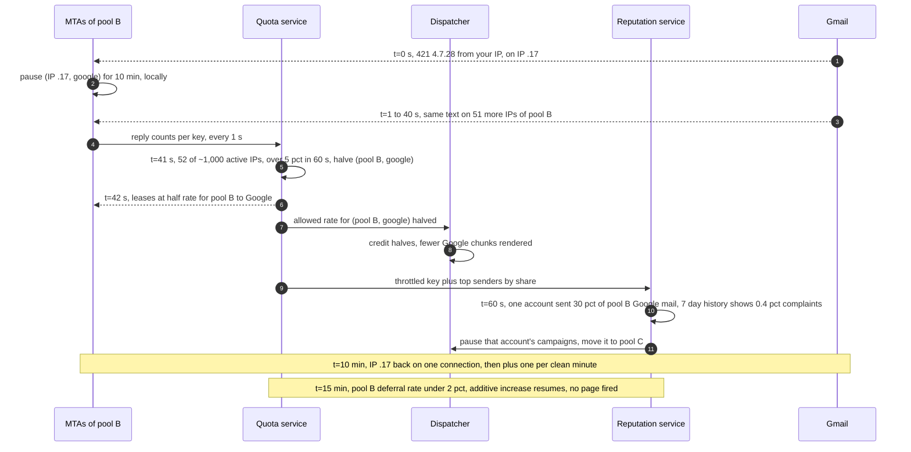

**An MTA host dies at 10:20, disk and all.** t = 0: connections drop; ~128 messages will be resent (~125 in the 250 window, ~3 `done` records the buddy had not received; the host's own unsynced records died with its disk). t = 3 s: its send lease expires; the quota service stops leasing to it. t = 33 s, after the grace: the buddy bumps the host to the next generation, announces its 25 IPs, loads the replicated ids and streams the re-render of ~300k accepted-not-done messages (`300k × 3 ms`, ~18 s on 50 render cores). t ≈ 34 s: sending resumes at each key's last rate, while the re-render continues. If the old host reboots later, the registry tells it it is stale and it deletes its spool. The on-call sees a takeover event and a re-render count; customers see under a minute of delay for those recipients, ~128 duplicates and no loss. Second by second: [delivery dive](deep-dives/delivery-semantics-and-mta-failures.md) §3.

**The quota service is unreachable.** t = 0 to 2 s: current leases run out. t = 2 s to 5 min: every MTA runs each global key at half its last leased rate; local (IP, provider) AIMD continues. t = 1 min: page. t = 5 min: one connection per global key. Mail slows; it never speeds past what Gmail last accepted.

### 10.5 Exactly-once and idempotency end to end

| Hop | Where duplicates come from | Dedup key | Where removed | Lifetime |
|---|---|---|---|---|
| Schedule and send API | Double click, client retry | `Idempotency-Key` + campaign state `DRAFT → SCHEDULED` compare-and-set | Campaign DB | Campaign life |
| Scheduler start | Two scheduler replicas, failover | Compare-and-set `SCHEDULED → SNAPSHOTTING` | Campaign DB | |
| Snapshot | Re-run after a crash | Chunk path `(campaign, provider, chunk_no)` | Overwrite, same content | Until expiry + 7 days |
| Chunk processing | Two workers after a lease expiry | `lease_epoch` | Fenced writes; checkpoint every 500 | Lease 30 s |
| Render to MTA | Re-injected batch | `message_id` | Target host recorded on the chunk row (epoch-fenced); that host's spool index rejects | 5 days |
| MTA host loss | Re-render of accepted-not-done ids | `message_id` | Ids on the buddy; generation fence stops the old host replaying; ≤ 500 unreplicated `done`, typically ~5 | Until final |
| MTA to receiver | Lost 250, crash before `done` | none the receiver honors | **Not removed.** At-least-once, ~133 per restart, ~128 per takeover | |
| DSN and ARF | Providers resend, duplicates in our mailbox | `(message_id, type)` | Stream job state | 7 days |
| One-click POST | Provider retries | `(account, email_hash)` | Upsert | Forever |
| Suppression relay | Outbox relay at-least-once | `(account, email_hash, created_at)` | Idempotent consumers (set insert) | |
| Delivery events to stats | Consumer replays | `(message_id, seq)` | Stream job state | 7 days |

The one place a duplicate reaches a human is the SMTP hop, and the protocol puts it there. Everything before it is idempotent by key; everything after it is a set insert or a counter guarded by `(message_id, seq)`.

### 10.6 Consistency model per edge

| Edge | Model | Why |
|---|---|---|
| Customer to campaign service | Strong, read-your-writes on the campaign row | The customer sees their own schedule |
| Audience DB to snapshot | Point-in-time read at `snapshot_at` | A send is "the audience as of" one moment |
| Dispatcher credit from the quota service's allowed rate | Eventual, ~1 s | A second of overshoot is 1,200 messages into a 720k credit |
| Quota service to MTAs | Eventual, leases valid 2 s | Overshoot bounded by one lease |
| One-click POST to suppression store | Strong, single-key upsert before the 200 | The click is never lost |
| Suppression store to render and MTA checks | Eventual, p99 ~5 s, SLO 60 s | Honest residual: a message already mid-transaction |
| Render to MTA | At-least-once, deduplicated by id | |
| MTA to receiver | At-least-once | SMTP 250 window |
| Delivery events to stats and reputation | Eventual, seconds | Reports and the abuse loop tolerate seconds |
| Reputation to campaign pause | Eventual, ~1 s to the dispatcher, ~10 s to purge MTA queues | Seconds of extra sends at most |
| Site to site | Asynchronous, plus a mirrored final-id stream (~50 B per message, ~5 MB/s) | Site B knows what site A delivered; a site loss re-sends ~1 s of mail and loses none |

### 10.7 Alternatives rejected

| Alternative | Why it looked attractive | Why rejected |
|---|---|---|
| Postfix as is | Free, proven, has per-destination concurrency feedback | Keys by next-hop domain, reacts only to connection failures, no cross-host budgets, no per-account fairness |
| A Kafka topic per provider as the delivery queue | Durable, replayable, familiar | A log cannot skip one deferred message or pause one sender inside a partition: head-of-line blocking by design |
| Central queue in Redis sorted sets | Global view of every message, easy priorities | 100k/s of rendered 50 KB payloads through one store; a second copy of the spool; asynchronous replication can lose acked mail |
| One SQS queue per key | Delay queues and visibility timeouts built in | ~100k active keys, fairness across accounts inside a key is ours to build anyway, and the MTA still needs its own connection state |
| Amazon SES or SendGrid underneath | No MTAs or IPs to run | ~$73 M/year at SES's $0.10 per 1,000, and pool policy is our product, not theirs |
| Token bucket per recipient domain | Simple, the textbook rate limiter | Wrong key (Workspace domains share Google's limits) and a fixed rate for a moving target |
| Synchronous suppression read per send | Strongest guarantee | A remote read per message on the hot path and a hard dependency for all mail |
| Per-message state table (2 B rows/day) | Easy "where is my message" queries | Write amplification for data the spool, the events and the decodable id already carry |
| IP rotation on throttle | Restores throughput for a while | Google limits per domain too; cold IPs get less; it is snowshoeing |

### 10.8 How the big companies do it

- **Google (the receiver's side).** Its guidelines are the clearest public spec of what a sender must do: limit per IP by MX record domain, keep spam rate under 0.10% and never at 0.30%, one-click unsubscribe for bulk mail, and a specific 4.7.28 recovery: 10 minutes off, one connection, then one at a time. It also reports aggregate complaints per `Feedback-ID` rather than per message.
- **Amazon SES.** Reputation is per account, enforced by thresholds: bounce rate 5% review and 10% pause, complaints 0.1% review and 0.5% pause. A hard-bounced address goes on a global suppression list and "can remain on the suppression list for up to 14 days" ([SES FAQ](https://aws.amazon.com/ses/faqs/)). Our abuse loop uses the same shape at campaign granularity and in seconds.
- **Twilio SendGrid.** Automated warm-up over 41 days, hourly caps from 20 to 19,601,056, with overflow sent from other IPs; deferred mail is retried "until they expire after 72 hours" ([SendGrid](https://www.twilio.com/docs/sendgrid/ui/sending-email/warming-up-an-ip-address)). We use the same curve shape and a longer, README-mandated 4-day expiry with a per-campaign override.
- **Postfix** shows that per-destination concurrency feedback works and is old; what large ESPs add is the provider key, reply-text scoping and global budgets (§10.1).
- **Mailchimp itself** publishes little about its internals. The survey's "600 M/day" and "1.39 B peak day" have no source page I could open: `[unverified]`, so this design uses the README's ~2 B/day `[estimate]`.

Survey corrections found while writing: the Google SMTP error URL in the survey (`answer/14126336`) does not exist; the real page is `answer/3726730`. Postfix's limit of 20 is per destination, not "all domains share 20 connection slots". Microsoft's rejection code is `550 5.7.515` from May 5, 2025, not `5.7.15` on April 29 (that date is when the post was updated). The "July 2026 tightened to 0.1%" claim is not on Google's page, which says "below 0.10%" and "avoid ever reaching ... 0.30%". The market-share numbers are open share, not mailbox share.

### 10.9 Operational runbook

- **Dashboards (the five).** Messages accepted per second by provider and pool; deferral and block rates per (pool, provider) with the top 4.7.28 scopes; dispatcher credit used and rendered-queue age per pool; suppression propagation lag (POST to every MTA's filter); bounce and complaint rates per account against the thresholds, plus Postmaster Tools spam rate per DKIM domain.
- **Alerts.** Listed in §8 Operability, with the deliverability on-call paged for provider blocks and the platform on-call for scheduler, spool, stream and quota issues.
- **Rollout.** MTA releases go to one host per pool for 24 h, compared on deferral rate and delivered per hour against its peers, then 10%, 50%, 100% over a week, never in the 09:00 to 12:00 US Eastern send peak. Throttle policy changes (AIMD steps, thresholds) are config, rolled per pool with the same comparison.
- **Rollback.** MTA code by host, with the spool format versioned and backward-readable. Policy by config flag per pool. A bad abuse threshold that paused good senders: bulk resume from the reputation console; the paused campaigns' remaining chunks are still unrendered rows, so nothing needs re-rendering.

### 10.10 Security and abuse

The core controls are §5.6. Beyond them:
- **List bombing.** Bots submit victims' addresses into many customers' signup forms. Double opt-in for embedded forms by default, per-source-IP rate limits, and CAPTCHA on forms with a sudden spike.
- **Spam traps.** Pristine traps are addresses that never signed up; recycled traps were abandoned and reactivated. We cannot see either, so the controls are indirect: import checks, sunsetting contacts with no clicks in 12 months [estimate], and watching blocklist listings per pool.
- **Content.** A classifier on every campaign's content for phishing (brand impersonation, credential forms) before release; first sends from new accounts get a human look above a size threshold.
- **API.** Per-account rate limits on sends and imports; API keys scoped to an account and an action; a sudden new key plus a large send is held (§5.6). [`../../concepts/rate-limiting-and-load-shedding.md`](../../concepts/rate-limiting-and-load-shedding.md), [`../../concepts/oauth.md`](../../concepts/oauth.md).
- **Tracking links.** Signed, so our click domain is not an open redirect; a branded link domain for every paying tier, so a URL-domain throttle hits one customer.

### 10.11 Evolution

- **10x volume (20 B/day).** Our fleet scales by hosts; the real work is IPs: ~50,000 warmed addresses, which is months of warm-up and IPv4 inventory. Quota service keys grow ~10x, still a few nodes. More sites, so a site loss costs a smaller share of each pool.
- **EU data residency.** Snapshot store, suppression store and lake per region by account home; MTAs in the EU send EU accounts' mail. The seam is the account's home region on `ACCOUNT`.
- **Receivers tighten again.** New provider rules (another complaint line, a new required header) are config in the reputation service and the reply classifier, not code.
- **GDPR erasure.** Delete the contact, its events in the lake by account and contact id, and the snapshot files; keep the hashed suppression so the person stays opted out.
- **Send-time optimization.** A model picks each recipient's hour from human opens and clicks (never machine opens). It only moves work in time, so it flows through the same dispatcher and credit.
- **SMS and push.** The dispatcher, credit and quota service are channel-agnostic: carriers and push gateways are just providers with rates.

---

## 11. Follow-up questions to expect

Ranked by how likely an interviewer asks them. Answers in [`edge-cases.md`](edge-cases.md) and the deep dives.

1. **A 20 M campaign at 10:00: what happens in the first minute, and where is the queueing?** Flow 1, §5.1, [`deep-dives/campaign-fan-out-and-scheduling.md`](deep-dives/campaign-fan-out-and-scheduling.md).
2. **Why not rate-limit per recipient domain?** §4.2, [`deep-dives/per-domain-throttling.md`](deep-dives/per-domain-throttling.md).
3. **Gmail answers `421 4.7.28`. What changes, in order?** §5.2, §10.4.
4. **A purchased list bounces 15%. Who is protected, and how fast?** §5.3, [`deep-dives/reputation-and-ip-pools.md`](deep-dives/reputation-and-ip-pools.md).
5. **Unsubscribe at 10:01, message at 10:05?** §5.4, [`deep-dives/bounces-complaints-and-suppression.md`](deep-dives/bounces-complaints-and-suppression.md).
6. **MTA crash after 250: duplicate or loss?** §5.5, [`deep-dives/delivery-semantics-and-mta-failures.md`](deep-dives/delivery-semantics-and-mta-failures.md).
7. **How do several MTAs share one budget?** Leases from the quota service, §5.2, §10.1.
8. **Black Friday at 5x: who waits?** §5.1, Flow 6.
9. **Shared vs dedicated IPs, and how do you warm one?** §4.3, [`deep-dives/reputation-and-ip-pools.md`](deep-dives/reputation-and-ip-pools.md).
10. **Apple MPP and open rates?** §4.4.
11. **Why not use Kafka as the per-provider queue?** §5.1, §10.7.
12. **Build or buy (SES)?** §7, §8 Cost.
13. **How wrong can your 2 h be?** 1.3 to 5.6 h; live ETA, p10 sizing, §2.
14. **A list that does not bounce but draws complaints?** The canary, §5.3.

---

## 12. Presenting this as an Intuit case study

Mailchimp is an Intuit business, so expect the panel to know the domain. Per [`../company-questions.md`](../company-questions.md) §1: a deck presented four times, AI graded everywhere, security as its own section, scoping graded.

**Deck (10 slides).**
1. The problem in one line, and the one number: 8 M Google messages ÷ 1,200/s = 1.85 h.
2. **Scope and what we cut:** editor, segmentation, journeys, transactional (own pools), SMS, inbound. Refused: exactly-once delivery, IP rotation, RCPT probing, synchronous spool replication.
3. Requirements and back-of-envelope: 2 B/day, 23k/s average, 200k/s inject peak, the receiver as the constraint.
4. The pipeline: snapshot, dispatcher, render, MTA (§6 diagram).
5. Throttling: MX provider keys, AIMD on replies, scoped 4.7.28, leases (§5.2).
6. Reputation: pools by tier, warm-up, DKIM signed twice, probe, canary and streaming abuse loop (§5.3).
7. Correctness: three suppression checks, deterministic ids, the honest 250 duplicate window (§5.4, §5.5).
8. AI: the send-risk model (below).
9. Security and compliance (below), plus Black Friday capacity planning.
10. Operability, cost ($73 M/year at SES list price vs a few million to own), migration with per-pool rollback, and what I would do next.

**The AI story: one place a model does real work.** A **send-risk model** scores every import and every first campaign of an account before release: features are list features (share of platform-known bounces, role and disposable addresses, list age, consent source), account features (age, payment signals, login and API-key changes) and content (an LLM, large language model, classifier for phishing and brand impersonation over the rendered template). Output: `release`, `probe and canary on pool C`, or `hold for human review`.
- **Guardrails.** The model can only make a send more cautious; it can add a canary but never remove one, and never skip the hard thresholds of §5.3 or move an account to a better pool. Its output is a schema-checked enum with reasons. Holds go to a human compliance queue with a target of 2 business hours [estimate].
- **Fallback.** If the model times out (budget 2 s) or is down, rules decide: new account or risky import means probe and canary. Sends are never blocked by the model being unavailable.
- **Measurement.** Precision is measured on outcomes the platform sees anyway (probe bounce rate, complaints within 24 h); false holds are measured by reviewer overturn rate; drift alerts when the hold rate moves 2x from its baseline.
- A second, lower-risk use: send-time optimization from human opens and clicks, never from MPP machine opens.

**The security story.** Authn: OAuth for the app and scoped API keys for integrations; mTLS between render workers and MTAs. Authz: an account sends only from domains it proved in DNS, and only to its own audiences; deliverability staff actions are role-gated and audited. PII: emails and merge fields in snapshots are encrypted per account and deleted 7 days after expiry; the suppression store keeps keyed hashes; GDPR erasure keeps a hashed opt-out. Encryption: TLS in transit including `STARTTLS` to receivers; KMS-wrapped DKIM keys and at-rest encryption everywhere else. Audit: every pause, resume, pool move and threshold change is logged with actor and reason.

**What each round will re-open.**
- **Round 1 (architecture).** Why is the key the MX provider? How do 4 MTAs share one DKIM-domain budget? Why not Kafka as the queue?
- **Round 2 (scale and failure).** Walk the 20 M campaign minute by minute. What happens when an MTA dies after a 250? Black Friday at 5x: who waits, and why can you not just add IPs?
- **Round 3 (AI).** What does the risk model see, and what can it never do? What happens when it is down? How do you know it is not holding good customers?
- **Round 4 (security and leadership).** How do you stop an account takeover from sending 5 M phishing emails? How do you migrate from static throttles without hurting deliverability? Which team owns pool policy, and how does it change without a deploy?
