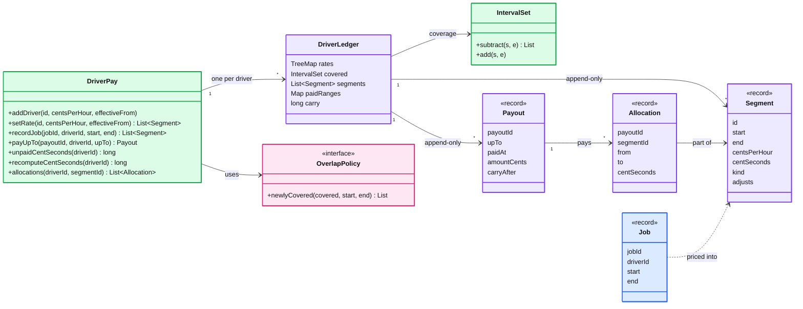
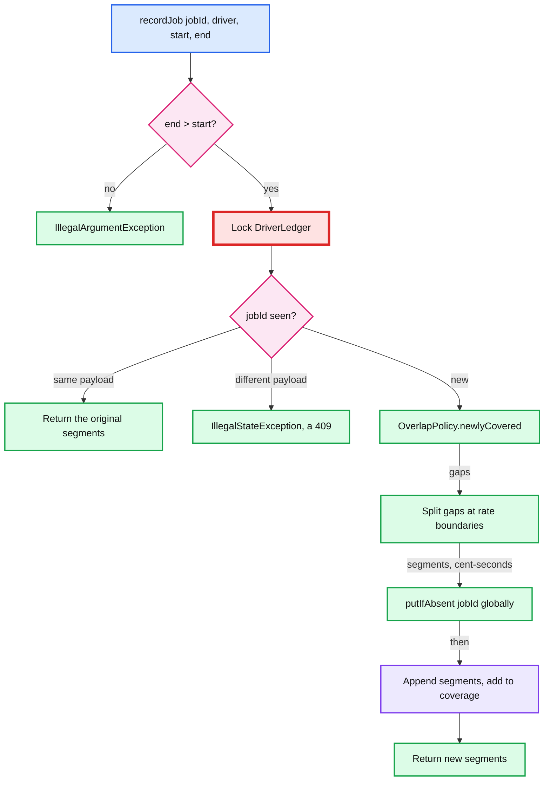
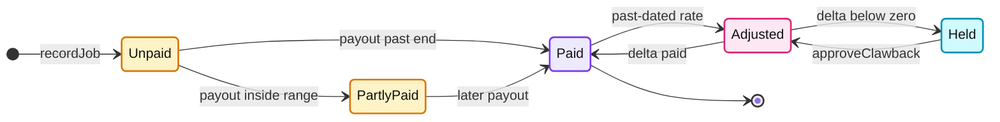

# Deep dive: driver pay ledger (the coding round)

> One-line answer: model pay as an append-only ledger. Jobs are immutable, rates are effective-dated rows, and each **segment** prices one piece of newly covered time in integer cent-seconds. Payouts append **allocations** and carry the sub-cent remainder. Then level 2 ("what was paid, and when") is two new structures, not a rewrite, and a retroactive rate change is one more appended row.

Parent: [`../solution.md`](../solution.md) §4.4 (the five decisions) and §5.4 (the worked example this code reproduces). Related: idempotency keys in [`../../../concepts/exactly-once.md`](../../../concepts/exactly-once.md), the per-row lock and write skew in [`../../../concepts/mvcc-and-isolation.md`](../../../concepts/mvcc-and-isolation.md), money out through an outbox in [`../../payments-ledger/`](../../payments-ledger/).

---

## 1. The round, and what is not built

Reported shape: 60 minutes, OOP, tests, four calls (add a driver with an hourly rate, record a trip, total cost, then level 2: what was paid and when, and what was not). Level 2 is not announced. The reported candidate "had to go back and rework my own class model" when it landed.

The trap is a level-1 model like `Map<driverId, Long> totalCost`. It answers "how much" and has nowhere to put "which part of which trip was paid by which payout". Store the priced pieces, not the total.

Not built, said out loud:
- Taxes and withholding (the payroll engine, #29).
- Currencies. One currency per driver, integer cents.
- Overtime and per-trip fees. They are seams (§9), not in the code.
- Persistence. In memory here; the SQL version is in §9.
- Moving money. A payout is a record; an outbox hands it to the payments rail.

## 2. Ask these before writing a class

| Question | Say this | Default | Where it lives in the code |
|---|---|---|---|
| Money format? | Integer cents per hour. Accrue in cent-seconds. Round once, at payout | Carry the remainder to the next payout | `centSeconds`, `Payout.carryAfter` |
| Time format? | UTC epoch seconds, half-open `[start, end)` | Jobs touching at 10:00 do not overlap | `IntervalSet` |
| Two jobs overlap? | Is pay for time or per job? | `UNION`: each second paid once. `PER_JOB` on request | `OverlapPolicy` (Strategy) |
| Rate changes? | Effective-dated. A second is priced at the rate in effect then. Past dates re-price by appending adjustments | Negative adjustments held for approval | `setRate` |
| Same trip sent twice? | `jobId` is the identity | Same payload returns the same answer; different payload throws (a `409`) | `recordJob` |
| Will we pay part of the balance and report it? | Ask it yourself. It is level 2 | Yes: allocations from the start | `payUpTo`, `allocations` |

## 3. Entities



## 4. Patterns, and why each one

- **Strategy (`OverlapPolicy`).** "Is pay for time or per job?" is a business rule, not an algorithm. Two lambdas, one line each. The interviewer's "now pay per job" becomes a constructor argument.
- **Immutable value objects (Java records).** `Job`, `Segment`, `Allocation`, `Payout` never change after creation, so they can be returned to callers and shared across threads with no copying.
- **Append-only ledger.** Nothing is updated or deleted: corrections are new segments, payments are new allocations. So "what did we believe on Friday" is answerable, and the reconcile check (recompute from jobs and rates, compare with the ledger) has something to compare against.
- **Aggregate per driver (`DriverLedger`).** Every invariant (no second paid twice, carry, idempotent payout) is about one driver. So one driver is the unit of consistency and of locking, which is exactly what `SELECT ... FOR UPDATE` on the driver row gives in SQL.
- **Injected clock (`LongSupplier`).** "Paid when" is a timestamp. A test that must assert it needs a clock it controls.

## 5. The four algorithms

**Newly covered time.** Each driver keeps a `TreeMap<start, end>` of disjoint intervals: the union of all their jobs. `subtract(s, e)` walks the entries that overlap `[s, e)` and returns the gaps, in `O(log n + k)` where `k` is the number of overlapping entries. With coverage `{09:00 to 11:00}`, job B at 10:00 to 12:00 returns `[11:00, 12:00)`. `add` merges touching and overlapping entries. Under `PER_JOB` the policy ignores coverage and returns the whole job.

**Pricing across rate boundaries.** `rates.floorEntry(t)` is the rate in effect at `t`; `rates.higherKey(t)` is the next change. Walk from `start`, cutting at each change: a job from 00:30 to 02:30 with changes at 01:00 and 02:00 becomes three segments (test 6). Cent-seconds are `rate x seconds`, exact in a `long` for any real rate.

**Payout and carry.** For each accrual segment starting before `upTo`: its range, cut at `upTo`, minus the parts already paid (a small `IntervalSet` per segment). Adjustments are paid whole once their range has ended. `amount = floor((carry + total) / 3600)` cents, never below zero, and the remainder (possibly negative, a debt) becomes the new carry. 2,001 cents/h for 600 s is 1,200,600 cent-seconds: pay 333 cents, carry 1,800; the next 600 s pays 334 (test 3).

**Retroactive rate.** Insert the rate, then for every accrual segment inside the window `[effectiveFrom, next change)`: `expected = price(segment range)` under the new table, `priced = segment + its earlier adjustments`, and append an adjustment for the difference. Using "expected minus already priced" instead of "new rate minus old rate" makes a second correction to the same window come out right with no special case.





A segment that is still unpaid or partly paid can get an adjustment too; the adjustment then rides on the same next payout.

## 6. How level 2 lands as an addition

| Question | Level 1 needs | Level 2 adds | Level 1 code changed? |
|---|---|---|---|
| How much has D earned? | `segments`, `totalAccruedCentSeconds` | | |
| Pay D up to Friday | | `Payout`, `Allocation`, `carry`, `payUpTo` | No |
| What is unpaid? | | `paidRanges` per segment, `unpaidCentSeconds` | No |
| What was paid, and when? | | `allocations(driver, segment)` plus `Payout.paidAt` | No |
| A late Wednesday trip after Friday's payout | | Nothing: unpaid comes from allocations, not from a "paid through" date | No |

The one decision that makes this work is made at level 1: store priced segments, not a running total.

## 7. Concurrency: what is locked, what is immutable

- **Locked:** the `DriverLedger` monitor, for every read-modify-write of one driver (`recordJob`, `setRate`, `payUpTo`) and for reads that must be consistent (`unpaid`, `recompute`). Different drivers never wait on each other: at 1.2k writes/s spread over 1 M drivers, contention is effectively zero.
- **Global, lock-free:** `jobs` (a `ConcurrentHashMap`). The new job is computed first and `putIfAbsent` runs last, so a failed validation or a missing rate never leaves an orphan job id.
- **Immutable:** every record, and every list returned (`List.copyOf`, `toList()`).
- **The race the lock prevents:** jobs X (00:00 to 02:00) and Y (01:00 to 03:00) recorded at the same instant both read empty coverage, both accrue 01:00 to 02:00, and the driver is paid 4 hours for 3. Test 8 runs that race 500 times and asserts 3 hours.
- **In SQL:** `SELECT ... FROM driver WHERE id = $1 FOR UPDATE` at the start of the transaction. Serializable isolation alone would also catch it, but only with retries: the two inserts touch different rows, which is write skew, not a write conflict.

## 8. Code

One file, no dependencies, Java 17+ (records, `toList()`). Run with `java DriverPay.java`. Segment ids are `jobId + n` (A1, A2) and `ADJn`, so the test names match the table in solution.md §5.4.

```java
import java.util.*;
import java.util.concurrent.ConcurrentHashMap;
import java.util.concurrent.CountDownLatch;
import java.util.function.LongSupplier;

/** Driver pay ledger: immutable jobs, effective-dated rates, integer cent-seconds, append-only payouts.
 *  Times are epoch seconds, intervals are half-open [start, end). Run: java DriverPay.java */
public class DriverPay {

    // ---------- immutable value objects ----------
    enum Kind { ACCRUAL, ADJUSTMENT }
    record Job(String jobId, String driverId, long start, long end) {}
    /** ACCRUAL: centsPerHour is the rate in effect. ADJUSTMENT: centsPerHour is 0, adjusts names the corrected segment. */
    record Segment(String id, String jobId, long start, long end, long centsPerHour, long centSeconds, Kind kind, String adjusts) {}
    record Allocation(String payoutId, String segmentId, long from, long to, long centSeconds) {}
    record Payout(String payoutId, String driverId, long upTo, long paidAt, long amountCents, long carryAfter, List<Allocation> allocations) {}

    // ---------- Strategy: which part of a new job is newly paid time? ----------
    interface OverlapPolicy { List<long[]> newlyCovered(IntervalSet covered, long start, long end); }
    static final OverlapPolicy UNION = (covered, s, e) -> covered.subtract(s, e);          // each second paid once
    static final OverlapPolicy PER_JOB = (covered, s, e) -> List.of(new long[]{s, e});    // each job paid in full

    /** Disjoint half-open intervals (start -> end), merged on insert. O(log n + k) per call. */
    static final class IntervalSet {
        private final TreeMap<Long, Long> m = new TreeMap<>();

        /** The parts of [s, e) not covered yet. Does not mutate. */
        List<long[]> subtract(long s, long e) {
            List<long[]> out = new ArrayList<>();
            long cur = s;
            Map.Entry<Long, Long> f = m.floorEntry(s);
            if (f != null && f.getValue() > cur) cur = f.getValue();
            for (Map.Entry<Long, Long> x : m.subMap(s, true, e, false).entrySet()) {
                if (x.getKey() > cur) out.add(new long[]{cur, x.getKey()});
                cur = Math.max(cur, x.getValue());
            }
            if (cur < e) out.add(new long[]{cur, e});
            return out;
        }

        void add(long s, long e) {
            Map.Entry<Long, Long> f = m.floorEntry(s);
            if (f != null && f.getValue() >= s) { s = f.getKey(); e = Math.max(e, f.getValue()); }
            for (Iterator<Map.Entry<Long, Long>> it = m.tailMap(s, true).entrySet().iterator(); it.hasNext(); ) {
                Map.Entry<Long, Long> x = it.next();
                if (x.getKey() > e) break;
                e = Math.max(e, x.getValue());
                it.remove();
            }
            m.put(s, e);
        }
    }

    /** One driver's aggregate. Its monitor is the unit of locking: one writer per driver. */
    static final class DriverLedger {
        final String driverId;
        final TreeMap<Long, Long> rates = new TreeMap<>();                // effectiveFrom -> cents per hour
        final IntervalSet covered = new IntervalSet();                    // union of this driver's job time
        final List<Segment> segments = new ArrayList<>();                 // append-only
        final Map<String, List<Segment>> byJob = new LinkedHashMap<>();
        final Map<String, IntervalSet> paidRanges = new HashMap<>();      // accrual segment id -> paid parts
        final Set<String> paidAdjustments = new HashSet<>();
        final Set<String> approvedClawbacks = new HashSet<>();
        final Map<String, Payout> payouts = new LinkedHashMap<>();
        long carry;                                                       // sub-cent remainder, cent-seconds
        int adjSeq;

        DriverLedger(String id) { driverId = id; }

        /** [s, e) cut at every rate boundary: {start, end, centsPerHour}. */
        List<long[]> pieces(long s, long e) {
            List<long[]> out = new ArrayList<>();
            for (long t = s; t < e; ) {
                Map.Entry<Long, Long> r = rates.floorEntry(t);
                if (r == null) throw new IllegalStateException("no rate for " + driverId + " at " + t);
                Long next = rates.higherKey(t);
                long end = next == null ? e : Math.min(e, next);
                out.add(new long[]{t, end, r.getValue()});
                t = end;
            }
            return out;
        }

        long price(long s, long e) { return pieces(s, e).stream().mapToLong(p -> (p[1] - p[0]) * p[2]).sum(); }

        boolean payable(Segment g) { return g.kind() == Kind.ACCRUAL || g.centSeconds() > 0 || approvedClawbacks.contains(g.id()); }
    }

    private final ConcurrentHashMap<String, DriverLedger> ledgers = new ConcurrentHashMap<>();
    private final ConcurrentHashMap<String, Job> jobs = new ConcurrentHashMap<>();       // jobId is global
    private final OverlapPolicy policy;
    private final LongSupplier clock;

    DriverPay(OverlapPolicy policy, LongSupplier clock) { this.policy = policy; this.clock = clock; }

    private DriverLedger ledger(String id) {
        return Optional.ofNullable(ledgers.get(id)).orElseThrow(() -> new NoSuchElementException("unknown driver " + id));
    }

    public void addDriver(String id, long centsPerHour, long effectiveFrom) {
        if (ledgers.putIfAbsent(id, new DriverLedger(id)) != null) throw new IllegalStateException("driver exists: " + id);
        setRate(id, centsPerHour, effectiveFrom);
    }

    /** Effective-dated. A past date re-prices affected segments by appending adjustments; nothing is edited. */
    public List<Segment> setRate(String id, long centsPerHour, long effectiveFrom) {
        if (centsPerHour < 0) throw new IllegalArgumentException("negative rate");
        DriverLedger d = ledger(id);
        synchronized (d) {
            d.rates.put(effectiveFrom, centsPerHour);
            Long next = d.rates.higherKey(effectiveFrom);
            long windowEnd = next == null ? Long.MAX_VALUE : next;
            List<Segment> created = new ArrayList<>();
            for (Segment g : List.copyOf(d.segments)) {
                if (g.kind() != Kind.ACCRUAL || g.end() <= effectiveFrom || g.start() >= windowEnd) continue;
                long priced = g.centSeconds();
                for (Segment a : d.segments) if (g.id().equals(a.adjusts())) priced += a.centSeconds();
                long diff = d.price(g.start(), g.end()) - priced;          // expected minus already priced
                if (diff == 0) continue;
                Segment adj = new Segment("ADJ" + (++d.adjSeq), g.jobId(), Math.max(g.start(), effectiveFrom),
                        Math.min(g.end(), windowEnd), 0, diff, Kind.ADJUSTMENT, g.id());
                d.segments.add(adj);
                created.add(adj);
            }
            return created;
        }
    }

    /** Returns the segments this job newly accrued. A retry with the same payload returns the same answer. */
    public List<Segment> recordJob(String jobId, String driverId, long start, long end) {
        if (end <= start) throw new IllegalArgumentException("end must be after start: " + jobId);
        Job job = new Job(jobId, driverId, start, end);
        DriverLedger d = ledger(driverId);
        synchronized (d) {
            Job prior = jobs.get(jobId);
            if (prior != null) {
                if (!prior.equals(job)) throw new IllegalStateException("job " + jobId + " exists with a different payload");
                return d.byJob.get(jobId);
            }
            List<Segment> created = new ArrayList<>();                    // compute first, mutate after
            for (long[] gap : policy.newlyCovered(d.covered, start, end))
                for (long[] p : d.pieces(gap[0], gap[1]))
                    created.add(new Segment(jobId + (created.size() + 1), jobId, p[0], p[1], p[2],
                            (p[1] - p[0]) * p[2], Kind.ACCRUAL, null));
            if (jobs.putIfAbsent(jobId, job) != null) throw new IllegalStateException("job " + jobId + " taken by another driver");
            d.covered.add(start, end);
            d.segments.addAll(created);
            d.byJob.put(jobId, List.copyOf(created));
            return d.byJob.get(jobId);
        }
    }

    /** Pays every unpaid part of work before upTo, in whole cents; the sub-cent remainder carries forward. */
    public Payout payUpTo(String payoutId, String driverId, long upTo) {
        DriverLedger d = ledger(driverId);
        synchronized (d) {
            Payout prior = d.payouts.get(payoutId);
            if (prior != null && prior.upTo() != upTo) throw new IllegalStateException("payout " + payoutId + " exists with a different upTo");
            if (prior != null) return prior;
            List<Allocation> allocs = new ArrayList<>();
            Set<String> adjustmentIds = new HashSet<>();
            long total = d.carry;
            for (Segment g : d.segments) {
                if (g.kind() == Kind.ACCRUAL) {
                    if (g.start() >= upTo) continue;
                    IntervalSet paid = d.paidRanges.getOrDefault(g.id(), new IntervalSet());
                    for (long[] part : paid.subtract(g.start(), Math.min(g.end(), upTo))) {
                        long cs = (part[1] - part[0]) * g.centsPerHour();
                        allocs.add(new Allocation(payoutId, g.id(), part[0], part[1], cs));
                        total += cs;
                    }
                } else if (g.end() <= upTo && d.payable(g) && !d.paidAdjustments.contains(g.id())) {
                    allocs.add(new Allocation(payoutId, g.id(), g.start(), g.end(), g.centSeconds()));
                    adjustmentIds.add(g.id());
                    total += g.centSeconds();
                }
            }
            long cents = Math.max(0, Math.floorDiv(total, 3600));
            Payout p = new Payout(payoutId, driverId, upTo, clock.getAsLong(), cents, total - cents * 3600, List.copyOf(allocs));
            for (Allocation a : allocs) {                                  // commit: append only
                if (adjustmentIds.contains(a.segmentId())) d.paidAdjustments.add(a.segmentId());
                else d.paidRanges.computeIfAbsent(a.segmentId(), k -> new IntervalSet()).add(a.from(), a.to());
            }
            d.carry = p.carryAfter();
            d.payouts.put(payoutId, p);
            return p;
        }
    }

    /** A negative adjustment (clawback) is held until someone approves it. */
    public void approveClawback(String driverId, String segmentId) {
        DriverLedger d = ledger(driverId);
        synchronized (d) { d.approvedClawbacks.add(segmentId); }
    }

    public long totalAccruedCentSeconds(String driverId) {
        DriverLedger d = ledger(driverId);
        synchronized (d) { return d.segments.stream().mapToLong(Segment::centSeconds).sum(); }
    }

    /** Payable work not yet paid plus the carried remainder. Held clawbacks are excluded. */
    public long unpaidCentSeconds(String driverId) {
        DriverLedger d = ledger(driverId);
        synchronized (d) {
            long cs = d.carry;
            for (Segment g : d.segments) {
                if (g.kind() == Kind.ACCRUAL) {
                    for (long[] part : d.paidRanges.getOrDefault(g.id(), new IntervalSet()).subtract(g.start(), g.end()))
                        cs += (part[1] - part[0]) * g.centsPerHour();
                } else if (d.payable(g) && !d.paidAdjustments.contains(g.id())) cs += g.centSeconds();
            }
            return cs;
        }
    }

    /** Reconcile: expected pay from immutable jobs and today's rate table, ignoring the segments. */
    public long recomputeCentSeconds(String driverId) {
        DriverLedger d = ledger(driverId);
        synchronized (d) {
            IntervalSet cov = new IntervalSet();
            long cs = 0;
            for (String jobId : d.byJob.keySet()) {
                Job j = jobs.get(jobId);
                for (long[] gap : policy.newlyCovered(cov, j.start(), j.end())) cs += d.price(gap[0], gap[1]);
                cov.add(j.start(), j.end());
            }
            return cs;
        }
    }

    /** Level 2: which parts of a segment were paid, by which payout, and when (payout.paidAt). */
    public List<Allocation> allocations(String driverId, String segmentId) {
        DriverLedger d = ledger(driverId);
        synchronized (d) {
            return d.payouts.values().stream().flatMap(p -> p.allocations().stream())
                    .filter(a -> a.segmentId().equals(segmentId)).toList();
        }
    }

    // ---------- tests ----------
    static final long H = 3600, M = 60;
    static int passed;

    static void eq(long want, long got, String what) { if (want != got) throw new AssertionError("FAIL " + what + ": want " + want + ", got " + got); }
    static void check(boolean ok, String what) { if (!ok) throw new AssertionError("FAIL " + what); }
    static void throwsEx(Runnable r, String what) {
        try { r.run(); } catch (RuntimeException expected) { return; }
        throw new AssertionError("FAIL expected an exception: " + what);
    }
    static long cents(long cs) { check(cs % 3600 == 0, "whole cents: " + cs); return cs / 3600; }
    static void test(String name, Runnable body) { body.run(); passed++; System.out.println("PASS " + name); }

    public static void main(String[] args) throws Exception {
        test("worked example from solution.md 5.4 (UNION)", () -> {
            long[] now = {100 * H};
            DriverPay pay = new DriverPay(UNION, () -> now[0]);
            pay.addDriver("D", 2_000, -7 * 24 * H);                         // $20/h from 1 Jan
            pay.setRate("D", 3_000, 10 * H + 30 * M);                       // $30/h from Mon 10:30, set in advance
            List<Segment> a = pay.recordJob("A", "D", 9 * H, 11 * H);
            eq(2, a.size(), "A splits at 10:30");
            eq(3_000, cents(a.get(0).centSeconds()), "A1");
            eq(1_500, cents(a.get(1).centSeconds()), "A2");
            List<Segment> b = pay.recordJob("B", "D", 10 * H, 12 * H);
            eq(1, b.size(), "B accrues only new coverage");
            eq(11 * H, b.get(0).start(), "B1 starts at 11:00");
            eq(3_000, cents(b.get(0).centSeconds()), "B1");
            Payout p1 = pay.payUpTo("P1", "D", 11 * H + 30 * M);
            eq(6_000, p1.amountCents(), "P1");
            eq(0, p1.carryAfter(), "P1 carry");
            List<Segment> c = pay.recordJob("C", "D", 8 * H, 9 * H + 30 * M);
            eq(1, c.size(), "C: only 08:00 to 09:00 is new");
            eq(2_000, cents(c.get(0).centSeconds()), "C1");
            eq(3_500, cents(pay.unpaidCentSeconds("D")), "unpaid after C");
            List<Segment> adj = pay.setRate("D", 2_500, 9 * H);             // retroactive raise
            eq(1, adj.size(), "one adjustment");
            check(adj.get(0).adjusts().equals("A1"), "ADJ1 adjusts A1");
            eq(750, cents(adj.get(0).centSeconds()), "ADJ1");
            eq(4_250, cents(pay.unpaidCentSeconds("D")), "unpaid after the raise");
            now[0] = 200 * H;
            Payout p2 = pay.payUpTo("P2", "D", 23 * H + 59 * M);
            eq(4_250, p2.amountCents(), "P2");
            eq(10_250, p1.amountCents() + p2.amountCents(), "paid in total");
            eq(10_250, cents(pay.totalAccruedCentSeconds("D")), "accrued");
            eq(10_250, cents(pay.recomputeCentSeconds("D")), "recompute from jobs and rates");
            eq(0, pay.unpaidCentSeconds("D"), "nothing unpaid");
            List<Allocation> b1 = pay.allocations("D", "B1");
            eq(2, b1.size(), "B1 paid by two payouts");
            check(b1.get(0).payoutId().equals("P1") && b1.get(1).payoutId().equals("P2"), "B1 paid by P1 then P2");
        });

        test("PER_JOB pays each job in full: A + B = 10,000", () -> {
            DriverPay pay = new DriverPay(PER_JOB, () -> 0);
            pay.addDriver("D", 2_000, -7 * 24 * H);
            pay.setRate("D", 3_000, 10 * H + 30 * M);
            pay.recordJob("A", "D", 9 * H, 11 * H);
            pay.recordJob("B", "D", 10 * H, 12 * H);
            eq(10_000, cents(pay.totalAccruedCentSeconds("D")), "PER_JOB total");
            eq(10_000, cents(pay.recomputeCentSeconds("D")), "PER_JOB recompute");
        });

        test("sub-cent carry: 2,001 cents/h for 600 s", () -> {
            DriverPay pay = new DriverPay(UNION, () -> 0);
            pay.addDriver("D", 2_001, 0);
            eq(1_200_600, pay.recordJob("J1", "D", 0, 600).get(0).centSeconds(), "cent-seconds");
            Payout p = pay.payUpTo("P1", "D", H);
            eq(333, p.amountCents(), "whole cents paid");
            eq(1_800, p.carryAfter(), "half a cent carried");
            pay.recordJob("J2", "D", 600, 1_200);
            eq(334, pay.payUpTo("P2", "D", H).amountCents(), "carry paid next time");   // 333 + 334 = 667 exactly
        });

        test("duplicate job is a no-op, conflicting job throws, end <= start throws", () -> {
            DriverPay pay = new DriverPay(UNION, () -> 0);
            pay.addDriver("D", 3_600, 0);
            List<Segment> first = pay.recordJob("A", "D", 0, H);
            check(first.equals(pay.recordJob("A", "D", 0, H)), "retry returns the same segments");
            eq(3_600, cents(pay.totalAccruedCentSeconds("D")), "accrued once");
            throwsEx(() -> pay.recordJob("A", "D", 0, 2 * H), "same jobId, different end");
            throwsEx(() -> pay.recordJob("Z", "D", H, H), "zero-length job");
            throwsEx(() -> pay.recordJob("Z", "D", 2 * H, H), "end before start");
        });

        test("payout is idempotent on payoutId", () -> {
            DriverPay pay = new DriverPay(UNION, () -> 0);
            pay.addDriver("D", 3_600, 0);
            pay.recordJob("A", "D", 0, H);
            Payout p = pay.payUpTo("P1", "D", H);
            check(p == pay.payUpTo("P1", "D", H), "same payout returned");
            eq(0, pay.unpaidCentSeconds("D"), "not paid twice");
            throwsEx(() -> pay.payUpTo("P1", "D", 2 * H), "same payoutId, different upTo");
        });

        test("a job spanning two rate changes becomes three segments", () -> {
            DriverPay pay = new DriverPay(UNION, () -> 0);
            pay.addDriver("D", 1_000, 0);
            pay.setRate("D", 2_000, H);
            pay.setRate("D", 3_000, 2 * H);
            List<Segment> s = pay.recordJob("J", "D", 30 * M, 2 * H + 30 * M);
            eq(3, s.size(), "three segments");
            eq(500, cents(s.get(0).centSeconds()), "00:30 to 01:00 at 1,000");
            eq(2_000, cents(s.get(1).centSeconds()), "01:00 to 02:00 at 2,000");
            eq(1_500, cents(s.get(2).centSeconds()), "02:00 to 02:30 at 3,000");
        });

        test("retroactive cut is a held clawback, netted only after approval", () -> {
            DriverPay pay = new DriverPay(UNION, () -> 0);
            pay.addDriver("D", 3_600, 0);
            pay.recordJob("J1", "D", 0, H);
            eq(3_600, pay.payUpTo("P1", "D", H).amountCents(), "P1");
            List<Segment> adj = pay.setRate("D", 1_800, 0);                 // rate lowered after payment
            eq(-1_800, cents(adj.get(0).centSeconds()), "clawback created");
            eq(0, pay.payUpTo("P2", "D", 2 * H).amountCents(), "held: not deducted");
            eq(0, pay.unpaidCentSeconds("D"), "held clawback not in unpaid");
            pay.approveClawback("D", adj.get(0).id());
            Payout p3 = pay.payUpTo("P3", "D", 2 * H);
            eq(0, p3.amountCents(), "never a negative payout");
            eq(-1_800 * 3_600, p3.carryAfter(), "debt carried");
            pay.recordJob("J2", "D", H, 3 * H);                              // 2 h at 1,800 = 3,600 cents
            eq(1_800, pay.payUpTo("P4", "D", 3 * H).amountCents(), "debt netted");
        });

        test("concurrent overlapping jobs are paid once under UNION (500 races)", () -> {
            for (int i = 0; i < 500; i++) {
                DriverPay pay = new DriverPay(UNION, () -> 0);
                pay.addDriver("D", 3_600, 0);                                // 1 cent per second
                CountDownLatch go = new CountDownLatch(1);
                Thread t1 = new Thread(() -> { await(go); pay.recordJob("X", "D", 0, 2 * H); });
                Thread t2 = new Thread(() -> { await(go); pay.recordJob("Y", "D", H, 3 * H); });
                t1.start(); t2.start(); go.countDown();
                join(t1); join(t2);
                eq(3 * H, cents(pay.totalAccruedCentSeconds("D")), "3 hours paid once, race " + i);
            }
        });

        System.out.println(passed + " tests passed");
    }

    static void await(CountDownLatch l) { try { l.await(); } catch (InterruptedException e) { throw new RuntimeException(e); } }
    static void join(Thread t) { try { t.join(); } catch (InterruptedException e) { throw new RuntimeException(e); } }
}
```

Output:

```
PASS worked example from solution.md 5.4 (UNION)
PASS PER_JOB pays each job in full: A + B = 10,000
PASS sub-cent carry: 2,001 cents/h for 600 s
PASS duplicate job is a no-op, conflicting job throws, end <= start throws
PASS payout is idempotent on payoutId
PASS a job spanning two rate changes becomes three segments
PASS retroactive cut is a held clawback, netted only after approval
PASS concurrent overlapping jobs are paid once under UNION (500 races)
8 tests passed
```

## 9. Extensibility seams

- **Per-trip flat fee.** A `PayRule` strategy that emits extra segments of a new kind (`FEE`) at `recordJob`. Payout and allocation code does not change; it already pays any segment kind.
- **Overtime after 40 hours a week.** Split coverage at the point where the driver's weekly covered time crosses 40 h, and price the overflow at `rate x 3 / 2` (still integers). A late job earlier in the week moves that point, so later segments must be re-priced: run the same "expected minus already priced" check over the week and append adjustments.
- **Time zones.** Store UTC. Only day and week boundaries (overtime, "pay up to Friday") need the driver's zone, and only at the edge.
- **Voiding a job recorded in error.** Harder than it looks under `UNION`: job B only accrued the time A did not cover, so removing A exposes time B worked but never accrued. A void must recompute expected pay from the remaining jobs and append the difference as adjustments. `recomputeCentSeconds` is that function.
- **Money out.** Insert the payout and an outbox row in one transaction; a relay calls the rail with idempotency key `payout_id` ([`../../payments-ledger/`](../../payments-ledger/)).
- **Database-backed version.** Same entities as the solution's data model, plus the columns the code needed:

```sql
CREATE TABLE rate (
  driver_id text, effective_from bigint, cents_per_hour bigint NOT NULL CHECK (cents_per_hour >= 0),
  PRIMARY KEY (driver_id, effective_from));
CREATE TABLE job (
  job_id text PRIMARY KEY, driver_id text NOT NULL,
  start_s bigint NOT NULL, end_s bigint NOT NULL, CHECK (end_s > start_s));
CREATE INDEX job_driver_start ON job (driver_id, start_s);          -- overlap lookup
CREATE TABLE segment (
  segment_id text PRIMARY KEY, driver_id text NOT NULL, job_id text NOT NULL REFERENCES job,
  start_s bigint NOT NULL, end_s bigint NOT NULL, cents_per_hour bigint NOT NULL,
  cent_seconds bigint NOT NULL, kind text NOT NULL CHECK (kind IN ('ACCRUAL', 'ADJUSTMENT')),
  adjusts_segment_id text REFERENCES segment, approved boolean NOT NULL DEFAULT false);
CREATE TABLE payout (
  payout_id text PRIMARY KEY, driver_id text NOT NULL, up_to bigint NOT NULL,
  paid_at timestamptz NOT NULL, amount_cents bigint NOT NULL CHECK (amount_cents >= 0),
  carry_cent_seconds bigint NOT NULL);
CREATE TABLE allocation (
  payout_id text REFERENCES payout, segment_id text REFERENCES segment,
  from_s bigint, to_s bigint, cent_seconds bigint NOT NULL,
  PRIMARY KEY (payout_id, segment_id, from_s));
```

`record_job` is one transaction: lock the driver row, read overlapping jobs through `job_driver_start`, insert the job and its segments. The unique keys on `job_id` and `payout_id` are the idempotency guards. At 10x (12k writes/s at peak) shard by `driver_id`: every query above already filters on it.

## 10. Follow-ups, with 20-second answers

- **"Why not `double`? Why not `BigDecimal`?"** `double` cannot hold 0.1. `BigDecimal` works but is slow and still needs a rounding rule. Integer cent-seconds are exact, and rounding happens once, at payout, with the remainder carried.
- **"The rate was cut after we paid. Take the money back."** The adjustment is created at once and held. Paying it needs an approval, because many places restrict wage deductions; after approval it nets against future pay, and a payout never goes negative (test 7).
- **"The driver says Wednesday was never paid."** `allocations(driver, segment)` lists each paid piece with its payout id; the payout has `paidAt`.
- **"Make it thread-safe."** §7: lock per driver, immutable records, global `putIfAbsent`.
- **"How do you know the ledger is right?"** `recomputeCentSeconds` prices the immutable jobs under today's rates, from scratch. It must equal the sum of segments and adjustments: 10,250 cents in the worked example.
- **"A million drivers."** Postgres, one row lock per driver, shard by `driver_id` later. Correctness is the hard part here, not scale.
