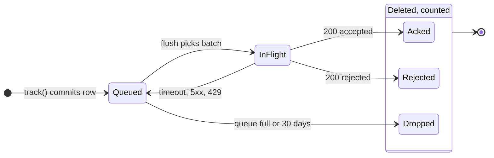
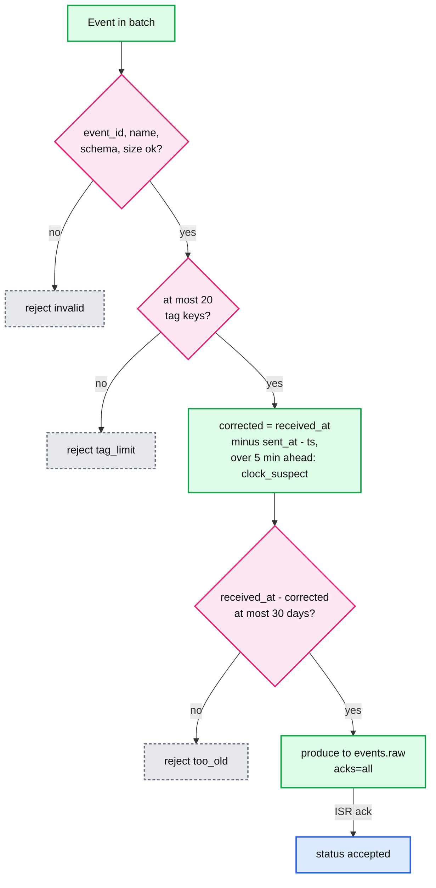
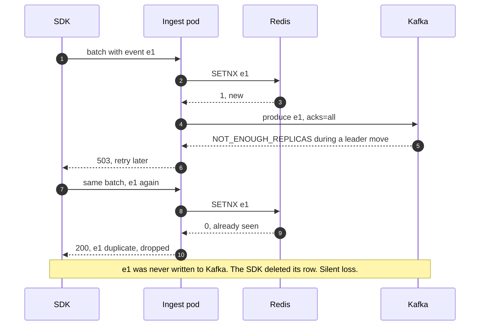
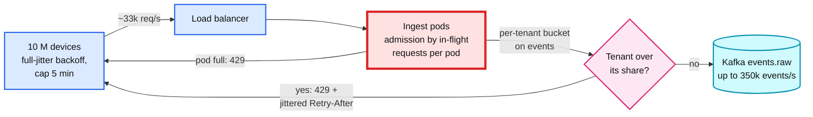

# Deep dive: event ingestion, dedup and late data

> One-line answer: the phone is the first durable store, so the SDK keeps every event in SQLite with its own `event_id` until the server acks it, stamps `sent_at` on every send attempt so clock skew can be corrected without folding queue time into it, and sends a live lane before its backlog. The server acks only after Kafka holds the batch on 2 replicas, rejects bad events one by one with a reason, and never dedups before the durable write, because a check that runs before the write turns a failed write into a silent loss. Dedup happens twice downstream: a 48-hour window for dashboards and an exact 35-day one for billing. "Late" is a policy per path, stated in one table.

Part of [`../solution.md`](../solution.md) §4.1, §4.2, §5.1. Related: [`exact-billing-and-reconciliation.md`](exact-billing-and-reconciliation.md) for the billing side, [`../../../concepts/exactly-once.md`](../../../concepts/exactly-once.md), [`../../../concepts/stream-processing.md`](../../../concepts/stream-processing.md), [`../../../concepts/rate-limiting-and-load-shedding.md`](../../../concepts/rate-limiting-and-load-shedding.md), [`../../streaming-ingestion/`](../../streaming-ingestion/).

---

## 1. The SDK is a state machine per event row

The prompt says no event can be lost. The only place an event exists before the first request succeeds is the device, so the SDK is part of the durability design, not a thin HTTP wrapper.



Rules that make the diagram true:
- **A row leaves the queue only on a definite answer.** `200 accepted` and `200 rejected` (with a reason) are definite. A timeout, a `5xx` or a `429` are not: the row goes back to `Queued`, and the same `event_id` is sent again later. The server may already have it. That is fine (§3).
- **`Rejected` and `Dropped` are counted.** The SDK keeps a small `dropped_events` counter per reason (`invalid`, `too_old`, `tag_limit`, `queue_full`) and reports it as an internal `sdk.dropped` event on the next flush. Internal SDK events are not billable. A loss is therefore always visible on the tenant's dashboard, which is what "not silently lost" means once the device itself runs out of room.
- **The row is written before `track()` returns.** SQLite in WAL mode. SQLite's own docs: "Transactions are durable across application crashes regardless of the synchronous setting", but "A transaction committed in WAL mode with synchronous=NORMAL might roll back following a power loss or system crash" ([sqlite.org pragma synchronous](https://www.sqlite.org/pragma.html#pragma_synchronous)). The SDK batches `track()` calls into one transaction per second with `synchronous=FULL`. One fsync a second is cheap on battery. The only loss window left is "phone loses power within a second of the tap", before the event exists anywhere else.

**When the queue is full.** The cap is 20,000 events or 30 days, whichever comes first ([`../solution.md`](../solution.md) §10.2). At the cap the SDK drops the **oldest** rows, not the newest: the oldest are about to hit the 30-day server limit anyway, and the newest are what the dashboard is showing now. Every drop increments `dropped_events{reason=queue_full}`. At 100 events a device a day, the cap is 200 days of normal use, so in practice only a runaway loop in the app reaches it.

## 2. Batch shape, the live lane, and `sent_at`

**Batch shape.** At most 500 events and 512 KB per request, gzip. A 20,000-event backlog is 40 requests, each retried on its own. One 6 MB request on a weak network times out, retries whole, and never finishes. Amplitude publishes the same kind of limit: "Keep request sizes under 1 MB with fewer than 2000 events per request" ([research](../research/facts-survey.md)).

**Live lane.** On each flush the SDK first sends the events from the last 5 minutes, then the backlog oldest first. During a mass reconnect, today's dashboard stays fresh while the backlog drains behind it. Oldest-first inside the backlog, because the oldest rows are closest to the 30-day limit and are the ones lost if the app is uninstalled.

**`sent_at` on every attempt, not per batch.** Segment's mobile libraries add `sentAt` "when the batch is complete and first sent", and Segment warns that with offline queueing "the timestamp value for those users more closely reflects when Segment received the events rather than the time they occurred on the users' devices" ([research](../research/facts-survey.md), Segment common fields page). The correction formula assumes `sent_at` and `received_at` happen at the same moment, so the difference is pure clock skew. If `sent_at` was stamped days before the request actually went out, the queue time is counted as skew. So the SDK rewrites `sent_at` on every retry of every batch.

## 3. Per-event accept or reject, and the skew formula

Corrected event time is Segment's formula: `corrected = received_at - (sent_at - ts)`. Then the ingest pod decides each event on its own:



**Worked example: a phone whose clock is 2 days slow, offline for 3 days.**
- The tap happens at true time Thu 10 Sep 12:00 UTC. The phone's clock says Tue 8 Sep 12:00, so `ts = 8 Sep 12:00`.
- The phone comes back online and sends at true time Sun 13 Sep 09:00. Its clock says 11 Sep 09:00, so `sent_at = 11 Sep 09:00`.
- The server receives it at `received_at = 13 Sep 09:00`.
- `sent_at - ts` = 2 days 21 hours (the queue time, in the phone's own clock). `corrected = 13 Sep 09:00 - 2 d 21 h = 10 Sep 12:00`. The true time, even though the clock was 2 days off.
- Now stamp `sent_at` at batch creation instead (5 minutes after the tap, phone clock 8 Sep 12:05). `sent_at - ts` is 5 minutes, and `corrected = 13 Sep 08:55`. The event moves 3 days forward to the upload time. That is exactly Segment's warning, and the dashboard would show a spike on Sunday and nothing for Thursday to Saturday.

Two more cases the formula handles: a phone offline for 31 days with a correct clock is `too_old` (rejected, counted). A phone whose clock is 40 days slow but that is online looks 40 days old by raw `ts`, and the formula corrects it to a few seconds ago, so it is accepted. Filtering on raw `ts` would have rejected a live event. One case it cannot fix: a clock that **changed between `ts` and `sent_at`** (reset to a factory date, or corrected by the network after days offline). The corrected time is then off by the size of the jump. If it lands more than 5 minutes in the future, the event is accepted but flagged `clock_suspect`: the dashboard places it at `received_at`, and billing checks its id against the tenant's whole id history, because this is exactly how a 40-day-old retry could slip past the 35-day horizon ([`../solution.md`](../solution.md) §4.3 step 3).

Runnable check of all of the above (stdlib only):

```python
from datetime import datetime, timedelta, timezone

MAX_AGE = timedelta(days=30)
MAX_AHEAD = timedelta(minutes=5)
MAX_TAG_KEYS = 20

def corrected_time(ts, sent_at, received_at):
    return received_at - (sent_at - ts)   # device clock error is received_at - sent_at

def decide(event, received_at):
    """Returns (status, detail, clock_suspect)."""
    if not event.get("event_id") or not event.get("name"):
        return ("rejected", "invalid", False)
    if len(event.get("tags", {})) > MAX_TAG_KEYS:
        return ("rejected", "tag_limit", False)
    t = corrected_time(event["ts"], event["sent_at"], received_at)
    if received_at - t > MAX_AGE:
        return ("rejected", "too_old", False)
    if t - received_at > MAX_AHEAD:       # clock changed between ts and sent_at
        return ("accepted", received_at, True)   # placed at received_at, billing checks full id history
    return ("accepted", t, False)

U = lambda s: datetime.fromisoformat(s).replace(tzinfo=timezone.utc)
recv = U("2026-09-13T09:00:00")
e = {"event_id": "a", "name": "x", "ts": U("2026-09-08T12:00:00"), "sent_at": U("2026-09-11T09:00:00")}
assert decide(e, recv) == ("accepted", U("2026-09-10T12:00:00"), False)            # 2-day-slow clock, fixed
assert decide(dict(e, sent_at=U("2026-09-08T12:05:00")), recv) == ("accepted", U("2026-09-13T08:55:00"), False)  # the Segment trap
assert decide({"event_id": "b", "name": "x", "ts": U("2026-08-13T08:00:00"), "sent_at": recv}, recv) == ("rejected", "too_old", False)
assert decide({"event_id": "c", "name": "x", "ts": U("2026-08-04T09:00:00"),
               "sent_at": U("2026-08-04T09:00:30")}, recv) == ("accepted", U("2026-09-13T08:59:30"), False)  # 40-day-slow, online
assert decide({"event_id": "d", "name": "x", "ts": U("2031-01-01T00:00:00"), "sent_at": recv}, recv) == ("accepted", recv, True)  # clock jumped
assert decide({"event_id": "", "name": "x"}, recv) == ("rejected", "invalid", False)
assert decide(dict(e, tags={f"k{i}": "v" for i in range(21)}), recv) == ("rejected", "tag_limit", False)
print("all accept/reject cases pass")
```

Output: `all accept/reject cases pass`.

## 4. Why dedup before the durable write loses data

The obvious "exactly once at the door" design is: `SETNX event_id` in Redis, and only if it was new, produce to Kafka. It has a hole exactly where the prompt forbids one.



The same thing happens if the pod crashes between the `SETNX` and the produce. Every fix (delete the key on failure, a TTL on the key, a two-phase marker) adds a new crash window, because Redis and Kafka cannot commit together. It also puts a Redis round trip on each of 116k events a second at peak. Segment tells the same story: its first system used Memcached's CAS as the commit point and needed "a large amount of memory to fit all of our keys", and its second made the output topic the "source of truth" instead ([Segment, exactly-once delivery](https://www.twilio.com/en-us/blog/insights/exactly-once-delivery)).

The rule: **write first, dedup after.** The API is at-least-once on purpose, and both downstream paths drop repeats by `(tenant_id, event_id)`, which is stable across every retry because the device made it.

## 5. The 48-hour dedup for dashboards

The Flink `rollup` job's first operator is keyed by `(tenant_id, device_id)`, so every copy of one event reaches the same dedup state (Flink's `keyBy` still repartitions by key group; the point is co-location of copies, not saving a shuffle). It keeps a map of `event_id`s with a 48-hour TTL in RocksDB.

**Size.** 2 days x 1 B events = 2 B ids. At about 30 B per entry in RocksDB (16 B id, key prefix, TTL timestamp, overhead) that is **60 GB**, or 4 GB per slot over 16 slots ([`../solution.md`](../solution.md) §10.3). Local SSD holds it easily.

**Why 48 hours and not 35 days.** Most duplicates are SDK retries seconds to hours after the original. Segment measured about 0.6% of events as duplicates inside a 4-week window. The dashboard can afford to count the long-tail duplicates for a day or two, because the nightly correction replaces every day older than 2 days with the exact count from billing ([`exact-billing-and-reconciliation.md`](exact-billing-and-reconciliation.md) §4).

**The sink, after the checkpoint fix.** Deltas are cut into one block per subtask at each 60-second checkpoint and kept in checkpointed state. A block is inserted into ClickHouse only in the checkpoint-complete callback, with `insert_deduplication_token = (subtask, checkpoint_id)`. A crash before completion throws the block away, and the replay rebuilds it under a later checkpoint id. A crash after completion but before the insert re-sends the same block with the same token. ClickHouse drops a repeated insert whose token hash is still remembered. One caveat worth saying: that memory is bounded. In the current source, `replicated_deduplication_window` is 10,000 blocks and `replicated_deduplication_window_seconds` is 3,600 seconds ([MergeTreeSettings.cpp](https://raw.githubusercontent.com/ClickHouse/ClickHouse/master/src/Storages/MergeTree/MergeTreeSettings.cpp)). If the job stays down for more than an hour between a completed checkpoint and its insert, the re-sent block can be counted twice. Raise the seconds setting on `rollup_minute` to cover the longest outage you tolerate (a day is cheap at this insert rate), and remember the nightly correction repairs any day older than 2 days regardless.

## 6. Late data, per path

"Late" means different things on each path, so the policy is one table, not one sentence.

| Event age when accepted (corrected time) | Dashboards | Billing |
|---|---|---|
| Under 48 h | Counted in its own minute. Duplicates removed by the 48 h window | Billed in the acceptance hour. Exact dedup |
| 48 h to 30 days | Counted in its own minute. A duplicate of an event first seen more than 48 h ago is counted twice until the nightly correction | Billed in the acceptance hour. Exact dedup against 35 days of ids |
| Over 30 days | Rejected `too_old`, per event. SDK reports it in `dropped_events` | Never accepted, never billed. Visible in the tenant's rejection metric |

The 30-day accept limit and the 35-day id horizon are one decision, not two: any retry of an accepted event arrives while its id is still remembered. There is no watermark anywhere on the dashboard path, because counts are additive and a late `+n` simply lands in its old minute ([`../solution.md`](../solution.md) §4.2).

## 7. The reconnect herd

After a 30-minute outage of our own, 10 M devices each hold a little backlog and all retry. With full-jitter backoff capped at 5 minutes, arrivals are about `10 M / 300 s = 33k requests/s`, 3x the normal request peak, for a few minutes. Bytes are not the problem: even the 350k events/s admission cap is about 100 MB/s into Kafka. Requests are: gzip and JSON parsing burn pod CPU.



Three layers, cheapest first:
1. **The SDK spreads itself.** Full-jitter exponential backoff from 1 s to 5 minutes, and `Retry-After` from the server overrides the next delay. Without jitter, 10 M devices that failed together retry together.
2. **Admission by concurrency, not by rate.** Each pod caps in-flight requests (a Little's-law limit, about 256 per pod `[estimate]`) and answers `429` with a jittered `Retry-After` (for example 5 to 60 s `[estimate]`) when full. A fixed rate limit would be wrong the moment request sizes change; in-flight work tracks CPU directly.
3. **Per-tenant fairness, on events.** A token bucket per tenant, counted in events (not requests, since one request can be 1 or 500 events), stops one big tenant's backlog from starving everyone else. Buckets are local to each pod with a periodic sync, so there is no shared counter on the hot path ([`../../../concepts/rate-limiting-and-load-shedding.md`](../../../concepts/rate-limiting-and-load-shedding.md)).

Autoscale the pods on CPU and keep 2x headroom warm, because a new pod takes longer to arrive than the herd lasts. The live lane from §2 is what keeps the dashboard honest while this happens: fresh events go first on every device.

## 8. What an interviewer probes here

- "Why not dedup at the API?" §4: the check-then-write race turns a failed write into a silent loss.
- "The phone's clock is wrong." §3: the formula, and why `sent_at` must be per attempt.
- "What does 'cannot be silently lost' mean when the phone is full?" §1: drop oldest, count it, report it.
- "Is the 48-hour window enough?" §5 and §6: for dashboards yes, because billing and the nightly correction are exact.
- "Everyone reconnects at once." §7: jitter, concurrency admission, per-tenant buckets on events.
