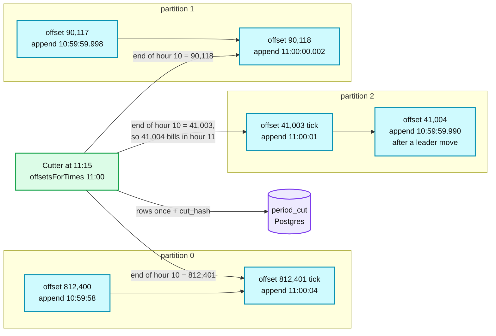
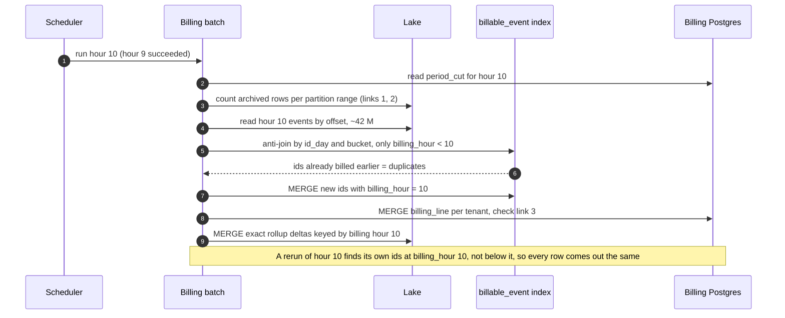
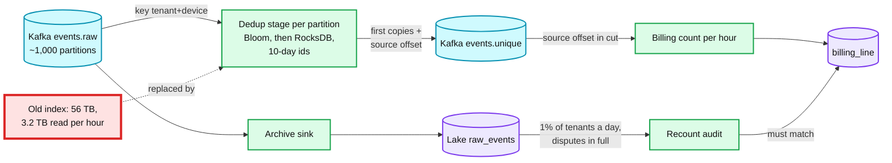

# Deep dive: exact billing and reconciliation

> One-line answer: a billing hour is not a time range, it is a **frozen set of Kafka offset ranges**, one per partition, cut once at `H + 15 min` by broker append time and never recomputed. The hourly batch checks that the archive holds every one of those offsets, anti-joins the hour's events on `(tenant_id, event_id)` against billed ids from **earlier** hours only, and MERGEs one `billing_line` per tenant, so a rerun changes nothing. Four equalities, checked every hour or night, turn "exact" from a claim into an alert. The customer gets every billed `event_id`, so any dispute is answered row by row. At 100x the dedup index is the wall, and it moves into a keyed RocksDB stage, Segment's design.

Part of [`../solution.md`](../solution.md) §4.3, §5.2, §5.3, §10.5. Related: [`event-ingestion-dedup-and-late-data.md`](event-ingestion-dedup-and-late-data.md), [`../../../concepts/exactly-once.md`](../../../concepts/exactly-once.md), [`../../../concepts/stream-sketches.md`](../../../concepts/stream-sketches.md), [`../../payments-ledger/deep-dives/reconciliation-and-audit.md`](../../payments-ledger/deep-dives/reconciliation-and-audit.md), [`../../driver-hot-clusters/`](../../driver-hot-clusters/) (the same provisional-then-final pattern).

---

## 1. A period is a frozen set of offset ranges

**Why acceptance time.** Device clocks lie and backlogs arrive days late, so billing by event time reopens closed invoices. Billing by the hour Kafka accepted the event closes each hour for good, and each event is still billed exactly once ([`../solution.md`](../solution.md) §4.3).

**Why `LogAppendTime`.** Kafka lets a topic choose "whether the timestamp in the message is message create time or log append time", with `CreateTime` as the default ([Kafka topic configs](https://kafka.apache.org/40/generated/topic_config.html)). With `CreateTime` the producer sets the time: each ingest pod's own clock, and a record that waited through producer retries (up to `delivery.timeout.ms`, default "120000 (2 minutes)", [producer configs](https://kafka.apache.org/40/generated/producer_config.html)) carries a time minutes older than its neighbours. With `LogAppendTime` the partition leader stamps the record when it appends it, so times inside one partition follow offsets, except for a small step back if leadership moves to a broker whose clock is slightly behind.

**How the cut is made.** At `H + 15 min`, for each partition, the cutter calls `offsetsForTimes(H)`, which returns the "earliest offset whose timestamp is greater than or equal to the given timestamp in the corresponding partition" ([KafkaConsumer javadoc](https://kafka.apache.org/40/javadoc/org/apache/kafka/clients/consumer/KafkaConsumer.html)). That offset is hour `H-1`'s `end_offset` (exclusive) and hour `H`'s `start_offset`. The rows are written once with a `cut_hash` over the whole map.

**Correctness never depends on the timestamps being perfect.** If a record appended after the cut carries a time a few milliseconds before `H` (a leader move to a slower clock), it is simply billed in hour `H`, by offset. Every offset belongs to exactly one hour. That is the whole point of cutting by offset rather than filtering by time.

**Tick records.** `offsetsForTimes` returns nothing for a partition that has no record at or after `H` yet. Ingest pods write a tiny `tick` record to every partition every 10 s, so each of the 64 partitions has one within 10 s of any boundary. That is 6.4 ticks a second in total. Ticks are counted in links 1 and 2 (they own offsets) and excluded in link 3 (they are not events).

**What the 15 minutes buys.** The cut itself is safe about 10 s after `H`. The rest is for the next step: the archive sink commits in batches, so the lake must hold every offset below each `end_offset` before the batch can run, and a slow sink commit or a leader move should not page anyone. 15 minutes is that slack, and a billing hour not closed by `H + 1 h` pages.

**Why freeze it.** Kafka deletes segments after 7 days, and the time index goes with them. An hour that is recomputed later cannot be recomputed from Kafka at all. The frozen rows are the definition of the period forever.



## 2. The billing batch, step by step

For hour `H-1` (about 42 M events on average, `1 B / 24`):

1. **Wait for the inputs.** `period_cut` rows exist for the hour, and the archive sink's committed offsets are at or past every `end_offset`. Hours run strictly in order: hour `H` never runs before `H-1` has succeeded, because "first copy wins" must mean the earlier hour.
2. **Links 1 and 2** (§3). Any gap stops the run and pages.
3. **Read the hour.** Select `raw_events` rows whose `(partition, offset)` falls inside the cut ranges. All copies of an event share one partition (key `(tenant_id, device_id)`), so inside the hour the first copy is simply the lowest offset.
4. **Anti-join against earlier hours only.** Look up each `(tenant_id, event_id)` in `billable_event` where `billing_hour < H-1`. This restriction is what makes a rerun safe: on a rerun, the ids this hour inserted last time have `billing_hour = H-1`, so they count as billable again instead of as duplicates of themselves.
5. **Insert new ids** with `billing_hour = H-1` as a MERGE (insert if absent). Count the rest as duplicates.
6. **MERGE `billing_line`** on `(tenant_id, hour)`: `billable`, `duplicates`. Same input, same rows.
7. **Emit exact rollup deltas** keyed by `(billing_hour, tenant_id, event_name, tagset_hash, event_hour)`, also by MERGE, for the nightly correction (§4).

**Index layout and its cost.** `billable_event` holds 35 days of ids: `35 x 1 B x 16 B = 560 GB`. Bucketing both sides by `hash(event_id)` into 1,024 buckets avoids a shuffle, but a plain bucketed anti-join still **reads the whole 560 GB every hour**, 13 TB a day. The fix is to also partition the index by `id_day`, the day embedded in the UUIDv7 `event_id`. Every copy of an event has the same id, so a new copy only needs its own `id_day` partition. Almost all of an hour's events were made today or yesterday, so the hourly read is about `2 x 1 B x 16 B = 32 GB`, plus thin slices for backlog days: roughly **0.8 TB a day instead of 13 TB** `[estimate]`. One trap: expire rows by `billing_hour` older than 35 days, not by dropping old `id_day` partitions. A phone whose clock is 40 days slow makes ids whose `id_day` is 40 days back, and those rows must still live for 35 days after they were billed.



## 3. The reconciliation chain

Each link is exact by construction, so a mismatch is a bug with an address, never noise.

| Link | Equality | When | Alert |
|---|---|---|---|
| 1. Kafka to cut | Records Kafka accepted in the hour = `sum(end_offset - start_offset)`. The idempotent producer without transactions leaves no offset gaps, and ticks are included | At the cut | Cut missing at `H + 30 min` warns; hour not closed by `H + 1 h` pages. A partition with 0 records in an hour means ticks stopped: warn |
| 2. Cut to archive | Archived rows inside the ranges = link 1's count, every offset exactly once (no missing, no doubled) | Before the batch | Any gap or double pages within 1 h. Re-archive the range from Kafka: 7-day retention leaves 6 days of slack |
| 3. Archive to ledger | Per tenant-hour: archived events (minus ticks) = `billable + duplicates`. No third bucket, because rejects never entered the log | After the batch | Any mismatch pages: it is a batch bug |
| 4. Billing to dashboards | Per tenant-day: the provisional dashboard total vs the exact total, compared **before** the nightly correction overwrites the day | Nightly | Gap above 0.1% pages the metering team: a stream bug, not a customer issue |

Runnable version of links 1 to 3, including the rerun property (stdlib only):

```python
from collections import Counter

def link1(cut):                       # cut: {partition: (start, end)}
    return {p: end - start for p, (start, end) in cut.items()}

def link2(cut, archived):             # rows: (partition, offset, tenant, event_id, kind)
    problems = []
    for p, (start, end) in cut.items():
        offs = Counter(r[1] for r in archived if r[0] == p and start <= r[1] < end)
        missing = [o for o in range(start, end) if o not in offs]
        doubled = [o for o, n in offs.items() if n > 1]
        if missing: problems.append((p, "missing", missing))
        if doubled: problems.append((p, "doubled", doubled))
    return problems

def bill_hour(hour, cut, archived, index):   # index: {(tenant, event_id): billing_hour}
    rows = sorted((r for r in archived if r[4] == "event" and cut[r[0]][0] <= r[1] < cut[r[0]][1]),
                  key=lambda r: (r[0], r[1]))  # first copy = lowest (partition, offset)
    out, seen = {}, set()
    for p, off, tenant, eid, _ in rows:
        ev, bil, dup = out.get(tenant, (0, 0, 0))
        key, earlier = (tenant, eid), index.get((tenant, eid))
        if (earlier is not None and earlier < hour) or key in seen:
            out[tenant] = (ev + 1, bil, dup + 1)
        else:
            seen.add(key)
            index.setdefault(key, hour)        # MERGE: insert if absent
            out[tenant] = (ev + 1, bil + 1, dup)
    for t, (ev, bil, dup) in out.items():
        assert ev == bil + dup, t              # link 3
    return out

cut = {0: (100, 106), 1: (50, 53)}
archived = [
    (0, 100, "t1", "e1", "event"), (0, 101, "t1", "e2", "event"), (0, 102, None, None, "tick"),
    (0, 103, "t1", "e1", "event"),             # SDK retry of e1 in the same hour
    (0, 104, "t2", "e9", "event"),             # retry of e9, first billed at hour 9
    (0, 105, "t2", "e10", "event"),
    (1, 50, "t1", "e3", "event"), (1, 51, None, None, "tick"), (1, 52, "t2", "e11", "event"),
]
assert link1(cut) == {0: 6, 1: 3} and sum(link1(cut).values()) == len(archived)
assert link2(cut, archived) == []
index = {("t2", "e9"): 9}
first = bill_hour(10, cut, archived, index)
assert first == {"t1": (4, 3, 1), "t2": (3, 2, 1)}
assert bill_hour(10, cut, archived, index) == first            # rerun: identical lines
assert link2(cut, [r for r in archived if r[:2] != (1, 52)]) == [(1, "missing", [52])]
assert link2(cut, archived + [archived[0]]) == [(0, "doubled", [100])]
print("links 1, 2, 3 pass, rerun is identical, gap and double caught")
```

Output: `links 1, 2, 3 pass, rerun is identical, gap and double caught`.

```mermaid
%% The chain with its alerts. Red = the archive sink: a gap there is the only way to undercount, and Kafka's 7-day retention is the repair deadline.
flowchart LR
    K[(Kafka offsets)] -->|"link 1: end - start"| CUT[period_cut]
    CUT -->|"link 2: every offset once"| ARC[Archive sink]
    ARC --> LAKE[(Lake raw_events)]
    LAKE -->|"link 3: events =<br/>billable + dups"| BB[Billing batch]
    BB --> BL[(billing_line)]
    BB -->|"exact deltas"| EX[(Exact hourly rollups)]
    CH[(ClickHouse provisional)] -->|"link 4: gap at most 0.1%"| NC[Nightly correction]
    EX --> NC
    NC -->|"replace days older than 2"| CH
    ARC -->|"gap: page, re-archive<br/>within 7 days"| ONC[Metering on-call]

    class K queue
    class CUT,BB,NC service
    class ARC critical
    class LAKE,BL,EX,CH store
    class ONC client

    classDef client   fill:#dbeafe,stroke:#2563eb,stroke-width:2px,color:#111
    classDef service  fill:#dcfce7,stroke:#16a34a,stroke-width:2px,color:#111
    classDef store    fill:#ede9fe,stroke:#7c3aed,stroke-width:2px,color:#111
    classDef queue    fill:#cffafe,stroke:#0891b2,stroke-width:2px,color:#111
    classDef critical fill:#fee2e2,stroke:#dc2626,stroke-width:4px,color:#111
```



## 4. The nightly dashboard correction

Dashboards are approximate by design: a duplicate that arrives more than 48 hours after its original is counted twice there. Once a day:

1. Sum the exact rollup deltas (step 7 of §2) for every event-day that received new billable events, giving exact hourly counts per `(tenant_id, event_name, tagset_hash, event_hour)`.
2. **Link 4 first:** compare each tenant-day's provisional ClickHouse total with the exact total, and page if the gap is above 0.1%. Comparing after the overwrite would compare the exact table with itself.
3. Write the exact rows into an hourly `ReplacingMergeTree` keyed by bucket with the run id as the version. The dashboard API reads the exact table for days older than 2 days and the provisional minute table for the rest. Because deltas are keyed by the billing hour that produced them, a rerun of any billing hour replaces its own deltas instead of adding to them.

## 5. The usage export and a dispute, with numbers

Every invoice links to an export: each billed `event_id` with its acceptance hour, its corrected event time, and the `cut_hash`, plus the duplicates that were **not** billed, each pointing to its first copy.

**Dispute.** A customer's own analytics show 1,000,000 events with September event times. The September invoice says 1,000,412. The export answers it:

| Line | Events |
|---|---|
| Customer's count, September event time | 1,000,000 |
| Plus: accepted in September, event time in August (phones uploading backlogs) | +3,120 |
| Minus: September event time, accepted in October (on October's invoice) | -2,708 |
| **Billed in September** | **1,000,412** |
| Duplicates seen in September, not billed (about 0.6%) | 6,050 |

Every number is a filter on the export, so the customer can recompute it. For a single event the customer says is missing, there are exactly three answers: billed in hour X (with partition and offset), a duplicate of a copy billed in hour Y, or rejected at ingest with a reason. The third answer needs the ingest pods to log each reject (`tenant_id`, `event_id`, reason) to a small `events.rejected` topic that is archived like the main one.

## 6. Adjustments, never edits

A closed `billing_line` is never updated. Example: a tenant shipped a debug build that fired 50,000 heartbeat events in one day and asks for a credit. The fix is an **adjustment line** on the next invoice: `{tenant, period, events: -50,000, reason, reference: export of those ids, approved_by}`. Rerunning the original hours still produces exactly the same `billing_line` rows, so the audit trail and the reconciliation chain both still hold. Editing the line instead would break link 3 for those hours forever.

## 7. Sending usage to Stripe

Stripe accepts meter events "within the past 35 calendar days" but "enforces uniqueness within a rolling period of at least 24 hours" on the `identifier` ([research](../research/facts-survey.md), corrections table). A client that forwards single events and retries one after 25 hours is charged twice. So we send one meter event per tenant per **closed** hour, with `identifier = tenant:hour`:
- Volume: `20k tenants x 24 = 480k` meter events a day, 5.6 per second on average. At each hour close up to 20k go at once; at the v1 limit of "1000 calls per second per Stripe account" that drains in 20 s.
- Retries happen minutes after the close, far inside the 24-hour identifier window.
- If the push stays broken for more than 35 days, those hours can no longer be sent as meter events. The fallback is an invoice item for the missed hours, generated from `billing_line`. A page fires long before that.

## 8. The 100x change

At 100 B events a day (4.2 B an hour), the index is `35 x 100 B x 16 B = 56 TB`, and even the `id_day`-partitioned join reads about `2 x 100 B x 16 B = 3.2 TB` an hour, 77 TB a day `[estimate]`. That is the first thing to break ([`../solution.md`](../solution.md) §5.3).

**Move 1: a keyed dedup stage, Segment's design.** Route each event to the partition that owns its key, keep a RocksDB per partition on local disk, check Bloom filters first ("the textbook use case for bloom filters" because almost every id is new), and publish first copies to `events.unique` with their source partition and offset. Segment's recovery rule: after a crash the worker "will first consult the source of truth for whether an event was published: the output topic", and repairs RocksDB from it. Their production numbers: "1.5 TB worth of keys stored on disk in RocksDB", "a 4-week window", "approximately 60B keys", "200B messages" ([Segment, exactly-once delivery](https://www.twilio.com/en-us/blog/insights/exactly-once-delivery)). That is about 25 B per key on disk. Billing then counts `events.unique` records whose source offset falls in each hour's cut ranges, and the archive recount becomes an audit: 1% of tenants a day, and every disputed tenant in full.

**Move 2: shrink the horizon.** SDK drops events older than 7 days, the API rejects at 7 days, ids live 10 days. The trade is stated: a phone offline for more than a week loses its oldest events, loudly.

| At 100x | 35-day horizon | 10-day horizon |
|---|---|---|
| Ids held | 3.5 T | 1 T |
| RocksDB at ~25 B/key | 88 TB, 88 GB per partition over 1,000 | 25 TB, 25 GB per partition |
| Bloom at 10 bits/key (about 1% false positives) | 4.4 TB, 4.4 GB per partition | 1.25 TB, 1.25 GB per partition |
| Lookups per partition at the 11.6 M/s peak | 11.6k/s, almost all Bloom negatives | same |



The period definition (frozen offset ranges, acceptance hour) does not change at 100x. Only where the dedup state lives changes.

## 9. What an interviewer probes here

- "Which month does a late event bill to, and what if the batch runs twice?" §1 and §2: the acceptance hour, defined by offsets; anti-join against earlier hours only, MERGE everywhere.
- "Prove the invoice is right, and why not send events to Stripe directly?" §3, §5, §7: four equalities, an export that recomputes every number, and 35 days of lateness vs 24 hours of dedup.
- "100x?" §8: the index is the wall; keyed RocksDB with Bloom filters, and a shorter horizon.
