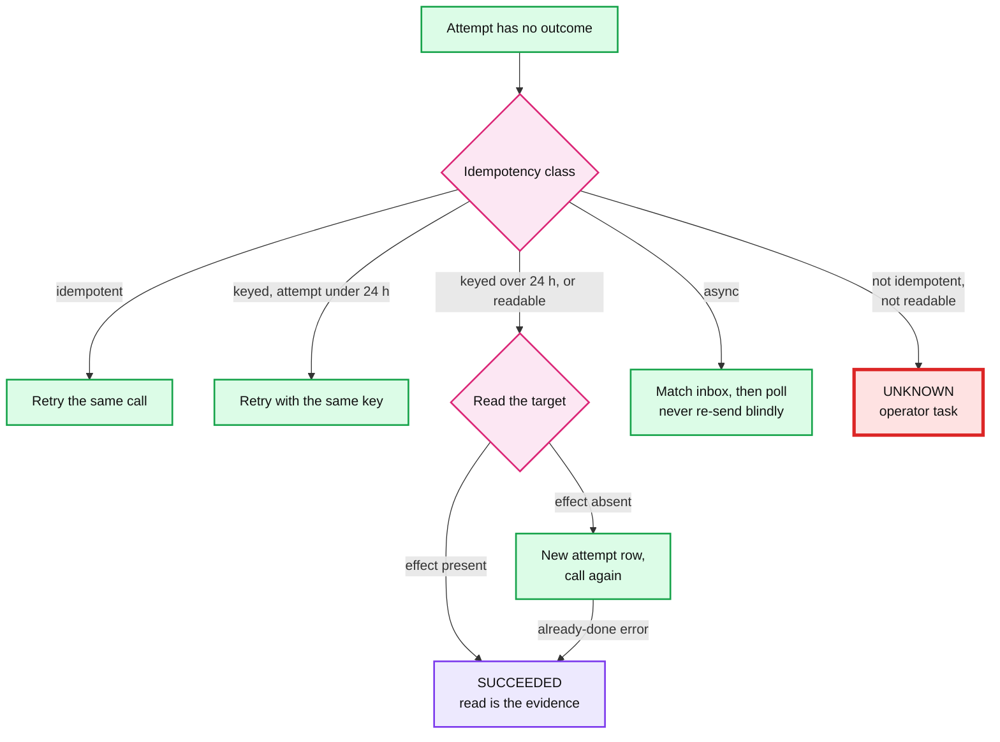
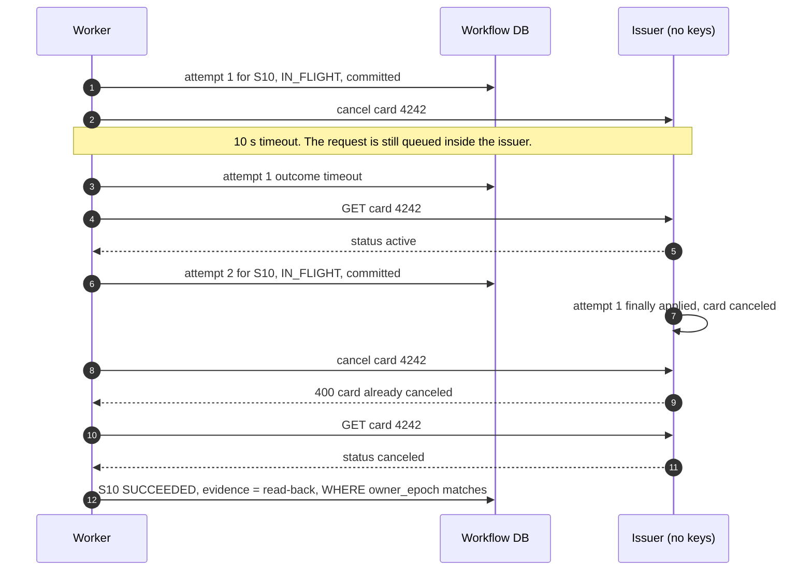
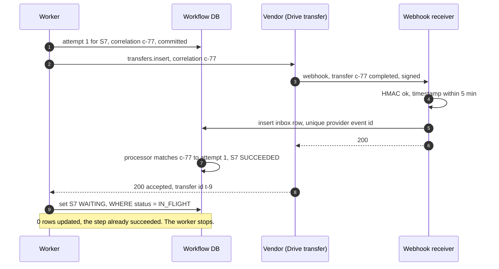
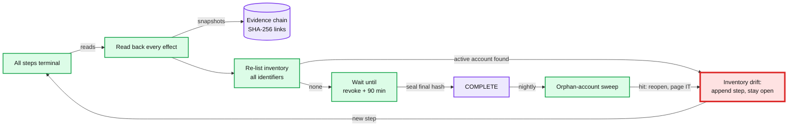

# Deep dive: non-idempotent steps, webhooks, compensation, and proving completeness

> One-line answer: every connector action carries an **idempotency class** in a registry, and the class, not the action's name, decides what a retry may do. An **attempt row** is committed before every external call; after a crash or timeout, keyed actions are retried with the same key `termination_id:step_key`, readable ones are **read back before anything is re-sent** (and "already cancelled" counts as success), and unreadable ones go to an operator, never to a retry. Webhooks land in an inbox keyed by the provider's event id and match on a correlation id written **before** the call, with polling as the backstop. Failures recover **forward**; compensation runs only when HR rescinds, and only for steps before the point of no return. A termination is complete when every step is terminal, every effect has been read back, the app inventory re-listed now shows no active account, and the longest token lifetime has passed, all sealed in a hash-chained evidence log.

Part of [`../solution.md`](../solution.md) §4.5, §5.5, §5.7, §10.5. The engine that runs these steps (planner, leases, dispatcher, timers) is [`termination-workflow-engine.md`](termination-workflow-engine.md). Background: [`../../../concepts/exactly-once.md`](../../../concepts/exactly-once.md) §5 (non-idempotent downstreams) and [`../../../concepts/distributed-transactions.md`](../../../concepts/distributed-transactions.md) §3 (sagas and the pivot). Vendor facts: [`../research/facts-survey.md`](../research/facts-survey.md), where the corrections table wins over the survey text.

---

## 1. The registry: one class per step

The same action has a different class at different vendors. Cancelling a card through Stripe Issuing takes an `Idempotency-Key`; through an issuer without keys it does not. So the class lives in the connector registry, per (vendor, action), and the planner copies it onto the step.

| Step | Action (vendor) | Class | Retry / resume rule | Compensation (rescind only) | Read-back evidence | Vendor fact |
|---|---|---|---|---|---|---|
| S1 | Disable identity (Rippling IdP) | Internal: same DB transaction as the step row | None needed: the state change and `SUCCEEDED` commit together | Re-enable (runs last) | Identity status `TERMINATED` | Ours |
| S2 | Google `users.update suspended=true` | Idempotent by nature | Retry with backoff | `suspended=false` | `users.get` shows suspended | Research item 11 |
| S2 | Google `users.signOut` | Idempotent by nature | Retry | None (they sign in again after unsuspend) | No read exists for "no sessions": 2xx plus the token-lifetime wait (§5) | "signs a user out of all web and device sessions and resets their sign-in cookies" |
| S2 | Slack and Okta session reset | Idempotent by nature | Retry | None | Slack: none `[unverified]`. Okta: user sessions list | Slack `admin.users.session.reset` `[unverified]`, the survey got a 404 |
| S2 | Entra `revokeSignInSessions` (tenants on Microsoft) | Idempotent by nature | Retry | None | `signInSessionsValidFromDateTime` at or after the call | "there might be a small delay of a few minutes before tokens are revoked" |
| S3 | Mail routing to the manager | Idempotent set | Retry | Remove the route | Read the routing rule | Vendor call shape `[unverified]` |
| S4 | Slack SCIM `PATCH active=false` | Idempotent by nature | Retry | `PATCH active=true` | `GET /Users/{id}` shows `active: false` | RFC 7643 `active` is "the user's administrative status"; Slack's DELETE-deactivates behaviour `[unverified]` |
| S5 | Freeze card: Stripe Issuing `status=inactive` | Keyed | Same key `termination_id:S5`. If the first attempt is over 24 h old, read back first | `status=active` | `card.status` | `inactive`: "The card will decline authorizations"; keys may be removed "after they're at least 24 hours old" |
| S6 | GitHub org removal, AWS key deactivation | Idempotent set `[unverified per vendor]` | Retry | Re-add member, issue new keys | Membership and key status | `[unverified]` |
| S6 | Badge (often a ticket to facilities) | Not idempotent, not readable | At most once, then an operator confirms | Facilities re-enables | Operator's attached ticket | Ours |
| S7 | Drive transfer (Data Transfer API `transfers.insert`) | Async, readable, **not** idempotent (a second insert is a second transfer) | Never re-insert blindly: list transfers for this user first | None needed (it copies) | Transfer status completed | Status values `[unverified]`, research item 11 partial |
| S8 | Wipe device (MDM) | Async, irreversible | Read the device's pending actions before any re-send; never re-send while one is pending | None | MDM shows wipe acknowledged or pending | Intune: pending until the device checks in; the research agent quotes Microsoft saying it cannot be cancelled |
| S9 | Final pay (payroll API) | Keyed and async | Same request id `termination_id:S9` | Payroll voids it before the pay date | Payroll run shows the payment | Legal date, e.g. California Labor Code §201 |
| S10 | Cancel card: Stripe Issuing `status=canceled` | Keyed within 24 h, then readable | Read back; map "already canceled" to success | **None: the pivot** | `card.status == canceled` | Stripe: "This status is permanent." Marqeta: "Terminated cards cannot be reactivated." |
| S11 | Delete accounts (Okta, SCIM apps) | Readable, irreversible | Read back: `404` after a known-existing id means done | None | SCIM `GET` returns `404` | RFC 7644: DELETE answers `204`, then the provider "MUST return a 404" for the resource; Okta: deactivate (can run async) is a separate call before the destructive delete |
| V | Verifier reads | Idempotent (read-only) | Retry | n/a | The reads are the evidence | |

Two consequences worth saying out loud:
- **Prefer `PATCH active=false` over `DELETE` for deactivation.** After a SCIM `DELETE`, every operation on the resource returns `404`, and `404` also means "never existed" or "wrong id". A soft deactivate keeps the account readable (`active: false` is unambiguous evidence) and keeps compensation possible. Delete only at S11, after the 30 days, and only for an id the inventory proved existed.
- **The key must be per step, not per attempt.** `termination_id:step_key` is what makes a retry deduplicate. An attempt-scoped key would make every retry a new request.

## 2. The attempt row and the read-back protocol

Every external call is bracketed by two writes, both fenced by `owner_epoch` ([`termination-workflow-engine.md`](termination-workflow-engine.md) §4):

1. **Before the call**, commit `ATTEMPT(attempt_id, step_key, attempt_no, idem_key, correlation_id, request_hash, started_at, outcome = NULL)` and set the step `IN_FLIGHT`. The correlation id is generated here, so a webhook can match it even if it beats the response (§3).
2. **After the call**, commit the outcome (`ok`, `accepted_async`, `transient`, `permanent`, `timeout`) and the step's next state.

A crash between the two leaves an attempt with no outcome. That is the only ambiguous state in the system, and the class resolves it:



**The race the read-back alone does not close.** An issuer without idempotency keys is slow. Attempt 1 times out on our side but is still queued at the issuer. We read the card: `active`. We send attempt 2. Then attempt 1 lands and cancels the card, and attempt 2 hits a card that is already cancelled. The issuer answers with an error. If the worker treats that error as a failure, the step escalates for no reason; if it retries, it loops. The rule: **the specific "already cancelled / terminated" error is mapped to success**, and a read-back is attached as the evidence.



For Stripe Issuing the same story is shorter: attempt 2 reuses the key `termination_id:S10`, and Stripe returns attempt 1's stored result while the key is still retained. After 24 hours the key may be gone, so the protocol falls back to the read-back path above.

**Retry caps.** Transient errors retry with backoff (1 s, 2x, up to 100 s) for at most 10 attempts, then `FAILED` to an operator. Temporal's default is unlimited attempts; a poison step waiting forever is worse than a page ([`../solution.md`](../solution.md) §10.2).

## 3. Webhooks: the inbox, the correlation id, and the backstop

Async steps (S7 Drive transfer, S8 wipe, S9 final pay) finish on the vendor's clock. The receiver does as little as possible:

1. Verify the HMAC signature over `timestamp + body` with a constant-time compare. Reject if the timestamp is more than 5 minutes from now (replay window).
2. `INSERT INTO webhook_inbox (provider, provider_event_id, correlation_id, payload)`. The unique key drops redeliveries. Answer `200` at once.
3. A processor matches `correlation_id` against **attempt rows**, not step states, and applies only forward transitions (a status rank: `queued < running < completed`), so an out-of-order "running" after "completed" is ignored.

Four orderings the processor must survive:

| Case | What happens |
|---|---|
| Webhook arrives **before** our call returns | The attempt row already holds the correlation id (written before the call), so the webhook matches. When the response arrives and the worker tries to set `WAITING`, it finds the step already `SUCCEEDED` and stops |
| Webhook arrives **after** the step timed out | `wait_deadline` moved the step to `FAILED` and opened an operator task. A success webhook still wins: the step goes to `SUCCEEDED` with the webhook as evidence, and the task closes itself |
| Webhook delivered twice | Unique `(provider, provider_event_id)`, second insert dropped |
| Webhook never arrives | The `poll` timer reads the vendor's status (1 min, 5 min, 30 min, then hourly `[estimate]`) |



## 4. Compensation and the point of no return

**Default: forward recovery.** A failed step is retried or escalated, never undone. Un-suspending an account to "roll back" a half-finished termination re-opens access, which is the exact security failure the workflow exists to prevent.

**Compensation has one trigger: HR rescinds** (`POST /terminations/{id}/cancel`): a mistaken termination, a withdrawn resignation. Then:
1. The engine refuses if any irreversible step has started. Irreversible steps (S8 wipe, S10 cancel card, S11 delete) are gated behind the **point of no return**, `effective_at + 24 h` for voluntary terminations, so a same-day rescind always finds them unstarted.
2. Reversible steps run their compensations in reverse order of completion: remove the mail route (S3), reactivate Slack (S4), unfreeze the card (S5), new keys and re-added memberships (S6), unsuspend the Google account (S2), and re-enable the identity (S1) last.
3. Each compensation is idempotent and retried until it succeeds. One that fails permanently (a vendor refuses to reactivate) pages IT with the evidence. Compensations must be things the other side always accepts, which is why deactivation uses `PATCH active=false` and not `DELETE`.
4. The termination ends `CANCELLED`, with its own evidence chain.

**Involuntary, high-risk exceptions.** Security outranks reversibility: the point of no return for the **wipe** is `effective_at` itself, so S8 runs at once. The card is still only frozen at once and cancelled later: freezing already declines every authorization, so cancelling early buys no security and loses the undo. S10 waits for the point of no return and for the frozen card's pending authorizations to clear. This is the saga rule "put the least compensable step last", with the pivot chosen by what each step buys.

## 5. Operator escalation

A step in `UNKNOWN` or `FAILED` becomes an operator task. The console shows, for that step: the idempotency class, every attempt with its request hash, response code and timing, the last read-back, the related webhooks in the inbox, and the one suggested action the class allows (retry, read again, or confirm by hand).

Three actions, each with a guard:
- **Retry**: allowed only for classes where a retry is safe; creates a new attempt through the normal protocol.
- **Mark done**: requires evidence (a read-back snapshot, a vendor ticket id, or a screenshot) and is itself hash-chained. For P0 steps it needs a second person `[design choice]`.
- **Skip**: requires a reason (the account does not exist).

Paging from [`../solution.md`](../solution.md) §8: any P0 step `UNKNOWN` or `FAILED` for more than 15 minutes pages. The insider risk (an admin marking a step done without doing it) is covered twice: evidence is mandatory, and the nightly sweep in §6 independently checks the result.

## 6. Proving completeness

The four conditions are defined in [`../solution.md`](../solution.md) §5.7: every step terminal, every effect read back, the inventory re-listed now, the longest token lifetime passed. What makes each one real:

**Evidence that cannot be edited quietly.** Every read-back, response and operator resolution is appended as a snapshot; each row stores `hash = SHA-256(prev_hash + canonical JSON of the snapshot)`, and the completion record stores the final hash. Changing or dropping any row changes every later hash.

```python
import hashlib, json

GENESIS = "0" * 64

def link(prev_hash, snapshot):
    body = json.dumps(snapshot, sort_keys=True, separators=(",", ":"))  # canonical
    return hashlib.sha256((prev_hash + body).encode()).hexdigest()

def seal(snapshots):
    h, chain = GENESIS, []
    for snap in snapshots:
        h = link(h, snap)
        chain.append({"snapshot": snap, "hash": h})
    return chain, h                      # final hash goes on the completion record

def verify(chain, final_hash):
    h = GENESIS
    for row in chain:
        h = link(h, row["snapshot"])
        if h != row["hash"]:
            return False
    return h == final_hash

reads = [
    {"step": "S1_identity", "system": "rippling_idp", "read": {"status": "TERMINATED"}},
    {"step": "S4_slack", "system": "slack_scim", "read": {"active": False}},
    {"step": "S10_cancel", "system": "card_issuer", "read": {"status": "canceled"}},
]
chain, final = seal(reads)
assert verify(chain, final)
chain[1]["snapshot"]["read"]["active"] = True     # someone edits a stored read
assert not verify(chain, final)
chain[1]["snapshot"]["read"]["active"] = False
assert verify(chain, final)
assert not verify(chain[:2], final)               # dropping a row is caught too
```

**Re-listing the inventory, now.** The frozen plan only knows the accounts that existed at plan time. The verifier searches every connected app by every identifier the person had: work email, aliases, employee id, and each app's external id (SCIM supports this with a filter such as `userName eq "..."`). Any active account adds a step and keeps the termination open. Upstream, the identity's `TERMINATED` state blocks group rules from provisioning anything new.

**Token lifetime.** Revoking sessions does not recall access tokens already issued. Entra warns of "a small delay of a few minutes" after `revokeSignInSessions`, and access tokens stay valid until expiry, 60 to 90 minutes by default. Apps on Continuous Access Evaluation hold long-lived tokens (up to 28 hours) that are revoked in near real time on critical events ([research](../research/facts-survey.md)). So the verifier's last timer waits until `revoke time + 90 min`, and the completion record says "all access expired by" that time rather than "revoked at" the call time.

**The nightly orphan sweep.** Once a day, list accounts in every connected app and join them against identities in `TERMINATED` state. A hit reopens that termination with a new step and pages IT. It catches three things the workflow cannot: an account created by hand after completion, a reactivation by an admin, and a connector whose read-back lied.



**The audit framing.** SOC 2's CC6.2 and CC6.3 cover removing access when people leave and reviewing access periodically. The Trust Services Criteria do not set an hour count, so the 5-minute P0 target is our own number ([research](../research/facts-survey.md), corrections table). What an auditor samples is a set of terminations; for each one, this design hands over the plan, the evidence chain with its final hash, the verifier's re-list, and the sweep history showing no hit since. That is the answer to "how would you prove it is complete": not "every call returned 200", but reads, re-lists, a time bound, and a check that keeps running.
