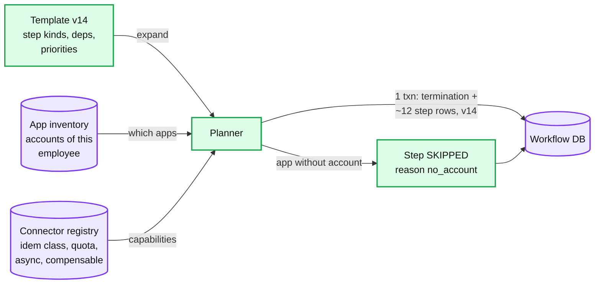
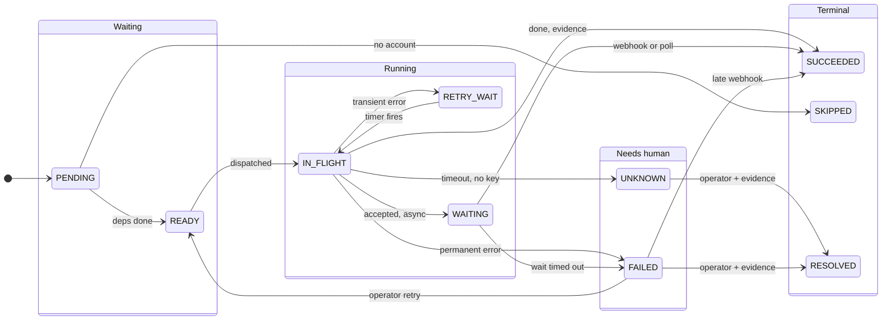
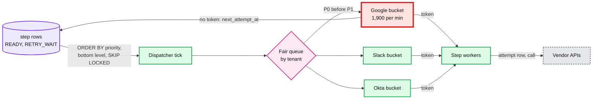

# Deep dive: the termination workflow engine

> One-line answer: a termination is a **frozen plan** (template version + this employee's app inventory + each connector's capabilities) stored as step rows in one transaction, run by **one owner at a time** (a 30 s lease carrying `owner_epoch`, checked on every step write), dispatched by **priority, then longest remaining path**, through a **token bucket per connector** at 80% of the vendor quota with **weighted fair queuing by tenant**. Waits are **durable timers** in a table, not sleeping threads. After a crash, a new owner reloads about 12 rows and decides each non-terminal step from its latest attempt. Temporal gives the same shape for free; at 4 transitions a second, a Postgres state machine is just as good and easier to draw in an interview.

Part of [`../solution.md`](../solution.md) §4.5, §5.5, §5.6, §10.2. Step-level idempotency and the completeness proof are in [`non-idempotent-steps-and-completeness.md`](non-idempotent-steps-and-completeness.md). Reused, not repeated: [`../../../concepts/temporal-durable-execution.md`](../../../concepts/temporal-durable-execution.md) (history, replay, timers, signals) and [`../../../concepts/distributed-transactions.md`](../../../concepts/distributed-transactions.md) §3 (saga, pivot step). The generic DAG engine is [`../../distributed-job-scheduler/`](../../distributed-job-scheduler/).

---

## 1. The planner: build once, freeze, never rewrite

Three inputs, one output.

| Input | What it contributes | Example |
|---|---|---|
| Template `termination/v14` (code, reviewed) | The step kinds, their dependencies, priorities, the point of no return | S1 before everything; S3 before S7; S5 before S10 |
| App inventory for this employee | Which connected apps actually hold an account | Google yes, Slack yes, GitHub yes, Okta no |
| Connector registry | Per action: idempotent, readable, compensable, async, quota | Google suspend: idempotent, readable, compensable, sync, 2,400/min |

The planner expands the template against the inventory: one step per (step kind, connected app with an account). A step kind with no matching account becomes `SKIPPED` with reason `no_account`, so the plan still shows it was considered. It writes the `TERMINATION` row and every `STEP` row in one transaction with `plan_version = v14`, status `PENDING`. From then on the plan is **data**, not code.



**What happens when the template changes mid-flight.** A running termination keeps its `plan_version`. Three kinds of change, three rules:
- **A new step kind** (for example "revoke Zoom" added in v15). Old plans do not grow it. The verifier's inventory re-list (the completeness proof) finds any active Zoom account and **appends** a step to the running plan as an amendment row (`amended_by = verifier`). Append, never rewrite.
- **A bug fix inside a connector action** (a wrong field in the Slack call). The connector code is versioned separately from the template. The next attempt of a step uses the current connector version if the registry marks it compatible; nothing in the plan changes.
- **A changed dependency** (v15 says "wipe only after Drive transfer"). Old plans keep the old edges. If the change is a safety fix, ship it as a guard inside the step (the wipe step checks "Drive transfer done?" before calling), which applies to every plan version at once.

This is the same "pin an immutable version per run" rule as the job scheduler's `dag_version`.

## 2. The step state machine

Every step is in exactly one state. Terminal states never change, except `RESOLVED` which an operator sets with evidence.



A termination's own status is derived: `RUNNING` while any step is non-terminal, `NEEDS_ATTENTION` while any step is `UNKNOWN` or `FAILED`, `VERIFYING` once only the verifier is left, `COMPLETE` when it seals. The `+30 day` delete (S11) is a durable timer; see §5 for how it relates to the "closed within 7 days" SLO.

## 3. The dispatcher

**Ordering.** `READY` steps are taken by `(priority, bottom level descending, step_key)`. Bottom level is the longest remaining path from the start of the step to the end of the DAG, computed once at plan time from estimated durations. It is what makes S3 (mail routing to the manager, which gates the hour-long Drive transfer and the +30 day delete) start before S4 (Slack), even though both are P1. The runnable version is in §8.

**The fetch.** One query per dispatcher tick, many dispatchers in parallel without stepping on each other:

```sql
SELECT s.termination_id, s.step_key, s.connector
FROM step s JOIN termination t USING (termination_id)
WHERE s.status IN ('READY', 'RETRY_WAIT') AND s.next_attempt_at <= now()
  AND t.owner = $me                         -- only terminations this instance owns
ORDER BY s.priority, s.bottom_level DESC, s.step_key
LIMIT 200
FOR UPDATE OF s SKIP LOCKED;
```

**Admission.** A fetched step runs only if its connector's bucket has a token. Each (connector, tenant credential) pair has a token bucket refilled at 80% of the vendor quota: Google's Directory API allows 2,400 queries per minute per user per project, so the bucket refills at **1,900 per minute** ([research](../research/facts-survey.md)). The other 20% is headroom for polls, read-backs and other Rippling features that share the credential. No token: the step goes back with `next_attempt_at = now() + wait_for_token`, not a failure and not an attempt.

**Fairness.** Workers are shared across tenants; vendor quotas mostly are not: Google's is "per user per Google Cloud project", the project is Rippling's, and each tenant's calls run as that tenant's delegated admin user, so each tenant spends its own per-user quota (only Rippling can request a raise, and a global per-project bucket guards any project-wide limit). So the dispatcher runs weighted fair queuing across tenants for **worker slots**: each tenant with ready work gets a share of the pool, and within a tenant P0 always beats P1. A 5,000-person layoff at one tenant cannot delay one involuntary termination at another.



## 4. Leases, `owner_epoch`, and the fenced write

One owner per termination, so the DAG logic is single-threaded code with no locks between steps of the same termination. Ownership is a lease on the `TERMINATION` row: TTL 30 s, renewed every 10 s ([`../../../concepts/leases-fencing-clocks.md`](../../../concepts/leases-fencing-clocks.md)).

**Take or renew the lease:**

```sql
UPDATE termination
SET owner = $me,
    owner_epoch = CASE WHEN owner = $me THEN owner_epoch ELSE owner_epoch + 1 END,
    lease_expires_at = now() + interval '30 seconds'
WHERE termination_id = $tid
  AND (owner = $me OR lease_expires_at < now())
RETURNING owner_epoch;               -- no row: someone else owns it, back off
```

**Every step write is fenced**, in one short transaction:

```sql
BEGIN;
SELECT owner_epoch FROM termination
WHERE termination_id = $tid AND owner_epoch = $my_epoch
FOR SHARE;                           -- blocks a takeover until this txn ends, and vice versa
-- no row: stop. I am not the owner any more. Do not retry.

UPDATE step
SET status = 'SUCCEEDED', evidence_id = $ev, updated_at = now()
WHERE termination_id = $tid AND step_key = $key
  AND status = 'IN_FLIGHT' AND current_attempt = $attempt_no;
-- 0 rows: the step already moved (another attempt, an operator). Stop.
COMMIT;
```

Why `FOR SHARE` and not just `AND owner_epoch = $my_epoch` in the `UPDATE`: under read committed, an old owner's statement can read epoch 7 just before the new owner commits epoch 8, and commit its step write after the new owner has already loaded the steps. The share lock orders the two: either the old owner's write commits first (and the new owner sees it when it loads), or the takeover commits first (and the old owner finds no row). A paused old owner that wakes up after a GC pause gets zero rows and stops.

## 5. Resume, and the timers that make waiting durable

**Resume algorithm** (new owner, `epoch + 1`, about 40 s after the old one died: 30 s lease plus one poll):

1. Load the termination and its ~12 steps and their latest attempts by primary key. One round trip.
2. Recompute `READY`: any `PENDING` step whose dependencies are all `SUCCEEDED`, `SKIPPED` or `RESOLVED`.
3. For each `IN_FLIGHT` step, apply its idempotency class ([`non-idempotent-steps-and-completeness.md`](non-idempotent-steps-and-completeness.md) §2): idempotent, retry; keyed, retry with the same key; readable, read back first; unreadable, `UNKNOWN` to an operator.
4. `WAITING` steps: nothing to redo. Their poll timers are rows (below); webhooks keep landing in the inbox whoever owns the termination.
5. `RETRY_WAIT`: already carries `next_attempt_at`; the dispatcher picks it up.

**Timers are rows, not sleeps.** One table, `timer(termination_id, step_key, kind, fire_at)`, indexed on `fire_at`. A timer poller reads due rows every second with `FOR UPDATE SKIP LOCKED` and applies an idempotent transition (a timer that fires twice finds the step already moved and does nothing).

| Timer kind | Set when | Fires | Effect |
|---|---|---|---|
| `poll` | Step enters `WAITING` | Backoff: 1 min, 5 min, 30 min, then hourly `[estimate]` | Read the vendor's status. Backstop for a lost webhook |
| `wait_deadline` | Step enters `WAITING` | Drive transfer 24 h, device wipe 7 days `[estimate]` | `FAILED` with reason, to the operator queue. Never re-sends the action |
| `point_of_no_return` | Plan created (voluntary) | `effective_at + 24 h` | Irreversible steps (S8 wipe, S10 cancel, S11 delete) may become `READY`. Involuntary high-risk plans set it to `effective_at` for the wipe |
| `auth_settle` | S5 freeze succeeds | When the frozen card has no pending authorizations, checked daily, about 3 days `[estimate]` | S10 cancel card becomes `READY` (it also needs the point of no return) |
| `legal_date` | S9 scheduled | The final-pay date | Payroll confirms the payment, S9 `SUCCEEDED`, which feeds the verifier |
| `due` | Plan created | `effective_at + 30 days` | S11 delete accounts becomes `READY` |

**S11 and the 7-day SLO.** S11 is deliberately 30 days out, so "every step terminal within 7 days" cannot literally include it. Count it as a scheduled step: the SLO measures every step that is not waiting on its own `due` timer, and S11 has its own alert if it has not succeeded 1 day after its due date. The snippet in §8 shows the difference: the critical path through S11 is 30 days, and without it the plan closes in about 72 hours, bounded by the frozen card's pending authorizations clearing before S10 can cancel it `[estimate]`.

## 6. The layoff, minute by minute

One tenant, 5,000 employees, `effective_at = 09:00`. Numbers from [`../solution.md`](../solution.md) §2 and §5.6.

| When | What happens | Bound by |
|---|---|---|
| Day before, 14:00 | HR submits `POST /terminations:batch` with 5,000 employees and one `effective_at`. The planner builds and stores 5,000 plans (about 60,000 step rows), resolves every inventory, checks every connector credential, and dry-runs each connector's read calls. Failures (an expired Google token) are fixed today, not at 09:00. The tenant is told to raise its Google quota | Planner, minutes |
| 09:00:00 | Every plan's `effective_at` timer fires. S1 for 5,000 people: 5,000 row updates in Rippling's own IdP. Every SSO login is refused from here | Our DB, **seconds** |
| 09:00 to 09:05 | The Google lane serves S2 for all 5,000 people before anything else on Google: suspend plus sign-out, 2 calls each, **10,000 calls at 1,900 per minute = 5.3 minutes** | Google quota |
| 09:00 to ~09:05 | Slack and Okta session resets (S2), Slack deactivation (S4), GitHub and AWS (S6), card freeze (S5) run in parallel, each against its own bucket | Each vendor's quota |
| 09:05 to 09:21 | Google P1 lane: OAuth token cleanup, list plus about 5 deletes per person, **30,000 calls, 16 minutes** | Google quota |
| 09:05 onward | Mail routing (S3) on the Google P1 lane, then Drive transfers (S7) per person as their S3 finishes; wipes (S8) queue at the MDM; final pay (S9) is handed to payroll as one batch | Vendor async |
| Next day, 09:00 | Point of no return for voluntary plans. For a layoff, HR normally marks the batch involuntary, so irreversible steps are gated only by their own dependencies | Policy |

The SLO split this produces: internal revocation under 1 minute, external P0 under 15 minutes on a default quota (5.3 minutes of Google calls plus retries and read-backs), single terminations under 5 minutes. The engine is never the bottleneck: 60,000 steps over an hour is about 17 step transitions a second on the workflow DB.

## 7. Temporal or a Postgres state machine

| Piece | Temporal | Postgres state machine |
|---|---|---|
| One termination | A workflow execution, id `termination_id` (dedup on start) | `TERMINATION` row plus step rows |
| The DAG | Workflow code: `await` S1, then start S2 to S6 as parallel activities, join | `STEP.deps`, recomputed `READY` set |
| One step | An activity | A worker call between two fenced writes |
| Owner, crash recovery | History shard owner; replay of the event history | Lease with `owner_epoch`; reload ~12 rows |
| Retry policy | Default 1 s initial, 2x backoff, 100 s max interval, **unlimited** attempts: set a cap per class | `next_attempt_at`, attempt count, same numbers by choice |
| Non-retryable errors | Error types listed on the retry policy (`CardAlreadyCanceled` handled as success inside the activity) | Class rules in the worker |
| Webhook in | Signal to the workflow | Inbox row matched on `correlation_id` |
| Waits (poll, +30 days, point of no return) | Durable timers, `workflow.sleep` | `timer` table and a poller |
| History size | ~12 steps, about 6 events each: roughly 80 events, far below the 51,200 cap. No Continue-As-New needed | n/a |
| Crash after the side effect, before the result | **Still there**: activities are at-least-once | Still there |
| What you draw in the interview | The same tables anyway | The tables |

Either way the part the interviewer grades is the same: the idempotency class per step and the read-back rule. Temporal removes the lease, timer and replay code; it does not remove the need to design the steps.

## 8. Runnable: critical path and dispatch order

Stdlib only. Durations are `[estimate]`; timers use their due time.

```python
from functools import lru_cache

# step: (priority, duration_s, deps)
STEPS = {
    "S1_identity":  (0, 0.05,      []),
    "S2_sessions":  (0, 3,         ["S1_identity"]),
    "S3_mail_route":(1, 2,         ["S1_identity"]),
    "S4_slack":     (1, 2,         ["S1_identity"]),
    "S5_freeze":    (1, 2,         ["S1_identity"]),
    "S6_keys":      (1, 4,         ["S1_identity"]),
    "S7_drive":     (2, 3_600,     ["S3_mail_route"]),
    "S8_wipe":      (2, 86_400,    ["S1_identity"]),
    "S9_final_pay": (2, 172_800,   ["S1_identity"]),
    "S10_cancel":   (3, 259_200,   ["S5_freeze"]),      # waits for pending auths to clear
    "S11_delete":   (3, 2_592_000, ["S7_drive"]),
    "V_verify":     (3, 60,        ["S2_sessions", "S4_slack", "S6_keys", "S8_wipe",
                                    "S9_final_pay", "S10_cancel", "S11_delete"]),
}

def check_acyclic(steps):
    """Kahn's algorithm. The planner rejects a template with a cycle."""
    indeg = {s: len(d) for s, (_, _, d) in steps.items()}
    kids = {s: [] for s in steps}
    for s, (_, _, deps) in steps.items():
        for d in deps:
            kids[d].append(s)
    ready, seen = [s for s, n in indeg.items() if n == 0], 0
    while ready:
        s = ready.pop(); seen += 1
        for k in kids[s]:
            indeg[k] -= 1
            if indeg[k] == 0:
                ready.append(k)
    return seen == len(steps), kids

ok, KIDS = check_acyclic(STEPS)

@lru_cache(maxsize=None)
def bottom_level(s):
    """Longest remaining path from the start of s to the end of the DAG."""
    return STEPS[s][1] + max((bottom_level(k) for k in KIDS[s]), default=0)

def dispatch_order(ready):
    return sorted(ready, key=lambda s: (STEPS[s][0], -bottom_level(s), s))

def earliest_finish(steps, only=None):
    fin = {}
    def f(s):
        if s not in fin:
            fin[s] = max((f(d) for d in steps[s][2]), default=0) + steps[s][1]
        return fin[s]
    return max(f(s) for s in (only or steps))

def critical_path():
    path, s = [], "S1_identity"
    while True:
        path.append(s)
        if not KIDS[s]:
            return path
        s = max(KIDS[s], key=bottom_level)

assert ok
assert not check_acyclic(dict(STEPS, S1_identity=(0, 0.05, ["V_verify"])))[0]

order = dispatch_order([s for s, (_, _, d) in STEPS.items() if d == ["S1_identity"]])
assert order[:3] == ["S2_sessions", "S3_mail_route", "S5_freeze"]  # P0, then the P1s that gate long chains
assert earliest_finish(STEPS, only=[s for s in STEPS if STEPS[s][0] <= 1]) == 4.05
assert critical_path() == ["S1_identity", "S3_mail_route", "S7_drive", "S11_delete", "V_verify"]

no_timer = {s: v for s, v in STEPS.items() if s != "S11_delete"}
no_timer["V_verify"] = (3, 60, [d for d in STEPS["V_verify"][2] if d != "S11_delete"])
assert round(earliest_finish(no_timer) / 3600, 1) == 72.0
```

The asserts pin the results: dispatch after S1 is `S2, S3, S5, S6, S4, S9, S8`; P0 and P1 finish at 4.05 s of calls; the critical path is `S1, S3, S7, S11, V`; and without the S11 timer the plan closes at 72.0 h.

Three things to say from it: access is revoked in about 4 s of calls (10 to 20 s with read-backs, as in the solution); the critical path to "closed" runs through mail routing, the Drive transfer and the 30-day timer, which is why S3 is dispatched before its P1 siblings, with S5 next because it gates the card cancel; and without the deliberate timer the plan closes when the frozen card's pending authorizations clear and S10 can cancel it.
