# Diagrams: employee-ops bundle

The D1 to D12 set from `hld/CLAUDE.md` §4, for all four parts. Diagrams already embedded in [`solution.md`](solution.md) get a pointer, not a second copy. Numbers match `solution.md` §2 and §10.3; anything else is marked `[estimate]`.

| # | Diagram | Where |
|---|---|---|
| D1 | Context | below |
| D2 | Data flow, Part 1 and Parts 2 to 4 | below (two diagrams) |
| D3 | Component architecture (final design) | [`solution.md`](solution.md) §6 |
| D4 | Happy path per FR | FR1 ingest: `solution.md` §4.1. FR2 dashboards: below. FR3 billing hour close: `solution.md` §4.3. FR4 record job and payout: below. FR5 termination: below. FR6 assistant question: `solution.md` §5.9 |
| D5 | Failure paths | Crash after cancel card: `solution.md` §5.5. Kafka broker loss: §10.4 A. LLM provider outage: §10.4 C. Archive gap at hour close: §4.3 (the `alt` branch). New below: webhook lost so the poll completes the step, SDK queue full, narrator sentence fails the number check |
| D6 | Decision flows | Step retry rule by idempotency class: below. Ingest accept or reject per event: below. Verifier: `solution.md` §5.7 |
| D7 | Entity relationship | `solution.md` §3.3 (D7a metering and pay, D7b termination and assistant) |
| D8 | State machines (termination step, termination) | below |
| D9 | Deployment / topology | below (Part 1 data plane, Parts 2 to 4) |
| D10 | Scaling / partitioning | below |
| D11 | Failure mode map | below, in two parts |
| D12 | Rollout / migration (Part 3 from a Celery script) | below |
| Zoom-ins | Part 1 incremental steps, reconnect herd, reconciliation chain, 100x index, driver lock, termination DAG, layoff lanes, verifier, data boundary | `solution.md` §4.1 to §4.3, §5.1, §5.2, §5.3, §5.4, §4.5, §5.6, §5.7, §5.8 |

## D1. Context (zoom-out)

The bundle as one box: who sends what in, who we call out to. The four parts and the edges between them are in D3.

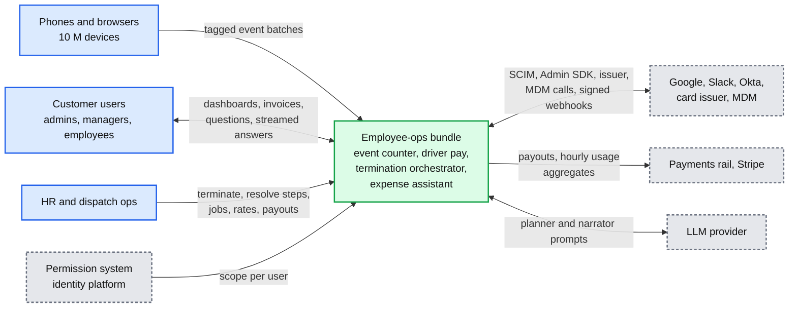

## D2. Data flow (DFD)

Every edge with data, format, size and rate at peak. Part 1 is the only part where volume matters, so it gets its own diagram.

```mermaid
%% D2a: Part 1 data flow at peak. The raw log is read three ways: speed path, archive, and hourly cuts.
flowchart LR
    SDK[SDKs] -->|"event batch, gzip JSON,<br/>~10 x 300 B, 12k req/s"| ING(Ingest pods x12)
    ING -->|"event record, zstd ~80 B,<br/>116k/s, 80 GB/day"| K[(Kafka events.raw<br/>64 partitions, RF 3)]
    K -->|"records, 116k/s"| FL(Flink rollup)
    FL -->|"minute delta ~50 B,<br/>~17k rows/s [estimate]"| CH[(ClickHouse<br/>~150 M rows/day, ~10 GB)]
    CH -->|"series JSON per query"| DASH(Dashboard API)
    K -->|"records + offset, 116k/s"| ARC(Archive sink)
    ARC -->|"Parquet ~40 B/event,<br/>40 GB/day"| LAKE[(Lake raw_events<br/>13 months, ~16 TB)]
    K -->|"offsetsForTimes,<br/>1 cut map per hour"| CUT(Period cutter)
    CUT -->|"period_cut, 64 rows/hour"| BDB[(Billing Postgres)]
    LAKE -->|"~42 M events/hour avg"| BB(Billing batch)
    BB <-->|"anti-join, 35 days,<br/>560 GB in 1,024 buckets"| IDX[(billable_event)]
    BB -->|"billing_line per tenant-hour,<br/>up to 20k rows/hour"| BDB
    BDB -->|"1 aggregate per tenant-hour,<br/>identifier tenant:hour"| STR[Stripe billing]

    class SDK client
    class ING,FL,DASH,ARC,CUT,BB service
    class K queue
    class CH,LAKE,BDB,IDX store
    class STR external
    classDef client   fill:#dbeafe,stroke:#2563eb,stroke-width:2px,color:#111
    classDef service  fill:#dcfce7,stroke:#16a34a,stroke-width:2px,color:#111
    classDef store    fill:#ede9fe,stroke:#7c3aed,stroke-width:2px,color:#111
    classDef queue    fill:#cffafe,stroke:#0891b2,stroke-width:2px,color:#111
    classDef external fill:#e5e7eb,stroke:#6b7280,stroke-width:2px,color:#111,stroke-dasharray:4 3
```

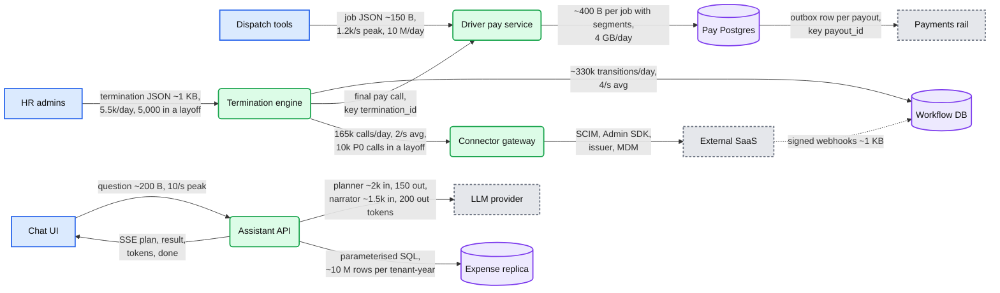

## D3. Component architecture

The final design with all four parts and the three edges between them: [`solution.md`](solution.md) §6. Red is the connector gateway, whose vendor quota sets the layoff SLO.

## D4. Happy path, one per functional requirement

FR1 (ingest, including the crash-after-ack duplicate) is in `solution.md` §4.1. FR3 (closing a billing hour) is in §4.3. FR6 (one question, streamed) is in §5.9.

**FR2: an event reaches the dashboard in about 1 to 2 minutes.**

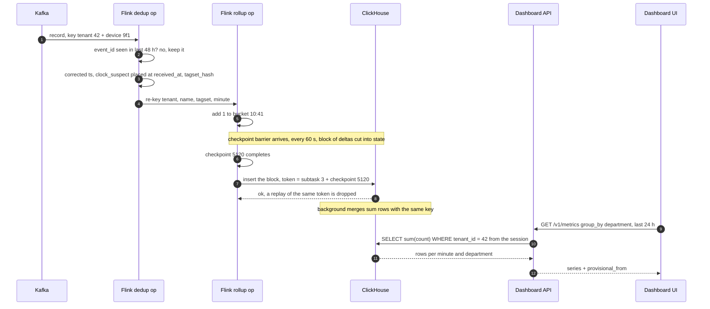

**FR4: record two overlapping jobs, then pay up to 11:30.** Numbers from `solution.md` §5.4.

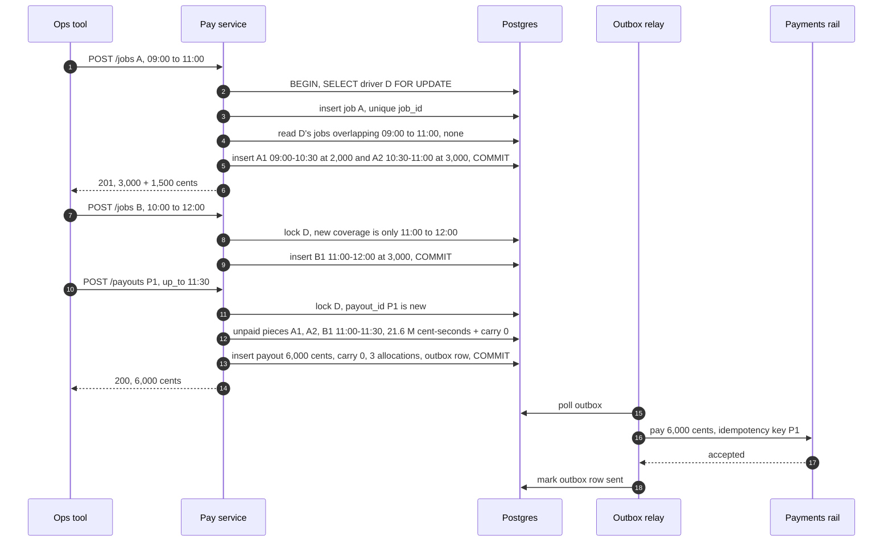

**FR5: involuntary termination, P0 and P1 done in about 10 to 20 seconds.**

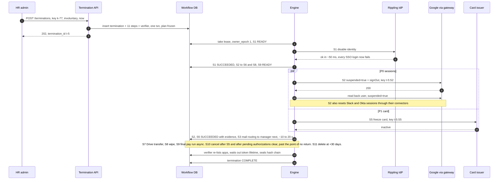

## D5. Failure paths

Already in `solution.md`: crash after cancel card (§5.5), Kafka broker loss (§10.4 A), LLM provider outage (§10.4 C), archive gap at hour close (§4.3). Three more:

**The completion webhook is lost; the poll finishes the step.**

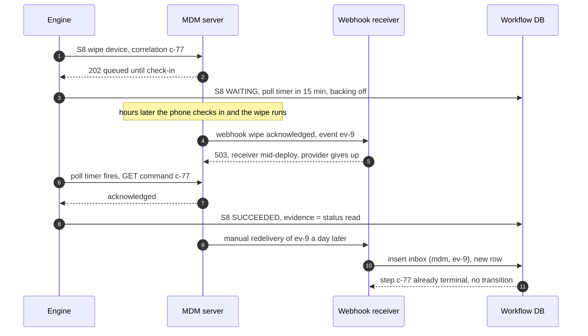

**A phone is offline for 45 days; the SDK queue caps out and the loss stays visible.**

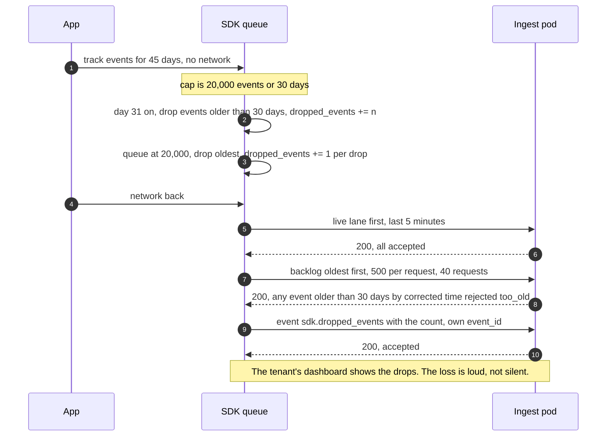

**The narrator writes a number that is not in the result.**

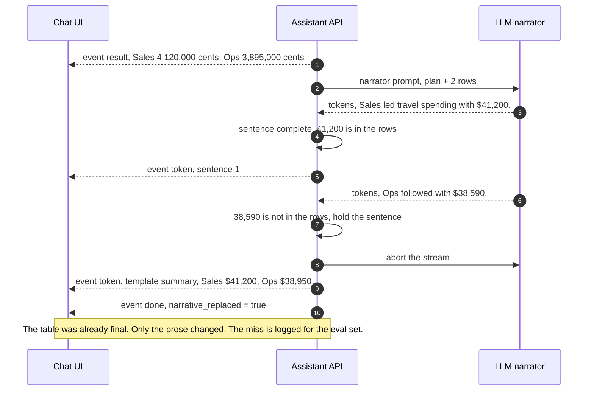

## D6. Decision flows

**(a) What happens after an attempt, by idempotency class** (`solution.md` §5.5).

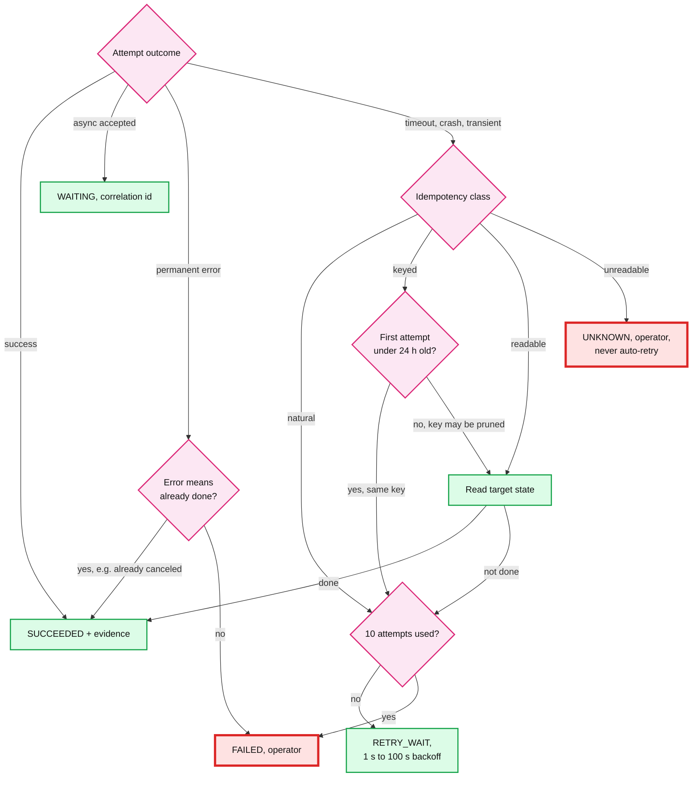

Red here marks the two exits that need a human; they are what the P0 page watches.

**(b) Ingest: accept or reject, per batch then per event** (`solution.md` §4.1).

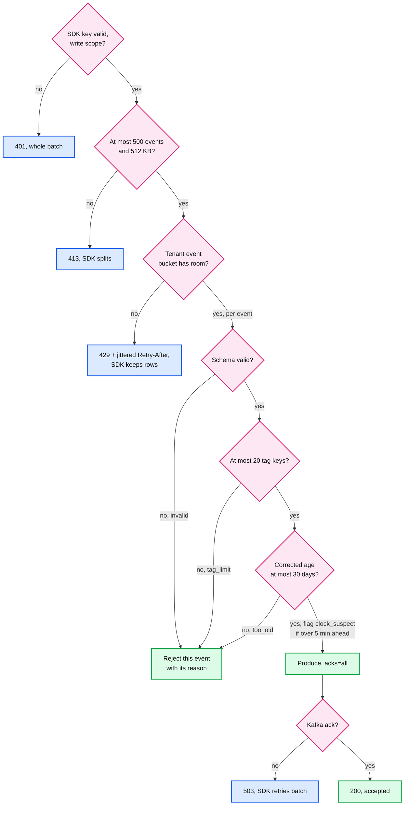

## D7. Entity relationship

Both ER diagrams (D7a metering and driver pay, D7b termination and assistant) are in `solution.md` §3.3 with their access patterns.

## D8. State machines

**Termination step.** Terminal states are grouped; the two operator states are grouped.

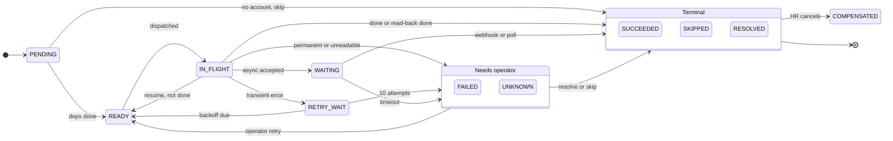

`COMPENSATED` applies only to reversible steps that `SUCCEEDED` (freeze, suspend, deactivate), and only before the point of no return.

**Termination.**

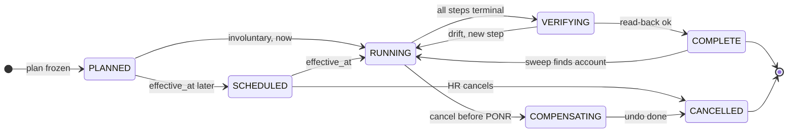

PONR is the point of no return: `effective_at + 24 h` for voluntary terminations. After it, `POST /cancel` is refused. `VERIFYING` includes the wait until the maximum token lifetime (90 min) has passed.

## D9. Deployment / topology

One region, three availability zones. Everything is regional; only the vendors (SaaS, LLM, payments) are global and outside our boundary.

**Part 1 data plane.**

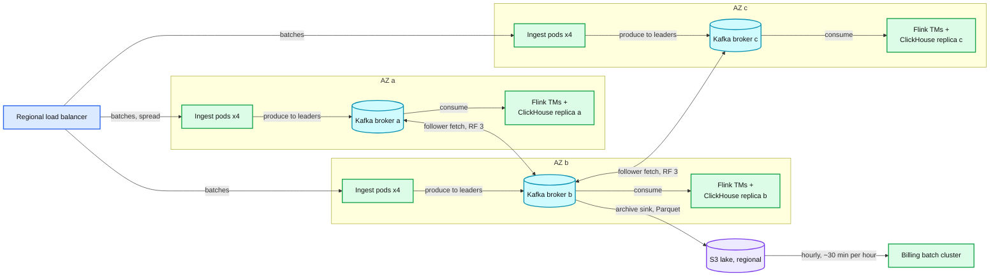

Ingest pods produce to whichever broker leads each partition, in any AZ; the per-AZ arrows are simplified. With `min.insync.replicas=2`, losing one AZ keeps every partition writable.

**Parts 2 to 4.**

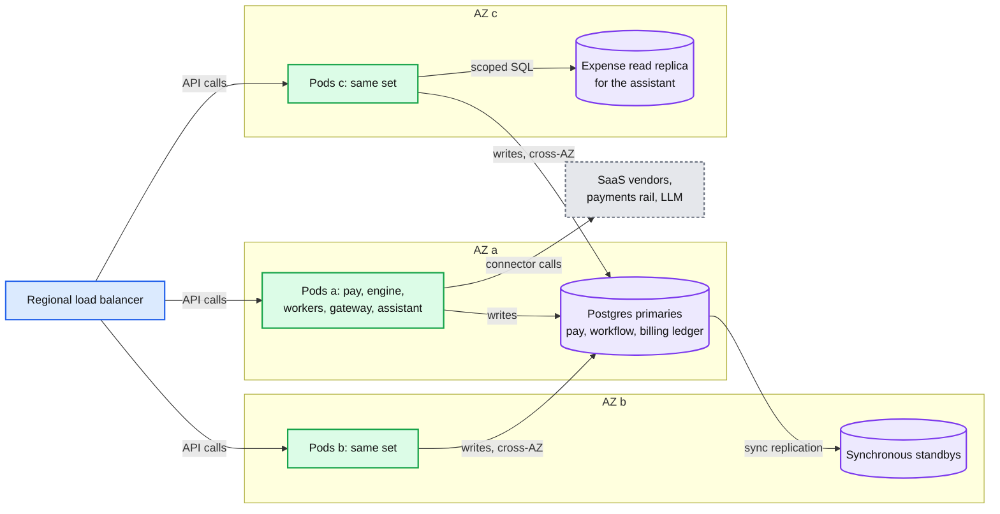

Losing AZ a: the standby in AZ b is promoted, engine leases expire in 30 s and are taken by pods in b or c with `epoch + 1`. The expense replica is fed from the expense product's own database, which another team owns.

## D10. Scaling / partitioning

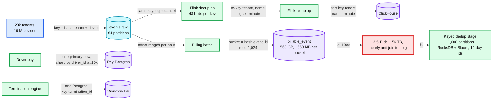

Hot keys: because the Kafka key includes the device, one big tenant spreads over all 64 partitions. One device's 20,000-event backlog lands on one partition, but arrives as 40 requests of 500. Parts 2 and 3 are too small to need sharding at 1x.

## D11. Failure mode map

Each component, what fails, the blast radius, and the mitigation. Two trees, two parts each.

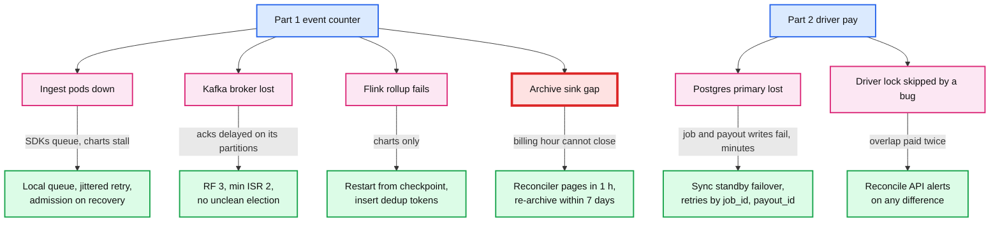

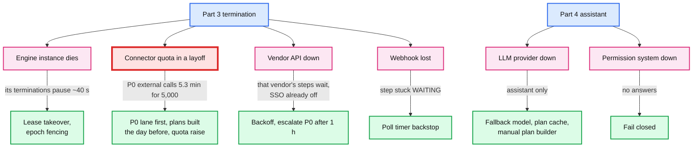

Not drawn, same shape: a stale scope cache (rows visible up to 60 s after a role change, invalidation events), expense replica lag (answer says "as of"), the billing batch failing (invoices late, deterministic rerun).

## D12. Rollout / migration: Part 3 from a Celery offboarding script

The likely starting point is a script that calls vendor APIs in order. Each phase has a rollback point; the old script stays runnable until the last phase ends. `[estimate]` durations.

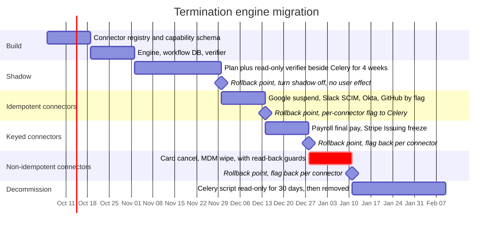

Shadow exit criteria: the verifier's view matches what the script did for every termination in 4 weeks, and every connector in the registry has its idempotency class tested against the vendor's sandbox. In-flight terminations keep their frozen `plan_version` across every flag flip.
