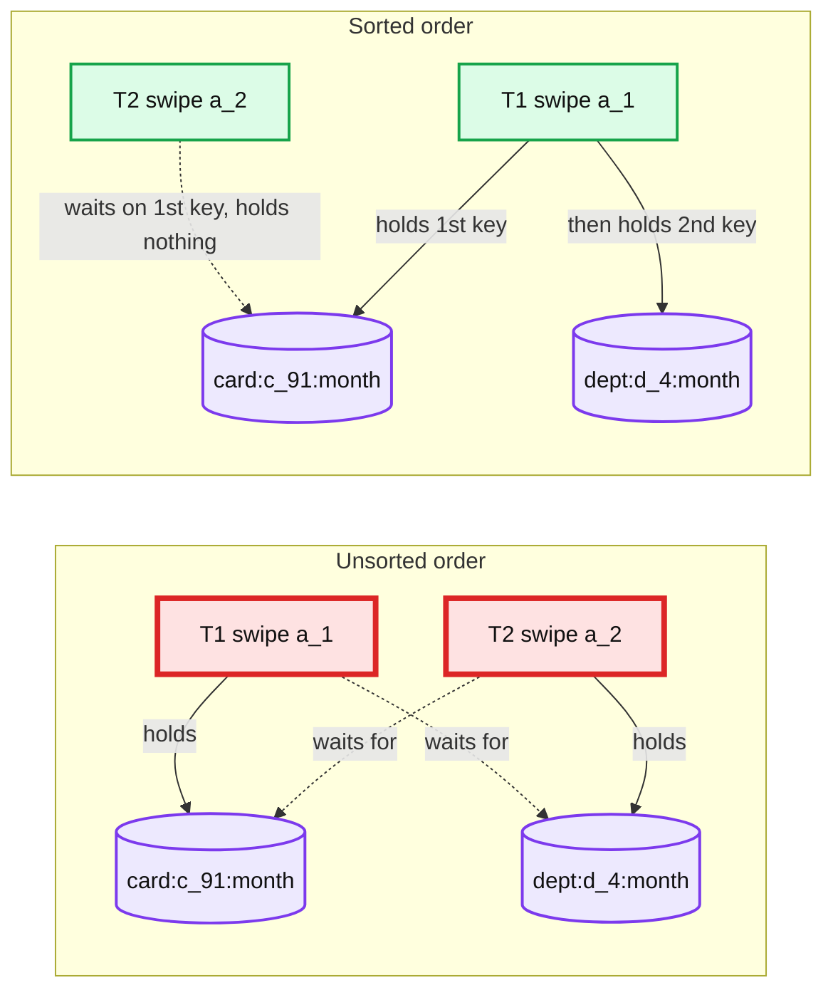
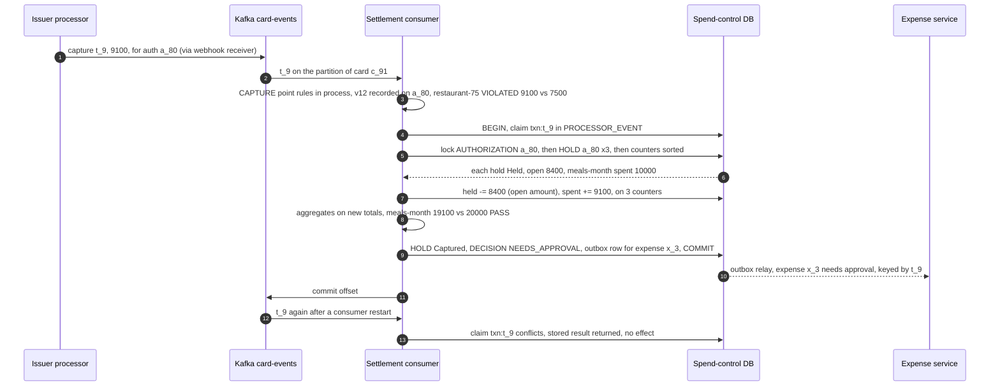
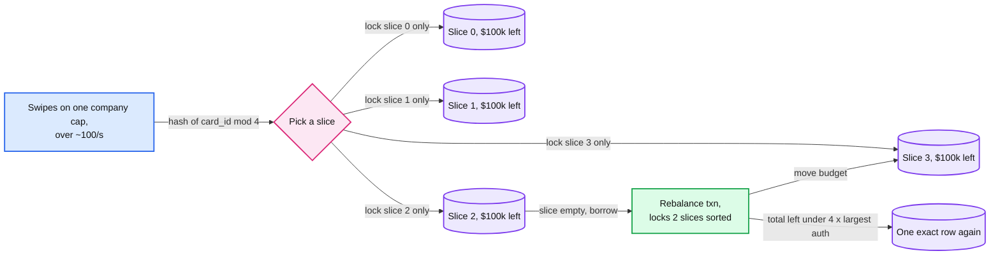

# Deep dive: aggregates, holds and concurrency

> One-line answer: every aggregate limit reads a **counter row** keyed by dimension and window (`card:c_91:month` at `2026-09-01` in the tenant's timezone) that stores `spent` and `held`. An authorization claims its event key, locks its counter rows **in sorted key order** with `SELECT ... FOR UPDATE`, lets the engine evaluate on `spent + held + amount`, adds a hold and commits, all on one shard in ~4 ms. Every later event (capture, reversal, refund, expiry) is its own small transaction that claims the processor's event key first and moves **the hold's open amount** from `held` to `spent` or back to zero. The row lock is held ~4 ms, so one counter serializes ~250 swipes/s at p50; the hottest counter we have sees ~23/s.

Zoom-in on [`../solution.md`](../solution.md) §5.2, with the Postgres internals of §10.1 and the idempotency table of §10.5. Reusable blocks: [`../../../concepts/mvcc-and-isolation.md`](../../../concepts/mvcc-and-isolation.md) (row locks vs snapshot reads), [`../../../concepts/exactly-once.md`](../../../concepts/exactly-once.md) (effect once by unique key), [`../../../concepts/distributed-transactions.md`](../../../concepts/distributed-transactions.md) (what a single-shard transaction lets us avoid), [`../../../concepts/sharding.md`](../../../concepts/sharding.md). Siblings: [`authorization-hot-path.md`](authorization-hot-path.md), [`degraded-modes-and-region-loss.md`](degraded-modes-and-region-loss.md), [`reimbursement-workflow-and-payout.md`](reimbursement-workflow-and-payout.md).

---

## 1. Counters are keyed by dimension and window, never by rule

| Counter key | Window | Rules that share the row (examples) |
|---|---|---|
| `card:c_91:month` | calendar month | "card at most $3,000 a month" |
| `emp:e_17:cat:meals:month` | calendar month | "meals at most $200 a month" (DECLINE), "meals over $150 a month need approval" |
| `dept:d_4:month` | calendar month | "department at most $50k a month" |
| `trip:t_88:cat:meals` | whole trip, `window_start` = 0 | "meals at most $200 per trip" |

- **One row per group, window and filter.** Two rules on meals-month with the same filter read the same row with different limits and actions. The key's middle part is the canonical filter (a sorted category set, or a short hash of the canonical CEL filter), so "restaurant + meals" and "meals only" never share a row. A new rule with the same group, window and filter needs no backfill; anything else is a new counter and does ([`safe-rule-changes.md`](safe-rule-changes.md)). The compiled bundle lists which counter keys each candidate rule touches, so the key set is known before the transaction opens.
- **Windows are in the tenant's timezone.** `window_start` is the local date the window opens: `2026-09-01` for September in `America/Los_Angeles`. The engine computes it from the **network transaction time** in the facts, never from our clock, so a replay lands in the same window. A swipe at 23:30 on 30 September in Los Angeles is 06:30 UTC on 1 October and still counts to September. Daylight saving never matters: a window is a date, not a duration.
- **A tenant that changes timezone** switches at the next window boundary. Re-keying a live window would move money between rows mid-month.
- **Later events land in the hold's window.** A September dinner captured on 2 October moves September's `held` to September's `spent`. Only a force capture and an unlinked refund pick a window from their own date.
- **Size.** ~30 M counter rows × 200 B = 6 GB and ~6 M open holds ≈ 1 GB fleet-wide. Per logical shard that is ~1.9 M counters (~0.4 GB) and ~375k open holds (~0.06 GB), next to ~170 GB of hot `AUTH` and `CAPTURE` decisions. The counters and holds fit in memory.

## 2. The authorization transaction, as SQL

Point rules already ran in memory. A point-rule `DECLINE` skips steps 2 to 4 (no counter locks), reports every aggregate rule `NOT_EVALUABLE` with reason `short_circuit`, and still runs steps 1 and 5. For the rest, the decision service runs:

```sql
-- Autocommit, before BEGIN, only when the service has not seen this window's rows yet. VALUES sorted.
INSERT INTO counter (tenant_id, counter_key, window_start, spent_minor, held_minor)
VALUES ($t, 'card:c_91:month', '2026-09-01', 0, 0),
       ($t, 'dept:d_4:month', '2026-09-01', 0, 0),
       ($t, 'emp:e_17:cat:meals:month', '2026-09-01', 0, 0)
ON CONFLICT DO NOTHING;

BEGIN;
SET LOCAL lock_timeout = '100ms';            -- both derived from the request's remaining budget
SET LOCAL statement_timeout = '300ms';
-- 1. Claim the event key. A duplicate blocks here, then gets 0 rows and returns the stored result.
INSERT INTO processor_event (tenant_id, event_key, applied_at)
VALUES ($t, 'auth:a_77:0', now()) ON CONFLICT DO NOTHING RETURNING event_key;
-- 2. Lock every counter in one global order. Held from here to COMMIT, ~4 ms p50.
SELECT counter_key, window_start, spent_minor, held_minor
FROM counter
WHERE tenant_id = $t AND (counter_key, window_start) IN (...)
ORDER BY counter_key, window_start
FOR UPDATE;
-- 3. The engine evaluates every aggregate rule on spent + held + amount, in the service (~10 us).
-- 4. ALLOW, ALLOW_FLAGGED or NEEDS_APPROVAL (which approves the swipe): reserve.
--    7440 = 6200 x 1.2 tip buffer, headroom permitting (section 8).
UPDATE counter SET held_minor = held_minor + 7440, updated_at = now()
WHERE tenant_id = $t AND (counter_key, window_start) IN (...);
INSERT INTO hold (tenant_id, auth_id, counter_key, window_start, amount_minor, status, expires_at)
VALUES (...);                                -- one row per counter, status 'Held'
-- 5. Always, a DECLINE included: the authorization (final status, policy version), the decision,
--    and the claim's stored result.
INSERT INTO authorization (tenant_id, auth_id, card_id, amount_minor, currency, mcc,
                           status, policy_version, network_time)
VALUES ($t, 'a_77', 'c_91', 6200, 'USD', '5812', 'APPROVED', 12, $nt);
INSERT INTO decision (tenant_id, decision_id, subject_id, context, outcome,
                      policy_version, engine_version, facts, results)
VALUES (...);
UPDATE processor_event SET result = 'APPROVED d_5' WHERE tenant_id = $t AND event_key = 'auth:a_77:0';
COMMIT;                                      -- waits for 1 of 2 sync standbys, in the other availability zones
```

Why each piece is there:
- **The upsert follows the same sorted order, and runs before `BEGIN`.** A concurrent insert of the same key waits for the inserter's transaction to end. Insert in rule order instead (one `INSERT` per counter) and T1 creates the new `card` row while T2 creates the new `dept` row, then each waits on the other's uncommitted insert: a deadlock that the sorted `SELECT` never gets to. It bites at local midnight on the 1st, when every card's first swipe creates rows. Sorted `VALUES` remove the cycle; autocommit also keeps the auth transaction's locking to one statement. The service caches which rows exist, so most swipes skip it.
- **Claim the event key first, and record declines too.** `PROCESSOR_EVENT(tenant_id, event_key, result, applied_at)` is the one idempotency table: `auth:{auth_id}:{seq}` (seq 0 for the request, 1 to n for incremental authorizations), `txn:{transaction_id}` for captures and refunds, `rev:{id}` for reversals. The first `INSERT` of every transaction claims it, so a duplicate blocks behind the original, then returns the stored result; there is no separate "seen before?" read. Every authorization, declines included, writes its `AUTHORIZATION` (final status, `policy_version`) and its `DECISION`, so a retried decline never flips.
- **`ORDER BY ... FOR UPDATE` locks in sort order.** Postgres sorts, then locks each row as it emits it. The sort columns are the primary key, so they never change under us.
- **Evaluate between statements, in the service.** Locks are held ~4 ms p50: from `SELECT ... FOR UPDATE`, through the write round trip, to the commit on one of two synchronous standbys in the other AZs (availability zones). Only ~10 µs of that is rules. Only enforced outcomes move counters: a `SHADOW` verdict never writes a hold.
- **Timeouts from the budget.** A stuck lock becomes the fallback decision in at most 300 ms, not a missed 2 s deadline ([`degraded-modes-and-region-loss.md`](degraded-modes-and-region-loss.md)).

## 3. Why sorted order rules out deadlock



- **The proof in one line.** A deadlock needs a cycle of waits. With one global order, a transaction only ever waits for a key greater than every key it holds, so a cycle would need a key greater than itself. There are only queues.
- **One order for every transaction type:** the event claim in `PROCESSOR_EVENT` (a new row, so it only ever blocks a duplicate of itself), then the `AUTHORIZATION` row, then its `HOLD` rows, then `COUNTER` rows by `(counter_key, window_start)`. Authorization, capture, reversal, refund, the sweeper and journal replay all follow it. It lives in one data-access function, because one new code path that locks a counter before a hold brings the cycle back.
- **Postgres would catch a deadlock anyway,** but only after `deadlock_timeout` (1 s by default). Our 100 ms `lock_timeout` fires first, so an unsorted path shows up as unexplained degraded decisions, not as errors. Alert on degraded decisions with a healthy primary.

## 4. Pessimistic, not optimistic

| Approach | How | At 23/s on one row | At 100/s on one row | Verdict |
|---|---|---|---|---|
| Pessimistic `FOR UPDATE` (chosen) | lock, evaluate, write | mean wait ~0.2 ms | mean wait ~1.3 ms | wait bounded by `lock_timeout` |
| Optimistic (version column) | read, evaluate, `UPDATE ... WHERE version = v`, retry | ~9% of transactions retry | ~33% retry, and retries collide again | retry storms under a 1.2 s deadline |
| `SERIALIZABLE` (serializable snapshot isolation) | plain reads, abort on conflict | same retries as optimistic | same | also aborts on read patterns we do not care about |

The math [estimate]: model one row as a queue with a fixed 4 ms service time (the p50 lock hold). Utilization `ρ = λ × 4 ms`, mean wait `ρ × 4 ms / (2 × (1 − ρ))`. At 23/s, ρ ≈ 0.09 and the wait is ~0.2 ms. At 100/s, ρ = 0.4 and ~1.3 ms. At 225/s, ρ = 0.9 and ~18 ms with a long tail, which is why the ceiling is ~250/s at p50 and less at the tail. For optimistic, the chance that another writer lands inside the same ~4 ms window is `1 − e^(−λ × 4 ms)`: 9% at 23/s, 33% at 100/s.

- **Conflicts are expected exactly on the rows that matter:** shared department and company caps. A failed optimistic attempt costs a full round trip plus a re-evaluation, and the loser may lose again.
- **Pessimistic turns contention into a queue,** and a queue in arrival order is what a limit means. The 100 ms `lock_timeout` caps the worst case.

## 5. Why not Redis `INCRBY` or DynamoDB conditional writes

**Redis `INCRBY` (or a Lua check-and-increment).**
- *Why it looks right:* atomic per key and sub-millisecond. `INCRBY`, check the result, `DECRBY` on overflow is even race-free for one counter.
- *Durability breaks it:* replication is asynchronous, so a failover can lose acknowledged increments. A lost hold is a silent overspend with no audit trail. `WAIT` narrows the window; it does not close it.
- *Atomicity breaks it:* the hold, the `AUTHORIZATION` and the `DECISION` must commit with the counter. Redis plus Postgres is a dual write with no transaction across it.
- *Shape breaks it:* a script can touch three keys only if they share a hash slot, and the engine needs every counter's value to fill `observed` and `limit` for every rule, not a yes or no.
- *And it saves nothing:* ~1 ms instead of ~4 ms p50, against a 50 ms p99 budget.

**DynamoDB `TransactWriteItems` with a condition expression.**
- *Why it looks right:* "increment if `spent + held + :amt <= :limit`" is one conditional update, serverless, no failover to run.
- *The check has the wrong shape:* several rules with different limits and actions share one counter. A condition gives pass or fail against one threshold. The engine needs the values to choose between `DECLINE`, `REQUIRE_APPROVAL` and `FLAG` and to explain each rule. So you read first and write conditionally on a version: optimistic concurrency again, with transaction conflicts on hot items.
- *It splits the store:* decisions, holds and the change-data-capture feed to the lake already live in Postgres. Viable at a much larger scale; not needed at ~500 transactions/s per cluster.

## 6. Every lifecycle event is one transaction

Three rules for every event: claim its `PROCESSOR_EVENT` key with the first `INSERT`, lock in the global order, and move **the hold's open amount**, never the event's amount.

| Event | Dedup key | `held` | `spent` | Hold state after |
|---|---|---|---|---|
| Capture on a single-capture MCC (most merchants) | `txn:{id}` | − open amount; the remainder is released | + captured | Captured |
| Partial or multi capture, on MCCs that capture more than once | `txn:{id}` | − min(captured, open) | + captured | PartlyCaptured, Captured on the last |
| Over capture | `txn:{id}` | − open amount | + captured | Captured, excess flagged |
| Incremental authorization | `auth:{auth_id}:{seq}` | + delta | | Held; a full `AUTH` evaluation, can decline |
| Reversal, full or partial | `rev:{id}` | − reversed, up to open | | Released, or Held with less |
| Expiry, webhook or sweeper | the update event, or hold status | − open amount | | Released |
| Refund, linked | `txn:{id}` | | − amount, in the auth's window | Refunded |
| Refund, unlinked | `txn:{id}` | | nothing until matched, then − amount on the purchase's own window | none; queued for matching |
| Refund reversal (negative refund) | `txn:{id}` | | + amount | unchanged |
| Force capture | `txn:{id}` | | + amount, in its own window | new row, Captured |

- **Captures cannot be declined.** Stripe: "captures for approved authorizations always succeed" ([transactions](https://docs.stripe.com/issuing/purchases/transactions)). So the `CAPTURE` re-evaluation turns a violation into `NEEDS_APPROVAL` or a flag, never a decline. It reuses the `policy_version` recorded on the `AUTHORIZATION`, never re-derived, so the ~5 s activation lag cannot make two versions judge one card expense.
- **Why "open amount" matters: the late capture.** Stripe keeps an expired authorization's remaining amount "for possible late captures" ([authorizations](https://docs.stripe.com/issuing/purchases/authorizations)). If the expiry webhook or the sweeper already released the hold, a later capture finds it Released with an open amount of 0: `held` does not move and only `spent` grows. If both arrive together, the `AUTHORIZATION` and `HOLD` row locks serialize them, and both orders end with the same counters. Subtracting the event amount instead drives `held` negative.
- **Unlinked refunds credit nothing until matched.** Stripe calls refund linking "an inexact science". Crediting the current window, even floored at 0, opens a loophole: buy $3,000 on September 30, spend $3,000 in October, return the September purchase, and October gains $3,000 of room. Matching runs within minutes [estimate]; once matched, the credit lands on the purchase's own window; no match after 7 days [estimate] goes to finance.
- **An event for an unknown `auth_id` creates the authorization in its end state.** A reversal or capture can arrive before we know the authorization (a degraded approval still in the journal, a processor timeout approval). It first inserts the `AUTHORIZATION` as reversed or captured, so a later `adopt` sees it closed and adds no hold. Every authorization we did not decide ourselves enters through that one idempotent `adopt(auth_id, state)`, and the consumer also applies the processor's `authorization.created` and `authorization.updated` through it whenever our record disagrees (a lost answer, a timeout the processor applied, Commando Mode, network stand-in) ([`degraded-modes-and-region-loss.md`](degraded-modes-and-region-loss.md)).



The settlement consumer runs the same engine library and version in process, and point rules run before `BEGIN`. No RPC happens while row locks are held: a network hop inside the transaction would stretch the ~4 ms lock that live swipes queue behind. The expense row travels through an outbox row written in the same transaction, keyed by transaction id, which the expense service consumes idempotently, so a crash after `COMMIT` cannot lose it.

## 7. Expiry: three nets, one outcome

1. **The processor's webhook** (primary): the authorization arrives with status expired, and the consumer releases the open amount, deduped by event id.
2. **The sweeper** (backstop for a lost webhook): every minute [estimate] it reads candidates **without locks**: open holds whose `expires_at` (the processor's per-MCC expiry + 1 day) has passed, so the webhook almost always wins. Then one transaction per authorization in the global order, taking the `AUTHORIZATION` row with `FOR UPDATE SKIP LOCKED`: a row a live capture holds is skipped this round, and after the lock it re-checks the status. Locking a batch of holds first would invert the order against a capture and deadlock.
3. **Nightly reconciliation:** list the processor's open authorizations per tenant and diff with our open holds. Ours only: apply the missing capture, reversal or expiry. Processor only: `adopt` it. Mismatch above 0.1% opens a ticket, above 1% pages.

## 8. Tips: buffer the hold, not the decision

- **Hold more on tip MCCs** (restaurants, bars, taxis): `hold = amount × 1.2` [estimate: a tenant setting compiled into the bundle, so it is versioned and replayable; the network's tip tolerance is unverified]. A $62 lunch holds 7440 on each of its counters.
- **Point rules use the exact authorized amount.** Declining a $70 dinner because a tip *might* push it past $75 is a false decline.
- **The buffer never declines.** Aggregates decide on the exact amount, and each counter reserves `max(amount, min(1.2 × amount, headroom))`, where headroom is `limit − spent − held`. Deciding on the buffered amount would decline a swipe the exact amount passes: at 13,000 of 20,000, 6,200 passes, but 13,000 + 7,440 fails.
- **Capture re-checks the final amount.** The $84 capture of a $70 dinner makes `restaurant-75` `NEEDS_APPROVAL`. Money has moved; the rule can only ask.
- **Fuel pumps are the opposite case.** Stripe sends a $1 "status check" and holds a default of $100 until the pump reports the amount. Hold what the processor holds, not the $1.

## 9. Trips: at swipe time and at submit

- **Swipe: best effort.** The card network knows nothing about trips. Only if the employee has a booked trip covering today (Rippling Travel knows) does the decision service add `trip:t_88:cat:meals` to the key set, as an early check on card spend only. Otherwise trip rules return `NOT_EVALUABLE` at `AUTH`. Say it out loud: some rules cannot be enforced before the money moves.
- **Submit: authoritative.** The expense service runs `SELECT ... FROM trip WHERE tenant_id = $t AND trip_id = 't_88' FOR UPDATE`, reads the trip total (card expenses assigned to the trip plus out-of-pocket lines in reports that are not rejected), and passes it to the decision service as a fact. The decision service never queries the expense DB. Two reports on one trip serialize on that row.
- **Every attach takes the trip row.** Any path that attaches an expense to a trip (a capture on a booked trip, an employee re-assigning an expense) takes the `TRIP` row `FOR SHARE`, so it serializes with a submit holding `FOR UPDATE` and cannot slip in between the read of the total and the commit.

## 10. Hot counters: arithmetic before sharding

- **Hottest counter:** a company-wide monthly cap at the 100k-employee tenant. `100k × 2 auths/day = 200k/day = 2.3/s`, 10x at peak = **~23/s** on one row.
- **Ceiling:** the lock is held ~4 ms p50 (two round trips plus the synchronous commit), so one row serializes **~250/s at p50**, less at the tail. At 23 swipes/s, ~45 lock holds/s once captures and reversals are counted, the row is ~20% busy. No sharding.
- **The seam is escrow** (O'Neil 1986) and its distributed form, the demarcation protocol (Barbara and Garcia-Molina 1992), if one counter ever passes **~100/s**, where ρ = 0.4 and the wait tail starts to show.



- **Invariant:** the slices always sum to the remaining budget, so no slice can overspend the whole.
- **Cost:** a rebalance protocol, a collapse rule, and decisions whose `observed` value is one slice's view. That is why it waits for a tenant whose numbers need it.

## 11. How an interviewer attacks this

1. **"Two swipes on the same counter in the same millisecond."** The second waits ~4 ms on the row lock, sees the first hold and declines with observed and limit. Flow 2 in the solution.
2. **"Why not Redis? It's faster."** Asynchronous replication can lose an acknowledged hold, and the hold, authorization and decision must commit together. The saving is ~3 ms against a 50 ms p99.
3. **"The capture lands after your sweeper released the hold."** It sees an open amount of 0, so `held` stays put and only `spent` grows. The `AUTHORIZATION` and `HOLD` row locks make the two orders converge.
4. **"The tip pushes the dinner over."** The hold carries a 1.2x buffer, the point rule uses the exact amount, and the capture flags the final amount for approval.
5. **"Your hottest counter goes to 1,000/s."** Do the math: 23/s today against ~250/s at p50. Above ~100/s, escrow slices on the same shard, collapsing to one row near the limit.
6. **"Can your first swipe of the month deadlock?"** Yes, if new counter rows are inserted in a different order from the lock order. The upsert uses sorted `VALUES` and runs autocommit, before `BEGIN`.

## 12. Numbers to say out loud

- Counter transaction ~4 ms p50, ~25 ms p99. Row lock held ~4 ms p50, so ~250/s per row at p50, less at the tail.
- Hottest counter ~23 swipes/s, ~45 lock holds/s with captures (~20% busy); escrow seam ~100/s. Optimistic retries 9% at 23/s, 33% at 100/s [estimate].
- ~3 counters per authorization: 6k row locks/s at 2k/s, ~500 transactions/s per cluster.
- 30 M counters, 6 GB; 6 M open holds, 1 GB. Per logical shard: counters ~0.4 GB, holds ~0.06 GB, hot decisions ~170 GB.
- `lock_timeout` 100 ms, `statement_timeout` 300 ms, Postgres `deadlock_timeout` 1 s.
- Tip buffer 1.2x on tip MCCs [estimate]: $62 holds 7440.
- Hold backstop: the processor's per-MCC expiry + 1 day, sweeper every minute [estimate]. Nightly reconciliation: ticket above 0.1% mismatch, page above 1%.
